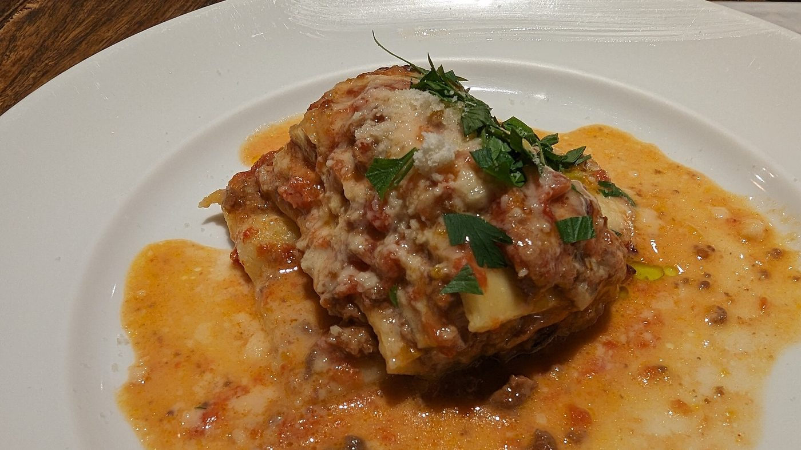
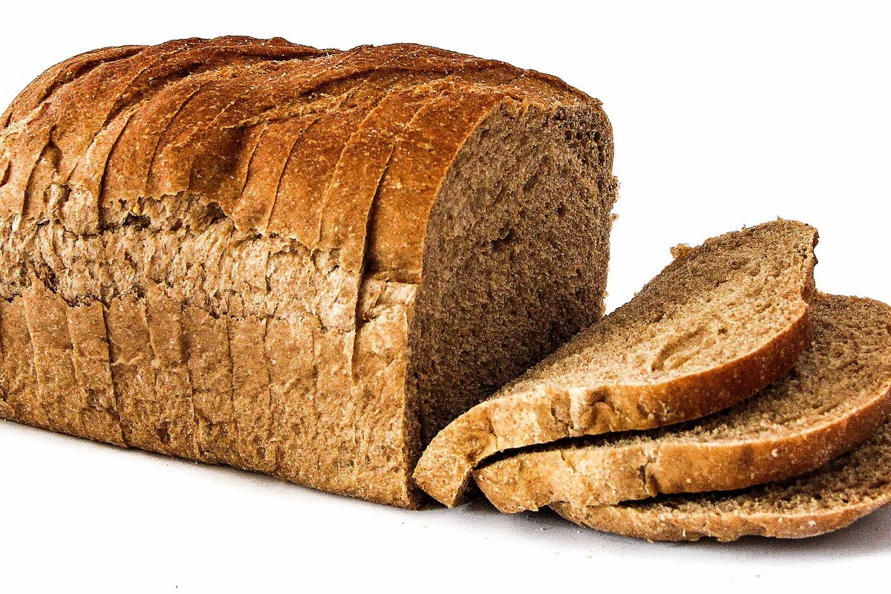
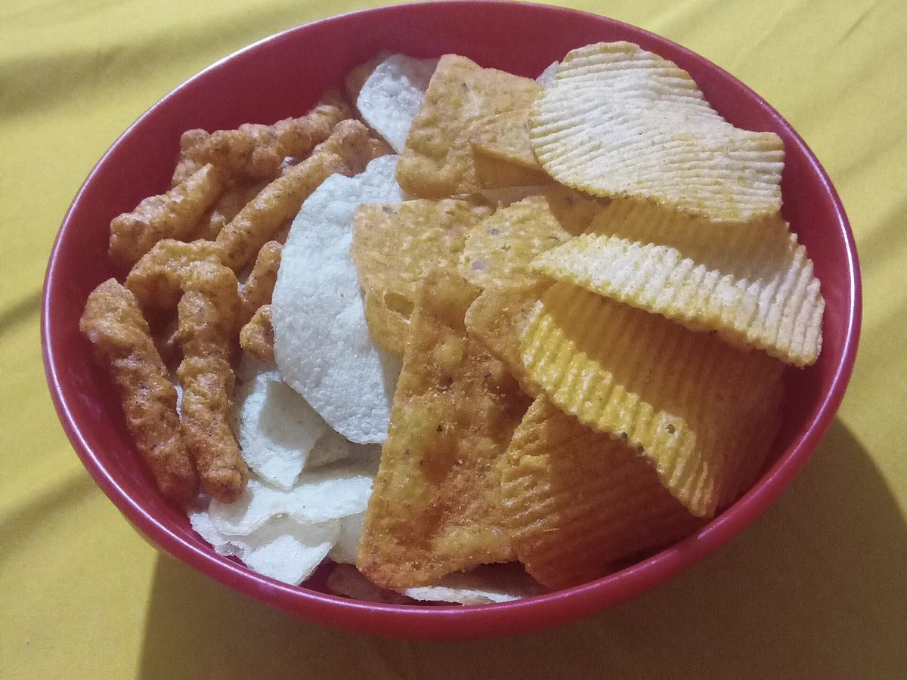
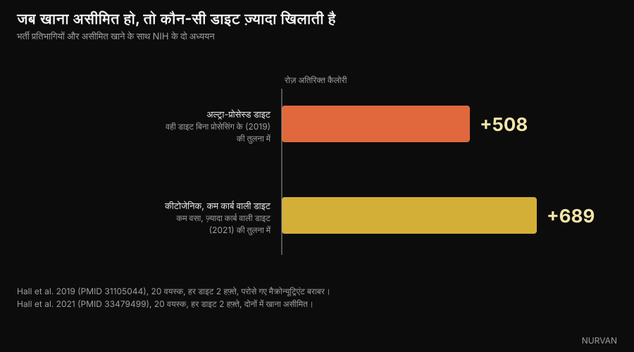

# क्या कार्ब्स से वजन बढ़ता है? असली चर्बी कहाँ छिपी है

Di [Giammaria Loi](/autore/giammaria-loi) · 6 अक्टूबर 2026 को अपडेट

इटली के पोषण शिक्षक आंद्रेया बियाशी की एक खूब शेयर हुई पोस्ट कहती है कि जिन्हें हम «कार्ब्स» कहते हैं, उन खाद्य पदार्थों में अक्सर वसा भरी होती है, और जो लोग कार्ब्स छोड़कर वजन घटाते हैं वे दरअसल कैलोरी घटा रहे होते हैं। पहली बात हमने सरकारी पोषण तालिकाओं में एक-एक चीज़ देखकर जाँची, और दूसरी को अस्पताल में हुए नियंत्रित अध्ययनों से। ज़्यादातर बात टिकती है, पर आँकड़े «समस्या कार्ब्स नहीं हैं» से ज़्यादा सटीक बात कहते हैं।

## संक्षेप में

- **लज़ानिया में 49% कैलोरी वसा से आती है और सिर्फ़ 27% कार्ब्स से।** यह कार्ब्स वाला व्यंजन नहीं, थोड़ी पास्ता शीट वाला वसा का व्यंजन है। CREA डेटा, गणना हमारी।
- **पैकेट वाले चिप्स में 51% कैलोरी वसा से, चीज़ क्रैकर में 45%, चॉकलेट वेफ़र में 47%।** ये सब दिमाग़ में «कार्ब्स» वाले खाने में दर्ज हैं।
- **लेकिन सफ़ेद ब्रेड में वसा से सिर्फ़ 2% कैलोरी आती है और पकी पास्ता में 3%।** यही वह बारीकी है जो पोस्ट में नहीं है: समस्या कार्ब्स की श्रेणी नहीं, खाने की प्रोसेसिंग का स्तर है।
- **मिठास सचमुच वसा के एहसास को ढक देती है।** पोस्ट में बताया गया 1990 का अध्ययन मौजूद है और उसका नाम ही *Invisible fats* है: जितनी ज़्यादा चीनी, उतनी कम वसा लोगों ने महसूस की — जबकि असली वसा उतनी ही थी।
- **कार्ब्स हटाने से कम नहीं खाया जाता।** NIH के एक अध्ययन में, जहाँ खाना असीमित था, कम वसा वाली डाइट पर लोगों ने कीटोजेनिक डाइट से रोज़ 689 कैलोरी कम खाईं। घाटा मैक्रोन्यूट्रिएंट नहीं बनाता।

*लज़ानिया सबसे साफ़ उदाहरण है: 100 ग्राम में 196 कैलोरी, जिनमें 49% वसा से और सिर्फ़ 27% कार्ब्स से। फ़ोटो: Syced, Wikimedia Commons, CC0।*

## «कार्ब्स» एक श्रेणी है, कोई थाली नहीं

रोज़मर्रा की भाषा में «कार्ब्स» **खाद्य पदार्थों** की एक श्रेणी बन गई है: पास्ता, ब्रेड, बिस्किट, केक, पिज़्ज़ा, चिप्स। पर इन चीज़ों की संरचना में कार्ब्स तीन मैक्रोन्यूट्रिएंट में से सिर्फ़ एक हैं — और अक्सर वह नहीं जो सबसे ज़्यादा कैलोरी देता है।

भ्रम एक ऐसे क़दम से पैदा होता है जो हानिरहित लगता है: अगर कोई चीज़ मुख्य रूप से आटे से बनी है, तो उसकी कैलोरी आटे से आएगी। ऐसा नहीं होता। एक ग्राम वसा 9 कैलोरी देता है, एक ग्राम कार्ब्स से दोगुने से भी ज़्यादा। कुछ ग्राम मक्खन, तेल या क्रीम ही एक सर्विंग का पूरा ऊर्जा संतुलन पलट देते हैं।

पोस्ट यह बात ठीक कहती है और एक सीधा सुझाव देती है: पोषण तालिकाएँ खोलकर देखो। हमने यही किया — उसी डेटाबेस से जो पहले से ऐप के भीतर मौजूद है।

## सरकारी तालिकाओं के आँकड़े

हमने **CREA** — इटली के खाद्य और पोषण अनुसंधान केंद्र — की खाद्य संरचना तालिकाएँ लीं और हर चीज़ के लिए निकाला कि कितनी कैलोरी किस मैक्रोन्यूट्रिएंट से आती है। गणित बहुत सीधा है: कार्ब्स के ग्राम × 4, प्रोटीन के ग्राम × 4, वसा के ग्राम × 9, फिर अनुपात देखिए।

*रोज़मर्रा के 11 खाद्य पदार्थों में कैलोरी कहाँ से आती है। डेटा: CREA, इटली की खाद्य संरचना तालिकाएँ, 2019 संस्करण। गणना और ग्राफ़: Nurvan।*

नतीजा पोस्ट के इशारे से भी ज़्यादा साफ़ है। **लज़ानिया** में कार्ब्स 27% कैलोरी देते हैं और वसा 49%: इसे कार्ब्स वाला व्यंजन कहना सीधे-सीधे ग़लत है। **पैकेट वाले चिप्स** 51% तक पहुँचते हैं, **हेज़लनट-कोको स्प्रेड** 53%, **चॉकलेट वेफ़र** 47%, **चीज़ क्रैकर** 45%।

| खाद्य पदार्थ (100 ग्राम) | कैलोरी | कार्ब्स | वसा | वसा से % कैलोरी |
|---|---|---|---|---|
| हेज़लनट-कोको स्प्रेड | 537 | 58.1 ग्राम | 32.4 ग्राम | **53%** |
| पैकेट वाले चिप्स | 512 | 58.0 ग्राम | 29.6 ग्राम | **51%** |
| लज़ानिया | 196 | 13.4 ग्राम | 10.8 ग्राम | **49%** |
| चॉकलेट वेफ़र | 498 | 60.3 ग्राम | 26.6 ग्राम | **47%** |
| चीज़ क्रैकर | 498 | 59.2 ग्राम | 25.5 ग्राम | **45%** |
| क्रोसां | 403 | 54.7 ग्राम | 18.3 ग्राम | **40%** |
| कोको भरा केक | 410 | 65.5 ग्राम | 15.1 ग्राम | **32%** |
| ब्रेडस्टिक | 421 | 65.1 ग्राम | 13.9 ग्राम | **29%** |
| मक्खन बिस्किट | 426 | 71.7 ग्राम | 13.8 ग्राम | **28%** |
| पास्ता, पकी हुई | 175 | 37.3 ग्राम | 0.6 ग्राम | **3%** |
| सफ़ेद ब्रेड | 268 | 59.5 ग्राम | 0.5 ग्राम | **2%** |

*प्रति 100 ग्राम मान CREA तालिकाओं (2019 संस्करण) से; वसा से कैलोरी का प्रतिशत हमारी अपनी गणना है, 4/4/9 कैलोरी प्रति ग्राम के आधार पर।*

निष्कर्ष बदलने वाली आख़िरी दो पंक्तियाँ हैं। **सफ़ेद ब्रेड अपनी 2% कैलोरी वसा से लेती है, पकी पास्ता 3%।** ये लगभग वसा-रहित हैं। यही बात चावल, उबले आलू, दालों और फलों पर लागू होती है।

*सफ़ेद ब्रेड की 2% कैलोरी वसा से आती है, पकी पास्ता की 3%। बिना प्रोसेस किए कार्ब्स के स्रोत समस्या नहीं हैं। फ़ोटो: FranHogan, Wikimedia Commons, CC BY-SA 4.0।*

इसलिए सही वाक्य यह नहीं है कि «कार्ब्स भी वसा हैं», बल्कि यह: **कोई चीज़ जितनी ज़्यादा मिश्रित और प्रोसेस्ड होगी, उतनी ज़्यादा वसा साथ लाएगी — चाहे हमने उसे किसी भी श्रेणी में रखा हो।** ब्रेडस्टिक ब्रेड नहीं है, केक ब्रेड नहीं है, लज़ानिया पास्ता नहीं है। जो पास्ता तौलता है पर ग्रेवी नहीं, वह थाली का सबसे कम कैलोरी वाला हिस्सा नाप रहा है।

## आपको पता क्यों नहीं चलता: चीनी वसा को ढक देती है

पोस्ट 1990 के ड्रेवनोव्स्की और श्वार्ट्ज़ के अध्ययन का हवाला देती है। वह मौजूद है, हमने उसे खोलकर देखा: नाम है *Invisible fats* — अदृश्य वसा — और यह *Appetite* पत्रिका में छपा है।

सामान्य वज़न वाली पचास छात्राओं ने केक की फ्रॉस्टिंग जैसी पंद्रह तैयारियाँ चखीं, जिनमें चीनी 20% से 77% तक और मक्खन 15% से 35% तक था, और मिठास तथा वसा की मात्रा को अंक दिए। महसूस की गई मिठास चीनी के साथ-साथ चली। महसूस की गई वसा नहीं: **चीनी बढ़ने पर नमूने कम वसा वाले आँके गए, जबकि मक्खन उतना ही था।**

लेखक ठीक वही निष्कर्ष देते हैं जो हमें चाहिए: यही तंत्र समझा सकता है कि इतनी सारी वसा-भरी मिठाइयाँ «कार्ब्स वाले» खाने क्यों मानी जाती हैं। यह छोटे नमूने पर किया गया संवेदी प्रयोग है: यह साबित नहीं करता कि आप ज़्यादा मोटे होते हैं, यह साबित करता है कि आपको पता नहीं चलता।

*पैकेट वाले नमकीन स्नैक्स में कैलोरी का सबसे बड़ा हिस्सा वसा है, पर जो स्वाद पहचान में आता है वह कुरकुरे हिस्से का है। फ़ोटो: Toby Scratch Fanatic, Wikimedia Commons, CC0।*

ज़्यादा नया काम 2018 का है, *Cell Metabolism* में। असली नीलामी और फंक्शनल एमआरआई के साथ, प्रतिभागी वसा और कार्ब्स दोनों वाले खाने के लिए **ज़्यादा पैसे देने को तैयार थे** — उतने ही जाने-पहचाने, उतने ही पसंदीदा और उतनी ही कैलोरी वाले, सिर्फ़ वसा या सिर्फ़ कार्ब्स वाले खाने की तुलना में। और वसा वाले खाने की ऊर्जा घनता वे **बेहतर** आँकते थे, मिश्रित खाने की **ख़राब**।

संक्षेप में: बराबर कैलोरी पर यह मेल ज़्यादा भाता है और दिमाग़ इसे सबसे ख़राब आँकता है। चीनी और वसा को जोड़ने वाला औद्योगिक उत्पाद ठीक इसी अंधे कोने में बैठता है।

## तो फिर कार्ब्स छोड़ने से वज़न घटता क्यों है?

यहाँ पोस्ट सही निष्कर्ष पर पहुँचती है — बात कैलोरी घाटे की है, कार्ब्स हटाने की नहीं — पर रास्ते में कुछ आँकड़े चाहिए, क्योंकि शोध उतना एकमत नहीं है जितना दिखता है।

सबसे बड़ा और सबसे नियंत्रित अध्ययन **DIETFITS** है, 2018 में *JAMA* में छपा: अधिक वज़न वाले 609 वयस्क, बारह महीने, 22 समूह सत्र, कम वसा वाली डाइट बनाम कम कार्ब वाली डाइट, दोनों अच्छी गुणवत्ता के खाने पर बनी। नतीजा: −5.3 किलो बनाम −6.0 किलो। 0.7 किलो का अंतर सांख्यिकीय रूप से महत्वपूर्ण नहीं है। न जीन पैटर्न और न इंसुलिन स्राव यह बता सका कि किसे कौन-सी डाइट ज़्यादा सूट करेगी।

असल ज़िंदगी के अध्ययनों के मेटा-विश्लेषण कम तटस्थ हैं: 6-12 महीनों पर वे कम कार्ब वाली डाइट को थोड़ी बढ़त देते हैं — 38 अध्ययनों और 6,499 वयस्कों पर 2020 की समीक्षा में **1.3 किलो**, 2016 की एक समीक्षा में **2.2 किलो**। बढ़त असली है पर मामूली, और दोनों में LDL कोलेस्ट्रॉल बढ़ने के साथ आती है।

बहस को सचमुच बंद करने वाला आँकड़ा अलग है, और पोस्ट उसका ज़िक्र नहीं करती। 2021 में केविन हॉल की टीम ने बीस वयस्कों को NIH के क्लिनिकल सेंटर में भर्ती किया और उन्हें दो-दो हफ़्ते कीटोजेनिक डाइट (10% कार्ब्स) और कम वसा वाली डाइट (10% वसा, 75% कार्ब्स) दी, **दोनों में खाना असीमित रखते हुए**।

*जब जितना चाहो उतना खाने की छूट हो, तो कैलोरी घटाने वाली चीज़ कार्ब्स हटाना नहीं है। डेटा: Hall et al. 2019 और 2021। ग्राफ़: Nurvan।*

अगर «कार्ब्स से ज़्यादा खाया जाता है» सही होता, तो कीटोजेनिक समूह में कम कैलोरी दर्ज होतीं। हुआ उल्टा: कम वसा वाली डाइट पर प्रतिभागियों ने कीटोजेनिक की तुलना में **रोज़ 689 कैलोरी कम** खाईं, और आख़िरी हफ़्ते 544 कम।

उलटी जाँच उसी टीम का 2019 का अध्ययन है: बीस भर्ती प्रतिभागी, दो हफ़्ते अल्ट्रा-प्रोसेस्ड डाइट और दो हफ़्ते बिना प्रोसेस वाली, जिसमें परोसी गई कैलोरी, ऊर्जा घनता, मैक्रोन्यूट्रिएंट, चीनी, सोडियम और फ़ाइबर बराबर रखे गए। अल्ट्रा-प्रोसेस्ड पर उन्होंने **रोज़ 508 कैलोरी ज़्यादा** खाईं और दो हफ़्ते में 0.9 किलो बढ़े; दूसरी पर 0.9 किलो घटे।

लीवर मैक्रोन्यूट्रिएंट नहीं है। लीवर वह रूप है जिसमें आप उसे खाते हैं। कम कार्ब वाली डाइट अपनाकर वज़न घटाने वाले ज़्यादातर लोगों ने दरअसल केक, क्रैकर, चिप्स और स्प्रेड खाना बंद किया है — यानी उन्होंने वसा और कैलोरी हटाई, ठीक जैसा पोस्ट कहती है, सिर्फ़ कार्ब्स नहीं।

## शोध असल में क्या कहता है

- **पुष्ट** — «कार्ब्स समझे जाने वाले कई खाद्य पदार्थों में काफ़ी वसा होती है।» — CREA डेटा से पुष्ट: लज़ानिया में 49% कैलोरी वसा से, पैकेट चिप्स में 51%, चीज़ क्रैकर में 45%, चॉकलेट वेफ़र में 47%।
- **स्पष्टीकरण ज़रूरी** — «समस्या कार्ब्स नहीं हैं।» — सही है, पर इसे बेहतर कहना चाहिए: बिना प्रोसेस किए कार्ब्स स्रोतों में लगभग वसा होती ही नहीं (सफ़ेद ब्रेड 2% कैलोरी, पकी पास्ता 3%)। मायने रखने वाला चर मैक्रोन्यूट्रिएंट नहीं, बल्कि यह है कि खाना कितना मिश्रित और प्रोसेस्ड है।
- **पुष्ट** — «मीठा स्वाद वसा के एहसास को ढक देता है (ड्रेवनोव्स्की और श्वार्ट्ज़, 1990)।» — अध्ययन मौजूद है, नाम *Invisible fats* है, और नतीजा वैसा ही है: ज़्यादा चीनी, कम महसूस होती वसा, जबकि असली वसा उतनी ही। पचास प्रतिभागी और प्रयोगशाला की फ्रॉस्टिंग: यह संवेदी नतीजा है, वज़न का नहीं।
- **पुष्ट** — «चीनी और वसा का मेल स्वाद को बढ़ाता है।» — पुष्ट और और मज़बूत: *Cell Metabolism* के 2018 के अध्ययन में, बराबर कैलोरी, परिचय और पसंद पर, लोग वसा और कार्ब्स दोनों वाले खाने के लिए ज़्यादा पैसे देते हैं।
- **स्पष्टीकरण ज़रूरी** — «वज़न का फ़ायदा ऊर्जा घाटे से आता है, कार्ब्स हटाने से नहीं।» — 609 लोगों पर DIETFITS पोस्ट की बात का समर्थन करता है (12 महीनों में 0.7 किलो का अंतर, महत्वपूर्ण नहीं), पर असल ज़िंदगी के मेटा-विश्लेषण अब भी कम कार्ब को 6-12 महीनों पर 1.3 से 2.2 किलो की छोटी बढ़त देते हैं।
- **ग़लत साबित** — «कार्ब्स हटाने से अपने आप कम खाया जाता है।» — यह लो-कार्ब वाली ज़्यादातर बातों के पीछे छिपी धारणा है, और अस्पताल के वार्ड में उल्टा होता है: खाना असीमित होने पर कम वसा वाली डाइट ने कीटोजेनिक से रोज़ 689 कैलोरी कम दीं।
- **स्पष्टीकरण ज़रूरी** — «खाना ट्रैक करने के लिए ऐप इस्तेमाल करना यह समझने में मदद करता है कि कैलोरी किस मैक्रोन्यूट्रिएंट से आ रही है।» — हाँ, और यही पोस्ट की सबसे काम की सलाह है। एक बारीकी के साथ: अंदाज़ा सबसे ख़राब ठीक उन्हीं चीज़ों पर लगता है जो वसा और कार्ब्स दोनों जोड़ती हैं, इसलिए लिखा हुआ आँकड़ा चाहिए, एहसास नहीं।

## इसे कैसे लागू करें

1. **वसा वाली पंक्ति पढ़िए, कार्ब्स वाली नहीं।** लेबल पर वसा के ग्राम को 9 से गुणा कीजिए और उसी सर्विंग की कैलोरी से भाग दीजिए: अगर 0.35 से ज़्यादा आए तो वसा ही मुख्य मद है, चीज़ का नाम चाहे जो हो।
2. **बुनियादी स्रोतों और उत्पादों को अलग कीजिए।** ब्रेड, पास्ता, चावल, आलू और दालों में लगभग वसा नहीं होती। ब्रेडस्टिक, क्रैकर, बिस्किट, केक, क्रोसां और स्प्रेड अलग चीज़ हैं: एक ही शेल्फ़, अलग संरचना।
3. **ग्रेवी तौलिए, सिर्फ़ बेस नहीं।** लज़ानिया, पेस्तो पास्ता और कार्बोनारा में लगभग सारी कैलोरी वहीं होती है। दिन के कुल में सबसे बड़ा फ़र्क़ यही बदलाव लाता है, और यह पूरा एक खाद्य समूह हटाने से कम मेहनत माँगता है।
4. **दो हफ़्ते दर्ज कीजिए, फिर चाहें तो रोक दीजिए।** हमेशा ट्रैक करने की ज़रूरत नहीं — बस इतना कि पता चल जाए कि कैलोरी असल में कहाँ जाती है। लगभग सबको चौंकाने वाली बात उसी एक कॉलम में मिलती है।
5. **कैलोरी घटाते समय प्रोटीन ऊँचा रखिए।** कैलोरी गिरने पर मांसपेशी बचाने वाला लीवर यही है: इस पर हमने [कटिंग में कितना प्रोटीन चाहिए](/hi/blog/protein-for-fat-loss-phase) वाले लेख में बात की है।
6. **वही डाइट चुनिए जिसे आप निभा सकें।** बराबर घाटे पर कम कार्ब और कम वसा बारह महीनों में बहुत मिलते-जुलते नतीजे देती हैं। निभाना प्रोटोकॉल के नाम से ज़्यादा मायने रखता है।

ये आबादी के औसत आँकड़े हैं, कोई निजी योजना नहीं। अगर आपको मधुमेह, लिपिड की गड़बड़ी या खानपान संबंधी विकार है, या आप कोई इलाज ले रहे हैं, तो खानपान बदलने से पहले अपने डॉक्टर या पोषण विशेषज्ञ से बात कीजिए।

> **Nurvan — छिपी चर्बी लेबल पर नहीं, डायरी में दिखती है**
>
> Nurvan का खाद्य डेटाबेस आधिकारिक CREA तालिकाओं पर चलता है: लज़ानिया की एक सर्विंग या क्रैकर दर्ज कीजिए और तुरंत दिख जाएगा कि कितनी कैलोरी वसा से आईं और कितनी कार्ब्स से — सिर्फ़ कुल नहीं। रोज़ का मैक्रो बँटवारा अपने आप अपडेट होता है, और चुपचाप बढ़ता वह कॉलम चौंकाना बंद कर देता है।
>
> [Nurvan आज़माएँ](https://nurvan.app)

## अक्सर पूछे जाने वाले सवाल

**क्या कार्ब्स से वज़न बढ़ता है?**

किसी भी दूसरे कैलोरी स्रोत से ज़्यादा नहीं। वज़न लंबे समय के ऊर्जा अधिशेष से बढ़ता है। «कार्ब्स वाले खाने» का वज़न बढ़ने से जुड़ाव इसलिए है कि उनमें से कई — केक, क्रैकर, चिप्स, स्प्रेड — CREA तालिकाओं के अनुसार अपनी 30% से 53% कैलोरी वसा से लेते हैं।

**लज़ानिया की कितनी कैलोरी कार्ब्स से आती है?**

27%। वसा 49% देती है और प्रोटीन 24%, CREA तालिकाओं के अनुसार प्रति 100 ग्राम 196 कैलोरी में से। इसीलिए इसे कार्ब्स वाला व्यंजन कहना भ्रामक है।

**लेबल देखकर कैसे पता करें कि कोई चीज़ वसा-भरी है?**

वसा के ग्राम को 9 से गुणा कीजिए, उसी सर्विंग की कैलोरी से भाग दीजिए और प्रतिशत देखिए। लगभग 35% से ऊपर वसा ही मुख्य योगदान है, भले उत्पाद आटे या चीनी से बना लगे।

**क्या लो कार्ब डाइट कम वसा वाली डाइट से बेहतर है?**

सबसे बड़े नियंत्रित अध्ययन DIETFITS (609 लोग) में बारह महीनों का अंतर 0.7 किलो था और महत्वपूर्ण नहीं। असल ज़िंदगी के मेटा-विश्लेषण लो कार्ब को छोटी बढ़त (1.3 से 2.2 किलो) देते हैं, पर साथ में LDL कोलेस्ट्रॉल भी बढ़ता है। कहीं ज़्यादा मायने यह रखता है कि आप किसे निभा सकते हैं।

**क्या वज़न घटाने के लिए ब्रेड और पास्ता छोड़ना ज़रूरी है?**

नहीं। ब्रेड और पास्ता क्रमशः अपनी 2% और 3% कैलोरी वसा से लेते हैं: वे समस्या नहीं हैं। ज़्यादातर लोगों के लिए सबसे बड़ी गुंजाइश ग्रेवी और पैकेट वाले उत्पादों में है।

## यह भी पढ़ें

- [कटिंग में प्रोटीन: असल में कितना चाहिए](/hi/blog/protein-for-fat-loss-phase) — कैलोरी घटने पर मांसपेशी बचाने वाला पोषण का लीवर।
- [ठंडा चावल: रेज़िस्टेंट स्टार्च कितना मायने रखता है](/hi/blog/thanda-chawal-resistant-starch) — एक और मामला जहाँ असली आँकड़े सुर्खी से छोटे निकलते हैं।
- [CBL-514: चर्बी घटाने वाली दवा, शोध क्या कहते हैं](/hi/blog/cbl-514-charbi-injection) — जब चर्बी पर दूसरी तरफ़ से हमला किया जाए तो क्या होता है।

## स्रोत

1. Drewnowski A, Schwartz M, 1990. *Invisible fats: sensory assessment of sugar/fat mixtures.* Appetite 14(3):203-217. PMID 2369116 — [DOI](https://doi.org/10.1016/0195-6663(90)90088-p)
2. DiFeliceantonio AG, Coppin G, Rigoux L, Edwin Thanarajah S, Dagher A, Tittgemeyer M, Small DM, 2018. *Supra-Additive Effects of Combining Fat and Carbohydrate on Food Reward.* Cell Metabolism 28(1):33-44. PMID 29909968 — [DOI](https://doi.org/10.1016/j.cmet.2018.05.018)
3. Hall KD, Guo J, Courville AB et al., 2021. *Effect of a plant-based, low-fat diet versus an animal-based, ketogenic diet on ad libitum energy intake.* Nature Medicine 27(2):344-353. PMID 33479499 — [DOI](https://doi.org/10.1038/s41591-020-01209-1)
4. Hall KD, Ayuketah A, Brychta R et al., 2019. *Ultra-Processed Diets Cause Excess Calorie Intake and Weight Gain: An Inpatient Randomized Controlled Trial of Ad Libitum Food Intake.* Cell Metabolism 30(1):67-77. PMID 31105044 — [DOI](https://doi.org/10.1016/j.cmet.2019.05.008)
5. Gardner CD, Trepanowski JF, Del Gobbo LC et al., 2018. *Effect of Low-Fat vs Low-Carbohydrate Diet on 12-Month Weight Loss in Overweight Adults: The DIETFITS Randomized Clinical Trial.* JAMA 319(7):667-679. PMID 29466592 — [DOI](https://doi.org/10.1001/jama.2018.0245)
6. Chawla S, Tessarolo Silva F, Amaral Medeiros S, Mekary RA, Radenkovic D, 2020. *The Effect of Low-Fat and Low-Carbohydrate Diets on Weight Loss and Lipid Levels: A Systematic Review and Meta-Analysis.* Nutrients 12(12):3774. PMID 33317019 — [DOI](https://doi.org/10.3390/nu12123774)
7. Mansoor N, Vinknes KJ, Veierød MB, Retterstøl K, 2016. *Effects of low-carbohydrate diets v. low-fat diets on body weight and cardiovascular risk factors: a meta-analysis of randomised controlled trials.* British Journal of Nutrition 115(3):466-479. PMID 26768850 — [DOI](https://doi.org/10.1017/S0007114515004699)
8. CREA — खाद्य और पोषण अनुसंधान केंद्र (इटली)। *खाद्य संरचना तालिकाएँ*, 2019 संस्करण — [alimentinutrizione.it](https://www.alimentinutrizione.it/tabelle-nutrizionali/ricerca-per-ordine-alfabetico)। प्रति 100 ग्राम मानों का स्रोत; मैक्रोन्यूट्रिएंट के अनुसार कैलोरी के प्रतिशत Nurvan की गणना हैं।

> वैज्ञानिक स्रोत PubMed से लिए गए और 6 अक्टूबर 2026 को जाँचे गए। संरचना के मान CREA की आधिकारिक तालिकाओं से हैं, जो पहले से Nurvan के खाद्य डेटाबेस में शामिल हैं।

> शुरुआती बिंदु: कार्ब्स और वज़न बढ़ने पर [आंद्रेया बियाशी](https://www.instagram.com/p/Dd_OSqQiFfi/) की 3 अक्टूबर 2026 की पोस्ट। इस लेख का टेक्स्ट, ढाँचा, CREA डेटा पर की गई गणनाएँ, जाँच और ग्राफ़ मौलिक हैं।

**जामारिया लोई** Nurvan के संस्थापक हैं। वे 2012 से वेट ट्रेनिंग करते हैं, 2013 से FIPE-प्रमाणित पर्सनल ट्रेनर और कोच के रूप में काम करते हैं, और 2018 से राष्ट्रीय स्तर पर पावरलिफ्टिंग में हिस्सा लेते हैं। उनके हर लेख की शुरुआत शोध से होती है और अंत उस पर होता है जो जिम में सचमुच काम करता है।

> नोट: यह जानकारी देने वाली सामग्री है, डॉक्टर या योग्य पेशेवर की सलाह का विकल्प नहीं। दिए गए मान खाद्य संरचना के औसत और विशिष्ट आबादियों पर हुए अध्ययनों के औसत नतीजे हैं: ये कोई निजी आहार योजना नहीं हैं।
