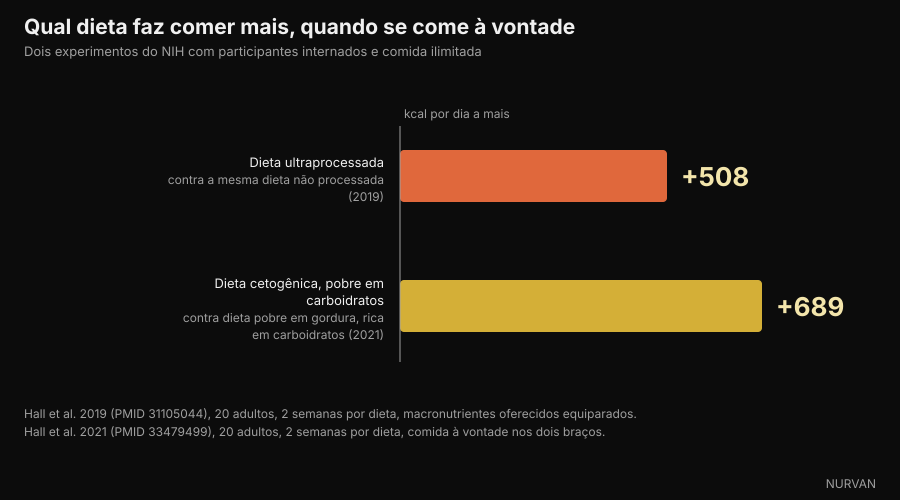

# Carboidratos engordam? Onde a gordura se esconde de verdade

Di [Giammaria Loi](/autore/giammaria-loi) · atualizado em 6 de outubro de 2026

Um post muito compartilhado do divulgador italiano Andrea Biasci afirma que os alimentos que chamamos de "carboidratos" costumam estar cheios de gordura, e que quem emagrece cortando carboidratos está na verdade cortando calorias. Verificamos a primeira parte alimento por alimento nas tabelas oficiais de composição, e a segunda nos ensaios feitos com participantes internados. Quase tudo se sustenta, mas os números dizem algo mais preciso do que "não são os carboidratos".

## Em resumo

- **Na lasanha, 49% das calorias vêm da gordura e só 27% dos carboidratos.** Não é um prato de carboidrato: é um prato de gordura com um pouco de massa dentro. Dados CREA, cálculo nosso.
- **As batatas fritas de pacote estão em 51% de calorias de gordura, as bolachas de queijo em 45%, o wafer de chocolate em 47%.** Todos arquivados mentalmente como "carboidratos".
- **Mas o pão branco está em 2% de calorias de gordura e a massa cozida em 3%.** Aqui está a nuance que o post não faz: o problema não é a categoria carboidrato, é o grau de processamento do alimento.
- **O açúcar realmente mascara a percepção da gordura.** O estudo de 1990 citado no post existe e se chama *Invisible fats*: quanto mais açúcar, menos gordura as pessoas percebiam, com a mesma gordura real.
- **Tirar os carboidratos não faz comer menos.** Num ensaio do NIH com comida ilimitada, a dieta pobre em gordura levou a comer 689 kcal por dia a menos que a cetogênica. O déficit não é criado pelo macronutriente.

*A lasanha é o exemplo mais claro: 196 kcal por 100 g, das quais 49% vêm da gordura e só 27% dos carboidratos. Foto: Syced, Wikimedia Commons, CC0.*

## "Carboidratos" é uma categoria, não um prato

Na linguagem do dia a dia, "os carboidratos" viraram uma categoria de **alimentos**: a massa, o pão, as bolachas, os bolinhos, a pizza, as batatas fritas. Dentro desses alimentos, porém, o carboidrato é apenas um dos três macronutrientes presentes — e muitas vezes não é o que mais traz calorias.

A confusão nasce de um passo que parece inofensivo: se um alimento é feito sobretudo de farinha, suas calorias vêm da farinha. Não funciona assim. Um grama de gordura traz 9 kcal, mais do que o dobro de um grama de carboidrato. Bastam poucos gramas de manteiga, óleo ou creme para virar o balanço energético de uma porção.

O post diz isso bem e propõe algo simples: abrir as tabelas nutricionais. Fizemos exatamente isso, com um banco de dados que já temos dentro do app.

## Os números das tabelas oficiais

Pegamos as tabelas de composição de alimentos do **CREA**, o centro italiano de pesquisa em alimentos e nutrição, e calculamos, para cada alimento, quanto das calorias vem de cada macronutriente. A conta é elementar: gramas de carboidrato × 4, gramas de proteína × 4, gramas de gordura × 9, e depois se olha a proporção.

*De onde vêm as calorias em 11 alimentos do dia a dia. Dados: CREA, tabelas italianas de composição de alimentos, atualização 2019. Cálculo e gráfico da Nurvan.*

O resultado é mais contundente do que o post sugere. Na **lasanha** os carboidratos trazem 27% das calorias e a gordura 49%: chamar de prato de carboidrato é simplesmente errado. As **batatas fritas de pacote** chegam a 51% de calorias de gordura, o **creme de avelã com cacau** a 53%, o **wafer de chocolate** a 47%, as **bolachas de queijo** a 45%.

| Alimento (100 g) | kcal | Carboidratos | Gorduras | % kcal de gordura |
|---|---|---|---|---|
| Creme de avelã com cacau | 537 | 58,1 g | 32,4 g | **53%** |
| Batata frita de pacote | 512 | 58,0 g | 29,6 g | **51%** |
| Lasanha | 196 | 13,4 g | 10,8 g | **49%** |
| Wafer de chocolate | 498 | 60,3 g | 26,6 g | **47%** |
| Bolachas de queijo | 498 | 59,2 g | 25,5 g | **45%** |
| Croissant | 403 | 54,7 g | 18,3 g | **40%** |
| Bolinho recheado de cacau | 410 | 65,5 g | 15,1 g | **32%** |
| Palitos de pão | 421 | 65,1 g | 13,9 g | **29%** |
| Bolachas amanteigadas | 426 | 71,7 g | 13,8 g | **28%** |
| Massa cozida | 175 | 37,3 g | 0,6 g | **3%** |
| Pão branco | 268 | 59,5 g | 0,5 g | **2%** |

*Valores por 100 g das tabelas CREA (atualização 2019); o percentual de calorias de gordura é um cálculo nosso sobre 4/4/9 kcal por grama.*

As duas últimas linhas é que mudam a conclusão. **O pão branco tira 2% das suas calorias da gordura e a massa cozida 3%.** São praticamente isentos de gordura. O mesmo vale para arroz, batata cozida, leguminosas e frutas.

*O pão branco tira 2% das suas calorias da gordura, a massa cozida 3%. As fontes de carboidrato não processadas não são o problema. Foto: FranHogan, Wikimedia Commons, CC BY-SA 4.0.*

A frase correta, portanto, não é "carboidrato também é gordura", mas: **quanto mais composto e processado é um alimento, mais gordura ele carrega, seja qual for a categoria em que o colocamos.** O palito de pão não é pão, o bolinho não é pão, a lasanha não é massa. Quem pesa a massa mas não o molho está medindo a parte menos calórica do prato.

## Por que você não percebe: o açúcar cobre a gordura

O post cita um estudo de 1990 de Drewnowski e Schwartz. Ele existe, nós o abrimos: chama-se *Invisible fats* — gorduras invisíveis — e foi publicado na *Appetite*.

Cinquenta estudantes eutróficas provaram quinze preparações parecidas com coberturas de bolo, com açúcar de 20% a 77% e manteiga de 15% a 35%, e deram notas para doçura e teor de gordura. A doçura percebida acompanhava fielmente o açúcar. A gordura percebida, não: **com mais açúcar, as amostras eram julgadas menos gordurosas, contendo a mesma manteiga.**

Os autores concluem exatamente o que nos interessa: o mecanismo pode explicar por que tantos doces ricos em gordura são vistos como alimentos "à base de carboidrato". É um experimento sensorial com amostra pequena: não prova que você engorda mais, prova que você não percebe.

*Nos salgadinhos industrializados a gordura é a maior parcela, mas o sabor que você reconhece é o da parte crocante. Foto: Toby Scratch Fanatic, Wikimedia Commons, CC0.*

A peça mais recente é de 2018, na *Cell Metabolism*. Com um leilão real e ressonância magnética funcional, os participantes se dispunham a **pagar mais** por alimentos que uniam gordura e carboidrato do que por alimentos igualmente familiares, igualmente apreciados e com as mesmas calorias feitos só de gordura ou só de carboidrato. E estimavam **melhor** a densidade energética dos alimentos gordurosos e **pior** a dos mistos.

Em resumo: a combinação agrada mais a calorias iguais e ainda é a que o cérebro avalia pior. O produto industrial que une açúcar e gordura cai exatamente no ponto cego.

## Então por que se emagrece tirando carboidratos?

Aqui o post chega à conclusão certa — é o déficit calórico, não a eliminação dos glicídios — mas o caminho merece alguns números, porque a literatura não é tão unânime quanto parece.

O ensaio maior e mais controlado é o **DIETFITS**, publicado no *JAMA* em 2018: 609 adultos com sobrepeso, doze meses, 22 encontros em grupo, dieta pobre em gordura contra dieta pobre em carboidrato, ambas construídas com comida de qualidade. Resultado: −5,3 kg contra −6,0 kg. A diferença de 0,7 kg não é estatisticamente significativa. Nem o perfil genético nem a secreção de insulina permitiram prever quem respondia melhor a qual dieta.

As metanálises de estudos na vida real são menos neutras: aos 6-12 meses encontram uma pequena vantagem low carb, **1,3 kg** numa revisão de 2020 sobre 38 estudos e 6.499 adultos, **2,2 kg** numa de 2016. Vantagem real, mas modesta, e nas duas acompanhada de aumento do colesterol LDL.

O dado que fecha o debate é outro, e o post não o cita. Em 2021 o grupo de Kevin Hall internou vinte adultos no centro clínico do NIH e lhes deu, por duas semanas cada, uma dieta cetogênica (10% de carboidrato) e uma dieta pobre em gordura (10% de gordura, 75% de carboidrato), **com comida ilimitada nos dois casos**.

*Quando se pode comer o quanto quiser, não é tirar os carboidratos que faz as calorias caírem. Dados: Hall et al. 2019 e 2021. Gráfico da Nurvan.*

Se a hipótese "os carboidratos fazem comer mais" fosse verdadeira, o braço cetogênico deveria ter registrado menos calorias. Aconteceu o contrário: com a dieta pobre em gordura os participantes comeram **689 kcal por dia a menos** que na cetogênica, e 544 a menos na última semana.

A contraprova é o estudo de 2019 do mesmo grupo: vinte internados, duas semanas de dieta ultraprocessada e duas de dieta não processada, com calorias oferecidas, densidade energética, macronutrientes, açúcares, sódio e fibra equiparados. Com a ultraprocessada comeram **508 kcal por dia a mais** e ganharam 0,9 kg em duas semanas; com a outra perderam 0,9.

O macronutriente não é a alavanca. A forma em que você o come, sim. Quem emagrece passando a uma dieta pobre em carboidratos, na maioria dos casos, parou de comer bolinhos, bolachas, batatas fritas e cremes de passar — ou seja, tirou gordura e calorias, como escreve o post, não apenas glicídios.

## O que a pesquisa realmente diz

- **Confirmado** — "Muitos alimentos percebidos como carboidrato contêm quantidades relevantes de gordura." — Confirmado nos dados CREA: lasanha 49% das calorias de gordura, batata frita de pacote 51%, bolachas de queijo 45%, wafer de chocolate 47%.
- **Com ressalvas** — "O problema não são os carboidratos." — Verdade, mas precisa ser dito melhor: as fontes de carboidrato não processadas quase não têm gordura (pão branco 2% das calorias, massa cozida 3%). A variável que conta não é o macronutriente, é o quanto o alimento é composto e processado.
- **Confirmado** — "O gosto doce mascara a percepção da gordura (Drewnowski e Schwartz, 1990)." — O estudo existe, chama-se *Invisible fats*, e o resultado é o relatado: mais açúcar, menos gordura percebida com a mesma gordura real. Cinquenta participantes e coberturas experimentais: é um dado sensorial, não um dado sobre o peso.
- **Confirmado** — "A combinação de açúcares e gorduras aumenta a palatabilidade." — Confirmado e reforçado: no estudo de 2018 na *Cell Metabolism* as pessoas pagam mais por alimentos que unem gordura e carboidrato, com calorias, familiaridade e preferência equiparadas.
- **Com ressalvas** — "O benefício sobre o peso vem do déficit energético, não da eliminação dos carboidratos." — O DIETFITS, com 609 pessoas, dá razão ao post (0,7 kg de diferença em 12 meses, não significativa), mas as metanálises da vida real ainda encontram uma pequena vantagem low carb, de 1,3 a 2,2 kg aos 6-12 meses.
- **Desmentido** — "Tirar os carboidratos faz comer espontaneamente menos." — É a ideia implícita em boa parte do discurso low carb, e em enfermaria acontece o contrário: com comida à vontade, a dieta pobre em gordura produziu 689 kcal por dia a menos que a cetogênica.
- **Com ressalvas** — "Usar um app para monitorar a alimentação ajuda a entender quais macronutrientes trazem as calorias." — Sim, e é o conselho mais útil do post. Com uma ressalva: é justamente nos alimentos que unem gordura e carboidrato que a estimativa no olho é a pior. Então é preciso o número escrito, não a sensação.

## Como aplicar

1. **Olhe a linha das gorduras, não a dos carboidratos.** No rótulo, multiplique os gramas de gordura por 9 e divida pelas calorias daquela mesma porção: se der mais de 0,35, a gordura é a maior parcela, seja qual for o nome do alimento.
2. **Separe as fontes dos produtos.** Pão, massa, arroz, batata e leguminosas quase não têm gordura. Palitos de pão, bolachas, biscoitos, bolinhos, croissants e cremes de passar são outra coisa: mesma prateleira, composição diferente.
3. **Pese o molho, não só a base.** Na lasanha, na massa ao pesto e na carbonara as calorias estão quase todas ali. É a intervenção que mais muda o total diário e custa menos esforço do que tirar um grupo alimentar inteiro.
4. **Registre por duas semanas e depois pare, se quiser.** Não é preciso registrar para sempre: só o tempo suficiente para descobrir onde suas calorias realmente vão parar. Quase todo mundo encontra a surpresa na mesma coluna.
5. **Mantenha a proteína alta enquanto corta.** É a alavanca que protege a massa muscular quando as calorias caem: falamos disso no artigo sobre [quanta proteína é preciso na definição](/pt/blog/proteina-na-definicao).
6. **Escolha a dieta que você consegue seguir.** Com o mesmo déficit, pobre em carboidrato e pobre em gordura dão resultados muito parecidos em doze meses. A adesão vale mais que o nome do protocolo.

Estes são dados médios de população, não um plano personalizado. Se você tem diabetes, dislipidemia, transtorno alimentar ou faz algum tratamento, converse com seu médico ou com um nutricionista antes de mudar a alimentação.

> **Nurvan — a gordura escondida você vê no diário, não no rótulo**
>
> O banco de alimentos da Nurvan usa as tabelas oficiais CREA: quando você registra uma porção de lasanha ou de bolachas, vê na hora quantas calorias vêm da gordura e quantas dos carboidratos, não só o total. A divisão diária de macronutrientes se atualiza sozinha, e a coluna que cresce escondida deixa de ser surpresa.
>
> [Experimente a Nurvan](https://nurvan.app)

## Perguntas frequentes

**Carboidratos engordam?**

Não mais do que qualquer outra fonte de calorias. Engorda-se com um superávit energético prolongado. O motivo pelo qual os "alimentos de carboidrato" são associados ao ganho de peso é que muitos deles — bolinhos, bolachas, batatas fritas, cremes de passar — tiram entre 30% e 53% das suas calorias da gordura, segundo as tabelas CREA.

**Quantas calorias da lasanha vêm dos carboidratos?**

27%. A gordura traz 49% e as proteínas 24%, sobre 196 kcal por 100 g segundo as tabelas CREA. É por isso que chamá-la de prato de carboidrato engana.

**Como saber se um alimento é gorduroso lendo o rótulo?**

Multiplique os gramas de gordura por 9, divida pelas calorias daquela mesma porção e leia o percentual. Acima de cerca de 35% a gordura é a principal contribuição, mesmo que o produto pareça feito de farinha ou de açúcar.

**A dieta low carb funciona melhor que a pobre em gordura?**

No ensaio maior e mais controlado, o DIETFITS com 609 pessoas, a diferença em doze meses foi de 0,7 kg e não significativa. As metanálises da vida real encontram uma pequena vantagem low carb (1,3 a 2,2 kg), mas também um aumento do colesterol LDL. Conta muito mais qual das duas você consegue manter.

**Preciso eliminar pão e massa para emagrecer?**

Não. Pão e massa trazem, respectivamente, 2% e 3% das calorias da gordura: não são o problema. Para a maioria das pessoas a maior margem está nos molhos e nos produtos embalados.

## Leia também

- [Proteína na definição: quanto você realmente precisa](/pt/blog/proteina-na-definicao) — a alavanca nutricional que protege o músculo quando as calorias caem.
- [Arroz arrefecido: quanto pesa o amido resistente](/pt/blog/arroz-arrefecido-amido-resistente) — outro caso em que os números reais são menores que o título.
- [CBL-514: o medicamento contra a gordura, o que dizem os estudos](/pt/blog/cbl-514-medicamento-gordura-subcutanea) — o que acontece quando se tenta atacar a gordura pelo outro lado.

## Fontes

1. Drewnowski A, Schwartz M, 1990. *Invisible fats: sensory assessment of sugar/fat mixtures.* Appetite 14(3):203-217. PMID 2369116 — [DOI](https://doi.org/10.1016/0195-6663(90)90088-p)
2. DiFeliceantonio AG, Coppin G, Rigoux L, Edwin Thanarajah S, Dagher A, Tittgemeyer M, Small DM, 2018. *Supra-Additive Effects of Combining Fat and Carbohydrate on Food Reward.* Cell Metabolism 28(1):33-44. PMID 29909968 — [DOI](https://doi.org/10.1016/j.cmet.2018.05.018)
3. Hall KD, Guo J, Courville AB et al., 2021. *Effect of a plant-based, low-fat diet versus an animal-based, ketogenic diet on ad libitum energy intake.* Nature Medicine 27(2):344-353. PMID 33479499 — [DOI](https://doi.org/10.1038/s41591-020-01209-1)
4. Hall KD, Ayuketah A, Brychta R et al., 2019. *Ultra-Processed Diets Cause Excess Calorie Intake and Weight Gain: An Inpatient Randomized Controlled Trial of Ad Libitum Food Intake.* Cell Metabolism 30(1):67-77. PMID 31105044 — [DOI](https://doi.org/10.1016/j.cmet.2019.05.008)
5. Gardner CD, Trepanowski JF, Del Gobbo LC et al., 2018. *Effect of Low-Fat vs Low-Carbohydrate Diet on 12-Month Weight Loss in Overweight Adults: The DIETFITS Randomized Clinical Trial.* JAMA 319(7):667-679. PMID 29466592 — [DOI](https://doi.org/10.1001/jama.2018.0245)
6. Chawla S, Tessarolo Silva F, Amaral Medeiros S, Mekary RA, Radenkovic D, 2020. *The Effect of Low-Fat and Low-Carbohydrate Diets on Weight Loss and Lipid Levels: A Systematic Review and Meta-Analysis.* Nutrients 12(12):3774. PMID 33317019 — [DOI](https://doi.org/10.3390/nu12123774)
7. Mansoor N, Vinknes KJ, Veierød MB, Retterstøl K, 2016. *Effects of low-carbohydrate diets v. low-fat diets on body weight and cardiovascular risk factors: a meta-analysis of randomised controlled trials.* British Journal of Nutrition 115(3):466-479. PMID 26768850 — [DOI](https://doi.org/10.1017/S0007114515004699)
8. CREA — Centro de pesquisa Alimentos e Nutrição (Itália). *Tabelas de composição dos alimentos*, atualização 2019 — [alimentinutrizione.it](https://www.alimentinutrizione.it/tabelle-nutrizionali/ricerca-per-ordine-alfabetico). Fonte dos valores por 100 g; os percentuais de calorias por macronutriente são um cálculo da Nurvan.

> Fontes científicas recuperadas no PubMed e verificadas em 6 de outubro de 2026. Os valores de composição vêm das tabelas oficiais CREA já integradas ao banco de alimentos da Nurvan.

> Ponto de partida: o post de [Andrea Biasci](https://www.instagram.com/p/Dd_OSqQiFfi/) de 3 de outubro de 2026 sobre carboidratos e ganho de peso. O texto, a estrutura, os cálculos sobre os dados CREA, as verificações e os gráficos deste artigo são originais.

**Giammaria Loi** é o fundador da Nurvan. Treina com pesos desde 2012, trabalha como personal trainer e coach certificado FIPE desde 2013 e compete no powerlifting em nível nacional desde 2018. Cada artigo que assina parte dos estudos científicos e chega ao que funciona de verdade na academia.

> Nota: conteúdo informativo, não substitui a avaliação de um médico ou profissional qualificado. Os valores apresentados são médias de composição dos alimentos e resultados médios de estudos em populações específicas: não constituem um plano alimentar personalizado.
