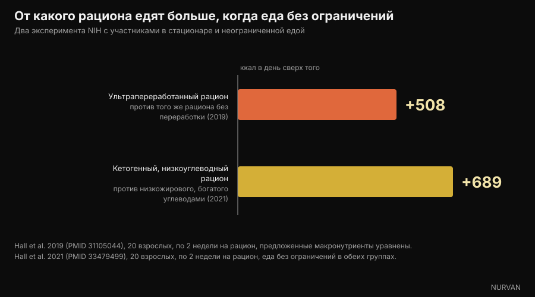

# От углеводов полнеют? Где на самом деле прячется жир

Di [Giammaria Loi](/autore/giammaria-loi) · обновлено 6 октября 2026

Широко разошедшийся пост итальянского нутрициолога Андреа Бьяши утверждает: продукты, которые мы называем «углеводами», часто набиты жиром, а те, кто худеет на отказе от углеводов, на самом деле убирают калории. Первое мы проверили по официальным таблицам состава продуктов, продукт за продуктом, второе — по исследованиям в закрытом стационаре. Почти всё подтверждается, но цифры говорят точнее, чем «дело не в углеводах».

## Коротко

- **В лазанье 49% калорий приходит из жира и лишь 27% из углеводов.** Это не углеводное блюдо: это жирное блюдо с тестом внутри. Данные CREA, расчёт наш.
- **У чипсов из пачки 51% калорий из жира, у сырных крекеров 45%, у вафли в шоколаде 47%.** Все они в голове лежат на полке «углеводы».
- **Но у белого хлеба жир даёт 2% калорий, у варёных макарон — 3%.** Вот уточнение, которого в посте нет: дело не в категории «углеводы», а в степени переработки продукта.
- **Сахар действительно маскирует восприятие жира.** Исследование 1990 года, на которое ссылается пост, существует и называется *Invisible fats*: чем больше сахара, тем меньше жира чувствовали участники — при одинаковом реальном содержании жира.
- **Убрать углеводы не значит есть меньше.** В эксперименте NIH с неограниченной едой на низкожировом рационе люди съедали на 689 ккал в день меньше, чем на кетогенном. Дефицит создаёт не макронутриент.

*Лазанья — самый наглядный пример: 196 ккал на 100 г, из них 49% из жира и лишь 27% из углеводов. Фото: Syced, Wikimedia Commons, CC0.*

## «Углеводы» — это категория, а не тарелка

В обиходе «углеводы» стали категорией **продуктов**: макароны, хлеб, печенье, пирожные, пицца, чипсы. А внутри этих продуктов углеводы — лишь один из трёх макронутриентов, и часто не тот, что даёт больше всего калорий.

Путаница рождается из шага, который кажется безобидным: если продукт сделан в основном из муки, значит, калории идут от муки. Так это не работает. Грамм жира даёт 9 ккал — больше чем вдвое против грамма углеводов. Нескольких граммов масла, сливочного или растительного, или крема хватает, чтобы перевернуть энергетический баланс порции.

Пост говорит об этом верно и предлагает простое действие: открыть таблицы состава. Мы так и сделали — по базе, которая уже есть внутри приложения.

## Цифры из официальных таблиц

Мы взяли таблицы состава продуктов **CREA** — итальянского исследовательского центра по продуктам и питанию — и посчитали для каждого продукта, какая доля калорий приходится на каждый макронутриент. Арифметика элементарная: граммы углеводов × 4, граммы белка × 4, граммы жира × 9, а дальше смотрим пропорцию.

*Откуда берутся калории в 11 повседневных продуктах. Данные: CREA, итальянские таблицы состава продуктов, редакция 2019. Расчёт и график Nurvan.*

Результат резче, чем следует из поста. В **лазанье** углеводы дают 27% калорий, а жир — 49%: называть её углеводным блюдом просто неверно. **Чипсы из пачки** доходят до 51% калорий из жира, **шоколадно-ореховая паста** — до 53%, **вафля в шоколаде** — до 47%, **сырные крекеры** — до 45%.

| Продукт (100 г) | ккал | Углеводы | Жиры | % ккал из жира |
|---|---|---|---|---|
| Шоколадно-ореховая паста | 537 | 58,1 г | 32,4 г | **53%** |
| Чипсы из пачки | 512 | 58,0 г | 29,6 г | **51%** |
| Лазанья | 196 | 13,4 г | 10,8 г | **49%** |
| Вафля в шоколаде | 498 | 60,3 г | 26,6 г | **47%** |
| Сырные крекеры | 498 | 59,2 г | 25,5 г | **45%** |
| Круассан | 403 | 54,7 г | 18,3 г | **40%** |
| Пирожное с какао | 410 | 65,5 г | 15,1 г | **32%** |
| Гриссини | 421 | 65,1 г | 13,9 г | **29%** |
| Песочное печенье | 426 | 71,7 г | 13,8 г | **28%** |
| Макароны, варёные | 175 | 37,3 г | 0,6 г | **3%** |
| Белый хлеб | 268 | 59,5 г | 0,5 г | **2%** |

*Значения на 100 г из таблиц CREA (редакция 2019); доля калорий из жира — наш собственный расчёт по 4/4/9 ккал на грамм.*

Именно две последние строки меняют вывод. **Белый хлеб берёт из жира 2% калорий, варёные макароны — 3%.** Они практически обезжирены. То же касается риса, отварного картофеля, бобовых и фруктов.

*Белый хлеб берёт из жира 2% калорий, варёные макароны — 3%. Непереработанные источники углеводов тут ни при чём. Фото: FranHogan, Wikimedia Commons, CC BY-SA 4.0.*

Значит, верная формулировка не «углеводы — это тоже жир», а: **чем составнее и переработаннее продукт, тем больше жира он приносит с собой, в какую бы категорию мы его ни положили.** Гриссини — не хлеб, пирожное — не хлеб, лазанья — не макароны. Тот, кто взвешивает макароны, но не соус, измеряет наименее калорийную часть тарелки.

## Почему вы этого не замечаете: сахар закрывает жир

Пост ссылается на работу Древновски и Шварц 1990 года. Она существует, мы её открыли: называется *Invisible fats* — невидимые жиры — и опубликована в *Appetite*.

Пятьдесят студенток с нормальным весом пробовали пятнадцать составов, похожих на глазурь для торта, с сахаром от 20% до 77% и сливочным маслом от 15% до 35%, и оценивали сладость и жирность. Воспринимаемая сладость точно следовала за сахаром. Воспринимаемая жирность — нет: **чем выше был сахар, тем менее жирными казались образцы при том же количестве масла.**

Авторы делают именно тот вывод, который нам нужен: механизм может объяснять, почему столько жирных десертов считают продуктами «на основе углеводов». Это сенсорный эксперимент на небольшой выборке: он не доказывает, что вы больше поправляетесь, он доказывает, что вы этого не замечаете.

*В упакованных солёных снеках жир — главная статья калорий, но вкус, который вы узнаёте, идёт от хрустящей части. Фото: Toby Scratch Fanatic, Wikimedia Commons, CC0.*

Более свежая работа — 2018 год, *Cell Metabolism*. С настоящим аукционом и функциональной МРТ участники были готовы **платить больше** за продукты, сочетающие жир и углеводы, чем за столь же знакомые, столь же приятные и столь же калорийные продукты только из жира или только из углеводов. И энергетическую плотность жирных продуктов они оценивали **лучше**, а смешанных — **хуже**.

Коротко: сочетание нравится сильнее при равных калориях и при этом хуже всего оценивается мозгом. Промышленный продукт, соединяющий сахар и жир, попадает ровно в слепое пятно.

## Так почему же худеют, убирая углеводы?

Здесь пост приходит к правильному выводу — дело в дефиците калорий, а не в исключении углеводов, — но путь заслуживает нескольких цифр, потому что литература не так единодушна, как кажется.

Самое крупное и лучше всего контролируемое исследование — **DIETFITS**, опубликовано в *JAMA* в 2018 году: 609 взрослых с избыточным весом, двенадцать месяцев, 22 групповых занятия, низкожировой рацион против низкоуглеводного, оба построены на качественных продуктах. Результат: −5,3 кг против −6,0 кг. Разница в 0,7 кг статистически незначима. Ни генотип, ни секреция инсулина не предсказали, кому какой рацион подойдёт лучше.

Метаанализы исследований в обычной жизни менее нейтральны: на 6-12 месяцах они находят небольшое преимущество низкоуглеводных рационов — **1,3 кг** в обзоре 2020 года по 38 исследованиям и 6499 взрослым, **2,2 кг** в обзоре 2016 года. Преимущество реальное, но скромное, и в обоих случаях сопровождается ростом холестерина ЛПНП.

Цифра, которая по-настоящему закрывает спор, другая, и пост её не приводит. В 2021 году группа Кевина Холла госпитализировала двадцать взрослых в клинический центр NIH и давала им по две недели кетогенный рацион (10% углеводов) и низкожировой рацион (10% жира, 75% углеводов), **с неограниченной едой в обоих случаях**.

*Когда есть можно сколько хочешь, калории снижает не отказ от углеводов. Данные: Hall et al. 2019 и 2021. График Nurvan.*

Если бы гипотеза «от углеводов едят больше» была верна, кетогенная группа показала бы меньше калорий. Вышло наоборот: на низкожировом рационе участники съедали **на 689 ккал в день меньше**, чем на кетогенном, и на 544 меньше в последнюю неделю.

Контрольная проверка — исследование той же группы 2019 года: двадцать человек в стационаре, две недели ультрапереработанного рациона и две — непереработанного, при уравненных предложенных калориях, энергетической плотности, макронутриентах, сахаре, натрии и клетчатке. На ультрапереработанном они съедали **на 508 ккал в день больше** и набрали 0,9 кг за две недели; на другом — потеряли 0,9 кг.

Рычаг — не макронутриент. Рычаг — форма, в которой вы его едите. Те, кто худеет, переходя на низкоуглеводный рацион, в большинстве случаев перестали есть пирожные, крекеры, чипсы и пасты для бутербродов, то есть убрали жир и калории, как и пишет пост, а не только углеводы.

## Что говорят исследования на самом деле

- **Подтверждено** — «Многие продукты, воспринимаемые как углеводные, содержат заметное количество жира.» — Подтверждено данными CREA: лазанья 49% калорий из жира, чипсы из пачки 51%, сырные крекеры 45%, вафля в шоколаде 47%.
- **С оговоркой** — «Проблема не в углеводах.» — Верно, но нужно сказать точнее: непереработанные источники углеводов почти не содержат жира (белый хлеб 2% калорий, варёные макароны 3%). Значение имеет не макронутриент, а то, насколько продукт составной и переработанный.
- **Подтверждено** — «Сладкий вкус маскирует восприятие жира (Древновски и Шварц, 1990).» — Работа существует, называется *Invisible fats*, и результат именно такой: больше сахара — меньше воспринимаемого жира при одинаковом реальном содержании. Пятьдесят участниц и экспериментальные глазури: это сенсорный результат, а не результат по массе тела.
- **Подтверждено** — «Сочетание сахара и жира повышает вкусовую привлекательность.» — Подтверждено и усилено: в работе 2018 года в *Cell Metabolism* люди платят больше за продукты, сочетающие жир и углеводы, при равных калориях, знакомости и симпатии.
- **С оговоркой** — «Польза для веса идёт от дефицита энергии, а не от исключения углеводов.» — DIETFITS на 609 людях подтверждает пост (0,7 кг разницы за 12 месяцев, незначимо), но метаанализы из обычной жизни всё же находят небольшое преимущество низкоуглеводных рационов — 1,3-2,2 кг на 6-12 месяцах.
- **Опровергнуто** — «Если убрать углеводы, человек сам собой ест меньше.» — Это неявная посылка большей части низкоуглеводной риторики, а в стационаре происходит обратное: при еде без ограничений низкожировой рацион дал на 689 ккал в день меньше, чем кетогенный.
- **С оговоркой** — «Приложение для учёта питания помогает понять, какие макронутриенты дают калории.» — Да, и это самый полезный совет поста. С оговоркой: именно на продуктах, сочетающих жир и углеводы, оценка на глаз хуже всего. Нужна записанная цифра, а не ощущение.

## Как это применить

1. **Смотрите на строку жиров, а не углеводов.** На этикетке умножьте граммы жира на 9 и разделите на калорийность той же порции: если вышло больше 0,35, жир — главная статья, как бы продукт ни назывался.
2. **Отделяйте сырьё от продуктов.** Хлеб, макароны, рис, картофель и бобовые почти не содержат жира. Гриссини, крекеры, печенье, пирожные, круассаны и пасты для бутербродов — другое дело: та же полка, другой состав.
3. **Взвешивайте соус, а не только основу.** В лазанье, пасте с песто и карбонаре почти все калории именно там. Это вмешательство сильнее всего меняет дневной итог и обходится дешевле, чем убирать целую группу продуктов.
4. **Ведите дневник две недели, потом бросьте, если хотите.** Записывать всю жизнь не нужно — достаточно продержаться столько, чтобы увидеть, куда действительно уходят калории. Почти все находят сюрприз в одной и той же колонке.
5. **Держите белок высоким, пока режете калории.** Это рычаг, который защищает мышцы при дефиците: об этом есть статья о том, [сколько белка нужно на сушке](/ru/blog/belok-na-sushke).
6. **Выбирайте тот рацион, который сможете соблюдать.** При равном дефиците низкоуглеводный и низкожировой дают очень похожие результаты за двенадцать месяцев. Соблюдаемость важнее названия протокола.

Это усреднённые данные по популяциям, а не персональный план. При диабете, нарушениях липидного обмена, расстройствах пищевого поведения или на фоне лечения обсудите изменения питания с врачом или диетологом.

> **Nurvan — скрытый жир виден в дневнике, а не на этикетке**
>
> База продуктов Nurvan построена на официальных таблицах CREA: записываете порцию лазаньи или крекеров — и сразу видите, сколько калорий пришло из жира, а сколько из углеводов, а не только итог. Дневное распределение макронутриентов обновляется само, и колонка, которая растёт незаметно, перестаёт быть сюрпризом.
>
> [Попробовать Nurvan](https://nurvan.app)

## Частые вопросы

**От углеводов полнеют?**

Не больше, чем от любого другого источника калорий. Вес растёт от длительного избытка энергии. «Углеводные продукты» связывают с набором веса потому, что многие из них — пирожные, крекеры, чипсы, пасты для бутербродов — берут из жира от 30% до 53% калорий по таблицам CREA.

**Сколько калорий лазаньи приходится на углеводы?**

27%. Жир даёт 49%, белок — 24%, при 196 ккал на 100 г по таблицам CREA. Поэтому называть её углеводным блюдом — вводить в заблуждение.

**Как по этикетке понять, что продукт жирный?**

Умножьте граммы жира на 9, разделите на калорийность той же порции и посмотрите процент. Выше примерно 35% жир — основной вклад, даже если продукт выглядит как сделанный из муки или сахара.

**Низкоуглеводная диета работает лучше низкожировой?**

В самом крупном контролируемом исследовании, DIETFITS на 609 людях, разница за двенадцать месяцев составила 0,7 кг и была незначимой. Метаанализы из обычной жизни находят небольшое преимущество низкоуглеводных рационов (1,3-2,2 кг), но и рост холестерина ЛПНП. Куда важнее, какую из двух вы сможете выдержать.

**Надо ли убирать хлеб и макароны, чтобы похудеть?**

Нет. Хлеб и макароны берут из жира 2% и 3% калорий соответственно: они не проблема. У большинства людей главный запас — в соусах и упакованных продуктах.

## Читайте также

- [Белок на сушке: сколько нужно на самом деле](/ru/blog/belok-na-sushke) — нутриционный рычаг, который защищает мышцы при снижении калорий.
- [Охлаждённый рис: насколько важен резистентный крахмал](/ru/blog/ohlazhdennyy-ris-rezistentnyy-krahmal) — ещё один случай, когда реальные цифры меньше заголовка.
- [CBL-514: препарат против жира, что говорят исследования](/ru/blog/cbl-514-preparat-podkozhnyy-zhir) — что происходит, когда жир пробуют атаковать с другой стороны.

## Источники

1. Drewnowski A, Schwartz M, 1990. *Invisible fats: sensory assessment of sugar/fat mixtures.* Appetite 14(3):203-217. PMID 2369116 — [DOI](https://doi.org/10.1016/0195-6663(90)90088-p)
2. DiFeliceantonio AG, Coppin G, Rigoux L, Edwin Thanarajah S, Dagher A, Tittgemeyer M, Small DM, 2018. *Supra-Additive Effects of Combining Fat and Carbohydrate on Food Reward.* Cell Metabolism 28(1):33-44. PMID 29909968 — [DOI](https://doi.org/10.1016/j.cmet.2018.05.018)
3. Hall KD, Guo J, Courville AB et al., 2021. *Effect of a plant-based, low-fat diet versus an animal-based, ketogenic diet on ad libitum energy intake.* Nature Medicine 27(2):344-353. PMID 33479499 — [DOI](https://doi.org/10.1038/s41591-020-01209-1)
4. Hall KD, Ayuketah A, Brychta R et al., 2019. *Ultra-Processed Diets Cause Excess Calorie Intake and Weight Gain: An Inpatient Randomized Controlled Trial of Ad Libitum Food Intake.* Cell Metabolism 30(1):67-77. PMID 31105044 — [DOI](https://doi.org/10.1016/j.cmet.2019.05.008)
5. Gardner CD, Trepanowski JF, Del Gobbo LC et al., 2018. *Effect of Low-Fat vs Low-Carbohydrate Diet on 12-Month Weight Loss in Overweight Adults: The DIETFITS Randomized Clinical Trial.* JAMA 319(7):667-679. PMID 29466592 — [DOI](https://doi.org/10.1001/jama.2018.0245)
6. Chawla S, Tessarolo Silva F, Amaral Medeiros S, Mekary RA, Radenkovic D, 2020. *The Effect of Low-Fat and Low-Carbohydrate Diets on Weight Loss and Lipid Levels: A Systematic Review and Meta-Analysis.* Nutrients 12(12):3774. PMID 33317019 — [DOI](https://doi.org/10.3390/nu12123774)
7. Mansoor N, Vinknes KJ, Veierød MB, Retterstøl K, 2016. *Effects of low-carbohydrate diets v. low-fat diets on body weight and cardiovascular risk factors: a meta-analysis of randomised controlled trials.* British Journal of Nutrition 115(3):466-479. PMID 26768850 — [DOI](https://doi.org/10.1017/S0007114515004699)
8. CREA — Исследовательский центр продуктов питания и питания (Италия). *Таблицы состава продуктов*, редакция 2019 — [alimentinutrizione.it](https://www.alimentinutrizione.it/tabelle-nutrizionali/ricerca-per-ordine-alfabetico). Источник значений на 100 г; доли калорий по макронутриентам — расчёт Nurvan.

> Научные источники получены из PubMed и проверены 6 октября 2026 года. Значения состава взяты из официальных таблиц CREA, уже встроенных в базу продуктов Nurvan.

> Отправная точка: пост [Андреа Бьяши](https://www.instagram.com/p/Dd_OSqQiFfi/) от 3 октября 2026 года об углеводах и наборе веса. Текст, структура, расчёты по данным CREA, проверки и графики этой статьи — оригинальные.

**Джаммария Лои** — основатель Nurvan. Тренируется с отягощениями с 2012 года, работает персональным тренером и коучем с сертификацией FIPE с 2013 года и выступает в пауэрлифтинге на национальном уровне с 2018 года. Каждая его статья начинается с научных работ и заканчивается тем, что действительно работает в зале.

> Примечание: информационный материал, не заменяет консультацию врача или квалифицированного специалиста. Приведённые значения — средние данные по составу продуктов и средние результаты исследований на конкретных группах: это не персональный план питания.
