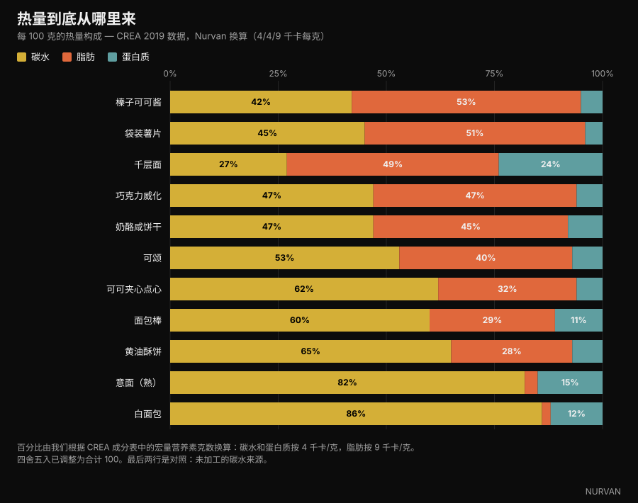
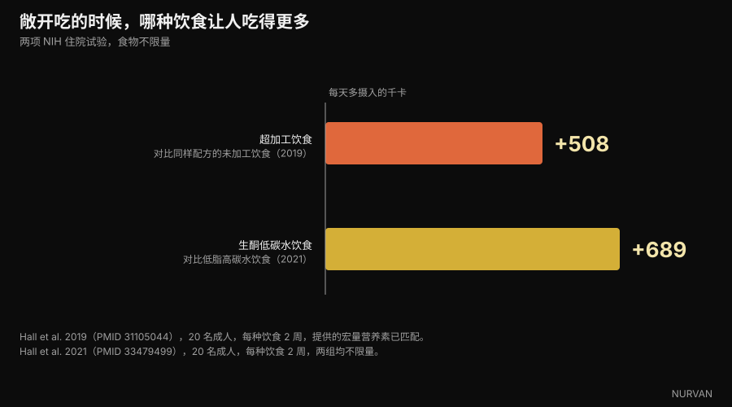

# 碳水化合物会让人变胖吗？脂肪到底藏在哪里

Di [Giammaria Loi](/autore/giammaria-loi) · 更新于 2026 年 10 月 6 日

意大利营养科普作者 Andrea Biasci 的一篇热门帖子说：我们口中的「碳水食物」里常常塞满了脂肪，靠戒碳水减肥的人，其实只是减了热量。第一点我们用官方食物成分表逐项核对过，第二点我们查了封闭病房里的喂养试验。大部分都站得住，但数字说出的东西比「问题不在碳水」更精确。

## 要点速览

- **千层面里 49% 的热量来自脂肪，只有 27% 来自碳水。** 它不是一道碳水菜，而是一道加了面皮的脂肪菜。CREA 数据，我们自己换算。
- **袋装薯片脂肪供能 51%，奶酪咸饼干 45%，巧克力威化 47%。** 这些在脑子里全被归进「碳水」那一格。
- **但白面包脂肪只占热量的 2%，煮熟的意面只占 3%。** 这是帖子没说的那一层：问题不在碳水这个类别，而在食物的加工程度。
- **糖确实会掩盖对脂肪的感知。** 帖子引用的 1990 年研究确实存在，标题就叫 *Invisible fats*：糖越多，人感觉到的脂肪越少——而真实脂肪量并没有变。
- **戒掉碳水并不会让人吃得更少。** 在 NIH 的封闭试验里，食物不限量时，低脂饮食比生酮饮食每天少吃 689 千卡。制造热量缺口的不是某个宏量营养素。

*千层面是最清楚的例子：每 100 克 196 千卡，其中 49% 来自脂肪，只有 27% 来自碳水。照片：Syced，Wikimedia Commons，CC0。*

## 「碳水」是一个类别，不是一盘菜

在日常说法里，「碳水」已经变成一类**食物**：意面、面包、饼干、小点心、披萨、薯片。可在这些食物的成分里，碳水只是三种宏量营养素之一，而且常常不是贡献热量最多的那一种。

混乱来自一个看起来无害的推论：如果一样东西主要由面粉做成，那它的热量就来自面粉。事情不是这样。一克脂肪提供 9 千卡，是一克碳水的两倍多。几克黄油、油或夹心酱，就足以把一份食物的能量结构整个翻过来。

帖子把这点说得很好，并给了一个很朴素的建议：去翻营养成分表。我们照做了，用的是应用里本来就有的那套数据库。

## 官方成分表给出的数字

我们取了意大利食品与营养研究中心 **CREA** 的食物成分表，为每一种食物算出各宏量营养素各占多少热量。算法很基础：碳水克数 × 4，蛋白质克数 × 4，脂肪克数 × 9，再看比例。

*11 种日常食物的热量来源。数据：CREA，意大利食物成分表 2019 版。换算与图表：Nurvan。*

结果比帖子暗示的还要明确。**千层面**里碳水提供 27% 的热量，脂肪提供 49%：把它叫作碳水菜肴根本不成立。**袋装薯片**的脂肪供能达到 51%，**榛子可可酱** 53%，**巧克力威化** 47%，**奶酪咸饼干** 45%。

| 食物（100 克） | 千卡 | 碳水 | 脂肪 | 脂肪供能比 |
|---|---|---|---|---|
| 榛子可可酱 | 537 | 58.1 克 | 32.4 克 | **53%** |
| 袋装薯片 | 512 | 58.0 克 | 29.6 克 | **51%** |
| 千层面 | 196 | 13.4 克 | 10.8 克 | **49%** |
| 巧克力威化 | 498 | 60.3 克 | 26.6 克 | **47%** |
| 奶酪咸饼干 | 498 | 59.2 克 | 25.5 克 | **45%** |
| 可颂 | 403 | 54.7 克 | 18.3 克 | **40%** |
| 可可夹心点心 | 410 | 65.5 克 | 15.1 克 | **32%** |
| 面包棒 | 421 | 65.1 克 | 13.9 克 | **29%** |
| 黄油酥饼 | 426 | 71.7 克 | 13.8 克 | **28%** |
| 意面（熟） | 175 | 37.3 克 | 0.6 克 | **3%** |
| 白面包 | 268 | 59.5 克 | 0.5 克 | **2%** |

*每 100 克数值取自 CREA 成分表（2019 版）；脂肪供能比是我们按 4/4/9 千卡每克自行换算的。*

真正改变结论的是最后两行。**白面包的热量只有 2% 来自脂肪，煮熟的意面是 3%。** 它们几乎不含脂肪。米饭、水煮土豆、豆类和水果同理。

*白面包的热量只有 2% 来自脂肪，煮熟的意面是 3%。未加工的碳水来源不是问题所在。照片：FranHogan，Wikimedia Commons，CC BY-SA 4.0。*

所以正确的说法不是「碳水其实也是脂肪」，而是：**一样食物越是复合、越是加工，它带进来的脂肪就越多，不管我们把它归在哪一类。** 面包棒不是面包，夹心点心不是面包，千层面不是意面。只称面条不称酱汁的人，量的是整盘里热量最低的那部分。

## 为什么你察觉不到：糖盖住了脂肪

帖子引用了 Drewnowski 与 Schwartz 1990 年的研究。它确实存在，我们打开看了：标题是 *Invisible fats*（看不见的脂肪），发表在 *Appetite*。

五十名体重正常的女学生品尝了十五种类似蛋糕糖霜的样品，糖含量从 20% 到 77%，黄油从 15% 到 35%，并为甜度和脂肪含量打分。感知到的甜度忠实跟随糖含量，感知到的脂肪却没有：**糖越高，样品被判定得越不油腻，而黄油含量完全没变。**

作者的结论正是我们需要的：这个机制可以解释为什么那么多高脂甜点被当成「碳水类」食物。这是一项样本不大的感官实验：它证明的不是你更容易胖，而是你察觉不到。

*袋装咸味零食里脂肪才是热量大头，但你尝到的是那层酥脆。照片：Toby Scratch Fanatic，Wikimedia Commons，CC0。*

更新的一篇来自 2018 年的 *Cell Metabolism*。研究用了真实竞价任务和功能性磁共振：在同样熟悉、同样喜欢、热量相同的前提下，受试者愿意为「同时含脂肪和碳水」的食物**出更高的价**，高过只含脂肪或只含碳水的食物。而且他们对高脂食物能量密度的判断**更准**，对混合食物的判断**更差**。

一句话：同样热量下这种组合更招人喜欢，同时又是大脑估得最不准的那一类。把糖和脂肪绑在一起的工业产品，正好落在盲区里。

## 那为什么戒掉碳水真的会瘦？

这里帖子的结论是对的——起作用的是热量缺口，不是去掉碳水——但这条路值得补几个数字，因为文献并没有看上去那么一致。

规模最大、控制最好的试验是 **DIETFITS**，2018 年发表于 *JAMA*：609 名超重成人，十二个月，22 次小组课程，低脂饮食对低碳水饮食，两边都用高质量食材搭建。结果是 −5.3 公斤对 −6.0 公斤。0.7 公斤的差距没有统计学意义。基因型和胰岛素分泌都没能预测谁更适合哪一种。

来自真实生活研究的荟萃分析没那么中立：在 6 到 12 个月，它们找到低碳水的小幅优势——2020 年一篇纳入 38 项研究、6499 名成人的综述给出 **1.3 公斤**，2016 年一篇给出 **2.2 公斤**。优势真实但有限，而且两篇都伴随低密度脂蛋白胆固醇升高。

真正把争论收尾的是另一个数字，而帖子没有提。2021 年 Kevin Hall 的团队把二十名成人收进 NIH 临床中心，分别用两周时间给他们生酮饮食（碳水 10%）和低脂饮食（脂肪 10%、碳水 75%），**两边都敞开供应食物**。

*当人可以随便吃时，让热量下降的并不是戒碳水。数据：Hall et al. 2019 与 2021。图表：Nurvan。*

如果「碳水让人吃更多」成立，生酮组应该记录到更少的热量。结果正相反：在低脂饮食下，受试者每天比生酮饮食**少吃 689 千卡**，最后一周少 544 千卡。

反向验证是同一团队 2019 年的研究：二十名住院受试者，两周超加工饮食、两周未加工饮食，提供的热量、能量密度、宏量营养素、糖、钠和膳食纤维全部匹配。吃超加工餐单时他们每天**多吃 508 千卡**，两周长了 0.9 公斤；另一边则掉了 0.9 公斤。

起杠杆作用的不是宏量营养素，而是你吃它的形态。那些靠转向低碳水饮食瘦下来的人，多数其实是不再吃夹心点心、咸饼干、薯片和抹酱——也就是减掉了脂肪和热量，正如帖子所写，而不只是碳水。

## 研究真正说了什么

- **已证实** — 「很多被当成碳水的食物含有相当多的脂肪。」——CREA 数据证实：千层面脂肪供能 49%，袋装薯片 51%，奶酪咸饼干 45%，巧克力威化 47%。
- **需补充** — 「问题不在碳水。」——对，但要说得更准：未加工的碳水来源几乎不含脂肪（白面包占热量 2%，煮熟意面 3%）。真正起作用的变量不是宏量营养素，而是食物有多复合、多加工。
- **已证实** — 「甜味会掩盖对脂肪的感知（Drewnowski 与 Schwartz，1990）。」——研究确实存在，标题为 *Invisible fats*，结果也如所述：糖越多，在真实脂肪不变的情况下感知到的脂肪越少。五十名受试者、实验用糖霜：这是感官层面的结果，不是体重层面的结果。
- **已证实** — 「糖与脂肪的组合提高适口性。」——已证实并被加强：在 2018 年 *Cell Metabolism* 的研究里，在热量、熟悉度和喜好一致的前提下，人们愿意为同时含脂肪和碳水的食物付更多钱。
- **需补充** — 「体重上的好处来自热量缺口，而非去掉碳水。」——DIETFITS 的 609 人支持帖子的说法（十二个月相差 0.7 公斤，无统计学意义），但真实生活的荟萃分析仍找到低碳水的小幅优势，6 到 12 个月为 1.3 至 2.2 公斤。
- **已推翻** — 「戒掉碳水会让人自发吃得更少。」——这是低碳水话术里隐含的前提，而在封闭病房中结果恰好相反：食物不限量时，低脂饮食比生酮饮食每天少 689 千卡。
- **需补充** — 「用应用记录饮食能帮你看清热量来自哪种宏量营养素。」——是的，这也是帖子里最有用的建议。只需补一句：恰恰是在同时含脂肪和碳水的食物上，用眼睛估最不准。所以需要写下来的数字，而不是感觉。

## 怎么用起来

1. **看脂肪那一行，别只看碳水。** 在标签上把脂肪克数乘以 9，再除以同一份量的热量：结果超过 0.35，脂肪就是主项，不管这东西叫什么名字。
2. **把原料和产品分开。** 面包、意面、米饭、土豆和豆类几乎不含脂肪。面包棒、咸饼干、饼干、夹心点心、可颂和抹酱是另一回事：同一个货架，成分完全不同。
3. **称酱料，不只称主食。** 千层面、青酱意面和培根蛋面里，热量几乎都在那儿。这是改动日总量最有效的一招，而且比砍掉整整一类食物省力得多。
4. **记录两周，之后想停就停。** 不必永远记账，只要记到足够看清热量真正去了哪里。几乎所有人，最后都在同一栏里看到意外。
5. **减脂期间把蛋白质保持高位。** 这是热量下降时保住肌肉的杠杆：我们在[减脂期需要多少蛋白质](/zh/blog/protein-intake-cutting-zh)那篇文章里谈过。
6. **选一个你真能坚持的方案。** 在热量缺口相同的前提下，低碳水和低脂在十二个月后的结果非常接近。依从性比方案的名字更重要。

这些是人群平均数据，不是个人方案。如果你有糖尿病、血脂异常、进食障碍或正在接受治疗，请在调整饮食前先咨询医生或注册营养师。

> **Nurvan — 藏起来的脂肪，在饮食日记里看得见**
>
> Nurvan 的食物数据库用的就是官方 CREA 成分表：记录一份千层面或一把咸饼干，你马上能看到其中多少热量来自脂肪、多少来自碳水，而不只是一个总数。每日宏量营养素构成会自动更新，那根悄悄长高的柱子不再是意外。
>
> [试试 Nurvan](https://nurvan.app)

## 常见问题

**碳水化合物会让人变胖吗？**

不会比任何其他热量来源更容易。长期热量盈余才让人变胖。「碳水食物」之所以和增重挂钩，是因为其中很多——夹心点心、咸饼干、薯片、抹酱——按 CREA 成分表，有 30% 到 53% 的热量来自脂肪。

**千层面有多少热量来自碳水？**

27%。脂肪占 49%，蛋白质占 24%，按 CREA 成分表每 100 克 196 千卡计算。所以把它称作碳水菜肴是有误导性的。

**怎么从标签看出一样食物是不是高脂？**

把脂肪克数乘以 9，除以同一份量的热量，看百分比。大约超过 35%，脂肪就是主要贡献者，哪怕这东西看起来像是面粉或糖做的。

**低碳水比低脂更有效吗？**

在规模最大、控制最好的 DIETFITS 试验（609 人）里，十二个月的差距是 0.7 公斤，没有统计学意义。真实生活的荟萃分析找到低碳水的小幅优势（1.3 至 2.2 公斤），同时也看到低密度脂蛋白胆固醇升高。更要紧的是你能坚持哪一个。

**减肥必须戒掉面包和意面吗？**

不必。面包和意面的脂肪供能分别只有 2% 和 3%：它们不是问题。对多数人来说，最大的空间在酱料和包装食品上。

## 延伸阅读

- [减脂期的蛋白质：究竟需要多少](/zh/blog/protein-intake-cutting-zh) — 热量下降时保护肌肉的那根营养杠杆。
- [冷藏米饭：抗性淀粉到底有多重要](/zh/blog/lengcang-mifan-kangxing-dianfen) — 又一个真实数字比标题小得多的例子。
- [CBL-514：减脂药物，研究怎么说](/zh/blog/cbl-514-pixia-zhifang-yaowu) — 当人们从另一头去对付脂肪时会发生什么。

## 参考文献

1. Drewnowski A, Schwartz M, 1990. *Invisible fats: sensory assessment of sugar/fat mixtures.* Appetite 14(3):203-217. PMID 2369116 — [DOI](https://doi.org/10.1016/0195-6663(90)90088-p)
2. DiFeliceantonio AG, Coppin G, Rigoux L, Edwin Thanarajah S, Dagher A, Tittgemeyer M, Small DM, 2018. *Supra-Additive Effects of Combining Fat and Carbohydrate on Food Reward.* Cell Metabolism 28(1):33-44. PMID 29909968 — [DOI](https://doi.org/10.1016/j.cmet.2018.05.018)
3. Hall KD, Guo J, Courville AB et al., 2021. *Effect of a plant-based, low-fat diet versus an animal-based, ketogenic diet on ad libitum energy intake.* Nature Medicine 27(2):344-353. PMID 33479499 — [DOI](https://doi.org/10.1038/s41591-020-01209-1)
4. Hall KD, Ayuketah A, Brychta R et al., 2019. *Ultra-Processed Diets Cause Excess Calorie Intake and Weight Gain: An Inpatient Randomized Controlled Trial of Ad Libitum Food Intake.* Cell Metabolism 30(1):67-77. PMID 31105044 — [DOI](https://doi.org/10.1016/j.cmet.2019.05.008)
5. Gardner CD, Trepanowski JF, Del Gobbo LC et al., 2018. *Effect of Low-Fat vs Low-Carbohydrate Diet on 12-Month Weight Loss in Overweight Adults: The DIETFITS Randomized Clinical Trial.* JAMA 319(7):667-679. PMID 29466592 — [DOI](https://doi.org/10.1001/jama.2018.0245)
6. Chawla S, Tessarolo Silva F, Amaral Medeiros S, Mekary RA, Radenkovic D, 2020. *The Effect of Low-Fat and Low-Carbohydrate Diets on Weight Loss and Lipid Levels: A Systematic Review and Meta-Analysis.* Nutrients 12(12):3774. PMID 33317019 — [DOI](https://doi.org/10.3390/nu12123774)
7. Mansoor N, Vinknes KJ, Veierød MB, Retterstøl K, 2016. *Effects of low-carbohydrate diets v. low-fat diets on body weight and cardiovascular risk factors: a meta-analysis of randomised controlled trials.* British Journal of Nutrition 115(3):466-479. PMID 26768850 — [DOI](https://doi.org/10.1017/S0007114515004699)
8. CREA — 意大利食品与营养研究中心。*食物成分表*，2019 版 — [alimentinutrizione.it](https://www.alimentinutrizione.it/tabelle-nutrizionali/ricerca-per-ordine-alfabetico)。每 100 克数值来源；各宏量营养素的热量占比为 Nurvan 换算。

> 科学文献取自 PubMed，于 2026 年 10 月 6 日核对。成分数值来自已内置于 Nurvan 食物数据库的官方 CREA 成分表。

> 出发点：[Andrea Biasci](https://www.instagram.com/p/Dd_OSqQiFfi/) 于 2026 年 10 月 3 日发布的关于碳水与体重增加的帖子。本文的文字、结构、基于 CREA 数据的换算、核查与图表均为原创。

**Giammaria Loi** 是 Nurvan 的创始人。他自 2012 年开始力量训练，自 2013 年起担任 FIPE 认证私人教练，自 2018 年起在国家级别参加力量举比赛。他署名的每一篇文章都从研究出发，落到健身房里真正有效的做法。

> 说明：本文为科普内容，不能替代医生或专业人士的意见。文中数值为食物成分的平均值，以及特定人群研究的平均结果，不构成个性化饮食方案。
