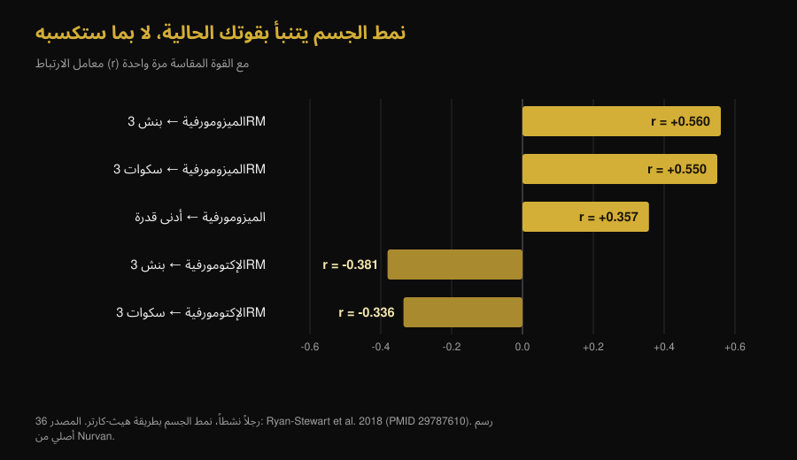
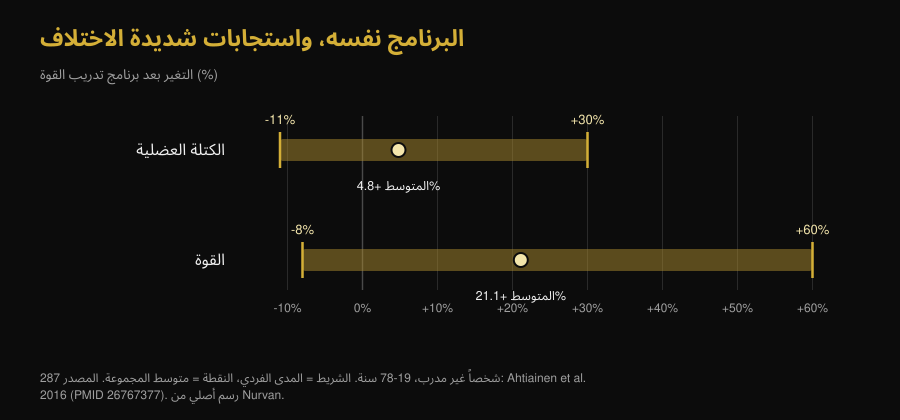

# إكتومورف أم ميزومورف: هل يحدد نمط جسمك كم ستنمو عضلاتك؟

Di [Giammaria Loi](/autore/giammaria-loi) · تم التحديث في ٧ أكتوبر ٢٠٢٦

«أنا إكتومورف، لذلك لا أبني كتلة» من أكثر الجمل تكراراً في أي صالة. عمل جديد من مختبر براد شونفيلد اختبر هذه الجملة على 40 رجلاً: بنية الجسم في البداية لم تتنبأ بنمو العضلات بشكل مفيد. قرأنا الدراسة، ووجدنا تفصيلاً لا يذكره المنشور، واستخرجنا بحث عام 1994 الذي خلص إلى العكس. الصورة التي تظهر أكثر إفادة من الاثنين معاً.

## باختصار

- **نمط الجسم لا يتنبأ بكمية العضلات التي ستبنيها.** في 40 رجلاً غير مدرَّب على مدى 9 أسابيع، أظهرت الميزومورفية الأعلى (البنية العضلية) آثاراً صغيرة إلى مهملة على التضخم، وكادت تختفي بعد أخذ الإندومورفية والإكتومورفية في الحسبان.
- **لكن هذا العمل مسودة بحثية لم تخضع بعد لتحكيم الأقران.** هذا التفصيل غائب عن معظم المنشورات التي تتناقله، وهو يغيّر الوزن الذي يستحقه.
- **في المقابل، نمط الجسم يتنبأ بقوتك الحالية.** عند 36 رجلاً نشطاً، فسّرت الميزومورفية وحدها 31.4% من التباين في بنش بريس 3 تكرارات قصوى. المستوى الحالي وسرعة التحسن أمران مختلفان.
- **دراسة من 1994 وجدت العكس، لكن في الكتلة الخالية من الدهون فقط.** خلال 12 أسبوعاً، اكتسب أصحاب البنية الممتلئة 1.6 كجم من الكتلة الخالية من الدهون، بينما لم يسجل النحيفون زيادة ذات دلالة. أما القوة فارتفعت بالقدر نفسه في المجموعتين: 13.8% في المتوسط.
- **التباين الفردي حقيقي وضخم، لكنه لا يُقرأ من المظهر.** عند 287 شخصاً غير مدرَّب، تغيرت الكتلة العضلية بين -11% و+30% والقوة بين -8% و+60%. أقوى مؤشر معروف حتى الآن هو الخلايا الساتلة، ولا تظهر في أي مرآة.

*المنافسة نفسها والبار نفسه وبنى مختلفة: السؤال هو ما إذا كان هذا الفارق يتنبأ أيضاً بمن سيتحسن أكثر. الصورة: US Air Force، ويكيميديا كومنز، ملكية عامة.*

## من أين جاءت فكرة الأنماط الثلاثة

في طريقة هيث-كارتر المستخدمة اليوم، ليس نمط الجسم خانة مغلقة بل ثلاثة أرقام: **الإندومورفية** (مقدار الاستدارة والدهون)، **الميزومورفية** (متانة الهيكل والعضلات)، **الإكتومورفية** (طول البنية ونحافتها). كل شخص لديه الدرجات الثلاث. قول «أنا إكتومورف» يعني تقنياً أن الرقم الثالث مرتفع مقارنة بالآخرين.

وهنا تبدأ المشكلة. دراسة عام 2025 على 185 رجلاً و156 امرأة قاست مدى تشابه الأشخاص داخل الفئة الواحدة: التشتت الشكلي داخل التصنيف نفسه كان ذا دلالة في معظم المجموعات، وأكبر عند الرجال. يمكن أن يكون لشخصين «ميزومورف» جسدان مختلفان جداً.

## ماذا فعلت فعلاً الدراسة التي يتحدث عنها الجميع

أربعون رجلاً شاباً غير مدرَّب اتبعوا برنامجاً إشرافياً لكامل الجسم، مرتين أسبوعياً لمدة تسعة أسابيع، مع قياس نمط الجسم في البداية. قُيّم التضخم بسماكة العضلة بالموجات فوق الصوتية والمقاومة الحيوية والمحيطات؛ وقُيّم الأداء بالقوة القصوى والتحمل العضلي وقدرة الجزء السفلي والقوة الثابتة لباسطات الركبة.

النتيجة: أظهرت الميزومورفية الأعلى في البداية احتمالاً بعدياً مرتفعاً لارتباطات إيجابية بالتضخم والأداء، لكن الآثار المقدَّرة كانت صغيرة ووقعت في معظمها داخل **منطقة التكافؤ العملي** — وهو المدى الذي حدده الباحثون مسبقاً بوصفه «فرقاً لا يغير شيئاً في الحياة الواقعية». وبعد التعديل للإندومورفية والإكتومورفية، ضعف الارتباط أكثر.

استثناء واحد يصفه المؤلفون صراحة بأنه استكشافي: أظهرت الميزومورفية المتصلة ارتباطاً إيجابياً متواضعاً بتحسن الحد الأقصى في البنش بريس. ولا شيء مماثل في بقية الاختبارات. ويذكر المؤلفون أيضاً أن الأصل الجيني الأفريقي الأكبر ارتبط بدرجات ميزومورفية أعلى — وهي نتيجة تخص **الشكل الابتدائي**، ولم تترجم في الدراسة نفسها إلى استجابة أفضل للتدريب.

**التوضيح الغائب عن المنشورات:** هذا العمل مسودة بحثية نُشرت على SportRxiv في 24 سبتمبر 2026. لم تمر بعد بتحكيم الأقران وغير مفهرسة في PubMed. هي معلومة مفيدة، لا حكم نهائي. والمؤلفون أنفسهم يطالبون بعينات أكبر ومدد أطول.

## نمط الجسم يخبرك بقوتك اليوم، لا بنموك غداً

هنا العقدة التي يتجاوزها الجميع تقريباً. نمط الجسم يتنبأ *بشيء ما* ببراعة: القوة التي تظهرها الآن.

عند 36 رجلاً نشطاً، ارتبطت الميزومورفية بالحد الأقصى في البنش بريس لثلاث تكرارات (r = 0.560) وبالسكوات (r = 0.550)؛ وارتبطت الإكتومورفية سلبياً بكليهما. وفسّرت الميزومورفية وحدها 31.4% من التباين في البنش بريس.

*نحو ثلث الفارق في القوة بين شخص وآخر يمكن قراءته من البنية. لكن أياً من هذه الارتباطات لا يخص التحسن: كلها قياسات أُخذت مرة واحدة. رسم Nurvan استناداً إلى Ryan-Stewart et al. 2018.*

الخلط بين الأمرين هو الخطأ الذي يبقي الخرافة حية. الجسم الممتلئ يبدأ من نقطة أعلى، وهذا ظاهر؛ لكن ميل المنحنى — كم ستضيف في الأشهر القادمة — متغير آخر، وهو الوحيد الذي يمكنك التأثير فيه.

## إذاً ما الذي يتنبأ بالنمو؟

التباين الفردي حقيقي وكبير. عند 287 شخصاً غير مدرَّب بين 19 و78 عاماً، تغيرت الكتلة العضلية بعد برنامج قوة بمعدل ‎+4.8% مع نتائج فردية بين -11% و+30%؛ وارتفعت القوة بمعدل ‎+21.1% مع نتائج فردية بين -8% و+60%. وفي العمل نفسه، **لم يفسر العمر ولا الجنس هذا الفارق**.

*تمتد الأشرطة من الشخص الأقل استجابة إلى الأكثر استجابة للنوع نفسه من البرامج. رسم Nurvan استناداً إلى Ahtiainen et al. 2016.*

أين يكمن الفارق إذاً؟ عمل على 66 شخصاً تدربوا 16 أسبوعاً قسّمهم إلى ثلاث مجموعات: تضخم شديد (‎+58% في مقطع الليف)، متوسط (‎+28%)، ومعدوم. في البداية **لم** يختلف حجم الألياف بين المجموعات: ما ميّز المستجيبين الكبار هو عدد خلاياهم الساتلة — الخلايا الجذعية للعضلة — وقدرتها على إضافة أنوية إلى الألياف أثناء التدريب.

بعبارة أخرى: المؤشر موجود، لكنه داخل العضلة ويُقاس بخزعة، لا بالنظر في المرآة.

*من الخارج لا يظهر شيء مما يهم فعلاً: القدرة على النمو تُقاس داخل العضلة. الصورة: Nenad Stojkovic، ويكيميديا كومنز، CC BY 2.0.*

## دراسة 1994 التي قالت العكس

قبل طيّ الفكرة، يجدر ذكر البحث الذي تدرجه المسودة نفسها في مراجعها. في عام 1994، قُسّم 21 رجلاً حسب البنية — نحيفة أو ممتلئة، مصنفة بمؤشر الكتلة الخالية من الدهون — وتدربوا 12 أسبوعاً مرتين أسبوعياً.

| النتيجة بعد 12 أسبوعاً | بنية ممتلئة (ن=11) | بنية نحيفة (ن=10) |
|---|---|---|
| الكتلة الخالية من الدهون | **+1.6 كجم (+2.3%)**، ذات دلالة | لا زيادة ذات دلالة |
| كتلة الدهون | -2.4 كجم (-11.3%) | -1.7 كجم (-10.8%) |
| القوة الأيزوكينيتيكية | ‎+13.8% في المتوسط | ‎+13.8% في المتوسط |

*البيانات: Van Etten et al. 1994 (PMID 8201909). قيمة القوة هي المتوسط المعلن للمجموعتين معاً، إذ لم تختلفا فيما بينهما.*

إذاً لمفهوم «صعوبة بناء العضلات» أساس تاريخي، لكنه أضيق بكثير مما يُروى: كان يخص الكتلة الخالية من الدهون لا القوة، على 21 شخصاً، وبطريقة تصنيف مختلفة عن نمط الجسم. وبعد ثلاثين عاماً، بقياسات أفضل وعينة مضاعفة، لا يظهر الأثر على النمو من جديد.

## ماذا يقول البحث العلمي فعلاً

- **مؤكد** — «امتلاك بنية عضلية بالفطرة لا يعني قدرة أكبر على بناء العضلات.» — هذه النتيجة الرئيسية للمسودة، وتتسق مع كون تباين الاستجابة موجوداً لكن لا يفسره العمر ولا الجنس ولا حجم الألياف الابتدائي.
- **يحتاج توضيحاً** — «الإكتومورف ليسوا محكومين بصعوبة بناء العضلات.» — صحيح وفق البيانات الجديدة، لكن بحث 1994 وجد 1.6 كجم إضافية من الكتلة الخالية من الدهون لدى أصحاب البنية الأمتن. أما القوة فارتفعت بالقدر نفسه.
- **يحتاج توضيحاً** — «دراسة جديدة من مختبري.» — هي مسودة على SportRxiv بتاريخ 24 سبتمبر 2026، بلا تحكيم أقران وبلا فهرسة في PubMed.
- **مؤكد** — «أظهرت الميزومورفية ارتباطاً إيجابياً متواضعاً بمكاسب البنش بريس.» — عرضها المؤلفون كتحليل استكشافي، فلا تُعامل كنتيجة ثابتة.
- **مُفنَّد** — «نمط الجسم لا يقول شيئاً مفيداً.» — هذه القراءة السريعة في التعليقات لا تصمد: فهو يقول الكثير عن قوتك **الآن** (31.4% من التباين في البنش). ما لا يقوله هو مقدار تحسنك.
- **غير قابل للتحقق** — «لهذا يحتاج نوع جسمك إلى تدريب مختلف.» — لا توجد في ما قرأناه دراسة قارنت برامج موزعة حسب نمط الجسم. لا أساس لوصف «تدريب الإكتومورف».

## كيف تطبق ذلك

1. **توقف عن استخدام نمط الجسم كتنبؤ.** هو يصف كيف يبدو جسمك اليوم، ولم يُظهر قدرة على تحديد كم سينمو.
2. **قارن نفسك بنفسك لا بزميل البنش.** الأمتن بنيةً يبدأ من نقطة أعلى. ما يخبرك إن كان البرنامج ناجحاً هو منحناك أنت: الأوزان والتكرارات والقياسات عبر الزمن.
3. **امنح البرنامج 10 إلى 12 أسبوعاً على الأقل قبل الحكم عليه.** تسعة أسابيع هي الحد الأدنى لرؤية أي شيء، وفي هذا المدى تظل الفروق الفردية مشوشة جداً.
4. **إن شعرت أنك «صعب الاكتساب»، تحقق أولاً من المتغيرين الواضحين:** سعرات وبروتين كافيان، وتدرج فعلي في الحمل. الجواب غالباً هناك، لا في البنية.
5. **سجّل الأوزان والتكرارات مجموعة بمجموعة.** تُدار الاستجابة الفردية بضبط المحفّز، ولضبطه يجب أن تعرف كم تعطي: هذا هو معنى قياس العمل، كما نشرح في مقال [كم تكرار لبناء العضلات](/ar/blog/kam-takrar-lilkutla-aladalia).
6. **لا تغيّر البرنامج لأنك «إكتومورف»،** غيّره لأن الأرقام متوقفة منذ أسابيع. المعيار الأول قابل للتحقق، والثاني لا.

هذه نتائج متوسطة من دراسات على مجموعات محددة، وليست خطة شخصية. إن كانت لديك حالة مرضية أو تتبع علاجاً أو تعود من إصابة، استشر طبيبك أو مختصاً قبل وضع برنامج.

> **Nurvan — منحناك أنت، لا خانتك**
>
> يسجّل Nurvan الأوزان والتكرارات وRIR مجموعة بمجموعة ويرسمها عبر الزمن مع قياسات جسمك. هكذا يتوقف سؤال «هل أنمو فعلاً؟» عن الاعتماد على المرآة وعلى نمط الجسم الذي تظن أنك تنتمي إليه، ويُجاب عنه بتقدمك الحقيقي أسبوعاً بعد أسبوع.
>
> [جرّب Nurvan](https://nurvan.app)

## أسئلة شائعة

**هل يؤثر نوع الجسم في نمو العضلات؟**

وفق أحدث عمل — 40 رجلاً غير مدرَّب على مدى 9 أسابيع — بشكل مهمل: كانت آثار الميزومورفية على التضخم صغيرة ووقعت في معظمها دون عتبة الأهمية العملية التي حددها المؤلفون. ويجدر التذكير بأنها مسودة لم تخضع بعد لتحكيم الأقران.

**هل كونك إكتومورف يعني أنك صعب الاكتساب؟**

ليس وفق البيانات الجديدة. وجدت دراسة 1994 على 21 رجلاً زيادة قدرها 1.6 كجم من الكتلة الخالية من الدهون لدى أصحاب البنية الممتلئة بعد 12 أسبوعاً، بينما لم يسجل النحيفون زيادة ذات دلالة، لكن القوة في الدراسة نفسها ارتفعت بالتساوي في المجموعتين.

**ما فائدة معرفة نمط جسمي إذاً؟**

وصف نقطة البداية. هو مؤشر جيد على القوة التي تظهرها اليوم — فسّرت الميزومورفية 31.4% من التباين في البنش بريس في دراسة على 36 رجلاً نشطاً — لكنه ليس مؤشراً على التحسن الذي سيمنحك إياه التدريب.

**هل هناك تدريب مختلف للإكتومورف والميزومورف والإندومورف؟**

ليس وفق الأدلة التي وجدناها: لم تقارن أي دراسة متاحة برامج موزعة حسب نمط الجسم. المتغيرات المهمة تبقى المعروفة — الحجم والشدة والتكرار الأسبوعي والتدرج والاستشفاء.

**لماذا يحصل شخصان على البرنامج نفسه على نتائج مختلفة جداً؟**

لأن التباين حقيقي: عند 287 شخصاً غير مدرَّب تغيرت الكتلة العضلية بين -11% و+30%. وأمتن عامل محدد حتى الآن هو عدد الخلايا الساتلة في العضلة، لا المظهر الخارجي.

## اقرأ أيضاً

- [كم تكرار لبناء العضلات؟ خرافة الـ 8-12](/ar/blog/kam-takrar-lilkutla-aladalia) — المتغيرات التي تشير الأبحاث إلى أنها الحاسمة فعلاً للنمو.
- [نتائج مستر أولمبيا 2026: فوز نيك ووكر وما يعنيه](/ar/blog/mr-olympia-2026-nataij) — ما الذي يفصل حقاً بين أجسام القمة، إلى جانب الهيكل الابتدائي.

## المصادر

1. Parnell C, Piñero A, Mohan A, Coleman M, Hopper A, Segtnan R, Androulakis Korakakis P, Wolf M, Roberts M, Campa F, Swinton P, Schoenfeld BJ, 2026. *Does body build predict training response? Association between baseline somatotype and resistance training-induced muscle hypertrophy and strength gains.* SportRxiv، مسودة بتاريخ 24 سبتمبر 2026 (بلا تحكيم أقران) — [DOI](https://doi.org/10.51224/SportRxiv.1085)
2. Ryan-Stewart H, Faulkner J, Jobson S, 2018. *The influence of somatotype on anaerobic performance.* PLoS One 13(5):e0197761. PMID 29787610 — [DOI](https://doi.org/10.1371/journal.pone.0197761)
3. Ahtiainen JP, Walker S, Peltonen H et al., 2016. *Heterogeneity in resistance training-induced muscle strength and mass responses in men and women of different ages.* Age (Dordr) 38(1):10. PMID 26767377 — [DOI](https://doi.org/10.1007/s11357-015-9870-1)
4. Petrella JK, Kim JS, Mayhew DL, Cross JM, Bamman MM, 2008. *Potent myofiber hypertrophy during resistance training in humans is associated with satellite cell-mediated myonuclear addition: a cluster analysis.* J Appl Physiol 104(6):1736-1742. PMID 18436694 — [DOI](https://doi.org/10.1152/japplphysiol.01215.2007)
5. Van Etten LM, Verstappen FT, Westerterp KR, 1994. *Effect of body build on weight-training-induced adaptations in body composition and muscular strength.* Med Sci Sports Exerc 26(4):515-521. PMID 8201909 — [DOI](https://doi.org/10.1249/00005768-199404000-00018)
6. Campa F, Moon J, Petri C et al., 2025. *Beyond somatotype categories: composition-based clustering of body types in young adults.* Front Physiol 16:1722899. PMID 41357170 — [DOI](https://doi.org/10.3389/fphys.2025.1722899)

> المصادر العلمية مستخرجة من PubMed ومراجَعة في 7 أكتوبر 2026. قُرئت مسودة SportRxiv مباشرة على الصفحة الرسمية للأرشيف: الأرقام الواردة هنا مأخوذة من الملخص العلني، إذ لا تُتاح فيه أي تقديرات رقمية لحجم الأثر.

> نقطة الانطلاق: منشور [براد شونفيلد](https://www.instagram.com/p/DdtXZsPxbYU/) بتاريخ 25 سبتمبر 2026 عن نمط الجسم والاستجابة للتدريب. النص والبنية والتحقق والجدول المقارن والرسوم في هذا المقال أصلية.

**جياماريا لوي** مؤسس Nurvan. يتدرب بالأثقال منذ 2012، ويعمل مدرباً شخصياً ومعتمداً من FIPE منذ 2013، وينافس في رفع الأثقال القوة على المستوى الوطني منذ 2018. كل مقال يوقّعه يبدأ من الأبحاث العلمية وينتهي إلى ما ينجح فعلاً في الصالة.

> ملاحظة: محتوى معلوماتي لا يغني عن رأي الطبيب أو المختص. النتائج المذكورة متوسطات ومديات رُصدت في دراسات على مجموعات محددة ولا تشكل برنامج تدريب شخصياً.
