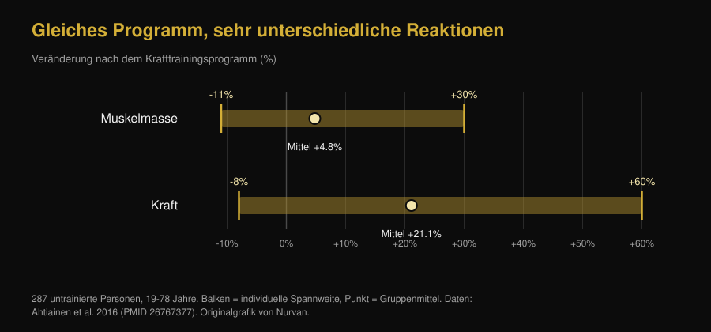

# Ektomorph oder mesomorph: entscheidet dein Körpertyp über den Zuwachs?

Di [Giammaria Loi](/autore/giammaria-loi) · aktualisiert am 7. Oktober 2026

„Ich bin ektomorph, deshalb baue ich keine Masse auf" gehört zu den meistgesagten Sätzen im Studio. Eine neue Arbeit aus dem Labor von Brad Schoenfeld hat den Satz an 40 Männern geprüft: Der Körperbau zu Beginn sagte den Muskelaufbau nicht brauchbar voraus. Wir haben die Studie gelesen, einen Punkt gefunden, den der Post auslässt, und die Arbeit von 1994 herausgesucht, die zum Gegenteil kam. Das Bild, das dabei entsteht, ist interessanter als beides.

## Kurz gefasst

- **Der Körpertyp sagt nicht voraus, wie viel Muskeln du aufbauen wirst.** Bei 40 untrainierten Männern über 9 Wochen zeigte höhere Mesomorphie (muskulöser Bau) kleine bis vernachlässigbare Effekte auf die Hypertrophie, die fast verschwanden, sobald Endomorphie und Ektomorphie berücksichtigt wurden.
- **Die Arbeit ist aber ein Preprint, noch ohne Peer-Review.** Dieses Detail fehlt in den meisten Posts, die sie verbreiten, und es verändert ihr Gewicht.
- **Der Körpertyp sagt sehr wohl voraus, wie stark du gerade bist.** Bei 36 aktiven Männern erklärte Mesomorphie allein 31,4 % der Varianz im Bankdrücken bei 3 Wiederholungsmaximum. Aktuelles Niveau und Fortschrittstempo sind zwei verschiedene Dinge.
- **Eine Studie von 1994 fand das Gegenteil — aber nur bei der Magermasse.** In 12 Wochen legten kräftig gebaute Probanden 1,6 kg fettfreie Masse zu, schlanke keinen signifikanten Zuwachs. Die Kraft stieg jedoch in beiden Gruppen gleich: im Mittel +13,8 %.
- **Die individuelle Streuung ist real und riesig, aber nicht am Aussehen ablesbar.** Bei 287 untrainierten Personen veränderte sich die Muskelmasse zwischen -11 % und +30 %, die Kraft zwischen -8 % und +60 %. Der bislang solideste Prädiktor sind Satellitenzellen, die kein Spiegel zeigt.

*Gleicher Wettkampf, gleiche Hantel, verschiedene Staturen: Die Frage ist, ob dieser Unterschied auch vorhersagt, wer am meisten zulegt. Foto: US Air Force, Wikimedia Commons, gemeinfrei.*

## Woher die Idee der drei Körpertypen kommt

In der heute genutzten Heath-Carter-Methode ist der Somatotyp keine feste Schublade, sondern ein Zahlentripel: **Endomorphie** (wie rund und fettreich), **Mesomorphie** (wie robust Knochenbau und Muskulatur), **Ektomorphie** (wie langgliedrig). Jeder hat alle drei Werte. „Ich bin ektomorph" heißt technisch: Der dritte Wert ist hoch im Verhältnis zu den beiden anderen.

Schon hier gibt es ein Problem. Eine Studie von 2025 mit 185 Männern und 156 Frauen hat gemessen, wie ähnlich sich Menschen in derselben Kategorie tatsächlich sind: Die morphologische Streuung innerhalb eines Etiketts war in den meisten Gruppen signifikant und bei Männern größer. Zwei „Mesomorphe" können sehr unterschiedliche Körper haben.

## Was die Studie, über die alle reden, tatsächlich gemacht hat

Vierzig junge, untrainierte Männer absolvierten neun Wochen lang zweimal pro Woche ein betreutes Ganzkörperprogramm, der Somatotyp wurde zu Beginn bestimmt. Die Hypertrophie wurde über Muskeldicke im Ultraschall, Bioimpedanz und Umfänge erfasst, die Leistung über Maximalkraft, Kraftausdauer, Unterkörperleistung und isometrische Kniestreckkraft.

Ergebnis: Höhere Mesomorphie zu Beginn zeigte eine hohe Wahrscheinlichkeit positiver Zusammenhänge mit Hypertrophie und Leistung, doch die geschätzten Effekte waren klein und lagen größtenteils innerhalb der **Region praktischer Äquivalenz** — jenem Bereich, den die Forscher vorab als „Unterschied, der im Alltag nichts ändert" definiert hatten. Nach Adjustierung für Endomorphie und Ektomorphie schwächte sich der Zusammenhang weiter ab.

Eine Ausnahme, von den Autoren ausdrücklich als explorativ markiert: Die kontinuierliche Mesomorphie zeigte einen moderaten positiven Zusammenhang mit der Verbesserung im Bankdrück-Maximum. Nichts Vergleichbares bei den übrigen Tests. Die Autoren berichten außerdem, dass eine höhere afrikanische genetische Abstammung mit höheren Mesomorphie-Werten einherging — ein Befund zur **Ausgangsmorphologie**, der sich in derselben Studie nicht in eine bessere Trainingsantwort übersetzte.

**Der Hinweis, der in den Posts fehlt:** Diese Arbeit ist ein Preprint, am 24. September 2026 auf SportRxiv veröffentlicht. Sie hat noch kein Peer-Review durchlaufen und ist nicht in PubMed indexiert. Das macht sie zu nützlicher Information, nicht zu einem Urteil. Die Autoren selbst fordern größere Stichproben und längere Zeiträume.

## Der Körpertyp zeigt deine heutige Kraft, nicht deinen künftigen Zuwachs

Hier liegt der Knoten, den fast alle überspringen. Der Somatotyp sagt *etwas* sehr gut voraus: die Kraft, die du jetzt gerade zeigst.

Bei 36 aktiven Männern korrelierte Mesomorphie mit dem 3-Wiederholungsmaximum im Bankdrücken (r = 0,560) und in der Kniebeuge (r = 0,550); Ektomorphie korrelierte mit beiden negativ. Mesomorphie allein erklärte 31,4 % der Varianz im Bankdrücken.

*Rund ein Drittel des Kraftunterschieds zwischen zwei Personen lässt sich am Körperbau ablesen. Keine dieser Korrelationen betrifft jedoch Zuwächse: Es sind Einmalmessungen. Nurvan-Grafik nach Ryan-Stewart et al. 2018.*

Beides zu verwechseln ist der Fehler, der den Mythos am Leben hält. Ein robuster Körper startet weiter vorn, und das sieht man; die Steigung der Kurve — wie viel du in den nächsten Monaten dazugewinnst — ist eine andere Variable, und die einzige, auf die du einwirken kannst.

## Was sagt den Zuwachs dann voraus?

Die individuelle Streuung ist real und groß. Bei 287 untrainierten Personen zwischen 19 und 78 Jahren veränderte sich die Muskelmasse nach einem Krafttrainingsprogramm im Mittel um +4,8 %, mit Einzelwerten zwischen -11 % und +30 %; die Kraft stieg im Mittel um +21,1 %, mit Einzelwerten zwischen -8 % und +60 %. In derselben Arbeit **erklärten Alter und Geschlecht diesen Unterschied nicht**.

*Die Balken reichen von der Person mit der schwächsten bis zu der mit der stärksten Reaktion auf dieselbe Art Programm. Nurvan-Grafik nach Ahtiainen et al. 2016.*

Wo liegt der Unterschied dann? Eine Arbeit mit 66 über 16 Wochen trainierten Personen teilte sie in drei Gruppen: extreme Hypertrophie (+58 % Faserquerschnitt), moderate (+28 %) und keine. Zu Beginn unterschied sich die Fasergröße **nicht** zwischen den Gruppen. Was die starken Responder auszeichnete, war die Menge ihrer Satellitenzellen — der Stammzellen des Muskels — und ihre Fähigkeit, den Fasern während des Trainings Zellkerne hinzuzufügen.

Anders gesagt: Der Prädiktor existiert, sitzt aber im Muskel und braucht eine Biopsie, keinen Blick in den Spiegel.

*Von außen sieht man nichts von dem, worauf es ankommt: Die Fähigkeit zu wachsen misst sich im Muskel. Foto: Nenad Stojkovic, Wikimedia Commons, CC BY 2.0.*

## Die Studie von 1994, die das Gegenteil sagte

Bevor man die Idee ablegt, gehört die Arbeit erwähnt, die das Preprint selbst im Literaturverzeichnis führt. 1994 wurden 21 Männer nach Statur eingeteilt — schlank oder kräftig, klassifiziert über den Magermasse-Index — und 12 Wochen lang zweimal wöchentlich trainiert.

| Ergebnis nach 12 Wochen | Kräftige Statur (n=11) | Schlanke Statur (n=10) |
|---|---|---|
| Fettfreie Masse | **+1,6 kg (+2,3 %)**, signifikant | kein signifikanter Zuwachs |
| Fettmasse | -2,4 kg (-11,3 %) | -1,7 kg (-10,8 %) |
| Isokinetische Kraft | im Mittel +13,8 % | im Mittel +13,8 % |

*Daten: Van Etten et al. 1994 (PMID 8201909). Der Kraftwert ist der für beide Gruppen gemeinsam berichtete Mittelwert; die Gruppen unterschieden sich darin nicht.*

Der „Hardgainer" hat also eine historische Grundlage, aber eine viel schmalere als erzählt: Sie betraf die Magermasse und nicht die Kraft, bei 21 Personen und mit einer Klassifikation, die kein Somatotyp ist. Dreißig Jahre später, mit besseren Messungen und doppelter Stichprobe, taucht der Effekt auf das Wachstum nicht wieder auf.

## Was die Forschung wirklich sagt

- **Bestätigt** — „Ein von Natur aus muskulöser Körper bedeutet nicht mehr Fähigkeit zum Muskelaufbau." — Das ist das Hauptergebnis des Preprints und passt dazu, dass die Streuung der Reaktion existiert, aber weder durch Alter noch Geschlecht noch Ausgangsfasergröße erklärt wird.
- **Zu präzisieren** — „Ektomorphe sind nicht zum Hardgainer verdammt." — Nach den neuen Daten richtig, doch die Arbeit von 1994 fand 1,6 kg mehr Magermasse bei den kräftiger Gebauten. Die Kraft stieg hingegen identisch.
- **Zu präzisieren** — „Eine neue Studie aus meinem Labor." — Es ist ein SportRxiv-Preprint vom 24. September 2026, ohne Peer-Review und ohne PubMed-Indexierung.
- **Bestätigt** — „Mesomorphie zeigte einen moderaten positiven Zusammenhang mit Zuwächsen im Bankdrücken." — Von den Autoren als explorative Analyse ausgewiesen, also kein gesichertes Ergebnis.
- **Widerlegt** — „Der Somatotyp sagt nichts Nützliches." — Das ist die schnelle Lesart aus den Kommentaren und sie hält nicht: Er sagt viel darüber, wie stark du **jetzt** bist (31,4 % der Varianz im Bankdrücken). Was er nicht sagt, ist, wie viel du zulegen wirst.
- **Nicht überprüfbar** — „Deshalb braucht dein Körpertyp ein anderes Training." — Keine der gelesenen Studien vergleicht nach Somatotyp zugewiesene Programme. Für „ektomorphes Training" gibt es keine Grundlage.

## So setzt du es um

1. **Hör auf, den Körpertyp als Prognose zu benutzen.** Er beschreibt, wie dein Körper heute gebaut ist. Er hat nicht gezeigt, dass er sagen kann, wie sehr er wachsen wird.
2. **Vergleiche dich mit dir selbst, nicht mit dem Bankpartner.** Wer kräftiger gebaut ist, startet höher. Ob dein Programm wirkt, zeigt deine eigene Kurve: Lasten, Wiederholungen und Maße über die Zeit.
3. **Gib einem Programm mindestens 10 bis 12 Wochen, bevor du urteilst.** Neun Wochen sind das Minimum, um überhaupt etwas zu sehen, und in diesem Zeitraum sind individuelle Unterschiede noch sehr verrauscht.
4. **Wenn du dich als Hardgainer fühlst, prüfe zuerst die zwei offensichtlichen Variablen:** genug Kalorien und Eiweiß sowie echte Laststeigerung. Fast immer liegt die Antwort dort, nicht im Körperbau.
5. **Protokolliere Lasten und Wiederholungen Satz für Satz.** Die individuelle Reaktion steuert man über den Reiz, und dafür muss man wissen, wie viel man setzt: Genau darum geht es beim Messen der Arbeit, wie wir im Artikel über [wie viele Wiederholungen Muskeln aufbauen](/de/blog/wie-viele-wiederholungen-muskelaufbau) erklären.
6. **Wechsle das Programm nicht, weil „du ektomorph bist",** sondern weil die Zahlen seit Wochen stagnieren. Das eine Kriterium ist überprüfbar, das andere nicht.

Das sind Durchschnittsergebnisse aus Studien an bestimmten Gruppen, kein persönlicher Plan. Bei Vorerkrankungen, laufender Therapie oder nach einer Verletzung sprich vor dem Aufbau eines Programms mit deiner Ärztin, deinem Arzt oder einer Fachperson.

> **Nurvan — deine Kurve, nicht deine Schublade**
>
> Nurvan erfasst Lasten, Wiederholungen und RIR Satz für Satz und stellt sie zusammen mit deinen Körpermaßen über die Zeit grafisch dar. So hängt die Frage „wachse ich gerade?" nicht mehr vom Spiegel und vom vermeintlichen Körpertyp ab, sondern wird von deinem realen Fortschritt Woche für Woche beantwortet.
>
> [Nurvan testen](https://nurvan.app)

## Häufige Fragen

**Beeinflusst der Körpertyp den Muskelaufbau?**

Laut der neuesten Arbeit — 40 untrainierte Männer über 9 Wochen — vernachlässigbar: Die Effekte der Mesomorphie auf die Hypertrophie waren klein und lagen größtenteils unter der von den Autoren definierten Schwelle praktischer Relevanz. Zu bedenken ist, dass es sich um ein Preprint ohne Peer-Review handelt.

**Heißt ektomorph automatisch Hardgainer?**

Nach den neuen Daten nicht. Eine Studie von 1994 mit 21 Männern fand zwar 1,6 kg mehr fettfreie Masse bei den kräftig Gebauten nach 12 Wochen, während die Schlanken keinen signifikanten Zuwachs hatten — die Kraft stieg in beiden Gruppen jedoch gleich.

**Wozu ist es dann gut, den eigenen Somatotyp zu kennen?**

Um den Ausgangspunkt zu beschreiben. Er ist ein brauchbarer Indikator für die Kraft, die du heute zeigst — Mesomorphie erklärte in einer Studie mit 36 aktiven Männern 31,4 % der Varianz im Bankdrücken — aber nicht für den Fortschritt, den dir das Training bringt.

**Gibt es ein eigenes Training für Ektomorphe, Mesomorphe und Endomorphe?**

Nach der gefundenen Evidenz nicht: Keine verfügbare Studie hat nach Somatotyp zugewiesene Programme verglichen. Entscheidend bleiben die bekannten Variablen — Volumen, Intensität, Frequenz, Progression und Erholung.

**Warum erzielen zwei Personen mit demselben Programm so unterschiedliche Ergebnisse?**

Weil die Streuung real ist: Bei 287 untrainierten Personen veränderte sich die Muskelmasse zwischen -11 % und +30 %. Der bislang solideste Faktor ist die Menge an Satellitenzellen im Muskel, nicht das äußere Erscheinungsbild.

## Lies auch

- [Wie viele Wiederholungen für Muskelaufbau? Der 8-12-Mythos](/de/blog/wie-viele-wiederholungen-muskelaufbau) — die Variablen, die laut Forschung wirklich über das Wachstum entscheiden.
- [Mr. Olympia 2026 Ergebnisse: Nick Walker gewinnt](/de/blog/mr-olympia-2026-ergebnisse-nick-walker) — was die Physiques an der Spitze wirklich trennt, jenseits des Knochenbaus.

## Quellen

1. Parnell C, Piñero A, Mohan A, Coleman M, Hopper A, Segtnan R, Androulakis Korakakis P, Wolf M, Roberts M, Campa F, Swinton P, Schoenfeld BJ, 2026. *Does body build predict training response? Association between baseline somatotype and resistance training-induced muscle hypertrophy and strength gains.* SportRxiv, Preprint vom 24. September 2026 (ohne Peer-Review) — [DOI](https://doi.org/10.51224/SportRxiv.1085)
2. Ryan-Stewart H, Faulkner J, Jobson S, 2018. *The influence of somatotype on anaerobic performance.* PLoS One 13(5):e0197761. PMID 29787610 — [DOI](https://doi.org/10.1371/journal.pone.0197761)
3. Ahtiainen JP, Walker S, Peltonen H et al., 2016. *Heterogeneity in resistance training-induced muscle strength and mass responses in men and women of different ages.* Age (Dordr) 38(1):10. PMID 26767377 — [DOI](https://doi.org/10.1007/s11357-015-9870-1)
4. Petrella JK, Kim JS, Mayhew DL, Cross JM, Bamman MM, 2008. *Potent myofiber hypertrophy during resistance training in humans is associated with satellite cell-mediated myonuclear addition: a cluster analysis.* J Appl Physiol 104(6):1736-1742. PMID 18436694 — [DOI](https://doi.org/10.1152/japplphysiol.01215.2007)
5. Van Etten LM, Verstappen FT, Westerterp KR, 1994. *Effect of body build on weight-training-induced adaptations in body composition and muscular strength.* Med Sci Sports Exerc 26(4):515-521. PMID 8201909 — [DOI](https://doi.org/10.1249/00005768-199404000-00018)
6. Campa F, Moon J, Petri C et al., 2025. *Beyond somatotype categories: composition-based clustering of body types in young adults.* Front Physiol 16:1722899. PMID 41357170 — [DOI](https://doi.org/10.3389/fphys.2025.1722899)

> Wissenschaftliche Quellen über PubMed recherchiert und am 7. Oktober 2026 geprüft. Das SportRxiv-Preprint wurde direkt auf der offiziellen Archivseite gelesen: Die hier genannten Zahlen stammen aus dem öffentlichen Abstract, da dort keine numerischen Effektschätzer bereitgestellt werden.

> Ausgangspunkt: der Post von [Brad Schoenfeld](https://www.instagram.com/p/DdtXZsPxbYU/) vom 25. September 2026 über Somatotyp und Trainingsantwort. Text, Aufbau, Faktenprüfungen, Vergleichstabelle und Grafiken dieses Artikels sind eigenständig erstellt.

**Giammaria Loi** ist der Gründer von Nurvan. Er trainiert seit 2012 mit Gewichten, arbeitet seit 2013 als FIPE-zertifizierter Personal Trainer und Coach und startet seit 2018 im Powerlifting auf nationaler Ebene. Jeder Artikel von ihm beginnt bei der Forschung und endet bei dem, was im Studio wirklich funktioniert.

> Hinweis: informativer Inhalt, der ärztlichen oder fachlichen Rat nicht ersetzt. Die genannten Ergebnisse sind Mittelwerte und Spannweiten aus Studien an bestimmten Gruppen und stellen keinen persönlichen Trainingsplan dar.
