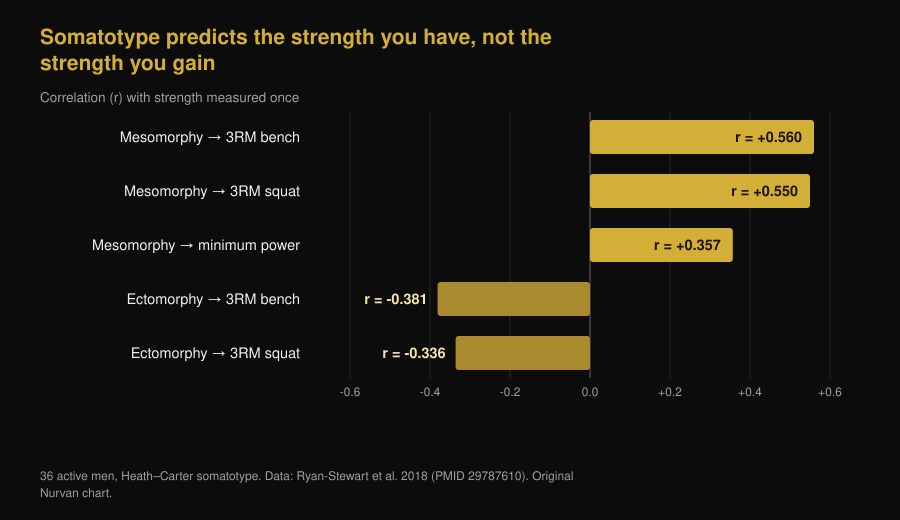
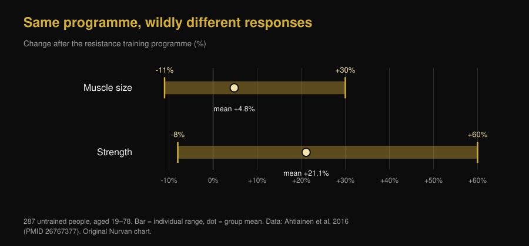

# Ectomorph or mesomorph: does your body type decide how much you grow?

Di [Giammaria Loi](/autore/giammaria-loi) · updated 7 October 2026

"I'm an ectomorph, that's why I can't put on size" is one of the most repeated lines in any gym. New work from Brad Schoenfeld's lab tested it on 40 men: starting body build did not usefully predict muscle growth. We read the study, found something the post leaves out, and dug up the 1994 paper that reached the opposite conclusion. The picture that comes out is more interesting than either.

## The short version

- **Somatotype does not predict how much muscle you will build.** In 40 untrained men trained for 9 weeks, greater mesomorphy (a muscular build) showed small-to-trivial effects on hypertrophy, and those mostly faded once endomorphy and ectomorphy were accounted for.
- **But the paper is a preprint, not yet peer reviewed.** That detail is missing from most posts sharing it, and it changes how much weight it should carry.
- **Somatotype does predict how strong you are right now.** In 36 active men, mesomorphy alone explained 31.4% of the variance in 3-rep-max bench press. Current level and rate of improvement are two different things.
- **A 1994 study found the opposite — but only for lean mass.** Over 12 weeks, solidly built men gained 1.6 kg of fat-free mass while slender men gained nothing significant. Strength, however, rose identically in both groups: 13.8% on average.
- **Individual variation is real and huge, but you cannot read it off someone's build.** In 287 untrained people, muscle size changed anywhere from -11% to +30% and strength from -8% to +60%. The strongest predictor found so far is satellite cell content, which no mirror will show you.

*Same meet, same bar, different builds — the question is whether that difference also predicts who improves most. Photo: US Air Force, Wikimedia Commons, public domain.*

## Where the three body types come from

In the Heath–Carter method used today, somatotype is not one label but three numbers: **endomorphy** (how round and fat-carrying you are), **mesomorphy** (how solid your frame and musculature are), **ectomorphy** (how linear you are). Everyone has all three scores. "I'm an ectomorph" technically means the third number is high relative to the other two.

There is already a problem here. A 2025 study of 185 men and 156 women measured how alike people in the same category really are: morphological spread within a single label was significant in most groups, and larger in men. Two "mesomorphs" can have very different bodies.

## What the study everyone is sharing actually did

Forty untrained young men followed a supervised full-body programme twice a week for nine weeks, with somatotype measured at baseline. Hypertrophy was assessed with ultrasound muscle thickness, bioelectrical impedance and girths; performance with maximal strength, muscular endurance, lower-body power and isometric knee extensor strength.

The result: greater baseline mesomorphy showed a high posterior probability of positive associations with hypertrophy and performance, but the estimated effects were small and largely inside the **region of practical equivalence** — the band the researchers had defined in advance as "a difference that changes nothing in real life". Adjusting for endomorphy and ectomorphy weakened the association further.

One exception, which the authors flag as exploratory: continuous mesomorphy showed a modest positive association with improvement in bench press 1RM. Nothing comparable on the other tests. The authors also report that greater African genetic ancestry was associated with higher mesomorphy scores — a finding about **baseline morphology** that, in the same study, did not translate into better training responsiveness.

**The caveat the posts skip:** this paper is a preprint posted on SportRxiv on 24 September 2026. It has not been peer reviewed and is not indexed in PubMed. That makes it useful information, not a verdict. The authors themselves call for larger samples and longer programmes.

## Body type tells you your strength today, not your growth tomorrow

This is the knot almost everyone skips. Somatotype predicts *something* very well: the strength you can express right now.

In 36 active men, mesomorphy correlated with 3RM bench press (r = 0.560) and 3RM back squat (r = 0.550); ectomorphy correlated negatively with both. Mesomorphy alone explained 31.4% of the variance in bench press.

*About a third of the strength difference between one person and another can be read from build. None of these correlations are about improvement, though: they are single-timepoint measurements. Nurvan chart, data from Ryan-Stewart et al. 2018.*

Confusing the two is what keeps the myth alive. A solid frame starts further ahead, and that shows; but the slope of the curve — how much you add over the next few months — is a different variable, and the only one you can act on.

## So what does predict growth?

Individual variation is real and large. In 287 untrained people aged 19 to 78, muscle size changed by +4.8% on average after a resistance programme, with individual results ranging from -11% to +30%; strength rose 21.1% on average, with individual results from -8% to +60%. In that same work, **age and sex did not explain the spread**.

*The bars span the worst and the best responder to the same kind of programme. Nurvan chart, data from Ahtiainen et al. 2016.*

So where does the difference sit? A study of 66 people trained for 16 weeks sorted them into three clusters: extreme hypertrophy (+58% fibre size), modest (+28%) and none. At baseline, fibre size did **not** differ between clusters. What separated the extreme responders was their satellite cell population — the muscle's stem cells — and their ability to add nuclei to fibres during training.

In other words: the predictor exists, but it sits inside the muscle and takes a biopsy to measure, not a look in the mirror. We covered this in more detail in our piece on [how much genetics separates high and low responders](/en/blog/genetics-high-low-responders).

*From the outside you see none of what actually matters: the capacity to grow is measured inside the muscle. Photo: Nenad Stojkovic, Wikimedia Commons, CC BY 2.0.*

## The 1994 study that said the opposite

Before filing the idea away, it is worth citing the paper the preprint itself lists in its bibliography. In 1994, 21 men were split by build — slender or solid, classified on fat-free mass index — and trained for 12 weeks, twice a week.

| Outcome after 12 weeks | Solid build (n=11) | Slender build (n=10) |
|---|---|---|
| Fat-free mass | **+1.6 kg (+2.3%)**, significant | no significant increase |
| Fat mass | -2.4 kg (-11.3%) | -1.7 kg (-10.8%) |
| Isokinetic strength | +13.8% on average | +13.8% on average |

*Data: Van Etten et al. 1994 (PMID 8201909). The strength figure is the average reported across both groups, which did not differ from each other.*

So the "hard gainer" has a historical basis, but a far narrower one than the story suggests: it concerned lean mass and not strength, in 21 people, using a classification method that is not somatotype. Thirty years later, with better measurement and twice the sample, the effect on growth does not reappear.

## What the research actually says

- **Confirmed** — "Having a naturally muscular build does not mean you have a greater capacity to build muscle." — This is the preprint's main finding, and it fits the wider picture: response varies a lot, but not by age, sex or baseline fibre size.
- **Needs nuance** — "Ectomorphs are not destined to be hard gainers." — True on the new data, but the 1994 study found a 1.6 kg lean mass advantage in solidly built men. Strength, though, climbed identically in both groups.
- **Needs nuance** — "A new study from my lab." — It is a SportRxiv preprint from 24 September 2026, not yet peer reviewed or indexed in PubMed.
- **Confirmed** — "Mesomorphy showed a modest positive association with bench press gains." — Reported by the authors as exploratory, so not to be treated as established.
- **Busted** — "Somatotype tells you nothing useful." — That is the fast take in the comments, and it does not hold: it tells you a lot about how strong you are **now** (31.4% of bench press variance). What it does not tell you is how much you will improve.
- **Unverifiable** — "This is why your body type needs a different training approach." — None of the studies we read compared programmes assigned by somatotype. There is no basis for prescribing "ectomorph training".

## How to apply it

1. **Stop using somatotype as a forecast.** It describes how your body is built today. It has not shown any ability to say how much it will grow.
2. **Compare yourself to yourself, not to your bench partner.** The sturdier lifter starts higher up. What tells you whether your programme works is your own curve: loads, reps and measurements over time.
3. **Give a programme at least 10–12 weeks before judging it.** Nine weeks is the minimum to see anything, and over that span individual differences are still very noisy.
4. **If you feel like a hard gainer, check the two obvious variables first:** enough calories and protein, and real load progression. Almost always the answer is there, not in your build.
5. **Track loads and reps set by set.** You manage individual response by adjusting the stimulus, and to adjust it you have to know how much you are giving: that is the point of measuring the work, as we explain in our piece on [how many reps actually build muscle](/en/blog/how-many-reps-build-muscle).
6. **Don't change programme because "you're an ectomorph",** change it because the numbers have been flat for weeks. One criterion is checkable, the other is not.

These are average results from studies on specific groups, not a personalised plan. If you have a medical condition, are on treatment or are coming back from injury, talk to your doctor or a qualified professional before setting up a programme.

> **Nurvan — your curve, not your category**
>
> Nurvan tracks loads, reps and RIR set by set and charts them over time alongside your body measurements. So "am I actually growing?" stops depending on the mirror and on which body type you think you are, and gets answered by your real week-to-week progression.
>
> [Try Nurvan](https://nurvan.app)

## FAQ

**Does body type affect muscle growth?**

According to the most recent work — 40 untrained men over 9 weeks — negligibly: mesomorphy's effects on hypertrophy were small and mostly inside the threshold of practical irrelevance the authors had defined. Bear in mind it is a preprint that has not yet been peer reviewed.

**Does being an ectomorph mean you are a hard gainer?**

Not on the new data. A 1994 study of 21 men did find 1.6 kg more fat-free mass in solidly built subjects after 12 weeks, while slender ones showed no significant gain — but strength rose identically in both groups.

**What is knowing your somatotype good for, then?**

Describing your starting point. It is a decent indicator of the strength you can express today — mesomorphy explained 31.4% of bench press variance in a study of 36 active men — but not of the improvement you will get from training.

**Is there a different training style for ectomorphs, mesomorphs and endomorphs?**

Not on the evidence we found: no available study has compared programmes assigned by somatotype. The variables that matter are still the known ones — volume, intensity, frequency, progression and recovery.

**Why do two people on the same programme get such different results?**

Because the variation is real: in 287 untrained people, muscle size changed from -11% to +30%. The most solid factor identified so far is satellite cell content in the muscle, not outward appearance.

## Read next

- [Low responders: how much do genetics limit muscle?](/en/blog/genetics-high-low-responders) — why the same programme produces different results, and how much of that gap is inherited.
- [How many reps build muscle? The 8-12 myth](/en/blog/how-many-reps-build-muscle) — the variables research shows actually drive growth.
- [Mr. Olympia 2026 Results: Nick Walker Wins in Vegas](/en/blog/mr-olympia-2026-results-nick-walker) — what really separates physiques at the top, beyond the frame they started with.

## Sources

1. Parnell C, Piñero A, Mohan A, Coleman M, Hopper A, Segtnan R, Androulakis Korakakis P, Wolf M, Roberts M, Campa F, Swinton P, Schoenfeld BJ, 2026. *Does body build predict training response? Association between baseline somatotype and resistance training-induced muscle hypertrophy and strength gains.* SportRxiv, preprint posted 24 September 2026 (not peer reviewed) — [DOI](https://doi.org/10.51224/SportRxiv.1085)
2. Ryan-Stewart H, Faulkner J, Jobson S, 2018. *The influence of somatotype on anaerobic performance.* PLoS One 13(5):e0197761. PMID 29787610 — [DOI](https://doi.org/10.1371/journal.pone.0197761)
3. Ahtiainen JP, Walker S, Peltonen H et al., 2016. *Heterogeneity in resistance training-induced muscle strength and mass responses in men and women of different ages.* Age (Dordr) 38(1):10. PMID 26767377 — [DOI](https://doi.org/10.1007/s11357-015-9870-1)
4. Petrella JK, Kim JS, Mayhew DL, Cross JM, Bamman MM, 2008. *Potent myofiber hypertrophy during resistance training in humans is associated with satellite cell-mediated myonuclear addition: a cluster analysis.* J Appl Physiol 104(6):1736-1742. PMID 18436694 — [DOI](https://doi.org/10.1152/japplphysiol.01215.2007)
5. Van Etten LM, Verstappen FT, Westerterp KR, 1994. *Effect of body build on weight-training-induced adaptations in body composition and muscular strength.* Med Sci Sports Exerc 26(4):515-521. PMID 8201909 — [DOI](https://doi.org/10.1249/00005768-199404000-00018)
6. Campa F, Moon J, Petri C et al., 2025. *Beyond somatotype categories: composition-based clustering of body types in young adults.* Front Physiol 16:1722899. PMID 41357170 — [DOI](https://doi.org/10.3389/fphys.2025.1722899)

> Scientific sources retrieved from PubMed and verified on 7 October 2026. The SportRxiv preprint was read directly on the archive's official page: the figures reported here come from the public abstract, because no numeric effect estimates are made available there.

> Starting point: the post by [Brad Schoenfeld](https://www.instagram.com/p/DdtXZsPxbYU/) of 25 September 2026 on somatotype and training response. The text, structure, fact-checks, comparison table and charts in this article are original.

**Giammaria Loi** is the founder of Nurvan. He has been lifting since 2012, has worked as a FIPE-certified personal trainer and coach since 2013, and has competed in powerlifting at national level since 2018. Every article he writes starts from the research and ends with what actually works in the gym.

> Note: this is informational content and does not replace advice from a doctor or qualified professional. The results cited are averages and ranges observed in studies on specific groups, and do not constitute a personalised training programme.
