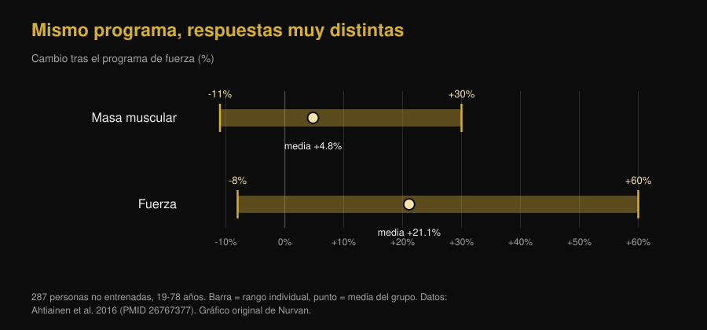

# Ectomorfo o mesomorfo: ¿tu tipo de cuerpo decide cuánto creces?

Di [Giammaria Loi](/autore/giammaria-loi) · actualizado el 7 de octubre de 2026

"Soy ectomorfo, por eso no gano masa" es una de las frases más repetidas en cualquier gimnasio. Un trabajo nuevo del laboratorio de Brad Schoenfeld la puso a prueba con 40 hombres: la constitución de partida no predijo de forma útil el crecimiento muscular. Hemos leído el estudio, hemos encontrado algo que el post no cuenta y hemos recuperado el trabajo de 1994 que llegaba a la conclusión contraria. El cuadro que sale es más interesante que cualquiera de los dos.

## En resumen

- **El somatotipo no predice cuánto músculo vas a ganar.** En 40 hombres no entrenados seguidos durante 9 semanas, una mayor mesomorfia (constitución musculosa) mostró efectos de pequeños a triviales sobre la hipertrofia, y casi desaparecían al tener en cuenta la endomorfia y la ectomorfia.
- **Pero el trabajo es un preprint, aún sin revisión por pares.** Es el detalle que falta en la mayoría de los posts que lo están difundiendo, y cambia el peso que hay que darle.
- **El somatotipo sí predice lo fuerte que eres ahora.** En 36 hombres activos, la mesomorfia por sí sola explicaba el 31,4% de la varianza en el press de banca a 3 repeticiones máximas. Nivel actual y velocidad de mejora son dos cosas distintas.
- **Un estudio de 1994 encontró lo contrario, pero solo en masa magra.** En 12 semanas, los sujetos de constitución sólida ganaron 1,6 kg de masa magra y los delgados ningún aumento significativo. La fuerza, en cambio, subió igual en los dos grupos: un 13,8% de media.
- **La variabilidad individual existe y es enorme, pero no se lee en el aspecto.** En 287 personas no entrenadas, la masa muscular cambió entre -11% y +30% y la fuerza entre -8% y +60%. El predictor más sólido encontrado hasta ahora son las células satélite, que ningún espejo enseña.

*Misma competición, misma barra, constituciones distintas: la pregunta es si esa diferencia predice también quién mejorará más. Foto: US Air Force, Wikimedia Commons, dominio público.*

## De dónde viene la idea de los tres somatotipos

En el método Heath-Carter, el que se usa hoy, el somatotipo no es una categoría cerrada sino una terna de números: **endomorfia** (cuánta grasa y redondez acumulas), **mesomorfia** (cuán robusta es tu estructura y tu musculatura), **ectomorfia** (cuán longilíneo eres). Todo el mundo tiene las tres puntuaciones. "Soy ectomorfo" significa, técnicamente, que el tercer número es alto respecto a los otros dos.

Ya aquí hay un problema. Un estudio de 2025 con 185 hombres y 156 mujeres midió cuánto se parecen de verdad las personas que caen en la misma categoría: la dispersión morfológica dentro de una misma etiqueta fue significativa en la mayoría de los grupos, y mayor en hombres. Dos "mesomorfos" pueden tener cuerpos muy distintos.

## Qué hizo realmente el estudio del que habla todo el mundo

Cuarenta hombres jóvenes y no entrenados siguieron un programa full body supervisado, dos veces por semana durante nueve semanas, con el somatotipo medido al inicio. La hipertrofia se evaluó con grosor muscular por ecografía, bioimpedancia y perímetros; el rendimiento con fuerza máxima, resistencia muscular, potencia del tren inferior y fuerza isométrica de rodilla.

Resultado: una mayor mesomorfia inicial mostraba alta probabilidad de asociaciones positivas con hipertrofia y rendimiento, pero los efectos estimados eran pequeños y en buena parte dentro de la **región de equivalencia práctica**, es decir, el intervalo que los investigadores habían decidido de antemano considerar "una diferencia que no cambia nada en la vida real". Al ajustar por endomorfia y ectomorfia, la asociación se atenuaba aún más.

Una excepción, que los autores marcan como exploratoria: la mesomorfia continua mostraba una asociación positiva modesta con la mejora del máximo en press de banca. Nada comparable en las otras pruebas. Los autores también informan de que una mayor ascendencia genética africana se asoció con puntuaciones de mesomorfia más altas: un dato sobre la **morfología de partida** que, en el mismo estudio, no se tradujo en mejor respuesta al entrenamiento.

**La precisión que falta en los posts:** este trabajo es un preprint publicado en SportRxiv el 24 de septiembre de 2026. Todavía no ha pasado la revisión por pares ni está indexado en PubMed. Es información útil, no una sentencia. Los propios autores piden muestras mayores y periodos más largos.

## El somatotipo dice cuánta fuerza tienes hoy, no cuánto crecerás

Aquí está el nudo que casi todos se saltan. El somatotipo *algo* predice muy bien: la fuerza que expresas ahora mismo.

En 36 hombres activos, la mesomorfia correlacionaba con el máximo de press de banca a 3 repeticiones (r = 0,560) y con el de sentadilla (r = 0,550); la ectomorfia correlacionaba en negativo con ambos. Solo la mesomorfia explicaba el 31,4% de la varianza en press de banca.

*Un tercio de la diferencia de fuerza entre una persona y otra se lee en la constitución. Ninguna de estas correlaciones habla de mejoras, eso sí: son medidas tomadas una sola vez. Gráfico de Nurvan con datos de Ryan-Stewart et al. 2018.*

Confundir ambas cosas es el error que mantiene vivo el mito. Un cuerpo robusto parte más adelante, y eso se ve; pero la pendiente de la curva — cuánto sumas en los próximos meses — es otra variable, y es la única sobre la que puedes actuar.

## Entonces, ¿qué predice el crecimiento?

La variabilidad individual es real y grande. En 287 personas no entrenadas de 19 a 78 años, tras un programa de fuerza la masa muscular cambió de media un +4,8%, con resultados individuales entre -11% y +30%; la fuerza subió de media un +21,1%, con resultados individuales entre -8% y +60%. En ese mismo trabajo, **la edad y el sexo no explicaban esa diferencia**.

*Las barras van de la persona que peor respondió a la que mejor respondió al mismo tipo de programa. Gráfico de Nurvan con datos de Ahtiainen et al. 2016.*

¿Dónde está la diferencia, entonces? Un trabajo con 66 personas entrenadas durante 16 semanas las dividió en tres grupos: hipertrofia extrema (+58% de sección de fibra), modesta (+28%) y nula. Al inicio, el tamaño de las fibras **no** difería entre grupos: lo que distinguía a los grandes respondedores era su cantidad de células satélite — las células madre del músculo — y su capacidad de añadir núcleos a las fibras durante el entrenamiento.

Dicho de otro modo: el predictor existe, pero está dentro del músculo y se mide con una biopsia, no mirándose al espejo.

*Desde fuera no se ve nada de lo que de verdad cuenta: la capacidad de crecer se mide dentro del músculo. Foto: Nenad Stojkovic, Wikimedia Commons, CC BY 2.0.*

## El estudio de 1994 que decía lo contrario

Antes de archivar la idea, conviene citar el trabajo que el propio preprint incluye en su bibliografía. En 1994, 21 hombres fueron divididos por constitución — delgada o sólida, clasificada por el índice de masa magra — y entrenados 12 semanas, dos veces por semana.

| Resultado tras 12 semanas | Constitución sólida (n=11) | Constitución delgada (n=10) |
|---|---|---|
| Masa magra | **+1,6 kg (+2,3%)**, significativo | sin aumento significativo |
| Masa grasa | -2,4 kg (-11,3%) | -1,7 kg (-10,8%) |
| Fuerza isocinética | +13,8% de media | +13,8% de media |

*Datos: Van Etten et al. 1994 (PMID 8201909). El valor de fuerza es la media comunicada para el conjunto de ambos grupos, que no diferían entre sí.*

Así que el "hard gainer" tiene una base histórica, pero mucho más estrecha de lo que se cuenta: afectaba a la masa magra y no a la fuerza, en 21 personas y con un método de clasificación distinto del somatotipo. Treinta años después, con mejores medidas y el doble de muestra, el efecto sobre el crecimiento no reaparece.

## Qué dice realmente la investigación

- **Confirmado** — "Tener un físico naturalmente musculoso no significa tener más capacidad de construir músculo." — Es el resultado principal del preprint, coherente con que la variabilidad de respuesta existe pero no la explican la edad, el sexo ni el tamaño inicial de las fibras.
- **Matizable** — "Los ectomorfos no están condenados a ganar masa con dificultad." — Cierto con los datos nuevos, pero el trabajo de 1994 encontró 1,6 kg más de masa magra en los sujetos más sólidos. La fuerza, en cambio, subió idéntica en ambos grupos.
- **Matizable** — "Un nuevo estudio de mi laboratorio." — Es un preprint de SportRxiv del 24 de septiembre de 2026, sin revisión por pares ni indexación en PubMed.
- **Confirmado** — "La mesomorfia mostró una asociación positiva modesta con las ganancias en press de banca." — Los autores la presentan como análisis exploratorio, así que no debe tomarse como resultado establecido.
- **Desmentido** — "El somatotipo no dice nada útil." — Es la lectura rápida de los comentarios y no se sostiene: dice mucho sobre lo fuerte que eres **ahora** (el 31,4% de la varianza en press de banca). Lo que no dice es cuánto mejorarás.
- **No verificable** — "Por eso tu tipo de cuerpo necesita otro entrenamiento." — Ninguno de los estudios que hemos leído compara programas asignados por somatotipo. No hay base para prescribir entrenamientos "de ectomorfo".

## Cómo aplicarlo

1. **Deja de usar el somatotipo como predicción.** Sirve para describir cómo es tu cuerpo hoy. No ha demostrado capacidad para decir cuánto crecerá.
2. **Compárate contigo, no con tu compañero de banca.** Quien es más robusto parte más arriba. Lo que indica si el programa funciona es tu curva: cargas, repeticiones y medidas a lo largo del tiempo.
3. **Dale al programa al menos 10-12 semanas antes de juzgarlo.** Nueve semanas son el mínimo para ver algo, y en ese plazo las diferencias individuales siguen siendo muy ruidosas.
4. **Si te sientes un "hard gainer", revisa antes las dos variables obvias:** calorías y proteínas suficientes, y progresión real de la carga. Casi siempre la respuesta está ahí, no en la constitución.
5. **Lleva el registro de cargas y repeticiones serie a serie.** La respuesta individual se gestiona ajustando el estímulo, y para ajustarlo hay que saber cuánto estás dando: es el sentido de medir el trabajo, como explicamos en el artículo sobre [cuántas repeticiones hacen falta para la masa](/es/blog/cuantas-repeticiones-masa-muscular).
6. **No cambies de programa porque "eres ectomorfo",** cámbialo porque los números llevan semanas planos. Un criterio es comprobable, el otro no.

Estos son resultados medios de estudios con grupos concretos, no un plan personalizado. Si tienes alguna patología, sigues un tratamiento o vuelves de una lesión, háblalo con tu médico o con un profesional antes de montar un programa.

> **Nurvan — tu curva, no tu categoría**
>
> Nurvan registra cargas, repeticiones y RIR serie a serie y los lleva a gráfico en el tiempo, junto con tus medidas corporales. Así la pregunta "¿estoy creciendo?" deja de depender del espejo y del somatotipo que creas tener, y se responde con tu progresión real semana a semana.
>
> [Prueba Nurvan](https://nurvan.app)

## Preguntas frecuentes

**¿El tipo de cuerpo influye en el crecimiento muscular?**

Según el trabajo más reciente, con 40 hombres no entrenados durante 9 semanas, de forma insignificante: los efectos de la mesomorfia sobre la hipertrofia eran pequeños y en buena parte dentro del umbral de irrelevancia práctica definido por los autores. Conviene recordar que es un preprint aún sin revisión por pares.

**¿Ser ectomorfo significa que te costará ganar masa?**

No según los datos nuevos. Un estudio de 1994 con 21 hombres sí encontró 1,6 kg más de masa magra en los de constitución sólida tras 12 semanas, mientras los delgados no tuvieron aumentos significativos, pero en ese mismo estudio la fuerza creció igual en ambos grupos.

**¿Para qué sirve entonces conocer el propio somatotipo?**

Para describir el punto de partida. Es un buen indicador de la fuerza que expresas hoy — la mesomorfia explicaba el 31,4% de la varianza en press de banca en un estudio con 36 hombres activos — pero no de la mejora que lograrás entrenando.

**¿Existe un entrenamiento distinto para ectomorfos, mesomorfos y endomorfos?**

No según la evidencia que hemos encontrado: ningún estudio disponible ha comparado programas asignados por somatotipo. Las variables que cuentan siguen siendo las conocidas: volumen, intensidad, frecuencia, progresión y recuperación.

**¿Por qué dos personas con el mismo programa obtienen resultados tan distintos?**

Porque la variabilidad es real: en 287 personas no entrenadas la masa muscular cambió entre -11% y +30%. El factor más sólido identificado hasta ahora es la cantidad de células satélite del músculo, no el aspecto exterior.

## Lee también

- [Cuántas repeticiones para masa muscular: el mito del 8-12](/es/blog/cuantas-repeticiones-masa-muscular) — las variables que la investigación señala como realmente decisivas para crecer.
- [Mr. Olympia 2026: resultados y qué nos enseña Nick Walker](/es/blog/mr-olympia-2026-resultados-nick-walker) — qué separa de verdad a los físicos de élite, más allá de la estructura de partida.

## Fuentes

1. Parnell C, Piñero A, Mohan A, Coleman M, Hopper A, Segtnan R, Androulakis Korakakis P, Wolf M, Roberts M, Campa F, Swinton P, Schoenfeld BJ, 2026. *Does body build predict training response? Association between baseline somatotype and resistance training-induced muscle hypertrophy and strength gains.* SportRxiv, preprint del 24 de septiembre de 2026 (sin revisión por pares) — [DOI](https://doi.org/10.51224/SportRxiv.1085)
2. Ryan-Stewart H, Faulkner J, Jobson S, 2018. *The influence of somatotype on anaerobic performance.* PLoS One 13(5):e0197761. PMID 29787610 — [DOI](https://doi.org/10.1371/journal.pone.0197761)
3. Ahtiainen JP, Walker S, Peltonen H et al., 2016. *Heterogeneity in resistance training-induced muscle strength and mass responses in men and women of different ages.* Age (Dordr) 38(1):10. PMID 26767377 — [DOI](https://doi.org/10.1007/s11357-015-9870-1)
4. Petrella JK, Kim JS, Mayhew DL, Cross JM, Bamman MM, 2008. *Potent myofiber hypertrophy during resistance training in humans is associated with satellite cell-mediated myonuclear addition: a cluster analysis.* J Appl Physiol 104(6):1736-1742. PMID 18436694 — [DOI](https://doi.org/10.1152/japplphysiol.01215.2007)
5. Van Etten LM, Verstappen FT, Westerterp KR, 1994. *Effect of body build on weight-training-induced adaptations in body composition and muscular strength.* Med Sci Sports Exerc 26(4):515-521. PMID 8201909 — [DOI](https://doi.org/10.1249/00005768-199404000-00018)
6. Campa F, Moon J, Petri C et al., 2025. *Beyond somatotype categories: composition-based clustering of body types in young adults.* Front Physiol 16:1722899. PMID 41357170 — [DOI](https://doi.org/10.3389/fphys.2025.1722899)

> Fuentes científicas recuperadas de PubMed y verificadas el 7 de octubre de 2026. El preprint de SportRxiv se leyó directamente en la página oficial del archivo: los datos aquí recogidos proceden del resumen público, porque allí no se facilita ningún valor numérico de efecto.

> Punto de partida: el post de [Brad Schoenfeld](https://www.instagram.com/p/DdtXZsPxbYU/) del 25 de septiembre de 2026 sobre somatotipo y respuesta al entrenamiento. El texto, la estructura, las verificaciones, la tabla comparativa y los gráficos de este artículo son originales.

**Giammaria Loi** es el fundador de Nurvan. Entrena con pesas desde 2012, trabaja como entrenador personal y coach certificado FIPE desde 2013 y compite en powerlifting a nivel nacional desde 2018. Cada artículo que firma parte de los estudios científicos y llega a lo que funciona de verdad en el gimnasio.

> Nota: contenido informativo, no sustituye la opinión de un médico o de un profesional. Los resultados citados son medias e intervalos observados en estudios con grupos concretos y no constituyen un programa de entrenamiento personalizado.
