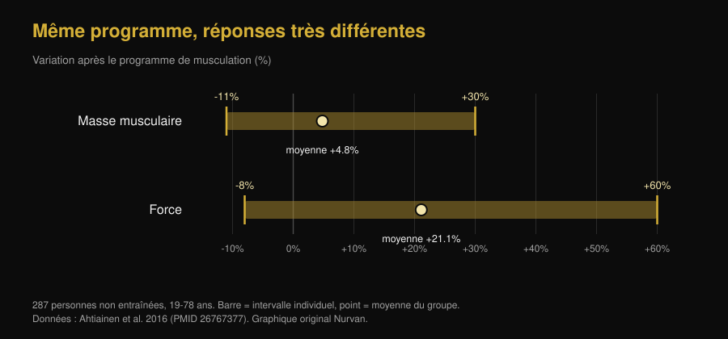

# Ectomorphe ou mésomorphe : votre morphotype décide-t-il de vos gains ?

Di [Giammaria Loi](/autore/giammaria-loi) · mis à jour le 7 octobre 2026

« Je suis ectomorphe, c'est pour ça que je ne prends pas de masse » est l'une des phrases les plus entendues en salle. Un nouveau travail du laboratoire de Brad Schoenfeld l'a testée sur 40 hommes : la morphologie de départ n'a pas prédit la prise de muscle de façon utile. Nous avons lu l'étude, trouvé un point que le post passe sous silence, et ressorti le travail de 1994 qui concluait l'inverse. Le tableau qui en ressort est plus intéressant que les deux.

## L'essentiel

- **Le somatotype ne prédit pas la masse que vous allez prendre.** Sur 40 hommes non entraînés suivis 9 semaines, une mésomorphie plus marquée (carrure musclée) a montré des effets faibles à négligeables sur l'hypertrophie, qui disparaissaient presque une fois l'endomorphie et l'ectomorphie prises en compte.
- **Mais ce travail est une prépublication, pas encore relue par les pairs.** C'est le détail absent de la plupart des posts qui le relaient, et il change le poids à lui accorder.
- **Le somatotype prédit en revanche votre force actuelle.** Chez 36 hommes actifs, la mésomorphie expliquait à elle seule 31,4 % de la variance au développé couché à 3 répétitions maximales. Niveau actuel et vitesse de progression sont deux choses différentes.
- **Une étude de 1994 trouvait l'inverse, mais seulement sur la masse maigre.** En 12 semaines, les sujets de carrure solide ont gagné 1,6 kg de masse maigre, les sujets minces aucun gain significatif. La force, elle, a progressé pareil dans les deux groupes : +13,8 % en moyenne.
- **La variabilité individuelle est réelle et énorme, mais elle ne se lit pas sur l'apparence.** Chez 287 personnes non entraînées, la masse musculaire a varié de -11 % à +30 % et la force de -8 % à +60 %. Le prédicteur le plus solide trouvé à ce jour, ce sont les cellules satellites, qu'aucun miroir ne montre.

*Même compétition, même barre, carrures différentes : la question est de savoir si cette différence prédit aussi qui progressera le plus. Photo : US Air Force, Wikimedia Commons, domaine public.*

## D'où vient l'idée des trois morphotypes

Dans la méthode Heath-Carter, celle utilisée aujourd'hui, le somatotype n'est pas une catégorie fermée mais un triplet de chiffres : **endomorphie** (rondeur et masse grasse), **mésomorphie** (robustesse de la charpente et de la musculature), **ectomorphie** (linéarité). Tout le monde possède les trois scores. « Je suis ectomorphe » signifie, techniquement, que le troisième chiffre est élevé par rapport aux deux autres.

Il y a déjà un problème ici. Une étude de 2025 sur 185 hommes et 156 femmes a mesuré à quel point se ressemblent vraiment les personnes classées dans la même catégorie : la dispersion morphologique à l'intérieur d'une même étiquette était significative dans la plupart des groupes, et plus forte chez les hommes. Deux « mésomorphes » peuvent avoir des corps très différents.

## Ce que l'étude dont tout le monde parle a vraiment fait

Quarante hommes jeunes et non entraînés ont suivi un programme full body supervisé, deux fois par semaine pendant neuf semaines, avec mesure du somatotype au départ. L'hypertrophie a été évaluée par épaisseur musculaire à l'échographie, impédancemétrie et circonférences ; la performance par force maximale, endurance musculaire, puissance du bas du corps et force isométrique du genou.

Résultat : une mésomorphie initiale plus élevée montrait une forte probabilité d'associations positives avec l'hypertrophie et la performance, mais les effets estimés étaient faibles et en grande partie à l'intérieur de la **région d'équivalence pratique** — l'intervalle que les chercheurs avaient décidé à l'avance de considérer comme « une différence qui ne change rien dans la vraie vie ». Après ajustement sur l'endomorphie et l'ectomorphie, l'association s'atténuait encore.

Une exception, signalée comme exploratoire par les auteurs : la mésomorphie continue montrait une association positive modeste avec la progression du maximal au développé couché. Rien de comparable sur les autres tests. Les auteurs rapportent aussi qu'une ascendance génétique africaine plus marquée était associée à des scores de mésomorphie plus élevés — une donnée sur la **morphologie de départ** qui, dans la même étude, ne s'est pas traduite par une meilleure réponse à l'entraînement.

**La précision qui manque dans les posts :** ce travail est une prépublication déposée sur SportRxiv le 24 septembre 2026. Elle n'a pas encore été relue par les pairs et n'est pas indexée dans PubMed. C'est une information utile, pas un verdict. Les auteurs eux-mêmes réclament des échantillons plus grands et des durées plus longues.

## Le morphotype dit votre force d'aujourd'hui, pas vos gains de demain

C'est là le nœud que presque tout le monde saute. Le somatotype prédit *quelque chose* très bien : la force que vous exprimez maintenant.

Chez 36 hommes actifs, la mésomorphie corrélait avec le maximal au développé couché sur 3 répétitions (r = 0,560) et avec celui du squat (r = 0,550) ; l'ectomorphie corrélait négativement avec les deux. La mésomorphie seule expliquait 31,4 % de la variance au développé couché.

*Un tiers de l'écart de force entre deux personnes se lit sur la carrure. Aucune de ces corrélations ne porte toutefois sur la progression : ce sont des mesures prises une seule fois. Graphique Nurvan d'après Ryan-Stewart et al. 2018.*

Confondre les deux, c'est l'erreur qui entretient le mythe. Une carrure solide part plus haut, et ça se voit ; mais la pente de la courbe — ce que vous ajoutez dans les mois à venir — est une autre variable, et c'est la seule sur laquelle vous pouvez agir.

## Alors, qu'est-ce qui prédit la prise de muscle ?

La variabilité individuelle est réelle et large. Chez 287 personnes non entraînées de 19 à 78 ans, après un programme de musculation la masse musculaire a varié en moyenne de +4,8 %, avec des résultats individuels entre -11 % et +30 % ; la force a augmenté en moyenne de +21,1 %, avec des résultats individuels entre -8 % et +60 %. Dans ce même travail, **l'âge et le sexe n'expliquaient pas cet écart**.

*Les barres vont de la personne qui a le moins répondu à celle qui a le plus répondu au même type de programme. Graphique Nurvan d'après Ahtiainen et al. 2016.*

Où se situe alors la différence ? Un travail sur 66 personnes entraînées pendant 16 semaines les a réparties en trois groupes : hypertrophie extrême (+58 % de section des fibres), modeste (+28 %) et nulle. Au départ, la taille des fibres **ne** différait **pas** entre les groupes : ce qui distinguait les grands répondeurs, c'était leur quantité de cellules satellites — les cellules souches du muscle — et leur capacité à ajouter des noyaux aux fibres pendant l'entraînement.

Autrement dit : le prédicteur existe, mais il se trouve à l'intérieur du muscle et se mesure par biopsie, pas devant un miroir.

*De l'extérieur, on ne voit rien de ce qui compte vraiment : la capacité à grandir se mesure à l'intérieur du muscle. Photo : Nenad Stojkovic, Wikimedia Commons, CC BY 2.0.*

## L'étude de 1994 qui disait l'inverse

Avant de classer l'idée, il faut citer le travail que la prépublication elle-même met en bibliographie. En 1994, 21 hommes ont été répartis selon leur carrure — mince ou solide, classée sur l'indice de masse maigre — et entraînés 12 semaines, deux fois par semaine.

| Résultat après 12 semaines | Carrure solide (n=11) | Carrure mince (n=10) |
|---|---|---|
| Masse maigre | **+1,6 kg (+2,3 %)**, significatif | aucune hausse significative |
| Masse grasse | -2,4 kg (-11,3 %) | -1,7 kg (-10,8 %) |
| Force isocinétique | +13,8 % en moyenne | +13,8 % en moyenne |

*Données : Van Etten et al. 1994 (PMID 8201909). La valeur de force est la moyenne rapportée pour l'ensemble des deux groupes, qui ne différaient pas entre eux.*

Le « hard gainer » a donc une base historique, mais bien plus étroite qu'on ne le raconte : elle concernait la masse maigre et non la force, sur 21 personnes, avec une méthode de classement différente du somatotype. Trente ans plus tard, avec de meilleures mesures et deux fois plus de sujets, l'effet sur la croissance ne réapparaît pas.

## Ce que dit vraiment la recherche

- **Confirmé** — « Avoir un physique naturellement musclé ne signifie pas avoir une plus grande capacité à construire du muscle. » — C'est le résultat principal de la prépublication, cohérent avec le fait que la variabilité de réponse existe mais n'est expliquée ni par l'âge, ni par le sexe, ni par la taille initiale des fibres.
- **À nuancer** — « Les ectomorphes ne sont pas condamnés à être des hard gainers. » — Vrai sur les données récentes, mais le travail de 1994 avait trouvé 1,6 kg de masse maigre en plus chez les sujets les plus solides. La force, elle, avait progressé à l'identique.
- **À nuancer** — « Une nouvelle étude de mon laboratoire. » — C'est une prépublication SportRxiv du 24 septembre 2026, ni relue par les pairs ni indexée dans PubMed.
- **Confirmé** — « La mésomorphie a montré une association positive modeste avec les gains au développé couché. » — Présentée par les auteurs comme une analyse exploratoire, donc pas un résultat établi.
- **Démenti** — « Le somatotype ne dit rien d'utile. » — C'est la lecture rapide des commentaires, et elle ne tient pas : il dit beaucoup sur votre force **actuelle** (31,4 % de la variance au développé couché). Ce qu'il ne dit pas, c'est de combien vous allez progresser.
- **Invérifiable** — « Voilà pourquoi votre morphotype demande un entraînement différent. » — Aucune des études que nous avons lues ne compare des programmes attribués selon le somatotype. Rien ne permet de prescrire un entraînement « d'ectomorphe ».

## Comment l'appliquer

1. **Arrêtez d'utiliser le morphotype comme une prédiction.** Il décrit votre corps d'aujourd'hui. Il n'a pas montré la capacité de dire de combien il grandira.
2. **Comparez-vous à vous-même, pas à votre partenaire de banc.** Le plus costaud part plus haut. Ce qui indique si le programme marche, c'est votre courbe : charges, répétitions et mensurations dans le temps.
3. **Laissez au programme au moins 10 à 12 semaines avant de juger.** Neuf semaines sont le minimum pour voir quelque chose, et sur cette durée les différences individuelles restent très bruitées.
4. **Si vous vous sentez « hard gainer », vérifiez d'abord les deux variables évidentes :** apport suffisant en calories et en protéines, et progression réelle des charges. La réponse est presque toujours là, pas dans la carrure.
5. **Notez charges et répétitions série par série.** La réponse individuelle se pilote en ajustant le stimulus, et pour l'ajuster il faut savoir ce qu'on donne : c'est le sens de mesurer le travail, comme nous l'expliquons dans l'article sur [combien de répétitions il faut pour la masse](/fr/blog/combien-de-repetitions-masse-musculaire).
6. **Ne changez pas de programme parce que « vous êtes ectomorphe »,** changez-en parce que les chiffres stagnent depuis des semaines. Un critère est vérifiable, l'autre non.

Ce sont des résultats moyens d'études sur des groupes précis, pas un plan personnalisé. Si vous avez une pathologie, suivez un traitement ou revenez d'une blessure, parlez-en à votre médecin ou à un professionnel avant de bâtir un programme.

> **Nurvan — votre courbe, pas votre catégorie**
>
> Nurvan enregistre charges, répétitions et RIR série par série et les met en graphique dans le temps, avec vos mensurations. La question « est-ce que je progresse ? » cesse ainsi de dépendre du miroir et du morphotype que vous croyez avoir : elle se règle sur votre progression réelle, semaine après semaine.
>
> [Essayez Nurvan](https://nurvan.app)

## Questions fréquentes

**Le morphotype influence-t-il la prise de muscle ?**

D'après le travail le plus récent — 40 hommes non entraînés pendant 9 semaines — de façon négligeable : les effets de la mésomorphie sur l'hypertrophie étaient faibles et en grande partie sous le seuil d'importance pratique défini par les auteurs. À garder en tête : il s'agit d'une prépublication pas encore relue par les pairs.

**Être ectomorphe veut-il dire être hard gainer ?**

Pas selon les données récentes. Une étude de 1994 sur 21 hommes avait bien trouvé 1,6 kg de masse maigre en plus chez les sujets de carrure solide après 12 semaines, les sujets minces n'ayant pas de hausse significative, mais dans cette même étude la force avait progressé à l'identique dans les deux groupes.

**À quoi sert alors de connaître son somatotype ?**

À décrire son point de départ. C'est un bon indicateur de la force que vous exprimez aujourd'hui — la mésomorphie expliquait 31,4 % de la variance au développé couché chez 36 hommes actifs — mais pas de la progression que l'entraînement vous apportera.

**Existe-t-il un entraînement différent pour ectomorphes, mésomorphes et endomorphes ?**

Pas d'après les preuves que nous avons trouvées : aucune étude disponible n'a comparé des programmes attribués selon le somatotype. Les variables qui comptent restent les mêmes — volume, intensité, fréquence, progression et récupération.

**Pourquoi deux personnes suivant le même programme obtiennent-elles des résultats si différents ?**

Parce que la variabilité est réelle : chez 287 personnes non entraînées, la masse musculaire a varié de -11 % à +30 %. Le facteur le plus solide identifié à ce jour est la quantité de cellules satellites dans le muscle, pas l'apparence extérieure.

## À lire aussi

- [Combien de répétitions pour la masse : le mythe du 8-12](/fr/blog/combien-de-repetitions-masse-musculaire) — les variables que la recherche désigne comme vraiment décisives pour progresser.
- [Mr. Olympia 2026 : Nick Walker gagne, ce qu'on apprend](/fr/blog/mr-olympia-2026-resultats-nick-walker) — ce qui sépare vraiment les physiques du haut du plateau, au-delà de la charpente de départ.

## Sources

1. Parnell C, Piñero A, Mohan A, Coleman M, Hopper A, Segtnan R, Androulakis Korakakis P, Wolf M, Roberts M, Campa F, Swinton P, Schoenfeld BJ, 2026. *Does body build predict training response? Association between baseline somatotype and resistance training-induced muscle hypertrophy and strength gains.* SportRxiv, prépublication du 24 septembre 2026 (non relue par les pairs) — [DOI](https://doi.org/10.51224/SportRxiv.1085)
2. Ryan-Stewart H, Faulkner J, Jobson S, 2018. *The influence of somatotype on anaerobic performance.* PLoS One 13(5):e0197761. PMID 29787610 — [DOI](https://doi.org/10.1371/journal.pone.0197761)
3. Ahtiainen JP, Walker S, Peltonen H et al., 2016. *Heterogeneity in resistance training-induced muscle strength and mass responses in men and women of different ages.* Age (Dordr) 38(1):10. PMID 26767377 — [DOI](https://doi.org/10.1007/s11357-015-9870-1)
4. Petrella JK, Kim JS, Mayhew DL, Cross JM, Bamman MM, 2008. *Potent myofiber hypertrophy during resistance training in humans is associated with satellite cell-mediated myonuclear addition: a cluster analysis.* J Appl Physiol 104(6):1736-1742. PMID 18436694 — [DOI](https://doi.org/10.1152/japplphysiol.01215.2007)
5. Van Etten LM, Verstappen FT, Westerterp KR, 1994. *Effect of body build on weight-training-induced adaptations in body composition and muscular strength.* Med Sci Sports Exerc 26(4):515-521. PMID 8201909 — [DOI](https://doi.org/10.1249/00005768-199404000-00018)
6. Campa F, Moon J, Petri C et al., 2025. *Beyond somatotype categories: composition-based clustering of body types in young adults.* Front Physiol 16:1722899. PMID 41357170 — [DOI](https://doi.org/10.3389/fphys.2025.1722899)

> Sources scientifiques récupérées sur PubMed et vérifiées le 7 octobre 2026. La prépublication SportRxiv a été lue directement sur la page officielle de l'archive : les chiffres repris ici viennent du résumé public, aucune estimation numérique d'effet n'y étant fournie.

> Point de départ : le post de [Brad Schoenfeld](https://www.instagram.com/p/DdtXZsPxbYU/) du 25 septembre 2026 sur le somatotype et la réponse à l'entraînement. Le texte, la structure, les vérifications, le tableau comparatif et les graphiques de cet article sont originaux.

**Giammaria Loi** est le fondateur de Nurvan. Il soulève de la fonte depuis 2012, exerce comme coach et préparateur certifié FIPE depuis 2013 et compète en powerlifting au niveau national depuis 2018. Chaque article qu'il signe part de la recherche et arrive à ce qui fonctionne vraiment en salle.

> Note : contenu informatif, qui ne remplace pas l'avis d'un médecin ou d'un professionnel. Les résultats cités sont des moyennes et des intervalles observés dans des études sur des groupes précis et ne constituent pas un programme d'entraînement personnalisé.
