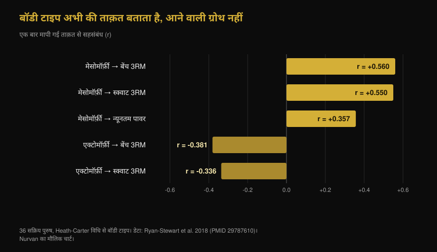
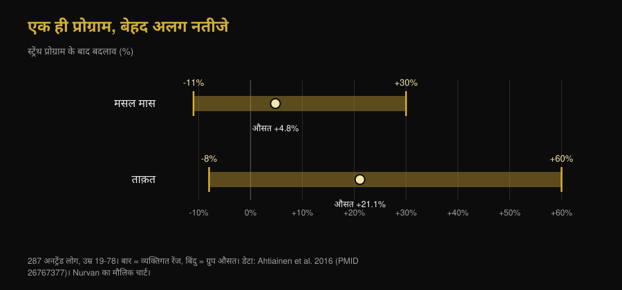

# एक्टोमॉर्फ या मेसोमॉर्फ: क्या आपका बॉडी टाइप तय करता है कि आप कितना बढ़ेंगे?

Di [Giammaria Loi](/autore/giammaria-loi) · 7 अक्टूबर 2026 को अपडेट

"मैं एक्टोमॉर्फ हूं, इसीलिए मसल नहीं चढ़ता" — यह जिम की सबसे दोहराई जाने वाली लाइनों में से एक है। ब्रैड शोनफेल्ड की लैब के एक नए काम ने इसे 40 पुरुषों पर परखा: शुरुआती शरीर-रचना मसल ग्रोथ का कोई काम का अनुमान नहीं दे सकी। हमने स्टडी पढ़ी, एक बात पकड़ी जो पोस्ट नहीं बताता, और 1994 का वह पेपर निकाला जो उलटा नतीजा देता था। जो तस्वीर बनती है, वह दोनों से ज़्यादा दिलचस्प है।

## एक नज़र में

- **बॉडी टाइप यह नहीं बताता कि आप कितना मसल बनाएंगे।** 9 हफ़्ते तक ट्रेन किए गए 40 अनट्रेंड पुरुषों में, ज़्यादा मेसोमॉर्फी (मसल वाली बनावट) का हाइपरट्रॉफी पर असर छोटा से नगण्य था, और एंडोमॉर्फी व एक्टोमॉर्फी को हिसाब में लेते ही लगभग मिट गया।
- **लेकिन यह काम एक प्रीप्रिंट है, अभी पीयर रिव्यू नहीं हुआ।** इसे शेयर करने वाली ज़्यादातर पोस्टों में यह बात गायब है, और इससे इसका वज़न बदल जाता है।
- **बॉडी टाइप यह ज़रूर बताता है कि आप अभी कितने मज़बूत हैं।** 36 सक्रिय पुरुषों में अकेली मेसोमॉर्फी ने 3RM बेंच प्रेस के अंतर का 31.4% समझा दिया। आज का स्तर और सुधार की रफ़्तार दो अलग चीज़ें हैं।
- **1994 की एक स्टडी ने उलटा पाया था, पर सिर्फ़ लीन मास में।** 12 हफ़्तों में मज़बूत बनावट वालों ने 1.6 किलो लीन मास बढ़ाया, दुबले लोगों में कोई सार्थक बढ़त नहीं। लेकिन ताक़त दोनों ग्रुप में बराबर बढ़ी: औसतन +13.8%।
- **व्यक्तिगत अंतर असली और बहुत बड़ा है, पर वह दिखने से पता नहीं चलता।** 287 अनट्रेंड लोगों में मसल मास -11% से +30% तक और ताक़त -8% से +60% तक बदली। अब तक का सबसे ठोस संकेतक सैटेलाइट सेल्स हैं, जो किसी आईने में नहीं दिखतीं।

*एक ही मुक़ाबला, एक ही बार, अलग-अलग कद-काठी: सवाल यह है कि क्या यह फ़र्क़ यह भी बताता है कि किसमें सुधार ज़्यादा होगा। फ़ोटो: US Air Force, विकिमीडिया कॉमन्स, पब्लिक डोमेन।*

## तीन बॉडी टाइप का विचार आया कहां से

आज इस्तेमाल होने वाली Heath-Carter विधि में सोमाटोटाइप कोई बंद खाना नहीं, बल्कि तीन अंकों का सेट है: **एंडोमॉर्फी** (गोलाई और चर्बी), **मेसोमॉर्फी** (ढांचे और मांसपेशियों की मज़बूती), **एक्टोमॉर्फी** (लंबी-पतली बनावट)। हर किसी के तीनों स्कोर होते हैं। "मैं एक्टोमॉर्फ हूं" का तकनीकी मतलब बस यह है कि तीसरा अंक बाक़ी दो के मुक़ाबले ऊंचा है।

यहीं एक दिक़्क़त शुरू हो जाती है। 2025 की एक स्टडी ने 185 पुरुषों और 156 महिलाओं पर नापा कि एक ही श्रेणी में आने वाले लोग सचमुच कितने मिलते-जुलते हैं: एक ही लेबल के भीतर आकृति का बिखराव ज़्यादातर समूहों में सार्थक निकला, और पुरुषों में ज़्यादा। दो "मेसोमॉर्फ" के शरीर बहुत अलग हो सकते हैं।

## जिस स्टडी की सब चर्चा कर रहे हैं, उसने असल में किया क्या

चालीस युवा, अनट्रेंड पुरुषों ने नौ हफ़्ते तक हफ़्ते में दो बार सुपरवाइज़्ड फुल बॉडी प्रोग्राम किया, और शुरुआत में सोमाटोटाइप नापा गया। हाइपरट्रॉफी अल्ट्रासाउंड से मसल थिकनेस, बायोइम्पीडेंस और घेरों से आंकी गई; परफ़ॉर्मेंस अधिकतम ताक़त, मसल एंड्यूरेंस, निचले हिस्से की पावर और घुटने की आइसोमेट्रिक ताक़त से।

नतीजा: शुरुआत में ज़्यादा मेसोमॉर्फी के हाइपरट्रॉफी और परफ़ॉर्मेंस से सकारात्मक जुड़ाव की संभावना ऊंची थी, पर अनुमानित असर छोटे थे और ज़्यादातर **प्रैक्टिकल इक्विवैलेंस के दायरे** के भीतर गिरे — यानी वह रेंज जिसे शोधकर्ताओं ने पहले से "ऐसा फ़र्क़ जो असल ज़िंदगी में कुछ नहीं बदलता" मान रखा था। एंडोमॉर्फी और एक्टोमॉर्फी के लिए समायोजन करने पर जुड़ाव और कमज़ोर पड़ गया।

एक अपवाद, जिसे लेखक खुद खोजी विश्लेषण बताते हैं: लगातार मापी गई मेसोमॉर्फी का बेंच प्रेस के अधिकतम में सुधार से मध्यम सकारात्मक जुड़ाव दिखा। बाक़ी टेस्टों में ऐसा कुछ नहीं। लेखक यह भी बताते हैं कि ज़्यादा अफ़्रीकी आनुवंशिक वंशक्रम का संबंध ऊंचे मेसोमॉर्फी स्कोर से था — यह **शुरुआती आकृति** के बारे में नतीजा है, और उसी स्टडी में यह बेहतर ट्रेनिंग रिस्पॉन्स में नहीं बदला।

**वह बात जो पोस्टों में नहीं है:** यह पेपर 24 सितंबर 2026 को SportRxiv पर छपा प्रीप्रिंट है। इसका पीयर रिव्यू नहीं हुआ और यह PubMed में इंडेक्स नहीं है। यह काम की जानकारी है, फ़ैसला नहीं। लेखक खुद बड़े सैंपल और लंबी अवधि की मांग करते हैं।

## बॉडी टाइप आज की ताक़त बताता है, कल की ग्रोथ नहीं

यही वह गांठ है जिसे लगभग सब छोड़ देते हैं। सोमाटोटाइप *कुछ* तो बहुत अच्छे से बताता है: वह ताक़त जो आप इसी वक़्त लगा सकते हैं।

36 सक्रिय पुरुषों में मेसोमॉर्फी का 3 रेप मैक्स बेंच प्रेस से संबंध था (r = 0.560) और स्क्वाट से (r = 0.550); एक्टोमॉर्फी का दोनों से उल्टा संबंध था। अकेली मेसोमॉर्फी ने बेंच प्रेस के अंतर का 31.4% समझाया।

*दो लोगों के बीच ताक़त के फ़र्क़ का क़रीब एक-तिहाई हिस्सा कद-काठी से पढ़ा जा सकता है। पर इनमें से कोई सहसंबंध सुधार के बारे में नहीं है: ये सब एक बार की माप हैं। Nurvan का चार्ट, डेटा Ryan-Stewart et al. 2018।*

इन दोनों को आपस में मिला देना ही वह गलती है जो मिथक को ज़िंदा रखती है। मज़बूत शरीर आगे से शुरू होता है, और वह दिखता भी है; लेकिन वक्र का ढलान — आने वाले महीनों में आप कितना जोड़ेंगे — अलग वेरिएबल है, और वही एकमात्र है जिस पर आप काम कर सकते हैं।

## तो ग्रोथ किससे तय होती है?

व्यक्तिगत अंतर असली और बड़ा है। 19 से 78 साल के 287 अनट्रेंड लोगों में स्ट्रेंथ प्रोग्राम के बाद मसल मास औसतन +4.8% बदला, व्यक्तिगत नतीजे -11% से +30% तक; ताक़त औसतन +21.1% बढ़ी, व्यक्तिगत नतीजे -8% से +60% तक। उसी काम में **उम्र और लिंग इस फ़र्क़ को नहीं समझा सके**।

*बार उस व्यक्ति से लेकर उस व्यक्ति तक फैला है जिसने एक ही तरह के प्रोग्राम पर सबसे कम और सबसे ज़्यादा प्रतिक्रिया दी। Nurvan का चार्ट, डेटा Ahtiainen et al. 2016।*

तो फ़र्क़ कहां है? 16 हफ़्ते ट्रेन किए गए 66 लोगों की एक स्टडी ने उन्हें तीन समूहों में बांटा: अत्यधिक हाइपरट्रॉफी (फ़ाइबर क्रॉस-सेक्शन +58%), मध्यम (+28%) और शून्य। शुरुआत में फ़ाइबर का आकार समूहों के बीच **अलग नहीं** था: बड़े रिस्पॉन्डर्स को अलग करने वाली चीज़ थी उनकी सैटेलाइट सेल्स की संख्या — मांसपेशी की स्टेम सेल्स — और ट्रेनिंग के दौरान फ़ाइबर में नाभिक जोड़ने की उनकी क्षमता।

यानी: संकेतक मौजूद है, पर वह मांसपेशी के भीतर है और बायोप्सी से नापा जाता है, आईने में देखकर नहीं।

*बाहर से वह कुछ भी नहीं दिखता जो असल में मायने रखता है: बढ़ने की क्षमता मांसपेशी के भीतर नापी जाती है। फ़ोटो: Nenad Stojkovic, विकिमीडिया कॉमन्स, CC BY 2.0।*

## 1994 की वह स्टडी जो उलटा कहती थी

इस विचार को बंद करने से पहले उस पेपर का ज़िक्र ज़रूरी है जिसे प्रीप्रिंट खुद अपनी संदर्भ सूची में रखता है। 1994 में 21 पुरुषों को कद-काठी के हिसाब से बांटा गया — दुबली या मज़बूत, लीन मास इंडेक्स के आधार पर — और 12 हफ़्ते, हफ़्ते में दो बार ट्रेन कराया गया।

| 12 हफ़्ते बाद नतीजा | मज़बूत बनावट (n=11) | दुबली बनावट (n=10) |
|---|---|---|
| लीन मास | **+1.6 किलो (+2.3%)**, सार्थक | कोई सार्थक बढ़त नहीं |
| फ़ैट मास | -2.4 किलो (-11.3%) | -1.7 किलो (-10.8%) |
| आइसोकाइनेटिक ताक़त | औसतन +13.8% | औसतन +13.8% |

*डेटा: Van Etten et al. 1994 (PMID 8201909)। ताक़त का आंकड़ा दोनों समूहों के लिए मिलाकर बताया गया औसत है, क्योंकि उनमें आपस में फ़र्क़ नहीं था।*

तो "हार्ड गेनर" की एक ऐतिहासिक बुनियाद है, पर कहानी से कहीं ज़्यादा संकरी: वह लीन मास से जुड़ी थी, ताक़त से नहीं, 21 लोगों पर, और वर्गीकरण का तरीक़ा भी सोमाटोटाइप नहीं था। तीस साल बाद, बेहतर माप और दोगुने सैंपल के साथ, ग्रोथ पर वह असर दोबारा नहीं दिखता।

## रिसर्च असल में क्या कहती है

- **पुष्ट** — "स्वाभाविक रूप से मसल वाली बनावट का मतलब ज़्यादा मसल बनाने की क्षमता नहीं है।" — यह प्रीप्रिंट का मुख्य नतीजा है, और इस तथ्य से मेल खाता है कि रिस्पॉन्स में अंतर मौजूद है पर उसे उम्र, लिंग या शुरुआती फ़ाइबर साइज़ नहीं समझाते।
- **स्पष्टीकरण ज़रूरी** — "एक्टोमॉर्फ हार्ड गेनर होने को अभिशप्त नहीं हैं।" — नए डेटा पर सही, पर 1994 के काम में मज़बूत बनावट वालों में 1.6 किलो ज़्यादा लीन मास मिला था। ताक़त हालांकि दोनों में बराबर बढ़ी।
- **स्पष्टीकरण ज़रूरी** — "मेरी लैब की एक नई स्टडी।" — यह 24 सितंबर 2026 का SportRxiv प्रीप्रिंट है, न पीयर रिव्यू हुआ है न PubMed में इंडेक्स।
- **पुष्ट** — "मेसोमॉर्फी का बेंच प्रेस की बढ़त से मध्यम सकारात्मक जुड़ाव दिखा।" — लेखक इसे खोजी विश्लेषण बताते हैं, इसलिए इसे स्थापित नतीजा न मानें।
- **ख़ारिज** — "सोमाटोटाइप कुछ काम की बात नहीं बताता।" — यह कमेंट सेक्शन वाली जल्दबाज़ी है और टिकती नहीं: वह बहुत कुछ बताता है कि आप **अभी** कितने मज़बूत हैं (बेंच प्रेस के अंतर का 31.4%)। जो वह नहीं बताता, वह है आपकी आगे की बढ़त।
- **अप्रमाणित** — "इसीलिए आपके बॉडी टाइप को अलग ट्रेनिंग चाहिए।" — हमने जो स्टडीज़ पढ़ीं, उनमें किसी ने सोमाटोटाइप के हिसाब से बांटे गए प्रोग्राम की तुलना नहीं की। "एक्टोमॉर्फ ट्रेनिंग" बताने का कोई आधार नहीं है।

## इसे कैसे लागू करें

1. **बॉडी टाइप को भविष्यवाणी की तरह इस्तेमाल करना बंद करें।** वह बताता है कि आपका शरीर आज कैसा बना है। यह बताने की क्षमता उसने नहीं दिखाई कि वह कितना बढ़ेगा।
2. **खुद से तुलना करें, बेंच पार्टनर से नहीं।** जो ज़्यादा मज़बूत बना है, वह ऊपर से शुरू करता है। प्रोग्राम चल रहा है या नहीं, यह आपका अपना वक्र बताता है: वज़न, रेप्स और माप, समय के साथ।
3. **किसी प्रोग्राम को जज करने से पहले कम से कम 10-12 हफ़्ते दें।** नौ हफ़्ते कुछ भी दिखने की न्यूनतम सीमा है, और इतने में व्यक्तिगत अंतर अब भी बहुत शोरभरे होते हैं।
4. **अगर खुद को हार्ड गेनर मानते हैं, तो पहले दो साफ़ चीज़ें जांचें:** पर्याप्त कैलोरी और प्रोटीन, और लोड में असली प्रगति। जवाब लगभग हमेशा वहीं होता है, कद-काठी में नहीं।
5. **हर सेट का वज़न और रेप्स दर्ज करें।** व्यक्तिगत रिस्पॉन्स को स्टिमुलस बदलकर संभाला जाता है, और उसे बदलने के लिए पता होना चाहिए कि आप कितना दे रहे हैं: काम को नापने का यही मतलब है, जैसा हमने [मसल्स के लिए कितने रेप्स](/hi/blog/kitne-reps-muscle-ke-liye) वाले लेख में समझाया है।
6. **प्रोग्राम इसलिए न बदलें कि "आप एक्टोमॉर्फ हैं",** बल्कि इसलिए कि आंकड़े हफ़्तों से टिके हुए हैं। एक कसौटी जांची जा सकती है, दूसरी नहीं।

ये ख़ास समूहों पर हुई स्टडीज़ के औसत नतीजे हैं, कोई व्यक्तिगत प्लान नहीं। अगर आपको कोई बीमारी है, इलाज चल रहा है या चोट से लौट रहे हैं, तो प्रोग्राम बनाने से पहले अपने डॉक्टर या किसी पेशेवर से बात करें।

> **Nurvan — आपका वक्र, आपकी श्रेणी नहीं**
>
> Nurvan हर सेट का वज़न, रेप्स और RIR दर्ज करता है और उन्हें शरीर की माप के साथ समय के ग्राफ़ पर दिखाता है। इससे "क्या मैं सच में बढ़ रहा हूं?" का जवाब आईने और मान ली गई बॉडी टाइप पर टिकना बंद कर देता है, और हर हफ़्ते की असली प्रगति से मिलता है।
>
> [Nurvan आज़माएं](https://nurvan.app)

## अक्सर पूछे जाने वाले सवाल

**क्या बॉडी टाइप मसल ग्रोथ पर असर डालता है?**

सबसे नए काम के मुताबिक — 40 अनट्रेंड पुरुष, 9 हफ़्ते — नगण्य: हाइपरट्रॉफी पर मेसोमॉर्फी का असर छोटा था और ज़्यादातर लेखकों द्वारा तय की गई व्यावहारिक महत्वहीनता की सीमा के भीतर। ध्यान रहे कि यह अभी बिना पीयर रिव्यू वाला प्रीप्रिंट है।

**क्या एक्टोमॉर्फ होने का मतलब हार्ड गेनर होना है?**

नए डेटा के हिसाब से नहीं। 1994 की 21 पुरुषों वाली स्टडी में मज़बूत बनावट वालों को 12 हफ़्ते बाद 1.6 किलो ज़्यादा लीन मास ज़रूर मिला था, जबकि दुबले लोगों में सार्थक बढ़त नहीं थी — पर उसी स्टडी में ताक़त दोनों समूहों में बराबर बढ़ी।

**तो अपना सोमाटोटाइप जानने का फ़ायदा क्या है?**

शुरुआती बिंदु बताने का। यह आज आपकी ताक़त का अच्छा संकेतक है — 36 सक्रिय पुरुषों की स्टडी में मेसोमॉर्फी ने बेंच प्रेस के अंतर का 31.4% समझाया — पर यह नहीं बताता कि ट्रेनिंग से आपको कितना सुधार मिलेगा।

**क्या एक्टोमॉर्फ, मेसोमॉर्फ और एंडोमॉर्फ के लिए अलग ट्रेनिंग होती है?**

हमें मिले प्रमाणों के हिसाब से नहीं: किसी उपलब्ध स्टडी ने सोमाटोटाइप के आधार पर बांटे गए प्रोग्राम की तुलना नहीं की। मायने रखने वाले वेरिएबल वही पुराने हैं — वॉल्यूम, इंटेंसिटी, फ़्रीक्वेंसी, प्रोग्रेशन और रिकवरी।

**एक ही प्रोग्राम पर दो लोगों के नतीजे इतने अलग क्यों होते हैं?**

क्योंकि अंतर असली है: 287 अनट्रेंड लोगों में मसल मास -11% से +30% तक बदला। अब तक पहचाना गया सबसे ठोस कारक मांसपेशी में सैटेलाइट सेल्स की मात्रा है, बाहरी रूप-रंग नहीं।

## यह भी पढ़ें

- [मसल्स के लिए कितने रेप्स? 8-12 का मिथक](/hi/blog/kitne-reps-muscle-ke-liye) — रिसर्च के मुताबिक ग्रोथ के लिए असल में निर्णायक वेरिएबल कौन से हैं।
- [मिस्टर ओलंपिया 2026: निक वॉकर जीते, क्या सीख मिलती है](/hi/blog/mr-olympia-2026-results-hindi) — शीर्ष के फ़िज़ीक में असली फ़र्क़ कहां है, शुरुआती ढांचे से आगे।

## स्रोत

1. Parnell C, Piñero A, Mohan A, Coleman M, Hopper A, Segtnan R, Androulakis Korakakis P, Wolf M, Roberts M, Campa F, Swinton P, Schoenfeld BJ, 2026. *Does body build predict training response? Association between baseline somatotype and resistance training-induced muscle hypertrophy and strength gains.* SportRxiv, 24 सितंबर 2026 का प्रीप्रिंट (पीयर रिव्यू नहीं) — [DOI](https://doi.org/10.51224/SportRxiv.1085)
2. Ryan-Stewart H, Faulkner J, Jobson S, 2018. *The influence of somatotype on anaerobic performance.* PLoS One 13(5):e0197761. PMID 29787610 — [DOI](https://doi.org/10.1371/journal.pone.0197761)
3. Ahtiainen JP, Walker S, Peltonen H et al., 2016. *Heterogeneity in resistance training-induced muscle strength and mass responses in men and women of different ages.* Age (Dordr) 38(1):10. PMID 26767377 — [DOI](https://doi.org/10.1007/s11357-015-9870-1)
4. Petrella JK, Kim JS, Mayhew DL, Cross JM, Bamman MM, 2008. *Potent myofiber hypertrophy during resistance training in humans is associated with satellite cell-mediated myonuclear addition: a cluster analysis.* J Appl Physiol 104(6):1736-1742. PMID 18436694 — [DOI](https://doi.org/10.1152/japplphysiol.01215.2007)
5. Van Etten LM, Verstappen FT, Westerterp KR, 1994. *Effect of body build on weight-training-induced adaptations in body composition and muscular strength.* Med Sci Sports Exerc 26(4):515-521. PMID 8201909 — [DOI](https://doi.org/10.1249/00005768-199404000-00018)
6. Campa F, Moon J, Petri C et al., 2025. *Beyond somatotype categories: composition-based clustering of body types in young adults.* Front Physiol 16:1722899. PMID 41357170 — [DOI](https://doi.org/10.3389/fphys.2025.1722899)

> वैज्ञानिक स्रोत PubMed से लिए गए और 7 अक्टूबर 2026 को जांचे गए। SportRxiv प्रीप्रिंट सीधे आर्काइव के आधिकारिक पेज पर पढ़ा गया: यहां दिए आंकड़े सार्वजनिक एब्स्ट्रैक्ट से हैं, क्योंकि वहां प्रभाव का कोई संख्यात्मक अनुमान नहीं दिया गया।

> शुरुआती प्रेरणा: [ब्रैड शोनफेल्ड](https://www.instagram.com/p/DdtXZsPxbYU/) की 25 सितंबर 2026 की पोस्ट, सोमाटोटाइप और ट्रेनिंग रिस्पॉन्स पर। इस लेख का टेक्स्ट, ढांचा, तथ्य-जांच, तुलना तालिका और चार्ट मौलिक हैं।

**Giammaria Loi** Nurvan के संस्थापक हैं। वे 2012 से वेट ट्रेनिंग करते हैं, 2013 से FIPE-प्रमाणित पर्सनल ट्रेनर और कोच के रूप में काम करते हैं और 2018 से राष्ट्रीय स्तर पर पावरलिफ्टिंग में भाग लेते हैं। वे जिस भी लेख पर हस्ताक्षर करते हैं, वह वैज्ञानिक अध्ययनों से शुरू होकर उस तक पहुंचता है जो जिम में सचमुच काम करता है।

> नोट: यह जानकारीपरक सामग्री है, डॉक्टर या पेशेवर की राय का विकल्प नहीं। बताए गए नतीजे ख़ास समूहों पर हुई स्टडीज़ के औसत और रेंज हैं और किसी व्यक्तिगत ट्रेनिंग प्लान का रूप नहीं लेते।
