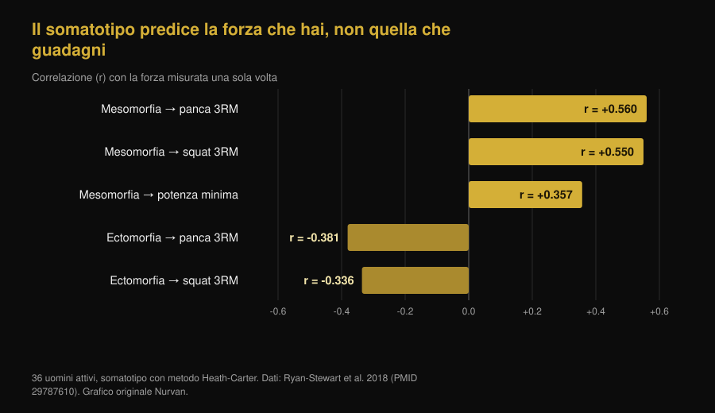
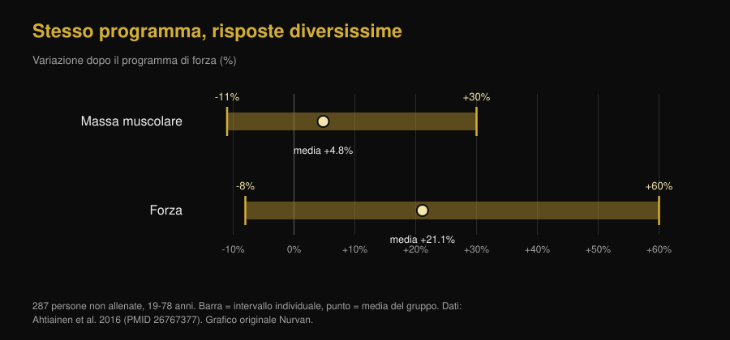

# Ectomorfo o mesomorfo: il somatotipo decide quanto cresci?

Di [Giammaria Loi](/autore/giammaria-loi) · aggiornato il 7 ottobre 2026

"Sono ectomorfo, per questo non metto massa" è una delle frasi più ripetute in palestra. Un nuovo lavoro dal laboratorio di Brad Schoenfeld l'ha messa alla prova su 40 uomini: la corporatura di partenza non ha predetto in modo utile la crescita muscolare. Abbiamo letto lo studio, trovato una cosa che il post non dice, e recuperato il lavoro del 1994 che arrivava alla conclusione opposta. Il quadro che esce è più interessante di entrambi.

## In breve

- **Il somatotipo non predice quanto muscolo metterai.** Su 40 uomini non allenati seguiti per 9 settimane, una maggiore mesomorfia (corporatura muscolosa) ha mostrato effetti da piccoli a trascurabili sull'ipertrofia, che sparivano quasi del tutto tenendo conto di endomorfia ed ectomorfia.
- **Ma il lavoro è un preprint, non ancora revisionato tra pari.** È il dettaglio che manca nella maggior parte dei post che lo stanno rilanciando, e cambia il peso che gli va dato.
- **Il somatotipo predice invece quanto sei forte adesso.** In 36 uomini attivi la mesomorfia da sola spiegava il 31,4% della varianza nella panca da 3 ripetizioni massime. Livello attuale e velocità di miglioramento sono due cose diverse.
- **Uno studio del 1994 trovò il contrario, ma solo sulla massa magra.** In 12 settimane i soggetti di corporatura solida guadagnarono 1,6 kg di massa magra, quelli snelli nessun aumento significativo. La forza, però, crebbe uguale nei due gruppi: in media +13,8%.
- **La variabilità individuale esiste ed è enorme, ma non si legge dall'aspetto.** Su 287 persone non allenate la massa muscolare è cambiata da -11% a +30% e la forza da -8% a +60%. Il predittore più solido trovato finora sono le cellule satelliti, che non si vedono allo specchio.

*Stessa gara, stessa panca, corporature diverse: la domanda è se quella differenza predica anche chi migliorerà di più. Foto: US Air Force, Wikimedia Commons, pubblico dominio.*

## Da dove arriva l'idea dei tre somatotipi

Nel metodo Heath-Carter, quello usato oggi, il somatotipo non è una categoria secca ma una terna di numeri: **endomorfia** (quanto sei tondo e adiposo), **mesomorfia** (quanto sei robusto di struttura e muscolatura), **ectomorfia** (quanto sei longilineo). Ognuno ha tutti e tre i punteggi. "Sono ectomorfo" vuol dire, tecnicamente, che il terzo numero è alto rispetto agli altri due.

Già qui c'è un problema. Uno studio del 2025 su 185 uomini e 156 donne ha misurato quanto si somigliano davvero le persone finite nella stessa categoria: la dispersione morfologica dentro la stessa etichetta è risultata significativa nella maggior parte dei gruppi, e maggiore negli uomini. Due "mesomorfi" possono avere corpi molto diversi.

## Cosa ha fatto davvero lo studio di cui parlano tutti

Quaranta uomini giovani e non allenati hanno seguito un programma full body supervisionato, due volte a settimana per nove settimane, con il somatotipo misurato all'inizio. L'ipertrofia è stata valutata con spessore muscolare a ultrasuoni, bioimpedenza e circonferenze; la prestazione con forza massimale, resistenza, potenza e forza isometrica del ginocchio.

Risultato: una maggiore mesomorfia iniziale mostrava un'alta probabilità di associazione positiva con ipertrofia e prestazione, ma gli effetti stimati erano piccoli e in gran parte dentro la **regione di equivalenza pratica** — cioè l'intervallo che i ricercatori avevano deciso in anticipo di considerare "differenza che non cambia nulla nella vita reale". Aggiustando per endomorfia ed ectomorfia, l'associazione si attenuava ancora.

Un'eccezione, dichiarata dagli autori come esplorativa: la mesomorfia continua mostrava un'associazione positiva modesta con il miglioramento del massimale di panca piana. Nessuna associazione paragonabile sugli altri test. Gli autori riportano anche che una maggiore ascendenza genetica africana era associata a punteggi di mesomorfia più alti — un dato sulla **morfologia di partenza**, che nello stesso studio non si è tradotto in una risposta all'allenamento migliore.

**La precisazione che manca nei post:** questo lavoro è un preprint pubblicato su SportRxiv il 24 settembre 2026. Non è ancora passato dalla revisione tra pari e non è indicizzato su PubMed. È un'informazione utile, non una sentenza. Gli stessi autori scrivono che servono campioni più grandi e periodi più lunghi.

## Il somatotipo dice quanto sei forte oggi, non quanto crescerai

Qui sta il nodo che quasi tutti saltano. Il somatotipo *qualcosa* lo predice benissimo: la forza che esprimi in questo momento.

In 36 uomini attivi, la mesomorfia correlava con il massimale di panca su 3 ripetizioni (r = 0,560) e con quello di squat (r = 0,550); l'ectomorfia correlava in negativo con entrambi. La sola mesomorfia spiegava il 31,4% della varianza nella panca.

*Un terzo della differenza di forza fra una persona e l'altra si legge dalla corporatura. Nessuna di queste correlazioni riguarda però i miglioramenti: sono misure fatte una volta sola. Grafico Nurvan su dati Ryan-Stewart et al. 2018.*

Confondere le due cose è l'errore che alimenta il mito. Un corpo robusto parte più avanti, e si vede; ma la pendenza della curva — quanto aggiungi nei prossimi mesi — è un'altra variabile, ed è l'unica su cui puoi agire.

## Allora cosa predice la crescita?

La variabilità individuale è reale e grande. In 287 persone non allenate fra i 19 e i 78 anni, dopo un programma di forza la massa muscolare è cambiata in media del +4,8% ma con singoli risultati fra -11% e +30%; la forza è salita in media del +21,1%, con singoli risultati fra -8% e +60%. Nello stesso lavoro **età e sesso non spiegavano quella differenza**.

*Le barre sono l'intervallo fra la persona che ha risposto peggio e quella che ha risposto meglio allo stesso tipo di programma. Grafico Nurvan su dati Ahtiainen et al. 2016.*

Dove sta la differenza, allora? Un lavoro su 66 persone allenate per 16 settimane ha diviso i partecipanti in tre gruppi: ipertrofia estrema (+58% di sezione delle fibre), modesta (+28%) e nulla. Al basale la dimensione delle fibre **non** differiva fra i gruppi: a distinguere i grandi responder era la quantità di cellule satelliti, le cellule staminali del muscolo, e la loro capacità di aggiungere nuclei alle fibre durante l'allenamento.

In altre parole: il predittore esiste, ma sta dentro al muscolo e si misura con una biopsia, non guardandosi allo specchio. Ne abbiamo parlato più in dettaglio nell'articolo su [quanto conta la genetica fra high e low responder](/blog/genetica-high-low-responder).

*Dall'esterno non si vede niente di quello che conta davvero: la capacità di crescere si misura dentro al muscolo. Foto: Nenad Stojkovic, Wikimedia Commons, CC BY 2.0.*

## Lo studio del 1994 che diceva il contrario

Prima di archiviare l'idea, va citato il lavoro che il preprint stesso mette in bibliografia. Nel 1994, 21 uomini furono divisi per corporatura — snella o solida, classificata sull'indice di massa magra — e allenati per 12 settimane, due volte a settimana.

| Esito dopo 12 settimane | Corporatura solida (n=11) | Corporatura snella (n=10) |
|---|---|---|
| Massa magra | **+1,6 kg (+2,3%)**, significativo | nessun aumento significativo |
| Massa grassa | -2,4 kg (-11,3%) | -1,7 kg (-10,8%) |
| Forza isocinetica | in media +13,8% | in media +13,8% |

*Dati: Van Etten et al. 1994 (PMID 8201909). I valori di forza sono la media riportata per l'insieme dei due gruppi, che non differivano fra loro.*

Il "hard gainer" ha quindi una base storica, ma molto più stretta di come viene raccontata: riguardava la massa magra e non la forza, su 21 persone, con un metodo di classificazione diverso dal somatotipo. Trent'anni dopo, con misure migliori e un campione doppio, l'effetto sulla crescita non si ritrova.

## Cosa dice davvero la ricerca

- **Confermato** — "Avere un fisico naturalmente muscoloso non significa avere più capacità di costruire muscolo." — È il risultato principale del preprint, coerente con il fatto che la variabilità di risposta esiste ma non è spiegata da età, sesso o dimensione iniziale delle fibre.
- **Da precisare** — "Gli ectomorfi non sono destinati a essere hard gainer." — Vero sui dati nuovi, ma il lavoro del 1994 trovò un vantaggio di 1,6 kg di massa magra nei soggetti più solidi. La forza, però, salì identica nei due gruppi.
- **Da precisare** — "Un nuovo studio dal mio laboratorio." — È un preprint su SportRxiv del 24 settembre 2026, non ancora revisionato tra pari né indicizzato su PubMed.
- **Confermato** — "La mesomorfia ha mostrato un'associazione positiva modesta con i guadagni di panca." — Riportata dagli autori come analisi esplorativa, da non trattare come risultato stabilito.
- **Smentito** — "Il somatotipo non dice niente di utile." — È la lettura veloce che gira nei commenti, e non regge: dice molto su quanto sei forte **adesso** (il 31,4% della varianza nella panca). Quello che non dice è quanto migliorerai.
- **Non verificabile** — "Ecco perché il tuo tipo di corpo richiede un allenamento diverso." — Nessuno degli studi che abbiamo letto confronta programmi diversi assegnati per somatotipo. Non esiste una base per prescrivere allenamenti "da ectomorfo".

## Come applicarlo

1. **Smetti di usare il somatotipo come previsione.** Serve a descrivere com'è fatto il tuo corpo oggi. Non ha mostrato la capacità di dire quanto crescerà.
2. **Confrontati con te stesso, non con il compagno di panca.** Chi è più robusto parte più in alto. Quello che conta per capire se il programma funziona è la tua curva: carichi, ripetizioni e misure nel tempo.
3. **Dai al programma almeno 10-12 settimane prima di giudicare.** Nove settimane sono il minimo per vedere qualcosa, e in quell'arco le differenze individuali sono ancora molto rumorose.
4. **Se ti senti un "hard gainer", controlla prima le due variabili ovvie:** calorie e proteine sufficienti, e progressione reale del carico. Quasi sempre la risposta è lì, non nella corporatura.
5. **Tieni traccia di carichi e ripetizioni serie per serie.** La risposta individuale si gestisce aggiustando lo stimolo, e per aggiustarlo devi sapere quanto ne stai dando: è il senso di misurare il lavoro, come spieghiamo nell'articolo su [quante ripetizioni servono per la massa](/blog/ripetizioni-serie-recupero-ipertrofia).
6. **Non cambiare programma perché "sei ectomorfo",** ma perché i numeri non salgono da settimane. È un criterio verificabile, l'altro no.

Questi sono risultati medi di studi su gruppi specifici, non un piano personalizzato. Se hai patologie, stai seguendo una terapia o riprendi dopo un infortunio, parlane con il tuo medico o con un professionista prima di impostare un programma.

> **Nurvan — la tua curva, non la tua categoria**
>
> Nurvan tiene traccia di carichi, ripetizioni e RIR serie per serie e li mette in grafico nel tempo, insieme alle misure corporee. Così la domanda "sto crescendo?" smette di dipendere dallo specchio e da quale somatotipo pensi di essere, e si risponde con la tua progressione reale settimana dopo settimana.
>
> [Prova Nurvan](https://nurvan.app)

## Domande frequenti

**Il somatotipo influisce sulla crescita muscolare?**

Secondo il lavoro più recente, su 40 uomini non allenati per 9 settimane, in modo trascurabile: gli effetti della mesomorfia sull'ipertrofia erano piccoli e in gran parte dentro la soglia di irrilevanza pratica definita dagli autori. È però un preprint non ancora revisionato tra pari.

**Essere ectomorfo significa essere hard gainer?**

Non secondo i dati nuovi. Uno studio del 1994 su 21 uomini aveva trovato 1,6 kg di massa magra in più nei soggetti di corporatura solida dopo 12 settimane, mentre gli snelli non avevano aumenti significativi, ma nello stesso studio la forza era cresciuta in modo identico nei due gruppi.

**A cosa serve allora conoscere il proprio somatotipo?**

A descrivere la situazione di partenza. È un buon indicatore della forza che esprimi oggi — la mesomorfia spiegava il 31,4% della varianza nel massimale di panca in uno studio su 36 uomini attivi — ma non del miglioramento che otterrai allenandoti.

**Esiste un allenamento diverso per ectomorfi, mesomorfi ed endomorfi?**

Non in base alle evidenze che abbiamo trovato: nessuno degli studi disponibili ha confrontato programmi assegnati per somatotipo. Le variabili che contano restano quelle note — volume, intensità, frequenza, progressione e recupero.

**Perché due persone con lo stesso programma ottengono risultati così diversi?**

Perché la variabilità è reale: su 287 persone non allenate la massa muscolare è cambiata da -11% a +30%. Il fattore più solido identificato finora è la quantità di cellule satelliti nel muscolo, non l'aspetto esterno.

## Leggi anche

- [Low responder: quanto conta la genetica nei muscoli](/blog/genetica-high-low-responder) — perché la stessa scheda produce risultati diversi, e quanto di quella differenza è ereditario.
- [Quante ripetizioni per la massa: il mito dell'8-12](/blog/ripetizioni-serie-recupero-ipertrofia) — le variabili che la ricerca mostra essere davvero decisive per crescere.
- [Mr. Olympia 2026: Nick Walker vince, cosa ci insegna](/blog/mr-olympia-2026-nick-walker-risultati) — cosa separa davvero i fisici al vertice, oltre alla struttura di partenza.

## Fonti

1. Parnell C, Piñero A, Mohan A, Coleman M, Hopper A, Segtnan R, Androulakis Korakakis P, Wolf M, Roberts M, Campa F, Swinton P, Schoenfeld BJ, 2026. *Does body build predict training response? Association between baseline somatotype and resistance training-induced muscle hypertrophy and strength gains.* SportRxiv, preprint del 24 settembre 2026 (non sottoposto a revisione tra pari) — [DOI](https://doi.org/10.51224/SportRxiv.1085)
2. Ryan-Stewart H, Faulkner J, Jobson S, 2018. *The influence of somatotype on anaerobic performance.* PLoS One 13(5):e0197761. PMID 29787610 — [DOI](https://doi.org/10.1371/journal.pone.0197761)
3. Ahtiainen JP, Walker S, Peltonen H et al., 2016. *Heterogeneity in resistance training-induced muscle strength and mass responses in men and women of different ages.* Age (Dordr) 38(1):10. PMID 26767377 — [DOI](https://doi.org/10.1007/s11357-015-9870-1)
4. Petrella JK, Kim JS, Mayhew DL, Cross JM, Bamman MM, 2008. *Potent myofiber hypertrophy during resistance training in humans is associated with satellite cell-mediated myonuclear addition: a cluster analysis.* J Appl Physiol 104(6):1736-1742. PMID 18436694 — [DOI](https://doi.org/10.1152/japplphysiol.01215.2007)
5. Van Etten LM, Verstappen FT, Westerterp KR, 1994. *Effect of body build on weight-training-induced adaptations in body composition and muscular strength.* Med Sci Sports Exerc 26(4):515-521. PMID 8201909 — [DOI](https://doi.org/10.1249/00005768-199404000-00018)
6. Campa F, Moon J, Petri C et al., 2025. *Beyond somatotype categories: composition-based clustering of body types in young adults.* Front Physiol 16:1722899. PMID 41357170 — [DOI](https://doi.org/10.3389/fphys.2025.1722899)

> Fonti scientifiche recuperate da PubMed e verificate il 7 ottobre 2026. Il preprint SportRxiv è stato letto direttamente sulla pagina ufficiale dell'archivio: i dati riportati provengono dall'abstract pubblico, perché nessun valore numerico di effetto è reso disponibile lì.

> Spunto iniziale: il post di [Brad Schoenfeld](https://www.instagram.com/p/DdtXZsPxbYU/) del 25 settembre 2026 sul somatotipo e la risposta all'allenamento. Testo, struttura, verifiche, tabella comparativa e grafici di questo articolo sono originali.

**Giammaria Loi** è il fondatore di Nurvan. Si allena con i pesi dal 2012, lavora come personal trainer e coach certificato FIPE dal 2013 e gareggia nel powerlifting a livello nazionale dal 2018. Ogni articolo che firma parte dagli studi scientifici e arriva a ciò che funziona davvero in palestra.

> Nota: contenuto informativo, non sostituisce il parere di un medico o professionista. I risultati citati sono medie e intervalli osservati in studi su gruppi specifici e non costituiscono un programma di allenamento personalizzato.
