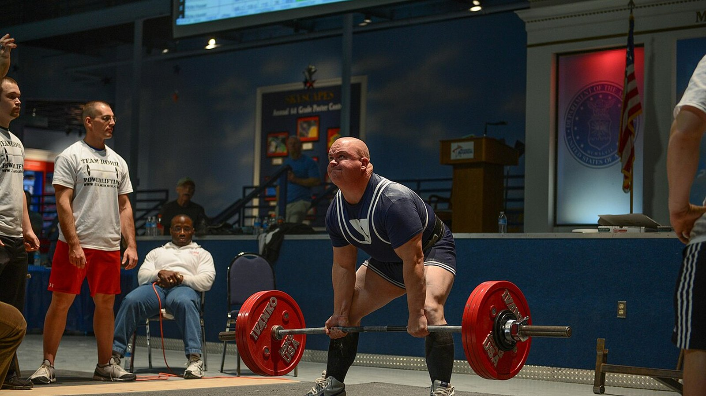
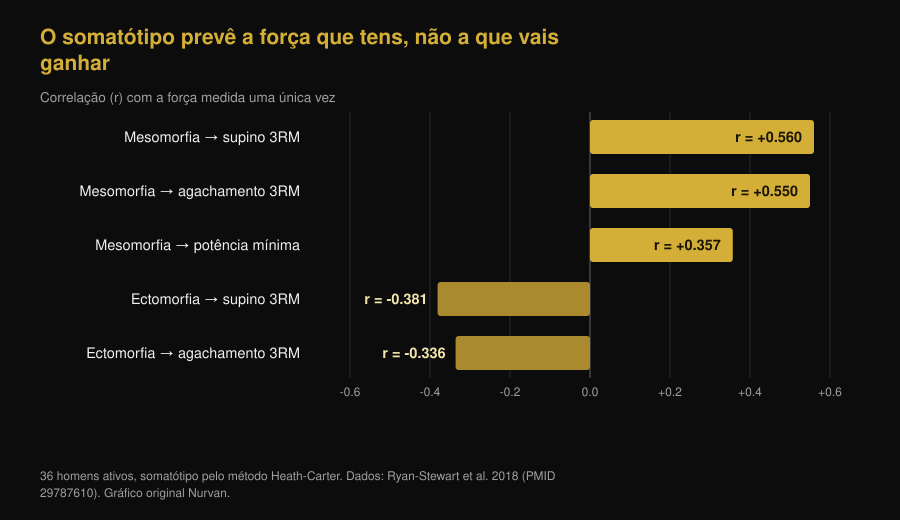
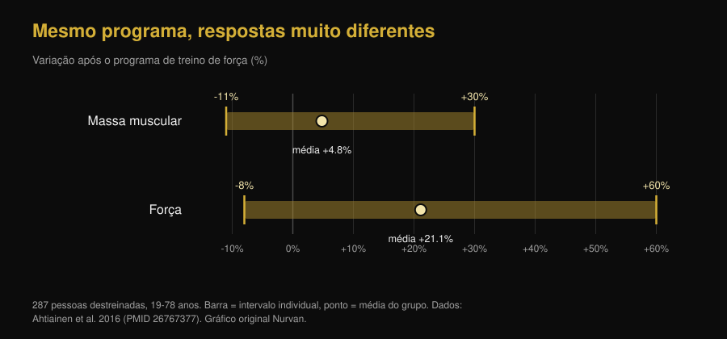
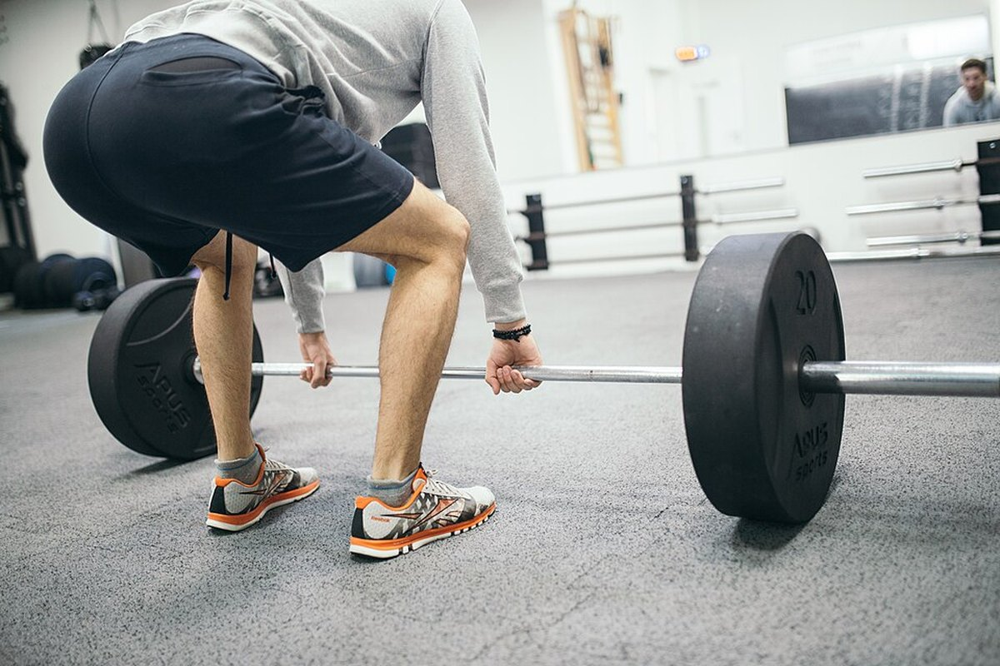

# Ectomorfo ou mesomorfo: o teu biotipo decide quanto cresces?

Di [Giammaria Loi](/autore/giammaria-loi) · atualizado em 7 de outubro de 2026

"Sou ectomorfo, por isso não ganho massa" é uma das frases mais repetidas em qualquer ginásio. Um novo trabalho do laboratório de Brad Schoenfeld testou-a em 40 homens: a constituição inicial não previu de forma útil o ganho de músculo. Lemos o estudo, encontrámos algo que o post não diz e fomos buscar o trabalho de 1994 que chegava à conclusão oposta. O quadro que sai é mais interessante do que qualquer um dos dois.

## Em resumo

- **O somatótipo não prevê quanto músculo vais ganhar.** Em 40 homens destreinados acompanhados durante 9 semanas, maior mesomorfia (constituição musculosa) mostrou efeitos pequenos a desprezáveis na hipertrofia, que quase desapareciam quando se tinham em conta a endomorfia e a ectomorfia.
- **Mas o trabalho é um preprint, ainda sem revisão por pares.** É o detalhe que falta na maioria dos posts que o divulgam, e muda o peso que se lhe deve dar.
- **O somatótipo prevê, isso sim, a força que tens agora.** Em 36 homens ativos, a mesomorfia sozinha explicava 31,4% da variância no supino a 3 repetições máximas. Nível atual e velocidade de progresso são coisas diferentes.
- **Um estudo de 1994 encontrou o contrário, mas só na massa magra.** Em 12 semanas, os sujeitos de constituição sólida ganharam 1,6 kg de massa magra e os magros nenhum aumento significativo. A força, porém, subiu igual nos dois grupos: +13,8% em média.
- **A variabilidade individual existe e é enorme, mas não se lê na aparência.** Em 287 pessoas destreinadas, a massa muscular variou entre -11% e +30% e a força entre -8% e +60%. O preditor mais sólido encontrado até agora são as células satélite, que nenhum espelho mostra.

*Mesma competição, mesma barra, constituições diferentes: a questão é se essa diferença também prevê quem vai melhorar mais. Foto: US Air Force, Wikimedia Commons, domínio público.*

## De onde vem a ideia dos três biotipos

No método Heath-Carter, o usado hoje, o somatótipo não é uma categoria fechada mas um terno de números: **endomorfia** (quanta gordura e arredondamento), **mesomorfia** (quão robusta é a estrutura e a musculatura), **ectomorfia** (quão longilíneo és). Toda a gente tem as três pontuações. "Sou ectomorfo" quer dizer, tecnicamente, que o terceiro número é alto em relação aos outros dois.

Já aqui há um problema. Um estudo de 2025 com 185 homens e 156 mulheres mediu quanto se parecem realmente as pessoas que caem na mesma categoria: a dispersão morfológica dentro do mesmo rótulo foi significativa na maioria dos grupos, e maior nos homens. Dois "mesomorfos" podem ter corpos muito diferentes.

## O que o estudo de que todos falam fez realmente

Quarenta homens jovens e destreinados seguiram um programa full body supervisionado, duas vezes por semana durante nove semanas, com o somatótipo medido no início. A hipertrofia foi avaliada com espessura muscular por ecografia, bioimpedância e perímetros; o desempenho com força máxima, resistência muscular, potência de membros inferiores e força isométrica do joelho.

Resultado: maior mesomorfia inicial mostrava alta probabilidade de associações positivas com hipertrofia e desempenho, mas os efeitos estimados eram pequenos e em grande parte dentro da **região de equivalência prática** — o intervalo que os investigadores tinham decidido à partida considerar "uma diferença que não muda nada na vida real". Ajustando para endomorfia e ectomorfia, a associação atenuava-se ainda mais.

Uma exceção, assinalada pelos autores como exploratória: a mesomorfia contínua mostrava uma associação positiva modesta com a melhoria do máximo no supino. Nada comparável nos restantes testes. Os autores relatam também que maior ascendência genética africana se associou a pontuações de mesomorfia mais altas — um dado sobre a **morfologia de partida** que, no mesmo estudo, não se traduziu em melhor resposta ao treino.

**A precisão que falta nos posts:** este trabalho é um preprint publicado no SportRxiv a 24 de setembro de 2026. Ainda não passou por revisão por pares nem está indexado na PubMed. É informação útil, não uma sentença. Os próprios autores pedem amostras maiores e períodos mais longos.

## O biotipo diz a força que tens hoje, não o crescimento de amanhã

Aqui está o nó que quase toda a gente salta. O somatótipo prevê *alguma coisa* muito bem: a força que expressas neste momento.

Em 36 homens ativos, a mesomorfia correlacionava com o máximo de supino a 3 repetições (r = 0,560) e com o de agachamento (r = 0,550); a ectomorfia correlacionava negativamente com ambos. Só a mesomorfia explicava 31,4% da variância no supino.

*Um terço da diferença de força entre uma pessoa e outra lê-se na constituição. Nenhuma destas correlações diz respeito a melhorias, porém: são medições feitas uma única vez. Gráfico Nurvan com dados de Ryan-Stewart et al. 2018.*

Confundir as duas coisas é o erro que mantém o mito vivo. Um corpo robusto parte mais à frente, e isso vê-se; mas a inclinação da curva — quanto acrescentas nos próximos meses — é outra variável, e é a única sobre a qual podes atuar.

## Então o que prevê o crescimento?

A variabilidade individual é real e grande. Em 287 pessoas destreinadas dos 19 aos 78 anos, depois de um programa de força a massa muscular variou em média +4,8%, com resultados individuais entre -11% e +30%; a força subiu em média +21,1%, com resultados individuais entre -8% e +60%. Nesse mesmo trabalho, **a idade e o sexo não explicavam essa diferença**.

*As barras vão da pessoa que pior respondeu à que melhor respondeu ao mesmo tipo de programa. Gráfico Nurvan com dados de Ahtiainen et al. 2016.*

Onde está então a diferença? Um trabalho com 66 pessoas treinadas durante 16 semanas dividiu-as em três grupos: hipertrofia extrema (+58% de secção da fibra), modesta (+28%) e nula. No início, o tamanho das fibras **não** diferia entre grupos: o que distinguia os grandes respondedores era a quantidade de células satélite — as células estaminais do músculo — e a sua capacidade de acrescentar núcleos às fibras durante o treino.

Por outras palavras: o preditor existe, mas está dentro do músculo e mede-se com uma biópsia, não ao espelho.

*De fora não se vê nada do que realmente conta: a capacidade de crescer mede-se dentro do músculo. Foto: Nenad Stojkovic, Wikimedia Commons, CC BY 2.0.*

## O estudo de 1994 que dizia o contrário

Antes de arrumar a ideia, convém citar o trabalho que o próprio preprint inclui na bibliografia. Em 1994, 21 homens foram divididos por constituição — magra ou sólida, classificada pelo índice de massa magra — e treinados 12 semanas, duas vezes por semana.

| Resultado após 12 semanas | Constituição sólida (n=11) | Constituição magra (n=10) |
|---|---|---|
| Massa magra | **+1,6 kg (+2,3%)**, significativo | sem aumento significativo |
| Massa gorda | -2,4 kg (-11,3%) | -1,7 kg (-10,8%) |
| Força isocinética | +13,8% em média | +13,8% em média |

*Dados: Van Etten et al. 1994 (PMID 8201909). O valor de força é a média comunicada para o conjunto dos dois grupos, que não diferiam entre si.*

Ou seja, o "hard gainer" tem base histórica, mas muito mais estreita do que se conta: dizia respeito à massa magra e não à força, em 21 pessoas e com um método de classificação diferente do somatótipo. Trinta anos depois, com melhores medições e o dobro da amostra, o efeito no crescimento não reaparece.

## O que a investigação diz mesmo

- **Confirmado** — "Ter um físico naturalmente musculoso não significa ter mais capacidade de construir músculo." — É o resultado principal do preprint, coerente com o facto de a variabilidade de resposta existir mas não ser explicada pela idade, pelo sexo ou pelo tamanho inicial das fibras.
- **A precisar** — "Os ectomorfos não estão condenados a ser hard gainers." — Verdade com os dados novos, mas o trabalho de 1994 encontrou 1,6 kg a mais de massa magra nos sujeitos mais sólidos. A força, essa, subiu igual nos dois grupos.
- **A precisar** — "Um novo estudo do meu laboratório." — É um preprint do SportRxiv de 24 de setembro de 2026, sem revisão por pares nem indexação na PubMed.
- **Confirmado** — "A mesomorfia mostrou associação positiva modesta com os ganhos no supino." — Apresentada pelos autores como análise exploratória, logo não é um resultado estabelecido.
- **Desmentido** — "O somatótipo não diz nada de útil." — É a leitura rápida dos comentários e não se aguenta: diz muito sobre quão forte és **agora** (31,4% da variância no supino). O que não diz é quanto vais melhorar.
- **Não verificável** — "É por isso que o teu biotipo precisa de um treino diferente." — Nenhum dos estudos que lemos compara programas atribuídos por somatótipo. Não há base para prescrever treinos "de ectomorfo".

## Como aplicar

1. **Deixa de usar o biotipo como previsão.** Serve para descrever como é o teu corpo hoje. Não demonstrou capacidade de dizer quanto vai crescer.
2. **Compara-te contigo, não com o parceiro de supino.** Quem é mais robusto parte mais acima. O que indica se o programa funciona é a tua curva: cargas, repetições e medidas ao longo do tempo.
3. **Dá ao programa pelo menos 10 a 12 semanas antes de julgar.** Nove semanas são o mínimo para ver alguma coisa, e nesse prazo as diferenças individuais ainda são muito ruidosas.
4. **Se te sentes um "hard gainer", verifica primeiro as duas variáveis óbvias:** calorias e proteína suficientes, e progressão real de carga. Quase sempre a resposta está aí, não na constituição.
5. **Regista cargas e repetições série a série.** A resposta individual gere-se ajustando o estímulo, e para o ajustar é preciso saber quanto estás a dar: é o sentido de medir o trabalho, como explicamos no artigo sobre [quantas repetições são precisas para a massa](/pt/blog/quantas-repeticoes-massa-muscular).
6. **Não mudes de programa porque "és ectomorfo",** muda porque os números estão parados há semanas. Um critério é verificável, o outro não.

Estes são resultados médios de estudos em grupos específicos, não um plano personalizado. Se tens alguma patologia, segues um tratamento ou regressas de uma lesão, fala com o teu médico ou com um profissional antes de montar um programa.

> **Nurvan — a tua curva, não a tua categoria**
>
> O Nurvan regista cargas, repetições e RIR série a série e põe tudo em gráfico ao longo do tempo, junto com as tuas medidas corporais. Assim a pergunta "estou a crescer?" deixa de depender do espelho e do biotipo que julgas ter, e passa a ser respondida pela tua progressão real semana a semana.
>
> [Experimenta o Nurvan](https://nurvan.app)

## Perguntas frequentes

**O biotipo influencia o ganho de músculo?**

Segundo o trabalho mais recente — 40 homens destreinados durante 9 semanas — de forma insignificante: os efeitos da mesomorfia na hipertrofia eram pequenos e em grande parte dentro do limiar de irrelevância prática definido pelos autores. Convém lembrar que é um preprint ainda sem revisão por pares.

**Ser ectomorfo significa ser hard gainer?**

Não segundo os dados novos. Um estudo de 1994 com 21 homens encontrou 1,6 kg a mais de massa magra nos de constituição sólida após 12 semanas, enquanto os magros não tiveram aumentos significativos, mas nesse mesmo estudo a força cresceu igual nos dois grupos.

**Então para que serve conhecer o próprio somatótipo?**

Para descrever o ponto de partida. É um bom indicador da força que expressas hoje — a mesomorfia explicava 31,4% da variância no supino num estudo com 36 homens ativos — mas não da melhoria que vais obter a treinar.

**Existe um treino diferente para ectomorfos, mesomorfos e endomorfos?**

Não segundo a evidência que encontrámos: nenhum estudo disponível comparou programas atribuídos por somatótipo. As variáveis que contam continuam a ser as conhecidas — volume, intensidade, frequência, progressão e recuperação.

**Porque é que duas pessoas com o mesmo programa obtêm resultados tão diferentes?**

Porque a variabilidade é real: em 287 pessoas destreinadas a massa muscular variou entre -11% e +30%. O fator mais sólido identificado até agora é a quantidade de células satélite no músculo, não a aparência exterior.

## Lê também

- [Quantas repetições para massa muscular? O mito do 8-12](/pt/blog/quantas-repeticoes-massa-muscular) — as variáveis que a investigação mostra serem realmente decisivas para crescer.
- [Mr. Olympia 2026: resultados e a vitória de Nick Walker](/pt/blog/mr-olympia-2026-resultados-nick-walker) — o que separa mesmo os físicos do topo, para lá da estrutura de partida.

## Fontes

1. Parnell C, Piñero A, Mohan A, Coleman M, Hopper A, Segtnan R, Androulakis Korakakis P, Wolf M, Roberts M, Campa F, Swinton P, Schoenfeld BJ, 2026. *Does body build predict training response? Association between baseline somatotype and resistance training-induced muscle hypertrophy and strength gains.* SportRxiv, preprint de 24 de setembro de 2026 (sem revisão por pares) — [DOI](https://doi.org/10.51224/SportRxiv.1085)
2. Ryan-Stewart H, Faulkner J, Jobson S, 2018. *The influence of somatotype on anaerobic performance.* PLoS One 13(5):e0197761. PMID 29787610 — [DOI](https://doi.org/10.1371/journal.pone.0197761)
3. Ahtiainen JP, Walker S, Peltonen H et al., 2016. *Heterogeneity in resistance training-induced muscle strength and mass responses in men and women of different ages.* Age (Dordr) 38(1):10. PMID 26767377 — [DOI](https://doi.org/10.1007/s11357-015-9870-1)
4. Petrella JK, Kim JS, Mayhew DL, Cross JM, Bamman MM, 2008. *Potent myofiber hypertrophy during resistance training in humans is associated with satellite cell-mediated myonuclear addition: a cluster analysis.* J Appl Physiol 104(6):1736-1742. PMID 18436694 — [DOI](https://doi.org/10.1152/japplphysiol.01215.2007)
5. Van Etten LM, Verstappen FT, Westerterp KR, 1994. *Effect of body build on weight-training-induced adaptations in body composition and muscular strength.* Med Sci Sports Exerc 26(4):515-521. PMID 8201909 — [DOI](https://doi.org/10.1249/00005768-199404000-00018)
6. Campa F, Moon J, Petri C et al., 2025. *Beyond somatotype categories: composition-based clustering of body types in young adults.* Front Physiol 16:1722899. PMID 41357170 — [DOI](https://doi.org/10.3389/fphys.2025.1722899)

> Fontes científicas recuperadas na PubMed e verificadas a 7 de outubro de 2026. O preprint do SportRxiv foi lido diretamente na página oficial do arquivo: os dados aqui referidos vêm do resumo público, porque nenhum valor numérico de efeito é disponibilizado aí.

> Ponto de partida: o post de [Brad Schoenfeld](https://www.instagram.com/p/DdtXZsPxbYU/) de 25 de setembro de 2026 sobre somatótipo e resposta ao treino. O texto, a estrutura, as verificações, a tabela comparativa e os gráficos deste artigo são originais.

**Giammaria Loi** é o fundador do Nurvan. Treina com pesos desde 2012, trabalha como personal trainer e coach certificado FIPE desde 2013 e compete em powerlifting a nível nacional desde 2018. Cada artigo que assina parte dos estudos científicos e chega ao que funciona mesmo no ginásio.

> Nota: conteúdo informativo, não substitui a opinião de um médico ou profissional. Os resultados citados são médias e intervalos observados em estudos sobre grupos específicos e não constituem um programa de treino personalizado.
