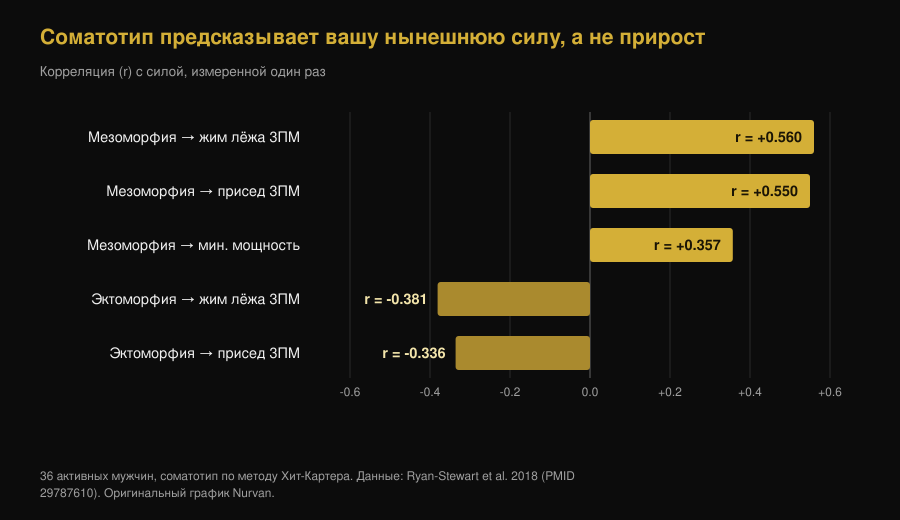
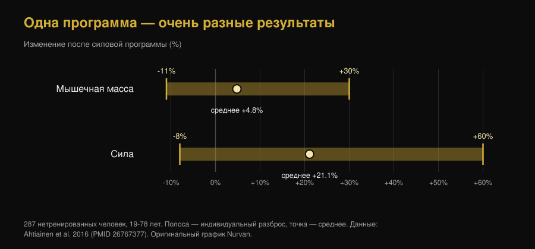

# Эктоморф или мезоморф: тип телосложения решает, сколько вы вырастете?

Di [Giammaria Loi](/autore/giammaria-loi) · обновлено 7 октября 2026

«Я эктоморф, поэтому масса не идёт» — одна из самых частых фраз в любом зале. Новая работа из лаборатории Брэда Шонфельда проверила её на 40 мужчинах: исходное телосложение не предсказало рост мышц сколько-нибудь полезным образом. Мы прочитали исследование, нашли деталь, о которой пост умалчивает, и подняли работу 1994 года с противоположным выводом. Картина получается интереснее обеих.

## Коротко

- **Соматотип не предсказывает, сколько мышц вы наберёте.** У 40 нетренированных мужчин за 9 недель более выраженная мезоморфия (мускулистое сложение) дала эффекты от малых до пренебрежимых, и они почти исчезали при учёте эндоморфии и эктоморфии.
- **Но это препринт, ещё не прошедший рецензирование.** Эта деталь отсутствует в большинстве постов, которые его разносят, и она меняет вес выводов.
- **Зато соматотип предсказывает, насколько вы сильны сейчас.** У 36 активных мужчин одна мезоморфия объясняла 31,4% разброса в жиме лёжа на 3 повторения. Текущий уровень и скорость прогресса — разные вещи.
- **Исследование 1994 года нашло обратное, но только по сухой массе.** За 12 недель плотно сложенные участники прибавили 1,6 кг сухой массы, худощавые — без значимого прироста. Сила же выросла одинаково в обеих группах: в среднем +13,8%.
- **Индивидуальный разброс реален и огромен, но по внешности не читается.** У 287 нетренированных людей мышечная масса изменилась от -11% до +30%, сила — от -8% до +60%. Самый надёжный предиктор на сегодня — клетки-сателлиты, которых не видно в зеркале.

*Один турнир, одна штанга, разное телосложение: вопрос в том, предсказывает ли эта разница ещё и то, кто прибавит больше. Фото: US Air Force, Wikimedia Commons, общественное достояние.*

## Откуда взялась идея трёх типов тела

В методе Хит-Картера, который используют сегодня, соматотип — не одна категория, а тройка чисел: **эндоморфия** (округлость и жировой компонент), **мезоморфия** (крепость каркаса и мускулатуры), **эктоморфия** (вытянутость сложения). У каждого есть все три значения. «Я эктоморф» технически значит, что третье число высокое относительно двух других.

Уже здесь есть проблема. Исследование 2025 года на 185 мужчинах и 156 женщинах измерило, насколько на самом деле похожи люди в одной категории: морфологический разброс внутри одного ярлыка оказался значимым в большинстве групп и больше у мужчин. Два «мезоморфа» могут иметь очень разные тела.

## Что на самом деле сделало исследование, о котором все говорят

Сорок молодых нетренированных мужчин девять недель выполняли контролируемую программу на всё тело дважды в неделю, соматотип измеряли в начале. Гипертрофию оценивали по толщине мышц на УЗИ, биоимпедансу и обхватам; работоспособность — по максимальной силе, силовой выносливости, мощности нижней части тела и изометрической силе разгибателей колена.

Результат: более высокая исходная мезоморфия показывала высокую апостериорную вероятность положительных связей с гипертрофией и работоспособностью, но оценённые эффекты были малыми и в основном попадали в **область практической эквивалентности** — заранее заданный диапазон, который исследователи условились считать «разницей, которая ничего не меняет в реальной жизни». После поправки на эндоморфию и эктоморфию связь ослабевала ещё сильнее.

Исключение, которое авторы прямо называют поисковым: непрерывная мезоморфия показала умеренную положительную связь с приростом максимума в жиме лёжа. В остальных тестах ничего сопоставимого. Авторы также сообщают, что более выраженное африканское генетическое происхождение связано с более высокими баллами мезоморфии — это данные об **исходной морфологии**, которые в том же исследовании не обернулись лучшим откликом на тренировки.

**Уточнение, которого нет в постах:** эта работа — препринт, выложенный на SportRxiv 24 сентября 2026 года. Она не прошла рецензирование и не индексируется в PubMed. Это полезная информация, а не приговор. Сами авторы просят более крупные выборки и более длительные периоды.

## Тип тела говорит о вашей силе сегодня, а не о приросте завтра

Вот узел, который почти все пропускают. Соматотип *кое-что* предсказывает отлично: силу, которую вы показываете прямо сейчас.

У 36 активных мужчин мезоморфия коррелировала с максимумом в жиме лёжа на 3 повторения (r = 0,560) и в приседе (r = 0,550); эктоморфия коррелировала с обоими отрицательно. Одна мезоморфия объясняла 31,4% разброса в жиме.

*Примерно треть разницы в силе между людьми читается по телосложению. Но ни одна из этих корреляций не о приросте: это однократные измерения. График Nurvan по данным Ryan-Stewart et al. 2018.*

Путать одно с другим — ошибка, на которой держится миф. Крепкое тело стартует выше, и это видно; но наклон кривой — сколько вы добавите за ближайшие месяцы — другая переменная, и единственная, на которую можно влиять.

## Так что же предсказывает рост?

Индивидуальный разброс реален и велик. У 287 нетренированных людей от 19 до 78 лет после силовой программы мышечная масса изменилась в среднем на +4,8% при индивидуальных результатах от -11% до +30%; сила выросла в среднем на +21,1% при индивидуальных результатах от -8% до +60%. В той же работе **возраст и пол эту разницу не объясняли**.

*Полосы охватывают диапазон от худшего до лучшего отклика на одну и ту же программу. График Nurvan по данным Ahtiainen et al. 2016.*

Где же тогда разница? Работа на 66 людях, тренировавшихся 16 недель, разделила их на три группы: экстремальная гипертрофия (+58% площади волокна), умеренная (+28%) и нулевая. На старте размер волокон между группами **не** различался: сильных респондеров отличало количество клеток-сателлитов — стволовых клеток мышцы — и способность добавлять волокнам ядра во время тренировок.

Иначе говоря: предиктор существует, но он внутри мышцы и измеряется биопсией, а не взглядом в зеркало.

*Снаружи не видно ничего из того, что действительно важно: способность расти измеряется внутри мышцы. Фото: Nenad Stojkovic, Wikimedia Commons, CC BY 2.0.*

## Исследование 1994 года, говорившее обратное

Прежде чем закрыть тему, стоит упомянуть работу, которую сам препринт приводит в списке литературы. В 1994 году 21 мужчину разделили по телосложению — худощавому или плотному, по индексу безжировой массы — и тренировали 12 недель дважды в неделю.

| Результат через 12 недель | Плотное сложение (n=11) | Худощавое сложение (n=10) |
|---|---|---|
| Безжировая масса | **+1,6 кг (+2,3%)**, значимо | значимого прироста нет |
| Жировая масса | -2,4 кг (-11,3%) | -1,7 кг (-10,8%) |
| Изокинетическая сила | в среднем +13,8% | в среднем +13,8% |

*Данные: Van Etten et al. 1994 (PMID 8201909). Значение силы — среднее, сообщённое для обеих групп вместе: между собой они не различались.*

Значит, у «хардгейнера» есть историческая основа, но куда более узкая, чем её подают: она касалась сухой массы, а не силы, на 21 человеке и по методу классификации, отличному от соматотипа. Тридцать лет спустя, с лучшими измерениями и вдвое большей выборкой, эффект на рост не повторяется.

## Что на самом деле говорит наука

- **Подтверждено** — «От природы мускулистое сложение не означает большей способности наращивать мышцы.» — Главный результат препринта, согласующийся с тем, что разброс отклика существует, но не объясняется возрастом, полом или исходным размером волокон.
- **Требует уточнения** — «Эктоморфы не обречены быть хардгейнерами.» — Верно по новым данным, но работа 1994 года нашла на 1,6 кг больше сухой массы у более плотных участников. Сила при этом росла одинаково.
- **Требует уточнения** — «Новое исследование из моей лаборатории.» — Это препринт SportRxiv от 24 сентября 2026 года, без рецензирования и без индексации в PubMed.
- **Подтверждено** — «Мезоморфия показала умеренную положительную связь с приростом в жиме лёжа.» — Авторы подают это как поисковый анализ, так что считать установленным фактом нельзя.
- **Опровергнуто** — «Соматотип не говорит ничего полезного.» — Беглое прочтение из комментариев, и оно не выдерживает проверки: он многое говорит о том, насколько вы сильны **сейчас** (31,4% разброса в жиме). Чего он не говорит — сколько вы прибавите.
- **Непроверяемо** — «Вот почему вашему типу тела нужна другая программа.» — Ни одно из прочитанных нами исследований не сравнивало программы, назначенные по соматотипу. Основания прописывать «тренировку для эктоморфа» отсутствуют.

## Как это применить

1. **Перестаньте использовать тип тела как прогноз.** Он описывает, как ваше тело устроено сегодня. Способности сказать, насколько оно вырастет, он не показал.
2. **Сравнивайте себя с собой, а не с напарником по жиму.** Кто крепче сложен, стартует выше. О том, работает ли программа, говорит ваша кривая: веса, повторения и замеры во времени.
3. **Дайте программе хотя бы 10-12 недель, прежде чем судить.** Девять недель — минимум, чтобы вообще что-то увидеть, и на этом отрезке индивидуальные различия ещё очень шумные.
4. **Если чувствуете себя хардгейнером, сначала проверьте две очевидные переменные:** достаточно ли калорий и белка и есть ли реальный прогресс нагрузки. Почти всегда ответ там, а не в телосложении.
5. **Записывайте веса и повторения подход за подходом.** Индивидуальным откликом управляют через стимул, а чтобы его настроить, нужно знать, сколько вы его даёте: в этом смысл измерения работы, о чём мы пишем в статье про [сколько повторений нужно для массы](/ru/blog/skolko-povtoreniy-dlya-massy).
6. **Меняйте программу не потому, что «вы эктоморф»,** а потому, что цифры стоят на месте неделями. Один критерий проверяем, другой нет.

Это средние результаты исследований на конкретных группах, а не персональный план. При наличии заболеваний, на фоне лечения или после травмы обсудите программу с врачом или профильным специалистом.

> **Nurvan — ваша кривая, а не ваша категория**
>
> Nurvan записывает веса, повторения и RIR подход за подходом и строит по ним графики во времени вместе с замерами тела. Так вопрос «я вообще расту?» перестаёт зависеть от зеркала и от того, каким типом тела вы себя считаете, и решается вашим реальным прогрессом неделя за неделей.
>
> [Попробовать Nurvan](https://nurvan.app)

## Частые вопросы

**Влияет ли тип тела на рост мышц?**

По самой свежей работе — 40 нетренированных мужчин за 9 недель — пренебрежимо: эффекты мезоморфии на гипертрофию были малыми и в основном внутри порога практической незначимости, заданного авторами. Стоит помнить, что это препринт без рецензирования.

**Эктоморф — значит хардгейнер?**

По новым данным нет. Исследование 1994 года на 21 мужчине действительно нашло на 1,6 кг больше сухой массы у плотно сложенных через 12 недель, тогда как у худощавых значимого прироста не было, но сила в том же исследовании выросла одинаково в обеих группах.

**Зачем тогда знать свой соматотип?**

Чтобы описать стартовую точку. Это неплохой индикатор силы, которую вы показываете сегодня — мезоморфия объясняла 31,4% разброса в жиме у 36 активных мужчин, — но не прироста, который даст тренировка.

**Существует ли отдельная тренировка для эктоморфов, мезоморфов и эндоморфов?**

По найденным данным нет: ни одно доступное исследование не сравнивало программы, назначенные по соматотипу. Значимыми остаются известные переменные — объём, интенсивность, частота, прогрессия и восстановление.

**Почему два человека на одной программе получают такие разные результаты?**

Потому что разброс реален: у 287 нетренированных людей мышечная масса изменилась от -11% до +30%. Самый надёжный выявленный фактор — количество клеток-сателлитов в мышце, а не внешний вид.

## Читайте также

- [Сколько повторений нужно для роста мышц: миф 8-12](/ru/blog/skolko-povtoreniy-dlya-massy) — переменные, которые по данным науки действительно решают исход.
- [Мистер Олимпия 2026: результаты и победа Ника Уокера](/ru/blog/mr-olympia-2026-rezultaty-nick-walker) — что на самом деле отличает фигуры на вершине, помимо исходного каркаса.

## Источники

1. Parnell C, Piñero A, Mohan A, Coleman M, Hopper A, Segtnan R, Androulakis Korakakis P, Wolf M, Roberts M, Campa F, Swinton P, Schoenfeld BJ, 2026. *Does body build predict training response? Association between baseline somatotype and resistance training-induced muscle hypertrophy and strength gains.* SportRxiv, препринт от 24 сентября 2026 (без рецензирования) — [DOI](https://doi.org/10.51224/SportRxiv.1085)
2. Ryan-Stewart H, Faulkner J, Jobson S, 2018. *The influence of somatotype on anaerobic performance.* PLoS One 13(5):e0197761. PMID 29787610 — [DOI](https://doi.org/10.1371/journal.pone.0197761)
3. Ahtiainen JP, Walker S, Peltonen H et al., 2016. *Heterogeneity in resistance training-induced muscle strength and mass responses in men and women of different ages.* Age (Dordr) 38(1):10. PMID 26767377 — [DOI](https://doi.org/10.1007/s11357-015-9870-1)
4. Petrella JK, Kim JS, Mayhew DL, Cross JM, Bamman MM, 2008. *Potent myofiber hypertrophy during resistance training in humans is associated with satellite cell-mediated myonuclear addition: a cluster analysis.* J Appl Physiol 104(6):1736-1742. PMID 18436694 — [DOI](https://doi.org/10.1152/japplphysiol.01215.2007)
5. Van Etten LM, Verstappen FT, Westerterp KR, 1994. *Effect of body build on weight-training-induced adaptations in body composition and muscular strength.* Med Sci Sports Exerc 26(4):515-521. PMID 8201909 — [DOI](https://doi.org/10.1249/00005768-199404000-00018)
6. Campa F, Moon J, Petri C et al., 2025. *Beyond somatotype categories: composition-based clustering of body types in young adults.* Front Physiol 16:1722899. PMID 41357170 — [DOI](https://doi.org/10.3389/fphys.2025.1722899)

> Научные источники найдены в PubMed и проверены 7 октября 2026 года. Препринт SportRxiv прочитан напрямую на официальной странице архива: приведённые здесь данные взяты из публичной аннотации, поскольку числовых оценок эффекта там не публикуют.

> Отправная точка: пост [Брэда Шонфельда](https://www.instagram.com/p/DdtXZsPxbYU/) от 25 сентября 2026 года о соматотипе и отклике на тренировки. Текст, структура, проверки, сравнительная таблица и графики этой статьи — оригинальные.

**Джаммария Лои** — основатель Nurvan. Тренируется с отягощениями с 2012 года, работает персональным тренером и коучем с сертификацией FIPE с 2013 года и выступает в пауэрлифтинге на национальном уровне с 2018 года. Каждая его статья начинается с научных работ и заканчивается тем, что действительно работает в зале.

> Примечание: информационный материал, не заменяющий консультацию врача или профильного специалиста. Приведённые результаты — средние значения и диапазоны из исследований на конкретных группах, они не являются персональной программой тренировок.
