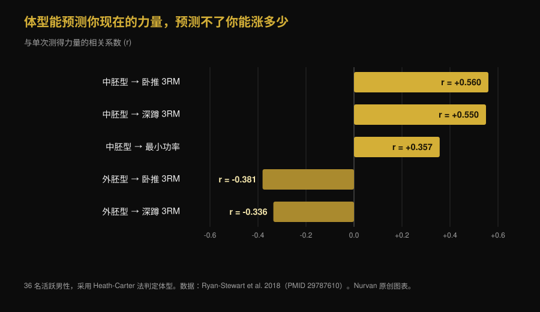
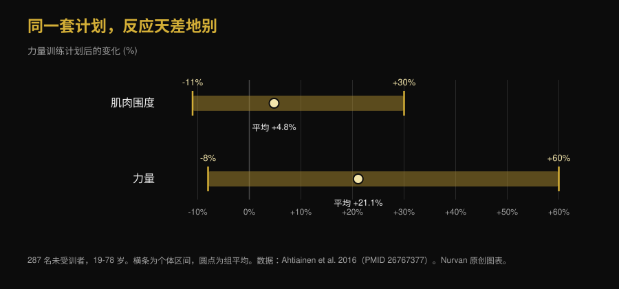

# 外胚型还是中胚型：你的体型决定你能长多少？

Di [Giammaria Loi](/autore/giammaria-loi) · 更新于 2026 年 10 月 7 日

"我是外胚型，所以增不了肌"是健身房里最常听到的一句话。Brad Schoenfeld 实验室的一项新研究在 40 名男性身上做了检验：起始体型并不能有效预测肌肉增长。我们读了这项研究，发现了帖子没有提到的一点，并翻出了 1994 年那篇结论相反的论文。拼起来的画面比两者都更有意思。

## 要点速览

- **体型预测不了你将来能长多少肌肉。** 40 名未受训男性训练 9 周，中胚型程度更高（肌肉型身材）对肌肥大的影响从微小到可忽略，一旦把内胚型和外胚型一起纳入考虑，影响几乎消失。
- **但这是一篇预印本，尚未通过同行评审。** 大多数转发它的帖子都漏掉了这一点，而它决定了这项结果该有多少分量。
- **体型倒是能预测你现在有多强。** 在 36 名活跃男性中，仅中胚型一项就解释了 3RM 卧推 31.4% 的差异。当前水平和进步速度是两回事。
- **1994 年的一项研究得出相反结论，但只限于瘦体重。** 12 周里，体格结实的受试者增加了 1.6 公斤瘦体重，偏瘦者没有显著增长。但力量在两组中涨幅相同：平均 +13.8%。
- **个体差异真实存在而且巨大，可它写不在外表上。** 287 名未受训者中，肌肉量变化从 -11% 到 +30%，力量从 -8% 到 +60%。目前最可靠的预测因素是卫星细胞，镜子里看不到。

*同一场比赛、同一根杠铃、不同的体格：问题在于这种差异是否也能预测谁进步更多。照片：US Air Force，维基共享资源，公有领域。*

## 三种体型的说法从哪来

在今天使用的 Heath-Carter 方法里，体型不是一个固定标签，而是三个数字：**内胚型**（圆润与脂肪成分）、**中胚型**（骨架与肌肉的结实程度）、**外胚型**（身形的修长程度）。每个人都有这三个分数。说"我是外胚型"，技术上只是指第三个数字相对另外两个偏高。

这里已经有问题了。2025 年一项针对 185 名男性和 156 名女性的研究测量了同一类别里的人究竟有多相似：同一标签内部的形态离散度在多数组别中都是显著的，男性更大。两个"中胚型"的身体可以非常不同。

## 大家都在转的这项研究到底做了什么

40 名年轻、未受训的男性完成了为期 9 周、每周两次的全身监督训练计划，体型在开始时测定。肌肥大用超声肌肉厚度、生物电阻抗和围度评估；运动表现用最大力量、肌肉耐力、下肢功率和膝伸肌等长力量评估。

结果：更高的基线中胚型确实显示出与肌肥大和表现正相关的高后验概率，但估计效应很小，大部分落在**实际等效区间**之内——也就是研究者事先定义为"在现实生活中改变不了什么的差异"的那个范围。在校正内胚型与外胚型之后，这种关联进一步减弱。

一个例外，作者明确标注为探索性分析：连续中胚型分数与卧推最大重量的提升呈现中等程度的正相关。其他测试没有类似结果。作者还报告，更高的非洲遗传血统与更高的中胚型评分相关——这是关于**起始形态**的发现，而在同一项研究中，它并没有转化为更好的训练反应。

**帖子里缺的那句话：** 这篇论文是 2026 年 9 月 24 日发表在 SportRxiv 上的预印本，尚未通过同行评审，也没有被 PubMed 收录。它是有用的信息，不是定论。作者自己也呼吁更大的样本和更长的周期。

## 体型说的是你今天的力量，不是明天的增长

这就是几乎所有人都跳过的关键。体型确实能把*某件事*预测得很好：你此刻能表现出的力量。

在 36 名活跃男性中，中胚型与 3 次最大重复的卧推成绩相关（r = 0.560），与深蹲相关（r = 0.550）；外胚型与两者都呈负相关。仅中胚型一项就解释了卧推 31.4% 的差异。

*人与人之间约三分之一的力量差距可以从体格读出来。不过这些相关性没有一条是关于进步的：它们都是单次测量。Nurvan 原创图表，数据来自 Ryan-Stewart et al. 2018。*

把两者混为一谈，正是这个迷思得以延续的原因。结实的身体起点更高，这看得见；但曲线的斜率——接下来几个月你能加上多少——是另一个变量，而且是唯一你能动的那个。

## 那么到底什么能预测增长？

个体差异真实而巨大。在 287 名 19 至 78 岁的未受训者中，完成力量训练计划后肌肉量平均变化 +4.8%，个体结果从 -11% 到 +30%；力量平均上升 +21.1%，个体结果从 -8% 到 +60%。在同一项研究中，**年龄和性别并不能解释这种差距**。

*横条从对同类计划反应最差的人一直延伸到反应最好的人。Nurvan 原创图表，数据来自 Ahtiainen et al. 2016。*

那差别在哪里？一项针对 66 人、训练 16 周的研究把他们分成三组：极端肌肥大（肌纤维横截面 +58%）、中等（+28%）和零增长。在基线时，三组的肌纤维大小**没有**差异：区分高反应者的是他们的卫星细胞数量——肌肉的干细胞——以及训练期间向肌纤维补充细胞核的能力。

换句话说：预测因素确实存在，但它在肌肉里面，要用活检来测量，而不是照镜子。

*真正重要的东西从外面一点也看不出来：增长能力是在肌肉内部测量的。照片：Nenad Stojkovic，维基共享资源，CC BY 2.0。*

## 1994 年那篇说法相反的研究

在把这个想法归档之前，值得提一下预印本自己列进参考文献的那篇论文。1994 年，21 名男性按体格被分为两组——偏瘦或结实，依据去脂体重指数分类——训练 12 周，每周两次。

| 12 周后的结果 | 结实体格（n=11） | 偏瘦体格（n=10） |
|---|---|---|
| 去脂体重 | **+1.6 公斤（+2.3%）**，显著 | 无显著增加 |
| 脂肪量 | -2.4 公斤（-11.3%） | -1.7 公斤（-10.8%） |
| 等速力量 | 平均 +13.8% | 平均 +13.8% |

*数据：Van Etten et al. 1994（PMID 8201909）。力量数值是两组合并报告的平均值，两组之间没有差异。*

所以"难增肌体质"确有历史依据，但范围比传说窄得多：它关乎瘦体重而非力量，样本只有 21 人，分类方法也不是体型学。三十年后，用更好的测量和两倍的样本，对增长的影响没有再出现。

## 研究到底怎么说

- **已证实** — "天生肌肉型的身材并不意味着更强的增肌能力。" — 这是预印本的主要结果，与"反应差异存在但无法由年龄、性别或基线肌纤维大小解释"相吻合。
- **需要补充** — "外胚型不必然是难增肌体质。" — 就新数据而言成立，但 1994 年那项研究在体格更结实的受试者身上发现多了 1.6 公斤瘦体重。力量方面两组则完全相同。
- **需要补充** — "我实验室的一项新研究。" — 这是 2026 年 9 月 24 日的 SportRxiv 预印本，未经同行评审，也未被 PubMed 收录。
- **已证实** — "中胚型与卧推进步呈现中等程度的正相关。" — 作者将其列为探索性分析，因此不能当作既定结论。
- **已推翻** — "体型说明不了任何有用的东西。" — 这是评论区的快读结论，站不住脚：它很能说明你**现在**有多强（卧推 31.4% 的差异）。它说不了的是你会进步多少。
- **无法验证** — "所以你的体型需要不同的训练方式。" — 我们读到的研究中，没有一项比较过按体型分配的训练计划。没有依据去开"外胚型专属训练"。

## 怎么落地

1. **别再把体型当成预测。** 它描述的是你今天的身体构造，并没有被证明能说出它将来会长多少。
2. **和自己比，不要和卧推搭档比。** 体格更壮的人起点更高。判断计划有没有效的是你自己的曲线：负荷、次数和围度随时间的变化。
3. **至少给一个计划 10 到 12 周再下结论。** 9 周是看出点东西的下限，而在这个跨度里个体差异的噪音仍然很大。
4. **如果你觉得自己难增肌，先检查两个显而易见的变量：** 热量和蛋白质是否足够，负荷是否真的在进步。答案几乎总在这里，而不在体格上。
5. **逐组记录负荷和次数。** 个体反应靠调整刺激来管理，而要调整就得知道自己给了多少：这正是记录训练量的意义，我们在[增肌每组做多少次](/zh/blog/duoshao-cishu-zengji)那篇里讲过。
6. **不要因为"你是外胚型"而换计划，** 要因为数字已经停滞几周而换。前一个标准不可验证，后一个可以。

以上是针对特定人群研究得出的平均结果，不是个人化方案。如果你有疾病、正在接受治疗或刚从伤病中恢复，制定计划前请先咨询医生或专业人士。

> **Nurvan — 看你的曲线，不是你的标签**
>
> Nurvan 逐组记录负荷、次数和 RIR，并连同身体围度一起绘制成随时间变化的图表。于是"我到底有没有在长"这个问题不再取决于镜子和你自认的体型，而是由你每周的真实进步来回答。
>
> [试用 Nurvan](https://nurvan.app)

## 常见问题

**体型会影响肌肉增长吗？**

根据最新的研究——40 名未受训男性训练 9 周——影响可以忽略：中胚型对肌肥大的效应很小，而且大部分落在作者定义的实际无关紧要阈值之内。需要记住的是，这是一篇尚未经过同行评审的预印本。

**外胚型就等于难增肌吗？**

按新数据不是。1994 年一项 21 人的研究确实发现结实体格者在 12 周后多了 1.6 公斤去脂体重，而偏瘦者没有显著增长，但同一研究中两组的力量增长完全相同。

**那知道自己的体型还有什么用？**

用来描述起点。它是你今天能表现出的力量的不错指标——在 36 名活跃男性的研究里，中胚型解释了卧推 31.4% 的差异——但它说明不了训练会带给你多少进步。

**外胚型、中胚型和内胚型需要不同的训练方式吗？**

就我们找到的证据而言没有：现有研究没有比较过按体型分配的训练计划。真正起作用的仍是那些已知变量——训练量、强度、频率、进阶和恢复。

**为什么两个人做同一个计划，结果差这么多？**

因为差异是真实的：287 名未受训者的肌肉量变化从 -11% 到 +30%。目前确认的最可靠因素是肌肉中卫星细胞的数量，而不是外表。

## 延伸阅读

- [增肌每组做多少次？8-12 次的迷思](/zh/blog/duoshao-cishu-zengji) — 研究显示真正决定增长的那些变量。
- [奥林匹亚先生2026：尼克·沃克夺冠的启示](/zh/blog/mr-olympia-2026-results-zh) — 除了先天骨架之外，顶尖身材之间真正的差距在哪里。

## 参考来源

1. Parnell C, Piñero A, Mohan A, Coleman M, Hopper A, Segtnan R, Androulakis Korakakis P, Wolf M, Roberts M, Campa F, Swinton P, Schoenfeld BJ, 2026. *Does body build predict training response? Association between baseline somatotype and resistance training-induced muscle hypertrophy and strength gains.* SportRxiv，2026 年 9 月 24 日预印本（未经同行评审）— [DOI](https://doi.org/10.51224/SportRxiv.1085)
2. Ryan-Stewart H, Faulkner J, Jobson S, 2018. *The influence of somatotype on anaerobic performance.* PLoS One 13(5):e0197761. PMID 29787610 — [DOI](https://doi.org/10.1371/journal.pone.0197761)
3. Ahtiainen JP, Walker S, Peltonen H et al., 2016. *Heterogeneity in resistance training-induced muscle strength and mass responses in men and women of different ages.* Age (Dordr) 38(1):10. PMID 26767377 — [DOI](https://doi.org/10.1007/s11357-015-9870-1)
4. Petrella JK, Kim JS, Mayhew DL, Cross JM, Bamman MM, 2008. *Potent myofiber hypertrophy during resistance training in humans is associated with satellite cell-mediated myonuclear addition: a cluster analysis.* J Appl Physiol 104(6):1736-1742. PMID 18436694 — [DOI](https://doi.org/10.1152/japplphysiol.01215.2007)
5. Van Etten LM, Verstappen FT, Westerterp KR, 1994. *Effect of body build on weight-training-induced adaptations in body composition and muscular strength.* Med Sci Sports Exerc 26(4):515-521. PMID 8201909 — [DOI](https://doi.org/10.1249/00005768-199404000-00018)
6. Campa F, Moon J, Petri C et al., 2025. *Beyond somatotype categories: composition-based clustering of body types in young adults.* Front Physiol 16:1722899. PMID 41357170 — [DOI](https://doi.org/10.3389/fphys.2025.1722899)

> 科学来源取自 PubMed，并于 2026 年 10 月 7 日核对。SportRxiv 预印本是在该档案库官方页面上直接阅读的：此处引用的数据来自公开摘要，因为那里没有提供任何效应量的数值。

> 起点：[Brad Schoenfeld](https://www.instagram.com/p/DdtXZsPxbYU/) 2026 年 9 月 25 日关于体型与训练反应的帖子。本文的文字、结构、事实核查、对比表格和图表均为原创。

**Giammaria Loi** 是 Nurvan 的创始人。他自 2012 年开始力量训练，自 2013 年起担任 FIPE 认证私人教练，自 2018 年起在国家级力量举比赛中参赛。他署名的每篇文章都从科研出发，落到健身房里真正管用的做法。

> 注：本文为科普内容，不能替代医生或专业人士的意见。文中结果为特定人群研究的平均值与区间，不构成个人化训练方案。
