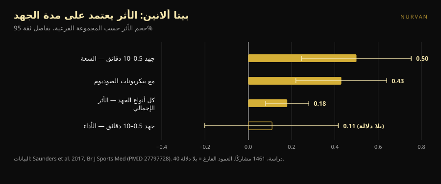
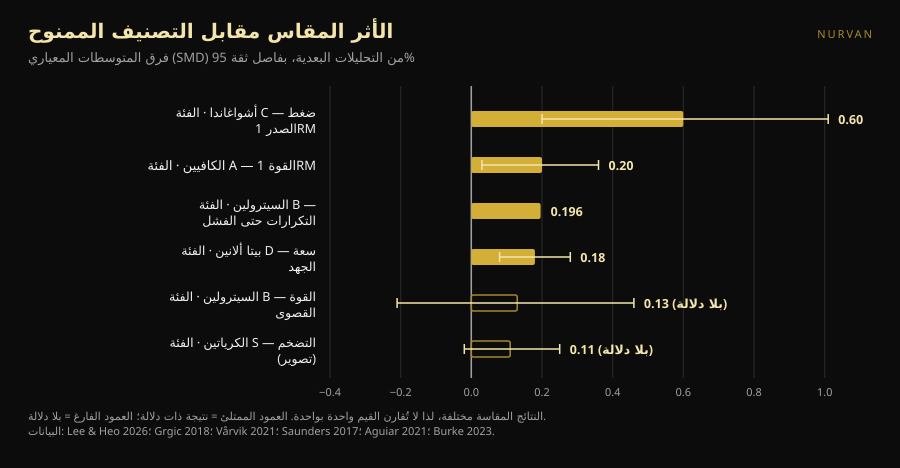

# تصنيف مكملات القوة: أي المراتب تصمد

بقلم [Giammaria Loi](/autore/giammaria-loi) · حُدِّث في 8 أكتوبر 2026

قوائم تصنيف المكملات تدور منذ سنوات: سطر لكل حرف، من S إلى F، وشعور بأنك فهمت كل شيء في عشر ثوانٍ. مرّت علينا مؤخرًا قائمة متقنة، بمعايير معلنة ورسالة ختامية صحيحة. فذهبنا نبحث عن التحليل البعدي الخاص بكل مكمّل في تلك القائمة، ووضعنا الأرقام بجانب الحروف. موضعان لا يصمدان، وجرعة واحدة خاطئة، ومكمّل في القاع يستحق الصعود — لكن فقط إذا كنت تتدرب بطريقة معينة.

## باختصار

- **القائمة محقّة في أعلاها وتتشوش في وسطها.** الكرياتين في القمة أمر لا يُناقش، لكن حتى أثره المقاس صغير: في القياسات المباشرة للتضخم العضلي يبلغ التقدير المجمّع 0.11، بفاصل يلامس الصفر.
- **السيترولين لا يزيد القوة القصوى.** تحليل بعدي على متدربين يجد 0.13، بلا دلالة إحصائية. ما يفعله فعلًا، وبقدر متواضع، هو إضافة نحو 3 تكرارات من أصل 51 في الحصة.
- **بيتا ألانين في الفئة D له الأثر الإجمالي نفسه الذي للكافيين في الفئة A.** 0.18 مقابل 0.20. الفرق أن بيتا ألانين يعمل في الجهد الممتد من نصف دقيقة إلى عشر دقائق: بلا فائدة في المحاولة القصوى، ومفيد في مجموعة من 20 تكرارًا أو في سباق HYROX.
- **جرعة الكافيين في المنشور منخفضة أكثر مما ينبغي.** وثيقة الموقف الصادرة عن ISSN تضع المجال الفعّال باستمرار عند 3–6 ملغ لكل كغ من وزن الجسم، وتقول إن الحد الأدنى قد ينزل *حتى* 2 ملغ/كغ. لا 0.9.
- **المكمّل صاحب أكبر أثر هو صاحب أضعف دليل.** الأشواغاندا تُظهر 0.60 في ضغط الصدر الأقصى، وهو أعلى رقم في القائمة كلها، لكن اليقين في الأدلة منخفض والنتيجة معلّقة على دراسة واحدة.

*العلاقة بين الحرف الممنوح والأثر المقاس أقل انتظامًا بكثير مما يوحي به أي ترتيب. الصورة: Shixart1985، ويكيميديا كومنز، CC BY 2.0.*

## ماذا قالت القائمة

يقيّم المنشور المكملات بأربعة معايير معلنة: السعر والمشروعية، الفعالية المثبتة في تجارب بشرية، آلية عمل قابلة للتفسير، ومنافع غير مباشرة (تحسين النوم مثلًا). الناتج: كرياتين مونوهيدرات في **S**؛ مسحوق البروتين والكافيين مع الثيانين في **A**؛ السيترولين في **B**؛ زيت السمك والأشواغاندا في **C**؛ بيتا ألانين والنترات في **D**؛ البيتايين وأحماض EAA ومعظم تركيبات ما قبل التمرين في **E**؛ BCAA واللِّيفوتيروزين و«معزّزات التستوستيرون» وHMB في **F**.

أمران صحيحان قبل النظر إلى البيانات أصلًا. الأول أن المعايير معلنة: قائمة تصنيف بلا معايير ليست سوى رأي متنكّر في هيئة بيانات. الثاني أن الجملة الأخيرة تساوي أكثر من القائمة بأكملها: المكملات تُكمِّل ولا تحلّ محل نظام غذائي متنوع ونوم كافٍ.

المشكلة أن أربعة معايير مختلفة تُضغط في حرف واحد. ذلك الحرف لا يخبرك إن كان الشيء في الأعلى لأنه يعمل بقوة، أم لأنه رخيص، أم لأنه يساعد على النوم. وحين تتحقق من مقدار عمل كل واحد فعليًا، يتفكك الترتيب.

## ماذا يقول البحث فعلًا

### الكرياتين في S — **مؤكَّد**، مع تصحيح لحجم التوقعات

الكرياتين هو المكمّل الأكثر دراسةً في الرياضة، ووثيقة الموقف الصادرة عن الجمعية الدولية لتغذية الرياضة تصفه بأنه آمن وجيّد التحمّل، مع بيانات تصل إلى 30 غرامًا يوميًا لخمس سنوات لدى أصحاء، واستهلاك معتاد مفيد في حدود 3 غرامات يوميًا (Kreider وآخرون، 2017).

لكن «الأكثر رسوخًا» ليس «الأقوى». تحليل بعدي اقتصر على القياسات المباشرة للتضخم — رنين مغناطيسي، أشعة مقطعية، موجات فوق صوتية — عبر 10 دراسات و44 نتيجة، وجد تقديرًا مجمّعًا قدره **0.11** على مقياس معياري، بفاصل مصداقية من −0.02 إلى 0.25، وزيادة في سُمك العضلة قدرها **0.10–0.16 سم** (Burke وآخرون، 2023). أثر صغير، ثابت، رخيص وآمن. ولهذا هو في الفئة S: لا لأنه يقلب تدريبك، بل لأنه الوحيد الذي يقدّم هذا القليل بثبات. وللسؤالين الأكثر تكرارًا مقالان مخصصان: [الكرياتين وتساقط الشعر](/ar/blog/creatine-hair-loss) و[الكرياتين بعد الخامسة والأربعين بلا تمرين](/ar/blog/creatine-bidun-tamarin-baad-45).

### مسحوق البروتين في A — **يحتاج تدقيقًا**

التحليل البعدي المرجعي، 49 دراسة و1863 شخصًا، يجد أن تناول البروتين كمكمّل أثناء برنامج قوة يضيف **2.49 كغ إلى التكرار الأقصى** (فاصل ثقة 95%: 0.64–4.33) و**0.30 كغ من الكتلة الخالية من الدهن** (0.09–0.52) (Morton وآخرون، 2018).

التفصيل الذي يقلب الصورة: فوق مدخول إجمالي قدره **1.62 غرام بروتين لكل كغ من وزن الجسم يوميًا**، تختفي الفائدة الإضافية. المسحوق ليس مكمّلًا بالمعنى الذي يكون به الكرياتين مكمّلًا — إنه طعام في صيغة مريحة. إن كنت تصل أصلًا إلى 1.6–1.8 غ/كغ من الطعام، فإضافة مخفوق لا تحرّك شيئًا؛ وإن كنت لا تصل، فالمخفوق أبسط طريق للوصول. وفي العمل نفسه يكون الأثر أكبر لدى المتدربين أصلًا (+0.75 كغ كتلة خالية من الدهن، p = 0.03) وأصغر مع التقدّم في السن.

### الكافيين في A — **الفئة مؤكَّدة، والجرعة خاطئة**

الكافيين والقوة: **0.20** على مقياس معياري (فاصل ثقة 95%: 0.03–0.36)؛ القدرة **0.17** (0.00–0.34). التحليل الفرعي يستحق الانتباه: الأثر ذو دلالة في الجزء العلوي من الجسم (**0.21**) وبلا دلالة في الجزء السفلي (**0.15**) (Grgic وآخرون، 2018).

نقطة الخلاف هي الجرعة. المنشور يعطي **0.9–2 ملغ لكل كغ من وزن الجسم** كحد أدنى فعّال. وثيقة ISSN تقول شيئًا آخر: الكافيين يحسّن الأداء باستمرار عند **3–6 ملغ/كغ**، والجرعة الدنيا الفعّالة **تظل غير واضحة** و**قد تنزل حتى** 2 ملغ/كغ، بينما الجرعات المرتفعة جدًا (9 ملغ/كغ) تجلب آثارًا جانبية بلا فائدة إضافية (Guest وآخرون، 2021). لشخص وزنه 80 كغ الفارق ليس نظريًا: المنشور يوحي بـ 72–160 ملغ، والأدبيات بـ 240–480 ملغ. الحد الأدنى 0.9 ملغ/كغ لا سند له في تلك الوثيقة.

أما نسبة **الكافيين إلى الثيانين 1:2** الواردة في الشرائح: الأدبيات التي تسندها تخصّ الانتباه والمزاج والوظيفة المعرفية، لا القوة ولا التكرارات (Mancini وآخرون، 2017). نصنّفها **غير قابلة للتحقق** في سياق التدريب: ليست خاطئة، لكنها ببساطة لم تُختبر على ما يهمّك في الصالة.

### السيترولين في B — **مفنَّد** فيما يخص القوة

هنا تقول القائمة ما لا يقوله البحث. المنشور ينسب إلى السيترولين «قوة وقدرة أكبر». تحليل بعدي على بالغين متدربين، 4 دراسات و138 قياسًا، يجد أثرًا على القوة القصوى قدره **0.13** بفاصل من −0.21 إلى 0.46: **لا أثر** (Aguiar وCasonatto، 2021).

ما يفعله السيترولين يفعله في مكان آخر. ثماني دراسات و137 مشاركًا، 6–8 غرامات قبل التمرين بـ 40–60 دقيقة: **+3 ± 5 تكرارات** من متوسط 51 ± 23 تكرارًا إجماليًا لكل تمرين، أي **+6.4%**، بحجم أثر 0.196 (p = 0.022) (Vårvik وآخرون، 2021). وحتى هناك التحليل الفرعي على الحافة: الجزء السفلي p = 0.051، والعلوي p = 0.131. الفئة B لتحمّل التكرارات دفاع مقبول؛ الفئة B للقوة لا.

### بيتا ألانين في D — **يحتاج تدقيقًا**، والأمر يتوقف عليك

هذا هو الموضع الأقل إقناعًا. أكبر تحليل بعدي — 40 دراسة و1461 مشاركًا و70 مقياسًا — يجد أثرًا إجماليًا قدره **0.18** (فاصل ثقة 95%: 0.08–0.28) (Saunders وآخرون، 2017). وهو عمليًا الرقم نفسه الذي للكافيين على القوة (0.20)، والكافيين في القائمة ذاتها أعلى بحرفين.

الفارق الحقيقي ليس في حجم الأثر بل في **أين** يظهر. مدة الجهد عامل تعديل ذو دلالة (p = 0.004): في النافذة بين **30 ثانية و10 دقائق** يرتفع الأثر على سعة الجهد إلى **0.50** (0.246–0.753)، بينما يبقى على الأداء عند 0.11 وبلا دلالة. تفصيل عملي كثيرًا ما يُغفل: **الكمية الإجمالية المتناولة ليست عامل تعديل** (p = 0.438)، فالتحميل الأكبر لا يفيد.

ترجمةً إلى الصالة: إن كنت تؤدي ثلاثيات ثقيلة في ضغط الصدر والرفعة المميتة، فموضع بيتا ألانين في D معقول. وإن كانت حصتك مجموعات من 15–25 تكرارًا، ودوائر، وزحّافة، وHYROX أو كروس فيت، فأنت تنظر إلى المكمّل الصحيح في الخانة الخاطئة.

*بيتا ألانين ليس له أثر واحد: له أثر مختلف لكل نوع من الجهد. البيانات: Saunders وآخرون، 2017. الرسم من إعداد Nurvan.*

### الأشواغاندا في C — **تحتاج تدقيقًا**: أثر كبير وأدلة هشّة

تحليل بعدي من 2026 اقتصر على تجارب فيها تدريب مقاومة منظّم يجد أعلى رقم في القائمة كلها: **0.60** في ضغط الصدر الأقصى (0.20–1.01) و**0.52** للجزء السفلي (0.19–0.86). لكن المؤلفين أنفسهم صريحون: مع تصحيح إحصائي أكثر تحفظًا **يفقد تقديرا القوة دلالتهما**، وكلٌّ منهما يعتمد على تجربة واحدة مؤثّرة، ويقين الأدلة وفق GRADE **منخفض**. وعلى كتلة الدهن لا أثر (Lee وHeo، 2026).

مثال مثالي على سبب قراءة رقمين لا رقم واحد: كم يبلغ الأثر، وكم يمكن تصديقه. الأشواغاندا تكسب الأول وتخسر الثاني.

### HMB في F — **مؤكَّد**

إحدى عشرة دراسة، 302 شخص لتركيب الجسم و248 للقوة، بين 18 و45 عامًا: ينتج HMB أثرًا ذا دلالة **على وزن الجسم الكلي فقط**، ولا أثر له على الكتلة الخالية من الدهن ولا كتلة الدهن ولا التكرار الأقصى الكلي ولا ضغط الصدر ولا الجزء السفلي (Jakubowski وآخرون، 2020). الحرف F مستحَق.

*أحجام الأثر (فرق المتوسطات المعياري) كما وردت في التحليلات البعدية المذكورة، بفاصل ثقة أو مصداقية 95%. النتيجة المقاسة تختلف من مكمّل لآخر وهي مكتوبة في البطاقة: القيم ليست قابلة للمقارنة واحدة بواحدة، وهذا بالضبط سبب عدم كفاية حرف واحد. الرسم من إعداد Nurvan وفق المصادر في آخر المقال.*

## كيف تطبّق هذا

1. **الأساسات أولًا.** المنشور يقولها وهو محق: السعرات والبروتين الكلي والنوم أثقل من أي خانة في الجدول. من ينام ست ساعات لا ينقذه أي حرف.
2. **ابدأ من S ولا تنزل إلا بسبب.** كرياتين 3–5 غرامات يوميًا، كل يوم، بلا توقيت خاص. هي الشراء الوحيد الذي يستطيع كل شخص تقريبًا تبريره.
3. **احسب بروتينك قبل شراء المسحوق.** إن كنت تتجاوز 1.6 غ/كغ يوميًا، فالمخفوق راحة لا أداء.
4. **اختر جرعة الكافيين من البحث لا من المنشور.** المجال المدروس 3–6 ملغ/كغ، قبل نحو 60 دقيقة. إن كنت حساسًا فابدأ من الأسفل وراقب نومك: حصة أفضل تُدفع بساعتَي نوم أقل صفقة خاسرة.
5. **اختر حسب الهدف لا حسب الحرف.** المحاولات القصوى والثلاثيات الثقيلة: كرياتين، كافيين، بروتين. المجموعات الطويلة وميتكون وHYROX: بيتا ألانين يصعد، والسيترولين لا معنى له إلا في حجم التكرارات.
6. **جرّب المكمّل على نفسك بالأرقام.** أثر قدره 0.18 لا يُرى في حصة واحدة. يُرى عبر ثمانية أسابيع من الأحمال المسجَّلة، بالبرنامج نفسه وبالـ RIR المستهدف نفسه.

> ### 💡 مع Nurvan
> **سجّل ما تتناوله وتحقّق إن كان يغيّر شيئًا فعلًا.** في قسم المكملات داخل Nurvan تدوّن المنتج والجرعة والتوقيت؛ وفي مفكرة التدريب تبقى الأحمال والتكرارات وقيم RIR حصةً بحصة. وبتقاطع الاثنين ترى إن كانت أرقامك قد تحركت أكثر من المعتاد خلال الأسابيع الثمانية التي أضفت فيها مكمّلًا — بدلًا من الوثوق بحرف وزّعه أحدهم على إنستغرام. [جرّب Nurvan](https://nurvan.app)

## أسئلة شائعة

**إن اشتريت مكمّلًا واحدًا فقط للقوة، فأيّها؟**
كرياتين مونوهيدرات: الوحيد الذي يجمع أثرًا صغيرًا لكنه ثابت في القياسات المباشرة، وسجلّ أمان موثّقًا على المدى الطويل، وتكلفة زهيدة (Kreider وآخرون، 2017؛ Burke وآخرون، 2023).

**هل يفيد السيترولين في رفع الرقم الأقصى؟**
لا. التحليل البعدي على رياضيين متدربين لا يجد أثرًا على القوة القصوى (0.13، بلا دلالة). الفائدة الوحيدة الموثّقة هي ارتفاع متواضع في التكرارات حتى الفشل، نحو 6% (Aguiar وCasonatto، 2021؛ Vårvik وآخرون، 2021).

**كم كافيين قبل التمرين؟**
الدراسات تستخدم 3–6 ملغ لكل كغ من وزن الجسم، عادةً قبل نحو 60 دقيقة؛ والجرعات المرتفعة جدًا لا تضيف فائدة وتجلب آثارًا جانبية (Guest وآخرون، 2021). هذا مجال جرعات مدروس وليس وصفة: من يتناول أدوية، أو الحوامل، أو من لديه مشكلات قلبية أو في النوم، عليه استشارة طبيبه أولًا.

**هل يستحق بيتا ألانين إن كنت أمارس رفع الأثقال فقط؟**
قليلًا. الأثر يتركز في الجهد بين 30 ثانية و10 دقائق، والمحاولة القصوى الواحدة خارج تلك النافذة (Saunders وآخرون، 2017). أما إن كنت تمارس أيضًا عملًا بتكرارات عالية أو تهيئة بدنية فالجواب يتغير.

## اقرأ أيضًا

- [هل يسبب الكرياتين تساقط الشعر؟ ما تُظهره الدراسات فعلًا](/ar/blog/creatine-hair-loss)
- [الكرياتين بلا تمرين بعد الخامسة والأربعين: ماذا تقول الدراسة](/ar/blog/creatine-bidun-tamarin-baad-45)

## المصادر

1. Kreider RB, Kalman DS, Antonio J, et al., 2017. *International Society of Sports Nutrition position stand: safety and efficacy of creatine supplementation in exercise, sport, and medicine.* J Int Soc Sports Nutr 14:18. PMID 28615996 — [doi:10.1186/s12970-017-0173-z](https://doi.org/10.1186/s12970-017-0173-z)
2. Burke R, Piñero A, Coleman M, et al., 2023. *The Effects of Creatine Supplementation Combined with Resistance Training on Regional Measures of Muscle Hypertrophy: A Systematic Review with Meta-Analysis.* Nutrients 15(9):2116. PMID 37432300 — [doi:10.3390/nu15092116](https://doi.org/10.3390/nu15092116)
3. Morton RW, Murphy KT, McKellar SR, et al., 2018. *A systematic review, meta-analysis and meta-regression of the effect of protein supplementation on resistance training-induced gains in muscle mass and strength in healthy adults.* Br J Sports Med 52(6):376–384. PMID 28698222 — [doi:10.1136/bjsports-2017-097608](https://doi.org/10.1136/bjsports-2017-097608)
4. Grgic J, Trexler ET, Lazinica B, Pedisic Z, 2018. *Effects of caffeine intake on muscle strength and power: a systematic review and meta-analysis.* J Int Soc Sports Nutr 15:11. PMID 29527137 — [doi:10.1186/s12970-018-0216-0](https://doi.org/10.1186/s12970-018-0216-0)
5. Guest NS, VanDusseldorp TA, Nelson MT, et al., 2021. *International society of sports nutrition position stand: caffeine and exercise performance.* J Int Soc Sports Nutr 18(1):1. PMID 33388079 — [doi:10.1186/s12970-020-00383-4](https://doi.org/10.1186/s12970-020-00383-4)
6. Vårvik FT, Bjørnsen T, Gonzalez AM, 2021. *Acute Effect of Citrulline Malate on Repetition Performance During Strength Training: A Systematic Review and Meta-Analysis.* Int J Sport Nutr Exerc Metab 31(4):350–358. PMID 34010809 — [doi:10.1123/ijsnem.2020-0295](https://doi.org/10.1123/ijsnem.2020-0295)
7. Aguiar AF, Casonatto J, 2021. *Effects of Citrulline Malate Supplementation on Muscle Strength in Resistance-Trained Adults: A Systematic Review and Meta-Analysis of Randomized Controlled Trials.* J Diet Suppl 19(6):772–790. PMID 34176406 — [doi:10.1080/19390211.2021.1939473](https://doi.org/10.1080/19390211.2021.1939473)
8. Saunders B, Elliott-Sale K, Artioli GG, et al., 2017. *β-alanine supplementation to improve exercise capacity and performance: a systematic review and meta-analysis.* Br J Sports Med 51(8):658–669. PMID 27797728 — [doi:10.1136/bjsports-2016-096396](https://doi.org/10.1136/bjsports-2016-096396)
9. Jakubowski JS, Nunes EA, Teixeira FJ, et al., 2020. *Supplementation with the Leucine Metabolite β-hydroxy-β-methylbutyrate (HMB) does not Improve Resistance Exercise-Induced Changes in Body Composition or Strength in Young Subjects: A Systematic Review and Meta-Analysis.* Nutrients 12(5):1523. PMID 32456217 — [doi:10.3390/nu12051523](https://doi.org/10.3390/nu12051523)
10. Lee JC, Heo AS, 2026. *Adjunctive Ashwagandha Supplementation and Resistance-Training Adaptations in Healthy Adults: A Systematic Review and Random-Effects Meta-Analysis.* Nutrients 18(17):2815. PMID 42738987 — [doi:10.3390/nu18172815](https://doi.org/10.3390/nu18172815)
11. Mancini E, Beglinger C, Drewe J, et al., 2017. *Green tea effects on cognition, mood and human brain function: A systematic review.* Phytomedicine 34:26–37. PMID 28899506 — [doi:10.1016/j.phymed.2017.07.008](https://doi.org/10.1016/j.phymed.2017.07.008)

البيانات الوصفية والملخصات مستخرَجة من PubMed. نقطة الانطلاق: منشور [Alfred Jong (@alfred.reformance)](https://www.instagram.com/p/Dd_qscdm4cy/) لصالح Reformance Training. لم يُنسَخ أي نص أو صورة أو بنية من المنشور: استُخرجت الادعاءات وأُعيدت كتابتها وتُحقِّق منها بشكل مستقل.

---

**Giammaria Loi** هو مؤسس Nurvan. يتدرب بالأثقال منذ 2012، ويعمل مدربًا شخصيًا ومدربًا معتمدًا من FIPE منذ 2013، ويشارك في منافسات رفع الأثقال على المستوى الوطني منذ 2018. كل مقال يوقّعه ينطلق من الدراسات العلمية وينتهي عند ما ينفع فعلًا في الصالة.

> ملاحظة: محتوى معلوماتي لا يُغني عن رأي طبيب أو مختص. المكملات المذكورة قد تتفاعل مع أدوية أو حالات مرضية: تحدّث مع طبيبك قبل تناولها. وإن كنت تنافس، فتحقّق دائمًا من لائحة مكافحة المنشطات في اتحادك.
