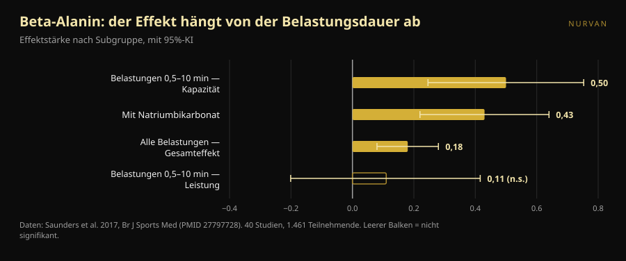
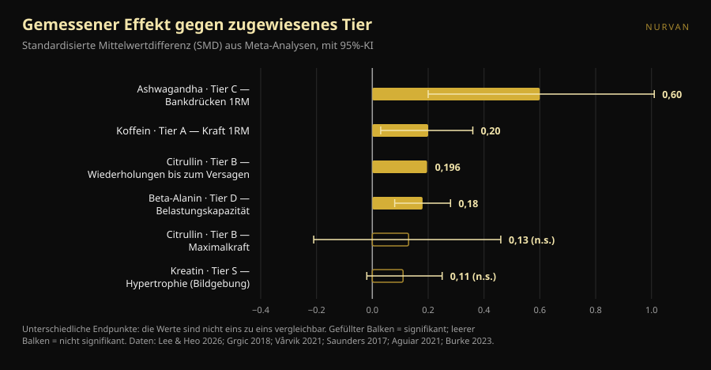

# Supplement-Tier-List für Kraft: welche Plätze halten

Von [Giammaria Loi](/autore/giammaria-loi) · aktualisiert am 8. Oktober 2026

Supplement-Tier-Lists kursieren seit Jahren: eine Zeile pro Buchstabe, S bis F, und das Gefühl, in zehn Sekunden alles verstanden zu haben. Kürzlich kam eine gut gemachte vorbei, mit offengelegten Kriterien und einer richtigen Schlussaussage. Wir haben zu jedem Supplement der Liste die Meta-Analyse herausgesucht und die Zahlen den Buchstaben gegenübergestellt. Zwei Platzierungen halten nicht, eine Dosis ist falsch, und ein Supplement vom unteren Ende gehört nach oben — aber nur, wenn du auf eine bestimmte Art trainierst.

## Kurz gefasst

- **Die Liste liegt oben richtig und verheddert sich in der Mitte.** Kreatin an der Spitze steht außer Frage, doch selbst sein gemessener Effekt ist klein: bei direkten Hypertrophiemessungen liegt die gepoolte Schätzung bei 0,11, mit einem Intervall, das die Null berührt.
- **Citrullin steigert die Maximalkraft nicht.** Eine Meta-Analyse bei Trainierten findet 0,13, nicht signifikant. Was es bewirkt, und das bescheiden, sind etwa 3 zusätzliche Wiederholungen von 51 in einer Einheit.
- **Beta-Alanin in Tier D hat denselben Gesamteffekt wie Koffein in Tier A.** 0,18 gegen 0,20. Der Unterschied: Beta-Alanin wirkt bei Belastungen von einer halben bis zehn Minuten — nutzlos beim Maximalversuch, nützlich im 20er-Satz oder im HYROX-Rennen.
- **Die Koffeindosis im Post ist zu niedrig.** Das ISSN-Position-Stand nennt 3–6 mg pro kg Körpergewicht als durchgängig wirksamen Bereich und schreibt, die Mindestschwelle könne *bis zu* 2 mg/kg herunterreichen. Nicht 0,9.
- **Das Supplement mit dem größten Effekt hat die schwächste Evidenz.** Ashwagandha zeigt 0,60 beim Bankdrück-Maximum, der höchste Wert der ganzen Liste, aber die Sicherheit der Evidenz ist niedrig und das Ergebnis hängt an einer einzigen Studie.

*Der Zusammenhang zwischen vergebenem Buchstaben und gemessenem Effekt ist weniger geordnet, als eine Rangliste nahelegt. Foto: Shixart1985, Wikimedia Commons, CC BY 2.0.*

## Was die Rangliste sagte

Das Carousel bewertet Supplemente nach vier offengelegten Kriterien: Preis und Legalität, in Humanstudien belegte Wirksamkeit, erklärbarer Mechanismus und indirekte Vorteile (etwa auf den Schlaf). Die resultierende Skala: Kreatinmonohydrat in **S**; Proteinpulver und Koffein plus Theanin in **A**; Citrullin in **B**; Fischöl und Ashwagandha in **C**; Beta-Alanin und Nitrate in **D**; Betain, EAA und die meisten Pre-Workout-Formeln in **E**; BCAA, L-Tyrosin, „Testo-Booster" und HMB in **F**.

Zwei Dinge sind richtig, noch bevor man auf die Daten schaut. Erstens sind die Kriterien genannt: eine Tier-List ohne Kriterien ist eine als Befund verkleidete Meinung. Zweitens wiegt der Schlusssatz mehr als die gesamte Rangliste: Supplemente ergänzen, sie ersetzen weder eine abwechslungsreiche Ernährung noch Schlaf.

Das Problem: vier verschiedene Kriterien werden in einen einzigen Buchstaben gepresst. Dieser Buchstabe sagt nicht, ob etwas oben steht, weil es stark wirkt, weil es billig ist oder weil es beim Schlafen hilft. Und sobald man nachsieht, wie stark jedes tatsächlich wirkt, zerfällt die Reihenfolge.

## Was die Forschung wirklich sagt

### Kreatin in S — **Bestätigt**, mit Maßstabskorrektur

Kreatin ist das meistuntersuchte Supplement des Sports, und das Position Stand der International Society of Sports Nutrition beschreibt es als sicher und gut verträglich, mit Daten bis 30 g täglich über fünf Jahre bei Gesunden und einer sinnvollen Gewohnheitszufuhr um 3 g pro Tag (Kreider et al., 2017).

Doch „am solidesten" heißt nicht „am stärksten". Eine Meta-Analyse, die ausschließlich direkte Hypertrophiemessungen berücksichtigt — MRT, CT, Ultraschall — über 10 Studien und 44 Endpunkte fand eine gepoolte Schätzung von **0,11** auf standardisierter Skala, Glaubwürdigkeitsintervall −0,02 bis 0,25, und Zuwächse der Muskeldicke von **0,10–0,16 cm** (Burke et al., 2023). Ein kleiner, konsistenter, günstiger und sicherer Effekt. Deshalb steht es in S: nicht weil es dein Training umkrempelt, sondern weil es als Einziges dieses Wenige zuverlässig liefert.

### Proteinpulver in A — **Zu präzisieren**

Die Referenz-Meta-Analyse, 49 Studien und 1.863 Personen, findet, dass Proteinsupplementierung während eines Krafttrainingsprogramms **2,49 kg beim 1RM** (95%-KI 0,64–4,33) und **0,30 kg fettfreie Masse** (0,09–0,52) hinzufügt (Morton et al., 2018).

Das entscheidende Detail: oberhalb einer Gesamtzufuhr von **1,62 g Protein pro kg Körpergewicht und Tag** verschwindet der zusätzliche Nutzen. Pulver ist kein Supplement in dem Sinn, in dem Kreatin eines ist — es ist Nahrung in praktischer Form. Wer über die Mahlzeiten schon auf 1,6–1,8 g/kg kommt, bewegt mit einem Shake nichts. Wer nicht, für den ist der Shake der einfachste Weg dorthin. In derselben Arbeit ist der Effekt bei bereits Trainierten größer (+0,75 kg fettfreie Masse, p = 0,03) und mit zunehmendem Alter kleiner.

### Koffein in A — **Tier bestätigt, Dosis falsch**

Koffein und Kraft: **0,20** auf standardisierter Skala (95%-KI 0,03–0,36); Leistung **0,17** (0,00–0,34). Die Subgruppenanalyse lohnt sich: der Effekt ist für den Oberkörper signifikant (**0,21**) und für den Unterkörper nicht (**0,15**, nicht signifikant) (Grgic et al., 2018).

Der kritische Punkt ist die Dosis. Das Carousel gibt **0,9–2 mg pro kg Körpergewicht** als minimale wirksame Dosis an. Das ISSN-Position-Stand sagt etwas anderes: Koffein verbessert die Leistung durchgängig bei **3–6 mg/kg**, die minimale wirksame Dosis **bleibt unklar** und **könnte bis zu** 2 mg/kg herunterreichen, während sehr hohe Dosen (9 mg/kg) Nebenwirkungen ohne Zusatznutzen bringen (Guest et al., 2021). Für 80 kg Körpergewicht ist der Unterschied nicht theoretisch: der Post legt 72–160 mg nahe, die Literatur 240–480 mg. Die Untergrenze von 0,9 mg/kg hat in diesem Dokument keine Stütze.

Zum Verhältnis **Koffein:Theanin 1:2** aus den Slides: die dahinterstehende Literatur betrifft Aufmerksamkeit, Stimmung und kognitive Funktion, nicht Kraft oder Wiederholungen (Mancini et al., 2017). Wir führen es als **nicht überprüfbar** fürs Training — nicht falsch, nur nie an dem getestet, worauf es im Gym ankommt.

### Citrullin in B — **Widerlegt** für die Kraft

Hier behauptet die Rangliste etwas, das die Forschung nicht hergibt. Das Carousel schreibt Citrullin „mehr Kraft und Leistung" zu. Eine Meta-Analyse bei krafttrainierten Erwachsenen, 4 Studien und 138 Messungen, findet einen Effekt auf die Maximalkraft von **0,13** mit einem Intervall von −0,21 bis 0,46: **kein Effekt** (Aguiar & Casonatto, 2021).

Was Citrullin kann, kann es anderswo. Acht Studien und 137 Teilnehmende, 6–8 g 40–60 Minuten vorher eingenommen: **+3 ± 5 Wiederholungen** bei durchschnittlich 51 ± 23 Gesamtwiederholungen pro Übung, also **+6,4 %**, Effektstärke 0,196 (p = 0,022) (Vårvik et al., 2021). Auch dort ist die Subgruppenanalyse knapp: Unterkörper p = 0,051, Oberkörper p = 0,131. Tier B für Wiederholungsausdauer ist vertretbar. Tier B für Kraft nicht.

### Beta-Alanin in D — **Zu präzisieren**, und es hängt von dir ab

Das ist die Platzierung, die uns am wenigsten überzeugt. Die größte Meta-Analyse — 40 Studien, 1.461 Teilnehmende, 70 Belastungsmaße — findet einen Gesamteffekt von **0,18** (95%-KI 0,08–0,28) (Saunders et al., 2017). Praktisch dieselbe Zahl wie Koffein bei der Kraft (0,20), das in derselben Liste zwei Buchstaben höher steht.

Der eigentliche Unterschied ist nicht die Stärke des Effekts, sondern **wo** er auftritt. Die Belastungsdauer ist ein signifikanter Moderator (p = 0,004): im Fenster zwischen **30 Sekunden und 10 Minuten** steigt der Effekt auf die Belastungskapazität auf **0,50** (0,246–0,753), während er auf die Leistung bei 0,11 bleibt und nicht signifikant ist. Ein praktisches Detail, das oft untergeht: die **insgesamt zugeführte Menge ist kein Moderator** (p = 0,438), mehr laden bringt also nichts.

Ins Gym übersetzt: Wer schwere Dreier im Bankdrücken und Kreuzheben fährt, für den passt Beta-Alanin in D. Wer Sätze zu 15–25, Zirkel, Schlittenarbeit, HYROX oder CrossFit macht, schaut auf das richtige Supplement im falschen Kästchen.

*Beta-Alanin hat nicht einen Effekt, sondern für jede Belastungsart einen anderen. Daten: Saunders et al. 2017. Grafik von Nurvan.*

### Ashwagandha in C — **Zu präzisieren**: großer Effekt, brüchige Evidenz

Eine Meta-Analyse von 2026, beschränkt auf Studien mit strukturiertem Krafttraining, findet den höchsten Wert der ganzen Liste: **0,60** beim Bankdrück-Maximum (0,20–1,01) und **0,52** für den Unterkörper (0,19–0,86). Doch die Autoren sind deutlich: unter einer vorsichtigeren statistischen Korrektur **verlieren beide Kraftschätzungen ihre Signifikanz**, jede hängt an einer einzigen einflussreichen Studie, und die GRADE-Sicherheit der Evidenz ist **niedrig**. Auf den Körperfettanteil gibt es keinen Effekt (Lee & Heo, 2026).

Das perfekte Beispiel dafür, warum man zwei Zahlen liest statt einer: wie groß der Effekt ist und wie sehr man ihm glauben kann. Ashwagandha gewinnt die erste und verliert die zweite.

### HMB in F — **Bestätigt**

Elf Studien, 302 Personen für die Körperzusammensetzung und 248 für die Kraft, 18 bis 45 Jahre: HMB erzeugt einen signifikanten Effekt **nur auf das Gesamtkörpergewicht** und keinen auf fettfreie Masse, Fettmasse, Gesamt-1RM, Bankdrücken oder Unterkörper (Jakubowski et al., 2020). Das F ist verdient.

*Effektstärken (standardisierte Mittelwertdifferenz) aus den zitierten Meta-Analysen, mit 95%-Konfidenz- bzw. Glaubwürdigkeitsintervall. Der gemessene Endpunkt unterscheidet sich je Supplement und steht in der Beschriftung: die Werte sind nicht eins zu eins vergleichbar, und genau deshalb reicht ein einzelner Buchstabe nicht. Grafik von Nurvan nach den Quellen am Ende.*

## So wendest du es an

1. **Zuerst das Fundament.** Der Post sagt es und hat recht: Kalorien, Gesamtprotein und Schlaf wiegen mehr als jedes Kästchen der Tabelle. Wer sechs Stunden schläft, den rettet kein Buchstabe.
2. **Fang bei S an und geh nur mit Grund nach unten.** Kreatin 3–5 g täglich, jeden Tag, ohne besonderen Zeitpunkt. Der einzige Kauf, den fast jeder rechtfertigen kann.
3. **Zähl dein Protein, bevor du Pulver kaufst.** Wer schon über 1,6 g/kg pro Tag liegt, kauft Bequemlichkeit, keine Leistung.
4. **Wähl die Koffeindosis nach der Forschung, nicht nach dem Carousel.** Der untersuchte Bereich ist 3–6 mg/kg, etwa 60 Minuten vorher. Wer empfindlich ist, fängt niedrig an und achtet auf den Schlaf: eine bessere Einheit, bezahlt mit zwei Stunden weniger Schlaf, ist ein schlechtes Geschäft.
5. **Wähl nach Ziel, nicht nach Buchstabe.** Maxima und schwere Dreier: Kreatin, Koffein, Protein. Lange Sätze, Metcon, HYROX: Beta-Alanin steigt, Citrullin ergibt nur beim Wiederholungsvolumen Sinn.
6. **Teste das Supplement an dir, mit Zahlen.** Ein Effekt von 0,18 ist in einer Einheit unsichtbar. Er zeigt sich über acht Wochen protokollierter Lasten, bei gleichem Programm und gleichem Ziel-RIR.

> ### 💡 Mit Nurvan
> **Protokolliere, was du nimmst, und prüf, ob sich wirklich etwas ändert.** Im Supplement-Bereich von Nurvan hältst du Produkt, Dosis und Zeitpunkt fest; im Trainingstagebuch bleiben Lasten, Wiederholungen und RIR Einheit für Einheit erhalten. Wer beides kreuzt, sieht, ob sich in den acht Wochen mit dem neuen Supplement die eigenen Zahlen stärker bewegt haben als sonst — statt einem Buchstaben zu vertrauen, den jemand auf Instagram vergeben hat. [Nurvan ausprobieren](https://nurvan.app)

## Häufige Fragen

**Wenn ich nur ein Supplement für Kraft kaufe, welches?**
Kreatinmonohydrat: das einzige mit kleinem, aber konsistentem Effekt auf direkte Messungen, einem langfristig dokumentierten Sicherheitsprofil und lächerlichen Kosten (Kreider et al., 2017; Burke et al., 2023).

**Hilft Citrullin beim Maximalgewicht?**
Nein. Die Meta-Analyse bei trainierten Athleten findet keinen Effekt auf die Maximalkraft (0,13, nicht signifikant). Der einzige belegte Nutzen ist ein bescheidener Anstieg der Wiederholungen bis zum Muskelversagen, rund 6 % (Aguiar & Casonatto, 2021; Vårvik et al., 2021).

**Wie viel Koffein vor dem Training?**
Die Studien verwenden 3–6 mg pro kg Körpergewicht, meist etwa 60 Minuten vorher; sehr hohe Dosen bringen keinen Zusatznutzen, aber Nebenwirkungen (Guest et al., 2021). Das ist ein untersuchter Dosisbereich, keine Verordnung: Wer Medikamente nimmt, schwanger ist oder Herz- oder Schlafprobleme hat, spricht vorher mit der Ärztin oder dem Arzt.

**Bringt Beta-Alanin etwas, wenn ich nur Powerlifting mache?**
Wenig. Der Effekt konzentriert sich auf Belastungen zwischen 30 Sekunden und 10 Minuten, ein einzelner Maximalversuch liegt außerhalb dieses Fensters (Saunders et al., 2017). Wer zusätzlich hohe Wiederholungszahlen oder Konditionsarbeit macht, für den sieht es anders aus.

## Lies auch

- [Verursacht Kreatin Haarausfall? Was die Studien wirklich zeigen](/blog/kreatin-haarausfall)
- [Kreatin ohne Training ab 45: was die Studie zeigt](/blog/kreatin-ohne-training-ab-45)

## Quellen

1. Kreider RB, Kalman DS, Antonio J, et al., 2017. *International Society of Sports Nutrition position stand: safety and efficacy of creatine supplementation in exercise, sport, and medicine.* J Int Soc Sports Nutr 14:18. PMID 28615996 — [doi:10.1186/s12970-017-0173-z](https://doi.org/10.1186/s12970-017-0173-z)
2. Burke R, Piñero A, Coleman M, et al., 2023. *The Effects of Creatine Supplementation Combined with Resistance Training on Regional Measures of Muscle Hypertrophy: A Systematic Review with Meta-Analysis.* Nutrients 15(9):2116. PMID 37432300 — [doi:10.3390/nu15092116](https://doi.org/10.3390/nu15092116)
3. Morton RW, Murphy KT, McKellar SR, et al., 2018. *A systematic review, meta-analysis and meta-regression of the effect of protein supplementation on resistance training-induced gains in muscle mass and strength in healthy adults.* Br J Sports Med 52(6):376–384. PMID 28698222 — [doi:10.1136/bjsports-2017-097608](https://doi.org/10.1136/bjsports-2017-097608)
4. Grgic J, Trexler ET, Lazinica B, Pedisic Z, 2018. *Effects of caffeine intake on muscle strength and power: a systematic review and meta-analysis.* J Int Soc Sports Nutr 15:11. PMID 29527137 — [doi:10.1186/s12970-018-0216-0](https://doi.org/10.1186/s12970-018-0216-0)
5. Guest NS, VanDusseldorp TA, Nelson MT, et al., 2021. *International society of sports nutrition position stand: caffeine and exercise performance.* J Int Soc Sports Nutr 18(1):1. PMID 33388079 — [doi:10.1186/s12970-020-00383-4](https://doi.org/10.1186/s12970-020-00383-4)
6. Vårvik FT, Bjørnsen T, Gonzalez AM, 2021. *Acute Effect of Citrulline Malate on Repetition Performance During Strength Training: A Systematic Review and Meta-Analysis.* Int J Sport Nutr Exerc Metab 31(4):350–358. PMID 34010809 — [doi:10.1123/ijsnem.2020-0295](https://doi.org/10.1123/ijsnem.2020-0295)
7. Aguiar AF, Casonatto J, 2021. *Effects of Citrulline Malate Supplementation on Muscle Strength in Resistance-Trained Adults: A Systematic Review and Meta-Analysis of Randomized Controlled Trials.* J Diet Suppl 19(6):772–790. PMID 34176406 — [doi:10.1080/19390211.2021.1939473](https://doi.org/10.1080/19390211.2021.1939473)
8. Saunders B, Elliott-Sale K, Artioli GG, et al., 2017. *β-alanine supplementation to improve exercise capacity and performance: a systematic review and meta-analysis.* Br J Sports Med 51(8):658–669. PMID 27797728 — [doi:10.1136/bjsports-2016-096396](https://doi.org/10.1136/bjsports-2016-096396)
9. Jakubowski JS, Nunes EA, Teixeira FJ, et al., 2020. *Supplementation with the Leucine Metabolite β-hydroxy-β-methylbutyrate (HMB) does not Improve Resistance Exercise-Induced Changes in Body Composition or Strength in Young Subjects: A Systematic Review and Meta-Analysis.* Nutrients 12(5):1523. PMID 32456217 — [doi:10.3390/nu12051523](https://doi.org/10.3390/nu12051523)
10. Lee JC, Heo AS, 2026. *Adjunctive Ashwagandha Supplementation and Resistance-Training Adaptations in Healthy Adults: A Systematic Review and Random-Effects Meta-Analysis.* Nutrients 18(17):2815. PMID 42738987 — [doi:10.3390/nu18172815](https://doi.org/10.3390/nu18172815)
11. Mancini E, Beglinger C, Drewe J, et al., 2017. *Green tea effects on cognition, mood and human brain function: A systematic review.* Phytomedicine 34:26–37. PMID 28899506 — [doi:10.1016/j.phymed.2017.07.008](https://doi.org/10.1016/j.phymed.2017.07.008)

Metadaten und Abstracts über PubMed abgerufen. Ausgangspunkt: ein Carousel von [Alfred Jong (@alfred.reformance)](https://www.instagram.com/p/Dd_qscdm4cy/) für Reformance Training. Kein Text, kein Bild und keine Struktur des Posts wurden übernommen: die Aussagen wurden extrahiert, neu geschrieben und unabhängig überprüft.

---

**Giammaria Loi** ist der Gründer von Nurvan. Er trainiert seit 2012 mit Gewichten, arbeitet seit 2013 als FIPE-zertifizierter Personal Trainer und Coach und startet seit 2018 auf nationalem Niveau im Powerlifting. Jeder Artikel, den er zeichnet, beginnt bei den Studien und endet bei dem, was im Gym wirklich funktioniert.

> Hinweis: informativer Inhalt, der die Einschätzung einer Ärztin, eines Arztes oder einer Fachperson nicht ersetzt. Die genannten Supplemente können mit Medikamenten oder Erkrankungen wechselwirken: sprich vor der Einnahme mit deiner Ärztin oder deinem Arzt. Wer an Wettkämpfen teilnimmt, prüft immer die Anti-Doping-Bestimmungen des eigenen Verbands.
