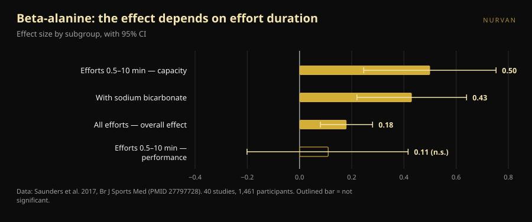
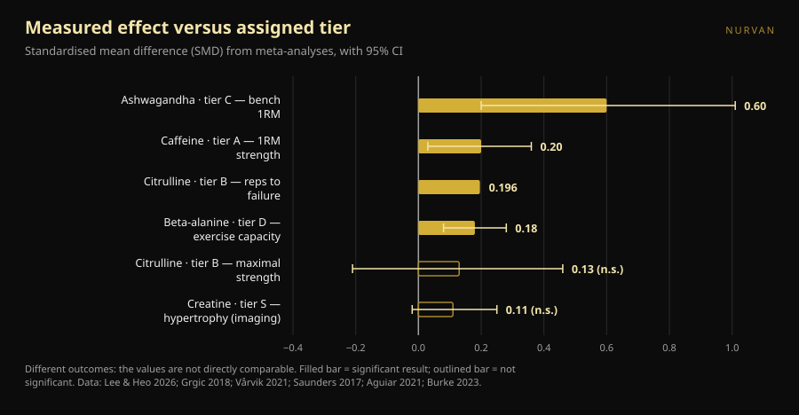

# Strength supplement tier list: which tiers hold up

By [Giammaria Loi](/autore/giammaria-loi) · updated 8 October 2026

Supplement tier lists have been circulating for years: one row per letter, S down to F, and the feeling that you have understood everything in ten seconds. A well-made one came past recently, with stated criteria and a correct closing message. So we pulled the meta-analysis behind each supplement on that list and lined the numbers up against the letters. Two placements do not hold, one dose is wrong, and one supplement near the bottom deserves to move up — but only if you train a certain way.

## The short version

- **The list is right at the top and gets muddled in the middle.** Creatine at the summit is beyond argument, but even its measured effect is small: on direct imaging measures of hypertrophy the pooled estimate is 0.11, with an interval that touches zero.
- **Citrulline does not increase maximal strength.** A meta-analysis in trained lifters finds 0.13, not significant. What it does do, modestly, is add around 3 reps across the 51 you perform in a session.
- **Beta-alanine in tier D has the same overall effect as caffeine in tier A.** 0.18 against 0.20. The difference is that beta-alanine works in efforts lasting from half a minute to ten minutes: useless for a single max, useful in a set of 20 or a HYROX race.
- **The caffeine dose in the post is too low.** The ISSN position stand puts the consistently effective range at 3–6 mg per kg of body mass, and says the minimum threshold may go as low as 2 mg/kg. Not 0.9.
- **The supplement with the biggest effect also has the weakest evidence.** Ashwagandha shows 0.60 on bench press one-rep max, the highest figure on the whole list, but the certainty of that evidence is low and the result hangs on a single study.

*The relationship between the letter a supplement gets and the effect it produces is less tidy than any ranking suggests. Photo: Shixart1985, Wikimedia Commons, CC BY 2.0.*

## What the ranking said

The carousel scores supplements on four stated criteria: price and legality, efficacy proven in human trials, an explainable mechanism, and indirect benefits (sleep, for example). The resulting scale: creatine monohydrate in **S**; protein powder and caffeine plus theanine in **A**; citrulline in **B**; fish oil and ashwagandha in **C**; beta-alanine and nitrates in **D**; betaine, EAAs and most pre-workout formulas in **E**; BCAAs, l-tyrosine, "test boosters" and HMB in **F**.

Two things are right before you even look at the data. First, the criteria are stated — a tier list without criteria is an opinion dressed as a finding. Second, the closing line is worth more than the entire ranking: supplements supplement, they do not replace a varied diet and sleep.

The problem is that four different criteria get compressed into one letter. That letter does not tell you whether something sits high because it works well, because it is cheap, or because it helps you sleep. And once you check how well each one actually works, the order falls apart.

## What the research actually says

### Creatine in S — **Confirmed**, with a reality check

Creatine is the most studied supplement in sport, and the International Society of Sports Nutrition position stand describes it as safe and well tolerated, with data up to 30 g per day for five years in healthy people and a useful habitual intake around 3 g per day (Kreider et al., 2017).

But "the most solid" is not "the most powerful." A meta-analysis restricted to direct hypertrophy measurements — MRI, CT, ultrasound — across 10 studies and 44 outcomes found a pooled estimate of **0.11** on a standardised scale, credible interval −0.02 to 0.25, and muscle thickness gains of **0.10–0.16 cm** (Burke et al., 2023). That is a small, consistent, cheap and safe effect. That is why it sits in S: not because it transforms your training, but because it is the only one that delivers that little bit reliably.

### Protein powder in A — **Needs qualifying**

The reference meta-analysis, 49 studies and 1,863 people, finds that supplementing protein during a resistance programme adds **2.49 kg to one-rep max** (95% CI 0.64–4.33) and **0.30 kg of fat-free mass** (0.09–0.52) (Morton et al., 2018).

Here is the detail that changes everything: past a total intake of **1.62 g of protein per kg of body mass per day**, the extra benefit disappears. Powder is not a supplement in the way creatine is — it is food in a convenient format. If you already hit 1.6–1.8 g/kg from meals, adding a shake moves nothing. If you do not, the shake is the easiest way to get there. In the same paper the effect is larger in people already trained (+0.75 kg of fat-free mass, p = 0.03) and smaller with age.

### Caffeine in A — **Tier confirmed, dose wrong**

Caffeine and strength: **0.20** on a standardised scale (95% CI 0.03–0.36); power **0.17** (0.00–0.34). The subgroup analysis is worth knowing: the effect is significant for the upper body (**0.21**) and not for the lower body (**0.15**, not significant) (Grgic et al., 2018).

The sticking point is the dose. The carousel gives **0.9–2 mg per kg of body mass** as the minimum effective dose. The ISSN position stand says something different: caffeine improves performance consistently at **3–6 mg/kg**, the minimum effective dose **remains unclear** and **may be as low as** 2 mg/kg, while very high doses (9 mg/kg) bring side effects without extra benefit (Guest et al., 2021). For an 80 kg lifter that is not an academic gap: the post implies 72–160 mg, the literature 240–480 mg. The 0.9 mg/kg floor has no support in that document.

On the **1:2 caffeine-to-theanine ratio** in the slides: the literature behind it concerns attention, mood and cognitive function, not strength or reps (Mancini et al., 2017). We file it as **unverifiable** for training — not wrong, simply never tested on what you care about in the gym.

### Citrulline in B — **Busted** for strength

This is where the ranking says something the research does not. The carousel credits citrulline with "increased strength and power output." A meta-analysis in resistance-trained adults, 4 studies and 138 measurements, finds an effect on maximal strength of **0.13** with an interval from −0.21 to 0.46: **no effect** (Aguiar & Casonatto, 2021).

What citrulline does, it does elsewhere. Eight studies and 137 participants, 6–8 g taken 40–60 minutes beforehand: **+3 ± 5 repetitions** against an average of 51 ± 23 total reps per exercise, so **+6.4%**, effect size 0.196 (p = 0.022) (Vårvik et al., 2021). Even there the subgroup analysis is borderline: lower body p = 0.051, upper body p = 0.131. Tier B for rep endurance is defensible. Tier B for strength is not.

### Beta-alanine in D — **Needs qualifying**, and it depends on you

This is the placement we find least convincing. The largest meta-analysis — 40 studies, 1,461 participants, 70 exercise measures — finds an overall effect of **0.18** (95% CI 0.08–0.28) (Saunders et al., 2017). That is essentially the same number as caffeine on strength (0.20), which the same list puts two letters higher.

The real difference is not how strong the effect is but **where** it shows up. Effort duration is a significant moderator (p = 0.004): in the window between **30 seconds and 10 minutes**, the effect on exercise capacity rises to **0.50** (0.246–0.753), while on performance it stays at 0.11 and not significant. One practical detail that often gets missed: the **total amount ingested is not a moderator** (p = 0.438), so loading more does not help.

In gym terms: if you grind heavy triples on bench and deadlift, beta-alanine in D is fair. If your session is sets of 15–25, circuits, sled work, HYROX or CrossFit, you are looking at the right supplement in the wrong box.

*Beta-alanine does not have one effect — it has a different one for each kind of effort. Data: Saunders et al. 2017. Chart by Nurvan.*

### Ashwagandha in C — **Needs qualifying**: big effect, fragile evidence

A 2026 meta-analysis restricted to trials with structured resistance training finds the highest number on the whole list: **0.60** on bench press one-rep max (0.20–1.01) and **0.52** on lower-body max (0.19–0.86). But the authors are blunt about it: under a more conservative statistical correction both strength estimates **lose significance**, each depends on a single influential trial, and the GRADE certainty of the evidence is **low**. On body fat there is no effect (Lee & Heo, 2026).

It is the perfect illustration of why you read two numbers instead of one: how big the effect is, and how much you can believe it. Ashwagandha wins the first and loses the second.

### HMB in F — **Confirmed**

Eleven studies, 302 people for body composition and 248 for strength, aged 18 to 45: HMB produces a significant effect **only on total body mass**, and none on fat-free mass, fat mass, total one-rep max, bench press or lower body (Jakubowski et al., 2020). The F is earned.

*Effect sizes (standardised mean difference) reported by the meta-analyses cited, with 95% confidence or credible intervals. The outcome measured differs for each supplement and is given in the label: the values are not comparable one to one, which is exactly why a single letter cannot carry the information. Chart by Nurvan from the sources listed at the end.*

## How to apply it

1. **Foundations first.** The post says it and it is right: calories, total protein and sleep weigh more than any cell in the table. If you sleep six hours, no letter saves you.
2. **Start at S and go down only with a reason.** Creatine, 3–5 g a day, every day, no particular timing. It is the one purchase almost anyone can justify.
3. **Count your protein before buying powder.** If you are already above 1.6 g/kg per day, the shake is convenience, not performance.
4. **Pick your caffeine dose from the research, not from the carousel.** The studied range is 3–6 mg/kg, roughly 60 minutes before. If you are sensitive, start low and watch your sleep: a better session paid for with two hours less sleep is a bad trade.
5. **Choose by goal, not by letter.** Maxes and heavy triples: creatine, caffeine, protein. Long sets, metcons, HYROX: beta-alanine moves up, citrulline only makes sense for rep volume.
6. **Test the supplement on yourself, with numbers.** An effect of 0.18 is invisible in one session. It shows up across eight weeks of logged loads, with the same programme and the same target RIR.

> ### 💡 With Nurvan
> **Log what you take and find out whether it actually changes anything.** In the supplementation section of Nurvan you record product, dose and timing; in the training log you keep loads, reps and RIR session by session. Cross the two and you can see whether, in the eight weeks you added something, your numbers moved more than usual — instead of trusting a letter somebody assigned on Instagram. [Try Nurvan](https://nurvan.app)

## Frequently asked questions

**If I only buy one supplement for strength, which one?**
Creatine monohydrate. It is the only one with a small but consistent effect on direct measurements, a long-term safety record and a trivial cost (Kreider et al., 2017; Burke et al., 2023).

**Does citrulline help my one-rep max?**
No. The meta-analysis in trained athletes finds no effect on maximal strength (0.13, not significant). The only documented benefit is a modest rise in reps to failure, around 6% (Aguiar & Casonatto, 2021; Vårvik et al., 2021).

**How much caffeine before training?**
Studies use 3–6 mg per kg of body mass, typically about 60 minutes beforehand; very high doses add no benefit and bring side effects (Guest et al., 2021). That is a studied dose range, not a prescription: anyone on medication, pregnant, or with heart or sleep problems should speak to their doctor first.

**Is beta-alanine worth it if I only do powerlifting?**
Not much. The effect concentrates in efforts between 30 seconds and 10 minutes, and a single max sits outside that window (Saunders et al., 2017). If you also do high-rep work or conditioning, the answer changes.

## Read next

- [Does creatine cause hair loss? What the studies actually show](/blog/creatine-hair-loss)
- [Creatine without the gym after 45: what the study shows](/blog/creatine-without-training-over-45)

## Sources

1. Kreider RB, Kalman DS, Antonio J, et al., 2017. *International Society of Sports Nutrition position stand: safety and efficacy of creatine supplementation in exercise, sport, and medicine.* J Int Soc Sports Nutr 14:18. PMID 28615996 — [doi:10.1186/s12970-017-0173-z](https://doi.org/10.1186/s12970-017-0173-z)
2. Burke R, Piñero A, Coleman M, et al., 2023. *The Effects of Creatine Supplementation Combined with Resistance Training on Regional Measures of Muscle Hypertrophy: A Systematic Review with Meta-Analysis.* Nutrients 15(9):2116. PMID 37432300 — [doi:10.3390/nu15092116](https://doi.org/10.3390/nu15092116)
3. Morton RW, Murphy KT, McKellar SR, et al., 2018. *A systematic review, meta-analysis and meta-regression of the effect of protein supplementation on resistance training-induced gains in muscle mass and strength in healthy adults.* Br J Sports Med 52(6):376–384. PMID 28698222 — [doi:10.1136/bjsports-2017-097608](https://doi.org/10.1136/bjsports-2017-097608)
4. Grgic J, Trexler ET, Lazinica B, Pedisic Z, 2018. *Effects of caffeine intake on muscle strength and power: a systematic review and meta-analysis.* J Int Soc Sports Nutr 15:11. PMID 29527137 — [doi:10.1186/s12970-018-0216-0](https://doi.org/10.1186/s12970-018-0216-0)
5. Guest NS, VanDusseldorp TA, Nelson MT, et al., 2021. *International society of sports nutrition position stand: caffeine and exercise performance.* J Int Soc Sports Nutr 18(1):1. PMID 33388079 — [doi:10.1186/s12970-020-00383-4](https://doi.org/10.1186/s12970-020-00383-4)
6. Vårvik FT, Bjørnsen T, Gonzalez AM, 2021. *Acute Effect of Citrulline Malate on Repetition Performance During Strength Training: A Systematic Review and Meta-Analysis.* Int J Sport Nutr Exerc Metab 31(4):350–358. PMID 34010809 — [doi:10.1123/ijsnem.2020-0295](https://doi.org/10.1123/ijsnem.2020-0295)
7. Aguiar AF, Casonatto J, 2021. *Effects of Citrulline Malate Supplementation on Muscle Strength in Resistance-Trained Adults: A Systematic Review and Meta-Analysis of Randomized Controlled Trials.* J Diet Suppl 19(6):772–790. PMID 34176406 — [doi:10.1080/19390211.2021.1939473](https://doi.org/10.1080/19390211.2021.1939473)
8. Saunders B, Elliott-Sale K, Artioli GG, et al., 2017. *β-alanine supplementation to improve exercise capacity and performance: a systematic review and meta-analysis.* Br J Sports Med 51(8):658–669. PMID 27797728 — [doi:10.1136/bjsports-2016-096396](https://doi.org/10.1136/bjsports-2016-096396)
9. Jakubowski JS, Nunes EA, Teixeira FJ, et al., 2020. *Supplementation with the Leucine Metabolite β-hydroxy-β-methylbutyrate (HMB) does not Improve Resistance Exercise-Induced Changes in Body Composition or Strength in Young Subjects: A Systematic Review and Meta-Analysis.* Nutrients 12(5):1523. PMID 32456217 — [doi:10.3390/nu12051523](https://doi.org/10.3390/nu12051523)
10. Lee JC, Heo AS, 2026. *Adjunctive Ashwagandha Supplementation and Resistance-Training Adaptations in Healthy Adults: A Systematic Review and Random-Effects Meta-Analysis.* Nutrients 18(17):2815. PMID 42738987 — [doi:10.3390/nu18172815](https://doi.org/10.3390/nu18172815)
11. Mancini E, Beglinger C, Drewe J, et al., 2017. *Green tea effects on cognition, mood and human brain function: A systematic review.* Phytomedicine 34:26–37. PMID 28899506 — [doi:10.1016/j.phymed.2017.07.008](https://doi.org/10.1016/j.phymed.2017.07.008)

Metadata and abstracts retrieved from PubMed. Original prompt: a carousel by [Alfred Jong (@alfred.reformance)](https://www.instagram.com/p/Dd_qscdm4cy/) for Reformance Training. No text, image or structure from the post was reproduced: the claims were extracted, rewritten and verified independently.

---

**Giammaria Loi** is the founder of Nurvan. He has been lifting since 2012, has worked as a FIPE-certified personal trainer and coach since 2013, and has competed in powerlifting at national level since 2018. Every article he writes starts from the research and ends with what actually works in the gym.

> Note: this is educational content and does not replace advice from a doctor or qualified professional. The supplements discussed can interact with medication or medical conditions: talk to your doctor before taking them. If you compete, always check your federation's anti-doping rules.
