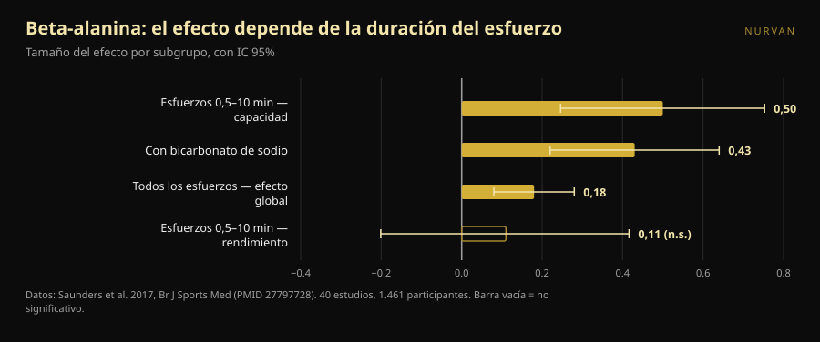
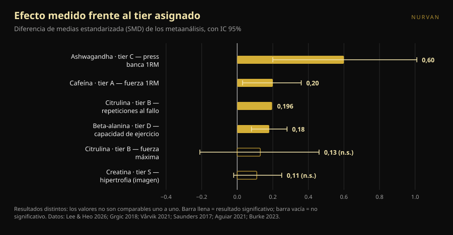

# Tier list de suplementos para la fuerza: qué posiciones aguantan

Por [Giammaria Loi](/autore/giammaria-loi) · actualizado el 8 de octubre de 2026

Las tier lists de suplementos llevan años circulando: una fila por letra, de S a F, y la sensación de haberlo entendido todo en diez segundos. Hace unos días pasó una bien hecha, con criterios declarados y un mensaje final correcto. Fuimos a buscar el metaanálisis de cada suplemento de esa lista y comparamos los números con las letras. Dos posiciones no se sostienen, una dosis está equivocada y un suplemento del fondo merece subir, pero solo si entrenas de cierta manera.

## En resumen

- **La lista acierta arriba y se enreda en el medio.** La creatina en la cima es indiscutible, pero incluso su efecto medido es pequeño: en medidas directas de hipertrofia la estimación agrupada es 0,11, con un intervalo que toca el cero.
- **La citrulina no aumenta la fuerza máxima.** Un metaanálisis en personas entrenadas encuentra 0,13, no significativo. Lo que sí hace, de forma modesta, es añadir unas 3 repeticiones sobre las 51 de una sesión.
- **La beta-alanina en tier D tiene el mismo efecto global que la cafeína en tier A.** 0,18 frente a 0,20. La diferencia es que la beta-alanina funciona en esfuerzos de medio minuto a diez minutos: inútil en un máximo, útil en una serie de 20 o en una carrera HYROX.
- **La dosis de cafeína del post es demasiado baja.** El position stand de la ISSN sitúa el rango consistentemente eficaz en 3–6 mg por kg de peso, y dice que el umbral mínimo podría bajar *hasta* 2 mg/kg. No a 0,9.
- **El suplemento con el efecto más grande es el que tiene la evidencia más débil.** La ashwagandha muestra 0,60 en press de banca máximo, la cifra más alta de toda la lista, pero la certeza de esa evidencia es baja y el resultado depende de un solo estudio.

*La relación entre la letra asignada y el efecto medido es menos ordenada de lo que sugiere cualquier clasificación. Foto: Shixart1985, Wikimedia Commons, CC BY 2.0.*

## Qué decía la clasificación

El carrusel valora los suplementos con cuatro criterios declarados: precio y legalidad, eficacia probada en humanos, mecanismo explicable y beneficios indirectos (por ejemplo sobre el sueño). La escala resultante: creatina monohidrato en **S**; proteína en polvo y cafeína con teanina en **A**; citrulina en **B**; aceite de pescado y ashwagandha en **C**; beta-alanina y nitratos en **D**; betaína, EAA y la mayoría de preentrenos en **E**; BCAA, l-tirosina, "potenciadores de testosterona" y HMB en **F**.

Dos cosas están bien antes incluso de mirar los datos. La primera es que los criterios están declarados: una tier list sin criterios es una opinión disfrazada de dato. La segunda es la frase final, que vale más que toda la clasificación: los suplementos complementan, no sustituyen una dieta variada y el sueño.

El problema es que cuatro criterios distintos se comprimen en una sola letra. Esa letra no te dice si algo está arriba porque funciona mucho, porque cuesta poco o porque ayuda a dormir. Y cuando compruebas cuánto funciona de verdad cada uno, el orden se descompone.

## Qué dice realmente la investigación

### Creatina en S — **Confirmado**, con un ajuste de expectativas

La creatina es el suplemento más estudiado del deporte y el position stand de la International Society of Sports Nutrition la describe como segura y bien tolerada, con datos de hasta 30 g al día durante cinco años en personas sanas y un consumo habitual útil en torno a 3 g diarios (Kreider et al., 2017).

Pero "el más sólido" no significa "el más potente". Un metaanálisis limitado a medidas directas de hipertrofia —resonancia, TC, ecografía— sobre 10 estudios y 44 resultados encontró una estimación agrupada de **0,11** en escala estandarizada, con intervalo de credibilidad de −0,02 a 0,25, y aumentos de grosor muscular de **0,10–0,16 cm** (Burke et al., 2023). Es un efecto pequeño, consistente, barato y seguro. Por eso está en S: no porque transforme tu entrenamiento, sino porque es el único que hace ese poco de forma fiable. Sobre las dos dudas más repetidas tenemos artículos dedicados: la [creatina y la caída del cabello](/es/blog/creatina-caida-cabello) y la [creatina después de los 45 sin entrenar](/es/blog/creatina-sin-entrenar-mas-de-45).

### Proteína en polvo en A — **A matizar**

El metaanálisis de referencia, 49 estudios y 1.863 personas, halla que suplementar proteína durante un programa de fuerza añade **2,49 kg al 1RM** (IC 95% 0,64–4,33) y **0,30 kg de masa magra** (0,09–0,52) (Morton et al., 2018).

El detalle que lo cambia todo: por encima de **1,62 g de proteína por kg de peso al día** de ingesta total, el beneficio adicional desaparece. El polvo no es un suplemento en el sentido en que lo es la creatina: es comida en formato cómodo. Si ya llegas a 1,6–1,8 g/kg comiendo, añadir un batido no mueve nada. Si no llegas, el batido es la manera más sencilla de llegar. En el mismo trabajo el efecto es mayor en quien ya está entrenado (+0,75 kg de masa magra, p = 0,03) y menor con la edad.

### Cafeína en A — **Tier confirmado, dosis equivocada**

Cafeína y fuerza: **0,20** en escala estandarizada (IC 95% 0,03–0,36); potencia **0,17** (0,00–0,34). El subanálisis es interesante: el efecto es significativo en el tren superior (**0,21**) y no en el inferior (**0,15**, no significativo) (Grgic et al., 2018).

El punto crítico es la dosis. El carrusel indica **0,9–2 mg por kg de peso** como dosis mínima eficaz. El position stand de la ISSN dice otra cosa: la cafeína mejora el rendimiento de forma consistente a **3–6 mg/kg**, la dosis mínima eficaz **sigue sin estar clara** y **podría llegar hasta** 2 mg/kg, mientras que dosis muy altas (9 mg/kg) traen efectos adversos sin ventajas (Guest et al., 2021). Para alguien de 80 kg la diferencia no es teórica: el post sugiere 72–160 mg, la literatura 240–480 mg. El suelo de 0,9 mg/kg no tiene respaldo en ese documento.

Sobre la proporción **cafeína:teanina 1:2** de las diapositivas: la literatura que la sostiene trata de atención, ánimo y función cognitiva, no de fuerza ni repeticiones (Mancini et al., 2017). La clasificamos como **no verificable** para el entrenamiento: no es falsa, simplemente no se ha probado en lo que te importa en el gimnasio.

### Citrulina en B — **Desmentido** para la fuerza

Aquí la clasificación dice algo que la investigación no dice. El carrusel atribuye a la citrulina "más fuerza y potencia". Un metaanálisis en adultos entrenados, 4 estudios y 138 mediciones, encuentra un efecto sobre la fuerza máxima de **0,13** con intervalo de −0,21 a 0,46: **ningún efecto** (Aguiar y Casonatto, 2021).

Lo que la citrulina hace, lo hace en otro sitio. Ocho estudios y 137 participantes, con 6–8 g tomados 40–60 minutos antes: **+3 ± 5 repeticiones** sobre una media de 51 ± 23 repeticiones totales por ejercicio, es decir **+6,4%**, tamaño del efecto 0,196 (p = 0,022) (Vårvik et al., 2021). Y ahí el subanálisis también está en el filo: tren inferior p = 0,051, superior p = 0,131. Tier B para la resistencia a las repeticiones es defendible. Tier B para la fuerza, no.

### Beta-alanina en D — **A matizar**, y depende de ti

Esta es la posición que menos nos convence. El metaanálisis más amplio —40 estudios, 1.461 participantes, 70 medidas— encuentra un efecto global de **0,18** (IC 95% 0,08–0,28) (Saunders et al., 2017). Es prácticamente el mismo número que la cafeína sobre la fuerza (0,20), que en la misma lista está dos letras más arriba.

La diferencia real no es la magnitud del efecto, es **dónde** aparece. La duración del esfuerzo es un moderador significativo (p = 0,004): en la ventana de **30 segundos a 10 minutos** el efecto sobre la capacidad sube a **0,50** (0,246–0,753), mientras que sobre el rendimiento se queda en 0,11 y no significativo. Un dato práctico que suele pasarse por alto: la **cantidad total ingerida no es un moderador** (p = 0,438), así que cargar más no sirve.

Traducido al gimnasio: si haces triples pesados de banca y peso muerto, la beta-alanina en D está bien. Si tu sesión son series de 15–25, circuitos, trineo, HYROX o CrossFit, estás mirando el suplemento correcto en la casilla equivocada.

*La beta-alanina no tiene un solo efecto: tiene uno distinto para cada tipo de esfuerzo. Datos: Saunders et al. 2017. Gráfico de Nurvan.*

### Ashwagandha en C — **A matizar**: efecto grande, evidencia frágil

Un metaanálisis de 2026 limitado a ensayos con entrenamiento estructurado encuentra la cifra más alta de toda la lista: **0,60** en press de banca máximo (0,20–1,01) y **0,52** en tren inferior (0,19–0,86). Pero los propios autores son tajantes: con una corrección estadística más prudente ambas estimaciones **pierden significación**, cada una depende de un único estudio influyente y la certeza GRADE de la evidencia es **baja**. Sobre la masa grasa no hay efecto (Lee y Heo, 2026).

Es el ejemplo perfecto de por qué hay que leer dos números y no uno: cuánto es el efecto y cuánto puedes creértelo. La ashwagandha gana en el primero y pierde en el segundo.

### HMB en F — **Confirmado**

Once estudios, 302 personas para composición corporal y 248 para fuerza, de 18 a 45 años: el HMB produce un efecto significativo **solo sobre el peso corporal total** y ninguno sobre masa magra, masa grasa, 1RM total, press de banca o tren inferior (Jakubowski et al., 2020). La F está merecida.

*Tamaños del efecto (diferencia de medias estandarizada) reportados por los metaanálisis citados, con intervalo de confianza o credibilidad al 95%. El resultado medido es distinto en cada suplemento y está indicado en la etiqueta: los valores no son comparables uno a uno, y por eso una sola letra no basta. Gráfico de Nurvan con los datos de las fuentes del final.*

## Cómo aplicarlo

1. **Primero los cimientos.** El post lo dice y tiene razón: calorías, proteína total y sueño pesan más que cualquier casilla de la tabla. Si duermes seis horas, ninguna letra te salva.
2. **Empieza por la S y baja solo con motivo.** Creatina 3–5 g al día, todos los días, sin horario concreto. Es la única compra que casi cualquiera puede justificar.
3. **Cuenta tu proteína antes de comprar polvo.** Si ya pasas de 1,6 g/kg al día, el batido es comodidad, no rendimiento.
4. **Elige la dosis de cafeína por la investigación, no por el carrusel.** El rango estudiado es 3–6 mg/kg, unos 60 minutos antes. Si eres sensible, empieza bajo y vigila el sueño: una sesión mejor pagada con dos horas menos de sueño es un mal negocio.
5. **Elige por objetivo, no por letra.** Máximos y triples pesados: creatina, cafeína, proteína. Series largas, metcon, HYROX: la beta-alanina sube, la citrulina solo tiene sentido para el volumen de repeticiones.
6. **Pon a prueba el suplemento en ti, con números.** Un efecto de 0,18 no se ve en una sesión. Se ve en ocho semanas de cargas registradas, con el mismo programa y el mismo RIR de referencia.

> ### 💡 Con Nurvan
> **Registra lo que tomas y comprueba si cambia algo de verdad.** En la sección de suplementación de Nurvan anotas producto, dosis y horario; en el diario de entrenamiento quedan cargas, repeticiones y RIR sesión a sesión. Cruzando ambas cosas ves si en las ocho semanas en que añadiste un suplemento tus números se movieron más de lo habitual, en lugar de fiarte de la letra que alguien puso en Instagram. [Prueba Nurvan](https://nurvan.app)

## Preguntas frecuentes

**Si solo compro un suplemento para la fuerza, ¿cuál?**
Creatina monohidrato: es el único con un efecto pequeño pero consistente en medidas directas, un perfil de seguridad documentado a largo plazo y un coste irrisorio (Kreider et al., 2017; Burke et al., 2023).

**¿La citrulina sirve para subir el máximo?**
No. El metaanálisis en atletas entrenados no encuentra efectos sobre la fuerza máxima (0,13, no significativo). El único beneficio documentado es un aumento modesto de las repeticiones al fallo, en torno al 6% (Aguiar y Casonatto, 2021; Vårvik et al., 2021).

**¿Cuánta cafeína tomar antes de entrenar?**
Los estudios usan 3–6 mg por kg de peso corporal, normalmente unos 60 minutos antes; dosis muy altas no aportan beneficio y traen efectos adversos (Guest et al., 2021). Es un rango estudiado, no una prescripción: quien tome medicación, esté embarazada o tenga problemas cardíacos o de sueño debe consultarlo antes con su médico.

**¿Sirve la beta-alanina si solo hago powerlifting?**
Poco. El efecto se concentra en esfuerzos de 30 segundos a 10 minutos, y un máximo queda fuera de esa ventana (Saunders et al., 2017). Si además haces trabajo de altas repeticiones o acondicionamiento, la cosa cambia.

## Lee también

- [¿La creatina provoca caída del cabello? Qué dicen de verdad los estudios](/es/blog/creatina-caida-cabello)
- [Creatina sin entrenar después de los 45: qué dice el estudio](/es/blog/creatina-sin-entrenar-mas-de-45)

## Fuentes

1. Kreider RB, Kalman DS, Antonio J, et al., 2017. *International Society of Sports Nutrition position stand: safety and efficacy of creatine supplementation in exercise, sport, and medicine.* J Int Soc Sports Nutr 14:18. PMID 28615996 — [doi:10.1186/s12970-017-0173-z](https://doi.org/10.1186/s12970-017-0173-z)
2. Burke R, Piñero A, Coleman M, et al., 2023. *The Effects of Creatine Supplementation Combined with Resistance Training on Regional Measures of Muscle Hypertrophy: A Systematic Review with Meta-Analysis.* Nutrients 15(9):2116. PMID 37432300 — [doi:10.3390/nu15092116](https://doi.org/10.3390/nu15092116)
3. Morton RW, Murphy KT, McKellar SR, et al., 2018. *A systematic review, meta-analysis and meta-regression of the effect of protein supplementation on resistance training-induced gains in muscle mass and strength in healthy adults.* Br J Sports Med 52(6):376–384. PMID 28698222 — [doi:10.1136/bjsports-2017-097608](https://doi.org/10.1136/bjsports-2017-097608)
4. Grgic J, Trexler ET, Lazinica B, Pedisic Z, 2018. *Effects of caffeine intake on muscle strength and power: a systematic review and meta-analysis.* J Int Soc Sports Nutr 15:11. PMID 29527137 — [doi:10.1186/s12970-018-0216-0](https://doi.org/10.1186/s12970-018-0216-0)
5. Guest NS, VanDusseldorp TA, Nelson MT, et al., 2021. *International society of sports nutrition position stand: caffeine and exercise performance.* J Int Soc Sports Nutr 18(1):1. PMID 33388079 — [doi:10.1186/s12970-020-00383-4](https://doi.org/10.1186/s12970-020-00383-4)
6. Vårvik FT, Bjørnsen T, Gonzalez AM, 2021. *Acute Effect of Citrulline Malate on Repetition Performance During Strength Training: A Systematic Review and Meta-Analysis.* Int J Sport Nutr Exerc Metab 31(4):350–358. PMID 34010809 — [doi:10.1123/ijsnem.2020-0295](https://doi.org/10.1123/ijsnem.2020-0295)
7. Aguiar AF, Casonatto J, 2021. *Effects of Citrulline Malate Supplementation on Muscle Strength in Resistance-Trained Adults: A Systematic Review and Meta-Analysis of Randomized Controlled Trials.* J Diet Suppl 19(6):772–790. PMID 34176406 — [doi:10.1080/19390211.2021.1939473](https://doi.org/10.1080/19390211.2021.1939473)
8. Saunders B, Elliott-Sale K, Artioli GG, et al., 2017. *β-alanine supplementation to improve exercise capacity and performance: a systematic review and meta-analysis.* Br J Sports Med 51(8):658–669. PMID 27797728 — [doi:10.1136/bjsports-2016-096396](https://doi.org/10.1136/bjsports-2016-096396)
9. Jakubowski JS, Nunes EA, Teixeira FJ, et al., 2020. *Supplementation with the Leucine Metabolite β-hydroxy-β-methylbutyrate (HMB) does not Improve Resistance Exercise-Induced Changes in Body Composition or Strength in Young Subjects: A Systematic Review and Meta-Analysis.* Nutrients 12(5):1523. PMID 32456217 — [doi:10.3390/nu12051523](https://doi.org/10.3390/nu12051523)
10. Lee JC, Heo AS, 2026. *Adjunctive Ashwagandha Supplementation and Resistance-Training Adaptations in Healthy Adults: A Systematic Review and Random-Effects Meta-Analysis.* Nutrients 18(17):2815. PMID 42738987 — [doi:10.3390/nu18172815](https://doi.org/10.3390/nu18172815)
11. Mancini E, Beglinger C, Drewe J, et al., 2017. *Green tea effects on cognition, mood and human brain function: A systematic review.* Phytomedicine 34:26–37. PMID 28899506 — [doi:10.1016/j.phymed.2017.07.008](https://doi.org/10.1016/j.phymed.2017.07.008)

Metadatos y resúmenes obtenidos de PubMed. Punto de partida: carrusel de [Alfred Jong (@alfred.reformance)](https://www.instagram.com/p/Dd_qscdm4cy/) para Reformance Training. No se ha reproducido ningún texto, imagen ni estructura del post: las afirmaciones se extrajeron, reescribieron y verificaron de forma independiente.

---

**Giammaria Loi** es el fundador de Nurvan. Entrena con pesas desde 2012, trabaja como entrenador personal y coach certificado FIPE desde 2013 y compite en powerlifting a nivel nacional desde 2018. Cada artículo que firma parte de los estudios científicos y llega a lo que funciona de verdad en el gimnasio.

> Nota: contenido informativo, no sustituye la opinión de un médico o profesional. Los suplementos citados pueden interactuar con medicamentos o condiciones clínicas: consulta con tu médico antes de tomarlos. Si compites, revisa siempre el reglamento antidopaje de tu federación.
