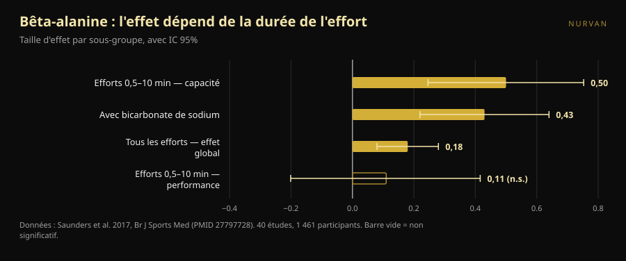
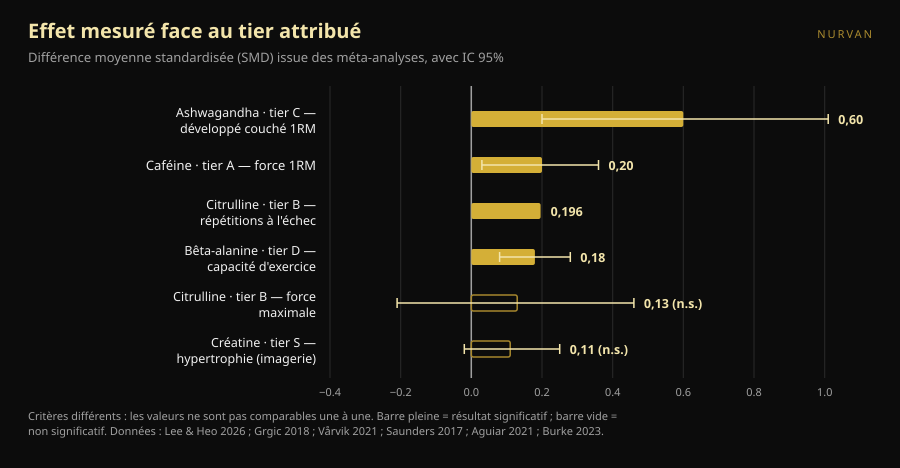

# Tier list des compléments pour la force : ce qui tient debout

Par [Giammaria Loi](/autore/giammaria-loi) · mis à jour le 8 octobre 2026

Les tier lists de compléments tournent depuis des années : une ligne par lettre, de S à F, et l'impression d'avoir tout compris en dix secondes. Il en est passé une bien faite, avec des critères annoncés et un message final juste. Nous sommes allés chercher la méta-analyse de chaque complément de cette liste et nous avons comparé les chiffres aux lettres. Deux positions ne tiennent pas, une dose est fausse, et un complément du bas mérite de remonter — mais seulement si vous vous entraînez d'une certaine façon.

## En bref

- **La liste a raison en haut et se perd au milieu.** La créatine au sommet ne se discute pas, mais même son effet mesuré est petit : sur des mesures directes d'hypertrophie, l'estimation groupée est de 0,11, avec un intervalle qui touche zéro.
- **La citrulline n'augmente pas la force maximale.** Une méta-analyse chez des pratiquants entraînés trouve 0,13, non significatif. Ce qu'elle fait, modestement, c'est ajouter environ 3 répétitions sur les 51 d'une séance.
- **La bêta-alanine en tier D a le même effet global que la caféine en tier A.** 0,18 contre 0,20. La différence : la bêta-alanine agit sur des efforts d'une demi-minute à dix minutes — inutile sur un maximal, utile sur une série de 20 ou une course HYROX.
- **La dose de caféine indiquée dans le post est trop basse.** Le position stand de l'ISSN situe la fourchette constamment efficace à 3–6 mg par kg de poids, et précise que le seuil minimal pourrait descendre *jusqu'à* 2 mg/kg. Pas 0,9.
- **Le complément au plus grand effet est aussi celui aux preuves les plus faibles.** L'ashwagandha affiche 0,60 au développé couché maximal, le chiffre le plus élevé de toute la liste, mais la certitude des preuves est faible et le résultat dépend d'une seule étude.

*Le lien entre la lettre attribuée et l'effet mesuré est moins net que ne le laisse croire un classement. Photo : Shixart1985, Wikimedia Commons, CC BY 2.0.*

## Ce que disait le classement

Le carrousel évalue les compléments selon quatre critères annoncés : prix et légalité, efficacité prouvée chez l'humain, mécanisme explicable, bénéfices indirects (le sommeil, par exemple). L'échelle obtenue : créatine monohydrate en **S** ; protéine en poudre et caféine + théanine en **A** ; citrulline en **B** ; huile de poisson et ashwagandha en **C** ; bêta-alanine et nitrates en **D** ; bétaïne, EAA et la plupart des pre-workout en **E** ; BCAA, l-tyrosine, « boosters de testostérone » et HMB en **F**.

Deux choses sont justes avant même de regarder les données. D'abord, les critères sont annoncés : une tier list sans critères est une opinion déguisée en donnée. Ensuite, la phrase de fin vaut plus que tout le classement : les compléments complètent, ils ne remplacent ni une alimentation variée ni le sommeil.

Le problème, c'est que quatre critères différents sont comprimés en une seule lettre. Cette lettre ne dit pas si un produit est haut parce qu'il agit beaucoup, parce qu'il coûte peu ou parce qu'il aide à dormir. Et quand on vérifie l'ampleur réelle de chaque effet, l'ordre se défait.

## Ce que dit vraiment la recherche

### Créatine en S — **Confirmé**, avec un recadrage

La créatine est le complément le plus étudié du sport, et le position stand de l'International Society of Sports Nutrition la décrit comme sûre et bien tolérée, avec des données jusqu'à 30 g par jour pendant cinq ans chez des personnes en bonne santé et un apport habituel utile autour de 3 g par jour (Kreider et al., 2017).

Mais « le plus solide » n'est pas « le plus puissant ». Une méta-analyse limitée aux mesures directes d'hypertrophie — IRM, scanner, échographie — sur 10 études et 44 résultats a trouvé une estimation groupée de **0,11** sur échelle standardisée, intervalle de crédibilité de −0,02 à 0,25, et des gains d'épaisseur musculaire de **0,10–0,16 cm** (Burke et al., 2023). C'est un effet petit, constant, peu coûteux et sûr. Voilà pourquoi il est en S : pas parce qu'il transforme votre entraînement, mais parce qu'il est le seul à faire ce peu de façon fiable.

### Protéine en poudre en A — **À préciser**

La méta-analyse de référence, 49 études et 1 863 personnes, montre que la supplémentation en protéines pendant un programme de force ajoute **2,49 kg au 1RM** (IC 95 % 0,64–4,33) et **0,30 kg de masse maigre** (0,09–0,52) (Morton et al., 2018).

Le détail qui change tout : au-delà de **1,62 g de protéines par kg de poids et par jour** d'apport total, le bénéfice supplémentaire s'annule. La poudre n'est pas un complément au sens où la créatine en est un : c'est de la nourriture au format pratique. Si vous atteignez déjà 1,6–1,8 g/kg en mangeant, ajouter un shaker ne change rien. Sinon, le shaker est la façon la plus simple d'y arriver. Dans le même travail, l'effet est plus grand chez les personnes déjà entraînées (+0,75 kg de masse maigre, p = 0,03) et plus petit avec l'âge.

### Caféine en A — **Tier confirmé, dose fausse**

Caféine et force : **0,20** sur échelle standardisée (IC 95 % 0,03–0,36) ; puissance **0,17** (0,00–0,34). La sous-analyse mérite le détour : l'effet est significatif sur le haut du corps (**0,21**) et pas sur le bas (**0,15**, non significatif) (Grgic et al., 2018).

Le point critique est la dose. Le carrousel donne **0,9–2 mg par kg de poids** comme dose minimale efficace. Le position stand de l'ISSN dit autre chose : la caféine améliore la performance de façon constante à **3–6 mg/kg**, la dose minimale efficace **reste floue** et **pourrait descendre jusqu'à** 2 mg/kg, tandis que des doses très élevées (9 mg/kg) entraînent des effets indésirables sans bénéfice supplémentaire (Guest et al., 2021). Pour une personne de 80 kg, l'écart n'est pas théorique : le post suggère 72–160 mg, la littérature 240–480 mg. Le plancher de 0,9 mg/kg n'a aucun appui dans ce document.

Sur le rapport **caféine:théanine 1:2** des diapositives : la littérature qui le soutient porte sur l'attention, l'humeur et la fonction cognitive, pas sur la force ni les répétitions (Mancini et al., 2017). Nous le classons **non vérifiable** pour l'entraînement : pas faux, simplement jamais testé sur ce qui vous intéresse en salle.

### Citrulline en B — **Démenti** pour la force

Ici le classement affirme ce que la recherche ne dit pas. Le carrousel attribue à la citrulline « plus de force et de puissance ». Une méta-analyse chez des adultes entraînés, 4 études et 138 mesures, trouve un effet sur la force maximale de **0,13** avec un intervalle de −0,21 à 0,46 : **aucun effet** (Aguiar et Casonatto, 2021).

Ce que fait la citrulline, elle le fait ailleurs. Huit études et 137 participants, 6–8 g pris 40–60 minutes avant : **+3 ± 5 répétitions** sur une moyenne de 51 ± 23 répétitions totales par exercice, soit **+6,4 %**, taille d'effet 0,196 (p = 0,022) (Vårvik et al., 2021). Et là encore la sous-analyse est sur le fil : bas du corps p = 0,051, haut du corps p = 0,131. Tier B pour l'endurance aux répétitions, défendable. Tier B pour la force, non.

### Bêta-alanine en D — **À préciser**, et ça dépend de vous

C'est la position qui nous convainc le moins. La plus grande méta-analyse — 40 études, 1 461 participants, 70 mesures — trouve un effet global de **0,18** (IC 95 % 0,08–0,28) (Saunders et al., 2017). C'est quasiment le même chiffre que la caféine sur la force (0,20), placée deux lettres plus haut dans la même liste.

La vraie différence n'est pas l'ampleur de l'effet, c'est **où** il apparaît. La durée de l'effort est un modérateur significatif (p = 0,004) : dans la fenêtre **30 secondes – 10 minutes**, l'effet sur la capacité monte à **0,50** (0,246–0,753), alors que sur la performance il reste à 0,11 et non significatif. Un détail pratique souvent oublié : la **quantité totale ingérée n'est pas un modérateur** (p = 0,438), donc charger davantage ne sert à rien.

Traduit en salle : si vous enchaînez des triples lourds au développé couché et au soulevé de terre, la bêta-alanine en D se défend. Si votre séance est faite de séries de 15–25, de circuits, de traîneau, de HYROX ou de CrossFit, vous regardez le bon complément dans la mauvaise case.

*La bêta-alanine n'a pas un seul effet : elle en a un différent pour chaque type d'effort. Données : Saunders et al. 2017. Graphique Nurvan.*

### Ashwagandha en C — **À préciser** : effet large, preuves fragiles

Une méta-analyse de 2026 limitée aux essais avec entraînement structuré trouve le chiffre le plus élevé de toute la liste : **0,60** au développé couché maximal (0,20–1,01) et **0,52** sur le bas du corps (0,19–0,86). Mais les auteurs sont catégoriques : avec une correction statistique plus prudente, les deux estimations de force **perdent leur significativité**, chacune dépend d'un seul essai influent, et la certitude GRADE des preuves est **faible**. Sur la masse grasse, aucun effet (Lee et Heo, 2026).

C'est l'illustration parfaite de la raison pour laquelle on lit deux chiffres et pas un : l'ampleur de l'effet, et la confiance qu'on peut lui accorder. L'ashwagandha gagne sur le premier et perd sur le second.

### HMB en F — **Confirmé**

Onze études, 302 personnes pour la composition corporelle et 248 pour la force, de 18 à 45 ans : le HMB produit un effet significatif **uniquement sur la masse corporelle totale** et aucun sur la masse maigre, la masse grasse, le 1RM total, le développé couché ou le bas du corps (Jakubowski et al., 2020). Le F est mérité.

*Tailles d'effet (différence moyenne standardisée) rapportées par les méta-analyses citées, avec intervalle de confiance ou de crédibilité à 95 %. Le critère mesuré diffère pour chaque complément et figure dans l'étiquette : les valeurs ne sont pas comparables une à une, et c'est précisément pourquoi une seule lettre ne suffit pas. Graphique Nurvan d'après les sources en fin d'article.*

## Comment l'appliquer

1. **Les fondations d'abord.** Le post le dit et il a raison : calories, protéines totales et sommeil pèsent plus que n'importe quelle case du tableau. Si vous dormez six heures, aucune lettre ne vous sauve.
2. **Partez du S et descendez seulement avec une raison.** Créatine 3–5 g par jour, tous les jours, sans horaire particulier. C'est le seul achat que presque tout le monde peut justifier.
3. **Comptez vos protéines avant d'acheter de la poudre.** Si vous dépassez déjà 1,6 g/kg par jour, le shaker est un confort, pas une performance.
4. **Choisissez votre dose de caféine d'après la recherche, pas d'après le carrousel.** La fourchette étudiée est 3–6 mg/kg, environ 60 minutes avant. Si vous êtes sensible, commencez bas et surveillez votre sommeil : une meilleure séance payée de deux heures de sommeil en moins est une mauvaise affaire.
5. **Choisissez par objectif, pas par lettre.** Maximaux et triples lourds : créatine, caféine, protéines. Séries longues, metcon, HYROX : la bêta-alanine remonte, la citrulline n'a de sens que pour le volume de répétitions.
6. **Testez le complément sur vous, avec des chiffres.** Un effet de 0,18 ne se voit pas sur une séance. Il se voit sur huit semaines de charges enregistrées, avec le même programme et le même RIR de référence.

> ### 💡 Avec Nurvan
> **Notez ce que vous prenez et vérifiez si cela change vraiment quelque chose.** Dans la section supplémentation de Nurvan, vous enregistrez produit, dose et horaire ; dans le carnet d'entraînement restent charges, répétitions et RIR séance après séance. En croisant les deux, vous voyez si, pendant les huit semaines où vous avez ajouté un complément, vos chiffres ont bougé plus que d'habitude — au lieu de vous fier à une lettre attribuée sur Instagram. [Essayer Nurvan](https://nurvan.app)

## Questions fréquentes

**Si je n'achète qu'un seul complément pour la force, lequel ?**
La créatine monohydrate : c'est le seul à combiner un effet petit mais constant sur des mesures directes, un profil de sécurité documenté sur le long terme et un coût dérisoire (Kreider et al., 2017 ; Burke et al., 2023).

**La citrulline sert-elle à augmenter le maximal ?**
Non. La méta-analyse chez des athlètes entraînés ne trouve aucun effet sur la force maximale (0,13, non significatif). Le seul bénéfice documenté est une hausse modeste des répétitions jusqu'à l'échec, environ 6 % (Aguiar et Casonatto, 2021 ; Vårvik et al., 2021).

**Combien de caféine avant l'entraînement ?**
Les études utilisent 3–6 mg par kg de poids corporel, en général environ 60 minutes avant ; les doses très élevées n'apportent rien de plus et causent des effets indésirables (Guest et al., 2021). C'est une fourchette étudiée, pas une prescription : en cas de traitement médical, de grossesse ou de troubles cardiaques ou du sommeil, parlez-en d'abord à votre médecin.

**La bêta-alanine est-elle utile si je ne fais que du powerlifting ?**
Peu. L'effet se concentre sur des efforts de 30 secondes à 10 minutes, et un maximal sort de cette fenêtre (Saunders et al., 2017). Si vous faites aussi du travail en hautes répétitions ou du conditionnement, la réponse change.

## À lire aussi

- [La créatine fait-elle perdre les cheveux ? Ce que disent vraiment les études](/blog/creatine-chute-cheveux)
- [Créatine sans musculation après 45 ans : ce que dit l'étude](/blog/creatine-sans-musculation-apres-45-ans)

## Sources

1. Kreider RB, Kalman DS, Antonio J, et al., 2017. *International Society of Sports Nutrition position stand: safety and efficacy of creatine supplementation in exercise, sport, and medicine.* J Int Soc Sports Nutr 14:18. PMID 28615996 — [doi:10.1186/s12970-017-0173-z](https://doi.org/10.1186/s12970-017-0173-z)
2. Burke R, Piñero A, Coleman M, et al., 2023. *The Effects of Creatine Supplementation Combined with Resistance Training on Regional Measures of Muscle Hypertrophy: A Systematic Review with Meta-Analysis.* Nutrients 15(9):2116. PMID 37432300 — [doi:10.3390/nu15092116](https://doi.org/10.3390/nu15092116)
3. Morton RW, Murphy KT, McKellar SR, et al., 2018. *A systematic review, meta-analysis and meta-regression of the effect of protein supplementation on resistance training-induced gains in muscle mass and strength in healthy adults.* Br J Sports Med 52(6):376–384. PMID 28698222 — [doi:10.1136/bjsports-2017-097608](https://doi.org/10.1136/bjsports-2017-097608)
4. Grgic J, Trexler ET, Lazinica B, Pedisic Z, 2018. *Effects of caffeine intake on muscle strength and power: a systematic review and meta-analysis.* J Int Soc Sports Nutr 15:11. PMID 29527137 — [doi:10.1186/s12970-018-0216-0](https://doi.org/10.1186/s12970-018-0216-0)
5. Guest NS, VanDusseldorp TA, Nelson MT, et al., 2021. *International society of sports nutrition position stand: caffeine and exercise performance.* J Int Soc Sports Nutr 18(1):1. PMID 33388079 — [doi:10.1186/s12970-020-00383-4](https://doi.org/10.1186/s12970-020-00383-4)
6. Vårvik FT, Bjørnsen T, Gonzalez AM, 2021. *Acute Effect of Citrulline Malate on Repetition Performance During Strength Training: A Systematic Review and Meta-Analysis.* Int J Sport Nutr Exerc Metab 31(4):350–358. PMID 34010809 — [doi:10.1123/ijsnem.2020-0295](https://doi.org/10.1123/ijsnem.2020-0295)
7. Aguiar AF, Casonatto J, 2021. *Effects of Citrulline Malate Supplementation on Muscle Strength in Resistance-Trained Adults: A Systematic Review and Meta-Analysis of Randomized Controlled Trials.* J Diet Suppl 19(6):772–790. PMID 34176406 — [doi:10.1080/19390211.2021.1939473](https://doi.org/10.1080/19390211.2021.1939473)
8. Saunders B, Elliott-Sale K, Artioli GG, et al., 2017. *β-alanine supplementation to improve exercise capacity and performance: a systematic review and meta-analysis.* Br J Sports Med 51(8):658–669. PMID 27797728 — [doi:10.1136/bjsports-2016-096396](https://doi.org/10.1136/bjsports-2016-096396)
9. Jakubowski JS, Nunes EA, Teixeira FJ, et al., 2020. *Supplementation with the Leucine Metabolite β-hydroxy-β-methylbutyrate (HMB) does not Improve Resistance Exercise-Induced Changes in Body Composition or Strength in Young Subjects: A Systematic Review and Meta-Analysis.* Nutrients 12(5):1523. PMID 32456217 — [doi:10.3390/nu12051523](https://doi.org/10.3390/nu12051523)
10. Lee JC, Heo AS, 2026. *Adjunctive Ashwagandha Supplementation and Resistance-Training Adaptations in Healthy Adults: A Systematic Review and Random-Effects Meta-Analysis.* Nutrients 18(17):2815. PMID 42738987 — [doi:10.3390/nu18172815](https://doi.org/10.3390/nu18172815)
11. Mancini E, Beglinger C, Drewe J, et al., 2017. *Green tea effects on cognition, mood and human brain function: A systematic review.* Phytomedicine 34:26–37. PMID 28899506 — [doi:10.1016/j.phymed.2017.07.008](https://doi.org/10.1016/j.phymed.2017.07.008)

Métadonnées et résumés issus de PubMed. Point de départ : carrousel d'[Alfred Jong (@alfred.reformance)](https://www.instagram.com/p/Dd_qscdm4cy/) pour Reformance Training. Aucun texte, image ou structure du post n'a été reproduit : les affirmations ont été extraites, réécrites et vérifiées de façon indépendante.

---

**Giammaria Loi** est le fondateur de Nurvan. Il s'entraîne avec des poids depuis 2012, travaille comme coach et entraîneur personnel certifié FIPE depuis 2013 et participe à des compétitions nationales de powerlifting depuis 2018. Chaque article qu'il signe part des études scientifiques et arrive à ce qui fonctionne vraiment en salle.

> Note : contenu informatif, qui ne remplace pas l'avis d'un médecin ou d'un professionnel. Les compléments cités peuvent interagir avec des médicaments ou des pathologies : parlez-en à votre médecin avant d'en prendre. Si vous êtes en compétition, vérifiez toujours le règlement antidopage de votre fédération.
