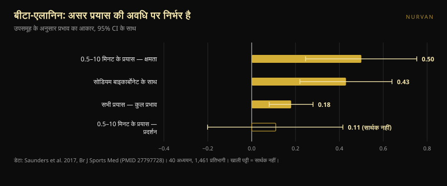
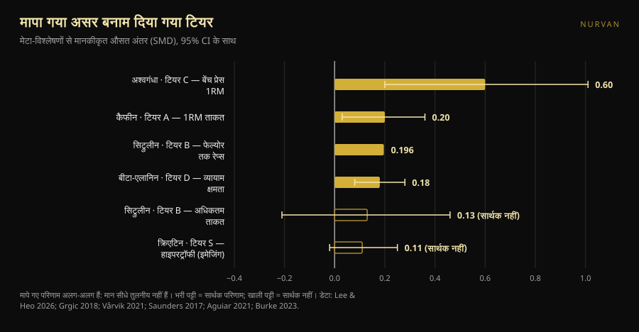

# स्ट्रेंथ सप्लीमेंट टियर लिस्ट: कौन-सी रैंकिंग टिकती है

लेखक: [Giammaria Loi](/autore/giammaria-loi) · 8 अक्तूबर 2026 को अपडेट किया गया

सप्लीमेंट की टियर लिस्ट सालों से घूम रही हैं: हर अक्षर के लिए एक पंक्ति, S से F तक, और दस सेकंड में सब समझ लेने का अहसास। हाल ही में एक अच्छी बनी हुई लिस्ट सामने आई — मानदंड खुलकर बताए गए और आख़िरी संदेश भी सही। हमने उस लिस्ट के हर सप्लीमेंट का मेटा-विश्लेषण निकाला और आँकड़ों को अक्षरों के बग़ल में रख दिया। दो जगहें टिकती नहीं, एक खुराक ग़लत है, और नीचे पड़ा एक सप्लीमेंट ऊपर आने का हक़दार है — पर तभी, जब आप एक ख़ास तरीक़े से ट्रेनिंग करते हों।

## संक्षेप में

- **लिस्ट ऊपर सही है और बीच में उलझ जाती है।** क्रिएटिन का शीर्ष पर होना निर्विवाद है, लेकिन उसका मापा गया असर भी छोटा है: इमेजिंग से की गई सीधी हाइपरट्रॉफी माप में संयुक्त अनुमान 0.11 है, और अंतराल शून्य को छू जाता है।
- **सिट्रुलीन अधिकतम ताकत नहीं बढ़ाता।** प्रशिक्षित लोगों पर हुए मेटा-विश्लेषण में 0.13 मिलता है, जो सार्थक नहीं है। वह जो करता है, और बहुत थोड़ा करता है, वह है एक सेशन के 51 रेप्स में लगभग 3 रेप्स जोड़ना।
- **टियर D का बीटा-एलानिन, टियर A के कैफीन जितना ही कुल असर रखता है।** 0.18 बनाम 0.20। फ़र्क़ यह है कि बीटा-एलानिन आधे मिनट से दस मिनट तक चलने वाले प्रयासों में काम करता है: एक मैक्स लिफ्ट में बेकार, 20 रेप्स के सेट या HYROX रेस में काम का।
- **पोस्ट में दी गई कैफीन की खुराक बहुत कम है।** ISSN का पोज़िशन स्टैंड लगातार असरदार दायरा शरीर के वज़न के प्रति किलो 3–6 मिग्रा बताता है, और कहता है कि न्यूनतम सीमा 2 मिग्रा/किग्रा *तक* गिर सकती है। 0.9 तक नहीं।
- **सबसे बड़ा असर दिखाने वाले सप्लीमेंट के पास सबसे कमज़ोर प्रमाण हैं।** अश्वगंधा बेंच प्रेस मैक्स पर 0.60 दिखाता है, पूरी लिस्ट का सबसे ऊँचा आँकड़ा, लेकिन प्रमाणों की निश्चितता कम है और नतीजा एक ही अध्ययन पर टिका है।

*दिए गए अक्षर और मापे गए असर के बीच का रिश्ता किसी भी रैंकिंग के सुझाव से कहीं कम सुव्यवस्थित है। फ़ोटो: Shixart1985, Wikimedia Commons, CC BY 2.0.*

## रैंकिंग ने क्या कहा

पोस्ट चार घोषित मानदंडों पर सप्लीमेंट आँकता है: क़ीमत और वैधता, मनुष्यों पर सिद्ध प्रभावशीलता, समझाने लायक़ क्रियाविधि, और अप्रत्यक्ष लाभ (जैसे नींद में सुधार)। जो पैमाना बनता है: क्रिएटिन मोनोहाइड्रेट **S** में; प्रोटीन पाउडर और कैफीन के साथ थियानिन **A** में; सिट्रुलीन **B** में; फिश ऑयल और अश्वगंधा **C** में; बीटा-एलानिन और नाइट्रेट **D** में; बीटेन, EAA और ज़्यादातर प्री-वर्कआउट **E** में; BCAA, एल-टायरोसिन, "टेस्टोस्टेरोन बूस्टर" और HMB **F** में।

आँकड़े देखने से पहले ही दो बातें सही हैं। पहली, मानदंड बताए गए हैं: बिना मानदंड की टियर लिस्ट डेटा के भेस में राय भर है। दूसरी, आख़िरी वाक्य पूरी रैंकिंग से ज़्यादा क़ीमती है: सप्लीमेंट पूरक हैं, वे विविध खानपान और नींद की जगह नहीं लेते।

दिक़्क़त यह है कि चार अलग मानदंड एक अक्षर में दबा दिए जाते हैं। वह अक्षर यह नहीं बताता कि कोई चीज़ ऊपर इसलिए है कि वह बहुत असर करती है, या इसलिए कि सस्ती है, या इसलिए कि नींद में मदद करती है। और जैसे ही आप जाँचते हैं कि हर एक असल में कितना काम करता है, क्रम बिखर जाता है।

## रिसर्च असल में क्या कहती है

### क्रिएटिन S में — **पुष्ट**, पर उम्मीदें नाप-तौल कर

क्रिएटिन खेल जगत का सबसे अधिक अध्ययन किया गया सप्लीमेंट है, और इंटरनेशनल सोसाइटी ऑफ़ स्पोर्ट्स न्यूट्रिशन का पोज़िशन स्टैंड इसे सुरक्षित और अच्छी तरह सहन होने वाला बताता है — स्वस्थ लोगों में पाँच साल तक रोज़ 30 ग्राम तक के आँकड़ों के साथ, और रोज़ाना क़रीब 3 ग्राम की उपयोगी नियमित मात्रा के साथ (Kreider et al., 2017)।

पर "सबसे ठोस" का मतलब "सबसे ताक़तवर" नहीं। सिर्फ़ सीधी हाइपरट्रॉफी माप — MRI, CT, अल्ट्रासाउंड — तक सीमित एक मेटा-विश्लेषण ने 10 अध्ययनों और 44 परिणामों में मानकीकृत पैमाने पर **0.11** का संयुक्त अनुमान पाया, विश्वसनीयता अंतराल −0.02 से 0.25, और मांसपेशी की मोटाई में **0.10–0.16 सेमी** की बढ़त (Burke et al., 2023)। यह छोटा, स्थिर, सस्ता और सुरक्षित असर है। इसीलिए यह S में है: इसलिए नहीं कि यह आपकी ट्रेनिंग बदल देगा, बल्कि इसलिए कि वह थोड़ा-सा फ़ायदा भरोसे से देने वाला यही अकेला है। सबसे ज़्यादा पूछे जाने वाले दो सवालों पर हमारे अलग लेख हैं: [क्रिएटिन और बाल झड़ना](/hi/blog/creatine-and-hair-fall) और [45 के बाद बिना ट्रेनिंग क्रिएटिन](/hi/blog/creatine-bina-vyayam-45-ke-baad)।

### प्रोटीन पाउडर A में — **स्पष्टीकरण चाहिए**

संदर्भ मेटा-विश्लेषण, 49 अध्ययन और 1,863 लोग, बताता है कि स्ट्रेंथ प्रोग्राम के दौरान प्रोटीन लेने से **1RM में 2.49 किग्रा** (95% CI 0.64–4.33) और **फैट-फ्री मास में 0.30 किग्रा** (0.09–0.52) जुड़ते हैं (Morton et al., 2018)।

वह ब्योरा जो सब बदल देता है: कुल सेवन **शरीर के वज़न के प्रति किलो प्रतिदिन 1.62 ग्राम प्रोटीन** से ऊपर जाने पर अतिरिक्त लाभ ख़त्म हो जाता है। पाउडर उस अर्थ में सप्लीमेंट नहीं है जिस अर्थ में क्रिएटिन है — यह सुविधाजनक रूप में भोजन है। अगर आप खाने से ही 1.6–1.8 ग्राम/किग्रा तक पहुँच रहे हैं, तो शेक जोड़ने से कुछ नहीं हिलेगा। अगर नहीं पहुँच रहे, तो शेक वहाँ पहुँचने का सबसे आसान रास्ता है। उसी काम में असर पहले से प्रशिक्षित लोगों में बड़ा है (+0.75 किग्रा फैट-फ्री मास, p = 0.03) और उम्र के साथ छोटा।

### कैफीन A में — **टियर सही, खुराक ग़लत**

कैफीन और ताकत: मानकीकृत पैमाने पर **0.20** (95% CI 0.03–0.36); पावर **0.17** (0.00–0.34)। उपसमूह विश्लेषण ध्यान देने लायक़ है: असर ऊपरी शरीर पर सार्थक है (**0.21**) और निचले शरीर पर नहीं (**0.15**) (Grgic et al., 2018)।

अटकने की जगह खुराक है। पोस्ट **शरीर के वज़न के प्रति किलो 0.9–2 मिग्रा** को न्यूनतम असरदार खुराक बताता है। ISSN का पोज़िशन स्टैंड कुछ और कहता है: कैफीन **3–6 मिग्रा/किग्रा** पर लगातार प्रदर्शन सुधारता है, न्यूनतम असरदार खुराक **अब भी स्पष्ट नहीं** है और **2 मिग्रा/किग्रा तक** हो सकती है, जबकि बहुत ऊँची खुराक (9 मिग्रा/किग्रा) बिना अतिरिक्त लाभ के दुष्प्रभाव लाती है (Guest et al., 2021)। 80 किग्रा के व्यक्ति के लिए यह फ़र्क़ काग़ज़ी नहीं है: पोस्ट 72–160 मिग्रा की ओर इशारा करता है, साहित्य 240–480 मिग्रा की। 0.9 मिग्रा/किग्रा की निचली सीमा का उस दस्तावेज़ में कोई आधार नहीं है।

स्लाइड में दिए **कैफीन:थियानिन 1:2** अनुपात पर: इसके पीछे का साहित्य ध्यान, मनोदशा और संज्ञानात्मक कार्य से जुड़ा है, ताकत या रेप्स से नहीं (Mancini et al., 2017)। ट्रेनिंग के संदर्भ में हम इसे **असत्यापनीय** मानते हैं — ग़लत नहीं, बस जिम में जो आपके लिए मायने रखता है उस पर कभी परखा नहीं गया।

### सिट्रुलीन B में — ताकत के लिए **ख़ारिज**

यहाँ रैंकिंग वह कहती है जो रिसर्च नहीं कहती। पोस्ट सिट्रुलीन को "ज़्यादा ताकत और पावर" का श्रेय देता है। प्रशिक्षित वयस्कों पर हुआ मेटा-विश्लेषण, 4 अध्ययन और 138 माप, अधिकतम ताकत पर **0.13** का असर पाता है, अंतराल −0.21 से 0.46: **कोई असर नहीं** (Aguiar और Casonatto, 2021)।

सिट्रुलीन जो करता है, वह कहीं और करता है। आठ अध्ययन और 137 प्रतिभागी, वर्कआउट से 40–60 मिनट पहले 6–8 ग्राम: प्रति एक्सरसाइज़ औसतन 51 ± 23 कुल रेप्स पर **+3 ± 5 रेप्स**, यानी **+6.4%**, प्रभाव आकार 0.196 (p = 0.022) (Vårvik et al., 2021)। और वहाँ भी उपसमूह विश्लेषण किनारे पर है: निचला शरीर p = 0.051, ऊपरी p = 0.131। रेप सहनशक्ति के लिए टियर B का बचाव हो सकता है। ताकत के लिए नहीं।

### बीटा-एलानिन D में — **स्पष्टीकरण चाहिए**, और यह आप पर निर्भर है

यही वह जगह है जो हमें सबसे कम जँचती है। सबसे बड़ा मेटा-विश्लेषण — 40 अध्ययन, 1,461 प्रतिभागी, 70 माप — कुल असर **0.18** पाता है (95% CI 0.08–0.28) (Saunders et al., 2017)। यह ताकत पर कैफीन के 0.20 के लगभग बराबर है, और उसी लिस्ट में कैफीन दो अक्षर ऊपर है।

असली फ़र्क़ असर की ताक़त में नहीं, बल्कि इसमें है कि वह **कहाँ** दिखता है। प्रयास की अवधि एक सार्थक मॉडरेटर है (p = 0.004): **30 सेकंड से 10 मिनट** की खिड़की में क्षमता पर असर बढ़कर **0.50** (0.246–0.753) हो जाता है, जबकि प्रदर्शन पर 0.11 ही रहता है और सार्थक नहीं। एक व्यावहारिक बात जो अक्सर छूट जाती है: **कुल ली गई मात्रा मॉडरेटर नहीं है** (p = 0.438), इसलिए ज़्यादा लोड करने से कुछ नहीं होता।

जिम की भाषा में: अगर आप बेंच और डेडलिफ्ट के भारी ट्रिपल लगाते हैं, तो बीटा-एलानिन का D में होना ठीक है। अगर आपका सेशन 15–25 रेप्स के सेट, सर्किट, स्लेज, HYROX या क्रॉसफिट है, तो आप सही सप्लीमेंट को ग़लत खाने में देख रहे हैं।

*बीटा-एलानिन का एक ही असर नहीं होता: हर तरह के प्रयास के लिए अलग असर होता है। डेटा: Saunders et al. 2017. चार्ट: Nurvan.*

### अश्वगंधा C में — **स्पष्टीकरण चाहिए**: बड़ा असर, कमज़ोर प्रमाण

2026 का एक मेटा-विश्लेषण, जो केवल संरचित रेज़िस्टेंस ट्रेनिंग वाले परीक्षणों तक सीमित है, पूरी लिस्ट का सबसे ऊँचा आँकड़ा देता है: बेंच प्रेस मैक्स पर **0.60** (0.20–1.01) और निचले शरीर पर **0.52** (0.19–0.86)। पर लेखक ख़ुद साफ़ कहते हैं: ज़्यादा सतर्क सांख्यिकीय सुधार लगाने पर ताकत के दोनों अनुमान **सार्थकता खो देते हैं**, हर एक किसी एक प्रभावशाली परीक्षण पर टिका है, और GRADE के अनुसार प्रमाणों की निश्चितता **कम** है। शरीर की चर्बी पर कोई असर नहीं (Lee और Heo, 2026)।

यह इसका आदर्श उदाहरण है कि एक नहीं, दो आँकड़े क्यों पढ़ने चाहिए: असर कितना बड़ा है, और उस पर कितना भरोसा किया जा सकता है। अश्वगंधा पहला जीतती है और दूसरा हार जाती है।

### HMB F में — **पुष्ट**

ग्यारह अध्ययन, शरीर संरचना के लिए 302 और ताकत के लिए 248 लोग, उम्र 18 से 45: HMB केवल **कुल शरीर भार** पर सार्थक असर देता है, और फैट-फ्री मास, फैट मास, कुल 1RM, बेंच प्रेस या निचले शरीर पर कोई नहीं (Jakubowski et al., 2020)। F अक्षर हक़ से मिला है।

*उद्धृत मेटा-विश्लेषणों में बताए गए प्रभाव आकार (मानकीकृत औसत अंतर), 95% विश्वास या विश्वसनीयता अंतराल के साथ। हर सप्लीमेंट के लिए मापा गया परिणाम अलग है और लेबल में दिया गया है: मान आपस में सीधे तुलनीय नहीं हैं, और ठीक इसीलिए एक अकेला अक्षर काफ़ी नहीं। चार्ट: Nurvan, लेख के अंत में दिए स्रोतों के आधार पर।*

## इसे कैसे लागू करें

1. **पहले बुनियाद।** पोस्ट यही कहता है और सही कहता है: कैलोरी, कुल प्रोटीन और नींद तालिका के किसी भी खाने से ज़्यादा भारी हैं। अगर आप छह घंटे सोते हैं, तो कोई अक्षर आपको नहीं बचाएगा।
2. **S से शुरू करें और वजह हो तभी नीचे जाएँ।** क्रिएटिन रोज़ 3–5 ग्राम, हर दिन, किसी ख़ास समय की ज़रूरत नहीं। यही वह अकेली ख़रीद है जिसे लगभग हर कोई सही ठहरा सकता है।
3. **पाउडर ख़रीदने से पहले अपना प्रोटीन गिनें।** अगर आप पहले ही रोज़ 1.6 ग्राम/किग्रा से ऊपर हैं, तो शेक सुविधा है, प्रदर्शन नहीं।
4. **कैफीन की खुराक रिसर्च से चुनें, पोस्ट से नहीं।** अध्ययन किया गया दायरा 3–6 मिग्रा/किग्रा है, लगभग 60 मिनट पहले। अगर आप संवेदनशील हैं तो कम से शुरू करें और नींद पर नज़र रखें: दो घंटे कम नींद देकर ख़रीदा गया बेहतर सेशन घाटे का सौदा है।
5. **लक्ष्य से चुनें, अक्षर से नहीं।** मैक्स और भारी ट्रिपल: क्रिएटिन, कैफीन, प्रोटीन। लंबे सेट, मेटकॉन, HYROX: बीटा-एलानिन ऊपर आता है, सिट्रुलीन सिर्फ़ रेप वॉल्यूम के लिए समझ में आता है।
6. **सप्लीमेंट को अपने ऊपर आँकड़ों के साथ परखें।** 0.18 का असर एक सेशन में नहीं दिखता। वह आठ हफ़्ते के दर्ज किए गए लोड में दिखता है — वही प्रोग्राम, वही लक्षित RIR।

> ### 💡 Nurvan के साथ
> **आप जो लेते हैं उसे दर्ज करें और देखें कि वाक़ई कुछ बदलता है या नहीं।** Nurvan के सप्लीमेंट सेक्शन में आप उत्पाद, खुराक और समय नोट करते हैं; ट्रेनिंग डायरी में हर सेशन के लोड, रेप्स और RIR बने रहते हैं। दोनों को मिलाकर देखने पर पता चलता है कि जिन आठ हफ़्तों में आपने कोई सप्लीमेंट जोड़ा, उनमें आपके आँकड़े सामान्य से ज़्यादा हिले या नहीं — बजाय इसके कि आप किसी के Instagram पर दिए अक्षर पर भरोसा करें। [Nurvan आज़माएँ](https://nurvan.app)

## अक्सर पूछे जाने वाले सवाल

**अगर ताकत के लिए सिर्फ़ एक सप्लीमेंट ख़रीदना हो तो कौन-सा?**
क्रिएटिन मोनोहाइड्रेट: यही अकेला है जिसमें सीधी माप पर छोटा पर स्थिर असर, लंबी अवधि का दर्ज सुरक्षा रिकॉर्ड और नाममात्र की लागत — तीनों हैं (Kreider et al., 2017; Burke et al., 2023)।

**क्या सिट्रुलीन मैक्स बढ़ाने में मदद करता है?**
नहीं। प्रशिक्षित एथलीटों पर हुए मेटा-विश्लेषण में अधिकतम ताकत पर कोई असर नहीं मिलता (0.13, सार्थक नहीं)। एकमात्र दर्ज लाभ फेल्योर तक के रेप्स में मामूली बढ़त है, लगभग 6% (Aguiar और Casonatto, 2021; Vårvik et al., 2021)।

**ट्रेनिंग से पहले कितना कैफीन?**
अध्ययनों में शरीर के वज़न के प्रति किलो 3–6 मिग्रा इस्तेमाल होता है, आम तौर पर क़रीब 60 मिनट पहले; बहुत ऊँची खुराक कोई अतिरिक्त लाभ नहीं देती और दुष्प्रभाव लाती है (Guest et al., 2021)। यह अध्ययन किया गया दायरा है, कोई नुस्ख़ा नहीं: जो दवा ले रहे हैं, गर्भवती हैं, या जिन्हें हृदय या नींद की समस्या है, वे पहले अपने डॉक्टर से बात करें।

**अगर मैं सिर्फ़ पावरलिफ्टिंग करता हूँ तो क्या बीटा-एलानिन काम का है?**
बहुत कम। असर 30 सेकंड से 10 मिनट के प्रयासों में केंद्रित है, और एक अकेला मैक्स उस खिड़की के बाहर है (Saunders et al., 2017)। अगर आप साथ में हाई-रेप काम या कंडीशनिंग भी करते हैं, तो जवाब बदल जाता है।

## यह भी पढ़ें

- [क्या क्रिएटिन से बाल झड़ते हैं? अध्ययन असल में क्या कहते हैं](/hi/blog/creatine-and-hair-fall)
- [45 के बाद बिना जिम क्रिएटिन: अध्ययन क्या कहता है](/hi/blog/creatine-bina-vyayam-45-ke-baad)

## स्रोत

1. Kreider RB, Kalman DS, Antonio J, et al., 2017. *International Society of Sports Nutrition position stand: safety and efficacy of creatine supplementation in exercise, sport, and medicine.* J Int Soc Sports Nutr 14:18. PMID 28615996 — [doi:10.1186/s12970-017-0173-z](https://doi.org/10.1186/s12970-017-0173-z)
2. Burke R, Piñero A, Coleman M, et al., 2023. *The Effects of Creatine Supplementation Combined with Resistance Training on Regional Measures of Muscle Hypertrophy: A Systematic Review with Meta-Analysis.* Nutrients 15(9):2116. PMID 37432300 — [doi:10.3390/nu15092116](https://doi.org/10.3390/nu15092116)
3. Morton RW, Murphy KT, McKellar SR, et al., 2018. *A systematic review, meta-analysis and meta-regression of the effect of protein supplementation on resistance training-induced gains in muscle mass and strength in healthy adults.* Br J Sports Med 52(6):376–384. PMID 28698222 — [doi:10.1136/bjsports-2017-097608](https://doi.org/10.1136/bjsports-2017-097608)
4. Grgic J, Trexler ET, Lazinica B, Pedisic Z, 2018. *Effects of caffeine intake on muscle strength and power: a systematic review and meta-analysis.* J Int Soc Sports Nutr 15:11. PMID 29527137 — [doi:10.1186/s12970-018-0216-0](https://doi.org/10.1186/s12970-018-0216-0)
5. Guest NS, VanDusseldorp TA, Nelson MT, et al., 2021. *International society of sports nutrition position stand: caffeine and exercise performance.* J Int Soc Sports Nutr 18(1):1. PMID 33388079 — [doi:10.1186/s12970-020-00383-4](https://doi.org/10.1186/s12970-020-00383-4)
6. Vårvik FT, Bjørnsen T, Gonzalez AM, 2021. *Acute Effect of Citrulline Malate on Repetition Performance During Strength Training: A Systematic Review and Meta-Analysis.* Int J Sport Nutr Exerc Metab 31(4):350–358. PMID 34010809 — [doi:10.1123/ijsnem.2020-0295](https://doi.org/10.1123/ijsnem.2020-0295)
7. Aguiar AF, Casonatto J, 2021. *Effects of Citrulline Malate Supplementation on Muscle Strength in Resistance-Trained Adults: A Systematic Review and Meta-Analysis of Randomized Controlled Trials.* J Diet Suppl 19(6):772–790. PMID 34176406 — [doi:10.1080/19390211.2021.1939473](https://doi.org/10.1080/19390211.2021.1939473)
8. Saunders B, Elliott-Sale K, Artioli GG, et al., 2017. *β-alanine supplementation to improve exercise capacity and performance: a systematic review and meta-analysis.* Br J Sports Med 51(8):658–669. PMID 27797728 — [doi:10.1136/bjsports-2016-096396](https://doi.org/10.1136/bjsports-2016-096396)
9. Jakubowski JS, Nunes EA, Teixeira FJ, et al., 2020. *Supplementation with the Leucine Metabolite β-hydroxy-β-methylbutyrate (HMB) does not Improve Resistance Exercise-Induced Changes in Body Composition or Strength in Young Subjects: A Systematic Review and Meta-Analysis.* Nutrients 12(5):1523. PMID 32456217 — [doi:10.3390/nu12051523](https://doi.org/10.3390/nu12051523)
10. Lee JC, Heo AS, 2026. *Adjunctive Ashwagandha Supplementation and Resistance-Training Adaptations in Healthy Adults: A Systematic Review and Random-Effects Meta-Analysis.* Nutrients 18(17):2815. PMID 42738987 — [doi:10.3390/nu18172815](https://doi.org/10.3390/nu18172815)
11. Mancini E, Beglinger C, Drewe J, et al., 2017. *Green tea effects on cognition, mood and human brain function: A systematic review.* Phytomedicine 34:26–37. PMID 28899506 — [doi:10.1016/j.phymed.2017.07.008](https://doi.org/10.1016/j.phymed.2017.07.008)

मेटाडेटा और सारांश PubMed से लिए गए। शुरुआती प्रेरणा: Reformance Training के लिए [Alfred Jong (@alfred.reformance)](https://www.instagram.com/p/Dd_qscdm4cy/) की पोस्ट। उस पोस्ट का कोई टेक्स्ट, चित्र या ढाँचा दोहराया नहीं गया: दावे निकाले गए, नए सिरे से लिखे गए और स्वतंत्र रूप से जाँचे गए।

---

**Giammaria Loi** Nurvan के संस्थापक हैं। वे 2012 से वेट ट्रेनिंग करते हैं, 2013 से FIPE प्रमाणित पर्सनल ट्रेनर और कोच के रूप में काम करते हैं, और 2018 से राष्ट्रीय स्तर पर पावरलिफ्टिंग में प्रतिस्पर्धा करते हैं। वे जिस भी लेख पर हस्ताक्षर करते हैं वह वैज्ञानिक अध्ययनों से शुरू होकर वहाँ पहुँचता है जो जिम में वाक़ई काम करता है।

> नोट: यह जानकारीपरक सामग्री है, जो किसी डॉक्टर या पेशेवर की राय का विकल्प नहीं है। उल्लिखित सप्लीमेंट दवाओं या बीमारियों के साथ प्रतिक्रिया कर सकते हैं: लेने से पहले अपने डॉक्टर से बात करें। अगर आप प्रतिस्पर्धा करते हैं, तो अपने फेडरेशन के एंटी-डोपिंग नियम ज़रूर जाँचें।
