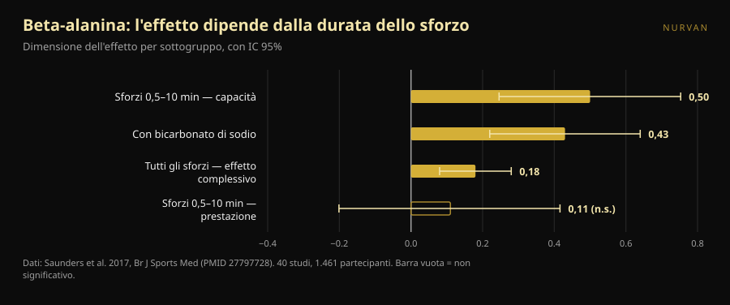
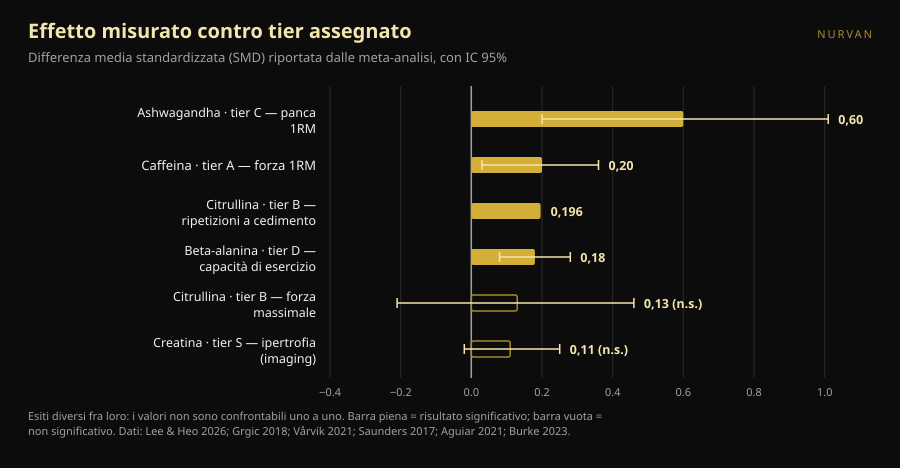

# Tier list degli integratori per la forza: cosa regge e cosa no

Di [Giammaria Loi](/autore/giammaria-loi) · aggiornato l'8 ottobre 2026

Le tier list degli integratori girano da anni: una riga per lettera, da S a F, e la sensazione di aver capito tutto in dieci secondi. Ne è passata una ben fatta, con criteri dichiarati e un messaggio finale corretto. Siamo andati a prendere le meta-analisi di ognuno di quegli integratori e abbiamo confrontato i numeri con le lettere. Due posizioni non reggono, una dose è sbagliata e un integratore in fondo alla classifica merita di risalire — ma solo se ti alleni in un certo modo.

## In breve

- **La tier list ha ragione in cima e si confonde nel mezzo.** La creatina al vertice è sacrosanta, ma anche il suo effetto misurato è piccolo: su misure dirette di ipertrofia la stima aggregata è 0,11 su scala standardizzata, con intervallo che tocca lo zero.
- **La citrullina non aumenta la forza massimale.** Una meta-analisi su atleti allenati trova un effetto di 0,13 non significativo. Quello che fa, e in misura modesta, è farti chiudere circa 3 ripetizioni in più su 51 totali di seduta.
- **La beta-alanina in tier D ha lo stesso effetto complessivo della caffeina in tier A.** 0,18 contro 0,20. La differenza è che la beta-alanina funziona negli sforzi da mezzo minuto a dieci minuti: inutile nel massimale, utile in una serie da 20 o in una gara HYROX.
- **La dose di caffeina indicata nel post è troppo bassa.** Il position stand ISSN parla di 3–6 mg per kg di peso come range costantemente efficace, e dice che la soglia minima potrebbe scendere *fino a* 2 mg/kg. Non a 0,9.
- **L'integratore con l'effetto più grande è anche quello con le prove più deboli.** L'ashwagandha mostra 0,60 sulla panca massimale, il numero più alto di tutta la lista, ma la certezza delle prove è bassa e il risultato dipende da un singolo studio.

*Il rapporto fra lettera assegnata e effetto misurato è meno lineare di quanto una classifica lasci pensare. Foto: Shixart1985, Wikimedia Commons, CC BY 2.0.*

## Cosa diceva la classifica

Il carosello valuta gli integratori su quattro criteri dichiarati: prezzo e legalità, efficacia provata sull'uomo, meccanismo spiegabile, benefici indiretti (per esempio sul sonno). Ne esce questa scala: creatina monoidrato in **S**; proteine in polvere e caffeina più teanina in **A**; citrullina in **B**; olio di pesce e ashwagandha in **C**; beta-alanina e nitrati in **D**; betaina, EAA e la maggior parte dei pre-workout in **E**; BCAA, l-tirosina, "testosterone booster" e HMB in **F**.

Due cose sono giuste prima ancora di guardare i dati. La prima è che i criteri sono dichiarati: una tier list senza criteri è un'opinione travestita da dato. La seconda è la frase finale, che vale più di tutta la classifica: gli integratori integrano, non sostituiscono una dieta varia e il sonno.

Il problema è che quattro criteri diversi vengono compressi in una sola lettera. Quella lettera non ti dice se l'integratore è messo in alto perché funziona molto, perché costa poco o perché aiuta a dormire. E quando vai a vedere quanto funziona davvero, l'ordine si scompone.

## Cosa dice davvero la ricerca

### Creatina in S — **Confermato**, con un ridimensionamento

La creatina è l'integratore più studiato dello sport e il position stand della International Society of Sports Nutrition la descrive come sicura e ben tollerata, con dati fino a 30 g al giorno per cinque anni in persone sane e un'assunzione abituale utile intorno ai 3 g al giorno (Kreider et al., 2017).

Ma "il più solido" non vuol dire "il più potente". Una meta-analisi che ha guardato solo misure dirette di ipertrofia — risonanza, TC, ecografia — su 10 studi e 44 esiti ha trovato una stima aggregata di **0,11** su scala standardizzata, con intervallo di credibilità da −0,02 a 0,25, e aumenti di spessore muscolare di **0,10–0,16 cm** (Burke et al., 2023). È un effetto piccolo, coerente, economico e sicuro. È per questo che sta in S: non perché trasformi il tuo allenamento, ma perché è l'unico che fa quel poco in modo affidabile.

### Proteine in polvere in A — **Da precisare**

La meta-analisi di riferimento, 49 studi e 1.863 persone, trova che integrare proteine durante un programma di forza aggiunge **2,49 kg all'1RM** (IC 95% 0,64–4,33) e **0,30 kg di massa magra** (0,09–0,52) (Morton et al., 2018).

Il dettaglio che cambia tutto: oltre **1,62 g di proteine per kg di peso al giorno** di apporto totale, il beneficio aggiuntivo si azzera. La polvere non è un integratore nel senso in cui lo è la creatina — è cibo in formato comodo. Se arrivi già a 1,6–1,8 g/kg mangiando, aggiungere uno shaker non sposta niente. Se non ci arrivi, lo shaker è il modo più semplice di arrivarci. Nello stesso lavoro l'effetto è più grande in chi è già allenato (+0,75 kg di massa magra, p = 0,03) e più piccolo con l'avanzare dell'età.

### Caffeina in A — **Confermato il tier, sbagliata la dose**

Caffeina e forza: **0,20** su scala standardizzata (IC 95% 0,03–0,36); potenza **0,17** (0,00–0,34). La sottoanalisi è interessante: l'effetto è significativo sulla parte alta del corpo (**0,21**) e non su quella bassa (**0,15**, non significativo) (Grgic et al., 2018).

Il punto critico è la dose. Il carosello indica **0,9–2 mg per kg di peso** come dose minima efficace. Il position stand ISSN dice un'altra cosa: la caffeina migliora la prestazione in modo coerente a **3–6 mg/kg**, la dose minima efficace **resta poco chiara** e **potrebbe arrivare fino a** 2 mg/kg, mentre dosi molto alte (9 mg/kg) portano effetti collaterali senza vantaggi (Guest et al., 2021). Per una persona di 80 kg la differenza non è teorica: il post suggerisce 72–160 mg, la letteratura 240–480 mg. Il limite inferiore di 0,9 mg/kg non ha supporto in quel documento.

Sul rapporto **caffeina:teanina 1:2** indicato nelle slide: la letteratura che lo sostiene riguarda attenzione, umore e funzione cognitiva, non forza o ripetizioni (Mancini et al., 2017). Lo classifichiamo come **non verificabile** per l'allenamento: non è sbagliato, semplicemente non è stato testato su quello che ti interessa in palestra.

### Citrullina in B — **Smentito** per la forza

Qui la classifica dice una cosa che la ricerca non dice. Il carosello attribuisce alla citrullina "più forza e potenza". Una meta-analisi su adulti allenati, 4 studi e 138 misurazioni, trova un effetto sulla forza massimale di **0,13** con intervallo da −0,21 a 0,46: **nessun effetto** (Aguiar & Casonatto, 2021).

Quello che la citrullina fa, lo fa altrove. Otto studi e 137 partecipanti, con 6–8 g assunti 40–60 minuti prima: **+3 ± 5 ripetizioni** su una media di 51 ± 23 ripetizioni totali per esercizio, cioè **+6,4%**, effetto 0,196 (p = 0,022) (Vårvik et al., 2021). E anche lì la sottoanalisi è sul filo: arti inferiori p = 0,051, arti superiori p = 0,131. Tier B per la resistenza alle ripetizioni è difendibile. Tier B per la forza, no.

### Beta-alanina in D — **Da precisare**, e dipende da te

Questa è la posizione che ci convince meno. La meta-analisi più ampia — 40 studi, 1.461 partecipanti, 70 misure di esercizio — trova un effetto complessivo di **0,18** (IC 95% 0,08–0,28) (Saunders et al., 2017). È praticamente lo stesso numero della caffeina sulla forza (0,20), che nella stessa classifica sta due lettere più in alto.

La differenza vera non è la potenza dell'effetto, è **dove** si manifesta. La durata dello sforzo è un moderatore significativo (p = 0,004): nella finestra fra **30 secondi e 10 minuti** l'effetto sulla capacità di esercizio sale a **0,50** (0,246–0,753), mentre sulla prestazione resta 0,11 e non significativo. Un dato pratico spesso ignorato: la **quantità totale ingerita non è un moderatore** (p = 0,438), quindi caricare di più non serve.

Tradotto in palestra: se fai triple pesanti di panca e stacco, la beta-alanina in D ci sta. Se la tua seduta è fatta di serie da 15–25 ripetizioni, circuiti, prowler, HYROX o CrossFit, stai guardando l'integratore sbagliato nella casella sbagliata.

*La beta-alanina non ha un solo effetto: ne ha uno diverso per ogni tipo di sforzo. Dati: Saunders et al. 2017. Grafico Nurvan.*

### Ashwagandha in C — **Da precisare**: effetto grande, prove fragili

Una meta-analisi del 2026 limitata a studi con allenamento strutturato trova il numero più alto di tutta la lista: **0,60** sulla panca massimale (0,20–1,01) e **0,52** sugli arti inferiori (0,19–0,86). Ma gli autori stessi sono netti: con una correzione statistica più prudente entrambe le stime **perdono significatività**, ognuna dipende da un singolo studio influente, e la certezza delle prove secondo GRADE è **bassa**. Sulla massa grassa non c'è effetto (Lee & Heo, 2026).

È l'esempio perfetto di perché serve guardare due numeri e non uno: l'ampiezza dell'effetto e quanto ci si può credere. L'ashwagandha vince sul primo e perde sul secondo.

### HMB in F — **Confermato**

Undici studi, 302 persone per la composizione corporea e 248 per la forza, fra i 18 e i 45 anni: l'HMB produce un effetto significativo **solo sulla massa corporea totale** e nessun effetto su massa magra, massa grassa, 1RM totale, panca o arti inferiori (Jakubowski et al., 2020). La F è meritata.

*Dimensioni dell'effetto (differenza media standardizzata) riportate dalle meta-analisi citate, con intervallo di confidenza o credibilità al 95%. L'esito misurato è diverso per ogni integratore ed è indicato nell'etichetta: i valori non sono confrontabili uno a uno, ed è esattamente il motivo per cui una singola lettera non basta. Grafico Nurvan sui dati delle fonti in fondo all'articolo.*

## Come applicarlo

1. **Prima le fondamenta.** Il post lo dice e ha ragione: calorie, proteine totali e sonno pesano più di qualsiasi casella della tabella. Se dormi sei ore, nessuna lettera ti salva.
2. **Parti dalla S e scendi solo se hai un motivo.** Creatina 3–5 g al giorno, tutti i giorni, nessun orario particolare. È l'unico acquisto che quasi tutti possono giustificare.
3. **Conta le proteine prima di comprare la polvere.** Se sei già sopra 1,6 g/kg al giorno, lo shaker è comodità, non prestazione.
4. **Scegli la caffeina sulla dose vera, non sul numero del carosello.** Il range studiato è 3–6 mg/kg, circa 60 minuti prima. Se sei sensibile, parti dal basso e guarda il sonno: una seduta migliore pagata con due ore di sonno in meno è un cattivo affare.
5. **Scegli per obiettivo, non per lettera.** Massimali e triple pesanti: creatina, caffeina, proteine. Serie lunghe, metcon, HYROX: la beta-alanina sale, la citrullina ha senso solo sul volume di ripetizioni.
6. **Metti alla prova l'integratore su di te, con i numeri.** Un effetto di 0,18 non si vede in una seduta. Si vede su otto settimane di carichi registrati, con lo stesso programma e lo stesso RIR di riferimento.

> ### 💡 Con Nurvan
> **Registra quello che prendi e guarda se cambia davvero qualcosa.** Nella sezione integrazione di Nurvan annoti prodotto, dose e orario; nel diario di allenamento restano carichi, ripetizioni e RIR seduta per seduta. Incrociando le due cose vedi se nelle otto settimane in cui hai aggiunto un integratore i tuoi numeri si sono mossi più del solito — invece di affidarti alla lettera che qualcuno ha assegnato su Instagram. [Prova Nurvan](https://nurvan.app)

## Domande frequenti

**Qual è l'unico integratore che vale la pena comprare per la forza?**
Se ne devi scegliere uno solo, la creatina monoidrato: è l'unico con effetto piccolo ma coerente su misure dirette, un profilo di sicurezza documentato a lungo termine e un costo irrisorio (Kreider et al., 2017; Burke et al., 2023).

**La citrullina serve per aumentare il massimale?**
No. La meta-analisi su atleti allenati non trova effetti sulla forza massimale (0,13, non significativo). L'unico beneficio documentato è un aumento modesto delle ripetizioni a cedimento, circa il 6% (Aguiar & Casonatto, 2021; Vårvik et al., 2021).

**Quanta caffeina prendere prima di allenarsi?**
Gli studi usano 3–6 mg per kg di peso corporeo, in genere circa 60 minuti prima; dosi molto alte non aggiungono benefici e portano effetti collaterali (Guest et al., 2021). È una fascia di dosaggio studiata, non una prescrizione: chi assume farmaci, è in gravidanza o ha problemi cardiaci o di sonno ne parla prima con il proprio medico.

**La beta-alanina serve se faccio solo powerlifting?**
Poco. L'effetto si concentra negli sforzi fra 30 secondi e 10 minuti; un singolo massimale sta fuori da quella finestra (Saunders et al., 2017). Se invece fai anche lavoro ad alte ripetizioni o condizionamento, il discorso cambia.

## Leggi anche

- [Creatina e caduta dei capelli: cosa dice davvero lo studio](/blog/creatina-caduta-capelli)
- [Creatina senza allenamento dopo i 45 anni: ha senso?](/blog/creatina-senza-allenamento-over-45)
- [Come leggere l'etichetta di un integratore e non farsi fregare](/blog/vitastrong-vitamins-week-codice-nurvan)

## Fonti

1. Kreider RB, Kalman DS, Antonio J, et al., 2017. *International Society of Sports Nutrition position stand: safety and efficacy of creatine supplementation in exercise, sport, and medicine.* J Int Soc Sports Nutr 14:18. PMID 28615996 — [doi:10.1186/s12970-017-0173-z](https://doi.org/10.1186/s12970-017-0173-z)
2. Burke R, Piñero A, Coleman M, et al., 2023. *The Effects of Creatine Supplementation Combined with Resistance Training on Regional Measures of Muscle Hypertrophy: A Systematic Review with Meta-Analysis.* Nutrients 15(9):2116. PMID 37432300 — [doi:10.3390/nu15092116](https://doi.org/10.3390/nu15092116)
3. Morton RW, Murphy KT, McKellar SR, et al., 2018. *A systematic review, meta-analysis and meta-regression of the effect of protein supplementation on resistance training-induced gains in muscle mass and strength in healthy adults.* Br J Sports Med 52(6):376–384. PMID 28698222 — [doi:10.1136/bjsports-2017-097608](https://doi.org/10.1136/bjsports-2017-097608)
4. Grgic J, Trexler ET, Lazinica B, Pedisic Z, 2018. *Effects of caffeine intake on muscle strength and power: a systematic review and meta-analysis.* J Int Soc Sports Nutr 15:11. PMID 29527137 — [doi:10.1186/s12970-018-0216-0](https://doi.org/10.1186/s12970-018-0216-0)
5. Guest NS, VanDusseldorp TA, Nelson MT, et al., 2021. *International society of sports nutrition position stand: caffeine and exercise performance.* J Int Soc Sports Nutr 18(1):1. PMID 33388079 — [doi:10.1186/s12970-020-00383-4](https://doi.org/10.1186/s12970-020-00383-4)
6. Vårvik FT, Bjørnsen T, Gonzalez AM, 2021. *Acute Effect of Citrulline Malate on Repetition Performance During Strength Training: A Systematic Review and Meta-Analysis.* Int J Sport Nutr Exerc Metab 31(4):350–358. PMID 34010809 — [doi:10.1123/ijsnem.2020-0295](https://doi.org/10.1123/ijsnem.2020-0295)
7. Aguiar AF, Casonatto J, 2021. *Effects of Citrulline Malate Supplementation on Muscle Strength in Resistance-Trained Adults: A Systematic Review and Meta-Analysis of Randomized Controlled Trials.* J Diet Suppl 19(6):772–790. PMID 34176406 — [doi:10.1080/19390211.2021.1939473](https://doi.org/10.1080/19390211.2021.1939473)
8. Saunders B, Elliott-Sale K, Artioli GG, et al., 2017. *β-alanine supplementation to improve exercise capacity and performance: a systematic review and meta-analysis.* Br J Sports Med 51(8):658–669. PMID 27797728 — [doi:10.1136/bjsports-2016-096396](https://doi.org/10.1136/bjsports-2016-096396)
9. Jakubowski JS, Nunes EA, Teixeira FJ, et al., 2020. *Supplementation with the Leucine Metabolite β-hydroxy-β-methylbutyrate (HMB) does not Improve Resistance Exercise-Induced Changes in Body Composition or Strength in Young Subjects: A Systematic Review and Meta-Analysis.* Nutrients 12(5):1523. PMID 32456217 — [doi:10.3390/nu12051523](https://doi.org/10.3390/nu12051523)
10. Lee JC, Heo AS, 2026. *Adjunctive Ashwagandha Supplementation and Resistance-Training Adaptations in Healthy Adults: A Systematic Review and Random-Effects Meta-Analysis.* Nutrients 18(17):2815. PMID 42738987 — [doi:10.3390/nu18172815](https://doi.org/10.3390/nu18172815)
11. Mancini E, Beglinger C, Drewe J, et al., 2017. *Green tea effects on cognition, mood and human brain function: A systematic review.* Phytomedicine 34:26–37. PMID 28899506 — [doi:10.1016/j.phymed.2017.07.008](https://doi.org/10.1016/j.phymed.2017.07.008)

Metadati e abstract recuperati da PubMed. Spunto iniziale: carosello di [Alfred Jong (@alfred.reformance)](https://www.instagram.com/p/Dd_qscdm4cy/) per Reformance Training. Nessun testo, immagine o struttura del post è stato riprodotto: le affermazioni sono state estratte, riscritte e verificate in modo indipendente.

---

**Giammaria Loi** è il fondatore di Nurvan. Si allena con i pesi dal 2012, lavora come personal trainer e coach certificato FIPE dal 2013 e gareggia nel powerlifting a livello nazionale dal 2018. Ogni articolo che firma parte dagli studi scientifici e arriva a ciò che funziona davvero in palestra.

> Nota: contenuto informativo, non sostituisce il parere di un medico o professionista. Gli integratori citati possono interagire con farmaci o condizioni cliniche: prima di assumerli, parlane con il tuo medico. Se gareggi, verifica sempre il regolamento antidoping della tua federazione.
