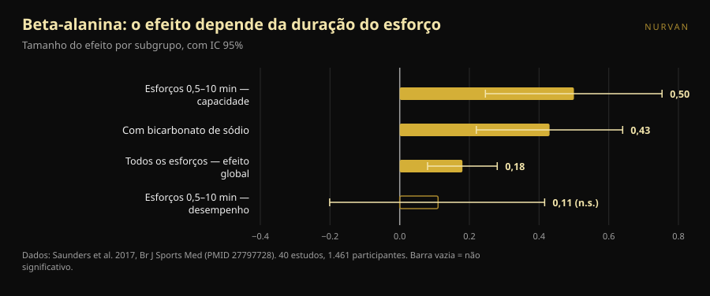
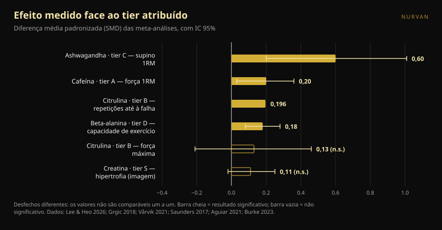

# Tier list de suplementos para força: que posições se aguentam

Por [Giammaria Loi](/autore/giammaria-loi) · atualizado a 8 de outubro de 2026

As tier lists de suplementos circulam há anos: uma linha por letra, de S a F, e a sensação de ter percebido tudo em dez segundos. Passou agora uma bem feita, com critérios declarados e uma mensagem final correta. Fomos buscar a meta-análise de cada suplemento dessa lista e pusemos os números ao lado das letras. Duas posições não se aguentam, uma dose está errada e um suplemento do fundo merece subir — mas só se treinares de certa maneira.

## Em resumo

- **A lista acerta no topo e baralha-se no meio.** A creatina no cimo é indiscutível, mas até o seu efeito medido é pequeno: em medidas diretas de hipertrofia a estimativa agregada é 0,11, com um intervalo que toca o zero.
- **A citrulina não aumenta a força máxima.** Uma meta-análise em treinados encontra 0,13, não significativo. O que faz, de forma modesta, é acrescentar cerca de 3 repetições às 51 de uma sessão.
- **A beta-alanina no tier D tem o mesmo efeito global da cafeína no tier A.** 0,18 contra 0,20. A diferença é que a beta-alanina funciona em esforços de meio minuto a dez minutos: inútil num máximo, útil numa série de 20 ou numa prova HYROX.
- **A dose de cafeína do post é demasiado baixa.** O position stand da ISSN coloca o intervalo consistentemente eficaz em 3–6 mg por kg de peso e diz que o limiar mínimo pode descer *até* 2 mg/kg. Não até 0,9.
- **O suplemento com o maior efeito é o que tem a evidência mais fraca.** A ashwagandha mostra 0,60 no supino máximo, o valor mais alto de toda a lista, mas a certeza da evidência é baixa e o resultado depende de um único estudo.

*A relação entre a letra atribuída e o efeito medido é menos arrumada do que qualquer ranking sugere. Foto: Shixart1985, Wikimedia Commons, CC BY 2.0.*

## O que dizia a classificação

O carrossel avalia os suplementos com quatro critérios declarados: preço e legalidade, eficácia provada em humanos, mecanismo explicável e benefícios indiretos (o sono, por exemplo). A escala resultante: creatina monohidratada em **S**; proteína em pó e cafeína com teanina em **A**; citrulina em **B**; óleo de peixe e ashwagandha em **C**; beta-alanina e nitratos em **D**; betaína, EAA e a maioria dos pré-treinos em **E**; BCAA, l-tirosina, "boosters de testosterona" e HMB em **F**.

Duas coisas estão certas antes sequer de olhar para os dados. A primeira: os critérios estão declarados — uma tier list sem critérios é uma opinião disfarçada de dado. A segunda: a frase final vale mais do que toda a classificação — os suplementos complementam, não substituem uma alimentação variada nem o sono.

O problema é que quatro critérios diferentes são comprimidos numa única letra. Essa letra não diz se algo está em cima porque funciona muito, porque custa pouco ou porque ajuda a dormir. E quando se verifica quanto cada um funciona de facto, a ordem desfaz-se.

## O que diz realmente a investigação

### Creatina em S — **Confirmado**, com um ajuste de escala

A creatina é o suplemento mais estudado do desporto e o position stand da International Society of Sports Nutrition descreve-a como segura e bem tolerada, com dados até 30 g por dia durante cinco anos em pessoas saudáveis e um consumo habitual útil na ordem dos 3 g diários (Kreider et al., 2017).

Mas "o mais sólido" não é "o mais potente". Uma meta-análise limitada a medidas diretas de hipertrofia — ressonância, TC, ecografia — em 10 estudos e 44 desfechos encontrou uma estimativa agregada de **0,11** em escala padronizada, intervalo de credibilidade de −0,02 a 0,25, e aumentos de espessura muscular de **0,10–0,16 cm** (Burke et al., 2023). É um efeito pequeno, consistente, barato e seguro. É por isso que está em S: não porque transforme o teu treino, mas porque é o único que faz esse pouco de forma fiável. Sobre as duas dúvidas mais repetidas temos artigos dedicados: a [creatina e a queda de cabelo](/pt/blog/creatina-queda-cabelo) e a [creatina sem treino depois dos 45](/pt/blog/creatina-sem-treino-depois-dos-45).

### Proteína em pó em A — **A precisar**

A meta-análise de referência, 49 estudos e 1.863 pessoas, mostra que suplementar proteína durante um programa de força acrescenta **2,49 kg ao 1RM** (IC 95% 0,64–4,33) e **0,30 kg de massa isenta de gordura** (0,09–0,52) (Morton et al., 2018).

O detalhe que muda tudo: acima de **1,62 g de proteína por kg de peso por dia** de ingestão total, o benefício adicional desaparece. O pó não é um suplemento no sentido em que a creatina é — é comida em formato prático. Se já chegas a 1,6–1,8 g/kg a comer, juntar um batido não move nada. Se não chegas, o batido é a maneira mais simples de lá chegar. No mesmo trabalho o efeito é maior em quem já está treinado (+0,75 kg de massa isenta de gordura, p = 0,03) e menor com a idade.

### Cafeína em A — **Tier confirmado, dose errada**

Cafeína e força: **0,20** em escala padronizada (IC 95% 0,03–0,36); potência **0,17** (0,00–0,34). A subanálise vale a pena: o efeito é significativo no trem superior (**0,21**) e não no inferior (**0,15**, não significativo) (Grgic et al., 2018).

O ponto crítico é a dose. O carrossel indica **0,9–2 mg por kg de peso** como dose mínima eficaz. O position stand da ISSN diz outra coisa: a cafeína melhora o desempenho de forma consistente a **3–6 mg/kg**, a dose mínima eficaz **continua pouco clara** e **pode descer até** 2 mg/kg, enquanto doses muito altas (9 mg/kg) trazem efeitos adversos sem vantagem (Guest et al., 2021). Para alguém de 80 kg a diferença não é teórica: o post sugere 72–160 mg, a literatura 240–480 mg. O piso de 0,9 mg/kg não tem apoio nesse documento.

Sobre a proporção **cafeína:teanina 1:2** dos slides: a literatura que a sustenta trata de atenção, humor e função cognitiva, não de força nem de repetições (Mancini et al., 2017). Classificamo-la como **não verificável** para o treino: não é falsa, apenas nunca foi testada naquilo que te interessa no ginásio.

### Citrulina em B — **Desmentido** para a força

Aqui a classificação afirma algo que a investigação não diz. O carrossel atribui à citrulina "mais força e potência". Uma meta-análise em adultos treinados, 4 estudos e 138 medições, encontra um efeito na força máxima de **0,13** com intervalo de −0,21 a 0,46: **nenhum efeito** (Aguiar e Casonatto, 2021).

O que a citrulina faz, fá-lo noutro sítio. Oito estudos e 137 participantes, com 6–8 g tomados 40–60 minutos antes: **+3 ± 5 repetições** numa média de 51 ± 23 repetições totais por exercício, ou seja **+6,4%**, tamanho de efeito 0,196 (p = 0,022) (Vårvik et al., 2021). E mesmo aí a subanálise está no fio: trem inferior p = 0,051, superior p = 0,131. Tier B para resistência às repetições é defensável. Tier B para força, não.

### Beta-alanina em D — **A precisar**, e depende de ti

É a posição que menos nos convence. A maior meta-análise — 40 estudos, 1.461 participantes, 70 medidas — encontra um efeito global de **0,18** (IC 95% 0,08–0,28) (Saunders et al., 2017). É praticamente o mesmo número da cafeína na força (0,20), que na mesma lista está duas letras acima.

A diferença real não é a dimensão do efeito, é **onde** ele aparece. A duração do esforço é um moderador significativo (p = 0,004): na janela entre **30 segundos e 10 minutos** o efeito sobre a capacidade sobe para **0,50** (0,246–0,753), enquanto sobre o desempenho fica em 0,11 e não significativo. Um detalhe prático que costuma escapar: a **quantidade total ingerida não é um moderador** (p = 0,438), por isso carregar mais não serve.

Traduzido para o ginásio: se fazes triplos pesados de supino e peso morto, a beta-alanina em D está bem. Se a tua sessão são séries de 15–25, circuitos, trenó, HYROX ou CrossFit, estás a olhar para o suplemento certo na casa errada.

*A beta-alanina não tem um só efeito: tem um diferente para cada tipo de esforço. Dados: Saunders et al. 2017. Gráfico Nurvan.*

### Ashwagandha em C — **A precisar**: efeito grande, evidência frágil

Uma meta-análise de 2026 limitada a ensaios com treino estruturado encontra o valor mais alto de toda a lista: **0,60** no supino máximo (0,20–1,01) e **0,52** no trem inferior (0,19–0,86). Mas os próprios autores são diretos: com uma correção estatística mais prudente ambas as estimativas de força **perdem significância**, cada uma depende de um único estudo influente e a certeza GRADE da evidência é **baixa**. Sobre a massa gorda não há efeito (Lee e Heo, 2026).

É o exemplo perfeito de por que se leem dois números e não um: quanto é o efeito e quanto se pode acreditar nele. A ashwagandha ganha no primeiro e perde no segundo.

### HMB em F — **Confirmado**

Onze estudos, 302 pessoas para composição corporal e 248 para força, dos 18 aos 45 anos: o HMB produz efeito significativo **apenas sobre o peso corporal total** e nenhum sobre massa isenta de gordura, massa gorda, 1RM total, supino ou trem inferior (Jakubowski et al., 2020). O F é merecido.

*Tamanhos de efeito (diferença média padronizada) reportados pelas meta-análises citadas, com intervalo de confiança ou credibilidade a 95%. O desfecho medido difere em cada suplemento e está na etiqueta: os valores não são comparáveis um a um, e é precisamente por isso que uma única letra não chega. Gráfico Nurvan com os dados das fontes no fim.*

## Como aplicar

1. **Primeiro as fundações.** O post di-lo e tem razão: calorias, proteína total e sono pesam mais do que qualquer casa da tabela. Se dormes seis horas, nenhuma letra te salva.
2. **Começa no S e desce só com motivo.** Creatina 3–5 g por dia, todos os dias, sem horário especial. É a única compra que quase toda a gente pode justificar.
3. **Conta a tua proteína antes de comprar pó.** Se já passas de 1,6 g/kg por dia, o batido é conveniência, não desempenho.
4. **Escolhe a dose de cafeína pela investigação, não pelo carrossel.** O intervalo estudado é 3–6 mg/kg, cerca de 60 minutos antes. Se és sensível, começa baixo e vigia o sono: uma sessão melhor paga com duas horas de sono a menos é mau negócio.
5. **Escolhe por objetivo, não por letra.** Máximos e triplos pesados: creatina, cafeína, proteína. Séries longas, metcon, HYROX: a beta-alanina sobe, a citrulina só faz sentido para o volume de repetições.
6. **Testa o suplemento em ti, com números.** Um efeito de 0,18 não se vê numa sessão. Vê-se em oito semanas de cargas registadas, com o mesmo programa e o mesmo RIR de referência.

> ### 💡 Com a Nurvan
> **Regista o que tomas e vê se muda mesmo alguma coisa.** Na secção de suplementação da Nurvan anotas produto, dose e horário; no diário de treino ficam cargas, repetições e RIR sessão a sessão. Cruzando as duas coisas percebes se, nas oito semanas em que acrescentaste um suplemento, os teus números se mexeram mais do que o habitual — em vez de confiares na letra que alguém atribuiu no Instagram. [Experimenta a Nurvan](https://nurvan.app)

## Perguntas frequentes

**Se só comprar um suplemento para a força, qual?**
Creatina monohidratada: é o único com efeito pequeno mas consistente em medidas diretas, um perfil de segurança documentado a longo prazo e um custo irrisório (Kreider et al., 2017; Burke et al., 2023).

**A citrulina serve para subir o máximo?**
Não. A meta-análise em atletas treinados não encontra efeitos na força máxima (0,13, não significativo). O único benefício documentado é um aumento modesto das repetições até à falha, cerca de 6% (Aguiar e Casonatto, 2021; Vårvik et al., 2021).

**Quanta cafeína antes de treinar?**
Os estudos usam 3–6 mg por kg de peso corporal, normalmente cerca de 60 minutos antes; doses muito altas não acrescentam benefício e trazem efeitos adversos (Guest et al., 2021). É um intervalo estudado, não uma prescrição: quem toma medicação, está grávida ou tem problemas cardíacos ou de sono deve falar antes com o seu médico.

**A beta-alanina vale a pena se só faço powerlifting?**
Pouco. O efeito concentra-se em esforços entre 30 segundos e 10 minutos, e um máximo fica fora dessa janela (Saunders et al., 2017). Se também fazes trabalho de altas repetições ou condicionamento, a resposta muda.

## Lê também

- [Creatina faz cair o cabelo? O que os estudos realmente dizem](/pt/blog/creatina-queda-cabelo)
- [Creatina sem treino depois dos 45: o que diz o estudo](/pt/blog/creatina-sem-treino-depois-dos-45)

## Fontes

1. Kreider RB, Kalman DS, Antonio J, et al., 2017. *International Society of Sports Nutrition position stand: safety and efficacy of creatine supplementation in exercise, sport, and medicine.* J Int Soc Sports Nutr 14:18. PMID 28615996 — [doi:10.1186/s12970-017-0173-z](https://doi.org/10.1186/s12970-017-0173-z)
2. Burke R, Piñero A, Coleman M, et al., 2023. *The Effects of Creatine Supplementation Combined with Resistance Training on Regional Measures of Muscle Hypertrophy: A Systematic Review with Meta-Analysis.* Nutrients 15(9):2116. PMID 37432300 — [doi:10.3390/nu15092116](https://doi.org/10.3390/nu15092116)
3. Morton RW, Murphy KT, McKellar SR, et al., 2018. *A systematic review, meta-analysis and meta-regression of the effect of protein supplementation on resistance training-induced gains in muscle mass and strength in healthy adults.* Br J Sports Med 52(6):376–384. PMID 28698222 — [doi:10.1136/bjsports-2017-097608](https://doi.org/10.1136/bjsports-2017-097608)
4. Grgic J, Trexler ET, Lazinica B, Pedisic Z, 2018. *Effects of caffeine intake on muscle strength and power: a systematic review and meta-analysis.* J Int Soc Sports Nutr 15:11. PMID 29527137 — [doi:10.1186/s12970-018-0216-0](https://doi.org/10.1186/s12970-018-0216-0)
5. Guest NS, VanDusseldorp TA, Nelson MT, et al., 2021. *International society of sports nutrition position stand: caffeine and exercise performance.* J Int Soc Sports Nutr 18(1):1. PMID 33388079 — [doi:10.1186/s12970-020-00383-4](https://doi.org/10.1186/s12970-020-00383-4)
6. Vårvik FT, Bjørnsen T, Gonzalez AM, 2021. *Acute Effect of Citrulline Malate on Repetition Performance During Strength Training: A Systematic Review and Meta-Analysis.* Int J Sport Nutr Exerc Metab 31(4):350–358. PMID 34010809 — [doi:10.1123/ijsnem.2020-0295](https://doi.org/10.1123/ijsnem.2020-0295)
7. Aguiar AF, Casonatto J, 2021. *Effects of Citrulline Malate Supplementation on Muscle Strength in Resistance-Trained Adults: A Systematic Review and Meta-Analysis of Randomized Controlled Trials.* J Diet Suppl 19(6):772–790. PMID 34176406 — [doi:10.1080/19390211.2021.1939473](https://doi.org/10.1080/19390211.2021.1939473)
8. Saunders B, Elliott-Sale K, Artioli GG, et al., 2017. *β-alanine supplementation to improve exercise capacity and performance: a systematic review and meta-analysis.* Br J Sports Med 51(8):658–669. PMID 27797728 — [doi:10.1136/bjsports-2016-096396](https://doi.org/10.1136/bjsports-2016-096396)
9. Jakubowski JS, Nunes EA, Teixeira FJ, et al., 2020. *Supplementation with the Leucine Metabolite β-hydroxy-β-methylbutyrate (HMB) does not Improve Resistance Exercise-Induced Changes in Body Composition or Strength in Young Subjects: A Systematic Review and Meta-Analysis.* Nutrients 12(5):1523. PMID 32456217 — [doi:10.3390/nu12051523](https://doi.org/10.3390/nu12051523)
10. Lee JC, Heo AS, 2026. *Adjunctive Ashwagandha Supplementation and Resistance-Training Adaptations in Healthy Adults: A Systematic Review and Random-Effects Meta-Analysis.* Nutrients 18(17):2815. PMID 42738987 — [doi:10.3390/nu18172815](https://doi.org/10.3390/nu18172815)
11. Mancini E, Beglinger C, Drewe J, et al., 2017. *Green tea effects on cognition, mood and human brain function: A systematic review.* Phytomedicine 34:26–37. PMID 28899506 — [doi:10.1016/j.phymed.2017.07.008](https://doi.org/10.1016/j.phymed.2017.07.008)

Metadados e resumos obtidos no PubMed. Ponto de partida: carrossel de [Alfred Jong (@alfred.reformance)](https://www.instagram.com/p/Dd_qscdm4cy/) para a Reformance Training. Nenhum texto, imagem ou estrutura do post foi reproduzido: as afirmações foram extraídas, reescritas e verificadas de forma independente.

---

**Giammaria Loi** é o fundador da Nurvan. Treina com pesos desde 2012, trabalha como personal trainer e coach certificado FIPE desde 2013 e compete em powerlifting a nível nacional desde 2018. Cada artigo que assina parte dos estudos científicos e chega ao que funciona mesmo no ginásio.

> Nota: conteúdo informativo, não substitui a opinião de um médico ou profissional. Os suplementos citados podem interagir com medicamentos ou condições clínicas: fala com o teu médico antes de os tomares. Se competes, verifica sempre o regulamento antidopagem da tua federação.
