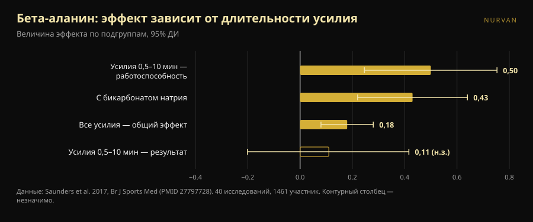
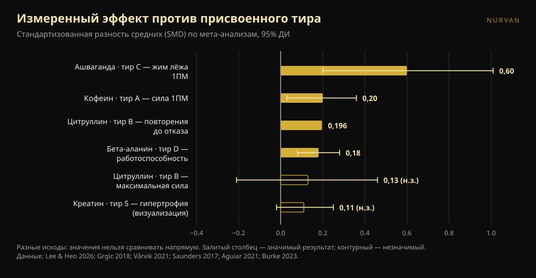

# Тир-лист добавок для силы: какие позиции выдерживают проверку

Автор: [Giammaria Loi](/autore/giammaria-loi) · обновлено 8 октября 2026

Тир-листы добавок ходят по сети годами: строка на каждую букву, от S до F, и ощущение, что за десять секунд ты всё понял. Недавно попался хорошо сделанный — с заявленными критериями и правильным выводом в конце. Мы нашли мета-анализ по каждой добавке из этого списка и положили цифры рядом с буквами. Две позиции не выдерживают, одна дозировка неверна, а одна добавка со дна заслуживает подъёма — но только если вы тренируетесь определённым образом.

## Коротко

- **Список прав наверху и путается в середине.** Креатин на вершине бесспорен, но даже его измеренный эффект мал: по прямым измерениям гипертрофии суммарная оценка составляет 0,11, а интервал задевает ноль.
- **Цитруллин не повышает максимальную силу.** Мета-анализ у тренированных даёт 0,13 — незначимо. Что он действительно даёт, и скромно, — около 3 дополнительных повторений из 51 за тренировку.
- **Бета-аланин в тире D имеет тот же общий эффект, что кофеин в тире A.** 0,18 против 0,20. Разница в том, что бета-аланин работает на усилиях от полуминуты до десяти минут: бесполезен в разовом максимуме, полезен в подходе на 20 или на дистанции HYROX.
- **Доза кофеина в посте слишком мала.** Позиционный документ ISSN называет стабильно эффективным диапазон 3–6 мг на кг массы тела и говорит, что минимальный порог может опускаться *до* 2 мг/кг. Не до 0,9.
- **У добавки с самым большим эффектом — самая слабая доказательная база.** Ашваганда показывает 0,60 в жиме лёжа на максимум, наивысшее число всего списка, но уверенность в доказательствах низкая, а результат держится на одном исследовании.

*Связь между присвоенной буквой и измеренным эффектом куда менее аккуратна, чем подсказывает любой рейтинг. Фото: Shixart1985, Wikimedia Commons, CC BY 2.0.*

## Что говорил рейтинг

Карусель оценивает добавки по четырём заявленным критериям: цена и легальность, эффективность, доказанная на людях, объяснимый механизм и косвенные выгоды (например, для сна). Получившаяся шкала: моногидрат креатина в **S**; протеиновый порошок и кофеин с теанином в **A**; цитруллин в **B**; рыбий жир и ашваганда в **C**; бета-аланин и нитраты в **D**; бетаин, EAA и большинство предтренировочных формул в **E**; BCAA, l-тирозин, «бустеры тестостерона» и HMB в **F**.

Две вещи верны ещё до взгляда на данные. Первая: критерии названы — тир-лист без критериев это мнение, переодетое в данные. Вторая: финальная фраза стоит больше всего рейтинга — добавки дополняют, а не заменяют разнообразное питание и сон.

Проблема в том, что четыре разных критерия сжимаются в одну букву. Эта буква не говорит, стоит ли продукт высоко потому, что сильно работает, потому, что дёшев, или потому, что помогает спать. А когда проверяешь, насколько каждый работает на самом деле, порядок рассыпается.

## Что на самом деле говорит наука

### Креатин в S — **Подтверждено**, с поправкой на масштаб

Креатин — самая изученная добавка в спорте, и позиционный документ International Society of Sports Nutrition описывает её как безопасную и хорошо переносимую: есть данные до 30 г в день на протяжении пяти лет у здоровых людей, а полезное привычное потребление — около 3 г в сутки (Kreider et al., 2017).

Но «самый надёжный» не значит «самый мощный». Мета-анализ, ограниченный прямыми измерениями гипертрофии — МРТ, КТ, УЗИ — по 10 исследованиям и 44 исходам дал суммарную оценку **0,11** по стандартизованной шкале с интервалом доверия от −0,02 до 0,25 и прирост толщины мышцы **0,10–0,16 см** (Burke et al., 2023). Это маленький, устойчивый, дешёвый и безопасный эффект. Именно поэтому креатин в S: не потому, что он преобразит тренировки, а потому, что он единственный надёжно даёт это немногое.

### Протеиновый порошок в A — **Требует уточнения**

Эталонный мета-анализ, 49 исследований и 1863 человека, показывает, что добавление протеина во время силовой программы прибавляет **2,49 кг к одноповторному максимуму** (95% ДИ 0,64–4,33) и **0,30 кг безжировой массы** (0,09–0,52) (Morton et al., 2018).

Деталь, которая меняет всё: выше суммарного потребления **1,62 г белка на кг массы тела в сутки** дополнительная польза исчезает. Порошок — не добавка в том смысле, в каком ею является креатин: это еда в удобном формате. Если вы и так набираете 1,6–1,8 г/кг едой, шейкер не сдвинет ничего. Если не набираете — шейкер самый простой способ дотянуть. В той же работе эффект больше у уже тренированных (+0,75 кг безжировой массы, p = 0,03) и меньше с возрастом.

### Кофеин в A — **Тир подтверждён, доза неверна**

Кофеин и сила: **0,20** по стандартизованной шкале (95% ДИ 0,03–0,36); мощность **0,17** (0,00–0,34). Подгрупповой анализ любопытен: эффект значим для верха тела (**0,21**) и не значим для низа (**0,15**) (Grgic et al., 2018).

Критическая точка — доза. Карусель указывает **0,9–2 мг на кг массы тела** как минимальную эффективную дозу. Позиционный документ ISSN говорит иначе: кофеин стабильно улучшает работоспособность при **3–6 мг/кг**, минимальная эффективная доза **остаётся неясной** и **может доходить до** 2 мг/кг, а очень высокие дозы (9 мг/кг) дают побочные эффекты без дополнительной пользы (Guest et al., 2021). Для человека массой 80 кг разница не умозрительна: пост подразумевает 72–160 мг, литература — 240–480 мг. Нижняя граница 0,9 мг/кг в этом документе опоры не имеет.

О соотношении **кофеин:теанин 1:2** со слайдов: стоящая за ним литература касается внимания, настроения и когнитивных функций, а не силы и повторений (Mancini et al., 2017). Мы относим это к **непроверяемому** применительно к тренировкам: не ложь, просто никогда не проверялось на том, что вас интересует в зале.

### Цитруллин в B — **Опровергнуто** для силы

Здесь рейтинг утверждает то, чего наука не говорит. Карусель приписывает цитруллину «больше силы и мощности». Мета-анализ у тренированных взрослых, 4 исследования и 138 измерений, находит эффект на максимальную силу **0,13** с интервалом от −0,21 до 0,46: **эффекта нет** (Aguiar & Casonatto, 2021).

То, что цитруллин умеет, он делает в другом месте. Восемь исследований и 137 участников, 6–8 г за 40–60 минут до работы: **+3 ± 5 повторения** при среднем объёме 51 ± 23 повторения на упражнение, то есть **+6,4%**, величина эффекта 0,196 (p = 0,022) (Vårvik et al., 2021). И там подгрупповой анализ на грани: низ тела p = 0,051, верх p = 0,131. Тир B за выносливость в повторениях защитить можно. Тир B за силу — нет.

### Бета-аланин в D — **Требует уточнения**, и зависит от вас

Это позиция, которая убеждает нас меньше всего. Самый крупный мета-анализ — 40 исследований, 1461 участник, 70 показателей — находит общий эффект **0,18** (95% ДИ 0,08–0,28) (Saunders et al., 2017). Практически то же число, что у кофеина на силу (0,20), который в том же списке стоит на две буквы выше.

Настоящая разница не в величине эффекта, а в том, **где** он проявляется. Длительность усилия — значимый модератор (p = 0,004): в окне от **30 секунд до 10 минут** эффект на работоспособность поднимается до **0,50** (0,246–0,753), тогда как на результат остаётся 0,11 и незначим. Практическая деталь, которую часто упускают: **общее принятое количество не является модератором** (p = 0,438), так что грузить больше бессмысленно.

В переводе на зал: если вы делаете тяжёлые тройки в жиме и тяге, бета-аланин в D уместен. Если ваша тренировка — подходы по 15–25, круговые, сани, HYROX или кроссфит, вы смотрите на правильную добавку в неправильной клетке.

*У бета-аланина не один эффект: для каждого типа усилия он свой. Данные: Saunders et al. 2017. График Nurvan.*

### Ашваганда в C — **Требует уточнения**: большой эффект, хрупкие данные

Мета-анализ 2026 года, ограниченный исследованиями со структурированными силовыми тренировками, находит самое высокое число всего списка: **0,60** в жиме лёжа на максимум (0,20–1,01) и **0,52** для низа тела (0,19–0,86). Но авторы сами высказываются прямо: при более осторожной статистической поправке обе оценки силы **теряют значимость**, каждая держится на одном влиятельном исследовании, а уверенность в доказательствах по GRADE **низкая**. На жировую массу эффекта нет (Lee & Heo, 2026).

Идеальная иллюстрация того, зачем читать два числа, а не одно: насколько велик эффект и насколько ему можно верить. Ашваганда выигрывает первое и проигрывает второе.

### HMB в F — **Подтверждено**

Одиннадцать исследований, 302 человека для состава тела и 248 для силы, от 18 до 45 лет: HMB даёт значимый эффект **только на общую массу тела** и никакого — на безжировую массу, жировую массу, суммарный одноповторный максимум, жим лёжа и низ тела (Jakubowski et al., 2020). Буква F заслужена.

*Величины эффекта (стандартизованная разность средних) по цитируемым мета-анализам, с 95% доверительным или вероятностным интервалом. Измеряемый исход у каждой добавки свой и указан в подписи: значения нельзя сравнивать напрямую, и именно поэтому одной буквы недостаточно. График Nurvan по источникам в конце статьи.*

## Как это применить

1. **Сначала фундамент.** Пост это говорит, и он прав: калории, общий белок и сон весят больше любой клетки таблицы. Если вы спите шесть часов, никакая буква вас не спасёт.
2. **Начинайте с S и спускайтесь только по причине.** Креатин 3–5 г в день, каждый день, без привязки ко времени. Единственная покупка, которую может оправдать почти каждый.
3. **Посчитайте белок прежде, чем покупать порошок.** Если вы уже выше 1,6 г/кг в сутки, шейкер — это удобство, а не результат.
4. **Выбирайте дозу кофеина по исследованиям, а не по карусели.** Изученный диапазон — 3–6 мг/кг, примерно за 60 минут. Если вы чувствительны, начинайте с малого и следите за сном: тренировка получше, оплаченная двумя часами сна, — плохая сделка.
5. **Выбирайте по цели, а не по букве.** Максимумы и тяжёлые тройки: креатин, кофеин, белок. Длинные подходы, меткон, HYROX: бета-аланин поднимается, цитруллин осмыслен только для объёма повторений.
6. **Проверьте добавку на себе, с цифрами.** Эффект 0,18 не виден за одну тренировку. Он виден за восемь недель записанных весов, при той же программе и том же целевом RIR.

> ### 💡 Вместе с Nurvan
> **Записывайте, что принимаете, и проверяйте, меняется ли что-то на самом деле.** В разделе добавок Nurvan вы отмечаете продукт, дозу и время; в дневнике тренировок остаются веса, повторения и RIR от занятия к занятию. Сопоставив одно с другим, вы увидите, сдвинулись ли ваши числа сильнее обычного за те восемь недель, когда вы что-то добавили, — вместо того чтобы доверять букве, которую кто-то поставил в Instagram. [Попробовать Nurvan](https://nurvan.app)

## Частые вопросы

**Если купить только одну добавку для силы — какую?**
Моногидрат креатина: единственная с малым, но устойчивым эффектом по прямым измерениям, с задокументированным профилем долгосрочной безопасности и ничтожной ценой (Kreider et al., 2017; Burke et al., 2023).

**Поможет ли цитруллин поднять максимум?**
Нет. Мета-анализ у тренированных спортсменов не находит эффекта на максимальную силу (0,13, незначимо). Единственная задокументированная польза — скромный прирост повторений до отказа, около 6% (Aguiar & Casonatto, 2021; Vårvik et al., 2021).

**Сколько кофеина перед тренировкой?**
В исследованиях используют 3–6 мг на кг массы тела, обычно примерно за 60 минут; очень высокие дозы пользы не добавляют и дают побочные эффекты (Guest et al., 2021). Это изученный диапазон, а не назначение: тем, кто принимает лекарства, беременным и людям с проблемами сердца или сна стоит сначала поговорить с врачом.

**Нужен ли бета-аланин, если я занимаюсь только пауэрлифтингом?**
Мало. Эффект сосредоточен в усилиях от 30 секунд до 10 минут, а разовый максимум лежит вне этого окна (Saunders et al., 2017). Если вы вдобавок делаете многоповторную работу или кондиционную, ответ меняется.

## Читайте также

- [Креатин вызывает выпадение волос? Что на самом деле говорят исследования](/blog/kreatin-vypadenie-volos)
- [Креатин без тренировок после 45: что показало исследование](/blog/kreatin-bez-trenirovok-posle-45)

## Источники

1. Kreider RB, Kalman DS, Antonio J, et al., 2017. *International Society of Sports Nutrition position stand: safety and efficacy of creatine supplementation in exercise, sport, and medicine.* J Int Soc Sports Nutr 14:18. PMID 28615996 — [doi:10.1186/s12970-017-0173-z](https://doi.org/10.1186/s12970-017-0173-z)
2. Burke R, Piñero A, Coleman M, et al., 2023. *The Effects of Creatine Supplementation Combined with Resistance Training on Regional Measures of Muscle Hypertrophy: A Systematic Review with Meta-Analysis.* Nutrients 15(9):2116. PMID 37432300 — [doi:10.3390/nu15092116](https://doi.org/10.3390/nu15092116)
3. Morton RW, Murphy KT, McKellar SR, et al., 2018. *A systematic review, meta-analysis and meta-regression of the effect of protein supplementation on resistance training-induced gains in muscle mass and strength in healthy adults.* Br J Sports Med 52(6):376–384. PMID 28698222 — [doi:10.1136/bjsports-2017-097608](https://doi.org/10.1136/bjsports-2017-097608)
4. Grgic J, Trexler ET, Lazinica B, Pedisic Z, 2018. *Effects of caffeine intake on muscle strength and power: a systematic review and meta-analysis.* J Int Soc Sports Nutr 15:11. PMID 29527137 — [doi:10.1186/s12970-018-0216-0](https://doi.org/10.1186/s12970-018-0216-0)
5. Guest NS, VanDusseldorp TA, Nelson MT, et al., 2021. *International society of sports nutrition position stand: caffeine and exercise performance.* J Int Soc Sports Nutr 18(1):1. PMID 33388079 — [doi:10.1186/s12970-020-00383-4](https://doi.org/10.1186/s12970-020-00383-4)
6. Vårvik FT, Bjørnsen T, Gonzalez AM, 2021. *Acute Effect of Citrulline Malate on Repetition Performance During Strength Training: A Systematic Review and Meta-Analysis.* Int J Sport Nutr Exerc Metab 31(4):350–358. PMID 34010809 — [doi:10.1123/ijsnem.2020-0295](https://doi.org/10.1123/ijsnem.2020-0295)
7. Aguiar AF, Casonatto J, 2021. *Effects of Citrulline Malate Supplementation on Muscle Strength in Resistance-Trained Adults: A Systematic Review and Meta-Analysis of Randomized Controlled Trials.* J Diet Suppl 19(6):772–790. PMID 34176406 — [doi:10.1080/19390211.2021.1939473](https://doi.org/10.1080/19390211.2021.1939473)
8. Saunders B, Elliott-Sale K, Artioli GG, et al., 2017. *β-alanine supplementation to improve exercise capacity and performance: a systematic review and meta-analysis.* Br J Sports Med 51(8):658–669. PMID 27797728 — [doi:10.1136/bjsports-2016-096396](https://doi.org/10.1136/bjsports-2016-096396)
9. Jakubowski JS, Nunes EA, Teixeira FJ, et al., 2020. *Supplementation with the Leucine Metabolite β-hydroxy-β-methylbutyrate (HMB) does not Improve Resistance Exercise-Induced Changes in Body Composition or Strength in Young Subjects: A Systematic Review and Meta-Analysis.* Nutrients 12(5):1523. PMID 32456217 — [doi:10.3390/nu12051523](https://doi.org/10.3390/nu12051523)
10. Lee JC, Heo AS, 2026. *Adjunctive Ashwagandha Supplementation and Resistance-Training Adaptations in Healthy Adults: A Systematic Review and Random-Effects Meta-Analysis.* Nutrients 18(17):2815. PMID 42738987 — [doi:10.3390/nu18172815](https://doi.org/10.3390/nu18172815)
11. Mancini E, Beglinger C, Drewe J, et al., 2017. *Green tea effects on cognition, mood and human brain function: A systematic review.* Phytomedicine 34:26–37. PMID 28899506 — [doi:10.1016/j.phymed.2017.07.008](https://doi.org/10.1016/j.phymed.2017.07.008)

Метаданные и аннотации получены из PubMed. Отправная точка: карусель [Alfred Jong (@alfred.reformance)](https://www.instagram.com/p/Dd_qscdm4cy/) для Reformance Training. Ни текст, ни изображения, ни структура поста не воспроизводились: утверждения были извлечены, переписаны и проверены независимо.

---

**Giammaria Loi** — основатель Nurvan. Тренируется с отягощениями с 2012 года, работает персональным тренером и коучем с сертификатом FIPE с 2013-го и выступает в пауэрлифтинге на национальном уровне с 2018-го. Каждая его статья начинается с научных работ и заканчивается тем, что действительно работает в зале.

> Примечание: информационный материал, не заменяющий консультацию врача или профильного специалиста. Упомянутые добавки могут взаимодействовать с лекарствами или заболеваниями: перед приёмом обсудите это с врачом. Если вы выступаете на соревнованиях, всегда сверяйтесь с антидопинговым регламентом своей федерации.
