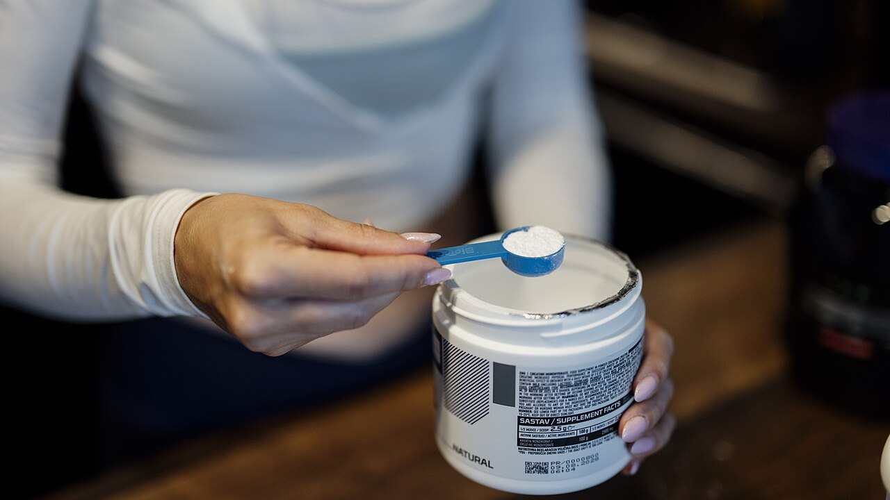
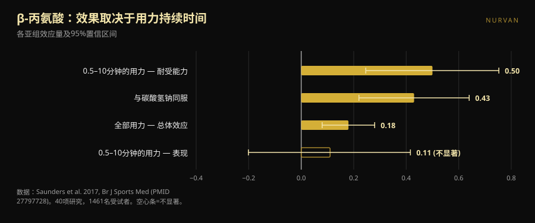
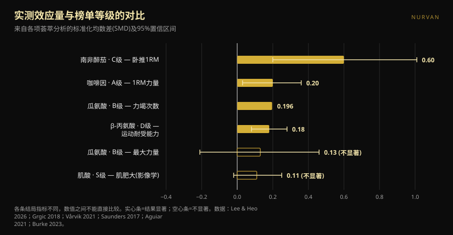

# 力量补剂等级榜：哪几级站得住脚

作者 [Giammaria Loi](/autore/giammaria-loi) · 更新于 2026 年 10 月 8 日

补剂等级榜已经流传了好几年：一个字母一行，从 S 排到 F，让人觉得十秒钟就把一切搞懂了。最近刷到的这一张做得不错，标明了评分标准，结尾那句话也说得对。于是我们把榜上每种补剂对应的荟萃分析都翻了出来，把数字和字母放在一起比。结果是：两个位置站不住，一个剂量写错了，还有一种排在底部的补剂该往上挪——但只有在你以某种方式训练时才成立。

## 要点速览

- **这张榜顶端是对的，中段乱了。** 肌酸排在最上面毫无争议，但连它的实测效果也很小：在影像学直接测量的肌肥大上，合并估计值是 0.11，区间还碰到了零。
- **瓜氨酸不能提高最大力量。** 一项针对训练人群的荟萃分析给出 0.13，不显著。它真正能做的，而且很有限，是让你一次训练的 51 次总次数里多出大约 3 次。
- **D 级的 β-丙氨酸，总体效应和 A 级的咖啡因一样大。** 0.18 对 0.20。区别在于 β-丙氨酸作用于半分钟到十分钟的用力：对单次极限无用，对 20 次一组或 HYROX 比赛有用。
- **帖子给的咖啡因剂量太低。** ISSN 立场声明把稳定有效的区间定在每公斤体重 3–6 毫克，并说最低阈值可能低*至* 2 毫克/公斤，而不是 0.9。
- **效应最大的那个补剂，证据最弱。** 南非醉茄在卧推极限上显示 0.60，是全榜最高的数字，但证据确定性很低，而且结果取决于单独一项研究。

*字母和实测效应之间的关系，远没有任何排行榜看上去那么整齐。图片：Shixart1985，Wikimedia Commons，CC BY 2.0。*

## 这张榜说了什么

该图按四条公开标准给补剂打分：价格与合法性、在人体试验中证实的有效性、可解释的机制，以及间接收益（例如改善睡眠）。得到的等级是：肌酸一水合物 **S**；蛋白粉、咖啡因加茶氨酸 **A**；瓜氨酸 **B**；鱼油和南非醉茄 **C**；β-丙氨酸和硝酸盐 **D**；甜菜碱、EAA 和大多数训练前配方 **E**；BCAA、左旋酪氨酸、"睾酮助推剂"和 HMB **F**。

还没看数据，就有两点是对的。第一，标准是公开的：没有标准的等级榜，不过是披着数据外衣的意见。第二，结尾那句话比整张榜更有价值——补剂是补充，替代不了多样化的饮食和睡眠。

问题在于，四条不同的标准被压缩进了一个字母。这个字母不会告诉你：某样东西排得高，是因为作用大，还是因为便宜，还是因为帮助睡眠。而一旦你去核对每一种到底有多大作用，次序就散架了。

## 研究真正说了什么

### 肌酸 S 级 —— **确认**，但要调整预期

肌酸是运动领域研究最多的补剂，国际运动营养学会（ISSN）的立场声明称其安全、耐受性好，健康人群中有每天 30 克、持续五年的数据，而有益的日常摄入量在每天 3 克左右（Kreider 等，2017）。

但"最扎实"不等于"最强力"。一项只纳入直接肌肥大测量（核磁、CT、超声）的荟萃分析，覆盖 10 项研究、44 个结局，得到的合并估计是标准化尺度上的 **0.11**，可信区间 −0.02 到 0.25，肌肉厚度增加 **0.10–0.16 厘米**（Burke 等，2023）。这是一个小而稳定、便宜又安全的效果。它之所以在 S 级，不是因为它会改造你的训练，而是因为它是唯一能把这一点点可靠兑现的。关于最常被问到的两个问题，我们另有专文：[肌酸与脱发](/zh/blog/creatine-hair-loss-zh)，以及[45岁后不健身吃肌酸](/zh/blog/jirousuan-bu-jianshen-45sui)。

### 蛋白粉 A 级 —— **需要限定**

参考性的荟萃分析，49 项研究、1863 人，发现在力量训练期间补充蛋白质可使**一次最大重量增加 2.49 公斤**（95% CI 0.64–4.33），**去脂体重增加 0.30 公斤**（0.09–0.52）（Morton 等，2018）。

真正改变结论的细节是：总摄入量超过**每公斤体重每天 1.62 克蛋白质**之后，额外收益就消失了。蛋白粉不是肌酸那种意义上的补剂，它是换了方便形态的食物。如果你靠吃饭已经达到 1.6–1.8 克/公斤，再加一杯摇摇杯什么也不会改变；如果没达到，摇摇杯是最省事的补足方式。同一篇论文里，效果在已有训练基础的人身上更大（去脂体重 +0.75 公斤，p = 0.03），随年龄增长而变小。

### 咖啡因 A 级 —— **等级确认，剂量错了**

咖啡因与力量：标准化尺度 **0.20**（95% CI 0.03–0.36）；功率 **0.17**（0.00–0.34）。亚组分析值得一看：上肢效果显著（**0.21**），下肢不显著（**0.15**）（Grgic 等，2018）。

关键在剂量。该图把**每公斤体重 0.9–2 毫克**写成最低有效剂量。ISSN 立场声明说的是另一回事：咖啡因在 **3–6 毫克/公斤**时稳定提升表现，最低有效剂量**仍不明确**，**可能低至** 2 毫克/公斤，而极高剂量（9 毫克/公斤）只带来副作用，没有额外好处（Guest 等，2021）。对一个 80 公斤的人来说，这个差距不是纸上谈兵：帖子暗示 72–160 毫克，文献是 240–480 毫克。0.9 毫克/公斤这个下限在该文件里找不到依据。

关于幻灯片上的**咖啡因:茶氨酸 1:2**：支撑这个比例的文献讲的是注意力、情绪和认知功能，不是力量或次数（Mancini 等，2017）。就训练而言我们把它归为**无法核实**——不是错，只是从未在你关心的健身房指标上测试过。

### 瓜氨酸 B 级 —— 就力量而言**被推翻**

这里榜单说了研究没有说的话。图中给瓜氨酸写的是"提升力量与功率输出"。一项针对有抗阻训练经验成年人的荟萃分析，4 项研究、138 次测量，发现对最大力量的效应为 **0.13**，区间 −0.21 到 0.46：**没有效果**（Aguiar 与 Casonatto，2021）。

瓜氨酸真正起作用的地方在别处。八项研究、137 名参与者，训练前 40–60 分钟摄入 6–8 克：在每个动作平均 51 ± 23 次总次数的基础上**多出 3 ± 5 次**，即 **+6.4%**，效应量 0.196（p = 0.022）（Vårvik 等，2021）。而且那里的亚组分析也在边缘：下肢 p = 0.051，上肢 p = 0.131。以"次数耐受"论，B 级说得过去；以力量论，不行。

### β-丙氨酸 D 级 —— **需要限定**，而且取决于你

这是我们最不认同的一个位置。规模最大的荟萃分析——40 项研究、1461 名参与者、70 项运动指标——得到的总体效应是 **0.18**（95% CI 0.08–0.28）（Saunders 等，2017）。这与咖啡因对力量的 0.20 几乎相同，而咖啡因在同一张榜上高两个字母。

真正的差别不是效应有多大，而是它出现在**哪里**。用力持续时间是显著的调节因素（p = 0.004）：在 **30 秒到 10 分钟**这个窗口里，对运动耐受能力的效应升到 **0.50**（0.246–0.753），而对成绩表现仍是 0.11 且不显著。一个常被忽略的实用细节：**总摄入量不是调节因素**（p = 0.438），所以加大囤积量没有意义。

换成健身房的话：如果你练的是卧推和硬拉的大重量三连，β-丙氨酸放 D 级没问题。如果你的课表是 15–25 次的组、循环训练、雪橇、HYROX 或 CrossFit，那你是在错误的格子里看一个正确的补剂。

*β-丙氨酸没有单一的效果：每一种用力形式对应一个不同的效果。数据：Saunders 等，2017。图表由 Nurvan 制作。*

### 南非醉茄 C 级 —— **需要限定**：效应大，证据脆

一项 2026 年、只纳入结构化抗阻训练试验的荟萃分析，给出全榜最高的数字：卧推极限 **0.60**（0.20–1.01），下肢极限 **0.52**（0.19–0.86）。但作者自己说得很直白：换用更保守的统计校正后，两个力量估计都**失去显著性**，各自依赖于单独一项影响力很大的试验，证据的 GRADE 确定性为**低**。对体脂则没有效果（Lee 与 Heo，2026）。

这正好说明为什么要同时看两个数字：效应有多大，以及这个效应有多可信。南非醉茄赢了前者，输了后者。

### HMB F 级 —— **确认**

十一项研究，身体成分 302 人、力量 248 人，年龄 18 到 45 岁：HMB 只在**总体重**上产生显著效应，对去脂体重、脂肪量、总一次最大重量、卧推和下肢都没有效果（Jakubowski 等，2020）。这个 F 是应得的。

*各引用荟萃分析报告的效应量（标准化均数差），附 95% 置信区间或可信区间。每种补剂测量的结局不同，已标注在标签上：数值之间不能一一比较，而这正是单个字母承载不了信息的原因。图表由 Nurvan 依据文末来源制作。*

## 怎么用

1. **先把地基打好。** 帖子说得对：热量、总蛋白和睡眠比表格里任何一格都重要。每天睡六小时，什么字母都救不了你。
2. **从 S 开始，有理由才往下走。** 肌酸每天 3–5 克，天天吃，不必挑时间。这是几乎所有人都说得通的唯一一笔开销。
3. **买蛋白粉之前先算蛋白质。** 如果你每天已经超过 1.6 克/公斤，摇摇杯买的是方便，不是表现。
4. **按研究选咖啡因剂量，不要按那张图。** 被研究的区间是 3–6 毫克/公斤，大约提前 60 分钟。如果你敏感，从低量开始并盯住睡眠：用少睡两小时换一次更好的训练，是笔亏本买卖。
5. **按目标选，不要按字母选。** 极限和大重量三连：肌酸、咖啡因、蛋白质。长组、metcon、HYROX：β-丙氨酸上移，瓜氨酸只在次数总量上说得通。
6. **用数字在自己身上验证。** 0.18 的效应在一次训练里看不见，它出现在八周有记录的负荷里——同样的课表，同样的目标 RIR。

> ### 💡 用 Nurvan
> **记下你吃了什么，再看它到底有没有带来变化。** 在 Nurvan 的补剂模块里记录产品、剂量和时间；训练日志里逐次保存负荷、次数和 RIR。把两边交叉看，你就能知道在加了某种补剂的那八周里，自己的数字有没有比平时动得更多——而不是去相信别人在 Instagram 上给出的那个字母。[试试 Nurvan](https://nurvan.app)

## 常见问题

**如果只买一种力量补剂，买哪种？**
肌酸一水合物。它是唯一一种在直接测量上效果虽小但稳定、长期安全性有据可查、而且价格低到可以忽略的补剂（Kreider 等，2017；Burke 等，2023）。

**瓜氨酸能帮我提高极限重量吗？**
不能。针对训练人群的荟萃分析没有发现对最大力量的效果（0.13，不显著）。唯一有据可查的好处是力竭次数小幅上升，约 6%（Aguiar 与 Casonatto，2021；Vårvik 等，2021）。

**训练前该喝多少咖啡因？**
研究使用的是每公斤体重 3–6 毫克，通常提前约 60 分钟；极高剂量不会带来额外好处，反而有副作用（Guest 等，2021）。这是被研究过的剂量范围，不是处方：正在服药、怀孕，或有心脏或睡眠问题的人，请先咨询医生。

**我只练力量举，β-丙氨酸有用吗？**
用处不大。它的效应集中在 30 秒到 10 分钟的用力上，单次极限不在这个窗口内（Saunders 等，2017）。如果你同时做高次数训练或体能训练，答案就不一样了。

## 延伸阅读

- [肌酸会导致脱发吗？研究到底怎么说](/zh/blog/creatine-hair-loss-zh)
- [45岁后不健身也吃肌酸：研究到底说了什么](/zh/blog/jirousuan-bu-jianshen-45sui)

## 参考文献

1. Kreider RB, Kalman DS, Antonio J, et al., 2017. *International Society of Sports Nutrition position stand: safety and efficacy of creatine supplementation in exercise, sport, and medicine.* J Int Soc Sports Nutr 14:18. PMID 28615996 — [doi:10.1186/s12970-017-0173-z](https://doi.org/10.1186/s12970-017-0173-z)
2. Burke R, Piñero A, Coleman M, et al., 2023. *The Effects of Creatine Supplementation Combined with Resistance Training on Regional Measures of Muscle Hypertrophy: A Systematic Review with Meta-Analysis.* Nutrients 15(9):2116. PMID 37432300 — [doi:10.3390/nu15092116](https://doi.org/10.3390/nu15092116)
3. Morton RW, Murphy KT, McKellar SR, et al., 2018. *A systematic review, meta-analysis and meta-regression of the effect of protein supplementation on resistance training-induced gains in muscle mass and strength in healthy adults.* Br J Sports Med 52(6):376–384. PMID 28698222 — [doi:10.1136/bjsports-2017-097608](https://doi.org/10.1136/bjsports-2017-097608)
4. Grgic J, Trexler ET, Lazinica B, Pedisic Z, 2018. *Effects of caffeine intake on muscle strength and power: a systematic review and meta-analysis.* J Int Soc Sports Nutr 15:11. PMID 29527137 — [doi:10.1186/s12970-018-0216-0](https://doi.org/10.1186/s12970-018-0216-0)
5. Guest NS, VanDusseldorp TA, Nelson MT, et al., 2021. *International society of sports nutrition position stand: caffeine and exercise performance.* J Int Soc Sports Nutr 18(1):1. PMID 33388079 — [doi:10.1186/s12970-020-00383-4](https://doi.org/10.1186/s12970-020-00383-4)
6. Vårvik FT, Bjørnsen T, Gonzalez AM, 2021. *Acute Effect of Citrulline Malate on Repetition Performance During Strength Training: A Systematic Review and Meta-Analysis.* Int J Sport Nutr Exerc Metab 31(4):350–358. PMID 34010809 — [doi:10.1123/ijsnem.2020-0295](https://doi.org/10.1123/ijsnem.2020-0295)
7. Aguiar AF, Casonatto J, 2021. *Effects of Citrulline Malate Supplementation on Muscle Strength in Resistance-Trained Adults: A Systematic Review and Meta-Analysis of Randomized Controlled Trials.* J Diet Suppl 19(6):772–790. PMID 34176406 — [doi:10.1080/19390211.2021.1939473](https://doi.org/10.1080/19390211.2021.1939473)
8. Saunders B, Elliott-Sale K, Artioli GG, et al., 2017. *β-alanine supplementation to improve exercise capacity and performance: a systematic review and meta-analysis.* Br J Sports Med 51(8):658–669. PMID 27797728 — [doi:10.1136/bjsports-2016-096396](https://doi.org/10.1136/bjsports-2016-096396)
9. Jakubowski JS, Nunes EA, Teixeira FJ, et al., 2020. *Supplementation with the Leucine Metabolite β-hydroxy-β-methylbutyrate (HMB) does not Improve Resistance Exercise-Induced Changes in Body Composition or Strength in Young Subjects: A Systematic Review and Meta-Analysis.* Nutrients 12(5):1523. PMID 32456217 — [doi:10.3390/nu12051523](https://doi.org/10.3390/nu12051523)
10. Lee JC, Heo AS, 2026. *Adjunctive Ashwagandha Supplementation and Resistance-Training Adaptations in Healthy Adults: A Systematic Review and Random-Effects Meta-Analysis.* Nutrients 18(17):2815. PMID 42738987 — [doi:10.3390/nu18172815](https://doi.org/10.3390/nu18172815)
11. Mancini E, Beglinger C, Drewe J, et al., 2017. *Green tea effects on cognition, mood and human brain function: A systematic review.* Phytomedicine 34:26–37. PMID 28899506 — [doi:10.1016/j.phymed.2017.07.008](https://doi.org/10.1016/j.phymed.2017.07.008)

元数据与摘要取自 PubMed。最初的触发点：[Alfred Jong（@alfred.reformance）](https://www.instagram.com/p/Dd_qscdm4cy/)为 Reformance Training 制作的图集。该贴的文字、图片与结构均未被复制：所有说法都经过独立提取、重写与核实。

---

**Giammaria Loi** 是 Nurvan 的创始人。他从 2012 年开始进行力量训练，自 2013 年起担任 FIPE 认证私人教练与教练，自 2018 年起在国家级力量举比赛中参赛。他署名的每一篇文章都从科学研究出发，落到健身房里真正有效的做法上。

> 注：本文为科普内容，不能替代医生或专业人士的意见。文中提到的补剂可能与药物或疾病相互作用：服用前请咨询你的医生。如果你参加比赛，请务必核对所属联合会的反兴奋剂规定。
