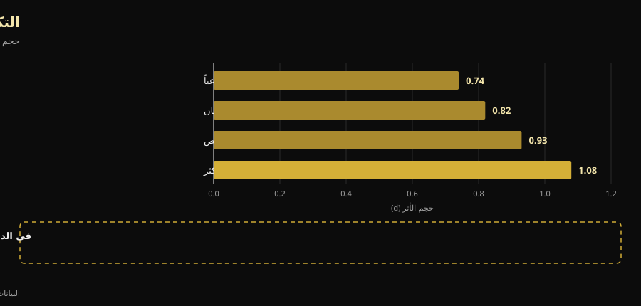

# تقسيم التمرين: ما الذي يتغير فعلاً بين المبتدئ والمتقدم

بقلم [Giammaria Loi](/autore/giammaria-loi) · مُحدَّث في 9 أكتوبر 2026

كتب مدرب أسترالي جملة نادراً ما تُسمع في الصالة: التقسيم ليس برنامجاً تختاره، بل نتيجة عملية حسابية. لا يصح وضع المبتدئ واللاعب المتقدم تلقائياً على التكرار الأسبوعي نفسه، لأنهما لا يولّدان الحِمل نفسه. راجعنا التحليلات البعدية حول تكرار التمرين: خلاصته صامدة. أما الطريق إليها فلا — فواحد من الأسباب الأربعة التي يذكرها مقلوب مقارنةً بما يُقاس في المختبر، وأهم رقم في المسألة كلها غائب عن المنشور.

## باختصار

- **التكرار الأمثل يتغير فعلاً مع الخبرة، وقد قيس.** لدى غير المتمرنين تأتي أكبر مكاسب القوة من تمرين كل مجموعة عضلية **3 أيام أسبوعياً** عند 60% من الحد الأقصى؛ ولدى المتمرنين ينزل الرقم إلى **يومين**، لكن عند 80% (Rhea وآخرون، 2003).
- **لكن التكرار وحده لا يفعل شيئاً.** عند تساوي الحجم الأسبوعي، يختفي الفارق بين التمرين مرة أو مرتين أو ثلاثاً أو أربعاً في الأسبوع (p = 0.421). أهميته أنه يتيح توزيع الحجم، لا أن العضلة تحب التحفيز المتكرر.
- **المبتدئ لا يولّد إجهاداً أقل: بل أكثر في الحصة الواحدة.** في الحصص الأربع الأولى تكون معظم الزيادة في سُمك العضلة **تورّماً ناتجاً عن تلف عضلي**، وهذا التلف يخفّ كلما استمر التمرين (Damas وآخرون، 2018). وهذا عكس ما يقوله المنشور.
- **تقسيم علوي/سفلي مرتين أسبوعياً جيد للمبتدئ، لكنه دون الأمثل.** التحليل البعدي لـ 140 دراسة يشير إلى 3 تعرضات أسبوعية لكل مجموعة عضلية لدى غير المتمرنين، لا اثنتين.
- **الجانب العصبي حقيقي، لكنه ليس «استدعاءً».** بعد 4 أسابيع يتغير **معدل إطلاق** العصبونات الحركية (+3.3 نبضة في الثانية) وعتبات الاستدعاء: الجهاز العصبي يتعلم قيادة العضلة، لا أن يكتشف أليافاً جديدة (Del Vecchio وآخرون، 2019).

## المشكلة الحقيقية: برنامج واحد للجميع

من دخل صالة يعرف المشهد: البرنامج نفسه بأربعة أيام يُعطى لابن الخمسين الذي عاد في يناير وللشاب الذي ينافس. منشور دايل هانسفورد يهاجم هذا بالضبط، والسؤال الذي يطرحه صحيح: ليس «أي تقسيم أستخدم»، بل «كم حِملاً يولّد هذا الشخص، وكم يحتاج ليتعافى، وهل ستكون الحصة التالية جيدة فعلاً؟».

المشكلة أن للبحث العلمي إجابة أبسط وأكثر مللاً من الإجابة الفسيولوجية. أولاً مصطلحان: **التكرار** هو عدد مرات تمرين العضلة في الأسبوع؛ و**الحجم** هو مجموع المجموعات الفعّالة التي تتلقاها خلال الأسبوع كله. شيئان مختلفان، خُلط بينهما لعقود.

## ماذا يقول البحث حقاً

### «التكرار الصحيح يتغير مع الخبرة» — **مؤكَّد**

هذا أفضل أجزاء المنشور توثيقاً، والأرقام قديمة لكنها متينة. تحليل بعدي شمل **140 دراسة و1433 حجم أثر** بحث عن الجرعة المثلى بحسب المستوى: لدى غير المتمرنين يأتي الحد الأقصى عند شدة متوسطة قدرها **60% من الحد الأقصى، 3 أيام أسبوعياً لكل مجموعة عضلية**؛ ولدى المتمرنين تنتقل الذروة إلى **80% من الحد الأقصى، يومين أسبوعياً** (Rhea وآخرون، 2003).

تحليل ثانٍ، شمل 177 دراسة و1803 أحجام أثر، يضيف الدرجة الثالثة: الرياضيون يحققون الأقصى عند شدة متوسطة قدرها **85% من الحد الأقصى، يومين أسبوعياً، لكن بـ 8 مجموعات لكل عضلة** بدل 4 (Peterson وآخرون، 2005).

| المستوى | الشدة المتوسطة | أيام أسبوعياً لكل عضلة | مجموعات لكل عضلة |
|---|---|---|---|
| غير متمرن | 60% من الحد الأقصى | 3 | 4 |
| متمرن (غير رياضي محترف) | 80% من الحد الأقصى | 2 | 4 |
| رياضي | 85% من الحد الأقصى | 2 | 8 |

*جرعات مرتبطة بأقصى مكاسب القوة في تحليلين بعديين للعلاقة بين الجرعة والاستجابة. تلخيص Nurvan عن Rhea وآخرون، 2003 وPeterson وآخرون، 2005: هذه متوسطات أدبيات علمية، لا وصفات فردية.*

يلفت النظر فوراً ما لم يذكره المنشور: الاتجاه. مع تقدم الخبرة **ينخفض** التكرار لكل عضلة، بينما ترتفع الشدة وعدد المجموعات. كما أن المبتدئ ينبغي أن يكون عند 3 تعرضات أسبوعية، لا عند الاثنتين اللتين يوفرهما التقسيم المقترح. ليس خطأً جسيماً — فتقسيم علوي/سفلي مُنفَّذ جيداً يتفوق على أي برنامج مثالي مُنفَّذ بسوء — لكنه فارق حقيقي.

### «نحتاج تكراراً مختلفاً لأن الحِمل مختلف» — **يحتاج تدقيقاً**

هنا يأتي الرقم الغائب. قارن تحليل بعدي لـ 22 دراسة بين التكرارات الأسبوعية: حجم الأثر على القوة يرتفع بانتظام مع التكرار، من 0.74 عند حصة واحدة أسبوعياً إلى 1.08 عند أربع فأكثر. يبدو دليلاً قاطعاً على أن الأكثر أفضل.

ثم عزل الباحثون الدراسات التي كان فيها **الحجم الكلي متساوياً** بين المجموعات. هناك **يختفي** أثر التكرار (p = 0.421). بالترجمة: من تمرّن أربع مرات أسبوعياً تقدّم أكثر لأن أربع حصص استوعبت مجموعات أكثر، لا لأنها وُزّعت على نحو أفضل (Grgic وآخرون، 2018).

*الإطار السفلي هو جوهر المقال: السلّم المنتظم على اليسار أثرٌ للحجم يرتدي ثوب التكرار. البيانات: Grgic وآخرون، 2018 (22 دراسة). رسم Nurvan.*

أما في التضخم العضلي فالخلاصة أوضح: 25 دراسة، ولا فرق ذا دلالة بين التكرارات العالية والمنخفضة عند تساوي الحجم، ولا حتى لدى المتمرنين أصلاً (Schoenfeld وآخرون، 2019). والانحدار البعدي الأحدث والأدق — **67 دراسة و2058 مشاركاً**، بنماذج مصحَّحة لمدة البرنامج ومستوى التمرين — يصل إلى المكان نفسه: **الحجم** احتمال أثره الإيجابي على الكتلة والقوة 100%، بينما **التكرار** يتوافق مع آثار ضئيلة على التضخم، وله أثر حقيقي لكن بعوائد متناقصة بشدة على القوة (Pelland وآخرون، 2026).

إذن خلاصة المنشور — *التقسيم نتيجة لتصميم البرنامج لا نقطة البداية* — صحيحة، لكن لسبب مختلف: التقسيم هو الوعاء الذي تضع فيه الحجم الذي تستطيع الاستمرار عليه. إذا لم تتسع ثلاث حصص للمجموعات التي تحتاجها، اجعلها أربعاً. لا لأن العضلة «تحتاج تحفيزاً متكرراً».

### «المبتدئ يولّد إجهاداً أقل» — **مُفنَّد**

هذا الجزء ينقلب. يقول المنشور إن المبتدئ ينتج إجهاداً جهازياً أقل وحِملاً أقل في الحصة، ولذلك يستطيع التكرار أبكر. النصف الأول لا يصمد.

في **الحصص الأربع الأولى** من أي برنامج، تكون الزيادة في المقطع العرضي للعضلة التي تُقاس بالموجات فوق الصوتية في معظمها **تورّماً ناتجاً عن تلف عضلي**، لا نسيجاً جديداً. يلزم نحو الحصة العاشرة ليظهر تضخم متواضع وحقيقي، ونحو الثامنة عشرة ليصبح الظاهرة الأساسية. وفي أثناء ذلك **يتناقص التلف تدريجياً** في كل حصة، تحديداً لأنك تواصل التمرين (Damas وآخرون، 2018).

من يبدأ ليس لديه تلف أقل، بل أكثر — ولهذا لا يستطيع نزول الدرج بعد أسبوعه الأول من السكوات. ما لديه أقل هو **الحِمل المطلق**: كيلوغرامات أقل إجمالاً، وبالتالي ضغط أقل على المفاصل والأوتار والجهاز العصبي. تبقى خلاصة المنشور العملية صحيحة (المبتدئ يستطيع التكرار أبكر)، لكن السبب هو الحمولة الكلية، لا التلف.

### «المبتدئ يستدعي وحدات حركية أقل» — **يحتاج تدقيقاً**

يضع المنشور استدعاء الوحدات الحركية ضمن ما «لا يجيده» المبتدئ بعد. هذا تبسيط شائع. عند تسجيل العصبونات الحركية المفردة قبل أربعة أسابيع من التمرين وبعدها، فإن ما يتغير أكثر هو **معدل الإطلاق** — بمتوسط **+3.3 نبضة في الثانية** في الانقباضات دون القصوى — مع **انخفاض عتبات الاستدعاء**: أي أن الوحدات الحركية تدخل العمل عند مستويات قوة أدنى (Del Vecchio وآخرون، 2019). ليست هذه اكتشافاً لألياف نائمة، بل هي المحركات نفسها تُقاد بقوة أكبر وبتوقيت أفضل.

ويجدر القول إن الموضع الدقيق لهذه التكيفات — القشرة أم النخاع أم العصبون الحركي — لا يزال محل نقاش، والتقنيات المتاحة لا تحسمه (Škarabot وآخرون، 2021). في الآليات العصبية يُستحسن أن نكون أقل يقيناً مما هي عليه مواقع التواصل عادةً.

### «افصل تكرار العضلة عن تكرار التمرين» — **يحتاج تدقيقاً**

الفكرة أنيقة: تمرين الأرجل مرتين أسبوعياً، لكن بالسكوات مرة وبجهاز دفع الأرجل في المرة الأخرى، فتعمل العضلة كثيراً بينما ينال النمط الحركي المحدد راحة أطول. لم تختبر أي دراسة محكومة هذا الهيكل بعينه، فلا يمكن اعتباره مُثبتاً.

ما نعرفه هو أن **لتنويع التمارين اتجاهاً صحيحاً وآخر خاطئاً**. مراجعة لـ 8 دراسات على 241 رجلاً تخلص إلى أن التنويع *المنهجي*، المبني على أسس تشريحية وميكانيكية حيوية، قد يحسّن التضخم الموضعي والقوة الديناميكية القصوى؛ في حين أن التنويع *المفرط والعشوائي*، بتبديل التمارين باستمرار أو بتكرارها بلا فائدة، قد **يضر** بالمكاسب (Kassiano وآخرون، 2022). تدوير نوعين من تمارين الدفع عبر دورة من أسبوعين أمر معقول؛ أما تغيير التمرين في كل حصة فلا.

### «الدورة الصغرى لا يجب أن تكون سبعة أيام» — **غير قابل للتحقق**

الدورة الصغرى من خمسة أيام التي يقترحها المنشور للرياضيين المتقدمين جداً لا تسندها دراسات محكومة، ولا تناقضها أيضاً: لا توجد في PubMed مقارنات بين دورات صغرى أسبوعية وأخرى غير أسبوعية. هو خيار تنظيمي يمكن الدفاع عنه، لا نتيجة علمية. وعملياً له كلفة تستحق أن تُحتسب: دورة تنزاح عن التقويم تصطدم بالعمل والعائلة ومواعيد الصالة، وحصة ضائعة بسبب تعارض المواعيد تكلّف أكثر من التحسين الذي كنت تسعى إليه.

## كيف تطبّق هذا

1. **ابدأ من الحجم لا من الأيام.** قرّر كم مجموعة فعّالة تريد لكل مجموعة عضلية في الأسبوع. وبعد ذلك فقط انظر في كم يوم تتسع دون حصص من ساعتين.
2. **إن كنت مبتدئاً، استهدف 2-3 تعرضات لكل عضلة.** تقسيم علوي/سفلي مرتين أسبوعياً ممتاز، والأدبيات تقول إن ثلاثاً أفضل: التعرض الثالث، ولو كان قصيراً، أسهل طريقة لإضافة حجم دون إطالة الحصص.
3. **إن كنت متقدماً، ارفع المجموعات والشدة قبل الأيام.** بيانات الرياضيين تشير إلى ضعف عدد المجموعات لكل عضلة مع العدد نفسه من الأيام. أضف حصة حين لا تعود المجموعات تتسع، لا من باب المبدأ.
4. **أبقِ تمارينك الأساسية ثابتة.** غيّر النسخة لأسباب محددة (نقطة ضعف، انزعاج، تقدّم متوقف)، على دورات من أسابيع لا من حصص.
5. **استخدم معياراً للجودة لا التقويم.** إذا انخفضت الأوزان في الحصة التالية وارتفع الـ RIR — أي التكرارات المتبقية في الاحتياط عند نهاية المجموعة — عند الوزن نفسه، فأنت لم تتعافَ: هذه هي المعلومة التي يطلبها المنشور ولا يكاد أحد يسجّلها.
6. **في الأسابيع الأولى لا تثق بالمرآة.** معظم ما تراه قبل الحصة العاشرة تورّم. انظر إلى الأوزان.

> ### 💡 مع Nurvan
> **التقسيم الصحيح هو الذي تتحمله أرقامك.** يحصي Nurvan مجموعاتك لكل عضلة أسبوعاً بأسبوع، ويسجل الوزن والتكرارات والـ RIR لكل مجموعة: هكذا ترى بوضوح إن كانت الحصة الثانية من الأسبوع قد نُفِّذت فعلاً بالأوزان نفسها، أم أنك تراكم تعباً فحسب. تُقترح مجموعات الإحماء تلقائياً، وإن كان لديك برنامج جاهز فيمكنك استيراده من PDF أو Excel أو حتى من صورة. [جرّب Nurvan](https://nurvan.app)

## أسئلة شائعة

**كم مرة أسبوعياً يجب أن أمرّن العضلة؟**
مرتان أو ثلاث تغطيان معظم الأدبيات. لدى غير المتمرنين الذروة المقيسة 3 أيام أسبوعياً لكل مجموعة عضلية؛ ولدى المتمرنين يومان، مع مجموعات أكثر وشدة أعلى (Rhea وآخرون، 2003؛ Peterson وآخرون، 2005). لكن عند تساوي الحجم الأسبوعي يكون الفارق بين هذه الخيارات صغيراً (Schoenfeld وآخرون، 2019).

**الأفضل تمرين الجسم كاملاً أم التقسيم؟**
يعتمد على عدد المجموعات التي تحتاجها وعلى وقتك. لا أفضلية لأحدهما عند تساوي الحجم: تمرين الجسم كاملاً يوزع مجموعات قليلة على أيام أكثر، والتقسيم يركّز مجموعات كثيرة في أيام أقل. اختر ما يتيح لك إكمال حجمك بلا حصص لا تنتهي وبلا أيام ضائعة. إن كنت تتمرن مرتين أسبوعياً فتمرين الجسم كاملاً شبه إلزامي.

**هل أستطيع أن أصير قوياً بالتمرين 3 مرات أسبوعياً فقط؟**
نعم. في تحليلات الجرعة والاستجابة تقع ذروة الرياضيين عند يومين أسبوعياً لكل مجموعة عضلية: ثلاث حصص لكامل الجسم، أو علوي/سفلي/كامل، تنسجم مع هذه الأرقام (Peterson وآخرون، 2005). الحد سيكون الحجم الكلي الذي يتسع في ثلاث حصص، لا التكرار.

**هل أغيّر البرنامج كل شهر؟**
لا، والتغيير المفرط قد يكلفك مكاسب. التنويع المنهجي المبرَّر يفيد؛ أما المستمر العشوائي فقد يضر بالنتائج (Kassiano وآخرون، 2022). التمرين الأساسي يحتاج أسابيع عدة ليُظهر إن كان التدرّج ناجحاً.

## اقرأ أيضاً

- [كم تكرار لبناء العضلات؟ خرافة الـ 8-12](/ar/blog/kam-takrar-lilkutla-aladalia)
- [إكتومورف أم ميزومورف: هل يحدد شكل جسمك عضلاتك؟](/ar/blog/nawe-aljism-ectomorph-mesomorph-kutla-adaliya)
- [المستجيبون الضعفاء: ما مدى تأثير الجينات في العضلات؟](/ar/blog/genetics-high-low-responders)

## المصادر

1. Rhea MR, Alvar BA, Burkett LN, Ball SD, 2003. *A meta-analysis to determine the dose response for strength development.* Med Sci Sports Exerc 35(3):456–464. PMID 12618576 — [doi:10.1249/01.MSS.0000053727.63505.D4](https://doi.org/10.1249/01.MSS.0000053727.63505.D4)
2. Peterson MD, Rhea MR, Alvar BA, 2005. *Applications of the dose-response for muscular strength development: a review of meta-analytic efficacy and reliability for designing training prescription.* J Strength Cond Res 19(4):950–958. PMID 16287373 — [doi:10.1519/R-16874.1](https://doi.org/10.1519/R-16874.1)
3. Grgic J, Schoenfeld BJ, Davies TB, Lazinica B, Krieger JW, Pedisic Z, 2018. *Effect of Resistance Training Frequency on Gains in Muscular Strength: A Systematic Review and Meta-Analysis.* Sports Med 48(5):1207–1220. PMID 29470825 — [doi:10.1007/s40279-018-0872-x](https://doi.org/10.1007/s40279-018-0872-x)
4. Schoenfeld BJ, Grgic J, Krieger J, 2019. *How many times per week should a muscle be trained to maximize muscle hypertrophy? A systematic review and meta-analysis of studies examining the effects of resistance training frequency.* J Sports Sci 37(11):1286–1295. PMID 30558493 — [doi:10.1080/02640414.2018.1555906](https://doi.org/10.1080/02640414.2018.1555906)
5. Pelland JC, Remmert JF, Robinson ZP, Hinson SR, Zourdos MC, 2026. *The Resistance Training Dose Response: Meta-Regressions Exploring the Effects of Weekly Volume and Frequency on Muscle Hypertrophy and Strength Gains.* Sports Med 56(2):481–505. PMID 41343037 — [doi:10.1007/s40279-025-02344-w](https://doi.org/10.1007/s40279-025-02344-w)
6. Damas F, Libardi CA, Ugrinowitsch C, 2018. *The development of skeletal muscle hypertrophy through resistance training: the role of muscle damage and muscle protein synthesis.* Eur J Appl Physiol 118(3):485–500. PMID 29282529 — [doi:10.1007/s00421-017-3792-9](https://doi.org/10.1007/s00421-017-3792-9)
7. Del Vecchio A, Casolo A, Negro F, et al., 2019. *The increase in muscle force after 4 weeks of strength training is mediated by adaptations in motor unit recruitment and rate coding.* J Physiol 597(7):1873–1887. PMID 30727028 — [doi:10.1113/JP277250](https://doi.org/10.1113/JP277250)
8. Kassiano W, Nunes JP, Costa B, Ribeiro AS, Schoenfeld BJ, Cyrino ES, 2022. *Does Varying Resistance Exercises Promote Superior Muscle Hypertrophy and Strength Gains? A Systematic Review.* J Strength Cond Res 36(6):1753–1762. PMID 35438660 — [doi:10.1519/JSC.0000000000004258](https://doi.org/10.1519/JSC.0000000000004258)
9. Škarabot J, Brownstein CG, Casolo A, Del Vecchio A, Ansdell P, 2021. *The knowns and unknowns of neural adaptations to resistance training.* Eur J Appl Physiol 121(3):675–685. PMID 33355714 — [doi:10.1007/s00421-020-04567-3](https://doi.org/10.1007/s00421-020-04567-3)

البيانات الوصفية والملخصات من PubMed. نقطة الانطلاق: منشور [Dale Hansford (@coach_dalehansford)](https://www.instagram.com/p/DdnB85NFZca/) بتاريخ 23 سبتمبر 2026. لم يُستنسخ أي نص أو صورة أو هيكل من المنشور: استُخرجت الادعاءات وأُعيدت صياغتها وجرى التحقق منها بشكل مستقل.

---

**Giammaria Loi** هو مؤسس Nurvan. يتمرن بالأثقال منذ 2012، ويعمل مدرباً شخصياً ومدرباً معتمداً من FIPE منذ 2013، وينافس في رفع الأثقال القوة (powerlifting) على المستوى الوطني منذ 2018. كل مقال يوقّعه ينطلق من الدراسات العلمية وينتهي عند ما ينفع فعلاً في الصالة.

> ملاحظة: محتوى تعليمي لا يغني عن رأي طبيب أو مختص. إن كانت لديك أمراض أو إصابات حالية، أو كنت تعود بعد انقطاع طويل، فاعرض برنامجك على مختص مؤهل.
