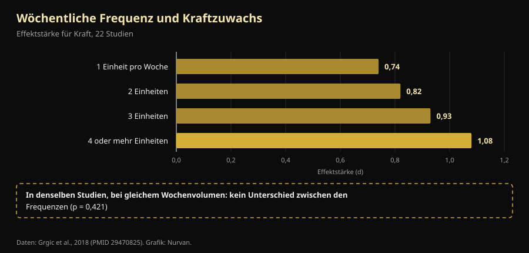

# Trainingssplit: was sich zwischen Anfänger und Fortgeschrittenem wirklich ändert

Von [Giammaria Loi](/autore/giammaria-loi) · aktualisiert am 9. Oktober 2026

Ein australischer Coach hat etwas geschrieben, das man im Studio selten hört: Der Split ist kein Plan, den man aussucht, sondern das Ergebnis einer Rechnung. Ein Anfänger und ein fortgeschrittener Athlet dürfen nicht automatisch auf dieselbe Frequenz gesetzt werden, weil sie nicht denselben Reiz erzeugen. Wir haben die Meta-Analysen zur Trainingsfrequenz durchgesehen: Seine Schlussfolgerung hält. Der Weg dorthin nicht — einer seiner vier Gründe steht auf dem Kopf im Vergleich zu dem, was im Labor gemessen wird, und die wichtigste Zahl dieser ganzen Frage fehlt im Beitrag.

## Kurz gefasst

- **Die optimale Frequenz ändert sich tatsächlich mit der Erfahrung, und das ist gemessen.** Bei Untrainierten kommen die größten Kraftzuwächse, wenn jede Muskelgruppe **3 Tage pro Woche** bei 60 % des Maximums trainiert wird; bei Trainierten sind es **2 Tage**, dafür bei 80 % (Rhea et al., 2003).
- **Aber die Frequenz allein bewirkt nichts.** Wird das Wochenvolumen angeglichen, **verschwindet** der Unterschied zwischen 1, 2, 3 oder 4 Einheiten pro Woche (p = 0,421). Sie zählt, weil sie das Volumen verteilen lässt — nicht weil der Muskel häufige Reize bräuchte.
- **Anfänger erzeugen nicht weniger Ermüdung, sondern mehr pro Einheit.** In den ersten vier Einheiten ist die Zunahme der Muskeldicke größtenteils **Schwellung durch Muskelschäden**, und diese Schäden gehen mit zunehmendem Training zurück (Damas et al., 2018). Das ist das Gegenteil dessen, was der Beitrag sagt.
- **Ein Ober-/Unterkörper-Split zweimal pro Woche ist für Anfänger gut, aber unter dem Optimum.** Die Meta-Analyse aus 140 Studien nennt 3 wöchentliche Reize pro Muskelgruppe bei Untrainierten, nicht 2.
- **Der neuronale Teil ist real, aber es geht nicht um „Rekrutierung".** Nach 4 Wochen ändern sich die **Entladungsrate** der Motoneurone (+3,3 Impulse pro Sekunde) und die Rekrutierungsschwellen: Das Nervensystem lernt, den Muskel zu steuern — es entdeckt keine neuen Fasern (Del Vecchio et al., 2019).

## Das eigentliche Problem: ein Plan für alle

Wer je ein Studio betreten hat, kennt die Szene: derselbe Vier-Tage-Plan für den Fünfzigjährigen, der im Januar wieder angefangen hat, und für den, der Wettkämpfe bestreitet. Genau das greift Dale Hansfords Beitrag an, und seine Leitfrage ist richtig: nicht „welchen Split nehme ich", sondern „wie viel Reiz erzeugt diese Person, wie lange braucht sie zur Erholung, und wird die nächste Einheit gut sein?".

Nur hat die Forschung eine einfachere und langweiligere Antwort als die physiologische. Zuerst zwei Begriffe: **Frequenz** ist, wie oft pro Woche ein Muskel trainiert wird; **Volumen**, wie viele harte Sätze er in der ganzen Woche bekommt. Zwei verschiedene Dinge, die jahrzehntelang vermischt wurden.

## Was die Forschung wirklich sagt

### „Die richtige Frequenz ändert sich mit der Erfahrung" — **Bestätigt**

Das ist der am besten belegte Teil, und die Zahlen sind alt, aber solide. Eine Meta-Analyse aus **140 Studien und 1.433 Effektstärken** suchte die optimale Dosis nach Leistungsniveau: Bei Untrainierten liegt das Maximum bei einer mittleren Intensität von **60 % des Maximums, 3 Tage pro Woche je Muskelgruppe**; bei Trainierten verschiebt sich der Gipfel auf **80 % des Maximums, 2 Tage pro Woche** (Rhea et al., 2003).

Eine zweite Analyse über 177 Studien und 1.803 Effektstärken ergänzt die dritte Stufe: Athleten profitieren am meisten von einer mittleren Intensität von **85 % des Maximums, 2 Tage pro Woche, aber mit 8 Sätzen je Muskelgruppe** statt 4 (Peterson et al., 2005).

| Niveau | Mittlere Intensität | Tage pro Woche je Muskel | Sätze je Muskel |
|---|---|---|---|
| Untrainiert | 60 % des Maximums | 3 | 4 |
| Trainiert (kein Athlet) | 80 % des Maximums | 2 | 4 |
| Athlet | 85 % des Maximums | 2 | 8 |

*Dosierungen, die in zwei Dosis-Wirkungs-Meta-Analysen mit maximalen Kraftzuwächsen verbunden sind. Nurvan-Zusammenfassung nach Rhea et al., 2003 und Peterson et al., 2005: Literaturmittelwerte, keine individuellen Vorgaben.*

Eines fällt sofort auf, was der Beitrag nicht erwähnt: die Richtung. Mit zunehmender Erfahrung **sinkt** die Frequenz pro Muskel, während Intensität und Satzzahl steigen. Und ein Anfänger sollte bei 3 wöchentlichen Reizen liegen, nicht bei den 2 des vorgeschlagenen Ober-/Unterkörper-Splits. Kein schwerer Fehler — ein gut umgesetzter Ober-/Unterkörper-Split schlägt jeden schlecht umgesetzten Optimalplan — aber ein realer Unterschied.

### „Es braucht eine andere Frequenz, weil der Reiz anders ist" — **Einzuordnen**

Hier kommt die fehlende Zahl. Eine Meta-Analyse aus 22 Studien verglich die Wochenfrequenzen: Die Effektstärke für Kraft steigt brav mit der Frequenz, von 0,74 bei einer Einheit pro Woche auf 1,08 bei vier oder mehr. Das sieht aus wie der endgültige Beweis, dass öfter besser ist.

Dann isolierten die Autoren jene Studien, in denen das **Gesamtvolumen zwischen den Gruppen gleich** war. Dort **verschwindet** der Frequenzeffekt (p = 0,421). Übersetzt: Wer viermal pro Woche trainierte, war besser, weil in vier Einheiten mehr Sätze passten — nicht, weil sie besser verteilt waren (Grgic et al., 2018).

*Der Kasten unten ist der Kern des Artikels: Die saubere Treppe links ist ein Volumeneffekt im Frequenzkostüm. Daten: Grgic et al., 2018 (22 Studien). Grafik: Nurvan.*

Beim Muskelaufbau ist das Urteil noch klarer: 25 Studien, kein signifikanter Unterschied zwischen hohen und niedrigen Frequenzen bei gleichem Volumen, auch nicht bei bereits Trainierten (Schoenfeld et al., 2019). Und die neueste, aufwendigste Meta-Regression — **67 Studien, 2.058 Teilnehmende**, mit Modellen, die für Programmdauer und Trainingsstand korrigiert sind — landet am selben Punkt: Das **Volumen** hat eine 100-prozentige Wahrscheinlichkeit eines positiven Effekts auf Masse und Kraft, während die **Frequenz** mit vernachlässigbaren Effekten auf die Hypertrophie vereinbar ist und auf die Kraft zwar real, aber mit stark abnehmendem Ertrag wirkt (Pelland et al., 2026).

Die Schlussfolgerung des Beitrags — *der Split ist eine Folge der Programmgestaltung, nicht der Ausgangspunkt* — stimmt also, nur aus einem anderen Grund: Der Split ist das Gefäß, in das du das Volumen füllst, das du durchhältst. Passen die nötigen Sätze nicht in drei Einheiten, machst du vier. Nicht, weil der Muskel „oft gereizt werden muss".

### „Anfänger erzeugen weniger Ermüdung" — **Widerlegt**

Dieser Punkt kippt. Der Beitrag sagt, Anfänger erzeugten weniger systemische Ermüdung und weniger Reiz pro Einheit und könnten deshalb früher wiederholen. Die erste Hälfte hält nicht.

In den **ersten vier Einheiten** eines Programms ist die im Ultraschall gemessene Zunahme des Muskelquerschnitts größtenteils **Schwellung durch Muskelschäden**, kein neues Gewebe. Es braucht etwa die zehnte Einheit, bis eine moderate, echte Hypertrophie auftritt, und rund die achtzehnte, bis sie das Hauptgeschehen ist. Unterdessen **nehmen die Schäden pro Einheit stetig ab**, gerade weil man weitertrainiert (Damas et al., 2018).

Wer anfängt, hat nicht weniger Schäden, sondern mehr — deshalb kommt nach der ersten Kniebeugenwoche niemand die Treppe hinunter. Weniger hat er an **absoluter Last**: weniger bewegte Kilos insgesamt, also weniger Belastung für Gelenke, Sehnen und Nervensystem. Die praktische Schlussfolgerung bleibt gültig (Anfänger können früher wiederholen), aber der Grund ist die Tonnage, nicht der Schaden.

### „Anfänger rekrutieren weniger motorische Einheiten" — **Einzuordnen**

Der Beitrag zählt die Rekrutierung motorischer Einheiten zu dem, was der Anfänger „noch nicht kann". Das ist eine verbreitete Vereinfachung. Misst man einzelne Motoneurone vor und nach vier Wochen Training, ändert sich vor allem die **Entladungsrate** — im Mittel **+3,3 Impulse pro Sekunde** bei submaximalen Kontraktionen — zusammen mit **niedrigeren Rekrutierungsschwellen**: Motorische Einheiten schalten sich bei geringerer Kraft zu (Del Vecchio et al., 2019). Es werden keine schlafenden Fasern entdeckt: Es ist derselbe Motorenpark, nur härter gefahren und besser getaktet.

Dazu kommt: Wo genau diese Anpassungen sitzen — Kortex, Rückenmark, Motoneuron — ist weiterhin umstritten, und die verfügbaren Methoden können es nicht klären (Škarabot et al., 2021). Bei neuronalen Mechanismen lohnt es sich, weniger sicher zu sein, als man es in sozialen Netzwerken üblicherweise ist.

### „Trenne die Muskelfrequenz von der Übungsfrequenz" — **Einzuordnen**

Die Idee ist elegant: Beine zweimal pro Woche trainieren, aber Kniebeuge einmal und Beinpresse das andere Mal, damit der Muskel oft arbeitet und das spezifische Bewegungsmuster länger regeneriert. Keine kontrollierte Studie hat genau diese Struktur geprüft, also gilt sie nicht als belegt.

Bekannt ist dagegen, dass **Übungsvariation eine richtige und eine falsche Richtung hat**. Eine Übersicht über 8 Studien mit 241 Männern kommt zu dem Schluss, dass *systematische* Variation, nach anatomischen und biomechanischen Kriterien gewählt, regionale Hypertrophie und maximale dynamische Kraft verbessern kann — während *übermäßige, zufällige* Variation mit ständig gewechselten oder redundanten Übungen die Zuwächse **beeinträchtigen** kann (Kassiano et al., 2022). Zwei Druckvarianten über einen Zweiwochenzyklus zu rotieren, ist sinnvoll; in jeder Einheit die Übung zu wechseln, nicht.

### „Ein Mikrozyklus muss nicht sieben Tage dauern" — **Nicht überprüfbar**

Der Fünf-Tage-Mikrozyklus, den der Beitrag für sehr fortgeschrittene Athleten vorschlägt, hat keine kontrollierten Studien für sich — und auch keine gegen sich: Auf PubMed finden sich keine Vergleiche zwischen wöchentlichen und nicht-wöchentlichen Mikrozyklen. Es ist eine vertretbare Organisationsentscheidung, kein wissenschaftliches Ergebnis. In der Praxis kostet sie etwas, das man einplanen sollte: Ein Zyklus, der gegen den Kalender läuft, kollidiert mit Arbeit, Familie und Studioöffnungszeiten — und eine wegen Terminchaos ausgefallene Einheit wiegt schwerer als die gesuchte Optimierung.

## So setzt du es um

1. **Starte beim Volumen, nicht bei den Tagen.** Lege fest, wie viele harte Sätze jede Muskelgruppe pro Woche bekommen soll. Erst danach schaust du, auf wie viele Tage sie passen, ohne Zweistundeneinheiten.
2. **Als Einsteiger ziele auf 2-3 Reize pro Muskel.** Ein Ober-/Unterkörper-Split zweimal pro Woche ist völlig in Ordnung, laut Literatur wären drei noch besser: Der dritte Reiz, auch kurz, ist der einfachste Weg, Volumen hinzuzufügen, ohne die Einheiten zu verlängern.
3. **Als Fortgeschrittener erhöhe erst Sätze und Intensität, dann Tage.** Die Athletendaten nennen die doppelte Satzzahl pro Muskelgruppe bei gleicher Tageszahl. Füge eine Einheit hinzu, wenn die Sätze nicht mehr hineinpassen — nicht aus Prinzip.
4. **Halte die Hauptübungen stabil.** Wechsle die Variante aus konkreten Gründen (Schwachstelle, Beschwerden, steckengebliebene Progression), in Wochenzyklen, nicht von Einheit zu Einheit.
5. **Nutze ein Qualitätskriterium, nicht den Kalender.** Sinken in der nächsten Einheit die Lasten und steigt der RIR — die Wiederholungen, die am Satzende noch im Tank sind — bei gleichem Gewicht, bist du nicht erholt. Genau diese Information verlangt der Beitrag, und fast niemand protokolliert sie.
6. **Traue in den ersten Wochen dem Spiegel nicht.** Ein Großteil dessen, was du vor der zehnten Einheit siehst, ist Schwellung. Schau auf die Lasten.

> ### 💡 Mit Nurvan
> **Der richtige Split ist der, den deine Zahlen tragen.** Nurvan zählt deine Sätze pro Muskelgruppe Woche für Woche und protokolliert Last, Wiederholungen und RIR jedes Satzes: So siehst du schwarz auf weiß, ob die zweite Einheit der Woche wirklich mit denselben Kilos lief wie die erste — oder ob du nur Ermüdung anhäufst. Aufwärmsätze werden automatisch vorgeschlagen, und einen vorhandenen Plan kannst du aus PDF, Excel oder sogar einem Foto importieren. [Nurvan testen](https://nurvan.app)

## Häufige Fragen

**Wie oft pro Woche soll ich einen Muskel trainieren?**
Zwei- bis dreimal deckt fast die gesamte Literatur ab. Bei Untrainierten liegt das gemessene Maximum bei 3 Tagen pro Woche je Muskelgruppe, bei Trainierten bei 2, mit mehr Sätzen und mehr Intensität (Rhea et al., 2003; Peterson et al., 2005). Bei gleichem Wochenvolumen ist der Unterschied zwischen diesen Optionen allerdings klein (Schoenfeld et al., 2019).

**Ganzkörper oder Split?**
Das hängt davon ab, wie viele Sätze du brauchst und wie viel Zeit du hast. Bei gleichem Volumen ist keines überlegen: Ganzkörper verteilt wenige Sätze auf mehr Tage, der Split bündelt viele auf wenige. Nimm das, womit du dein Volumen ohne endlose Einheiten und ohne ausgelassene Tage schaffst. Wer zweimal pro Woche trainiert, kommt um Ganzkörper kaum herum.

**Kann ich mit nur 3 Einheiten pro Woche stark werden?**
Ja. In den Dosis-Wirkungs-Meta-Analysen liegt das Athletenmaximum bei 2 Tagen pro Woche je Muskelgruppe: drei Ganzkörpereinheiten oder Oberkörper/Unterkörper/Ganzkörper passen zu diesen Zahlen (Peterson et al., 2005). Die Grenze ist das Gesamtvolumen, das in drei Einheiten passt, nicht die Frequenz.

**Muss ich jeden Monat den Plan wechseln?**
Nein, und zu häufiges Wechseln kann Zuwächse kosten. Systematische, begründete Variation hilft; ständige und zufällige kann die Ergebnisse beeinträchtigen (Kassiano et al., 2022). Eine Hauptübung braucht mehrere Wochen, um zu zeigen, ob die Progression funktioniert.

## Weiterlesen

- [Wie viele Wiederholungen für Muskelaufbau? Der 8-12-Mythos](/de/blog/wie-viele-wiederholungen-muskelaufbau)
- [Ektomorph oder mesomorph: entscheidet der Körperbau?](/de/blog/koerpertyp-ektomorph-mesomorph-muskelaufbau)
- [Low Responder: Wie viel Genetik steckt im Muskelaufbau?](/de/blog/genetik-high-low-responder)

## Quellen

1. Rhea MR, Alvar BA, Burkett LN, Ball SD, 2003. *A meta-analysis to determine the dose response for strength development.* Med Sci Sports Exerc 35(3):456–464. PMID 12618576 — [doi:10.1249/01.MSS.0000053727.63505.D4](https://doi.org/10.1249/01.MSS.0000053727.63505.D4)
2. Peterson MD, Rhea MR, Alvar BA, 2005. *Applications of the dose-response for muscular strength development: a review of meta-analytic efficacy and reliability for designing training prescription.* J Strength Cond Res 19(4):950–958. PMID 16287373 — [doi:10.1519/R-16874.1](https://doi.org/10.1519/R-16874.1)
3. Grgic J, Schoenfeld BJ, Davies TB, Lazinica B, Krieger JW, Pedisic Z, 2018. *Effect of Resistance Training Frequency on Gains in Muscular Strength: A Systematic Review and Meta-Analysis.* Sports Med 48(5):1207–1220. PMID 29470825 — [doi:10.1007/s40279-018-0872-x](https://doi.org/10.1007/s40279-018-0872-x)
4. Schoenfeld BJ, Grgic J, Krieger J, 2019. *How many times per week should a muscle be trained to maximize muscle hypertrophy? A systematic review and meta-analysis of studies examining the effects of resistance training frequency.* J Sports Sci 37(11):1286–1295. PMID 30558493 — [doi:10.1080/02640414.2018.1555906](https://doi.org/10.1080/02640414.2018.1555906)
5. Pelland JC, Remmert JF, Robinson ZP, Hinson SR, Zourdos MC, 2026. *The Resistance Training Dose Response: Meta-Regressions Exploring the Effects of Weekly Volume and Frequency on Muscle Hypertrophy and Strength Gains.* Sports Med 56(2):481–505. PMID 41343037 — [doi:10.1007/s40279-025-02344-w](https://doi.org/10.1007/s40279-025-02344-w)
6. Damas F, Libardi CA, Ugrinowitsch C, 2018. *The development of skeletal muscle hypertrophy through resistance training: the role of muscle damage and muscle protein synthesis.* Eur J Appl Physiol 118(3):485–500. PMID 29282529 — [doi:10.1007/s00421-017-3792-9](https://doi.org/10.1007/s00421-017-3792-9)
7. Del Vecchio A, Casolo A, Negro F, et al., 2019. *The increase in muscle force after 4 weeks of strength training is mediated by adaptations in motor unit recruitment and rate coding.* J Physiol 597(7):1873–1887. PMID 30727028 — [doi:10.1113/JP277250](https://doi.org/10.1113/JP277250)
8. Kassiano W, Nunes JP, Costa B, Ribeiro AS, Schoenfeld BJ, Cyrino ES, 2022. *Does Varying Resistance Exercises Promote Superior Muscle Hypertrophy and Strength Gains? A Systematic Review.* J Strength Cond Res 36(6):1753–1762. PMID 35438660 — [doi:10.1519/JSC.0000000000004258](https://doi.org/10.1519/JSC.0000000000004258)
9. Škarabot J, Brownstein CG, Casolo A, Del Vecchio A, Ansdell P, 2021. *The knowns and unknowns of neural adaptations to resistance training.* Eur J Appl Physiol 121(3):675–685. PMID 33355714 — [doi:10.1007/s00421-020-04567-3](https://doi.org/10.1007/s00421-020-04567-3)

Metadaten und Abstracts aus PubMed. Ausgangspunkt: Beitrag von [Dale Hansford (@coach_dalehansford)](https://www.instagram.com/p/DdnB85NFZca/) vom 23. September 2026. Kein Text, kein Bild und keine Struktur des Beitrags wurde übernommen: Die Aussagen wurden extrahiert, neu geschrieben und unabhängig überprüft.

---

**Giammaria Loi** ist der Gründer von Nurvan. Er trainiert seit 2012 mit Gewichten, arbeitet seit 2013 als FIPE-zertifizierter Personal Trainer und Coach und tritt seit 2018 auf nationaler Ebene im Powerlifting an. Jeder Artikel, den er zeichnet, beginnt bei den Studien und endet bei dem, was im Studio wirklich funktioniert.

> Hinweis: informativer Inhalt, ersetzt nicht die Einschätzung einer Ärztin, eines Arztes oder einer qualifizierten Fachkraft. Bei Vorerkrankungen, akuten Verletzungen oder einem Wiedereinstieg nach langer Pause lass deinen Plan von einer qualifizierten Fachkraft prüfen.
