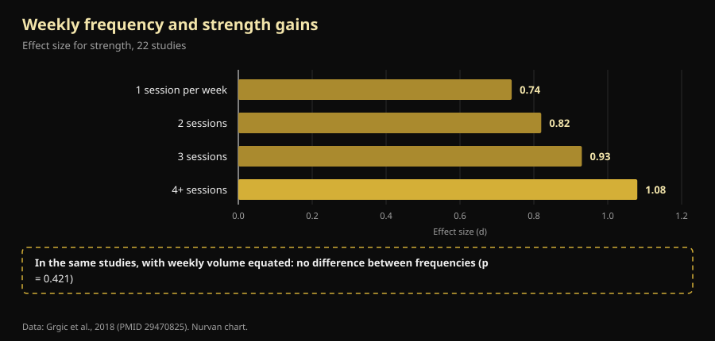

# Training split: what actually changes from beginner to advanced

By [Giammaria Loi](/autore/giammaria-loi) · updated 9 October 2026

An Australian coach made a point you rarely hear on a gym floor: your split isn't a program you pick, it's the output of a calculation. A beginner and an advanced lifter shouldn't be dropped onto the same frequency by default, because they don't generate the same training stress. We went through the meta-analyses on training frequency, and his conclusion holds. The route he takes to get there does not: one of his four reasons is backwards compared with what labs actually measure, and the single most important number in this whole question is missing from the post.

## Key points

- **Optimal frequency really does shift with experience, and it has been measured.** In untrained people the largest strength gains come from training each muscle group **3 days a week** at 60% of one-rep max; in trained lifters it drops to **2 days**, but at 80% (Rhea et al., 2003).
- **Frequency on its own does nothing.** Once weekly volume is equated, the difference between training 1, 2, 3 or 4 times a week **disappears** (p = 0.421). It matters because it lets you spread volume out, not because muscle likes frequent stimulation.
- **Beginners don't generate less fatigue — they generate more per session.** In the first four sessions, most of the increase in muscle thickness is **swelling from muscle damage**, and damage fades as you keep training (Damas et al., 2018). That's the opposite of what the post claims.
- **An upper/lower twice a week is good for a beginner, but below optimal.** The meta-analysis of 140 studies points to 3 weekly exposures per muscle group in untrained people, not 2.
- **The neural part is real, but it isn't "recruitment".** After 4 weeks of training what changes is motor unit **discharge rate** (+3.3 pulses per second) and recruitment thresholds: the nervous system learns to drive the muscle, it doesn't discover new fibres (Del Vecchio et al., 2019).

## The real problem: one program for everybody

Anyone who has set foot in a gym knows the scene: the same four-day template handed to the fifty-year-old who came back in January and to the lifter who competes. Dale Hansford's post attacks exactly that, and the question he proposes is the right one: not "which split should I run", but "how much stress does this person create, how long do they need to recover, and will the next session actually be any good?".

The catch is that the research has a simpler, more boring answer than the physiological one. Two definitions first: **frequency** is how many times a week a muscle gets trained; **volume** is how many hard sets it receives across the whole week. They're different things, and they were conflated for decades.

## What the research actually says

### "The right frequency changes with experience" — **Confirmed**

This is the best-documented part of the post, and the numbers are old but solid. A meta-analysis of **140 studies and 1,433 effect sizes** looked for the optimal training dose by level: in untrained people the largest strength gains came at a mean intensity of **60% of 1RM, 3 days a week per muscle group**; in trained lifters the peak shifts to **80% of 1RM, 2 days a week** (Rhea et al., 2003).

A second analysis, covering 177 studies and 1,803 effect sizes, adds the third rung: athletes get the most from a mean intensity of **85% of 1RM, 2 days a week, but with 8 sets per muscle group** instead of 4 (Peterson et al., 2005).

| Level | Mean intensity | Days per week per muscle | Sets per muscle |
|---|---|---|---|
| Untrained | 60% of 1RM | 3 | 4 |
| Trained (non-athlete) | 80% of 1RM | 2 | 4 |
| Athlete | 85% of 1RM | 2 | 8 |

*Doses associated with maximal strength gains in two dose-response meta-analyses. Nurvan summary of Rhea et al., 2003 and Peterson et al., 2005: these are literature averages, not individual prescriptions.*

One thing jumps out that the post doesn't mention: the direction of travel. As experience grows, frequency per muscle **goes down** while intensity and sets go up. And a beginner should be at 3 weekly exposures, not the 2 the post's upper/lower delivers. It isn't a serious error — a well-run upper/lower beats any optimal program run badly — but it's a real difference.

### "You need a different frequency because the stress is different" — **Needs nuance**

Here comes the missing number. A meta-analysis of 22 studies compared weekly frequencies: the effect size for strength rises neatly with frequency, from 0.74 at one session a week to 1.08 at four or more. It looks like proof that more often is better.

Then the authors isolated the studies in which **total volume was matched** between groups. There, the frequency effect **vanishes** (p = 0.421). Translation: the people training four times a week did better because four sessions held more sets, not because the sets were spread out (Grgic et al., 2018).

*The box at the bottom is the point of this article: the neat ladder on the left is a volume effect wearing a frequency costume. Data: Grgic et al., 2018 (22 studies). Nurvan chart.*

For hypertrophy the verdict is even cleaner: 25 studies, no significant difference between high and low frequencies at matched volume, not even in trained participants (Schoenfeld et al., 2019). And the most recent and most sophisticated meta-regression — **67 studies, 2,058 participants**, with models adjusted for programme duration and training status — lands in the same place: **volume** has a 100% posterior probability of a positive effect on both size and strength, while **frequency** is compatible with negligible effects on hypertrophy and has a real but sharply diminishing effect on strength (Pelland et al., 2026).

So the post's conclusion — *the split is a consequence of programme design, not the starting point* — is right, but for a different reason: the split is the container you pour your sustainable volume into. If the sets you need don't fit in three sessions, run four. Not because the muscle "needs hitting often".

### "Beginners generate less fatigue" — **Busted**

This is the part that flips. The post says beginners produce less systemic fatigue and less stress per session, and can therefore repeat sooner. The first half doesn't hold.

In the **first four sessions** of a programme, the increase in muscle cross-sectional area you measure on ultrasound is largely **swelling caused by muscle damage**, not new tissue. It takes roughly the tenth session for modest, real hypertrophy to appear, and around the eighteenth for it to become the dominant process. Meanwhile, per-session muscle damage **steadily decreases** precisely because you keep training (Damas et al., 2018).

Beginners don't have less damage: they have more, which is why nobody can walk downstairs after their first week of squats. What they have less of is **absolute load**: fewer total kilos moved, so less stress on joints, tendons and nervous system. The post's practical conclusion survives (beginners can repeat sooner), but the reason is tonnage, not damage.

### "Beginners recruit fewer motor units" — **Needs nuance**

The post lists motor unit recruitment among the things a beginner "can't do yet". That's a common simplification. When individual motor neurons are recorded before and after four weeks of training, what changes most is **discharge rate** — on average **+3.3 pulses per second** during submaximal contractions — together with **lower recruitment thresholds**, meaning motor units come online at lower force levels (Del Vecchio et al., 2019). It isn't the discovery of sleeping fibres: it's the same motor pool driven harder and timed better.

It's also worth saying that the precise site of these adaptations — cortex, spinal cord, motor neuron — is still debated, and current techniques can't settle it (Škarabot et al., 2021). On neural mechanisms it pays to be less certain than social media usually is.

### "Separate muscle frequency from exercise frequency" — **Needs nuance**

The idea is elegant: train legs twice a week, but squat once and leg press the other time, so the muscle works often while the specific pattern gets longer to recover. No controlled study has tested that exact structure, so it can't be called proven.

What we do know is that **exercise variation has a right way and a wrong way**. A review of 8 studies in 241 men concludes that *systematic* variation, chosen on anatomical and biomechanical grounds, can improve regional hypertrophy and maximal dynamic strength — while *excessive, random* variation, with exercises swapped constantly or redundant with one another, can **compromise** gains (Kassiano et al., 2022). Rotating two pressing variations over a two-week cycle is reasonable; changing exercise every session is not.

### "A microcycle doesn't have to be seven days" — **Unverifiable**

The five-day microcycle the post proposes for very advanced athletes has no controlled studies behind it — and none against it either: PubMed holds no comparisons between weekly and non-weekly microcycles. It's a defensible organisational choice, not a scientific finding. In practice it carries a cost worth budgeting for: a cycle that drifts against the calendar fights your job, your family and the gym's opening hours, and one session missed to a scheduling clash costs more than the optimisation you were chasing.

## How to apply it

1. **Start from volume, not from days.** Decide how many hard sets each muscle group should get in a week. Only then work out how many days they fit into without two-hour sessions.
2. **If you're new, aim for 2–3 exposures per muscle.** An upper/lower twice a week is fine, and the literature says three would be better still: a third exposure, even a short one, is the easiest way to add volume without lengthening sessions.
3. **If you're advanced, add sets and intensity before days.** The athlete data points to double the sets per muscle group at the same number of days. Add a session when the sets stop fitting, not on principle.
4. **Keep your main lifts stable.** Change variations for specific reasons — a weak point, a niggle, a stalled progression — on cycles of weeks, not sessions.
5. **Use a quality criterion, not the calendar.** If in the next session loads drop and RIR — reps in reserve, how many reps you had left at the end of a set — rises at the same weight, you haven't recovered. That's the information the post asks for and almost nobody logs.
6. **Don't trust the mirror in the first few weeks.** Much of what you see before session ten is swelling. Watch the loads.

> ### 💡 With Nurvan
> **The right split is the one your numbers can hold.** Nurvan counts your sets per muscle group week by week and logs load, reps and RIR for every set, so you can see in black and white whether the week's second session really used the same weights as the first or whether you're just stacking fatigue. Warm-up sets are suggested automatically, and if you already have a programme you can import it from PDF, Excel or even a photo. [Try Nurvan](https://nurvan.app)

## FAQ

**How many times a week should I train a muscle?**
Two or three covers almost the whole literature. In untrained people the measured peak is 3 days a week per muscle group; in trained lifters 2, with more sets and more intensity (Rhea et al., 2003; Peterson et al., 2005). At matched weekly volume, though, the gap between those options is small (Schoenfeld et al., 2019).

**Full body or a split?**
It depends on how many sets you need and how much time you have. Neither is superior at matched volume: full body spreads few sets across more days, a split concentrates many into fewer. Pick the one that lets you finish your volume without endless sessions or skipped days. If you train twice a week, full body is close to mandatory.

**Can I get strong training only 3 times a week?**
Yes. In the dose-response meta-analyses the athlete peak sits at 2 days a week per muscle group: three full-body sessions, or an upper/lower/full, fit those numbers (Peterson et al., 2005). Your limit will be the total volume you can fit into three sessions, not the frequency.

**Should I change my programme every month?**
No, and changing too often can cost you gains. Systematic, reasoned variation helps; constant random variation can compromise results (Kassiano et al., 2022). A main lift needs several weeks to show whether the progression is working.

## Read next

- [How many reps actually build muscle](/en/blog/how-many-reps-build-muscle)
- [Ectomorph or mesomorph: does body type cap your gains?](/en/blog/somatotype-ectomorph-mesomorph-muscle-growth)
- [Low responders: how much do genetics really limit muscle?](/en/blog/genetics-high-low-responders)

## Sources

1. Rhea MR, Alvar BA, Burkett LN, Ball SD, 2003. *A meta-analysis to determine the dose response for strength development.* Med Sci Sports Exerc 35(3):456–464. PMID 12618576 — [doi:10.1249/01.MSS.0000053727.63505.D4](https://doi.org/10.1249/01.MSS.0000053727.63505.D4)
2. Peterson MD, Rhea MR, Alvar BA, 2005. *Applications of the dose-response for muscular strength development: a review of meta-analytic efficacy and reliability for designing training prescription.* J Strength Cond Res 19(4):950–958. PMID 16287373 — [doi:10.1519/R-16874.1](https://doi.org/10.1519/R-16874.1)
3. Grgic J, Schoenfeld BJ, Davies TB, Lazinica B, Krieger JW, Pedisic Z, 2018. *Effect of Resistance Training Frequency on Gains in Muscular Strength: A Systematic Review and Meta-Analysis.* Sports Med 48(5):1207–1220. PMID 29470825 — [doi:10.1007/s40279-018-0872-x](https://doi.org/10.1007/s40279-018-0872-x)
4. Schoenfeld BJ, Grgic J, Krieger J, 2019. *How many times per week should a muscle be trained to maximize muscle hypertrophy? A systematic review and meta-analysis of studies examining the effects of resistance training frequency.* J Sports Sci 37(11):1286–1295. PMID 30558493 — [doi:10.1080/02640414.2018.1555906](https://doi.org/10.1080/02640414.2018.1555906)
5. Pelland JC, Remmert JF, Robinson ZP, Hinson SR, Zourdos MC, 2026. *The Resistance Training Dose Response: Meta-Regressions Exploring the Effects of Weekly Volume and Frequency on Muscle Hypertrophy and Strength Gains.* Sports Med 56(2):481–505. PMID 41343037 — [doi:10.1007/s40279-025-02344-w](https://doi.org/10.1007/s40279-025-02344-w)
6. Damas F, Libardi CA, Ugrinowitsch C, 2018. *The development of skeletal muscle hypertrophy through resistance training: the role of muscle damage and muscle protein synthesis.* Eur J Appl Physiol 118(3):485–500. PMID 29282529 — [doi:10.1007/s00421-017-3792-9](https://doi.org/10.1007/s00421-017-3792-9)
7. Del Vecchio A, Casolo A, Negro F, et al., 2019. *The increase in muscle force after 4 weeks of strength training is mediated by adaptations in motor unit recruitment and rate coding.* J Physiol 597(7):1873–1887. PMID 30727028 — [doi:10.1113/JP277250](https://doi.org/10.1113/JP277250)
8. Kassiano W, Nunes JP, Costa B, Ribeiro AS, Schoenfeld BJ, Cyrino ES, 2022. *Does Varying Resistance Exercises Promote Superior Muscle Hypertrophy and Strength Gains? A Systematic Review.* J Strength Cond Res 36(6):1753–1762. PMID 35438660 — [doi:10.1519/JSC.0000000000004258](https://doi.org/10.1519/JSC.0000000000004258)
9. Škarabot J, Brownstein CG, Casolo A, Del Vecchio A, Ansdell P, 2021. *The knowns and unknowns of neural adaptations to resistance training.* Eur J Appl Physiol 121(3):675–685. PMID 33355714 — [doi:10.1007/s00421-020-04567-3](https://doi.org/10.1007/s00421-020-04567-3)

Metadata and abstracts retrieved from PubMed. Starting point: a post by [Dale Hansford (@coach_dalehansford)](https://www.instagram.com/p/DdnB85NFZca/) from 23 September 2026. No text, image or structure from the post was reproduced: the claims were extracted, rewritten and verified independently.

---

**Giammaria Loi** is the founder of Nurvan. He has been lifting since 2012, has worked as a FIPE-certified personal trainer and coach since 2013, and has competed in powerlifting at national level since 2018. Every article he writes starts from the research and ends with what actually works in the gym.

> Note: this is educational content and does not replace advice from a doctor or qualified professional. If you have a medical condition, a current injury, or you're returning after a long layoff, have your programme reviewed by a qualified professional.
