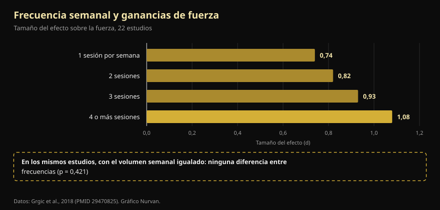

# Rutina de entrenamiento: qué cambia de verdad entre principiante y avanzado

Por [Giammaria Loi](/autore/giammaria-loi) · actualizado el 9 de octubre de 2026

Un entrenador australiano escribió algo que en el gimnasio se oye poco: la rutina no es una plantilla que eliges, es el resultado de un cálculo. Un principiante y un atleta avanzado no pueden ir de oficio a la misma frecuencia, porque no generan el mismo estrés. Revisamos los metaanálisis sobre frecuencia de entrenamiento y su conclusión se sostiene. El camino para llegar a ella, no: uno de los cuatro motivos que enumera está del revés respecto a lo que se mide en el laboratorio, y el número más importante de todo el asunto no aparece en la publicación.

## En resumen

- **La frecuencia óptima sí cambia con la experiencia, y está medida.** En personas no entrenadas las mayores ganancias de fuerza llegan entrenando cada grupo muscular **3 días por semana** al 60% del máximo; en los entrenados baja a **2 días**, pero al 80% (Rhea et al., 2003).
- **Pero la frecuencia, por sí sola, no hace nada.** Cuando se iguala el volumen semanal, la diferencia entre entrenar 1, 2, 3 o 4 veces por semana **desaparece** (p = 0,421). Importa porque permite repartir el volumen, no porque el músculo necesite estímulos frecuentes.
- **El principiante no genera menos fatiga: genera más por sesión.** En las primeras cuatro sesiones el aumento de grosor muscular es en gran parte **hinchazón por daño muscular**, y ese daño se atenúa a medida que entrenas (Damas et al., 2018). Es lo contrario de lo que dice la publicación.
- **Un torso/pierna dos veces por semana es bueno para un principiante, pero está por debajo del óptimo.** El metaanálisis de 140 estudios apunta a 3 exposiciones semanales por grupo muscular en no entrenados, no 2.
- **La parte neural es real, pero no es "reclutamiento".** Tras 4 semanas cambian la **frecuencia de descarga** de las motoneuronas (+3,3 impulsos por segundo) y los umbrales de reclutamiento: el sistema nervioso aprende a conducir el músculo, no descubre fibras nuevas (Del Vecchio et al., 2019).

## El problema real: una sola rutina para todos

Quien haya pisado un gimnasio conoce la escena: la misma plantilla de cuatro días para el cincuentón que volvió en enero y para el chico que compite. La publicación de Dale Hansford ataca exactamente eso, y la pregunta que propone es correcta: no "qué rutina uso", sino "cuánto estrés genera esta persona, cuánto necesita para recuperarse y la próxima sesión saldrá bien".

El detalle es que la investigación tiene una respuesta más simple y más aburrida que la fisiológica. Antes, dos definiciones: **frecuencia** es cuántas veces por semana se entrena un músculo; **volumen**, cuántas series efectivas recibe en total en la semana. Son cosas distintas y se confundieron durante décadas.

## Qué dice realmente la investigación

### "La frecuencia correcta cambia con la experiencia" — **Confirmado**

Es la parte mejor documentada, y los números son viejos pero sólidos. Un metaanálisis de **140 estudios y 1.433 tamaños del efecto** buscó la dosis óptima según el nivel: en no entrenados el máximo llega con una intensidad media del **60% del máximo, 3 días por semana por grupo muscular**; en entrenados el pico se desplaza al **80% del máximo, 2 días por semana** (Rhea et al., 2003).

Un segundo análisis, sobre 177 estudios y 1.803 tamaños del efecto, añade el tercer escalón: los atletas sacan el máximo con una intensidad media del **85% del máximo, 2 días por semana, pero con 8 series por grupo muscular** en vez de 4 (Peterson et al., 2005).

| Nivel | Intensidad media | Días por semana y músculo | Series por músculo |
|---|---|---|---|
| No entrenado | 60% del máximo | 3 | 4 |
| Entrenado (no atleta) | 80% del máximo | 2 | 4 |
| Atleta | 85% del máximo | 2 | 8 |

*Dosis asociadas a las ganancias de fuerza máximas en dos metaanálisis dosis-respuesta. Síntesis de Nurvan a partir de Rhea et al., 2003 y Peterson et al., 2005: son promedios de la literatura, no prescripciones individuales.*

Salta a la vista algo que la publicación no menciona: la dirección. Con la experiencia la frecuencia por músculo **baja**, mientras suben la intensidad y las series. Y el principiante debería estar en 3 exposiciones semanales, no en las 2 del torso/pierna propuesto. No es un error grave — un torso/pierna bien hecho gana a cualquier rutina óptima mal hecha — pero es una diferencia real.

### "Hace falta otra frecuencia porque el estrés es distinto" — **Matizable**

Aquí llega el número que falta. Un metaanálisis de 22 estudios comparó las frecuencias semanales: el tamaño del efecto sobre la fuerza crece de forma ordenada, de 0,74 con una sesión semanal a 1,08 con cuatro o más. Parece la prueba definitiva de que más veces es mejor.

Después los autores aislaron los estudios en los que el **volumen total era el mismo** entre grupos. Ahí el efecto de la frecuencia **desaparece** (p = 0,421). Traducido: quien entrenaba cuatro veces por semana iba mejor porque en cuatro sesiones hacía más series, no porque las hubiera repartido mejor (Grgic et al., 2018).

*El recuadro inferior es el punto del artículo: la escalera de la izquierda es un efecto del volumen disfrazado de efecto de la frecuencia. Datos: Grgic et al., 2018 (22 estudios). Gráfico Nurvan.*

Sobre la hipertrofia la conclusión es aún más clara: 25 estudios, ninguna diferencia significativa entre frecuencias altas y bajas con el volumen igualado, ni siquiera en sujetos ya entrenados (Schoenfeld et al., 2019). Y la metarregresión más reciente y sofisticada — **67 estudios, 2.058 participantes**, con modelos ajustados por duración del programa y nivel — llega al mismo sitio: el **volumen** tiene una probabilidad del 100% de efecto positivo sobre masa y fuerza, mientras que la **frecuencia** es compatible con efectos insignificantes sobre la hipertrofia y tiene un efecto real pero con fuertes rendimientos decrecientes sobre la fuerza (Pelland et al., 2026).

Así que la conclusión de la publicación — *la rutina es una consecuencia de la programación, no el punto de partida* — es correcta, pero por otro motivo: la rutina es el recipiente donde metes el volumen que puedes sostener. Si las series que necesitas no caben en tres sesiones, haces cuatro. No porque el músculo "necesite estímulo frecuente".

### "El principiante genera menos fatiga" — **Desmentido**

Esta parte se da la vuelta. La publicación dice que el principiante produce menos fatiga sistémica y menos estrés por sesión, y que por eso puede repetir antes. La primera mitad no se sostiene.

En las **primeras cuatro sesiones** de un programa, el aumento de sección transversal que se mide por ecografía es en gran parte **hinchazón por daño muscular**, no tejido nuevo. Hace falta la décima sesión aproximadamente para que aparezca una hipertrofia modesta y real, y alrededor de la decimoctava para que sea el fenómeno principal. Mientras tanto, el daño por sesión **se reduce progresivamente** precisamente porque entrenas (Damas et al., 2018).

Quien empieza no tiene menos daño: tiene más, y por eso no puede bajar escaleras tras su primera semana de sentadillas. Lo que tiene menos es **carga absoluta**: mueve menos kilos totales y por tanto estresa menos articulaciones, tendones y sistema nervioso. La conclusión práctica sigue valiendo (el principiante puede repetir antes), pero el motivo es el tonelaje, no el daño.

### "El principiante recluta menos unidades motoras" — **Matizable**

La publicación incluye el reclutamiento de unidades motoras entre las cosas que el principiante "todavía no sabe hacer". Es una simplificación extendida. Cuando se registran motoneuronas individuales antes y después de cuatro semanas de entrenamiento, lo que más cambia es la **frecuencia de descarga** — de media **+3,3 impulsos por segundo** en contracciones submáximas — junto con una **reducción de los umbrales de reclutamiento**: las unidades motoras entran en juego a niveles de fuerza más bajos (Del Vecchio et al., 2019). No es el descubrimiento de fibras dormidas: es el mismo parque de motores conducido con más intensidad y mejores tiempos.

Conviene añadir que la sede exacta de estas adaptaciones — corteza, médula, motoneurona — sigue en discusión y las técnicas actuales no permiten zanjarla (Škarabot et al., 2021). Con los mecanismos neurales conviene ser menos tajante de lo que suelen serlo las redes.

### "Separa la frecuencia del músculo de la del ejercicio" — **Matizable**

La idea es elegante: entrenar pierna dos veces por semana, pero con sentadilla una vez y prensa la otra, para que el músculo trabaje a menudo y el patrón específico recupere más. Ningún estudio controlado ha probado exactamente esa estructura, así que no puede darse por demostrada.

Lo que sí se sabe es que **la variación de ejercicios tiene un sentido correcto y otro equivocado**. Una revisión de 8 estudios con 241 hombres concluye que una variación *sistemática*, elegida con criterio anatómico y biomecánico, puede mejorar la hipertrofia regional y la fuerza dinámica máxima; mientras que una variación *excesiva y aleatoria*, con ejercicios cambiados sin parar o redundantes entre sí, puede **comprometer** las ganancias (Kassiano et al., 2022). Rotar dos variantes de empuje en un ciclo de dos semanas es razonable; cambiar de ejercicio cada sesión, no.

### "El microciclo no tiene que durar siete días" — **No verificable**

El microciclo de cinco días que la publicación propone para atletas muy avanzados no tiene estudios controlados a favor, ni tampoco en contra: en PubMed no hay comparaciones entre microciclos semanales y no semanales. Es una decisión organizativa defendible, no un resultado científico. En la práctica tiene un coste que conviene contabilizar: un ciclo que se desplaza respecto al calendario choca con el trabajo, la familia y los horarios del gimnasio, y una sesión perdida por un encaje imposible pesa más que la optimización que buscabas.

## Cómo aplicarlo

1. **Parte del volumen, no de los días.** Decide cuántas series efectivas quieres por grupo muscular a la semana. Solo después mira en cuántos días caben sin sesiones de dos horas.
2. **Si empiezas, apunta a 2-3 exposiciones por músculo.** Un torso/pierna dos veces por semana va perfecto y la literatura dice que tres sería aún mejor: la tercera exposición, aunque sea corta, es la forma más fácil de añadir volumen sin alargar las sesiones.
3. **Si eres avanzado, sube antes series e intensidad que días.** Los datos en atletas apuntan al doble de series por grupo con los mismos días. Añade una sesión cuando las series ya no quepan, no por principio.
4. **Mantén estables los ejercicios principales.** Cambia de variante por razones concretas (un punto débil, una molestia, un estancamiento), en ciclos de semanas, no de sesiones.
5. **Usa un criterio de calidad, no el calendario.** Si en la sesión siguiente bajan las cargas y el RIR — las repeticiones que te quedan en la recámara al acabar la serie — sube con el mismo peso, no has recuperado: esa es la información que pide la publicación y que casi nadie registra.
6. **En las primeras semanas no te fíes del espejo.** Buena parte de lo que ves antes de la décima sesión es hinchazón. Mira las cargas.

> ### 💡 Con Nurvan
> **La rutina correcta es la que tus números aguantan.** Nurvan lleva la cuenta de las series por grupo muscular semana a semana y registra carga, repeticiones y RIR de cada serie: así ves con claridad si la segunda sesión de la semana se hizo de verdad con los mismos kilos que la primera o si solo estás acumulando fatiga. Las series de calentamiento se proponen automáticamente y, si ya tienes una rutina, puedes importarla desde PDF, Excel o incluso una foto. [Prueba Nurvan](https://nurvan.app)

## Preguntas frecuentes

**¿Cuántas veces por semana debo entrenar un músculo?**
Dos o tres cubre casi toda la literatura. En no entrenados el máximo medido son 3 días por semana por grupo muscular; en entrenados 2, con más series e intensidad (Rhea et al., 2003; Peterson et al., 2005). Con el volumen semanal igualado, sin embargo, la diferencia entre esas opciones es pequeña (Schoenfeld et al., 2019).

**¿Mejor full body o rutina dividida?**
Depende de cuántas series necesites y del tiempo que tengas. Ninguna es superior con el volumen igualado: el full body reparte pocas series en más días, la dividida concentra muchas en pocos. Elige la que te permita completar el volumen sin sesiones eternas ni días saltados. Si entrenas dos veces por semana, el full body es casi obligatorio.

**¿Puedo ponerme fuerte entrenando solo 3 veces por semana?**
Sí. En los metaanálisis dosis-respuesta el máximo para atletas está en 2 días por semana por grupo muscular: tres sesiones full body o un torso/pierna/full encajan con esos números (Peterson et al., 2005). El límite será el volumen total que quepa en tres sesiones, no la frecuencia.

**¿Debo cambiar de rutina cada mes?**
No, y cambiarla demasiado puede costarte ganancias. La variación sistemática y razonada ayuda; la continua y aleatoria puede comprometer los resultados (Kassiano et al., 2022). Un ejercicio principal necesita varias semanas para mostrar si la progresión funciona.

## Lee también

- [Cuántas repeticiones para masa muscular: el mito del 8-12](/es/blog/cuantas-repeticiones-masa-muscular)
- [Ectomorfo o mesomorfo: ¿el somatotipo marca tu masa?](/es/blog/somatotipo-ectomorfo-mesomorfo-masa-muscular)
- [Low responder: cuánto pesa la genética en tus músculos](/es/blog/genetica-high-low-responders)

## Fuentes

1. Rhea MR, Alvar BA, Burkett LN, Ball SD, 2003. *A meta-analysis to determine the dose response for strength development.* Med Sci Sports Exerc 35(3):456–464. PMID 12618576 — [doi:10.1249/01.MSS.0000053727.63505.D4](https://doi.org/10.1249/01.MSS.0000053727.63505.D4)
2. Peterson MD, Rhea MR, Alvar BA, 2005. *Applications of the dose-response for muscular strength development: a review of meta-analytic efficacy and reliability for designing training prescription.* J Strength Cond Res 19(4):950–958. PMID 16287373 — [doi:10.1519/R-16874.1](https://doi.org/10.1519/R-16874.1)
3. Grgic J, Schoenfeld BJ, Davies TB, Lazinica B, Krieger JW, Pedisic Z, 2018. *Effect of Resistance Training Frequency on Gains in Muscular Strength: A Systematic Review and Meta-Analysis.* Sports Med 48(5):1207–1220. PMID 29470825 — [doi:10.1007/s40279-018-0872-x](https://doi.org/10.1007/s40279-018-0872-x)
4. Schoenfeld BJ, Grgic J, Krieger J, 2019. *How many times per week should a muscle be trained to maximize muscle hypertrophy? A systematic review and meta-analysis of studies examining the effects of resistance training frequency.* J Sports Sci 37(11):1286–1295. PMID 30558493 — [doi:10.1080/02640414.2018.1555906](https://doi.org/10.1080/02640414.2018.1555906)
5. Pelland JC, Remmert JF, Robinson ZP, Hinson SR, Zourdos MC, 2026. *The Resistance Training Dose Response: Meta-Regressions Exploring the Effects of Weekly Volume and Frequency on Muscle Hypertrophy and Strength Gains.* Sports Med 56(2):481–505. PMID 41343037 — [doi:10.1007/s40279-025-02344-w](https://doi.org/10.1007/s40279-025-02344-w)
6. Damas F, Libardi CA, Ugrinowitsch C, 2018. *The development of skeletal muscle hypertrophy through resistance training: the role of muscle damage and muscle protein synthesis.* Eur J Appl Physiol 118(3):485–500. PMID 29282529 — [doi:10.1007/s00421-017-3792-9](https://doi.org/10.1007/s00421-017-3792-9)
7. Del Vecchio A, Casolo A, Negro F, et al., 2019. *The increase in muscle force after 4 weeks of strength training is mediated by adaptations in motor unit recruitment and rate coding.* J Physiol 597(7):1873–1887. PMID 30727028 — [doi:10.1113/JP277250](https://doi.org/10.1113/JP277250)
8. Kassiano W, Nunes JP, Costa B, Ribeiro AS, Schoenfeld BJ, Cyrino ES, 2022. *Does Varying Resistance Exercises Promote Superior Muscle Hypertrophy and Strength Gains? A Systematic Review.* J Strength Cond Res 36(6):1753–1762. PMID 35438660 — [doi:10.1519/JSC.0000000000004258](https://doi.org/10.1519/JSC.0000000000004258)
9. Škarabot J, Brownstein CG, Casolo A, Del Vecchio A, Ansdell P, 2021. *The knowns and unknowns of neural adaptations to resistance training.* Eur J Appl Physiol 121(3):675–685. PMID 33355714 — [doi:10.1007/s00421-020-04567-3](https://doi.org/10.1007/s00421-020-04567-3)

Metadatos y resúmenes recuperados de PubMed. Punto de partida: publicación de [Dale Hansford (@coach_dalehansford)](https://www.instagram.com/p/DdnB85NFZca/) del 23 de septiembre de 2026. No se ha reproducido ningún texto, imagen o estructura de la publicación: las afirmaciones se extrajeron, reescribieron y verificaron de forma independiente.

---

**Giammaria Loi** es el fundador de Nurvan. Entrena con pesas desde 2012, trabaja como entrenador personal y coach certificado FIPE desde 2013 y compite en powerlifting a nivel nacional desde 2018. Cada artículo que firma parte de los estudios científicos y llega a lo que funciona de verdad en el gimnasio.

> Nota: contenido informativo, no sustituye la opinión de un médico o profesional. Si tienes patologías, lesiones en curso o retomas tras una larga parada, haz que un profesional cualificado revise tu programa.
