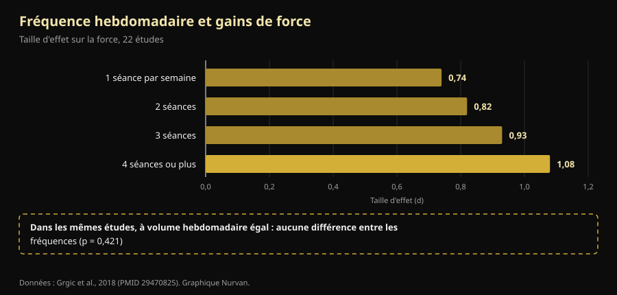

# Split d'entraînement : ce qui change vraiment entre débutant et avancé

Par [Giammaria Loi](/autore/giammaria-loi) · mis à jour le 9 octobre 2026

Un coach australien a écrit une chose qu'on entend rarement en salle : le split n'est pas un programme qu'on choisit, c'est le résultat d'un calcul. Un débutant et un athlète avancé ne peuvent pas être placés d'office sur la même fréquence, parce qu'ils ne produisent pas le même stress. Nous avons repris les méta-analyses sur la fréquence d'entraînement : sa conclusion tient. Le chemin pour y arriver, non : l'une de ses quatre raisons est inversée par rapport à ce qu'on mesure en laboratoire, et le chiffre le plus important de toute la question est absent de la publication.

## L'essentiel

- **La fréquence optimale change réellement avec l'expérience, et elle est mesurée.** Chez les non-entraînés, les plus gros gains de force viennent en travaillant chaque groupe musculaire **3 jours par semaine** à 60 % du maximum ; chez les entraînés, on descend à **2 jours**, mais à 80 % (Rhea et al., 2003).
- **Mais la fréquence seule ne fait rien.** Quand le volume hebdomadaire est égalisé, la différence entre s'entraîner 1, 2, 3 ou 4 fois par semaine **disparaît** (p = 0,421). Elle compte parce qu'elle permet d'étaler le volume, pas parce que le muscle aimerait être stimulé souvent.
- **Le débutant ne génère pas moins de fatigue : il en génère plus par séance.** Lors des quatre premières séances, l'augmentation d'épaisseur musculaire est en grande partie un **gonflement dû aux dommages musculaires**, et ces dommages s'atténuent à mesure que l'on s'entraîne (Damas et al., 2018). C'est l'inverse de ce que dit la publication.
- **Un half body deux fois par semaine est bon pour un débutant, mais sous l'optimum.** La méta-analyse de 140 études indique 3 expositions hebdomadaires par groupe musculaire chez les non-entraînés, pas 2.
- **La partie nerveuse est réelle, mais ce n'est pas du « recrutement ».** Après 4 semaines, ce qui change c'est la **fréquence de décharge** des motoneurones (+3,3 impulsions par seconde) et les seuils de recrutement : le système nerveux apprend à piloter le muscle, il ne découvre pas de fibres nouvelles (Del Vecchio et al., 2019).

## Le vrai problème : un seul programme pour tout le monde

Quiconque a mis les pieds dans une salle connaît la scène : le même programme sur quatre jours donné au quinquagénaire qui a repris en janvier et au gars qui compétitionne. La publication de Dale Hansford attaque exactement cela, et la question qu'il pose est la bonne : non pas « quel split utiliser », mais « combien de stress cette personne produit-elle, combien de temps lui faut-il pour récupérer, et la prochaine séance sera-t-elle de qualité ? ».

Sauf que la recherche a une réponse plus simple et plus ennuyeuse que la réponse physiologique. Deux définitions d'abord : la **fréquence**, c'est le nombre de fois par semaine où un muscle est entraîné ; le **volume**, c'est le nombre total de séries efficaces qu'il reçoit dans la semaine. Deux choses différentes, confondues pendant des décennies.

## Ce que dit vraiment la recherche

### « La bonne fréquence change avec l'expérience » — **Confirmé**

C'est la partie la mieux documentée, et les chiffres sont anciens mais solides. Une méta-analyse de **140 études et 1 433 tailles d'effet** a cherché la dose optimale selon le niveau : chez les non-entraînés, le maximum arrive à une intensité moyenne de **60 % du maximum, 3 jours par semaine par groupe musculaire** ; chez les entraînés, le pic se déplace à **80 % du maximum, 2 jours par semaine** (Rhea et al., 2003).

Une seconde analyse, sur 177 études et 1 803 tailles d'effet, ajoute la troisième marche : les athlètes tirent le maximum d'une intensité moyenne de **85 % du maximum, 2 jours par semaine, mais avec 8 séries par groupe musculaire** au lieu de 4 (Peterson et al., 2005).

| Niveau | Intensité moyenne | Jours par semaine et par muscle | Séries par muscle |
|---|---|---|---|
| Non entraîné | 60 % du maximum | 3 | 4 |
| Entraîné (non athlète) | 80 % du maximum | 2 | 4 |
| Athlète | 85 % du maximum | 2 | 8 |

*Doses associées aux gains de force maximaux dans deux méta-analyses dose-réponse. Synthèse Nurvan d'après Rhea et al., 2003 et Peterson et al., 2005 : ce sont des moyennes de littérature, pas des prescriptions individuelles.*

Une chose saute aux yeux, que la publication ne relève pas : le sens. Avec l'expérience, la fréquence par muscle **baisse**, tandis que l'intensité et les séries montent. Et le débutant devrait être à 3 expositions hebdomadaires, pas aux 2 du half body proposé. Ce n'est pas une erreur grave — un half body bien exécuté bat n'importe quel programme optimal mal exécuté — mais c'est un écart réel.

### « Il faut une fréquence différente parce que le stress est différent » — **À préciser**

Voici le chiffre manquant. Une méta-analyse de 22 études a comparé les fréquences hebdomadaires : la taille d'effet sur la force croît sagement avec la fréquence, de 0,74 à une séance par semaine jusqu'à 1,08 à quatre ou plus. On dirait la preuve définitive que plus souvent, c'est mieux.

Puis les auteurs ont isolé les seules études où le **volume total était identique** entre les groupes. Là, l'effet de la fréquence **disparaît** (p = 0,421). Traduction : ceux qui s'entraînaient quatre fois par semaine progressaient davantage parce que quatre séances contenaient plus de séries, pas parce qu'elles étaient mieux réparties (Grgic et al., 2018).

*L'encadré du bas est le cœur de l'article : l'escalier de gauche est un effet du volume déguisé en effet de la fréquence. Données : Grgic et al., 2018 (22 études). Graphique Nurvan.*

Pour l'hypertrophie la conclusion est encore plus nette : 25 études, aucune différence significative entre fréquences hautes et basses à volume égal, même chez des sujets déjà entraînés (Schoenfeld et al., 2019). Et la méta-régression la plus récente et la plus fine — **67 études, 2 058 participants**, avec des modèles ajustés sur la durée du programme et le niveau — arrive au même endroit : le **volume** a une probabilité de 100 % d'avoir un effet positif sur la masse comme sur la force, tandis que la **fréquence** est compatible avec des effets négligeables sur l'hypertrophie et montre un effet réel mais à rendements fortement décroissants sur la force (Pelland et al., 2026).

Donc la conclusion de la publication — *le split est une conséquence de la programmation, pas le point de départ* — est juste, mais pour une autre raison : le split est le contenant dans lequel tu fais entrer le volume que tu peux tenir. Si les séries nécessaires ne rentrent pas en trois séances, tu en fais quatre. Pas parce que le muscle « doit être sollicité souvent ».

### « Le débutant génère moins de fatigue » — **Démenti**

C'est la partie qui se retourne. La publication dit que le débutant produit moins de fatigue systémique et moins de stress par séance, et qu'il peut donc répéter plus tôt. La première moitié ne tient pas.

Lors des **quatre premières séances** d'un programme, l'augmentation de surface de section mesurée à l'échographie est en grande partie un **gonflement dû aux dommages musculaires**, pas du tissu neuf. Il faut environ la dixième séance pour qu'apparaisse une hypertrophie modeste et réelle, et la dix-huitième environ pour qu'elle devienne le phénomène principal. Entre-temps, les dommages par séance **diminuent progressivement** précisément parce qu'on s'entraîne (Damas et al., 2018).

Le débutant n'a pas moins de dommages : il en a plus, et c'est pour cela qu'il ne peut pas descendre un escalier après sa première semaine de squats. Ce qu'il a en moins, c'est la **charge absolue** : moins de kilos déplacés au total, donc moins de stress sur les articulations, les tendons et le système nerveux. La conclusion pratique reste valable (le débutant peut répéter plus tôt), mais la raison est le tonnage, pas les dommages.

### « Le débutant recrute moins d'unités motrices » — **À préciser**

La publication range le recrutement d'unités motrices parmi les choses que le débutant « ne sait pas encore faire ». C'est une simplification répandue. Quand on enregistre les motoneurones avant et après quatre semaines d'entraînement, ce qui change surtout c'est la **fréquence de décharge** — en moyenne **+3,3 impulsions par seconde** lors de contractions sous-maximales — avec une **baisse des seuils de recrutement** : les unités motrices entrent en jeu à des niveaux de force plus bas (Del Vecchio et al., 2019). Ce n'est pas la découverte de fibres endormies : c'est le même parc de moteurs piloté plus fort et mieux synchronisé.

Il faut ajouter que le siège exact de ces adaptations — cortex, moelle, motoneurone — reste discuté, et les techniques actuelles ne permettent pas de trancher (Škarabot et al., 2021). Sur les mécanismes nerveux, mieux vaut être moins catégorique que les réseaux sociaux.

### « Sépare la fréquence du muscle de celle de l'exercice » — **À préciser**

L'idée est élégante : entraîner les jambes deux fois par semaine, mais avec le squat une fois et la presse l'autre, pour que le muscle travaille souvent et que le schéma moteur récupère plus longtemps. Aucune étude contrôlée n'a testé exactement cette structure, on ne peut donc pas la dire démontrée.

Ce qu'on sait, c'est que **la variation des exercices a un bon sens et un mauvais**. Une revue de 8 études sur 241 hommes conclut qu'une variation *systématique*, choisie sur des bases anatomiques et biomécaniques, peut améliorer l'hypertrophie régionale et la force dynamique maximale ; tandis qu'une variation *excessive et aléatoire*, avec des exercices changés sans cesse ou redondants entre eux, peut **compromettre** les gains (Kassiano et al., 2022). Alterner deux variantes de poussée sur un cycle de deux semaines est raisonnable ; changer d'exercice à chaque séance, non.

### « Le microcycle ne doit pas durer sept jours » — **Non vérifiable**

Le microcycle de cinq jours proposé pour les athlètes très avancés n'a aucune étude contrôlée pour l'appuyer, ni pour le contredire : PubMed ne contient pas de comparaison entre microcycles hebdomadaires et non hebdomadaires. C'est un choix d'organisation défendable, pas un résultat scientifique. En pratique, il a un coût à budgéter : un cycle qui dérive par rapport au calendrier se heurte au travail, à la famille et aux horaires de la salle, et une séance sautée pour cause d'agenda coûte plus cher que l'optimisation recherchée.

## Comment l'appliquer

1. **Pars du volume, pas des jours.** Décide combien de séries efficaces chaque groupe musculaire doit recevoir dans la semaine. Ensuite seulement, regarde en combien de jours elles tiennent sans séances de deux heures.
2. **Si tu débutes, vise 2-3 expositions par muscle.** Un half body deux fois par semaine convient très bien, et la littérature dit que trois serait encore mieux : la troisième exposition, même courte, est la façon la plus simple d'ajouter du volume sans rallonger les séances.
3. **Si tu es avancé, augmente d'abord les séries et l'intensité, puis les jours.** Les données sur les athlètes indiquent le double de séries par groupe à nombre de jours égal. Ajoute une séance quand les séries ne rentrent plus, pas par principe.
4. **Garde tes exercices principaux stables.** Change de variante pour des raisons précises (un point faible, une gêne, une progression bloquée), sur des cycles de semaines, pas de séances.
5. **Utilise un critère de qualité, pas le calendrier.** Si à la séance suivante les charges baissent et que le RIR — les répétitions qu'il te reste en réserve en fin de série — monte à poids égal, tu n'as pas récupéré : c'est l'information que réclame la publication et que presque personne n'enregistre.
6. **Les premières semaines, ne te fie pas au miroir.** Une bonne partie de ce que tu vois avant la dixième séance est du gonflement. Regarde les charges.

> ### 💡 Avec Nurvan
> **Le bon split est celui que tes chiffres supportent.** Nurvan compte tes séries par groupe musculaire semaine après semaine et enregistre charge, répétitions et RIR de chaque série : tu vois noir sur blanc si la deuxième séance de la semaine a vraiment été faite aux mêmes kilos que la première, ou si tu ne fais qu'accumuler de la fatigue. Les séries d'échauffement sont proposées automatiquement, et si tu as déjà un programme tu peux l'importer depuis un PDF, un Excel ou même une photo. [Essayer Nurvan](https://nurvan.app)

## Questions fréquentes

**Combien de fois par semaine faut-il entraîner un muscle ?**
Deux ou trois couvre presque toute la littérature. Chez les non-entraînés, le maximum mesuré est de 3 jours par semaine par groupe musculaire ; chez les entraînés, 2, avec plus de séries et plus d'intensité (Rhea et al., 2003 ; Peterson et al., 2005). À volume hebdomadaire égal, cependant, l'écart entre ces options est faible (Schoenfeld et al., 2019).

**Full body ou split ?**
Cela dépend du nombre de séries nécessaires et du temps disponible. Aucun n'est supérieur à volume égal : le full body étale peu de séries sur plus de jours, le split en concentre beaucoup sur peu. Choisis celui qui te permet de terminer ton volume sans séances interminables ni jours sautés. Si tu t'entraînes deux fois par semaine, le full body devient quasi obligatoire.

**Peut-on devenir fort en s'entraînant seulement 3 fois par semaine ?**
Oui. Dans les méta-analyses dose-réponse, le maximum pour les athlètes se situe à 2 jours par semaine par groupe musculaire : trois séances full body, ou un half body plus une séance complète, collent à ces chiffres (Peterson et al., 2005). La limite sera le volume total que tu arrives à caser en trois séances, pas la fréquence.

**Faut-il changer de programme chaque mois ?**
Non, et en changer trop souvent peut coûter des gains. Une variation systématique et motivée aide ; une variation permanente et aléatoire peut compromettre les résultats (Kassiano et al., 2022). Un exercice principal a besoin de plusieurs semaines pour montrer si la progression fonctionne.

## À lire aussi

- [Combien de répétitions pour la masse : le mythe du 8-12](/fr/blog/combien-de-repetitions-masse-musculaire)
- [Ectomorphe ou mésomorphe : le corps décide-t-il ?](/fr/blog/somatotype-ectomorphe-mesomorphe-masse-musculaire)
- [Faible répondeur : le poids de la génétique dans le muscle](/fr/blog/genetique-faibles-repondeurs)

## Sources

1. Rhea MR, Alvar BA, Burkett LN, Ball SD, 2003. *A meta-analysis to determine the dose response for strength development.* Med Sci Sports Exerc 35(3):456–464. PMID 12618576 — [doi:10.1249/01.MSS.0000053727.63505.D4](https://doi.org/10.1249/01.MSS.0000053727.63505.D4)
2. Peterson MD, Rhea MR, Alvar BA, 2005. *Applications of the dose-response for muscular strength development: a review of meta-analytic efficacy and reliability for designing training prescription.* J Strength Cond Res 19(4):950–958. PMID 16287373 — [doi:10.1519/R-16874.1](https://doi.org/10.1519/R-16874.1)
3. Grgic J, Schoenfeld BJ, Davies TB, Lazinica B, Krieger JW, Pedisic Z, 2018. *Effect of Resistance Training Frequency on Gains in Muscular Strength: A Systematic Review and Meta-Analysis.* Sports Med 48(5):1207–1220. PMID 29470825 — [doi:10.1007/s40279-018-0872-x](https://doi.org/10.1007/s40279-018-0872-x)
4. Schoenfeld BJ, Grgic J, Krieger J, 2019. *How many times per week should a muscle be trained to maximize muscle hypertrophy? A systematic review and meta-analysis of studies examining the effects of resistance training frequency.* J Sports Sci 37(11):1286–1295. PMID 30558493 — [doi:10.1080/02640414.2018.1555906](https://doi.org/10.1080/02640414.2018.1555906)
5. Pelland JC, Remmert JF, Robinson ZP, Hinson SR, Zourdos MC, 2026. *The Resistance Training Dose Response: Meta-Regressions Exploring the Effects of Weekly Volume and Frequency on Muscle Hypertrophy and Strength Gains.* Sports Med 56(2):481–505. PMID 41343037 — [doi:10.1007/s40279-025-02344-w](https://doi.org/10.1007/s40279-025-02344-w)
6. Damas F, Libardi CA, Ugrinowitsch C, 2018. *The development of skeletal muscle hypertrophy through resistance training: the role of muscle damage and muscle protein synthesis.* Eur J Appl Physiol 118(3):485–500. PMID 29282529 — [doi:10.1007/s00421-017-3792-9](https://doi.org/10.1007/s00421-017-3792-9)
7. Del Vecchio A, Casolo A, Negro F, et al., 2019. *The increase in muscle force after 4 weeks of strength training is mediated by adaptations in motor unit recruitment and rate coding.* J Physiol 597(7):1873–1887. PMID 30727028 — [doi:10.1113/JP277250](https://doi.org/10.1113/JP277250)
8. Kassiano W, Nunes JP, Costa B, Ribeiro AS, Schoenfeld BJ, Cyrino ES, 2022. *Does Varying Resistance Exercises Promote Superior Muscle Hypertrophy and Strength Gains? A Systematic Review.* J Strength Cond Res 36(6):1753–1762. PMID 35438660 — [doi:10.1519/JSC.0000000000004258](https://doi.org/10.1519/JSC.0000000000004258)
9. Škarabot J, Brownstein CG, Casolo A, Del Vecchio A, Ansdell P, 2021. *The knowns and unknowns of neural adaptations to resistance training.* Eur J Appl Physiol 121(3):675–685. PMID 33355714 — [doi:10.1007/s00421-020-04567-3](https://doi.org/10.1007/s00421-020-04567-3)

Métadonnées et résumés récupérés sur PubMed. Point de départ : publication de [Dale Hansford (@coach_dalehansford)](https://www.instagram.com/p/DdnB85NFZca/) du 23 septembre 2026. Aucun texte, image ou structure de la publication n'a été reproduit : les affirmations ont été extraites, réécrites et vérifiées de façon indépendante.

---

**Giammaria Loi** est le fondateur de Nurvan. Il soulève des poids depuis 2012, travaille comme entraîneur personnel et coach certifié FIPE depuis 2013 et participe à des compétitions de powerlifting au niveau national depuis 2018. Chaque article qu'il signe part des études scientifiques et aboutit à ce qui fonctionne vraiment en salle.

> Note : contenu informatif, ne remplace pas l'avis d'un médecin ou d'un professionnel. En cas de pathologie, de blessure en cours ou de reprise après un long arrêt, faites évaluer votre programme par un professionnel qualifié.
