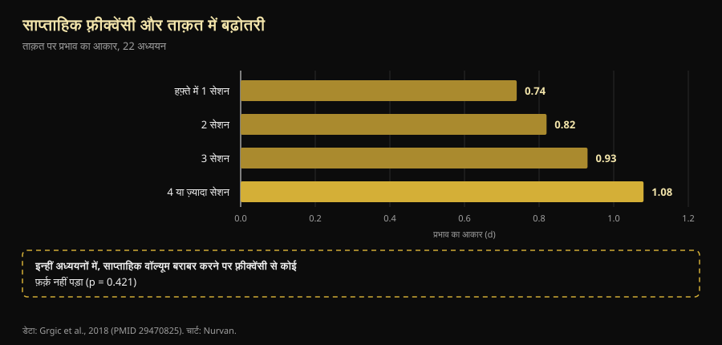

# ट्रेनिंग स्प्लिट: बिगिनर से एडवांस्ड तक असल में क्या बदलता है

लेखक: [Giammaria Loi](/autore/giammaria-loi) · अपडेट 9 अक्टूबर 2026

एक ऑस्ट्रेलियाई कोच ने वह बात लिखी जो जिम में कम ही सुनाई देती है: स्प्लिट कोई प्लान नहीं जिसे आप चुनते हैं, वह एक हिसाब का नतीजा है। एक बिगिनर और एक एडवांस्ड एथलीट को अपने-आप एक ही फ़्रीक्वेंसी पर नहीं रखा जा सकता, क्योंकि दोनों एक जैसा स्ट्रेस पैदा नहीं करते। हमने ट्रेनिंग फ़्रीक्वेंसी पर हुए मेटा-विश्लेषण खंगाले: उनका निष्कर्ष टिकता है। वहाँ तक पहुँचने का रास्ता नहीं — उनके गिनाए चार कारणों में से एक लैब में मापी गई चीज़ से ठीक उल्टा है, और पूरे मसले का सबसे अहम आँकड़ा पोस्ट में है ही नहीं।

## संक्षेप में

- **सही फ़्रीक्वेंसी वाक़ई अनुभव के साथ बदलती है, और यह मापी जा चुकी है।** बिना ट्रेनिंग वालों में सबसे ज़्यादा ताक़त तब बढ़ती है जब हर मसल ग्रुप हफ़्ते में **3 दिन** अधिकतम भार के 60% पर ट्रेन हो; ट्रेंड लोगों में यह **2 दिन** रह जाता है, पर 80% पर (Rhea et al., 2003)।
- **लेकिन अकेली फ़्रीक्वेंसी कुछ नहीं करती।** हफ़्ते का कुल वॉल्यूम बराबर कर देने पर 1, 2, 3 या 4 बार ट्रेन करने का फ़र्क़ **ग़ायब हो जाता है** (p = 0.421)। यह इसलिए मायने रखती है कि वॉल्यूम फैलाने देती है, इसलिए नहीं कि मसल को बार-बार उत्तेजना चाहिए।
- **बिगिनर कम थकान नहीं बनाता: प्रति सेशन ज़्यादा बनाता है।** पहले चार सेशन में मसल की मोटाई का बढ़ना बड़े हिस्से में **मसल डैमेज से आई सूजन** होता है, और ट्रेनिंग जारी रखने पर यह डैमेज घटता जाता है (Damas et al., 2018)। यह पोस्ट के दावे के उलट है।
- **बिगिनर के लिए हफ़्ते में दो बार अपर/लोअर अच्छा है, पर इष्टतम से कम।** 140 अध्ययनों के मेटा-विश्लेषण के मुताबिक़ बिना ट्रेनिंग वालों के लिए हर मसल ग्रुप पर हफ़्ते में 3 एक्सपोज़र चाहिए, 2 नहीं।
- **न्यूरल हिस्सा सच है, पर वह "रिक्रूटमेंट" नहीं है।** 4 हफ़्ते बाद मोटर न्यूरॉन की **डिस्चार्ज दर** (+3.3 पल्स प्रति सेकंड) और रिक्रूटमेंट थ्रेशोल्ड बदलते हैं: नर्वस सिस्टम मसल को चलाना सीखता है, नए फ़ाइबर नहीं खोजता (Del Vecchio et al., 2019)।

## असली समस्या: सबके लिए एक ही प्लान

जिम में क़दम रखने वाला हर शख़्स यह दृश्य जानता है: वही चार-दिन का टेम्पलेट उस पचास साल के आदमी को भी, जो जनवरी में लौटा है, और उस लड़के को भी जो कॉम्पिटिशन करता है। डेल हैंसफ़ोर्ड की पोस्ट ठीक इसी पर चोट करती है, और उनका सवाल सही है: "कौन-सा स्प्लिट लूँ" नहीं, बल्कि "यह व्यक्ति कितना स्ट्रेस पैदा करता है, उसे रिकवर होने में कितना लगता है, और अगला सेशन सही ढंग से हो पाएगा या नहीं"।

पेच यह है कि रिसर्च के पास फ़िज़ियोलॉजी वाले जवाब से ज़्यादा सरल और ज़्यादा उबाऊ जवाब है। पहले दो शब्द: **फ़्रीक्वेंसी** यानी हफ़्ते में कितनी बार एक मसल ट्रेन होती है; **वॉल्यूम** यानी पूरे हफ़्ते में उसे कुल कितने असरदार सेट मिलते हैं। ये अलग चीज़ें हैं, और दशकों तक इन्हें मिला दिया गया।

## रिसर्च असल में क्या कहती है

### "सही फ़्रीक्वेंसी अनुभव के साथ बदलती है" — **पुष्ट**

यह पोस्ट का सबसे मज़बूत हिस्सा है, और आँकड़े पुराने ज़रूर हैं पर ठोस। **140 अध्ययनों और 1,433 इफ़ेक्ट साइज़** के एक मेटा-विश्लेषण ने स्तर के हिसाब से इष्टतम ख़ुराक खोजी: बिना ट्रेनिंग वालों में अधिकतम लाभ औसत तीव्रता **अधिकतम भार के 60%, हर मसल ग्रुप पर हफ़्ते में 3 दिन** पर मिला; ट्रेंड लोगों में शिखर खिसककर **अधिकतम भार के 80%, हफ़्ते में 2 दिन** पर आ गया (Rhea et al., 2003)।

177 अध्ययनों और 1,803 इफ़ेक्ट साइज़ वाला दूसरा विश्लेषण तीसरी सीढ़ी जोड़ता है: एथलीटों को सबसे ज़्यादा फ़ायदा औसत तीव्रता **अधिकतम भार के 85%, हफ़्ते में 2 दिन, पर हर मसल ग्रुप पर 4 के बजाय 8 सेट** से मिलता है (Peterson et al., 2005)।

| स्तर | औसत तीव्रता | हर मसल पर हफ़्ते में दिन | हर मसल पर सेट |
|---|---|---|---|
| बिना ट्रेनिंग | अधिकतम भार का 60% | 3 | 4 |
| ट्रेंड (एथलीट नहीं) | अधिकतम भार का 80% | 2 | 4 |
| एथलीट | अधिकतम भार का 85% | 2 | 8 |

*दो डोज़-रिस्पॉन्स मेटा-विश्लेषणों में अधिकतम ताक़त वृद्धि से जुड़ी ख़ुराकें। Nurvan का सार, स्रोत Rhea et al., 2003 और Peterson et al., 2005: ये साहित्य के औसत हैं, व्यक्तिगत नुस्ख़े नहीं।*

एक बात तुरंत दिखती है जो पोस्ट नहीं बताती: दिशा। अनुभव बढ़ने के साथ प्रति मसल फ़्रीक्वेंसी **घटती** है, जबकि तीव्रता और सेट बढ़ते हैं। और बिगिनर को हफ़्ते में 3 एक्सपोज़र पर होना चाहिए, प्रस्तावित अपर/लोअर के 2 पर नहीं। यह गंभीर ग़लती नहीं — ढंग से किया गया अपर/लोअर किसी भी बेढंगे "इष्टतम" प्लान से बेहतर है — पर फ़र्क़ असली है।

### "स्ट्रेस अलग है इसलिए फ़्रीक्वेंसी अलग चाहिए" — **स्पष्टीकरण ज़रूरी**

अब वह आँकड़ा जो ग़ायब है। 22 अध्ययनों के एक मेटा-विश्लेषण ने साप्ताहिक फ़्रीक्वेंसी की तुलना की: ताक़त पर इफ़ेक्ट साइज़ क़रीने से बढ़ता है, हफ़्ते में एक सेशन पर 0.74 से लेकर चार या ज़्यादा पर 1.08 तक। लगता है जैसे यह पक्का सबूत हो कि ज़्यादा बार बेहतर है।

फिर लेखकों ने सिर्फ़ वे अध्ययन अलग किए जिनमें समूहों के बीच **कुल वॉल्यूम बराबर** था। वहाँ फ़्रीक्वेंसी का असर **ग़ायब हो जाता है** (p = 0.421)। मतलब: हफ़्ते में चार बार ट्रेन करने वाले इसलिए आगे थे कि चार सेशन में ज़्यादा सेट समा गए, इसलिए नहीं कि सेट बेहतर बँटे थे (Grgic et al., 2018)।

*नीचे का बॉक्स ही इस लेख की बात है: बाईं ओर की साफ़-सुथरी सीढ़ी दरअसल वॉल्यूम का असर है, जो फ़्रीक्वेंसी का भेस धरे हुए है। डेटा: Grgic et al., 2018 (22 अध्ययन)। चार्ट: Nurvan।*

हाइपरट्रॉफ़ी पर नतीजा और भी साफ़ है: 25 अध्ययन, वॉल्यूम बराबर होने पर ऊँची और नीची फ़्रीक्वेंसी में कोई सार्थक अंतर नहीं, ट्रेंड लोगों में भी नहीं (Schoenfeld et al., 2019)। और सबसे नया व सबसे बारीक मेटा-रिग्रेशन — **67 अध्ययन, 2,058 प्रतिभागी**, मॉडल प्रोग्राम की अवधि और ट्रेनिंग स्तर के लिए समायोजित — उसी जगह पहुँचता है: **वॉल्यूम** का साइज़ और ताक़त दोनों पर सकारात्मक असर होने की प्रायिकता 100% है, जबकि **फ़्रीक्वेंसी** हाइपरट्रॉफ़ी पर नगण्य असर के अनुरूप है और ताक़त पर असली मगर तेज़ी से घटते प्रतिफल वाला असर रखती है (Pelland et al., 2026)।

तो पोस्ट का निष्कर्ष — *स्प्लिट प्रोग्राम डिज़ाइन का नतीजा है, शुरुआती बिंदु नहीं* — सही है, पर वजह अलग है: स्प्लिट वह बर्तन है जिसमें आप वह वॉल्यूम भरते हैं जिसे आप निभा सकते हैं। अगर ज़रूरी सेट तीन सेशन में नहीं समाते, तो चार कीजिए। इसलिए नहीं कि मसल को "बार-बार हिट करना" ज़रूरी है।

### "बिगिनर कम थकान पैदा करता है" — **ग़लत साबित**

यहाँ बात पलट जाती है। पोस्ट कहती है कि बिगिनर कम सिस्टमिक थकान और कम स्ट्रेस पैदा करता है, इसलिए जल्दी दोहरा सकता है। पहला आधा हिस्सा टिकता नहीं।

किसी प्रोग्राम के **पहले चार सेशन** में अल्ट्रासाउंड पर दिखने वाली मसल क्रॉस-सेक्शन की बढ़त बड़े हिस्से में **मसल डैमेज से आई सूजन** होती है, नया ऊतक नहीं। मामूली पर असली हाइपरट्रॉफ़ी दिखने में लगभग दसवाँ सेशन लगता है, और मुख्य परिघटना बनने में क़रीब अठारहवाँ। इस बीच प्रति सेशन डैमेज **लगातार घटता** है, ठीक इसलिए कि आप ट्रेन करते रहते हैं (Damas et al., 2018)।

शुरुआत करने वाले को डैमेज कम नहीं, ज़्यादा होता है — इसीलिए स्क्वाट के पहले हफ़्ते के बाद सीढ़ियाँ उतरना मुश्किल हो जाता है। उसके पास कम होता है **निरपेक्ष भार**: कुल किलो कम उठते हैं, इसलिए जोड़ों, टेंडन और नर्वस सिस्टम पर दबाव कम पड़ता है। पोस्ट का व्यावहारिक निष्कर्ष बना रहता है (बिगिनर जल्दी दोहरा सकता है), पर वजह कुल टनभार है, डैमेज नहीं।

### "बिगिनर कम मोटर यूनिट रिक्रूट करता है" — **स्पष्टीकरण ज़रूरी**

पोस्ट मोटर यूनिट रिक्रूटमेंट को उन चीज़ों में गिनती है जो बिगिनर "अभी नहीं कर पाता"। यह एक आम सरलीकरण है। जब चार हफ़्ते की ट्रेनिंग से पहले और बाद अलग-अलग मोटर न्यूरॉन रिकॉर्ड किए जाते हैं, तो सबसे ज़्यादा बदलती है **डिस्चार्ज दर** — सबमैक्सिमल संकुचन में औसतन **+3.3 पल्स प्रति सेकंड** — साथ ही **रिक्रूटमेंट थ्रेशोल्ड घटते हैं**, यानी मोटर यूनिट कम बल पर ही काम में आ जाती हैं (Del Vecchio et al., 2019)। यह सोए हुए फ़ाइबर की खोज नहीं है: वही इंजन हैं, बस ज़्यादा ज़ोर से और बेहतर टाइमिंग के साथ चलाए जा रहे हैं।

यह भी जोड़ना चाहिए कि ये अनुकूलन ठीक कहाँ होते हैं — कॉर्टेक्स, स्पाइनल कॉर्ड या मोटर न्यूरॉन — इस पर बहस जारी है, और मौजूदा तकनीकें इसका फ़ैसला नहीं कर पातीं (Škarabot et al., 2021)। न्यूरल तंत्र के मामले में सोशल मीडिया जितनी निश्चितता दिखाता है, उससे कम रखना बेहतर है।

### "मसल की फ़्रीक्वेंसी को एक्सरसाइज़ की फ़्रीक्वेंसी से अलग करो" — **स्पष्टीकरण ज़रूरी**

विचार सुंदर है: टाँगें हफ़्ते में दो बार, पर एक बार स्क्वाट और दूसरी बार लेग प्रेस, ताकि मसल बार-बार काम करे और ख़ास मूवमेंट पैटर्न को ज़्यादा रिकवरी मिले। किसी नियंत्रित अध्ययन ने ठीक यही ढाँचा नहीं परखा है, इसलिए इसे सिद्ध नहीं कहा जा सकता।

जो पता है वह यह कि **एक्सरसाइज़ बदलने की एक सही दिशा है और एक ग़लत**। 241 पुरुषों पर हुए 8 अध्ययनों की समीक्षा का निष्कर्ष है कि शरीर-रचना और बायोमैकेनिक्स के आधार पर चुनी गई *व्यवस्थित* विविधता क्षेत्रीय हाइपरट्रॉफ़ी और अधिकतम डायनामिक ताक़त सुधार सकती है; जबकि *अत्यधिक और बेतरतीब* विविधता — लगातार बदलती या आपस में दोहराव वाली एक्सरसाइज़ — लाभ को **नुक़सान** पहुँचा सकती है (Kassiano et al., 2022)। दो हफ़्ते के चक्र में दो पुश वैरिएशन घुमाना समझदारी है; हर सेशन में एक्सरसाइज़ बदलना नहीं।

### "माइक्रोसाइकल सात दिन का ही हो, ज़रूरी नहीं" — **असत्यापनीय**

बहुत एडवांस्ड एथलीटों के लिए पोस्ट जो पाँच-दिन का माइक्रोसाइकल सुझाती है, उसके पक्ष में कोई नियंत्रित अध्ययन नहीं है — और विपक्ष में भी नहीं: PubMed पर साप्ताहिक और ग़ैर-साप्ताहिक माइक्रोसाइकल की तुलना मौजूद नहीं। यह एक बचाव-योग्य संगठनात्मक चुनाव है, वैज्ञानिक नतीजा नहीं। व्यवहार में इसकी एक क़ीमत है जिसे हिसाब में लेना चाहिए: कैलेंडर से खिसकता चक्र नौकरी, परिवार और जिम के समय से टकराता है, और तारीख़ न बैठने की वजह से छूटा एक सेशन उस अनुकूलन से ज़्यादा महँगा पड़ता है जिसकी तलाश थी।

## इसे कैसे लागू करें

1. **वॉल्यूम से शुरू कीजिए, दिनों से नहीं।** तय कीजिए कि हर मसल ग्रुप को हफ़्ते में कितने असरदार सेट चाहिए। उसके बाद ही देखिए कि वे कितने दिनों में बिना दो-घंटे के सेशन के समा जाते हैं।
2. **शुरुआत कर रहे हैं तो हर मसल पर 2-3 एक्सपोज़र का लक्ष्य रखिए।** हफ़्ते में दो बार अपर/लोअर बिलकुल ठीक है, और साहित्य कहता है कि तीन और बेहतर होगा: तीसरा एक्सपोज़र, भले छोटा हो, सेशन लंबे किए बिना वॉल्यूम जोड़ने का सबसे आसान तरीक़ा है।
3. **एडवांस्ड हैं तो पहले सेट और तीव्रता बढ़ाइए, फिर दिन।** एथलीट डेटा उतने ही दिनों में प्रति मसल ग्रुप दोगुने सेट की ओर इशारा करता है। एक सेशन तब जोड़िए जब सेट समाना बंद कर दें, सिद्धांत के तौर पर नहीं।
4. **मुख्य लिफ़्ट स्थिर रखिए।** वैरिएशन ठोस कारणों से बदलिए (कोई कमज़ोर कड़ी, कोई तकलीफ़, रुकी हुई प्रगति) — हफ़्तों के चक्र में, हर सेशन में नहीं।
5. **कैलेंडर नहीं, गुणवत्ता का पैमाना इस्तेमाल कीजिए।** अगले सेशन में अगर वज़न गिरे और उसी भार पर RIR — यानी सेट के आख़िर में बचे हुए रेप्स — बढ़ जाए, तो आप रिकवर नहीं हुए हैं: यही वह जानकारी है जो पोस्ट माँगती है और जिसे लगभग कोई दर्ज नहीं करता।
6. **शुरुआती हफ़्तों में आईने पर भरोसा मत कीजिए।** दसवें सेशन से पहले जो दिखता है उसका बड़ा हिस्सा सूजन है। वज़न देखिए।

> ### 💡 Nurvan के साथ
> **सही स्प्लिट वही है जिसे आपके आँकड़े संभाल सकें।** Nurvan हफ़्ता-दर-हफ़्ता हर मसल ग्रुप के सेट गिनता है और हर सेट का वज़न, रेप्स और RIR दर्ज करता है: इससे साफ़ दिखता है कि हफ़्ते का दूसरा सेशन सचमुच पहले जितने किलो पर हुआ या आप सिर्फ़ थकान जमा कर रहे हैं। वॉर्म-अप सेट अपने-आप सुझाए जाते हैं, और अगर प्लान पहले से है तो उसे PDF, Excel या फ़ोटो से भी इम्पोर्ट किया जा सकता है। [Nurvan आज़माइए](https://nurvan.app)

## अक्सर पूछे जाने वाले सवाल

**एक मसल को हफ़्ते में कितनी बार ट्रेन करना चाहिए?**
दो या तीन बार लगभग पूरे साहित्य को समेट लेता है। बिना ट्रेनिंग वालों में मापा गया शिखर हर मसल ग्रुप पर हफ़्ते में 3 दिन है; ट्रेंड लोगों में 2 दिन, पर ज़्यादा सेट और ज़्यादा तीव्रता के साथ (Rhea et al., 2003; Peterson et al., 2005)। हालाँकि साप्ताहिक वॉल्यूम बराबर होने पर इन विकल्पों का फ़र्क़ छोटा है (Schoenfeld et al., 2019)।

**फुल बॉडी बेहतर है या स्प्लिट?**
यह इस पर निर्भर है कि आपको कितने सेट चाहिए और कितना समय है। वॉल्यूम बराबर हो तो कोई श्रेष्ठ नहीं: फुल बॉडी कम सेट ज़्यादा दिनों में फैलाता है, स्प्लिट ज़्यादा सेट कम दिनों में समेटता है। वह चुनिए जिससे आप अंतहीन सेशन और छूटे हुए दिनों के बिना अपना वॉल्यूम पूरा कर सकें। हफ़्ते में दो बार ट्रेन करते हैं तो फुल बॉडी लगभग अनिवार्य है।

**क्या हफ़्ते में सिर्फ़ 3 बार ट्रेन करके ताक़तवर बना जा सकता है?**
हाँ। डोज़-रिस्पॉन्स मेटा-विश्लेषणों में एथलीटों का शिखर हर मसल ग्रुप पर हफ़्ते में 2 दिन पर है: तीन फुल बॉडी सेशन, या अपर/लोअर/फुल का ढाँचा, इन आँकड़ों में फ़िट बैठते हैं (Peterson et al., 2005)। सीमा वह कुल वॉल्यूम होगा जो तीन सेशन में समा सके, फ़्रीक्वेंसी नहीं।

**क्या हर महीने प्लान बदलना चाहिए?**
नहीं, और बहुत बार बदलने से लाभ घट सकता है। व्यवस्थित और तर्कसंगत विविधता मदद करती है; लगातार और बेतरतीब बदलाव नतीजों को नुक़सान पहुँचा सकता है (Kassiano et al., 2022)। किसी मुख्य लिफ़्ट को यह दिखाने में कई हफ़्ते लगते हैं कि प्रगति का तरीक़ा काम कर रहा है या नहीं।

## यह भी पढ़ें

- [मसल्स के लिए कितने रेप्स? 8-12 का मिथक](/hi/blog/kitne-reps-muscle-ke-liye)
- [एक्टोमॉर्फ या मेसोमॉर्फ: बॉडी टाइप मसल तय करता है?](/hi/blog/body-type-ectomorph-mesomorph-muscle-growth)
- [लो रेस्पॉन्डर: मांसपेशियों के विकास में जेनेटिक्स की कितनी भूमिका है](/hi/blog/genetics-muscle-low-responders)

## स्रोत

1. Rhea MR, Alvar BA, Burkett LN, Ball SD, 2003. *A meta-analysis to determine the dose response for strength development.* Med Sci Sports Exerc 35(3):456–464. PMID 12618576 — [doi:10.1249/01.MSS.0000053727.63505.D4](https://doi.org/10.1249/01.MSS.0000053727.63505.D4)
2. Peterson MD, Rhea MR, Alvar BA, 2005. *Applications of the dose-response for muscular strength development: a review of meta-analytic efficacy and reliability for designing training prescription.* J Strength Cond Res 19(4):950–958. PMID 16287373 — [doi:10.1519/R-16874.1](https://doi.org/10.1519/R-16874.1)
3. Grgic J, Schoenfeld BJ, Davies TB, Lazinica B, Krieger JW, Pedisic Z, 2018. *Effect of Resistance Training Frequency on Gains in Muscular Strength: A Systematic Review and Meta-Analysis.* Sports Med 48(5):1207–1220. PMID 29470825 — [doi:10.1007/s40279-018-0872-x](https://doi.org/10.1007/s40279-018-0872-x)
4. Schoenfeld BJ, Grgic J, Krieger J, 2019. *How many times per week should a muscle be trained to maximize muscle hypertrophy? A systematic review and meta-analysis of studies examining the effects of resistance training frequency.* J Sports Sci 37(11):1286–1295. PMID 30558493 — [doi:10.1080/02640414.2018.1555906](https://doi.org/10.1080/02640414.2018.1555906)
5. Pelland JC, Remmert JF, Robinson ZP, Hinson SR, Zourdos MC, 2026. *The Resistance Training Dose Response: Meta-Regressions Exploring the Effects of Weekly Volume and Frequency on Muscle Hypertrophy and Strength Gains.* Sports Med 56(2):481–505. PMID 41343037 — [doi:10.1007/s40279-025-02344-w](https://doi.org/10.1007/s40279-025-02344-w)
6. Damas F, Libardi CA, Ugrinowitsch C, 2018. *The development of skeletal muscle hypertrophy through resistance training: the role of muscle damage and muscle protein synthesis.* Eur J Appl Physiol 118(3):485–500. PMID 29282529 — [doi:10.1007/s00421-017-3792-9](https://doi.org/10.1007/s00421-017-3792-9)
7. Del Vecchio A, Casolo A, Negro F, et al., 2019. *The increase in muscle force after 4 weeks of strength training is mediated by adaptations in motor unit recruitment and rate coding.* J Physiol 597(7):1873–1887. PMID 30727028 — [doi:10.1113/JP277250](https://doi.org/10.1113/JP277250)
8. Kassiano W, Nunes JP, Costa B, Ribeiro AS, Schoenfeld BJ, Cyrino ES, 2022. *Does Varying Resistance Exercises Promote Superior Muscle Hypertrophy and Strength Gains? A Systematic Review.* J Strength Cond Res 36(6):1753–1762. PMID 35438660 — [doi:10.1519/JSC.0000000000004258](https://doi.org/10.1519/JSC.0000000000004258)
9. Škarabot J, Brownstein CG, Casolo A, Del Vecchio A, Ansdell P, 2021. *The knowns and unknowns of neural adaptations to resistance training.* Eur J Appl Physiol 121(3):675–685. PMID 33355714 — [doi:10.1007/s00421-020-04567-3](https://doi.org/10.1007/s00421-020-04567-3)

मेटाडेटा और सार PubMed से लिए गए। शुरुआती प्रेरणा: [Dale Hansford (@coach_dalehansford)](https://www.instagram.com/p/DdnB85NFZca/) की 23 सितंबर 2026 की पोस्ट। पोस्ट का कोई टेक्स्ट, चित्र या ढाँचा दोहराया नहीं गया है: दावों को निकालकर, नए सिरे से लिखकर और स्वतंत्र रूप से जाँचकर प्रस्तुत किया गया है।

---

**Giammaria Loi** Nurvan के संस्थापक हैं। वे 2012 से वेट ट्रेनिंग कर रहे हैं, 2013 से FIPE-प्रमाणित पर्सनल ट्रेनर और कोच के रूप में काम करते हैं, और 2018 से राष्ट्रीय स्तर पर पावरलिफ़्टिंग में प्रतिस्पर्धा करते हैं। उनके हर लेख की शुरुआत शोध से होती है और अंत इस बात पर कि जिम में असल में क्या काम करता है।

> नोट: यह जानकारीपरक सामग्री है, किसी डॉक्टर या योग्य पेशेवर की राय का विकल्प नहीं। अगर आपको कोई बीमारी है, कोई चोट चल रही है, या आप लंबे अंतराल के बाद लौट रहे हैं, तो अपना प्लान किसी योग्य पेशेवर से जँचवाएँ।
