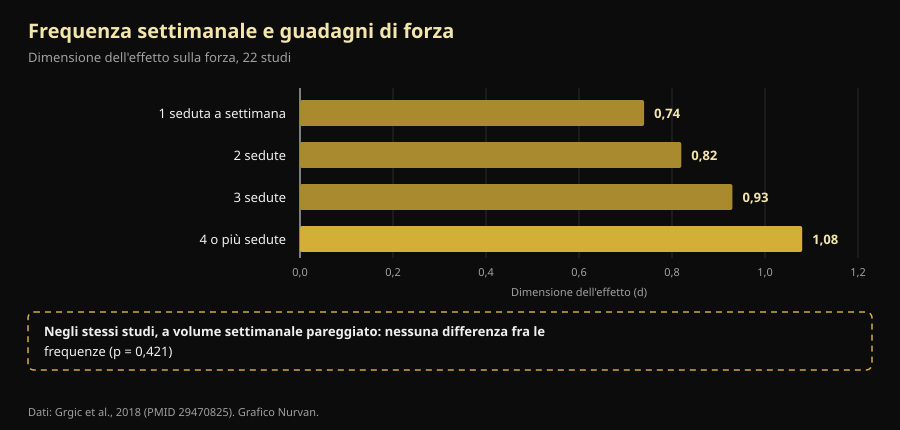

# Split di allenamento: cosa cambia davvero fra principiante e avanzato

Di [Giammaria Loi](/autore/giammaria-loi) · aggiornato il 9 ottobre 2026

Un coach australiano ha scritto una cosa che in palestra si sente raramente: lo split non è una scheda che scegli, è il risultato di un calcolo. Un principiante e un atleta avanzato non possono stare d'ufficio sulla stessa frequenza, perché non producono lo stesso stress. Siamo andati a controllare le meta-analisi sulla frequenza di allenamento, e la conclusione del post regge. Il percorso per arrivarci, no: uno dei quattro motivi che elenca è rovesciato rispetto a quello che si misura in laboratorio, e il numero più importante di tutta la questione nel post non c'è.

## In breve

- **La frequenza ottimale cambia davvero con l'esperienza, e in modo misurato.** Nelle persone non allenate il massimo dei guadagni di forza arriva allenando ogni gruppo muscolare **3 giorni a settimana** al 60% del massimale; negli allenati scende a **2 giorni** ma all'80% (Rhea et al., 2003).
- **Ma la frequenza, da sola, non fa nulla.** Quando il volume settimanale viene pareggiato, la differenza fra allenarsi 1, 2, 3 o 4 volte a settimana **sparisce** (p = 0,421). Conta perché ti permette di spalmare il volume, non perché il muscolo ami essere stimolato spesso.
- **Il principiante non genera meno fatica: ne genera di più, per seduta.** Nelle prime quattro sedute l'aumento di circonferenza è in gran parte **gonfiore da danno muscolare**, e il danno si attenua man mano che ti alleni (Damas et al., 2018). È l'opposto di quello che dice il post.
- **Un Upper/Lower due volte a settimana per il principiante è buono, ma è sotto l'ottimo.** La meta-analisi su 140 studi indica 3 esposizioni settimanali per gruppo muscolare nel non allenato, non 2.
- **La parte neurale è vera, ma non è "reclutamento".** Dopo 4 settimane di allenamento cambiano la **frequenza di scarica** dei motoneuroni (+3,3 impulsi al secondo) e le soglie di reclutamento: il sistema nervoso impara a guidare il muscolo, non a scoprire fibre nuove (Del Vecchio et al., 2019).

## Il problema vero: una scheda sola per tutti

Chiunque abbia messo piede in palestra conosce la scena: la stessa scheda a quattro giorni passata al cinquantenne che ha ripreso a gennaio e al ragazzo che gareggia. Il post di Dale Hansford attacca esattamente questo, e la domanda che propone è corretta: non "quale split uso", ma "quanto stress produce questa persona, quanto tempo le serve per recuperare, e la prossima seduta sarà fatta bene?".

Il punto è che la ricerca ha una risposta più semplice e più noiosa di quella fisiologica. Prima di arrivarci serve un termine: per **frequenza** si intende quante volte alla settimana un muscolo viene allenato; per **volume**, quante serie allenanti riceve in totale nella settimana. Sono due cose diverse, e per decenni sono state confuse.

## Cosa dice davvero la ricerca

### "La frequenza giusta cambia con l'esperienza" — **Confermato**

È la parte meglio documentata del post, e i numeri sono vecchi ma solidi. Una meta-analisi su **140 studi e 1.433 misure di effetto** ha cercato la dose ottimale di allenamento in base al livello: nelle persone non allenate il massimo guadagno di forza arriva a un'intensità media del **60% del massimale, 3 giorni a settimana per gruppo muscolare**; in chi è già allenato il massimo si sposta all'**80% del massimale, 2 giorni a settimana** (Rhea et al., 2003).

Una seconda analisi, su 177 studi e 1.803 misure, aggiunge il terzo gradino: gli atleti traggono il massimo da un'intensità media dell'**85% del massimale, 2 giorni a settimana, ma con 8 serie per gruppo muscolare** invece di 4 (Peterson et al., 2005).

| Livello | Intensità media | Giorni a settimana per gruppo | Serie per gruppo |
|---|---|---|---|
| Non allenato | 60% del massimale | 3 | 4 |
| Allenato (non atleta) | 80% del massimale | 2 | 4 |
| Atleta | 85% del massimale | 2 | 8 |

*Dosi associate ai guadagni di forza massimi in due meta-analisi sulla relazione dose-risposta. Sintesi Nurvan da Rhea et al., 2003 e Peterson et al., 2005: sono medie di letteratura, non prescrizioni individuali.*

Si vede subito una cosa che il post non nota: la direzione. Andando avanti con l'esperienza la frequenza per muscolo **scende**, mentre salgono intensità e serie. E il principiante dovrebbe stare a 3 esposizioni settimanali, non a 2 come nell'Upper/Lower proposto nel post. Non è un errore grave — un Upper/Lower fatto bene batte qualsiasi scheda ottimale fatta male — ma è una differenza reale.

### "Serve una frequenza diversa perché lo stress è diverso" — **Da precisare**

Qui arriva il numero che manca. Una meta-analisi su 22 studi ha confrontato le frequenze settimanali: la dimensione dell'effetto sulla forza cresce in modo ordinato con la frequenza, da 0,74 a una seduta a settimana fino a 1,08 a quattro o più. Sembra la prova definitiva che allenarsi più spesso sia meglio.

Poi gli autori hanno isolato i soli studi in cui il **volume totale era lo stesso** fra i gruppi. Lì l'effetto della frequenza **scompare** (p = 0,421). Tradotto: chi si allenava quattro volte a settimana andava meglio perché in quattro sedute faceva più serie, non perché le avesse distribuite meglio (Grgic et al., 2018).

*Il riquadro in basso è il punto dell'articolo: la scala che sale a sinistra è un effetto del volume travestito da effetto della frequenza. Dati: Grgic et al., 2018 (22 studi). Grafico Nurvan.*

Sull'ipertrofia la conclusione è ancora più netta: 25 studi, nessuna differenza significativa fra frequenze alte e basse a volume pari, nemmeno nei soggetti già allenati (Schoenfeld et al., 2019). E la meta-regressione più recente e più sofisticata — **67 studi, 2.058 partecipanti**, con i modelli corretti per durata del programma e livello di allenamento — arriva allo stesso posto: il **volume** ha una probabilità del 100% di avere un effetto positivo sia sulla massa sia sulla forza, mentre la **frequenza** ha effetti compatibili con lo zero sull'ipertrofia e un effetto reale ma con forti rendimenti decrescenti sulla forza (Pelland et al., 2026).

Quindi la conclusione del post — *lo split è una conseguenza della programmazione, non il punto di partenza* — è giusta, ma per un motivo diverso: lo split è il contenitore in cui fai entrare il volume che riesci a sostenere. Se le serie che ti servono non stanno in tre sedute, ne fai quattro. Non perché il muscolo "vada colpito spesso".

### "Il principiante genera meno fatica" — **Smentito**

Questa è la parte che si rovescia. Il post dice che il principiante produce meno fatica sistemica e meno stress per seduta, e che quindi può ripetere prima. La prima metà non regge.

Nelle **prime quattro sedute** di un programma, l'aumento di sezione trasversa del muscolo che si misura con l'ecografia è in gran parte **gonfiore dovuto al danno muscolare**, non muscolo nuovo. Serve circa la decima seduta perché compaia un'ipertrofia modesta e reale, e intorno alla diciottesima perché diventi il fenomeno principale. Nel frattempo il danno muscolare per seduta **si riduce progressivamente** proprio perché ti alleni (Damas et al., 2018).

Chi inizia non ha meno danno: ne ha di più, ed è il motivo per cui dopo la prima settimana di squat non riesce a scendere le scale. Quello che ha di meno è il **carico assoluto**: solleva meno chili totali, e quindi stressa meno articolazioni, tendini e sistema nervoso. La conclusione pratica del post resta valida (il principiante può ripetere prima), ma la ragione è il tonnellaggio, non il danno.

### "Il principiante recluta meno unità motorie" — **Da precisare**

Il post elenca il reclutamento di unità motorie fra le cose che il principiante "non sa ancora fare". È una semplificazione diffusa. Quando si registrano i singoli motoneuroni prima e dopo quattro settimane di allenamento, quello che cambia è soprattutto la **frequenza di scarica** — in media **+3,3 impulsi al secondo** durante contrazioni sottomassimali — insieme a una **riduzione delle soglie di reclutamento**, cioè le unità motorie entrano in gioco a livelli di forza più bassi (Del Vecchio et al., 2019). Non è una scoperta di fibre dormienti: è lo stesso parco motori guidato con più intensità e con tempi migliori.

Va anche detto che la sede precisa di questi adattamenti — corteccia, midollo, motoneurone — resta in discussione, e le tecniche disponibili non permettono ancora di stabilirla con certezza (Škarabot et al., 2021). Sui meccanismi neurali conviene essere meno sicuri di quanto si sia in genere sui social.

### "Separa la frequenza del muscolo da quella dell'esercizio" — **Da precisare**

L'idea è elegante: allenare le gambe due volte a settimana, ma con lo squat solo una volta e la pressa l'altra, così il muscolo lavora spesso e il pattern specifico recupera di più. Nessuno studio controllato ha testato esattamente questa struttura, quindi non si può dire che sia dimostrata.

Quello che si sa è che **la variazione degli esercizi ha un verso giusto e uno sbagliato**. Una revisione di 8 studi su 241 uomini conclude che una variazione *sistematica*, scelta su basi anatomiche e biomeccaniche, può migliorare l'ipertrofia regionale e la forza dinamica massimale; mentre una variazione *eccessiva e casuale*, con esercizi cambiati di continuo o ridondanti fra loro, può **compromettere** i guadagni (Kassiano et al., 2022). Ruotare due varianti di spinta su un ciclo di due settimane è ragionevole; cambiare esercizio ogni seduta no.

### "Il microciclo non deve durare sette giorni" — **Non verificabile**

Il microciclo da cinque giorni che il post propone per gli atleti molto avanzati non ha studi controllati a sostegno, e nemmeno contro: su PubMed non si trovano confronti fra microcicli settimanali e non settimanali. È una scelta organizzativa difendibile, non un risultato scientifico. Nella pratica ha un costo che vale la pena mettere in conto: un ciclo che scorre rispetto al calendario litiga con il lavoro, con la famiglia e con gli orari della palestra, e una seduta saltata per incastri sbagliati pesa più dell'ottimizzazione che stavi cercando.

## Come applicarlo

1. **Parti dal volume, non dai giorni.** Decidi quante serie allenanti vuoi per ogni gruppo muscolare in una settimana. Solo dopo guarda in quanti giorni ci stanno senza sedute da due ore.
2. **Se sei alle prime armi, punta a 2-3 esposizioni per muscolo.** Un Upper/Lower due volte a settimana va benissimo e la letteratura dice che tre sarebbe ancora meglio: la terza esposizione, anche breve, è il modo più facile di aggiungere volume senza allungare le sedute.
3. **Se sei avanzato, aumenta prima le serie e l'intensità, poi i giorni.** I dati su atleti indicano il doppio delle serie per gruppo a parità di giorni. Aggiungi una seduta quando le serie non ci stanno più, non per principio.
4. **Tieni gli esercizi principali stabili.** Cambia variante per ragioni precise (un punto debole, un fastidio, un blocco nella progressione), su cicli di settimane, non di sedute.
5. **Usa un criterio di qualità, non il calendario.** Se nella seduta successiva i carichi scendono e il RIR — le ripetizioni che ti restano nel serbatoio a fine serie — si alza a parità di peso, non hai recuperato: quella è l'informazione che il post chiede e che quasi nessuno registra.
6. **Nelle prime settimane non fidarti dello specchio.** Buona parte di quello che vedi prima della decima seduta è gonfiore. Guarda i carichi.

> ### 💡 Con Nurvan
> **Lo split giusto è quello che i tuoi numeri reggono.** Nurvan tiene il conto delle serie per gruppo muscolare settimana per settimana, e registra carico, ripetizioni e RIR di ogni serie: così vedi nero su bianco se la seconda seduta della settimana è davvero fatta con gli stessi chili della prima o se stai solo accumulando fatica. Le serie di riscaldamento vengono proposte in automatico, e se hai già una scheda puoi importarla da PDF, Excel o anche da una foto. [Prova Nurvan](https://nurvan.app)

## Domande frequenti

**Quante volte a settimana devo allenare un muscolo?**
Due o tre volte è il range in cui si muove quasi tutta la letteratura. Nelle persone non allenate il massimo misurato è 3 giorni a settimana per gruppo muscolare; negli allenati 2, con più serie e più intensità (Rhea et al., 2003; Peterson et al., 2005). A parità di volume settimanale totale, però, la differenza fra queste opzioni è piccola (Schoenfeld et al., 2019).

**È meglio un full body o uno split?**
Dipende da quante serie ti servono e da quanto tempo hai. Non esiste una superiorità dell'uno sull'altro a volume pari: il full body concentra poche serie su più giorni, lo split ne concentra molte su pochi. Scegli quello che ti permette di completare il volume senza sedute infinite e senza saltare giorni. Se ti alleni due volte a settimana, il full body diventa quasi obbligato.

**Se mi alleno solo 3 volte a settimana posso diventare forte?**
Sì. Nelle meta-analisi dose-risposta il massimo per gli atleti è associato a 2 giorni a settimana per gruppo muscolare: tre sedute full body o un Upper/Lower/Full sono strutture compatibili con quei numeri (Peterson et al., 2005). Il limite sarà il volume totale che riesci a far entrare in tre sedute, non la frequenza.

**Devo cambiare scheda ogni mese?**
No, e cambiarla troppo spesso può costare guadagni. La variazione sistematica e motivata aiuta; quella continua e casuale può compromettere i risultati (Kassiano et al., 2022). Un esercizio principale ha bisogno di diverse settimane per mostrare se la progressione funziona.

## Leggi anche

- [Ripetizioni, serie e recupero: cosa serve davvero per l'ipertrofia](/blog/ripetizioni-serie-recupero-ipertrofia)
- [Ectomorfo o mesomorfo: il somatotipo decide quanto cresci?](/blog/somatotipo-ectomorfo-mesomorfo-massa-muscolare)
- [Genetica, high e low responder: quanto conta davvero](/blog/genetica-high-low-responder)

## Fonti

1. Rhea MR, Alvar BA, Burkett LN, Ball SD, 2003. *A meta-analysis to determine the dose response for strength development.* Med Sci Sports Exerc 35(3):456–464. PMID 12618576 — [doi:10.1249/01.MSS.0000053727.63505.D4](https://doi.org/10.1249/01.MSS.0000053727.63505.D4)
2. Peterson MD, Rhea MR, Alvar BA, 2005. *Applications of the dose-response for muscular strength development: a review of meta-analytic efficacy and reliability for designing training prescription.* J Strength Cond Res 19(4):950–958. PMID 16287373 — [doi:10.1519/R-16874.1](https://doi.org/10.1519/R-16874.1)
3. Grgic J, Schoenfeld BJ, Davies TB, Lazinica B, Krieger JW, Pedisic Z, 2018. *Effect of Resistance Training Frequency on Gains in Muscular Strength: A Systematic Review and Meta-Analysis.* Sports Med 48(5):1207–1220. PMID 29470825 — [doi:10.1007/s40279-018-0872-x](https://doi.org/10.1007/s40279-018-0872-x)
4. Schoenfeld BJ, Grgic J, Krieger J, 2019. *How many times per week should a muscle be trained to maximize muscle hypertrophy? A systematic review and meta-analysis of studies examining the effects of resistance training frequency.* J Sports Sci 37(11):1286–1295. PMID 30558493 — [doi:10.1080/02640414.2018.1555906](https://doi.org/10.1080/02640414.2018.1555906)
5. Pelland JC, Remmert JF, Robinson ZP, Hinson SR, Zourdos MC, 2026. *The Resistance Training Dose Response: Meta-Regressions Exploring the Effects of Weekly Volume and Frequency on Muscle Hypertrophy and Strength Gains.* Sports Med 56(2):481–505. PMID 41343037 — [doi:10.1007/s40279-025-02344-w](https://doi.org/10.1007/s40279-025-02344-w)
6. Damas F, Libardi CA, Ugrinowitsch C, 2018. *The development of skeletal muscle hypertrophy through resistance training: the role of muscle damage and muscle protein synthesis.* Eur J Appl Physiol 118(3):485–500. PMID 29282529 — [doi:10.1007/s00421-017-3792-9](https://doi.org/10.1007/s00421-017-3792-9)
7. Del Vecchio A, Casolo A, Negro F, et al., 2019. *The increase in muscle force after 4 weeks of strength training is mediated by adaptations in motor unit recruitment and rate coding.* J Physiol 597(7):1873–1887. PMID 30727028 — [doi:10.1113/JP277250](https://doi.org/10.1113/JP277250)
8. Kassiano W, Nunes JP, Costa B, Ribeiro AS, Schoenfeld BJ, Cyrino ES, 2022. *Does Varying Resistance Exercises Promote Superior Muscle Hypertrophy and Strength Gains? A Systematic Review.* J Strength Cond Res 36(6):1753–1762. PMID 35438660 — [doi:10.1519/JSC.0000000000004258](https://doi.org/10.1519/JSC.0000000000004258)
9. Škarabot J, Brownstein CG, Casolo A, Del Vecchio A, Ansdell P, 2021. *The knowns and unknowns of neural adaptations to resistance training.* Eur J Appl Physiol 121(3):675–685. PMID 33355714 — [doi:10.1007/s00421-020-04567-3](https://doi.org/10.1007/s00421-020-04567-3)

Metadati e abstract recuperati da PubMed. Spunto iniziale: post di [Dale Hansford (@coach_dalehansford)](https://www.instagram.com/p/DdnB85NFZca/) del 23 settembre 2026. Nessun testo, immagine o struttura del post è stato riprodotto: le affermazioni sono state estratte, riscritte e verificate in modo indipendente.

---

**Giammaria Loi** è il fondatore di Nurvan. Si allena con i pesi dal 2012, lavora come personal trainer e coach certificato FIPE dal 2013 e gareggia nel powerlifting a livello nazionale dal 2018. Ogni articolo che firma parte dagli studi scientifici e arriva a ciò che funziona davvero in palestra.

> Nota: contenuto informativo, non sostituisce il parere di un medico o professionista. Se hai patologie, infortuni in corso o riprendi dopo un lungo stop, fai valutare il tuo programma da un professionista qualificato.
