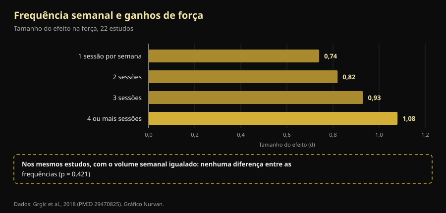

# Divisão de treino: o que muda de verdade entre iniciante e avançado

Por [Giammaria Loi](/autore/giammaria-loi) · atualizado a 9 de outubro de 2026

Um treinador australiano escreveu algo que raramente se ouve no ginásio: a divisão de treino não é um plano que se escolhe, é o resultado de uma conta. Um iniciante e um atleta avançado não podem ser colocados automaticamente na mesma frequência, porque não geram o mesmo estímulo. Fomos às meta-análises sobre frequência de treino: a conclusão dele aguenta. O caminho para lá chegar, não — uma das quatro razões que enumera está invertida face ao que se mede em laboratório, e o número mais importante de toda a questão não aparece na publicação.

## Em resumo

- **A frequência ótima muda mesmo com a experiência, e está medida.** Em pessoas não treinadas, os maiores ganhos de força vêm de treinar cada grupo muscular **3 dias por semana** a 60% do máximo; em treinados desce para **2 dias**, mas a 80% (Rhea et al., 2003).
- **Mas a frequência, sozinha, não faz nada.** Quando o volume semanal é igualado, a diferença entre treinar 1, 2, 3 ou 4 vezes por semana **desaparece** (p = 0,421). Conta porque permite distribuir o volume, não porque o músculo precise de estímulos frequentes.
- **O iniciante não gera menos fadiga: gera mais por sessão.** Nas primeiras quatro sessões, o aumento de espessura muscular é em grande parte **inchaço por dano muscular**, e esse dano atenua-se à medida que se treina (Damas et al., 2018). É o contrário do que diz a publicação.
- **Um upper/lower duas vezes por semana é bom para um iniciante, mas está abaixo do ótimo.** A meta-análise de 140 estudos aponta para 3 exposições semanais por grupo muscular em não treinados, não 2.
- **A parte neural é real, mas não é "recrutamento".** Ao fim de 4 semanas mudam a **frequência de descarga** dos motoneurónios (+3,3 impulsos por segundo) e os limiares de recrutamento: o sistema nervoso aprende a conduzir o músculo, não descobre fibras novas (Del Vecchio et al., 2019).

## O problema real: um plano só para todos

Quem já pisou um ginásio conhece a cena: o mesmo plano de quatro dias entregue ao senhor de cinquenta anos que voltou em janeiro e ao rapaz que compete. A publicação de Dale Hansford ataca exatamente isso, e a pergunta que propõe é a certa: não "que divisão uso", mas "quanto estímulo esta pessoa cria, de quanto tempo precisa para recuperar e a próxima sessão vai sair bem?".

O problema é que a investigação tem uma resposta mais simples e mais aborrecida do que a fisiológica. Antes, duas definições: **frequência** é quantas vezes por semana um músculo é treinado; **volume**, quantas séries efetivas recebe no total da semana. São coisas distintas e foram confundidas durante décadas.

## O que a investigação diz mesmo

### "A frequência certa muda com a experiência" — **Confirmado**

É a parte mais bem documentada, e os números são antigos mas sólidos. Uma meta-análise de **140 estudos e 1.433 tamanhos de efeito** procurou a dose ótima por nível: em não treinados o máximo chega com uma intensidade média de **60% do máximo, 3 dias por semana por grupo muscular**; em treinados o pico desloca-se para **80% do máximo, 2 dias por semana** (Rhea et al., 2003).

Uma segunda análise, sobre 177 estudos e 1.803 tamanhos de efeito, acrescenta o terceiro degrau: os atletas tiram o máximo de uma intensidade média de **85% do máximo, 2 dias por semana, mas com 8 séries por grupo muscular** em vez de 4 (Peterson et al., 2005).

| Nível | Intensidade média | Dias por semana e músculo | Séries por músculo |
|---|---|---|---|
| Não treinado | 60% do máximo | 3 | 4 |
| Treinado (não atleta) | 80% do máximo | 2 | 4 |
| Atleta | 85% do máximo | 2 | 8 |

*Doses associadas aos ganhos de força máximos em duas meta-análises dose-resposta. Síntese Nurvan a partir de Rhea et al., 2003 e Peterson et al., 2005: são médias da literatura, não prescrições individuais.*

Salta à vista uma coisa que a publicação não refere: a direção. Com a experiência, a frequência por músculo **desce**, enquanto sobem a intensidade e as séries. E o iniciante devia estar em 3 exposições semanais, não nas 2 do upper/lower proposto. Não é um erro grave — um upper/lower bem feito ganha a qualquer plano ótimo mal feito — mas é uma diferença real.

### "É preciso outra frequência porque o estímulo é diferente" — **A precisar**

Aqui chega o número que falta. Uma meta-análise de 22 estudos comparou as frequências semanais: o tamanho do efeito sobre a força cresce de forma ordenada, de 0,74 com uma sessão por semana até 1,08 com quatro ou mais. Parece a prova definitiva de que mais vezes é melhor.

Depois os autores isolaram os estudos em que o **volume total era igual** entre grupos. Aí o efeito da frequência **desaparece** (p = 0,421). Traduzindo: quem treinava quatro vezes por semana progredia mais porque em quatro sessões fazia mais séries, não porque as tivesse distribuído melhor (Grgic et al., 2018).

*A caixa em baixo é o ponto do artigo: a escada da esquerda é um efeito do volume disfarçado de efeito da frequência. Dados: Grgic et al., 2018 (22 estudos). Gráfico Nurvan.*

Na hipertrofia a conclusão é ainda mais clara: 25 estudos, nenhuma diferença significativa entre frequências altas e baixas com o volume igualado, nem sequer em indivíduos já treinados (Schoenfeld et al., 2019). E a meta-regressão mais recente e mais sofisticada — **67 estudos, 2.058 participantes**, com modelos ajustados à duração do programa e ao nível — chega ao mesmo sítio: o **volume** tem probabilidade de 100% de efeito positivo na massa e na força, enquanto a **frequência** é compatível com efeitos negligenciáveis na hipertrofia e tem um efeito real mas com fortes rendimentos decrescentes na força (Pelland et al., 2026).

Portanto a conclusão da publicação — *a divisão é consequência da programação, não o ponto de partida* — está certa, mas por outro motivo: a divisão é o recipiente onde cabe o volume que consegues sustentar. Se as séries de que precisas não cabem em três sessões, fazes quatro. Não porque o músculo "precise de estímulo frequente".

### "O iniciante gera menos fadiga" — **Desmentido**

Esta parte vira-se do avesso. A publicação diz que o iniciante produz menos fadiga sistémica e menos estímulo por sessão e por isso pode repetir mais cedo. A primeira metade não se aguenta.

Nas **primeiras quatro sessões** de um programa, o aumento de secção transversal medido por ecografia é em grande parte **inchaço por dano muscular**, não tecido novo. É preciso cerca da décima sessão para surgir uma hipertrofia modesta e real, e à volta da décima oitava para se tornar o fenómeno principal. Entretanto, o dano por sessão **reduz-se progressivamente** precisamente porque se treina (Damas et al., 2018).

Quem começa não tem menos dano: tem mais, e é por isso que não consegue descer escadas após a primeira semana de agachamentos. O que tem a menos é **carga absoluta**: menos quilos movidos no total, logo menos stress em articulações, tendões e sistema nervoso. A conclusão prática mantém-se (o iniciante pode repetir mais cedo), mas a razão é a tonelagem, não o dano.

### "O iniciante recruta menos unidades motoras" — **A precisar**

A publicação coloca o recrutamento de unidades motoras entre as coisas que o iniciante "ainda não sabe fazer". É uma simplificação comum. Quando se registam motoneurónios individuais antes e depois de quatro semanas de treino, o que mais muda é a **frequência de descarga** — em média **+3,3 impulsos por segundo** em contrações submáximas — juntamente com uma **redução dos limiares de recrutamento**: as unidades motoras entram em ação a níveis de força mais baixos (Del Vecchio et al., 2019). Não é a descoberta de fibras adormecidas: é o mesmo parque de motores conduzido com mais intensidade e melhor sincronia.

Convém acrescentar que o local exato destas adaptações — córtex, medula, motoneurónio — continua em discussão, e as técnicas atuais não permitem decidir (Škarabot et al., 2021). Nos mecanismos neurais vale a pena ser menos categórico do que costumam ser as redes sociais.

### "Separa a frequência do músculo da do exercício" — **A precisar**

A ideia é elegante: treinar pernas duas vezes por semana, mas com agachamento uma vez e prensa na outra, para que o músculo trabalhe muitas vezes e o padrão específico recupere mais. Nenhum estudo controlado testou exatamente essa estrutura, por isso não se pode dar como demonstrada.

O que se sabe é que **a variação de exercícios tem um sentido certo e outro errado**. Uma revisão de 8 estudos com 241 homens conclui que uma variação *sistemática*, escolhida com critério anatómico e biomecânico, pode melhorar a hipertrofia regional e a força dinâmica máxima; ao passo que uma variação *excessiva e aleatória*, com exercícios trocados sem parar ou redundantes entre si, pode **comprometer** os ganhos (Kassiano et al., 2022). Rodar duas variantes de empurrar num ciclo de duas semanas é razoável; mudar de exercício em cada sessão, não.

### "O microciclo não tem de durar sete dias" — **Não verificável**

O microciclo de cinco dias proposto para atletas muito avançados não tem estudos controlados a favor nem contra: no PubMed não há comparações entre microciclos semanais e não semanais. É uma decisão organizativa defensável, não um resultado científico. Na prática tem um custo a contabilizar: um ciclo que desliza face ao calendário choca com o trabalho, a família e os horários do ginásio, e uma sessão perdida por incompatibilidade de agenda pesa mais do que a otimização que procuravas.

## Como aplicar

1. **Parte do volume, não dos dias.** Decide quantas séries efetivas queres por grupo muscular na semana. Só depois vê em quantos dias cabem sem sessões de duas horas.
2. **Se estás a começar, aponta a 2-3 exposições por músculo.** Um upper/lower duas vezes por semana serve muito bem, e a literatura diz que três seria ainda melhor: a terceira exposição, mesmo curta, é a forma mais fácil de somar volume sem alongar as sessões.
3. **Se és avançado, sobe primeiro séries e intensidade, depois dias.** Os dados em atletas indicam o dobro das séries por grupo com o mesmo número de dias. Acrescenta uma sessão quando as séries deixarem de caber, não por princípio.
4. **Mantém estáveis os exercícios principais.** Muda de variante por razões concretas (um ponto fraco, um incómodo, uma progressão parada), em ciclos de semanas, não de sessões.
5. **Usa um critério de qualidade, não o calendário.** Se na sessão seguinte as cargas descem e o RIR — as repetições que te sobram na reserva no fim da série — sobe com o mesmo peso, não recuperaste: é essa a informação que a publicação pede e que quase ninguém regista.
6. **Nas primeiras semanas não confies no espelho.** Boa parte do que vês antes da décima sessão é inchaço. Olha para as cargas.

> ### 💡 Com a Nurvan
> **A divisão certa é a que os teus números aguentam.** A Nurvan conta as tuas séries por grupo muscular semana a semana e regista carga, repetições e RIR de cada série: assim vês a preto e branco se a segunda sessão da semana foi mesmo feita com os mesmos quilos da primeira ou se estás só a acumular fadiga. As séries de aquecimento são propostas automaticamente e, se já tens um plano, podes importá-lo de PDF, Excel ou até de uma foto. [Experimenta a Nurvan](https://nurvan.app)

## Perguntas frequentes

**Quantas vezes por semana devo treinar um músculo?**
Duas ou três cobre quase toda a literatura. Em não treinados o máximo medido são 3 dias por semana por grupo muscular; em treinados 2, com mais séries e mais intensidade (Rhea et al., 2003; Peterson et al., 2005). Com o volume semanal igualado, porém, a diferença entre essas opções é pequena (Schoenfeld et al., 2019).

**Full body ou divisão?**
Depende de quantas séries precisas e do tempo que tens. Nenhum é superior com o volume igualado: o full body espalha poucas séries por mais dias, a divisão concentra muitas em poucos. Escolhe o que te permite completar o volume sem sessões intermináveis nem dias saltados. Se treinas duas vezes por semana, o full body é quase obrigatório.

**Posso ficar forte treinando só 3 vezes por semana?**
Sim. Nas meta-análises dose-resposta o máximo para atletas está em 2 dias por semana por grupo muscular: três sessões full body ou um upper/lower/full encaixam nesses números (Peterson et al., 2005). O limite será o volume total que cabe em três sessões, não a frequência.

**Devo mudar de plano todos os meses?**
Não, e mudar demasiado pode custar ganhos. A variação sistemática e fundamentada ajuda; a contínua e aleatória pode comprometer os resultados (Kassiano et al., 2022). Um exercício principal precisa de várias semanas para mostrar se a progressão funciona.

## Leia também

- [Quantas repetições para massa muscular? O mito do 8-12](/pt/blog/quantas-repeticoes-massa-muscular)
- [Ectomorfo ou mesomorfo: o corpo decide a massa?](/pt/blog/somatotipo-ectomorfo-mesomorfo-massa-muscular)
- [Low responder: quanto a genética pesa nos músculos](/pt/blog/genetica-high-low-responder)

## Fontes

1. Rhea MR, Alvar BA, Burkett LN, Ball SD, 2003. *A meta-analysis to determine the dose response for strength development.* Med Sci Sports Exerc 35(3):456–464. PMID 12618576 — [doi:10.1249/01.MSS.0000053727.63505.D4](https://doi.org/10.1249/01.MSS.0000053727.63505.D4)
2. Peterson MD, Rhea MR, Alvar BA, 2005. *Applications of the dose-response for muscular strength development: a review of meta-analytic efficacy and reliability for designing training prescription.* J Strength Cond Res 19(4):950–958. PMID 16287373 — [doi:10.1519/R-16874.1](https://doi.org/10.1519/R-16874.1)
3. Grgic J, Schoenfeld BJ, Davies TB, Lazinica B, Krieger JW, Pedisic Z, 2018. *Effect of Resistance Training Frequency on Gains in Muscular Strength: A Systematic Review and Meta-Analysis.* Sports Med 48(5):1207–1220. PMID 29470825 — [doi:10.1007/s40279-018-0872-x](https://doi.org/10.1007/s40279-018-0872-x)
4. Schoenfeld BJ, Grgic J, Krieger J, 2019. *How many times per week should a muscle be trained to maximize muscle hypertrophy? A systematic review and meta-analysis of studies examining the effects of resistance training frequency.* J Sports Sci 37(11):1286–1295. PMID 30558493 — [doi:10.1080/02640414.2018.1555906](https://doi.org/10.1080/02640414.2018.1555906)
5. Pelland JC, Remmert JF, Robinson ZP, Hinson SR, Zourdos MC, 2026. *The Resistance Training Dose Response: Meta-Regressions Exploring the Effects of Weekly Volume and Frequency on Muscle Hypertrophy and Strength Gains.* Sports Med 56(2):481–505. PMID 41343037 — [doi:10.1007/s40279-025-02344-w](https://doi.org/10.1007/s40279-025-02344-w)
6. Damas F, Libardi CA, Ugrinowitsch C, 2018. *The development of skeletal muscle hypertrophy through resistance training: the role of muscle damage and muscle protein synthesis.* Eur J Appl Physiol 118(3):485–500. PMID 29282529 — [doi:10.1007/s00421-017-3792-9](https://doi.org/10.1007/s00421-017-3792-9)
7. Del Vecchio A, Casolo A, Negro F, et al., 2019. *The increase in muscle force after 4 weeks of strength training is mediated by adaptations in motor unit recruitment and rate coding.* J Physiol 597(7):1873–1887. PMID 30727028 — [doi:10.1113/JP277250](https://doi.org/10.1113/JP277250)
8. Kassiano W, Nunes JP, Costa B, Ribeiro AS, Schoenfeld BJ, Cyrino ES, 2022. *Does Varying Resistance Exercises Promote Superior Muscle Hypertrophy and Strength Gains? A Systematic Review.* J Strength Cond Res 36(6):1753–1762. PMID 35438660 — [doi:10.1519/JSC.0000000000004258](https://doi.org/10.1519/JSC.0000000000004258)
9. Škarabot J, Brownstein CG, Casolo A, Del Vecchio A, Ansdell P, 2021. *The knowns and unknowns of neural adaptations to resistance training.* Eur J Appl Physiol 121(3):675–685. PMID 33355714 — [doi:10.1007/s00421-020-04567-3](https://doi.org/10.1007/s00421-020-04567-3)

Metadados e resumos obtidos no PubMed. Ponto de partida: publicação de [Dale Hansford (@coach_dalehansford)](https://www.instagram.com/p/DdnB85NFZca/) de 23 de setembro de 2026. Nenhum texto, imagem ou estrutura da publicação foi reproduzido: as afirmações foram extraídas, reescritas e verificadas de forma independente.

---

**Giammaria Loi** é o fundador da Nurvan. Treina com pesos desde 2012, trabalha como personal trainer e coach certificado FIPE desde 2013 e compete em powerlifting a nível nacional desde 2018. Cada artigo que assina parte dos estudos científicos e chega ao que funciona mesmo no ginásio.

> Nota: conteúdo informativo, não substitui a opinião de um médico ou profissional. Se tens patologias, lesões em curso ou retomas depois de uma paragem longa, pede a um profissional qualificado que avalie o teu plano.
