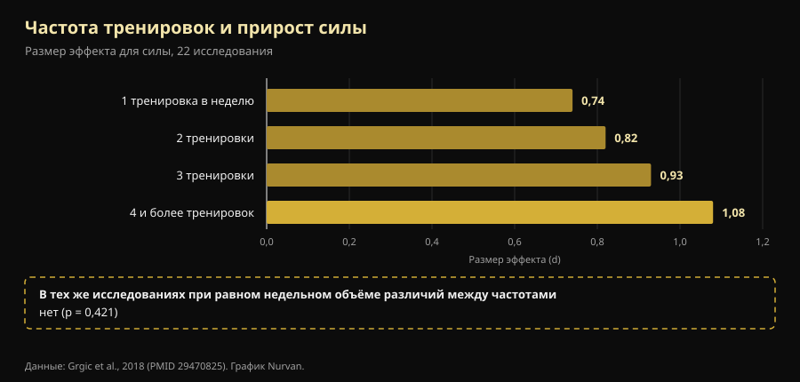

# Сплит тренировок: что на самом деле меняется от новичка к продвинутому

Автор: [Giammaria Loi](/autore/giammaria-loi) · обновлено 9 октября 2026

Австралийский тренер написал то, что в зале слышишь редко: сплит — не программа, которую выбирают, а результат расчёта. Новичка и продвинутого атлета нельзя по умолчанию ставить на одну частоту, потому что они создают разный стресс. Мы проверили мета-анализы по частоте тренировок: его вывод выдерживает проверку. А вот путь к нему — нет: одна из четырёх причин, которые он перечисляет, перевёрнута относительно того, что измеряют в лаборатории, а самое важное число во всём этом вопросе в посте отсутствует.

## Коротко

- **Оптимальная частота действительно меняется с опытом, и это измерено.** У нетренированных максимальный прирост силы даёт работа на каждую мышечную группу **3 дня в неделю** при 60% от максимума; у тренированных — **2 дня**, но при 80% (Rhea et al., 2003).
- **Но сама по себе частота не делает ничего.** Если уравнять недельный объём, разница между 1, 2, 3 и 4 тренировками в неделю **исчезает** (p = 0,421). Частота важна потому, что позволяет распределить объём, а не потому, что мышце нужен частый стимул.
- **Новичок создаёт не меньше утомления, а больше — за одну тренировку.** В первых четырёх тренировках прирост толщины мышцы — это в основном **отёк от мышечного повреждения**, и повреждение ослабевает по мере тренировок (Damas et al., 2018). Это противоположно тому, что утверждает пост.
- **Верх/низ дважды в неделю для новичка — хорошо, но ниже оптимума.** Мета-анализ 140 исследований указывает на 3 недельных воздействия на мышечную группу у нетренированных, а не на 2.
- **Нервная часть реальна, но дело не в «рекрутировании».** После 4 недель меняются **частота разрядов** мотонейронов (+3,3 импульса в секунду) и пороги рекрутирования: нервная система учится управлять мышцей, а не находит новые волокна (Del Vecchio et al., 2019).

## Настоящая проблема: одна программа на всех

Кто бывал в зале, знает эту картину: один и тот же четырёхдневный шаблон выдают и пятидесятилетнему, вернувшемуся в январе, и тому, кто выступает на соревнованиях. Пост Дейла Хэнсфорда бьёт именно сюда, и вопрос он ставит правильный: не «какой сплит взять», а «сколько стресса создаёт этот человек, сколько ему нужно на восстановление и будет ли следующая тренировка качественной?».

Загвоздка в том, что у науки ответ проще и скучнее физиологического. Сначала два термина: **частота** — сколько раз в неделю мышца получает нагрузку; **объём** — сколько рабочих подходов она получает за всю неделю. Это разные вещи, которые десятилетиями смешивали.

## Что говорят исследования

### «Правильная частота меняется с опытом» — **Подтверждено**

Это самая обоснованная часть поста, и цифры старые, но крепкие. Мета-анализ **140 исследований и 1433 размеров эффекта** искал оптимальную дозу по уровню подготовки: у нетренированных максимум прироста силы приходится на среднюю интенсивность **60% от максимума, 3 дня в неделю на мышечную группу**; у тренированных пик смещается к **80% от максимума, 2 дня в неделю** (Rhea et al., 2003).

Второй анализ, охвативший 177 исследований и 1803 размера эффекта, добавляет третью ступень: атлеты получают максимум при средней интенсивности **85% от максимума, 2 дня в неделю, но с 8 подходами на мышечную группу** вместо 4 (Peterson et al., 2005).

| Уровень | Средняя интенсивность | Дней в неделю на мышцу | Подходов на мышцу |
|---|---|---|---|
| Нетренированный | 60% от максимума | 3 | 4 |
| Тренированный (не атлет) | 80% от максимума | 2 | 4 |
| Атлет | 85% от максимума | 2 | 8 |

*Дозы, связанные с максимальным приростом силы в двух мета-анализах «доза — ответ». Сводка Nurvan по Rhea et al., 2003 и Peterson et al., 2005: это средние по литературе, а не индивидуальные предписания.*

Сразу бросается в глаза то, чего пост не отмечает: направление. С ростом опыта частота на мышцу **снижается**, а интенсивность и число подходов растут. И новичку стоило бы держать 3 воздействия в неделю, а не 2, как в предложенном верх/низ. Это не грубая ошибка — хорошо выполненный верх/низ бьёт любую оптимальную программу, выполненную плохо, — но разница реальная.

### «Нужна другая частота, потому что стресс другой» — **Требует уточнения**

Вот недостающее число. Мета-анализ 22 исследований сравнил недельные частоты: размер эффекта для силы аккуратно растёт с частотой, от 0,74 при одной тренировке в неделю до 1,08 при четырёх и более. Выглядит как окончательное доказательство, что чаще — лучше.

Затем авторы выделили только те работы, где **общий объём у групп был одинаковым**. Там эффект частоты **исчезает** (p = 0,421). Перевод: те, кто тренировался четыре раза в неделю, прогрессировали лучше потому, что в четыре тренировки помещалось больше подходов, а не потому, что подходы были лучше распределены (Grgic et al., 2018).

*Рамка внизу — главная мысль статьи: аккуратная лесенка слева есть эффект объёма, переодетый в эффект частоты. Данные: Grgic et al., 2018 (22 исследования). График Nurvan.*

По гипертрофии вывод ещё жёстче: 25 исследований, никакой значимой разницы между высокой и низкой частотой при равном объёме — даже у уже тренированных (Schoenfeld et al., 2019). А самая свежая и самая тонкая мета-регрессия — **67 исследований, 2058 участников**, модели скорректированы на длительность программы и уровень подготовки — приходит туда же: у **объёма** вероятность положительного эффекта на массу и на силу равна 100%, тогда как **частота** совместима с пренебрежимо малым эффектом на гипертрофию и даёт реальный, но резко убывающий эффект на силу (Pelland et al., 2026).

Значит, вывод поста — *сплит есть следствие построения программы, а не отправная точка* — верен, но по другой причине: сплит — это ёмкость, в которую вы укладываете посильный объём. Если нужные подходы не помещаются в три тренировки, делаете четыре. Не потому, что мышцу «надо нагружать часто».

### «Новичок создаёт меньше утомления» — **Опровергнуто**

Здесь всё переворачивается. Пост утверждает, что новичок производит меньше системного утомления и меньше стресса за тренировку и потому может повторить раньше. Первая половина не выдерживает.

В **первых четырёх тренировках** программы прирост поперечного сечения мышцы, который видно на УЗИ, — это в значительной мере **отёк от мышечного повреждения**, а не новая ткань. Примерно к десятой тренировке появляется скромная, но настоящая гипертрофия, и примерно к восемнадцатой она становится основным процессом. При этом повреждение за тренировку **постепенно уменьшается** именно потому, что вы продолжаете тренироваться (Damas et al., 2018).

У начинающего повреждений не меньше, а больше — именно поэтому после первой недели приседаний невозможно спуститься по лестнице. Меньше у него **абсолютная нагрузка**: меньше суммарных килограммов, а значит меньше стресса для суставов, сухожилий и нервной системы. Практический вывод поста остаётся в силе (новичок может повторить раньше), но причина — тоннаж, а не повреждение.

### «Новичок рекрутирует меньше двигательных единиц» — **Требует уточнения**

Пост относит рекрутирование двигательных единиц к тому, чего новичок «ещё не умеет». Это распространённое упрощение. Когда отдельные мотонейроны записывают до и после четырёх недель тренировок, сильнее всего меняется **частота разрядов** — в среднем **+3,3 импульса в секунду** при субмаксимальных сокращениях — вместе со **снижением порогов рекрутирования**: двигательные единицы включаются при меньшем усилии (Del Vecchio et al., 2019). Это не обнаружение спящих волокон, а тот же парк моторов, которым управляют жёстче и точнее по времени.

Стоит добавить, что точное место этих перестроек — кора, спинной мозг, мотонейрон — по-прежнему обсуждается, и доступные методы его не определяют (Škarabot et al., 2021). В нейромеханизмах полезно быть менее уверенным, чем обычно бывают в соцсетях.

### «Отдели частоту мышцы от частоты упражнения» — **Требует уточнения**

Идея изящная: тренировать ноги дважды в неделю, но приседать один раз, а во второй делать жим ногами, чтобы мышца работала часто, а конкретный двигательный паттерн восстанавливался дольше. Ни одно контролируемое исследование именно эту структуру не проверяло, так что доказанной её назвать нельзя.

Что известно точно — **у вариативности упражнений есть правильное и неправильное направление**. Обзор 8 исследований на 241 мужчине заключает: *систематическая* вариация, выбранная по анатомическим и биомеханическим основаниям, может улучшить региональную гипертрофию и максимальную динамическую силу; а *избыточная и случайная* вариация, с постоянной сменой упражнений или дублирующими друг друга движениями, может **ухудшить** результат (Kassiano et al., 2022). Чередовать два варианта жима в двухнедельном цикле разумно; менять упражнение каждую тренировку — нет.

### «Микроцикл не обязан длиться семь дней» — **Не проверяемо**

Пятидневный микроцикл, который пост предлагает очень продвинутым атлетам, не имеет ни контролируемых исследований в свою пользу, ни против: в PubMed нет сравнений недельных и ненедельных микроциклов. Это защитимое организационное решение, а не научный результат. На практике у него есть издержка, которую стоит заложить: цикл, который «плывёт» относительно календаря, конфликтует с работой, семьёй и расписанием зала, а одна пропущенная из-за накладки тренировка стоит дороже той оптимизации, которую вы искали.

## Как это применить

1. **Начинайте с объёма, а не с дней.** Решите, сколько рабочих подходов должна получать каждая мышечная группа за неделю. И только потом смотрите, во сколько дней они помещаются без двухчасовых тренировок.
2. **Если вы новичок, цельтесь в 2-3 воздействия на мышцу.** Верх/низ дважды в неделю вполне хорош, а литература говорит, что три было бы ещё лучше: третье воздействие, даже короткое, — самый простой способ добавить объём, не удлиняя тренировки.
3. **Если вы продвинутый, сначала поднимайте подходы и интенсивность, потом дни.** Данные по атлетам указывают на вдвое большее число подходов на группу при том же числе дней. Добавляйте тренировку, когда подходы перестают помещаться, а не из принципа.
4. **Держите основные упражнения стабильными.** Меняйте вариант по конкретным причинам (слабое место, дискомфорт, застой в прогрессии), циклами в недели, а не в тренировки.
5. **Используйте критерий качества, а не календарь.** Если на следующей тренировке веса падают, а RIR — число повторений, оставшихся в запасе к концу подхода, — растёт при том же весе, вы не восстановились. Это и есть та информация, которую требует пост и которую почти никто не записывает.
6. **В первые недели не доверяйте зеркалу.** Бóльшая часть того, что вы видите до десятой тренировки, — отёк. Смотрите на веса.

> ### 💡 Вместе с Nurvan
> **Правильный сплит — тот, который выдерживают ваши цифры.** Nurvan считает подходы по мышечным группам неделя за неделей и записывает вес, повторения и RIR в каждом подходе: вы чётко видите, сделана ли вторая тренировка недели теми же килограммами, что и первая, или вы просто копите утомление. Разминочные подходы предлагаются автоматически, а готовую программу можно импортировать из PDF, Excel или даже с фотографии. [Попробовать Nurvan](https://nurvan.app)

## Частые вопросы

**Сколько раз в неделю тренировать мышцу?**
Два-три раза покрывают почти всю литературу. У нетренированных измеренный максимум — 3 дня в неделю на мышечную группу; у тренированных — 2, с большим числом подходов и большей интенсивностью (Rhea et al., 2003; Peterson et al., 2005). Но при равном недельном объёме разница между этими вариантами мала (Schoenfeld et al., 2019).

**Фулбоди или сплит?**
Зависит от того, сколько подходов вам нужно и сколько у вас времени. При равном объёме ни один не лучше: фулбоди размазывает мало подходов по большему числу дней, сплит собирает много в меньшее. Берите то, что позволяет добрать объём без бесконечных тренировок и пропусков. Если вы тренируетесь дважды в неделю, фулбоди почти обязателен.

**Можно ли стать сильным, тренируясь всего 3 раза в неделю?**
Да. В мета-анализах «доза — ответ» максимум для атлетов приходится на 2 дня в неделю на мышечную группу: три фулбоди-тренировки или схема верх/низ/фулбоди укладываются в эти цифры (Peterson et al., 2005). Ограничением будет общий объём, который помещается в три тренировки, а не частота.

**Нужно ли менять программу каждый месяц?**
Нет, и слишком частая смена может стоить результата. Систематическая и обоснованная вариация помогает; постоянная и случайная может ухудшить итог (Kassiano et al., 2022). Основному упражнению нужно несколько недель, чтобы показать, работает ли прогрессия.

## Читайте также

- [Сколько повторений нужно для роста мышц: миф 8-12](/ru/blog/skolko-povtoreniy-dlya-massy)
- [Эктоморф или мезоморф: тип тела решает всё?](/ru/blog/somatotip-ektomorf-mezomorf-myshechnaya-massa)
- [Low responder: насколько генетика определяет рост мышц](/ru/blog/genetika-high-low-responder)

## Источники

1. Rhea MR, Alvar BA, Burkett LN, Ball SD, 2003. *A meta-analysis to determine the dose response for strength development.* Med Sci Sports Exerc 35(3):456–464. PMID 12618576 — [doi:10.1249/01.MSS.0000053727.63505.D4](https://doi.org/10.1249/01.MSS.0000053727.63505.D4)
2. Peterson MD, Rhea MR, Alvar BA, 2005. *Applications of the dose-response for muscular strength development: a review of meta-analytic efficacy and reliability for designing training prescription.* J Strength Cond Res 19(4):950–958. PMID 16287373 — [doi:10.1519/R-16874.1](https://doi.org/10.1519/R-16874.1)
3. Grgic J, Schoenfeld BJ, Davies TB, Lazinica B, Krieger JW, Pedisic Z, 2018. *Effect of Resistance Training Frequency on Gains in Muscular Strength: A Systematic Review and Meta-Analysis.* Sports Med 48(5):1207–1220. PMID 29470825 — [doi:10.1007/s40279-018-0872-x](https://doi.org/10.1007/s40279-018-0872-x)
4. Schoenfeld BJ, Grgic J, Krieger J, 2019. *How many times per week should a muscle be trained to maximize muscle hypertrophy? A systematic review and meta-analysis of studies examining the effects of resistance training frequency.* J Sports Sci 37(11):1286–1295. PMID 30558493 — [doi:10.1080/02640414.2018.1555906](https://doi.org/10.1080/02640414.2018.1555906)
5. Pelland JC, Remmert JF, Robinson ZP, Hinson SR, Zourdos MC, 2026. *The Resistance Training Dose Response: Meta-Regressions Exploring the Effects of Weekly Volume and Frequency on Muscle Hypertrophy and Strength Gains.* Sports Med 56(2):481–505. PMID 41343037 — [doi:10.1007/s40279-025-02344-w](https://doi.org/10.1007/s40279-025-02344-w)
6. Damas F, Libardi CA, Ugrinowitsch C, 2018. *The development of skeletal muscle hypertrophy through resistance training: the role of muscle damage and muscle protein synthesis.* Eur J Appl Physiol 118(3):485–500. PMID 29282529 — [doi:10.1007/s00421-017-3792-9](https://doi.org/10.1007/s00421-017-3792-9)
7. Del Vecchio A, Casolo A, Negro F, et al., 2019. *The increase in muscle force after 4 weeks of strength training is mediated by adaptations in motor unit recruitment and rate coding.* J Physiol 597(7):1873–1887. PMID 30727028 — [doi:10.1113/JP277250](https://doi.org/10.1113/JP277250)
8. Kassiano W, Nunes JP, Costa B, Ribeiro AS, Schoenfeld BJ, Cyrino ES, 2022. *Does Varying Resistance Exercises Promote Superior Muscle Hypertrophy and Strength Gains? A Systematic Review.* J Strength Cond Res 36(6):1753–1762. PMID 35438660 — [doi:10.1519/JSC.0000000000004258](https://doi.org/10.1519/JSC.0000000000004258)
9. Škarabot J, Brownstein CG, Casolo A, Del Vecchio A, Ansdell P, 2021. *The knowns and unknowns of neural adaptations to resistance training.* Eur J Appl Physiol 121(3):675–685. PMID 33355714 — [doi:10.1007/s00421-020-04567-3](https://doi.org/10.1007/s00421-020-04567-3)

Метаданные и аннотации получены из PubMed. Отправная точка: пост [Dale Hansford (@coach_dalehansford)](https://www.instagram.com/p/DdnB85NFZca/) от 23 сентября 2026 года. Ни текст, ни изображения, ни структура поста не воспроизводились: утверждения были извлечены, переписаны и проверены независимо.

---

**Giammaria Loi** — основатель Nurvan. Тренируется с отягощениями с 2012 года, с 2013 года работает персональным тренером и коучем с сертификацией FIPE, с 2018 года выступает в пауэрлифтинге на национальном уровне. Каждая его статья начинается с исследований и заканчивается тем, что действительно работает в зале.

> Примечание: материал носит информационный характер и не заменяет консультацию врача или квалифицированного специалиста. При заболеваниях, текущих травмах или возвращении после долгого перерыва покажите свою программу квалифицированному специалисту.
