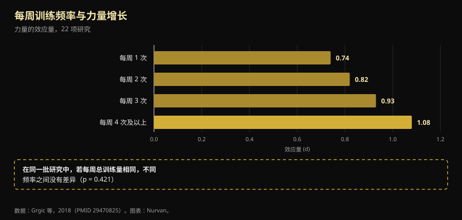

# 训练分化：从新手到高手，真正改变的是什么

作者：[Giammaria Loi](/autore/giammaria-loi) · 更新于 2026 年 10 月 9 日

一位澳大利亚教练写下了健身房里很少听到的一句话：分化不是你挑出来的计划，而是算出来的结果。新手和高阶运动员不该被默认放在同一个训练频率上，因为他们制造的刺激不一样。我们把训练频率方面的荟萃分析翻了一遍：他的结论站得住。但他的推理过程不行——他列出的四条理由里有一条跟实验室测到的结果正好相反，而整个问题中最关键的那个数字，帖子里压根没提。

## 要点速览

- **最佳频率确实随经验改变，而且被量化过。** 未经训练的人，每个肌群每周练 **3 天**、强度约为最大值的 60% 时力量增长最大；已训练者降到 **2 天**，但强度提到 80%（Rhea 等，2003）。
- **但频率本身什么也不做。** 把每周总容量拉平之后，一周练 1 次、2 次、3 次还是 4 次，差异**消失了**（p = 0.421）。频率之所以重要，是因为它让你把容量铺开，而不是因为肌肉喜欢被频繁刺激。
- **新手产生的疲劳不是更少，而是单次更多。** 头四次训练里，肌肉厚度的增加大部分是**肌肉损伤带来的肿胀**，而损伤会随着继续训练而减弱（Damas 等，2018）。这和帖子说的正相反。
- **新手一周两次上下肢分化不错，但低于最优值。** 那份涵盖 140 项研究的荟萃分析指出，未训练者每个肌群每周应有 3 次刺激，而不是 2 次。
- **神经层面的变化是真的，但那不叫"募集"。** 训练 4 周后改变的是运动神经元的**放电频率**（每秒多 3.3 个脉冲）和募集阈值：神经系统学会了驾驭肌肉，而不是发现了新的肌纤维（Del Vecchio 等，2019）。

## 真正的问题：一套计划发给所有人

只要进过健身房就见过这一幕：同一份四天计划，既给一月份刚回归的五十岁大叔，也给要上台比赛的小伙子。Dale Hansford 的帖子针对的正是这件事，他提出的问题也是对的：不是"我该用哪个分化"，而是"这个人能制造多少刺激、需要多久恢复、下一次训练还能不能练好"。

只不过，研究给出的答案比生理学解释更简单、也更无趣。先定义两个词：**频率**指一块肌肉一周被练几次；**容量**指它整周总共收到多少有效组数。这是两件事，却被混为一谈了几十年。

## 研究到底怎么说

### "正确的频率随经验改变" —— **证实**

这是帖子里论据最扎实的部分，数字虽老但可靠。一项涵盖 **140 项研究、1433 个效应量**的荟萃分析按水平寻找最优剂量：未训练者的最大力量增长出现在平均强度 **60% 最大负荷、每个肌群每周 3 天**；已训练者的峰值移到 **80% 最大负荷、每周 2 天**（Rhea 等，2003）。

第二项分析涵盖 177 项研究、1803 个效应量，补上了第三级台阶：运动员从平均强度 **85% 最大负荷、每周 2 天、但每个肌群 8 组**（而非 4 组）中获益最大（Peterson 等，2005）。

| 水平 | 平均强度 | 每个肌群每周天数 | 每个肌群组数 |
|---|---|---|---|
| 未训练 | 60% 最大负荷 | 3 | 4 |
| 已训练（非运动员） | 80% 最大负荷 | 2 | 4 |
| 运动员 | 85% 最大负荷 | 2 | 8 |

*两项剂量—反应荟萃分析中与最大力量增长相关的剂量。Nurvan 依据 Rhea 等，2003 与 Peterson 等，2005 整理：这是文献平均值，不是个体处方。*

有一点一眼就能看出，而帖子没提：方向。随着经验增长，单个肌群的频率在**下降**，而强度和组数在上升。另外新手应该是每周 3 次刺激，而不是帖子所给上下肢分化的 2 次。这不是严重错误——认真执行的上下肢分化胜过执行糟糕的任何最优计划——但确实是个差别。

### "刺激不同所以需要不同频率" —— **需要修正**

缺失的数字在这里。一项涵盖 22 项研究的荟萃分析比较了每周频率：力量的效应量随频率整齐上升，从一周一次的 0.74 到四次及以上的 1.08。看起来像是"练得越勤越好"的铁证。

然后作者单独挑出那些**各组总容量相同**的研究。在这些研究里，频率的效应**消失了**（p = 0.421）。翻译过来就是：一周练四次的人之所以进步更多，是因为四次训练里塞进了更多组数，而不是因为分配得更好（Grgic 等，2018）。

*下方方框才是这篇文章的重点：左边那道整齐的阶梯，是容量效应披着频率的外衣。数据：Grgic 等，2018（22 项研究）。图表：Nurvan。*

在肌肥大方面结论更干脆：25 项研究，在容量拉平的条件下高频与低频没有显著差异，即使在已训练者中也是如此（Schoenfeld 等，2019）。而最新、最精细的元回归——**67 项研究、2058 名参与者**，模型已针对计划时长和训练水平做了校正——落在同一个地方：**容量**对围度和力量产生正向效应的后验概率为 100%，而**频率**对肌肥大的效应与可忽略不计相容，对力量则有真实但边际收益急剧递减的效应（Pelland 等，2026）。

所以帖子的结论——*分化是计划设计的结果，而不是起点*——是对的，只是理由不同：分化是你用来装下可持续容量的容器。如果你需要的组数三次练不完，那就练四次。不是因为肌肉"需要被频繁刺激"。

### "新手产生的疲劳更少" —— **推翻**

这一条是反过来的。帖子说新手产生的全身疲劳更少、单次刺激更小，因此可以更早重复。前半句站不住。

在一份计划的**头四次训练**中，超声测到的肌肉横截面积增加，很大程度上是**肌肉损伤造成的肿胀**，而不是新组织。大约要到第十次训练才会出现温和而真实的肌肥大，到第十八次左右才成为主要现象。与此同时，单次训练的损伤**会逐步减少**，恰恰是因为你一直在练（Damas 等，2018）。

刚开始练的人损伤不是更少，而是更多——这正是第一周深蹲之后下不了楼梯的原因。他少的是**绝对负荷**：总共举起的公斤数更少，因而对关节、肌腱和神经系统的压力更小。帖子的实践结论依然成立（新手可以更早重复），但理由是总吨位，不是损伤。

### "新手募集的运动单位更少" —— **需要修正**

帖子把运动单位募集列入新手"还做不到"的清单。这是个流传很广的简化说法。当研究者在四周训练前后记录单个运动神经元时，变化最大的是**放电频率**——次最大收缩下平均**每秒多 3.3 个脉冲**——同时**募集阈值下降**，也就是运动单位在更低的力量水平就参与进来（Del Vecchio 等，2019）。这不是发现了沉睡的肌纤维，而是同一批"发动机"被开得更猛、时机也更好。

还要补一句：这些适应究竟发生在哪里——皮层、脊髓还是运动神经元——至今仍有争议，现有技术也无法给出定论（Škarabot 等，2021）。在神经机制这件事上，值得比社交媒体上通常表现出的更不确定一些。

### "把肌肉频率和动作频率分开" —— **需要修正**

这个想法很漂亮：一周练两次腿，但一次深蹲、一次腿举，让肌肉经常工作，而具体的动作模式获得更长的恢复。没有任何对照研究检验过这个确切结构，所以不能说它已被证明。

已知的是，**动作变化有正确的方向，也有错误的方向**。一篇涵盖 8 项研究、241 名男性的综述认为：基于解剖和生物力学依据所做的*系统性*变化，可以改善局部肌肥大和最大动态力量；而*过度且随机*的变化——动作换个不停或彼此重复——则可能**损害**增益（Kassiano 等，2022）。在两周的周期里轮换两种推类动作是合理的；每次训练都换动作则不是。

### "一个微周期不必是七天" —— **无法验证**

帖子为高阶运动员提出的五天微周期，既没有对照研究支持，也没有对照研究反驳：PubMed 上找不到以周为单位与非以周为单位的微周期比较。这是一个站得住的组织安排选择，而不是科学结论。在实践中它有一笔该算进去的成本：一个相对日历不断漂移的周期，会和工作、家庭以及健身房的营业时间打架，而因为排不开而漏掉的一次训练，代价比你追求的那点优化更大。

## 怎么落地

1. **从容量出发，而不是从天数出发。** 先决定每个肌群一周需要多少有效组数。然后再看这些组数能放进几天，而不至于让单次训练拖到两小时。
2. **如果你是新手，目标是每块肌肉每周 2-3 次刺激。** 一周两次上下肢分化完全可以，而文献说三次会更好：第三次刺激哪怕很短，也是在不拉长单次训练的前提下增加容量最简单的办法。
3. **如果你是高手，先加组数和强度，再加天数。** 运动员数据指向在相同天数下把每个肌群的组数翻倍。等组数真的放不下了再加一次训练，而不是出于原则。
4. **主项动作保持稳定。** 换动作要有明确理由（薄弱环节、某处不适、进步停滞），周期以周计，而不是以每次训练计。
5. **用质量标准判断，而不是看日历。** 如果下一次训练负荷下降，而同样重量下的 RIR——每组结束时你还剩下几次的储备——上升了，说明你没恢复。这正是帖子要求的信息，而几乎没人记录它。
6. **头几周别信镜子。** 第十次训练之前你看到的大部分是肿胀。看负荷。

> ### 💡 搭配 Nurvan
> **对的分化，是你的数字撑得住的那一个。** Nurvan 逐周统计你每个肌群的组数，并记录每一组的负荷、次数和 RIR：这样你能清清楚楚看到，本周第二次训练到底是不是用了和第一次一样的重量，还是你只是在堆积疲劳。热身组会自动给出建议；如果你已经有计划，可以从 PDF、Excel 甚至一张照片导入。[试用 Nurvan](https://nurvan.app)

## 常见问题

**一块肌肉一周该练几次？**
两到三次覆盖了几乎全部文献。未训练者测到的峰值是每个肌群每周 3 天；已训练者为 2 天，但组数更多、强度更高（Rhea 等，2003；Peterson 等，2005）。不过在每周总容量相同的前提下，这几个选项之间差距很小（Schoenfeld 等，2019）。

**全身训练还是分化训练？**
取决于你需要多少组数、有多少时间。在容量相同的条件下两者没有优劣之分：全身训练把较少的组数铺到更多天，分化把较多的组数集中到更少天。选那个能让你在不拖垮单次训练、也不漏掉训练日的前提下完成容量的方案。如果你一周只练两次，全身训练几乎是必选。

**一周只练 3 次能变强吗？**
能。在剂量—反应荟萃分析里，运动员的峰值落在每个肌群每周 2 天：三次全身训练，或者上肢／下肢／全身的组合，都符合这些数字（Peterson 等，2005）。限制你的是三次训练能装下的总容量，而不是频率。

**要每个月换一次计划吗？**
不用，换得太勤反而可能损失增益。系统的、有理由的变化有帮助；持续而随机的变化可能损害结果（Kassiano 等，2022）。一个主项动作需要好几周才能显示出进步方案是否有效。

## 延伸阅读

- [增肌每组做多少次？8-12 次的迷思](/zh/blog/duoshao-cishu-zengji)
- [外胚型还是中胚型：体型决定你能长多少肌肉吗](/zh/blog/titai-leixing-jirou-zengzhang)
- [低反应者：基因对肌肉生长究竟有多大影响](/zh/blog/genetics-high-low-responders-zh)

## 参考文献

1. Rhea MR, Alvar BA, Burkett LN, Ball SD, 2003. *A meta-analysis to determine the dose response for strength development.* Med Sci Sports Exerc 35(3):456–464. PMID 12618576 — [doi:10.1249/01.MSS.0000053727.63505.D4](https://doi.org/10.1249/01.MSS.0000053727.63505.D4)
2. Peterson MD, Rhea MR, Alvar BA, 2005. *Applications of the dose-response for muscular strength development: a review of meta-analytic efficacy and reliability for designing training prescription.* J Strength Cond Res 19(4):950–958. PMID 16287373 — [doi:10.1519/R-16874.1](https://doi.org/10.1519/R-16874.1)
3. Grgic J, Schoenfeld BJ, Davies TB, Lazinica B, Krieger JW, Pedisic Z, 2018. *Effect of Resistance Training Frequency on Gains in Muscular Strength: A Systematic Review and Meta-Analysis.* Sports Med 48(5):1207–1220. PMID 29470825 — [doi:10.1007/s40279-018-0872-x](https://doi.org/10.1007/s40279-018-0872-x)
4. Schoenfeld BJ, Grgic J, Krieger J, 2019. *How many times per week should a muscle be trained to maximize muscle hypertrophy? A systematic review and meta-analysis of studies examining the effects of resistance training frequency.* J Sports Sci 37(11):1286–1295. PMID 30558493 — [doi:10.1080/02640414.2018.1555906](https://doi.org/10.1080/02640414.2018.1555906)
5. Pelland JC, Remmert JF, Robinson ZP, Hinson SR, Zourdos MC, 2026. *The Resistance Training Dose Response: Meta-Regressions Exploring the Effects of Weekly Volume and Frequency on Muscle Hypertrophy and Strength Gains.* Sports Med 56(2):481–505. PMID 41343037 — [doi:10.1007/s40279-025-02344-w](https://doi.org/10.1007/s40279-025-02344-w)
6. Damas F, Libardi CA, Ugrinowitsch C, 2018. *The development of skeletal muscle hypertrophy through resistance training: the role of muscle damage and muscle protein synthesis.* Eur J Appl Physiol 118(3):485–500. PMID 29282529 — [doi:10.1007/s00421-017-3792-9](https://doi.org/10.1007/s00421-017-3792-9)
7. Del Vecchio A, Casolo A, Negro F, et al., 2019. *The increase in muscle force after 4 weeks of strength training is mediated by adaptations in motor unit recruitment and rate coding.* J Physiol 597(7):1873–1887. PMID 30727028 — [doi:10.1113/JP277250](https://doi.org/10.1113/JP277250)
8. Kassiano W, Nunes JP, Costa B, Ribeiro AS, Schoenfeld BJ, Cyrino ES, 2022. *Does Varying Resistance Exercises Promote Superior Muscle Hypertrophy and Strength Gains? A Systematic Review.* J Strength Cond Res 36(6):1753–1762. PMID 35438660 — [doi:10.1519/JSC.0000000000004258](https://doi.org/10.1519/JSC.0000000000004258)
9. Škarabot J, Brownstein CG, Casolo A, Del Vecchio A, Ansdell P, 2021. *The knowns and unknowns of neural adaptations to resistance training.* Eur J Appl Physiol 121(3):675–685. PMID 33355714 — [doi:10.1007/s00421-020-04567-3](https://doi.org/10.1007/s00421-020-04567-3)

文献元数据与摘要取自 PubMed。灵感来源：[Dale Hansford (@coach_dalehansford)](https://www.instagram.com/p/DdnB85NFZca/) 2026 年 9 月 23 日的帖子。该帖的文字、图片与结构均未被复制：相关说法由我们提取、重写并独立核实。

---

**Giammaria Loi** 是 Nurvan 的创始人。他自 2012 年开始进行力量训练，自 2013 年起担任 FIPE 认证私人教练，自 2018 年起在国家级力量举（powerlifting）赛事中参赛。他署名的每一篇文章都从科研出发，落到健身房里真正有用的做法上。

> 说明：本文为科普内容，不能替代医生或专业人士的意见。如果你有疾病、正在恢复中的伤病，或长期中断后重新开始训练，请让有资质的专业人士评估你的计划。
