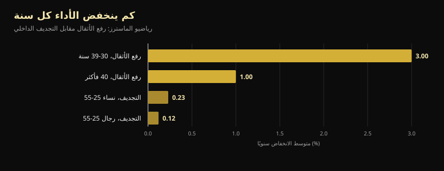
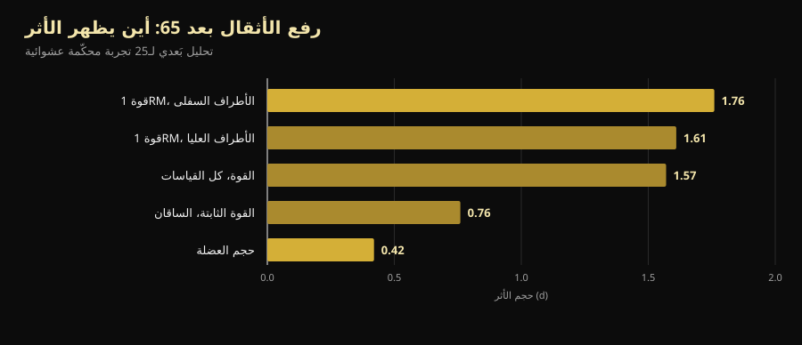

# بطولة العالم للماسترز 2026: ماذا تعلّم من تجاوز الأربعين

بعد أربعة أيام تنطلق في رينو بطولة عالم أصغر لاعب على المنصة فيها في الأربعين وأكبرهم تجاوز السبعين. في ما يلي البرنامج المُتحقَّق منه، والأهم: إجابة السؤال الكامن خلفه — كم من القوة نفقد فعلًا مع التقدّم في العمر، وكم يمكن استعادته.

بقلم [جياماريا لوي](/autore/giammaria-loi) · حُدِّث في 10 أكتوبر 2026

## باختصار

- تقام **بطولة العالم IPF Classic & Equipped للماسترز** في قاعة Reno Ballroom بمدينة رينو (نيفادا) من 14 إلى 25 أكتوبر 2026: الاجتماع الفني في 14، والمنافسة من 15 إلى 24، أولًا الفئة الكلاسيكية ثم المجهّزة.
- أربع فئات عمرية: **M1 من 40 إلى 49، وM2 من 50 إلى 59، وM3 من 60 إلى 69، وM4 من 70 فما فوق**، تُحتسب بالسنة الميلادية لا بتاريخ الميلاد.
- القوة تتراجع أبكر وأسرع من التحمّل، لكن ليس بوتيرة ثابتة: **نحو –3% سنويًا خلال العقد الرابع من العمر، ثم نحو –1% سنويًا**. بعد الأربعين العدوّ ليس المنحنى، بل التوقف عن التدريب.
- **بناء العضلات ممكن حتى في السبعين.** في الحالة الأكثر دراسة، كانت بطلة العالم في فئة 70+ التي بدأت التدريب في الثالثة والستين تملك أليافًا من النوع الثاني أكبر بنسبة 46% من نظيراتها الأصحّاء في العمر نفسه.
- **الخفيف ليس أكثر أمانًا، بل أقل فاعلية فحسب.** سنة من الأحمال الثقيلة بين 64 و75 عامًا أبقت القوة الثابتة عند مستوى البداية بعد أربع سنوات، بينما تراجعت لدى مجموعتي الشدة المعتدلة والمقارنة.

*لاعب من فئة الماسترز يستعدّ للرفعة المميتة في أول منافسة له. الصورة: U.S. Air National Guard (Master Sgt. Charles Delano)، ويكيميديا كومنز، ملكية عامة.*

## متى وأين وكيف تُقام منافسات رينو

تنظّم **بطولة العالم IPF Classic & Equipped للماسترز 2026** كلٌّ من الاتحاد الدولي لرفع الأثقال (IPF) وPowerlifting America، بإدارة تمارا لوبيس. يحدّد التقويم الرسمي للاتحاد النافذة بين **14 و25 أكتوبر 2026**، بينما تحدّد الدعوة الرسمية الاجتماع الفني في 14 أكتوبر الساعة 20:00 في Silver Legacy، والمنافسة من 15 إلى 24 أكتوبر في **Reno Ballroom** بمدينة رينو، نيفادا.

ترتيب المنافسات يبدأ من الأكبر سنًا:

| الأيام | القسم | الفئات |
|---|---|---|
| 15-16 أكتوبر | كلاسيكي | M4 (رجال ونساء) ثم M3 |
| 17-18 أكتوبر | كلاسيكي | M2 (رجال ونساء) |
| 19-21 أكتوبر | كلاسيكي | M1 (رجال ونساء) |
| 22 أكتوبر | مجهّز | M3 وM4 |
| 23 أكتوبر | مجهّز | M2 |
| 24 أكتوبر | مجهّز | M1 |

"كلاسيكي" يعني المنافسة **من دون معدّات داعمة**: حزام ولفّات معصم وواقيات ركبة بسيطة، من دون بدلات قرفصاء أو قمصان ضغط البنش. أما "المجهّز" فيسمح بالبدلة المقوّاة التي ترفع أوزانًا أكبر لكنها تتطلّب تقنية مستقلّة بذاتها.

أوزان المنافسة هي 59 و74 و83 و93 و105 و120 و+120 كجم للرجال، و47 و52 و57 و63 و69 و76 و84 و+84 كجم للنساء. التسجيل يمرّ **عبر الاتحادات الوطنية فقط** ولا يتم من اللاعب مباشرة: ترشيح أولي حتى 16 أغسطس ونهائي حتى 24 سبتمبر 2026.

تفصيل واحد يقول الكثير عن مستوى البطولة: في IPF **يُصنَّف جميع المشاركين هنا بوصفهم لاعبين من المستوى الدولي (International Level Athletes)**، أي يخضعون لقواعد مكافحة المنشّطات نفسها المطبّقة على فئة الكبار. على اللاعبين والمدرّبين الرئيسيين إرفاق شهادة دورة WADA ADEL مع الترشيح، ويدفع كل مشارك 75 يورو رسوم مكافحة منشّطات إضافةً إلى 60 يورو رسوم مشاركة. بطولة الماسترز ليست نسخة مخفّفة من بطولة العالم: القواعد نفسها والمسؤوليات نفسها.

نسخة 2027 محدّدة سلفًا: **سانت جونز في كندا، من 7 إلى 16 أكتوبر**.

## كيف تعمل فئات الماسترز

تُحتسب فئات الاتحاد بـ**السنة الميلادية** لا من تاريخ الميلاد. من يبلغ الخمسين في ديسمبر يصبح في فئة M2 منذ الأول من يناير من العام نفسه.

| الفئة | العمر |
|---|---|
| M1 | من سنة بلوغ الأربعين إلى سنة بلوغ التاسعة والأربعين |
| M2 | من سنة الخمسين إلى سنة التاسعة والخمسين |
| M3 | من سنة الستين إلى سنة التاسعة والستين |
| M4 | من سنة السبعين فصاعدًا |

سلّم يغطي ثلاثين سنة من التغيّر البيولوجي. ومن هنا يبدأ الجزء المثير للاهتمام.

*القرفصاء في المنافسة: الحركة نفسها ومعايير التحكيم نفسها، من سنّ الرابعة عشرة إلى السبعين وما بعدها. الصورة: U.S. Army Reserve (Sgt. 1st Class Abel M. Aungst)، ويكيميديا كومنز، ملكية عامة.*

## ماذا تقول الأبحاث فعلًا

### "بعد الأربعين تنهار القوة" — **يحتاج إلى تدقيق**

قارنت دراسة بين لاعبي الماسترز في رفع الأثقال وفي التجديف الداخلي، فقاست أمرين مختلفين. أداء القوة يتراجع أبكر وأسرع من أداء التحمّل، لكن ليس بسرعة ثابتة: **–3% سنويًا خلال العقد الرابع من العمر، ثم نحو –1% سنويًا**. في التجديف، بين 25 و55 عامًا، يبلغ التراجع السنوي 0.12% لدى الرجال و0.23% لدى النساء (Galloway وآخرون، 2002).

*متوسط التراجع السنوي في الأداء لدى لاعبي الماسترز. البيانات: Galloway وآخرون، 2002.*

قراءتان، كلتاهما صحيحة. الأولى: القوة هي الصفة التي تذهب أولًا، ولهذا تحديدًا يجب تدريبها. والثانية، وهي ما تتجاهله المنشورات التحفيزية: **أشدّ أجزاء المنحنى انحدارًا يقع قبل الأربعين** لا بعدها. ولاعب في فئة M2 يفقد 1% سنويًا يستطيع تعويض ذلك بالتدريب لسنوات — وهذا بالضبط ما يُرى على منصة رينو.

### "في السبعين لا تُبنى عضلات" — **مفنَّد**

درس فريق من جامعة ماستريخت في المختبر بطلة العالم في رفع الأثقال لفئة 70+: عمرها 71 عامًا، و**بدأت التدريب بالأثقال في الثالثة والستين من دون أي خبرة سابقة بتدريب منظّم**. مقارنةً بنساء أصحّاء في عمرها، كان مؤشّر كتلتها العضلية أعلى بنسبة 33%، ومقطع عضلة الفخذ الرباعية أكبر بنسبة 37%، وألياف النوع الثاني (السريعة، وهي أول ما يُفقد مع العمر) أكبر بنسبة 46%، وقوّتها في جهاز دفع الأرجل أعلى بنسبة 36%، وقبضتها أقوى بنسبة 33% (Fuchs وآخرون، 2024).

هي حالة فردية وينبغي قراءتها كذلك: لا تثبت أن بإمكان أي شخص أن يصبح بطل العالم في 71. بل تثبت أن عضلة شخص في الثالثة والستين لم يتدرّب يومًا **ما زالت تستجيب** — بما يكفي لتضعه حيث لا يصل أقرانه.

### "بعد سنّ معيّنة يجب التدريب الخفيف" — **مفنَّد**

وزّعت التجربة الدنماركية LISA عشوائيًا 451 شخصًا في سن التقاعد على ثلاث مجموعات: سنة من التدريب بـ**أحمال ثقيلة**، أو سنة بشدّة معتدلة، أو من دون تدريب. ثم تابعتهم أربع سنوات. ومن بين 369 أُعيد فحصهم في النهاية (متوسط العمر 71 عامًا، 61% نساء)، **وحدها مجموعة الأحمال الثقيلة حافظت على القوة الثابتة للساقين عند مستوى البداية** (149.7 نيوتن·متر في البداية و151.5 بعد أربع سنوات). أما المجموعتان الأخريان فتراجعتا (Bloch-Ibenfeldt وآخرون، 2024).

سنة من العمل الثقيل اشترت أربع سنوات من القوة المحفوظة. العمل الخفيف لم يفعل.

### "الأثقال تبني العضلة في السبعين كما في الخامسة والعشرين" — **يحتاج إلى تدقيق**

التحليل البَعدي المرجعي لـ25 تجربة محكّمة على أشخاص بمتوسط عمر 65 عامًا فأكثر يجد أثرين مختلفين جدًا: **كبير على القوة (d = 1.57) وصغير على حجم العضلة (d = 0.42)**. أكثر القياسات تحرّكًا هي القوة القصوى للأطراف السفلى (d = 1.76) (Borde وآخرون، 2015).

*حجم الأثر (d) لتدريب المقاومة بعد سن 65. البيانات: Borde وآخرون، 2015، تحليل بَعدي لـ25 تجربة محكّمة عشوائية.*

بعبارة أخرى: بعد الخامسة والستين، الأثقال تجعلك أقوى بكثير وأضخم قليلًا. وإذا كان الهدف النهوض من الكرسي وصعود الدرج وعدم السقوط، فالعمود الأول هو ما يهمّ. وفي التحليل نفسه، أكثر الشدات فاعلية للقوة هي **70-79% من الحد الأقصى**، بحصّتين أسبوعيًا و2-3 مجموعات لكل تمرين و7-9 تكرارات: أرقام أقرب بكثير إلى صالة أثقال حقيقية منها إلى "رياضة كبار السن". ولمعرفة مصدر هذه النطاقات، تناولناها في [كم تكرارًا تحتاج لبناء الكتلة العضلية](/ar/blog/kam-takrar-lilkutla-aladalia).

### "عند كبار السن الضعفاء تحلّ الأثقال كل شيء" — **يحتاج إلى تدقيق**

هنا الجزء غير المريح. تحليل بَعدي من 2025 شمل 24 دراسة و951 مسنًّا **مشخَّصين بضمور العضلات (الساركوبينيا)** وجد تحسّنًا دالًّا إحصائيًا في قوة القبضة وسرعة المشي والنهوض من الكرسي، لكنه **دون عتبة الفرق الأدنى ذي الدلالة السريرية**: تحسّن حقيقي وقابل للقياس لا يشعر به المريض دائمًا في حياته اليومية (Yan وآخرون، 2025). ويقدّر الباحثون الجرعة الدنيا المفيدة بنحو 600 MET-دقيقة أسبوعيًا.

يبقى التدريب القرار الصحيح. لكن من يَعِد بأن الأثقال تعيد مسنًّا في الثمانين مصابًا بالساركوبينيا إلى ثلاثينياته فهو يبيع شيئًا ما.

### "المهم هو التدريب، والبروتين لاحقًا" — **يحتاج إلى تدقيق**

في التحليل البَعدي لـ74 تجربة محكّمة، تؤدّي زيادة البروتين مع التدريب إلى كتلة خالية من الدهون أكبر، والعتبة تتغيّر مع العمر: **فوق 65 عامًا يظهر الأثر بدءًا من 1.2-1.59 غرام لكل كيلوغرام من الوزن يوميًا**، بينما يحتاج من هم دون 65 إلى 1.6 غرام/كغ على الأقل (Nunes وآخرون، 2022). والآثار صغيرة: البروتين يضيف إلى التدريب ولا يحلّ محلّه.

أما المكمّلات فصورتها أكثر تواضعًا: لدى كبار السن المصابين بالساركوبينيا، يحسّن بروتين مصل اللبن مع الأثقال الكتلة العضلية بأثر صغير (SMD 0.24) وقوة القبضة بمقدار 2.31 كجم، لكن **درجة اليقين في الأدلة منخفضة إلى منخفضة جدًا** والفرق لا يتجاوز عتبة الدلالة السريرية (Cuyul-Vásquez وآخرون، 2023).

*ضغط البنش هو الحركة التي يفقد فيها الماسترز أقل ما يفقدون: التحليل البَعدي لمن تجاوزوا 65 يُظهر آثارًا كبيرة في قوة الجزء العلوي أيضًا. الصورة: U.S. Air Force (Airman 1st Class Jordan Gonzalez)، ويكيميديا كومنز، ملكية عامة.*

## كيف تطبّق هذا

1. **لا تغيّر الرياضة، غيّر طريقة الإدارة.** بعد الأربعين تبقى التمارين نفسها. ما يتغيّر هو كم مرة يمكنك الدفع حتى الحد، وكم تحتاج بين الحصص الثقيلة.
2. **أبقِ الحمل حيث ينفع: 70-79% من الحد الأقصى.** هذا هو النطاق صاحب الأثر الأكبر على القوة فوق 65 عامًا، ولا سبب للنزول عنه بحجة العمر وحده. حصّتان أسبوعيًا و2-3 مجموعات و7-9 تكرارات نقطة انطلاق قابلة للاستمرار.
3. **اختر الهدف المناسب لعمرك.** بعد الخامسة والستين يعطي التدريب في القوة أكثر بكثير مما يعطي في السنتيمترات. ومن يحكم بالمرآة وحدها سيستنتج أنه لا ينفع بينما هو ينفع.
4. **ارفع البروتين قبل شراء المكمّلات.** من 1.2 غرام/كغ يوميًا فصاعدًا، مع التدريب، هي الرافعة الأقوى دعمًا. المسحوق مريح لا سحري.
5. **سجّل الأحمال لا الأحاسيس.** الفرق بين تراجع طبيعي بنسبة 1% سنويًا وتراجع ناتج عن سوء الإدارة لا يظهر إلا بمقارنة الأرقام على مدى أشهر. بالإحساس وحده يبدوان متطابقين.
6. **إن كنت تبدأ بعد الستين، ابدأ من التقنية ومن أحمال مقاسة**، واعرض البرنامج على مختص إن كانت لديك أمراض أو إصابات قائمة. هامش التحسّن حقيقي، أما هامش الخطأ فأضيق.

> ### 💡 مع Nurvan
> **بعد الأربعين لا يُرتجل التقدّم، بل يُقاس.** يسجّل Nurvan الحمل والتكرارات وRIR — أي التكرارات المتبقّية في الخزّان عند نهاية المجموعة — لكل مجموعة على حدة، فترى بعد ستة أشهر ما إذا كان ضغط البنش متوقفًا فعلًا أم أنك مررت بأسبوع سيّئ فحسب. ويقترح التطبيق مجموعات الإحماء تلقائيًا، وهو أمر ليس تفصيلًا في الخمسين، ويحفظ القياسات والتحاليل في المكان نفسه مع البرنامج. ولديك بالفعل برنامج من مدرّبك؟ استورده من PDF أو Excel أو حتى من صورة. [جرّب Nurvan](https://nurvan.app)

## أسئلة شائعة

**في أي عمر يمكن المنافسة ضمن فئة الماسترز في رفع الأثقال؟**
من سنّ الأربعين. يحتسب الاتحاد بالسنة الميلادية: تدخل فئة M1 في الأول من يناير من العام الذي تبلغ فيه الأربعين، ثم M2 عند الخمسين وM3 عند الستين وM4 من السبعين فصاعدًا. والتسجيل في بطولة العالم يمرّ دائمًا عبر الاتحاد الوطني.

**كم من القوة تُفقد سنويًا بعد الأربعين؟**
في بيانات لاعبي الماسترز يستقرّ التراجع عند نحو 1% سنويًا بعد المرحلة الأشدّ انحدارًا، وهي الواقعة في العقد الرابع من العمر (Galloway وآخرون، 2002). وهذا متوسط جماعي: التدريب يُزيح الحالة الفردية كثيرًا في الاتجاهين.

**هل يمكن البدء بالأثقال في الستين أو السبعين؟**
نعم، والآثار قابلة للقياس. أفضل الحالات توثيقًا امرأة بدأت في الثالثة والستين من دون خبرة وصارت بطلة العالم لفئة 70+ (Fuchs وآخرون، 2024). ولمن لا يسعى إلى الميداليات: سنة من التدريب الثقيل في سن التقاعد حافظت على القوة في السنوات الأربع التالية (Bloch-Ibenfeldt وآخرون، 2024). وإذا كانت لديك أمراض قائمة فاعرض البرنامج على طبيبك أولًا.

**هل الأوزان الخفيفة والتكرارات الكثيرة أفضل بعد 65؟**
ليس للقوة. ففي التحليل البَعدي المرجعي تحقّق الشدّة 70-79% من الحد الأقصى الأثر الأكبر (Borde وآخرون، 2015)، وفي تجربة LISA حافظت على القوة بعد أربع سنوات مجموعةُ التدريب الثقيل وحدها. الحمل يُبنى مع الوقت ولا يُتجنَّب من حيث المبدأ.

## اقرأ أيضًا

- [الكرياتين من دون تمرين بعد سن 45: ماذا تقول الدراسة](/ar/blog/creatine-bidun-tamarin-baad-45)
- [كم تكرارًا لبناء الكتلة العضلية: خرافة 8-12](/ar/blog/kam-takrar-lilkutla-aladalia)
- [تقسيم التدريب: المبتدئ مقابل المتقدّم](/ar/blog/taqsim-altadrib-mubtadi-mutaqaddim)

## المصادر

1. Galloway MT, Kadoko R, Jokl P, 2002. *Effect of aging on male and female master athletes' performance in strength versus endurance activities.* Am J Orthop (Belle Mead NJ) 31(2):93–98. PMID 11876284 — [pubmed.ncbi.nlm.nih.gov/11876284](https://pubmed.ncbi.nlm.nih.gov/11876284/)
2. Fuchs CJ, Trommelen J, Weijzen MEG, et al., 2024. *Becoming a World Champion Powerlifter at 71 Years of Age: It Is Never Too Late to Start Exercising.* Int J Sport Nutr Exerc Metab 34(4):223–231. PMID 38458181 — [doi:10.1123/ijsnem.2023-0230](https://doi.org/10.1123/ijsnem.2023-0230)
3. Bloch-Ibenfeldt M, Theil Gates A, Karlog K, Demnitz N, Kjaer M, Boraxbekk CJ, 2024. *Heavy resistance training at retirement age induces 4-year lasting beneficial effects in muscle strength: a long-term follow-up of an RCT.* BMJ Open Sport Exerc Med 10(2):e001899. PMID 38911477 — [doi:10.1136/bmjsem-2024-001899](https://doi.org/10.1136/bmjsem-2024-001899)
4. Borde R, Hortobágyi T, Granacher U, 2015. *Dose-Response Relationships of Resistance Training in Healthy Old Adults: A Systematic Review and Meta-Analysis.* Sports Med 45(12):1693–1720. PMID 26420238 — [doi:10.1007/s40279-015-0385-9](https://doi.org/10.1007/s40279-015-0385-9)
5. Yan R, Chen Y, Zhang R, He J, Lin W, Sun J, Li D, 2025. *Optimal resistance training prescriptions to improve muscle strength, physical function, and muscle mass in older adults diagnosed with sarcopenia: a systematic review and meta-analysis.* Aging Clin Exp Res 37(1):320. PMID 41212331 — [doi:10.1007/s40520-025-03235-w](https://doi.org/10.1007/s40520-025-03235-w)
6. Nunes EA, Colenso-Semple L, McKellar SR, et al., 2022. *Systematic review and meta-analysis of protein intake to support muscle mass and function in healthy adults.* J Cachexia Sarcopenia Muscle 13(2):795–810. PMID 35187864 — [doi:10.1002/jcsm.12922](https://doi.org/10.1002/jcsm.12922)
7. Cuyul-Vásquez I, Pezo-Navarrete J, Vargas-Arriagada C, et al., 2023. *Effectiveness of Whey Protein Supplementation during Resistance Exercise Training on Skeletal Muscle Mass and Strength in Older People with Sarcopenia.* Nutrients 15(15):3424. PMID 37571361 — [doi:10.3390/nu15153424](https://doi.org/10.3390/nu15153424)

البيانات الوصفية والملخّصات مستخرجة من PubMed. معطيات الحدث من [الدعوة الرسمية لاتحاد IPF وPowerlifting America](https://www.powerlifting.sport/fileadmin/ipf/data/championships/informations/2026/masters/2026_IPF_World_Masters_Powerlifting_Championships_Invitation_USA-03.pdf) و[التقويم الرسمي للاتحاد](https://www.powerlifting.sport/championships/calendar)، وقد جرى الاطلاع عليهما في 10 أكتوبر 2026. الفئات العمرية وأوزان المنافسة من اللائحة الفنية للاتحاد. لا توقّعات للنتائج ولا تعليق على لاعبين بعينهم.

---

**جياماريا لوي** مؤسّس Nurvan. يتدرّب بالأثقال منذ 2012، ويعمل مدرّبًا شخصيًا ومدرّبًا معتمدًا من FIPE منذ 2013، وينافس في رفع الأثقال على المستوى الوطني منذ 2018. كل مقال يوقّعه ينطلق من الدراسات العلمية وينتهي إلى ما ينفع فعلًا في الصالة.

> ملاحظة: محتوى تثقيفي لا يغني عن رأي الطبيب أو المختص. إذا كانت لديك أمراض أو تتناول أدوية أو تعود بعد انقطاع طويل، فاعرض برنامجك على طبيب أو مختص مؤهّل قبل البدء.
