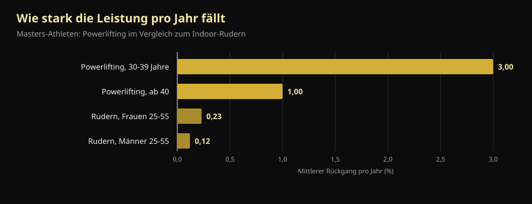
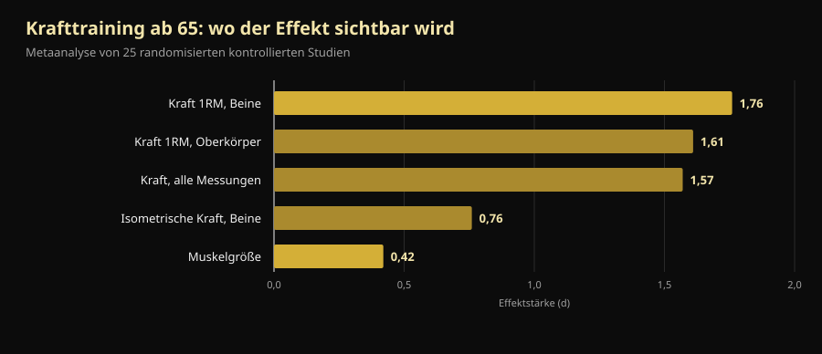

# Masters-WM 2026: was sie allen über 40 beibringt

In vier Tagen beginnt in Reno eine Weltmeisterschaft, bei der die jüngste Person auf der Bühne 40 Jahre alt ist und die älteste über 70. Hier steht der geprüfte Zeitplan — und vor allem die Antwort auf die Frage dahinter: Wie viel Kraft verliert man mit dem Alter wirklich, und wie viel holt man zurück?

Von [Giammaria Loi](/autore/giammaria-loi) · aktualisiert am 10. Oktober 2026

## Kurz gefasst

- Die **IPF World Classic & Equipped Masters Championships** finden vom 14. bis 25. Oktober 2026 im Reno Ballroom in Reno, Nevada, statt: technische Sitzung am 14., Wettkampf vom 15. bis 24., erst klassisch, dann ausgerüstet.
- Vier Altersklassen: **M1 40-49, M2 50-59, M3 60-69, M4 ab 70**, gezählt nach Kalenderjahr und nicht nach Geburtstag.
- Kraft fällt früher und schneller ab als Ausdauer, aber nicht gleichmäßig: **rund –3 % pro Jahr im vierten Lebensjahrzehnt, danach etwa –1 % pro Jahr**. Nach 40 ist nicht die Kurve der Gegner, sondern das Aufhören.
- **Muskel lässt sich auch mit 70 aufbauen.** Im am genauesten untersuchten Fall hatte eine Weltmeisterin der Klasse 70+, die mit 63 angefangen hatte, 46 % größere Typ-II-Fasern als gesunde Gleichaltrige.
- **Leicht ist nicht sicherer, nur weniger wirksam.** Ein Jahr schweres Training zwischen 64 und 75 ließ die isometrische Kraft vier Jahre später noch auf Ausgangsniveau; die Gruppen mit moderater Intensität und ohne Training waren abgefallen.

*Ein Athlet der Masters-Klasse in der Startposition beim Kreuzheben, bei seinem ersten Wettkampf. Foto: U.S. Air National Guard (Master Sgt. Charles Delano), Wikimedia Commons, gemeinfrei.*

## Wann, wo und wie in Reno gehoben wird

Die **IPF World Classic & Equipped Masters Championships 2026** richten die International Powerlifting Federation und Powerlifting America aus, Meet Director ist Tamara Lopes. Der offizielle IPF-Kalender nennt das Fenster **14.-25. Oktober 2026**; die offizielle Einladung setzt die technische Sitzung auf den 14. Oktober, 20:00 Uhr im Silver Legacy, und den Wettkampf auf den 15. bis 24. Oktober im **Reno Ballroom** in Reno, Nevada.

Die Reihenfolge läuft von alt nach jung:

| Tage | Sektion | Klassen |
|---|---|---|
| 15.-16. Oktober | Classic | M4 (Männer und Frauen), dann M3 |
| 17.-18. Oktober | Classic | M2 (Männer und Frauen) |
| 19.-21. Oktober | Classic | M1 (Männer und Frauen) |
| 22. Oktober | Equipped | M3 und M4 |
| 23. Oktober | Equipped | M2 |
| 24. Oktober | Equipped | M1 |

"Classic" heißt Wettkampf **ohne unterstützende Ausrüstung**: Gürtel, Handgelenkbandagen und einfache Kniebandagen, keine Kniebeugenanzüge und keine Bankdrückshirts. "Equipped" erlaubt den verstärkten Anzug, der mehr Gewicht zulässt, aber eine eigene Technik verlangt.

Die Gewichtsklassen sind 59, 74, 83, 93, 105, 120 und +120 kg bei den Männern sowie 47, 52, 57, 63, 69, 76, 84 und +84 kg bei den Frauen. Meldungen laufen **ausschließlich über die nationalen Verbände**, nie über die Athletinnen und Athleten selbst: vorläufige Meldung bis 16. August, endgültige bis 24. September 2026.

Ein Detail sagt viel über den Anspruch: Bei der IPF gelten **alle Teilnehmenden hier als International Level Athletes**, also unter denselben Anti-Doping-Regeln wie die Open-Klasse. Athletinnen, Athleten und Cheftrainer müssen der Meldung das Zertifikat des WADA-ADEL-Kurses beilegen, und jede Meldung kostet 75 € Anti-Doping-Gebühr zusätzlich zu 60 € Startgeld. Eine Masters-WM ist keine abgeschwächte WM: dasselbe Regelwerk, dieselbe Verantwortung.

Die Ausgabe 2027 steht bereits fest: **St. John's, Kanada, 7. bis 16. Oktober**.

## Wie die Masters-Klassen funktionieren

Die IPF-Altersklassen zählen nach **Kalenderjahr**, nicht ab dem Geburtstag. Wer im Dezember 50 wird, ist schon ab dem 1. Januar desselben Jahres M2.

| Klasse | Alter |
|---|---|
| M1 | vom Jahr des 40. bis zum Jahr des 49. Geburtstags |
| M2 | vom Jahr des 50. bis zum Jahr des 59. |
| M3 | vom Jahr des 60. bis zum Jahr des 69. |
| M4 | ab dem Jahr des 70. |

Eine Skala über dreißig Jahre Biologie. Und genau da wird es interessant.

*Kniebeuge im Wettkampf: dieselbe Übung, dieselben Wertungskriterien, von 14 bis 70 und darüber hinaus. Foto: U.S. Army Reserve (Sgt. 1st Class Abel M. Aungst), Wikimedia Commons, gemeinfrei.*

## Was die Forschung tatsächlich sagt

### "Nach 40 bricht die Kraft ein" — **Zu präzisieren**

Eine Studie, die Masters-Athleten im Powerlifting und im Indoor-Rudern verglich, maß zwei verschiedene Dinge. Die Kraftleistung fällt früher und schneller ab als die Ausdauerleistung, aber nicht gleichmäßig: **–3 % pro Jahr im vierten Lebensjahrzehnt, danach rund –1 % pro Jahr**. Beim Rudern liegt der jährliche Rückgang zwischen 25 und 55 Jahren bei 0,12 % (Männer) und 0,23 % (Frauen) (Galloway et al., 2002).

*Mittlerer jährlicher Leistungsrückgang bei Masters-Athleten. Daten: Galloway et al., 2002.*

Zwei Lesarten, beide richtig. Erstens: Kraft ist die Eigenschaft, die zuerst geht — genau deshalb muss sie trainiert werden. Zweitens, und das lassen Motivationsposts weg: **Der steilste Abschnitt der Kurve liegt vor dem 40. Lebensjahr**, nicht danach. Wer als M2 ein Prozent pro Jahr verliert, kann das jahrelang wegtrainieren — und genau das sieht man in Reno auf der Bühne.

### "Mit 70 baut man keinen Muskel mehr auf" — **Widerlegt**

Eine Gruppe der Universität Maastricht hat die Powerlifting-Weltmeisterin der Klasse 70+ im Labor untersucht: 71 Jahre alt, **sie begann mit 63 mit dem Krafttraining, ohne jede Erfahrung mit strukturiertem Training**. Im Vergleich zu gesunden Gleichaltrigen hatte sie einen um 33 % höheren Muskelmasse-Index, einen um 37 % größeren Quadrizepsquerschnitt, um 46 % größere Typ-II-Fasern (die schnellen, die mit dem Alter zuerst verloren gehen), 36 % mehr Kraft an der Beinpresse und 33 % mehr Griffkraft (Fuchs et al., 2024).

Es ist ein Einzelfall und so zu lesen: Er beweist nicht, dass jede Person mit 71 Weltmeisterin werden kann. Er beweist, dass der Muskel einer nie trainierten 63-Jährigen **noch reagiert** — genug, um sie dorthin zu bringen, wo ihre Altersgenossinnen nicht sind.

### "Ab einem gewissen Alter muss man leicht trainieren" — **Widerlegt**

Die dänische LISA-Studie teilte 451 Personen im Rentenalter zufällig in drei Gruppen: ein Jahr Training mit **schweren Lasten**, ein Jahr mit moderater Intensität oder kein Training. Danach folgte sie ihnen vier Jahre. Von den 369 am Ende erneut Getesteten (Durchschnittsalter 71 Jahre, 61 % Frauen) hatte **nur die Schwerlast-Gruppe die isometrische Beinkraft auf Ausgangsniveau gehalten** (149,7 Nm zu Beginn, 151,5 Nm vier Jahre später). Die beiden anderen waren abgefallen (Bloch-Ibenfeldt et al., 2024).

Ein Jahr schwere Arbeit hat vier Jahre erhaltene Kraft gekauft. Leichtes Training nicht.

### "Krafttraining baut mit 70 Muskeln auf wie mit 25" — **Zu präzisieren**

Die Referenz-Metaanalyse über 25 kontrollierte Studien mit einem Durchschnittsalter ab 65 findet zwei sehr unterschiedliche Effekte: **groß auf die Kraft (d = 1,57), klein auf die Muskelgröße (d = 0,42)**. Die Maximalkraft der Beine bewegt sich am stärksten (d = 1,76) (Borde et al., 2015).

*Effektstärke (d) von Krafttraining ab 65 Jahren. Daten: Borde et al., 2015, Metaanalyse von 25 randomisierten kontrollierten Studien.*

Übersetzt: Nach 65 macht Krafttraining deutlich stärker und etwas größer. Wenn das Ziel heißt, vom Stuhl aufzustehen, Treppen zu steigen und nicht zu stürzen, zählt die erste Spalte. In derselben Analyse ist die wirksamste Intensität für Kraft **70-79 % des Maximums**, bei zwei Einheiten pro Woche, 2-3 Sätzen pro Übung und 7-9 Wiederholungen: Zahlen, die dem echten Kraftraum weit näher sind als der "Seniorengymnastik". Woher diese Bereiche kommen, steht in [wie viele Wiederholungen für Muskelaufbau](/de/blog/wie-viele-wiederholungen-muskelaufbau).

### "Bei gebrechlichen Älteren löst Krafttraining alles" — **Zu präzisieren**

Jetzt der unbequeme Teil. Eine Metaanalyse von 2025 über 24 Studien und 951 ältere Menschen **mit diagnostizierter Sarkopenie** findet statistisch signifikante Verbesserungen bei Griffkraft, Gehgeschwindigkeit und Aufstehen vom Stuhl, aber **unterhalb der minimal klinisch bedeutsamen Differenz**: echte, messbare Fortschritte, die im Alltag nicht immer spürbar sind (Yan et al., 2025). Die Autoren setzen die minimale nützliche Dosis bei etwa 600 MET-Minuten pro Woche an.

Trainieren bleibt richtig. Wer aber verspricht, Krafttraining bringe einen sarkopenen Achtzigjährigen zurück in seine Dreißiger, verkauft etwas.

### "Es zählt nur das Training, Protein kommt danach" — **Zu präzisieren**

In der Metaanalyse über 74 kontrollierte Studien bringt mehr Protein zusätzlich zum Training mehr Magermasse, und die Schwelle verschiebt sich mit dem Alter: **über 65 zeigt sich der Effekt bereits ab 1,2-1,59 g pro kg Körpergewicht und Tag**, unter 65 braucht es mindestens 1,6 g/kg (Nunes et al., 2022). Die Effekte sind klein: Protein ergänzt das Training, es ersetzt es nicht.

Bei Supplementen ist das Bild noch bescheidener: Bei älteren Menschen mit Sarkopenie verbessert Whey zusätzlich zum Krafttraining die Muskelmasse mit einem kleinen Effekt (SMD 0,24) und die Griffkraft um 2,31 kg, doch **die Vertrauenswürdigkeit der Evidenz ist niedrig bis sehr niedrig** und der Unterschied überschreitet die Schwelle klinischer Relevanz nicht (Cuyul-Vásquez et al., 2023).

*Das Bankdrücken ist die Disziplin, in der Masters am wenigsten verlieren: Die Metaanalyse ab 65 zeigt auch im Oberkörper große Effekte. Foto: U.S. Air Force (Airman 1st Class Jordan Gonzalez), Wikimedia Commons, gemeinfrei.*

## So setzt du es um

1. **Wechsle nicht den Sport, wechsle das Management.** Nach 40 bleiben die Übungen gleich. Was sich ändert, ist, wie oft du ans Limit gehen kannst und wie viel Zeit zwischen schweren Einheiten nötig ist.
2. **Halte die Last dort, wo sie wirkt: 70-79 % des Maximums.** Das ist der Bereich mit dem größten Effekt auf die Kraft ab 65, und es gibt keinen Grund, allein wegen des Alters darunter zu bleiben. Zwei Einheiten pro Woche, 2-3 Sätze, 7-9 Wiederholungen sind ein tragfähiger Start.
3. **Wähle das Ziel, das zu deinem Alter passt.** Ab 65 zahlt Training weit mehr in Kraft als in Zentimetern. Wer nur im Spiegel bewertet, hält es für wirkungslos, während es wirkt.
4. **Erhöhe das Protein, bevor du Supplemente kaufst.** Ab 1,2 g/kg pro Tag, zusammen mit Training, ist der am besten belegte Hebel. Pulver ist bequem, nicht magisch.
5. **Protokolliere Lasten, nicht Gefühle.** Der Unterschied zwischen einem normalen Rückgang von 1 % pro Jahr und einem Rückgang durch falsches Management zeigt sich nur im Vergleich von Zahlen über Monate. Nach Gefühl sind beide identisch.
6. **Wer über 60 neu anfängt, beginnt mit Technik und gemessenen Lasten** und lässt das Programm bei Vorerkrankungen oder aktuellen Verletzungen von einer Fachperson prüfen. Der Spielraum nach oben ist real; der für Fehler ist enger.

> ### 💡 Mit Nurvan
> **Nach 40 wird Progression nicht improvisiert, sondern gemessen.** Nurvan protokolliert Last, Wiederholungen und RIR — die Wiederholungen, die am Satzende noch im Tank sind — für jeden einzelnen Satz. Nach sechs Monaten siehst du schwarz auf weiß, ob dein Bankdrücken wirklich steht oder ob es nur eine schlechte Woche war. Aufwärmsätze schlägt die App automatisch vor, was mit fünfzig kein Detail ist, und Maße sowie Laborwerte liegen am selben Ort wie der Plan. Schon ein Plan vom Coach? Importiere ihn aus PDF, Excel oder sogar aus einem Foto. [Nurvan testen](https://nurvan.app)

## Häufige Fragen

**Ab welchem Alter startet man im Powerlifting als Master?**
Ab 40. Die IPF zählt nach Kalenderjahr: M1 ab dem 1. Januar des Jahres, in dem man 40 wird, dann M2 ab 50, M3 ab 60 und M4 ab 70. Die Meldung zur WM läuft immer über den nationalen Verband.

**Wie viel Kraft verliert man nach 40 pro Jahr?**
In den Daten zu Masters-Athleten pendelt sich der Rückgang nach der steilsten Phase, die im vierten Lebensjahrzehnt liegt, bei rund 1 % pro Jahr ein (Galloway et al., 2002). Das ist ein Gruppenmittel: Training verschiebt den Einzelfall deutlich, in beide Richtungen.

**Kann man mit 60 oder 70 noch mit Krafttraining anfangen?**
Ja, und die Effekte sind messbar. Der bestdokumentierte Fall ist eine Frau, die mit 63 ohne Erfahrung begann und Weltmeisterin der Klasse 70+ wurde (Fuchs et al., 2024). Wer keine Medaillen anstrebt: Ein Jahr schweres Training im Rentenalter erhielt die Kraft über die folgenden vier Jahre (Bloch-Ibenfeldt et al., 2024). Bei Vorerkrankungen vorher ärztlich abklären lassen.

**Sind leichte Gewichte und viele Wiederholungen ab 65 besser?**
Für die Kraft nicht. In der Referenz-Metaanalyse hat 70-79 % des Maximums den größten Effekt (Borde et al., 2015), und in der LISA-Studie hielt nur die schwer trainierende Gruppe ihre Kraft über vier Jahre. Last wird über die Zeit aufgebaut, nicht aus Prinzip vermieden.

## Auch lesenswert

- [Kreatin ohne Training ab 45: was die Studie zeigt](/de/blog/kreatin-ohne-training-ab-45)
- [Wie viele Wiederholungen für Muskelaufbau: der 8-12-Mythos](/de/blog/wie-viele-wiederholungen-muskelaufbau)
- [Trainingssplit: Anfänger gegen Fortgeschrittene](/de/blog/trainingssplit-anfaenger-fortgeschrittene)

## Quellen

1. Galloway MT, Kadoko R, Jokl P, 2002. *Effect of aging on male and female master athletes' performance in strength versus endurance activities.* Am J Orthop (Belle Mead NJ) 31(2):93–98. PMID 11876284 — [pubmed.ncbi.nlm.nih.gov/11876284](https://pubmed.ncbi.nlm.nih.gov/11876284/)
2. Fuchs CJ, Trommelen J, Weijzen MEG, et al., 2024. *Becoming a World Champion Powerlifter at 71 Years of Age: It Is Never Too Late to Start Exercising.* Int J Sport Nutr Exerc Metab 34(4):223–231. PMID 38458181 — [doi:10.1123/ijsnem.2023-0230](https://doi.org/10.1123/ijsnem.2023-0230)
3. Bloch-Ibenfeldt M, Theil Gates A, Karlog K, Demnitz N, Kjaer M, Boraxbekk CJ, 2024. *Heavy resistance training at retirement age induces 4-year lasting beneficial effects in muscle strength: a long-term follow-up of an RCT.* BMJ Open Sport Exerc Med 10(2):e001899. PMID 38911477 — [doi:10.1136/bmjsem-2024-001899](https://doi.org/10.1136/bmjsem-2024-001899)
4. Borde R, Hortobágyi T, Granacher U, 2015. *Dose-Response Relationships of Resistance Training in Healthy Old Adults: A Systematic Review and Meta-Analysis.* Sports Med 45(12):1693–1720. PMID 26420238 — [doi:10.1007/s40279-015-0385-9](https://doi.org/10.1007/s40279-015-0385-9)
5. Yan R, Chen Y, Zhang R, He J, Lin W, Sun J, Li D, 2025. *Optimal resistance training prescriptions to improve muscle strength, physical function, and muscle mass in older adults diagnosed with sarcopenia: a systematic review and meta-analysis.* Aging Clin Exp Res 37(1):320. PMID 41212331 — [doi:10.1007/s40520-025-03235-w](https://doi.org/10.1007/s40520-025-03235-w)
6. Nunes EA, Colenso-Semple L, McKellar SR, et al., 2022. *Systematic review and meta-analysis of protein intake to support muscle mass and function in healthy adults.* J Cachexia Sarcopenia Muscle 13(2):795–810. PMID 35187864 — [doi:10.1002/jcsm.12922](https://doi.org/10.1002/jcsm.12922)
7. Cuyul-Vásquez I, Pezo-Navarrete J, Vargas-Arriagada C, et al., 2023. *Effectiveness of Whey Protein Supplementation during Resistance Exercise Training on Skeletal Muscle Mass and Strength in Older People with Sarcopenia.* Nutrients 15(15):3424. PMID 37571361 — [doi:10.3390/nu15153424](https://doi.org/10.3390/nu15153424)

Metadaten und Abstracts über PubMed abgerufen. Angaben zum Event: [offizielle Einladung der IPF/Powerlifting America](https://www.powerlifting.sport/fileadmin/ipf/data/championships/informations/2026/masters/2026_IPF_World_Masters_Powerlifting_Championships_Invitation_USA-03.pdf) und [offizieller IPF-Kalender](https://www.powerlifting.sport/championships/calendar), abgerufen am 10. Oktober 2026. Altersklassen und Gewichtsklassen aus dem technischen Regelwerk der IPF. Keine Prognosen und keine Kommentare zu einzelnen Startenden.

---

**Giammaria Loi** ist Gründer von Nurvan. Er trainiert seit 2012 mit Gewichten, arbeitet seit 2013 als FIPE-zertifizierter Personal Trainer und Coach und startet seit 2018 im Powerlifting auf nationaler Ebene. Jeder Artikel, den er zeichnet, beginnt bei den Studien und endet bei dem, was im Kraftraum tatsächlich funktioniert.

> Hinweis: informativer Inhalt, kein Ersatz für ärztlichen oder fachlichen Rat. Bei Vorerkrankungen, laufender Medikation oder Wiedereinstieg nach langer Pause lass deinen Plan vor dem Start ärztlich oder fachlich prüfen.
