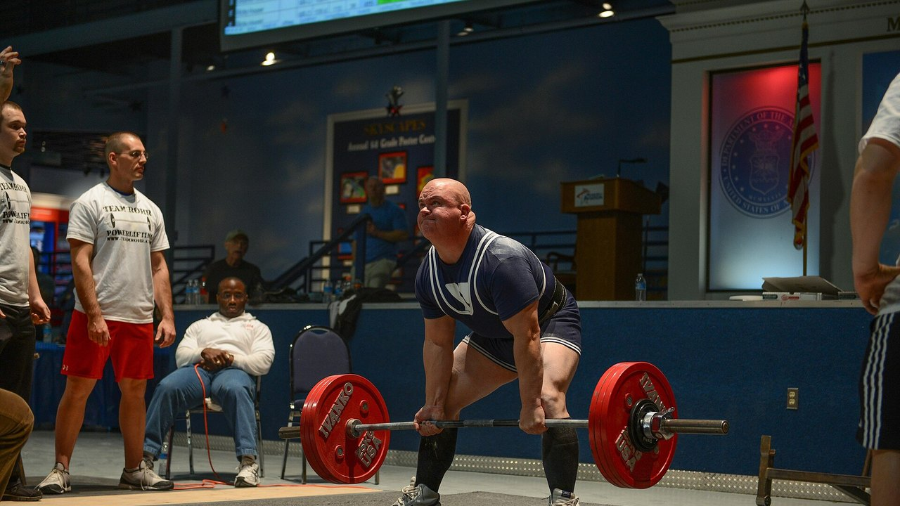
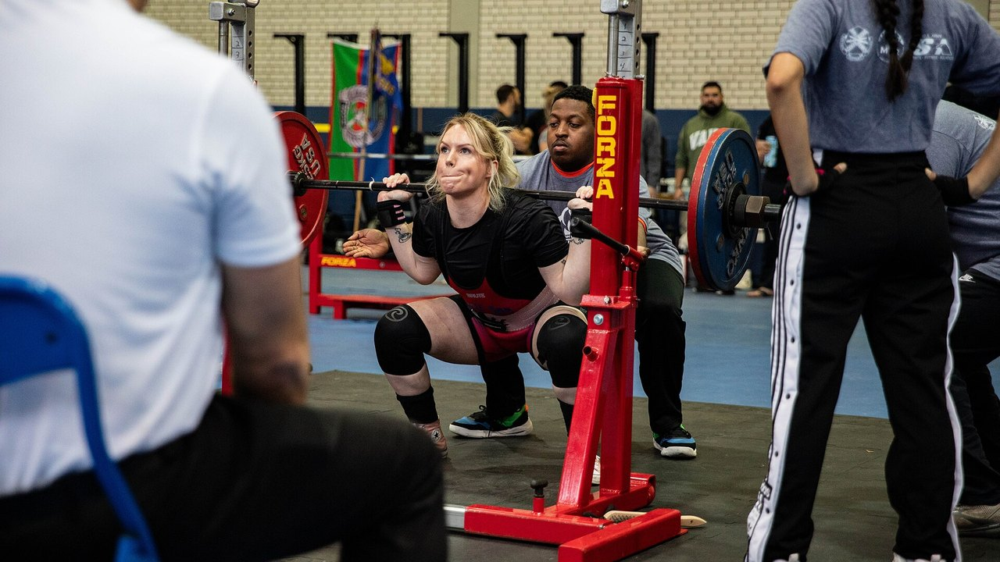
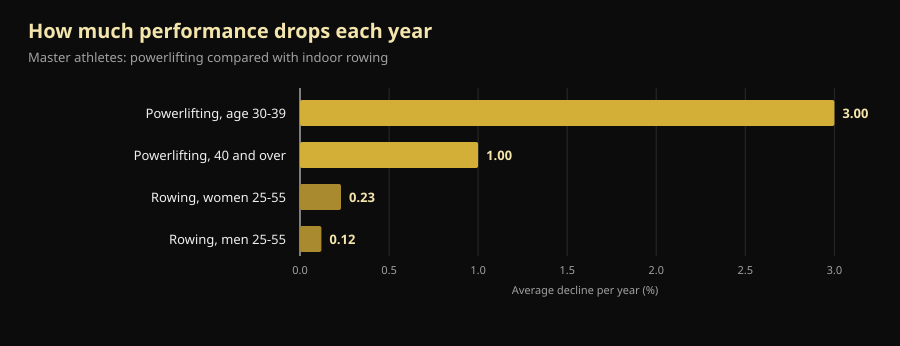
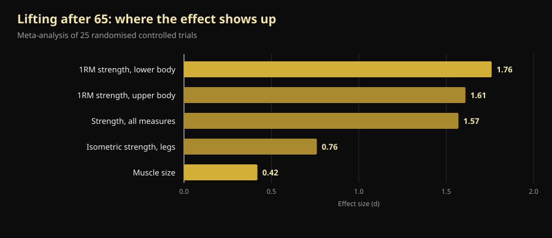
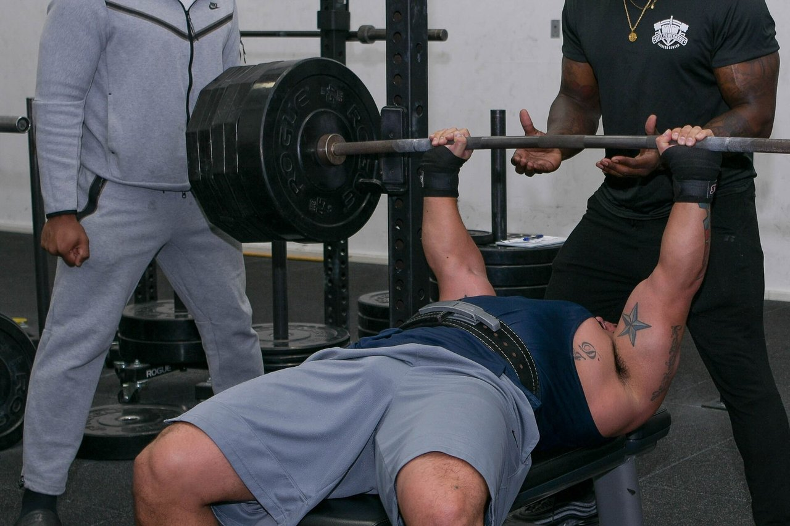

# IPF Masters Worlds 2026: what they teach anyone past 40

In four days, in Reno, a world championship starts where the youngest lifter on the platform is 40 and the oldest is past 70. Below is the verified schedule — and, more useful to you, the answer to the question underneath it: how much strength you actually lose with age, and how much you can take back.

By [Giammaria Loi](/autore/giammaria-loi) · updated 10 October 2026

## The short version

- The **IPF World Classic & Equipped Masters Championships** run at the Reno Ballroom in Reno, Nevada, from 14 to 25 October 2026: technical meeting on the 14th, lifting from the 15th to the 24th, classic first and equipped after.
- Four age brackets: **M1 40-49, M2 50-59, M3 60-69, M4 70 and over**, counted by calendar year rather than by birthday.
- Strength declines earlier and faster than endurance, but not at a steady rate: **about -3% a year during the fourth decade of life, then roughly -1% a year**. After 40 the enemy is not the curve, it is quitting.
- **You can still build muscle at 70.** In the most closely studied case, a 70+ world champion who started lifting at 63 with no prior training had type II fibres 46% larger than healthy women her age.
- **Light is not safer, just less effective.** One year of heavy lifting at 64-75 left leg strength at baseline four years later; the moderate-intensity and control groups had declined.

*A masters lifter setting up for a deadlift at his first powerlifting meet. Photo: U.S. Air National Guard (Master Sgt. Charles Delano), Wikimedia Commons, public domain.*

## When, where and how Reno works

The **2026 IPF World Classic & Equipped Masters Championships** are run by the International Powerlifting Federation with Powerlifting America; meet director Tamara Lopes. The official IPF calendar lists the window as **14-25 October 2026**; the official invitation sets the technical meeting for 14 October at 20:00 at the Silver Legacy and the competition itself for 15-24 October at the **Reno Ballroom**, Reno, Nevada.

The running order goes from oldest to youngest:

| Days | Section | Categories |
|---|---|---|
| 15-16 October | Classic | M4 (men and women), then M3 |
| 17-18 October | Classic | M2 (men and women) |
| 19-21 October | Classic | M1 (men and women) |
| 22 October | Equipped | M3 and M4 |
| 23 October | Equipped | M2 |
| 24 October | Equipped | M1 |

"Classic" means lifting **without supportive gear**: belt, wrist wraps and plain knee sleeves, no squat suits or bench shirts. "Equipped" allows the reinforced suit, which moves heavier weight but is a technique of its own.

Weight classes in Reno are 59, 74, 83, 93, 105, 120 and +120 kg for men, and 47, 52, 57, 63, 69, 76, 84 and +84 kg for women. Entries go **through national federations only** — never the individual lifter. Preliminary nominations closed on 16 August, final nominations on 24 September 2026.

One detail says a lot about this meet: at the IPF **every competitor here is classed as an International Level Athlete**, under the same anti-doping rules as the open. Lifters and head coaches must file a WADA ADEL education certificate with their nomination, and each entry pays €75 in anti-doping fees on top of the €60 entry. A masters championship is not a watered-down Worlds. Same rulebook, same obligations.

The 2027 edition is already set: **St. John's, Canada, 7-16 October**.

## How the masters categories work

IPF age brackets run by **calendar year**, not by birthday. Someone who turns 50 in December is M2 from 1 January of that year.

| Category | Age |
|---|---|
| M1 | from the year of the 40th birthday to the year of the 49th |
| M2 | from the year of the 50th to the year of the 59th |
| M3 | from the year of the 60th to the year of the 69th |
| M4 | from the year of the 70th onward |

That scale spans thirty years of biology. Which is where it gets interesting.

*Squat in competition: the same lift, judged by the same standards, from 14 years old to 70 and beyond. Photo: U.S. Army Reserve (Sgt. 1st Class Abel M. Aungst), Wikimedia Commons, public domain.*

## What the research actually says

### "Strength falls off a cliff after 40" — **Needs qualifying**

A study comparing masters powerlifters with masters indoor rowers measured two different things. Strength performance declines earlier and faster than endurance performance, but not at a constant rate: **-3% a year during the fourth decade of life, then about -1% a year**. In rowing, between 25 and 55, the annual decline is 0.12% in men and 0.23% in women (Galloway et al., 2002).

*Average annual performance decline in masters athletes. Data: Galloway et al., 2002.*

Two readings, both correct. First: strength is the quality that leaves first, which is exactly why it has to be trained. Second, the one motivational posts skip: **the steepest part of the curve sits before 40**, not after. An M2 losing 1% a year can out-train that for years — and that is what you see on the platform in Reno.

### "You cannot build muscle at 70" — **Busted**

A group at Maastricht University took the 70+ world powerlifting champion into the lab: 71 years old, **started resistance training at 63 with no previous structured training at all**. Compared with healthy women her age she had a 33% higher skeletal muscle mass index, a 37% larger quadriceps cross-section, type II fibres (the fast ones, the first to go with age) 46% larger, 36% more leg press strength and 33% stronger grip (Fuchs et al., 2024).

It is a single case and should be read as one: it does not prove anyone can become a world champion at 71. It proves that the muscle of a never-trained 63-year-old **still responds** — enough to put her where her peers are not.

### "Past a certain age you should train light" — **Busted**

The Danish LISA trial randomised 451 people at retirement age into three groups: one year of **heavy** resistance training, one year of moderate-intensity training, or no training. Then it followed them for four years. Of the 369 retested at the end (mean age 71, 61% women), **only the heavy-training group had held leg strength at baseline** (149.7 Nm at the start, 151.5 Nm four years later). The other two had dropped (Bloch-Ibenfeldt et al., 2024).

One year of heavy work bought four years of retained strength. The light work did not.

### "Lifting builds muscle at 70 like it does at 25" — **Needs qualifying**

The reference meta-analysis across 25 controlled trials in adults with a mean age of 65+ finds two very different effects: **large on strength (d = 1.57), small on muscle size (d = 0.42)**. Lower-body maximal strength is the measure that moves most (d = 1.76) (Borde et al., 2015).

*Effect size (d) of resistance training after 65. Data: Borde et al., 2015, meta-analysis of 25 randomised controlled trials.*

In plain terms: after 65, lifting makes you a lot stronger and a bit bigger. If the goal is standing up from a chair, climbing stairs and not falling, the first column is the one that counts. In the same analysis the most effective intensity for strength is **70-79% of one-rep max**, with two sessions a week, 2-3 sets per exercise and 7-9 reps — numbers far closer to a real gym than to "exercise for seniors". For where those ranges come from, see [how many reps actually build muscle](/en/blog/how-many-reps-build-muscle).

### "Lifting fixes everything in frail older adults" — **Needs qualifying**

Here is the uncomfortable part. A 2025 meta-analysis of 24 trials and 951 older adults **with diagnosed sarcopenia** found statistically significant gains in grip strength, gait speed and sit-to-stand performance, but **below the minimal important difference**: real, measurable improvements that the patient does not always feel day to day (Yan et al., 2025). The authors put a minimum useful dose at around 600 MET-minutes a week.

Training is still the right call. But anyone promising that lifting returns a sarcopenic 80-year-old to his thirties is selling something.

### "Training is what matters, protein comes second" — **Needs qualifying**

In a meta-analysis of 74 controlled trials, eating more protein alongside training adds lean mass, and the threshold shifts with age: **over 65 the effect appears from 1.2-1.59 g per kg of body weight per day**, while under 65 it takes at least 1.6 g/kg (Nunes et al., 2022). The effects are small: protein adds to training, it does not replace it.

Supplements are more modest still. In older adults with sarcopenia, whey alongside lifting improves muscle mass with a small effect (SMD 0.24) and grip strength by 2.31 kg, but **certainty of evidence is low to very low** and the difference does not clear the clinical relevance threshold (Cuyul-Vásquez et al., 2023).

*The bench is the lift where masters lose the least: the over-65 meta-analysis shows large effects on upper-body strength too. Photo: U.S. Air Force (Airman 1st Class Jordan Gonzalez), Wikimedia Commons, public domain.*

## How to apply it

1. **Do not change the sport, change the management.** After 40 the exercises stay the same. What changes is how often you can push to the limit and how long you need between heavy sessions.
2. **Keep the load where it works: 70-79% of max.** That is the range with the largest effect on strength in the over-65s, and there is no reason to go below it on age alone. Two sessions a week, 2-3 sets, 7-9 reps is a sustainable starting point.
3. **Pick the right target for the age you are.** Past 65 training pays far more in strength than in centimetres. Judge it only in the mirror and you will conclude it is not working while it is.
4. **Raise protein before buying supplements.** From 1.2 g/kg a day upward, alongside training, is the best-supported lever. Powder is convenient, not magic.
5. **Log loads, not feelings.** The difference between a normal 1%-a-year decline and a decline caused by bad management only shows up when you compare numbers months apart. By feel they are identical.
6. **If you are new to lifting and over 60, start with technique and measured loads**, and have the programme checked by a professional if you have a medical condition or a current injury. The room for improvement is real; the room for error is narrower.

> ### 💡 With Nurvan
> **After 40, progression is not improvised — it is measured.** Nurvan logs load, reps and RIR — the reps you have left in the tank at the end of a set — for every single set, so six months on you can see whether your bench is genuinely stalled or you just had a bad week. It proposes warm-up sets automatically, which at fifty is not a detail, and keeps measurements and lab results in the same place as the programme. Already have a plan from your coach? Import it from PDF, Excel or even a photo. [Try Nurvan](https://nurvan.app)

## FAQ

**What age can you compete as a masters powerlifter?**
From 40. The IPF counts by calendar year: you enter M1 on 1 January of the year you turn 40, then M2 at 50, M3 at 60 and M4 at 70 and over. Entries to the Worlds always go through your national federation, never directly.

**How much strength do you lose each year after 40?**
In masters athlete data the decline settles at around 1% a year after the steepest phase, which falls in the fourth decade of life (Galloway et al., 2002). That is a group average: training moves the individual case a long way, in both directions.

**Can you start lifting at 60 or 70?**
Yes, and the effects are measurable. The best-documented case is a woman who began at 63 with no experience and became a 70+ world champion (Fuchs et al., 2024). For those not chasing medals, one year of heavy training at retirement age preserved strength for the following four years (Bloch-Ibenfeldt et al., 2024). If you have an existing medical condition, have the programme reviewed by your doctor first.

**Are light weights and high reps better after 65?**
Not for strength. In the reference meta-analysis the intensity with the largest effect is 70-79% of one-rep max (Borde et al., 2015), and in the LISA trial only the heavy group held its strength at four years. Load should be built over time, not avoided on principle.

## Read next

- [Creatine without training after 45: what the study found](/en/blog/creatine-without-training-over-45)
- [How many reps build muscle: the 8-12 myth](/en/blog/how-many-reps-build-muscle)
- [Training split: beginner vs advanced](/en/blog/training-split-beginner-vs-advanced)

## Sources

1. Galloway MT, Kadoko R, Jokl P, 2002. *Effect of aging on male and female master athletes' performance in strength versus endurance activities.* Am J Orthop (Belle Mead NJ) 31(2):93–98. PMID 11876284 — [pubmed.ncbi.nlm.nih.gov/11876284](https://pubmed.ncbi.nlm.nih.gov/11876284/)
2. Fuchs CJ, Trommelen J, Weijzen MEG, et al., 2024. *Becoming a World Champion Powerlifter at 71 Years of Age: It Is Never Too Late to Start Exercising.* Int J Sport Nutr Exerc Metab 34(4):223–231. PMID 38458181 — [doi:10.1123/ijsnem.2023-0230](https://doi.org/10.1123/ijsnem.2023-0230)
3. Bloch-Ibenfeldt M, Theil Gates A, Karlog K, Demnitz N, Kjaer M, Boraxbekk CJ, 2024. *Heavy resistance training at retirement age induces 4-year lasting beneficial effects in muscle strength: a long-term follow-up of an RCT.* BMJ Open Sport Exerc Med 10(2):e001899. PMID 38911477 — [doi:10.1136/bmjsem-2024-001899](https://doi.org/10.1136/bmjsem-2024-001899)
4. Borde R, Hortobágyi T, Granacher U, 2015. *Dose-Response Relationships of Resistance Training in Healthy Old Adults: A Systematic Review and Meta-Analysis.* Sports Med 45(12):1693–1720. PMID 26420238 — [doi:10.1007/s40279-015-0385-9](https://doi.org/10.1007/s40279-015-0385-9)
5. Yan R, Chen Y, Zhang R, He J, Lin W, Sun J, Li D, 2025. *Optimal resistance training prescriptions to improve muscle strength, physical function, and muscle mass in older adults diagnosed with sarcopenia: a systematic review and meta-analysis.* Aging Clin Exp Res 37(1):320. PMID 41212331 — [doi:10.1007/s40520-025-03235-w](https://doi.org/10.1007/s40520-025-03235-w)
6. Nunes EA, Colenso-Semple L, McKellar SR, et al., 2022. *Systematic review and meta-analysis of protein intake to support muscle mass and function in healthy adults.* J Cachexia Sarcopenia Muscle 13(2):795–810. PMID 35187864 — [doi:10.1002/jcsm.12922](https://doi.org/10.1002/jcsm.12922)
7. Cuyul-Vásquez I, Pezo-Navarrete J, Vargas-Arriagada C, et al., 2023. *Effectiveness of Whey Protein Supplementation during Resistance Exercise Training on Skeletal Muscle Mass and Strength in Older People with Sarcopenia.* Nutrients 15(15):3424. PMID 37571361 — [doi:10.3390/nu15153424](https://doi.org/10.3390/nu15153424)

Metadata and abstracts retrieved from PubMed. Event details: [official IPF/Powerlifting America invitation](https://www.powerlifting.sport/fileadmin/ipf/data/championships/informations/2026/masters/2026_IPF_World_Masters_Powerlifting_Championships_Invitation_USA-03.pdf) and [official IPF calendar](https://www.powerlifting.sport/championships/calendar), both accessed 10 October 2026. Age categories and weight classes from the IPF technical rules. No predictions and no commentary on individual competitors.

---

**Giammaria Loi** is the founder of Nurvan. He has been lifting since 2012, has worked as a FIPE-certified personal trainer and coach since 2013, and has competed in powerlifting at national level since 2018. Every article he writes starts from the research and ends with what actually works in the gym.

> Note: educational content, not a substitute for medical advice. If you have a medical condition, take medication or are returning after a long break, have your programme reviewed by a doctor or qualified professional before you start.
