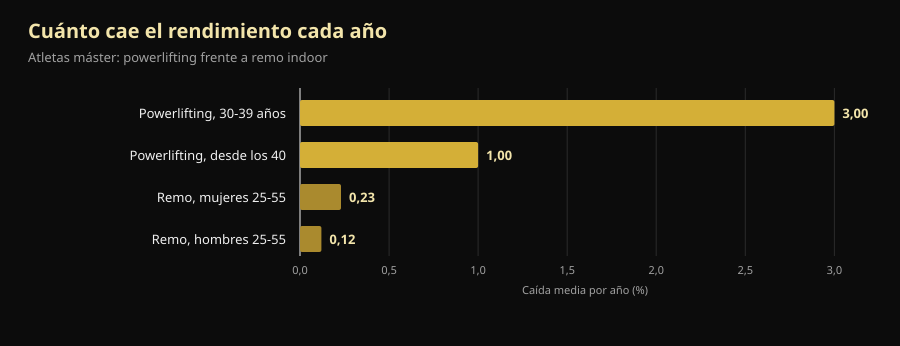
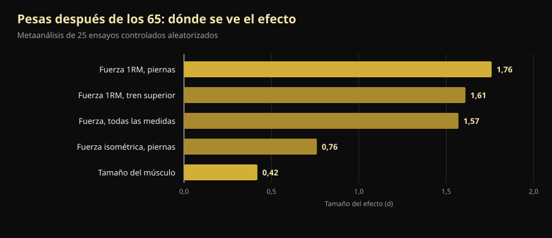

# Mundial máster de powerlifting 2026: qué enseña a quien pasó los 40

Dentro de cuatro días, en Reno, empieza un Mundial en el que el más joven de la tarima tiene 40 años y el mayor pasa de 70. Aquí tienes el programa verificado y, sobre todo, la respuesta a la pregunta de fondo: cuánta fuerza se pierde de verdad con la edad y cuánta se puede recuperar.

Por [Giammaria Loi](/autore/giammaria-loi) · actualizado el 10 de octubre de 2026

## En resumen

- El **Mundial IPF Classic & Equipped Masters** se celebra en el Reno Ballroom, en Reno (Nevada), del 14 al 25 de octubre de 2026: reunión técnica el 14 y competición del 15 al 24, primero classic y después equipado.
- Cuatro franjas de edad: **M1 40-49, M2 50-59, M3 60-69 y M4 desde los 70**, contadas por año natural y no por fecha de cumpleaños.
- La fuerza cae antes y más rápido que la resistencia, pero no a ritmo constante: **–3% al año durante la cuarta década de vida y alrededor de –1% al año después**. Pasados los 40, el enemigo no es la curva: es dejarlo.
- **Se gana músculo incluso a los 70.** En el caso mejor estudiado, una campeona mundial de la categoría 70+ que empezó a entrenar a los 63 tenía fibras de tipo II un 46% más grandes que mujeres sanas de su edad.
- **Ligero no es más seguro, solo menos eficaz.** Un año de cargas pesadas entre los 64 y los 75 años dejó la fuerza isométrica en los valores de partida cuatro años después; los grupos de intensidad moderada y control habían bajado.

*Un atleta de categoría máster preparando un peso muerto en su primera competición. Foto: U.S. Air National Guard (Master Sgt. Charles Delano), Wikimedia Commons, dominio público.*

## Cuándo, dónde y cómo se compite en Reno

El **Mundial IPF Classic & Equipped Masters 2026** lo organizan la International Powerlifting Federation y Powerlifting America, con Tamara Lopes como meet director. El calendario oficial de la IPF indica la ventana **14-25 de octubre de 2026**; la invitación oficial fija la reunión técnica el 14 de octubre a las 20:00 en el Silver Legacy y la competición del 15 al 24 de octubre en el **Reno Ballroom** de Reno, Nevada.

El orden va del mayor al más joven:

| Días | Sección | Categorías |
|---|---|---|
| 15-16 de octubre | Classic | M4 (hombres y mujeres) y después M3 |
| 17-18 de octubre | Classic | M2 (hombres y mujeres) |
| 19-21 de octubre | Classic | M1 (hombres y mujeres) |
| 22 de octubre | Equipado | M3 y M4 |
| 23 de octubre | Equipado | M2 |
| 24 de octubre | Equipado | M1 |

"Classic" significa competir **sin material de soporte**: cinturón, muñequeras y rodilleras simples, sin monos de sentadilla ni camisetas de press banca. "Equipped" admite el mono reforzado, que permite más kilos pero exige una técnica propia.

Las categorías de peso son 59, 74, 83, 93, 105, 120 y +120 kg en hombres, y 47, 52, 57, 63, 69, 76, 84 y +84 kg en mujeres. Las inscripciones pasan **solo por las federaciones nacionales**, nunca por el atleta: nominación preliminar hasta el 16 de agosto y definitiva hasta el 24 de septiembre de 2026.

Un detalle dice mucho de qué tipo de competición es: en la IPF **todos los participantes están clasificados como International Level Athletes**, con las mismas reglas antidopaje que la categoría open. Atletas y entrenadores jefe deben adjuntar a la nominación el certificado del curso WADA ADEL, y cada inscrito paga 75 € de tasa antidopaje además de los 60 € de participación. Un campeonato máster no es un Mundial rebajado: es el mismo reglamento, con las mismas responsabilidades.

La edición de 2027 ya está fijada: **St. John's, Canadá, del 7 al 16 de octubre**.

## Cómo funcionan las categorías máster

Las franjas de la IPF se cuentan por **año natural**, no desde el cumpleaños. Quien cumple 50 en diciembre ya es M2 desde el 1 de enero de ese año.

| Categoría | Edad |
|---|---|
| M1 | del año del 40.º cumpleaños al del 49.º |
| M2 | del año del 50.º al del 59.º |
| M3 | del año del 60.º al del 69.º |
| M4 | desde el año del 70.º en adelante |

Es una escala que cubre treinta años de biología. Y ahí empieza lo interesante.

*Sentadilla en competición: el mismo gesto, con los mismos criterios de juicio, de los 14 a los 70 años y más. Foto: U.S. Army Reserve (Sgt. 1st Class Abel M. Aungst), Wikimedia Commons, dominio público.*

## Qué dice realmente la investigación

### "Después de los 40 la fuerza se desploma" — **Matizado**

Un estudio que comparó atletas máster de powerlifting y de remo indoor midió dos cosas distintas. El rendimiento de fuerza cae antes y más rápido que el de resistencia, pero no a velocidad constante: **–3% al año durante la cuarta década de vida y después alrededor de –1% al año**. En remo, entre los 25 y los 55 años, la caída anual es del 0,12% en hombres y del 0,23% en mujeres (Galloway et al., 2002).

*Caída media anual del rendimiento en atletas máster. Datos: Galloway et al., 2002.*

Dos lecturas, las dos correctas. La primera: la fuerza es la cualidad que se va antes, y por eso hay que entrenarla. La segunda, la que los posts motivacionales se saltan: **el tramo más empinado de la curva está antes de los 40**, no después. Un M2 que pierde un 1% al año puede compensarlo con entrenamiento durante años, y eso es lo que se ve en la tarima de Reno.

### "A los 70 ya no se gana músculo" — **Desmentido**

Un grupo de la Universidad de Maastricht estudió en laboratorio a la campeona mundial de powerlifting de la categoría 70+: 71 años y **empezó a entrenar con pesas a los 63, sin ninguna experiencia previa de entrenamiento estructurado**. Frente a mujeres sanas de su edad tenía un índice de masa muscular un 33% mayor, una sección del cuádriceps un 37% mayor, fibras de tipo II (las rápidas, las primeras que se pierden con la edad) un 46% más grandes, un 36% más de fuerza en prensa de piernas y un 33% más de fuerza de agarre (Fuchs et al., 2024).

Es un caso aislado y hay que leerlo como tal: no demuestra que cualquiera pueda ser campeón del mundo a los 71. Demuestra que el músculo de una persona de 63 años que nunca ha entrenado **todavía responde**, lo bastante para llevarla donde sus coetáneas no llegan.

### "A partir de cierta edad hay que entrenar ligero" — **Desmentido**

El ensayo danés LISA repartió al azar a 451 personas en edad de jubilación en tres grupos: un año de entrenamiento con **cargas pesadas**, un año de intensidad moderada o ningún entrenamiento. Después los siguió cuatro años. De los 369 reevaluados al final (edad media 71 años, 61% mujeres), **solo el grupo de cargas pesadas mantuvo la fuerza isométrica de piernas en los valores iniciales** (149,7 Nm al principio y 151,5 Nm cuatro años después). Los otros dos habían bajado (Bloch-Ibenfeldt et al., 2024).

Un año de trabajo pesado compró cuatro años de fuerza mantenida. El trabajo ligero no.

### "Las pesas hacen crecer el músculo a los 70 igual que a los 25" — **Matizado**

El metaanálisis de referencia sobre 25 ensayos controlados en personas con edad media de 65 años o más encuentra dos efectos muy distintos: **grande en fuerza (d = 1,57) y pequeño en tamaño del músculo (d = 0,42)**. La fuerza máxima en el tren inferior es la medida que más se mueve (d = 1,76) (Borde et al., 2015).

*Tamaño del efecto (d) del entrenamiento con pesas después de los 65 años. Datos: Borde et al., 2015, metaanálisis de 25 ensayos controlados aleatorizados.*

Traducido: pasados los 65, las pesas te hacen mucho más fuerte y algo más grande. Si el objetivo es levantarse de la silla, subir escaleras y no caerse, la columna que importa es la primera. En el mismo análisis la intensidad más eficaz para la fuerza es el **70-79% del máximo**, con dos sesiones por semana, 2-3 series por ejercicio y 7-9 repeticiones: números mucho más cercanos a una sala de pesas que a la "gimnasia para mayores". Si quieres ver de dónde salen esos rangos, lo contamos en [cuántas repeticiones hacen falta para ganar masa](/es/blog/cuantas-repeticiones-masa-muscular).

### "En personas frágiles las pesas lo arreglan todo" — **Matizado**

Aquí va la parte incómoda. Un metaanálisis de 2025 sobre 24 estudios y 951 mayores **con diagnóstico de sarcopenia** encuentra mejoras estadísticamente significativas en fuerza de agarre, velocidad de marcha y levantadas de silla, pero **por debajo del umbral de diferencia mínima clínicamente relevante**: mejoras reales y medibles que el paciente no siempre nota en el día a día (Yan et al., 2025). Los autores sitúan la dosis mínima útil en torno a 600 MET-minutos por semana.

Entrenar sigue siendo lo correcto. Pero quien promete que las pesas devuelven a un octogenario con sarcopenia a sus treinta está vendiendo algo.

### "Lo que cuenta es entrenar, la proteína viene después" — **Matizado**

En el metaanálisis de 74 ensayos controlados, subir la proteína junto con el entrenamiento añade masa magra, y el umbral cambia con la edad: **por encima de los 65 el efecto aparece ya con 1,2-1,59 g por kg de peso al día**, mientras que por debajo de 65 hacen falta al menos 1,6 g/kg (Nunes et al., 2022). Los efectos son pequeños: la proteína suma al entrenamiento, no lo sustituye.

Con los suplementos el panorama es aún más modesto: en mayores con sarcopenia, el whey junto a las pesas mejora la masa muscular con un efecto pequeño (SMD 0,24) y el agarre en 2,31 kg, pero **la certeza de la evidencia es baja o muy baja** y la diferencia no supera el umbral de relevancia clínica (Cuyul-Vásquez et al., 2023).

*El press de banca es el movimiento en el que los máster pierden menos: el metaanálisis en mayores de 65 muestra efectos grandes también en la fuerza del tren superior. Foto: U.S. Air Force (Airman 1st Class Jordan Gonzalez), Wikimedia Commons, dominio público.*

## Cómo aplicarlo

1. **No cambies de deporte, cambia la gestión.** Después de los 40 los ejercicios son los mismos. Cambia cada cuánto puedes apretar al límite y cuánto necesitas entre sesiones pesadas.
2. **Mantén la carga donde sirve: 70-79% del máximo.** Es el rango con mayor efecto sobre la fuerza en mayores de 65 y no hay motivo para bajar solo por la edad. Dos sesiones por semana, 2-3 series y 7-9 repeticiones son un punto de partida sostenible.
3. **Elige el objetivo adecuado a tu edad.** Pasados los 65, entrenar rinde mucho más en fuerza que en centímetros. Si solo lo mides en el espejo, concluirás que no funciona mientras está funcionando.
4. **Sube la proteína antes de comprar suplementos.** Desde 1,2 g/kg al día, con entrenamiento, es la palanca con más respaldo. El polvo es cómodo, no mágico.
5. **Registra las cargas, no las sensaciones.** La diferencia entre una caída fisiológica del 1% anual y una caída por mala gestión solo se ve comparando números con meses de distancia. A ojo son idénticas.
6. **Si empiezas con más de 60 años, arranca por la técnica y por cargas medidas**, y haz revisar el programa por un profesional si tienes patologías o lesiones en curso. El margen de mejora existe; el margen para errores es más estrecho.

> ### 💡 Con Nurvan
> **Después de los 40 la progresión no se improvisa: se mide.** Nurvan registra carga, repeticiones y RIR — las repeticiones que te quedan en la recámara al final de la serie — de cada serie, para que a los seis meses veas si el banca está parado de verdad o solo tuviste una semana mala. Propone automáticamente las series de calentamiento, que a los cincuenta no son un detalle, y guarda medidas y analíticas en el mismo sitio que el programa. ¿Ya tienes una rutina de tu entrenador? La importas desde PDF, Excel o incluso una foto. [Prueba Nurvan](https://nurvan.app)

## Preguntas frecuentes

**¿A qué edad se compite como máster en powerlifting?**
Desde los 40. La IPF cuenta por año natural: se entra en M1 el 1 de enero del año en que cumples 40, luego M2 a los 50, M3 a los 60 y M4 desde los 70. La inscripción al Mundial pasa siempre por la federación nacional.

**¿Cuánta fuerza se pierde cada año después de los 40?**
En los datos de atletas máster la caída se estabiliza en torno al 1% anual tras la fase más pronunciada, que cae en la cuarta década de vida (Galloway et al., 2002). Es una media de grupo: el entrenamiento mueve mucho el caso individual, en ambos sentidos.

**¿Se puede empezar con pesas a los 60 o 70?**
Sí, y los efectos se miden. El caso mejor documentado es el de una mujer que empezó a los 63 sin experiencia y llegó a campeona mundial 70+ (Fuchs et al., 2024). Para quien no busca medallas, un año de entrenamiento pesado en edad de jubilación mantuvo la fuerza los cuatro años siguientes (Bloch-Ibenfeldt et al., 2024). Si tienes patologías, consulta antes con tu médico.

**¿Mejor pesos ligeros y muchas repeticiones después de los 65?**
Para la fuerza, no. En el metaanálisis de referencia la intensidad con mayor efecto es el 70-79% del máximo (Borde et al., 2015), y en el ensayo LISA solo el grupo que entrenó pesado mantuvo la fuerza a cuatro años. La carga se construye con el tiempo, no se evita por principio.

## Lee también

- [Creatina sin entrenar después de los 45: qué dice el estudio](/es/blog/creatina-sin-entrenar-mas-de-45)
- [Cuántas repeticiones para ganar masa: el mito del 8-12](/es/blog/cuantas-repeticiones-masa-muscular)
- [Rutina de entrenamiento: principiante frente a avanzado](/es/blog/rutina-entrenamiento-principiante-avanzado)

## Fuentes

1. Galloway MT, Kadoko R, Jokl P, 2002. *Effect of aging on male and female master athletes' performance in strength versus endurance activities.* Am J Orthop (Belle Mead NJ) 31(2):93–98. PMID 11876284 — [pubmed.ncbi.nlm.nih.gov/11876284](https://pubmed.ncbi.nlm.nih.gov/11876284/)
2. Fuchs CJ, Trommelen J, Weijzen MEG, et al., 2024. *Becoming a World Champion Powerlifter at 71 Years of Age: It Is Never Too Late to Start Exercising.* Int J Sport Nutr Exerc Metab 34(4):223–231. PMID 38458181 — [doi:10.1123/ijsnem.2023-0230](https://doi.org/10.1123/ijsnem.2023-0230)
3. Bloch-Ibenfeldt M, Theil Gates A, Karlog K, Demnitz N, Kjaer M, Boraxbekk CJ, 2024. *Heavy resistance training at retirement age induces 4-year lasting beneficial effects in muscle strength: a long-term follow-up of an RCT.* BMJ Open Sport Exerc Med 10(2):e001899. PMID 38911477 — [doi:10.1136/bmjsem-2024-001899](https://doi.org/10.1136/bmjsem-2024-001899)
4. Borde R, Hortobágyi T, Granacher U, 2015. *Dose-Response Relationships of Resistance Training in Healthy Old Adults: A Systematic Review and Meta-Analysis.* Sports Med 45(12):1693–1720. PMID 26420238 — [doi:10.1007/s40279-015-0385-9](https://doi.org/10.1007/s40279-015-0385-9)
5. Yan R, Chen Y, Zhang R, He J, Lin W, Sun J, Li D, 2025. *Optimal resistance training prescriptions to improve muscle strength, physical function, and muscle mass in older adults diagnosed with sarcopenia: a systematic review and meta-analysis.* Aging Clin Exp Res 37(1):320. PMID 41212331 — [doi:10.1007/s40520-025-03235-w](https://doi.org/10.1007/s40520-025-03235-w)
6. Nunes EA, Colenso-Semple L, McKellar SR, et al., 2022. *Systematic review and meta-analysis of protein intake to support muscle mass and function in healthy adults.* J Cachexia Sarcopenia Muscle 13(2):795–810. PMID 35187864 — [doi:10.1002/jcsm.12922](https://doi.org/10.1002/jcsm.12922)
7. Cuyul-Vásquez I, Pezo-Navarrete J, Vargas-Arriagada C, et al., 2023. *Effectiveness of Whey Protein Supplementation during Resistance Exercise Training on Skeletal Muscle Mass and Strength in Older People with Sarcopenia.* Nutrients 15(15):3424. PMID 37571361 — [doi:10.3390/nu15153424](https://doi.org/10.3390/nu15153424)

Metadatos y resúmenes obtenidos de PubMed. Datos del evento: [invitación oficial IPF/Powerlifting America](https://www.powerlifting.sport/fileadmin/ipf/data/championships/informations/2026/masters/2026_IPF_World_Masters_Powerlifting_Championships_Invitation_USA-03.pdf) y [calendario oficial IPF](https://www.powerlifting.sport/championships/calendar), consultados el 10 de octubre de 2026. Categorías de edad y de peso del reglamento técnico de la IPF. Sin pronósticos ni comentarios sobre atletas concretos.

---

**Giammaria Loi** es el fundador de Nurvan. Entrena con pesas desde 2012, trabaja como entrenador personal y coach certificado FIPE desde 2013 y compite en powerlifting a nivel nacional desde 2018. Cada artículo que firma parte de los estudios científicos y llega a lo que funciona de verdad en el gimnasio.

> Nota: contenido informativo, no sustituye la opinión de un médico o profesional. Si tienes patologías, tomas medicación o retomas la actividad tras una parada larga, haz que un médico o un profesional cualificado revise tu programa antes de empezar.
