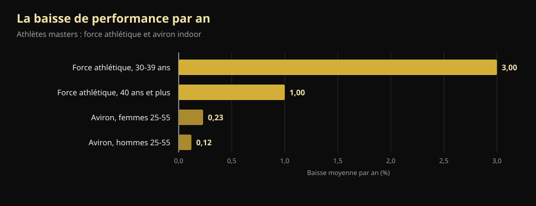
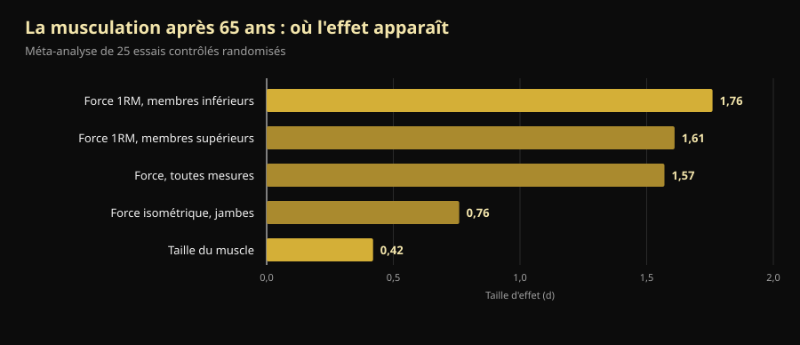

# Mondiaux masters 2026 : ce qu'ils apprennent à ceux qui ont passé 40 ans

Dans quatre jours, à Reno, s'ouvre un championnat du monde où le plus jeune sur le plateau a 40 ans et le plus âgé en a dépassé 70. Voici le programme vérifié et, surtout, la réponse à la question qui se cache derrière : combien de force perd-on vraiment avec l'âge, et combien peut-on en reprendre ?

Par [Giammaria Loi](/autore/giammaria-loi) · mis à jour le 10 octobre 2026

## L'essentiel

- Les **Mondiaux IPF Classic & Equipped Masters** se tiennent au Reno Ballroom, à Reno (Nevada), du 14 au 25 octobre 2026 : réunion technique le 14, compétition du 15 au 24, d'abord le classic puis l'équipé.
- Quatre tranches d'âge : **M1 40-49, M2 50-59, M3 60-69 et M4 à partir de 70 ans**, comptées par année civile et non à partir de l'anniversaire.
- La force baisse plus tôt et plus vite que l'endurance, mais pas à vitesse constante : **–3 % par an pendant la quatrième décennie de vie, puis environ –1 % par an**. Après 40 ans, l'ennemi n'est pas la courbe : c'est l'arrêt.
- **On construit encore du muscle à 70 ans.** Dans le cas le mieux documenté, une championne du monde de la catégorie 70+ ayant commencé à 63 ans avait des fibres de type II 46 % plus grosses que celles de femmes en bonne santé du même âge.
- **Léger n'est pas plus sûr, seulement moins efficace.** Un an de charges lourdes entre 64 et 75 ans a laissé la force isométrique au niveau de départ quatre ans plus tard ; les groupes à intensité modérée et témoin avaient baissé.

*Un athlète de catégorie masters en position de départ au soulevé de terre, lors de sa première compétition. Photo : U.S. Air National Guard (Master Sgt. Charles Delano), Wikimedia Commons, domaine public.*

## Quand, où et comment on concourt à Reno

Les **Mondiaux IPF Classic & Equipped Masters 2026** sont organisés par l'International Powerlifting Federation avec Powerlifting America, Tamara Lopes à la direction de la compétition. Le calendrier officiel de l'IPF indique la fenêtre **14-25 octobre 2026** ; l'invitation officielle fixe la réunion technique le 14 octobre à 20 h au Silver Legacy et la compétition du 15 au 24 octobre, au **Reno Ballroom** de Reno, Nevada.

L'ordre de passage va du plus âgé au plus jeune :

| Jours | Section | Catégories |
|---|---|---|
| 15-16 octobre | Classic | M4 (hommes et femmes), puis M3 |
| 17-18 octobre | Classic | M2 (hommes et femmes) |
| 19-21 octobre | Classic | M1 (hommes et femmes) |
| 22 octobre | Équipé | M3 et M4 |
| 23 octobre | Équipé | M2 |
| 24 octobre | Équipé | M1 |

« Classic » signifie concourir **sans matériel de soutien** : ceinture, bandes de poignets et genouillères simples, ni combinaison de squat ni maillot de développé. « Equipped » autorise la combinaison renforcée, qui permet des charges plus lourdes mais demande une technique à part entière.

Les catégories de poids sont 59, 74, 83, 93, 105, 120 et +120 kg chez les hommes, 47, 52, 57, 63, 69, 76, 84 et +84 kg chez les femmes. Les inscriptions passent **uniquement par les fédérations nationales**, jamais par l'athlète : nomination préliminaire au 16 août, définitive au 24 septembre 2026.

Un détail en dit long sur le niveau d'exigence : à l'IPF **tous les participants sont classés International Level Athletes**, soumis aux mêmes règles antidopage que les open. Athlètes et entraîneurs principaux doivent joindre à la nomination le certificat du cours WADA ADEL, et chaque inscrit paie 75 € de frais antidopage en plus des 60 € de participation. Un championnat masters n'est pas un Mondial allégé : c'est le même règlement, avec les mêmes responsabilités.

L'édition 2027 est déjà fixée : **St. John's, au Canada, du 7 au 16 octobre**.

## Comment fonctionnent les catégories masters

Les tranches IPF se comptent par **année civile**, pas depuis l'anniversaire. Qui a 50 ans en décembre est déjà M1 révolu, donc M2, dès le 1er janvier de cette année-là.

| Catégorie | Âge |
|---|---|
| M1 | de l'année du 40e anniversaire à celle du 49e |
| M2 | de l'année du 50e à celle du 59e |
| M3 | de l'année du 60e à celle du 69e |
| M4 | à partir de l'année du 70e |

Une échelle qui couvre trente ans de biologie. Et c'est là que ça devient intéressant.

*Le squat en compétition : même mouvement, mêmes critères d'arbitrage, de 14 ans à 70 ans et au-delà. Photo : U.S. Army Reserve (Sgt. 1st Class Abel M. Aungst), Wikimedia Commons, domaine public.*

## Ce que dit vraiment la recherche

### « Après 40 ans la force s'effondre » — **À nuancer**

Une étude comparant des athlètes masters de force athlétique et d'aviron indoor a mesuré deux choses différentes. La performance de force baisse plus tôt et plus vite que l'endurance, mais pas à vitesse constante : **–3 % par an pendant la quatrième décennie de vie, puis environ –1 % par an**. En aviron, entre 25 et 55 ans, la baisse annuelle est de 0,12 % chez les hommes et 0,23 % chez les femmes (Galloway et al., 2002).

*Baisse annuelle moyenne de la performance chez les athlètes masters. Données : Galloway et al., 2002.*

Deux lectures, toutes deux justes. La première : la force est la qualité qui part en premier, et c'est précisément pour cela qu'il faut l'entraîner. La seconde, celle que les posts motivants oublient : **la partie la plus raide de la courbe se situe avant 40 ans**, pas après. Un M2 qui perd 1 % par an peut compenser par l'entraînement pendant des années — et c'est ce qu'on voit sur le plateau à Reno.

### « À 70 ans on ne construit plus de muscle » — **Démenti**

Une équipe de l'université de Maastricht a étudié en laboratoire la championne du monde de force athlétique de la catégorie 70+ : 71 ans, **elle a commencé la musculation à 63 ans sans aucune expérience d'entraînement structuré**. Par rapport à des femmes en bonne santé du même âge, elle avait un indice de masse musculaire supérieur de 33 %, une section du quadriceps supérieure de 37 %, des fibres de type II (les rapides, les premières à disparaître avec l'âge) 46 % plus grosses, 36 % de force en plus à la presse à cuisses et une poigne 33 % plus forte (Fuchs et al., 2024).

C'est un cas unique et il faut le lire comme tel : il ne prouve pas que n'importe qui peut devenir champion du monde à 71 ans. Il prouve que le muscle d'une personne de 63 ans jamais entraînée **répond encore**, assez pour l'amener là où ses contemporaines ne sont pas.

### « Passé un certain âge, il faut s'entraîner léger » — **Démenti**

L'essai danois LISA a réparti au hasard 451 personnes à l'âge de la retraite en trois groupes : un an d'entraînement avec **charges lourdes**, un an à intensité modérée, ou aucun entraînement. Puis il les a suivies quatre ans. Sur les 369 réévalués à la fin (âge moyen 71 ans, 61 % de femmes), **seul le groupe charges lourdes avait maintenu la force isométrique des jambes au niveau de départ** (149,7 Nm au début, 151,5 Nm quatre ans après). Les deux autres avaient baissé (Bloch-Ibenfeldt et al., 2024).

Un an de travail lourd a acheté quatre ans de force conservée. Le travail léger, non.

### « La musculation fait grossir le muscle à 70 ans comme à 25 » — **À nuancer**

La méta-analyse de référence sur 25 essais contrôlés chez des personnes d'âge moyen de 65 ans et plus trouve deux effets très différents : **grand sur la force (d = 1,57), petit sur la taille du muscle (d = 0,42)**. La force maximale des membres inférieurs est la mesure qui bouge le plus (d = 1,76) (Borde et al., 2015).

*Taille d'effet (d) de la musculation après 65 ans. Données : Borde et al., 2015, méta-analyse de 25 essais contrôlés randomisés.*

Autrement dit : après 65 ans, la musculation vous rend beaucoup plus fort et un peu plus gros. Si l'objectif est de se lever d'une chaise, monter un escalier et ne pas tomber, c'est la première colonne qui compte. Dans la même analyse, l'intensité la plus efficace pour la force est **70-79 % du maximum**, avec deux séances par semaine, 2-3 séries par exercice et 7-9 répétitions : des chiffres bien plus proches d'une vraie salle que de la « gym pour seniors ». Pour comprendre d'où sortent ces fourchettes, voir [combien de répétitions pour prendre du muscle](/fr/blog/combien-de-repetitions-masse-musculaire).

### « Chez les personnes fragiles, la musculation règle tout » — **À nuancer**

Voici la partie inconfortable. Une méta-analyse de 2025 sur 24 études et 951 personnes âgées **avec sarcopénie diagnostiquée** trouve des améliorations statistiquement significatives de la force de préhension, de la vitesse de marche et du lever de chaise, mais **sous le seuil de différence minimale cliniquement pertinente** : des progrès réels et mesurables que le patient ne ressent pas toujours au quotidien (Yan et al., 2025). Les auteurs situent la dose minimale utile autour de 600 MET-minutes par semaine.

S'entraîner reste la bonne décision. Mais qui promet que la musculation rend à un octogénaire sarcopénique ses trente ans vend quelque chose.

### « Ce qui compte c'est l'entraînement, les protéines viennent après » — **À nuancer**

Dans la méta-analyse de 74 essais contrôlés, augmenter les protéines en plus de l'entraînement ajoute de la masse maigre, et le seuil change avec l'âge : **au-delà de 65 ans l'effet apparaît dès 1,2-1,59 g par kg de poids et par jour**, alors qu'en dessous de 65 ans il faut au moins 1,6 g/kg (Nunes et al., 2022). Les effets sont petits : les protéines s'ajoutent à l'entraînement, elles ne le remplacent pas.

Côté compléments, le tableau est encore plus modeste : chez les personnes âgées sarcopéniques, la whey associée à la musculation améliore la masse musculaire avec un petit effet (SMD 0,24) et la poigne de 2,31 kg, mais **la certitude des preuves est faible à très faible** et la différence ne dépasse pas le seuil de pertinence clinique (Cuyul-Vásquez et al., 2023).

*Le développé couché est le mouvement où les masters perdent le moins : la méta-analyse chez les plus de 65 ans montre aussi de grands effets sur la force du haut du corps. Photo : U.S. Air Force (Airman 1st Class Jordan Gonzalez), Wikimedia Commons, domaine public.*

## Comment l'appliquer

1. **Ne changez pas de sport, changez la gestion.** Après 40 ans, les exercices restent les mêmes. Ce qui change, c'est la fréquence à laquelle vous pouvez pousser à la limite et le temps nécessaire entre deux séances lourdes.
2. **Gardez la charge là où elle sert : 70-79 % du maximum.** C'est l'intervalle au plus grand effet sur la force chez les plus de 65 ans, et aucune raison de descendre en dessous pour l'âge seul. Deux séances par semaine, 2-3 séries, 7-9 répétitions : un point de départ tenable.
3. **Choisissez l'objectif adapté à votre âge.** Après 65 ans, l'entraînement rapporte bien plus en force qu'en centimètres. Si vous ne jugez que dans le miroir, vous conclurez que ça ne marche pas alors que ça marche.
4. **Montez les protéines avant d'acheter des compléments.** À partir de 1,2 g/kg par jour, avec l'entraînement, c'est le levier le mieux étayé. La poudre est pratique, pas magique.
5. **Notez les charges, pas les sensations.** La différence entre une baisse physiologique de 1 % par an et une baisse due à une mauvaise gestion ne se voit qu'en comparant des chiffres à des mois d'écart. À l'œil, elles sont identiques.
6. **Si vous débutez après 60 ans, commencez par la technique et des charges mesurées**, et faites valider le programme par un professionnel en cas de pathologie ou de blessure en cours. La marge de progrès existe ; celle pour les erreurs est plus étroite.

> ### 💡 Avec Nurvan
> **Après 40 ans, la progression ne s'improvise pas : elle se mesure.** Nurvan enregistre charge, répétitions et RIR — les répétitions qu'il vous reste en réserve en fin de série — pour chaque série, si bien qu'au bout de six mois vous voyez si votre développé stagne vraiment ou si vous avez simplement eu une mauvaise semaine. L'app propose automatiquement les séries d'échauffement, ce qui à cinquante ans n'est pas un détail, et garde mensurations et analyses au même endroit que le programme. Vous avez déjà un plan de votre coach ? Importez-le depuis un PDF, un Excel ou même une photo. [Essayez Nurvan](https://nurvan.app)

## Questions fréquentes

**À quel âge peut-on concourir en masters en force athlétique ?**
Dès 40 ans. L'IPF compte par année civile : on entre en M1 le 1er janvier de l'année de ses 40 ans, puis M2 à 50, M3 à 60 et M4 à partir de 70. L'inscription aux Mondiaux passe toujours par la fédération nationale.

**Combien de force perd-on chaque année après 40 ans ?**
Dans les données sur les athlètes masters, la baisse se stabilise autour de 1 % par an après la phase la plus raide, qui tombe dans la quatrième décennie de vie (Galloway et al., 2002). C'est une moyenne de groupe : l'entraînement déplace beaucoup le cas individuel, dans les deux sens.

**Peut-on commencer la musculation à 60 ou 70 ans ?**
Oui, et les effets se mesurent. Le cas le mieux documenté est celui d'une femme ayant débuté à 63 ans sans expérience et devenue championne du monde 70+ (Fuchs et al., 2024). Pour qui ne vise pas les médailles, un an d'entraînement lourd à l'âge de la retraite a conservé la force les quatre années suivantes (Bloch-Ibenfeldt et al., 2024). En cas de pathologie, faites valider le programme par votre médecin.

**Vaut-il mieux des charges légères et beaucoup de répétitions après 65 ans ?**
Pas pour la force. Dans la méta-analyse de référence, l'intensité au plus grand effet est 70-79 % du maximum (Borde et al., 2015), et dans l'essai LISA seul le groupe entraîné lourd a conservé sa force à quatre ans. La charge se construit dans le temps, elle ne s'évite pas par principe.

## À lire aussi

- [Créatine sans musculation après 45 ans : ce que dit l'étude](/fr/blog/creatine-sans-musculation-apres-45-ans)
- [Combien de répétitions pour la masse : le mythe du 8-12](/fr/blog/combien-de-repetitions-masse-musculaire)
- [Split d'entraînement : débutant ou avancé](/fr/blog/split-entrainement-debutant-avance)

## Sources

1. Galloway MT, Kadoko R, Jokl P, 2002. *Effect of aging on male and female master athletes' performance in strength versus endurance activities.* Am J Orthop (Belle Mead NJ) 31(2):93–98. PMID 11876284 — [pubmed.ncbi.nlm.nih.gov/11876284](https://pubmed.ncbi.nlm.nih.gov/11876284/)
2. Fuchs CJ, Trommelen J, Weijzen MEG, et al., 2024. *Becoming a World Champion Powerlifter at 71 Years of Age: It Is Never Too Late to Start Exercising.* Int J Sport Nutr Exerc Metab 34(4):223–231. PMID 38458181 — [doi:10.1123/ijsnem.2023-0230](https://doi.org/10.1123/ijsnem.2023-0230)
3. Bloch-Ibenfeldt M, Theil Gates A, Karlog K, Demnitz N, Kjaer M, Boraxbekk CJ, 2024. *Heavy resistance training at retirement age induces 4-year lasting beneficial effects in muscle strength: a long-term follow-up of an RCT.* BMJ Open Sport Exerc Med 10(2):e001899. PMID 38911477 — [doi:10.1136/bmjsem-2024-001899](https://doi.org/10.1136/bmjsem-2024-001899)
4. Borde R, Hortobágyi T, Granacher U, 2015. *Dose-Response Relationships of Resistance Training in Healthy Old Adults: A Systematic Review and Meta-Analysis.* Sports Med 45(12):1693–1720. PMID 26420238 — [doi:10.1007/s40279-015-0385-9](https://doi.org/10.1007/s40279-015-0385-9)
5. Yan R, Chen Y, Zhang R, He J, Lin W, Sun J, Li D, 2025. *Optimal resistance training prescriptions to improve muscle strength, physical function, and muscle mass in older adults diagnosed with sarcopenia: a systematic review and meta-analysis.* Aging Clin Exp Res 37(1):320. PMID 41212331 — [doi:10.1007/s40520-025-03235-w](https://doi.org/10.1007/s40520-025-03235-w)
6. Nunes EA, Colenso-Semple L, McKellar SR, et al., 2022. *Systematic review and meta-analysis of protein intake to support muscle mass and function in healthy adults.* J Cachexia Sarcopenia Muscle 13(2):795–810. PMID 35187864 — [doi:10.1002/jcsm.12922](https://doi.org/10.1002/jcsm.12922)
7. Cuyul-Vásquez I, Pezo-Navarrete J, Vargas-Arriagada C, et al., 2023. *Effectiveness of Whey Protein Supplementation during Resistance Exercise Training on Skeletal Muscle Mass and Strength in Older People with Sarcopenia.* Nutrients 15(15):3424. PMID 37571361 — [doi:10.3390/nu15153424](https://doi.org/10.3390/nu15153424)

Métadonnées et résumés récupérés sur PubMed. Données de l'événement : [invitation officielle IPF/Powerlifting America](https://www.powerlifting.sport/fileadmin/ipf/data/championships/informations/2026/masters/2026_IPF_World_Masters_Powerlifting_Championships_Invitation_USA-03.pdf) et [calendrier officiel IPF](https://www.powerlifting.sport/championships/calendar), consultés le 10 octobre 2026. Catégories d'âge et de poids issues du règlement technique IPF. Aucun pronostic ni commentaire sur des athlètes en particulier.

---

**Giammaria Loi** est le fondateur de Nurvan. Il pratique la musculation depuis 2012, travaille comme entraîneur personnel et coach certifié FIPE depuis 2013 et compète en force athlétique au niveau national depuis 2018. Chaque article qu'il signe part des études scientifiques et aboutit à ce qui marche vraiment en salle.

> Note : contenu informatif, qui ne remplace pas l'avis d'un médecin ou d'un professionnel. En cas de pathologie, de traitement en cours ou de reprise après un long arrêt, faites valider votre programme par un médecin ou un professionnel qualifié avant de commencer.
