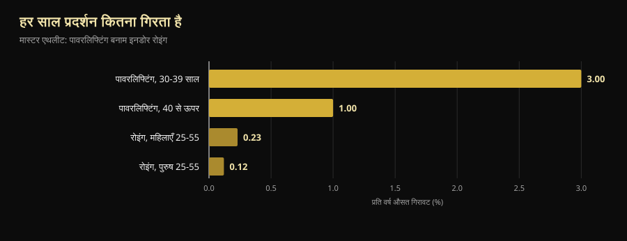
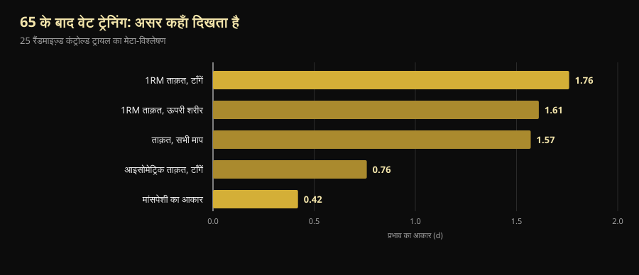

# मास्टर्स वर्ल्ड चैंपियनशिप 2026: 40 पार कर चुके लोगों के लिए इसमें क्या है

चार दिन बाद रीनो में एक विश्व चैंपियनशिप शुरू हो रही है जहाँ प्लेटफ़ॉर्म पर सबसे युवा खिलाड़ी 40 का है और सबसे बुज़ुर्ग 70 पार कर चुका है। नीचे जाँचा हुआ कार्यक्रम है और, उससे ज़्यादा काम का, उस सवाल का जवाब जो इसके पीछे छिपा है: उम्र के साथ ताक़त वाक़ई कितनी घटती है, और कितनी वापस लाई जा सकती है।

लेखक: [Giammaria Loi](/autore/giammaria-loi) · अपडेट 10 अक्टूबर 2026

## संक्षेप में

- **IPF Classic & Equipped मास्टर्स वर्ल्ड चैंपियनशिप** 14 से 25 अक्टूबर 2026 तक रीनो (नेवाडा) के Reno Ballroom में हो रही है: 14 को तकनीकी बैठक, 15 से 24 तक मुक़ाबला — पहले क्लासिक, फिर इक्विप्ड।
- चार आयु वर्ग: **M1 40-49, M2 50-59, M3 60-69 और M4 70 व उससे ऊपर** — गिनती जन्मदिन से नहीं, कैलेंडर वर्ष से होती है।
- ताक़त, सहनशक्ति से पहले और तेज़ी से घटती है, पर रफ़्तार एक जैसी नहीं रहती: **जीवन के चौथे दशक में लगभग –3% प्रति वर्ष, उसके बाद क़रीब –1% प्रति वर्ष**। 40 के बाद दुश्मन वक्र नहीं, ट्रेनिंग छोड़ देना है।
- **70 की उम्र में भी मसल बनती है।** सबसे बारीकी से जाँचे गए मामले में, 63 की उम्र में शुरू करने वाली 70+ वर्ग की विश्व चैंपियन के टाइप II फ़ाइबर उसी उम्र की स्वस्थ महिलाओं से 46% बड़े थे।
- **हल्का मतलब सुरक्षित नहीं, सिर्फ़ कम असरदार।** 64-75 की उम्र में एक साल भारी वज़न उठाने से चार साल बाद भी आइसोमेट्रिक ताक़त शुरुआती स्तर पर थी; मध्यम तीव्रता और नियंत्रण समूह में घट चुकी थी।

*अपने पहले पावरलिफ्टिंग मुक़ाबले में डेडलिफ्ट की तैयारी करता मास्टर्स वर्ग का खिलाड़ी। फ़ोटो: U.S. Air National Guard (Master Sgt. Charles Delano), Wikimedia Commons, पब्लिक डोमेन।*

## रीनो में कब, कहाँ और कैसे

**IPF Classic & Equipped मास्टर्स वर्ल्ड चैंपियनशिप 2026** का आयोजन International Powerlifting Federation और Powerlifting America मिलकर कर रहे हैं; मीट डायरेक्टर तमारा लोपेस हैं। IPF के आधिकारिक कैलेंडर में विंडो **14-25 अक्टूबर 2026** है; आधिकारिक निमंत्रण में तकनीकी बैठक 14 अक्टूबर को रात 20:00 बजे Silver Legacy में और मुक़ाबला 15 से 24 अक्टूबर तक **Reno Ballroom**, रीनो, नेवाडा में तय है।

क्रम बड़े से छोटे की ओर चलता है:

| दिन | वर्ग | आयु श्रेणियाँ |
|---|---|---|
| 15-16 अक्टूबर | क्लासिक | M4 (पुरुष और महिलाएँ), फिर M3 |
| 17-18 अक्टूबर | क्लासिक | M2 (पुरुष और महिलाएँ) |
| 19-21 अक्टूबर | क्लासिक | M1 (पुरुष और महिलाएँ) |
| 22 अक्टूबर | इक्विप्ड | M3 और M4 |
| 23 अक्टूबर | इक्विप्ड | M2 |
| 24 अक्टूबर | इक्विप्ड | M1 |

"क्लासिक" का मतलब है **सपोर्टिव गियर के बिना** मुक़ाबला: बेल्ट, रिस्ट रैप और सादे नी स्लीव — न स्क्वाट सूट, न बेंच शर्ट। "इक्विप्ड" में मज़बूत सूट की अनुमति है, जिससे वज़न ज़्यादा उठता है पर तकनीक अलग ही सीखनी पड़ती है।

भार वर्ग पुरुषों में 59, 74, 83, 93, 105, 120 और +120 किग्रा, महिलाओं में 47, 52, 57, 63, 69, 76, 84 और +84 किग्रा हैं। प्रविष्टि **सिर्फ़ राष्ट्रीय महासंघों के ज़रिए** होती है, खिलाड़ी सीधे नहीं भेज सकता: प्रारंभिक नामांकन 16 अगस्त तक और अंतिम 24 सितंबर 2026 तक।

एक ब्योरा इस मुक़ाबले के स्तर के बारे में बहुत कुछ कहता है: IPF में **यहाँ के सभी प्रतिभागी International Level Athletes माने जाते हैं**, यानी ओपन वर्ग जैसे ही एंटी-डोपिंग नियम लागू होते हैं। खिलाड़ियों और मुख्य कोचों को नामांकन के साथ WADA ADEL कोर्स का प्रमाणपत्र देना होता है, और हर प्रविष्टि पर 60 यूरो प्रवेश शुल्क के अलावा 75 यूरो एंटी-डोपिंग शुल्क लगता है। मास्टर्स चैंपियनशिप हल्का किया हुआ वर्ल्ड नहीं है: वही नियम, वही ज़िम्मेदारियाँ।

2027 का संस्करण भी तय है: **सेंट जॉन्स, कनाडा, 7 से 16 अक्टूबर**।

## मास्टर्स आयु वर्ग कैसे काम करते हैं

IPF के आयु वर्ग **कैलेंडर वर्ष** से गिने जाते हैं, जन्मदिन से नहीं। जो दिसंबर में 50 का होगा, वह उसी साल 1 जनवरी से M2 है।

| वर्ग | आयु |
|---|---|
| M1 | 40वें जन्मदिन के वर्ष से 49वें के वर्ष तक |
| M2 | 50वें के वर्ष से 59वें के वर्ष तक |
| M3 | 60वें के वर्ष से 69वें के वर्ष तक |
| M4 | 70वें के वर्ष से आगे |

यह पैमाना तीस साल की जैविक बदलाव को समेटता है। दिलचस्प हिस्सा यहीं से शुरू होता है।

*मुक़ाबले में स्क्वाट: वही लिफ्ट, वही निर्णय मानक — 14 साल से लेकर 70 और उससे आगे तक। फ़ोटो: U.S. Army Reserve (Sgt. 1st Class Abel M. Aungst), Wikimedia Commons, पब्लिक डोमेन।*

## शोध असल में क्या कहता है

### "40 के बाद ताक़त ढह जाती है" — **स्पष्ट करने की ज़रूरत**

पावरलिफ्टिंग और इनडोर रोइंग के मास्टर्स खिलाड़ियों की तुलना करने वाले एक अध्ययन ने दो अलग चीज़ें नापीं। ताक़त का प्रदर्शन सहनशक्ति से पहले और तेज़ी से गिरता है, पर रफ़्तार स्थिर नहीं: **जीवन के चौथे दशक में –3% प्रति वर्ष, उसके बाद क़रीब –1% प्रति वर्ष**। रोइंग में 25 से 55 की उम्र के बीच सालाना गिरावट पुरुषों में 0.12% और महिलाओं में 0.23% है (Galloway et al., 2002)।

*मास्टर्स एथलीटों में औसत वार्षिक गिरावट। डेटा: Galloway et al., 2002।*

दो पाठ, दोनों सही। पहला: ताक़त सबसे पहले जाने वाली क्षमता है, और ठीक इसीलिए उसे ट्रेन करना ज़रूरी है। दूसरा, जो मोटिवेशनल पोस्ट नहीं बताते: **वक्र का सबसे तीखा हिस्सा 40 से पहले है**, बाद में नहीं। हर साल 1% खोने वाला M2 खिलाड़ी सालों तक ट्रेनिंग से उसकी भरपाई कर सकता है — और रीनो के प्लेटफ़ॉर्म पर यही दिखता है।

### "70 की उम्र में मसल नहीं बनती" — **ग़लत साबित**

मास्ट्रिख्ट विश्वविद्यालय के एक समूह ने 70+ वर्ग की पावरलिफ्टिंग विश्व चैंपियन को प्रयोगशाला में जाँचा: उम्र 71 साल, और **उन्होंने 63 की उम्र में वेट ट्रेनिंग शुरू की थी, संरचित ट्रेनिंग का कोई पिछला अनुभव नहीं था**। अपनी उम्र की स्वस्थ महिलाओं की तुलना में उनका स्केलेटल मसल मास इंडेक्स 33% ज़्यादा, क्वाड्रिसेप्स का क्रॉस-सेक्शन 37% बड़ा, टाइप II फ़ाइबर (तेज़ फ़ाइबर, जो उम्र के साथ सबसे पहले घटते हैं) 46% बड़े, लेग प्रेस की ताक़त 36% अधिक और पकड़ 33% मज़बूत थी (Fuchs et al., 2024)।

यह एक अकेला मामला है और इसे वैसे ही पढ़ा जाना चाहिए: यह साबित नहीं करता कि कोई भी 71 में विश्व चैंपियन बन सकता है। यह साबित करता है कि कभी ट्रेनिंग न करने वाले 63 साल के व्यक्ति की मांसपेशी **अब भी प्रतिक्रिया देती है** — इतनी कि वह वहाँ पहुँच जाए जहाँ उसके हमउम्र नहीं हैं।

### "एक उम्र के बाद हल्की ट्रेनिंग ही करनी चाहिए" — **ग़लत साबित**

डेनमार्क के LISA परीक्षण ने सेवानिवृत्ति की उम्र के 451 लोगों को बेतरतीब ढंग से तीन समूहों में बाँटा: एक साल **भारी वज़न** की ट्रेनिंग, एक साल मध्यम तीव्रता, या कोई ट्रेनिंग नहीं। फिर चार साल तक नज़र रखी। अंत में दोबारा जाँचे गए 369 लोगों में (औसत उम्र 71 वर्ष, 61% महिलाएँ) **सिर्फ़ भारी वज़न वाले समूह ने टाँगों की आइसोमेट्रिक ताक़त शुरुआती स्तर पर बनाए रखी** (शुरू में 149.7 Nm, चार साल बाद 151.5 Nm)। बाक़ी दोनों समूहों में गिरावट आई (Bloch-Ibenfeldt et al., 2024)।

एक साल की भारी मेहनत ने चार साल की ताक़त ख़रीद ली। हल्की मेहनत ने नहीं।

### "70 में वेट ट्रेनिंग 25 जितनी ही मसल बनाती है" — **स्पष्ट करने की ज़रूरत**

65 वर्ष या उससे अधिक औसत आयु वालों पर 25 नियंत्रित अध्ययनों के संदर्भ मेटा-विश्लेषण में दो बहुत अलग असर मिले: **ताक़त पर बड़ा (d = 1.57), मांसपेशी के आकार पर छोटा (d = 0.42)**। सबसे ज़्यादा हिलने वाला माप निचले शरीर की अधिकतम ताक़त है (d = 1.76) (Borde et al., 2015)।

*65 के बाद वेट ट्रेनिंग का प्रभाव आकार (d)। डेटा: Borde et al., 2015, 25 रैंडमाइज़्ड कंट्रोल्ड ट्रायल का मेटा-विश्लेषण।*

सीधे शब्दों में: 65 के बाद वेट ट्रेनिंग आपको बहुत ज़्यादा ताक़तवर और थोड़ा बड़ा बनाती है। अगर लक्ष्य कुर्सी से उठना, सीढ़ी चढ़ना और न गिरना है, तो पहला कॉलम ही मायने रखता है। उसी विश्लेषण में ताक़त के लिए सबसे असरदार तीव्रता **अधिकतम भार का 70-79%** है, हफ़्ते में दो सेशन, हर एक्सरसाइज़ के 2-3 सेट और 7-9 रेप्स — ये आँकड़े "बुज़ुर्गों की कसरत" से कहीं ज़्यादा असली जिम के क़रीब हैं। ये रेंज कहाँ से आती हैं, यह हमने [मसल के लिए कितने रेप्स चाहिए](/hi/blog/kitne-reps-muscle-ke-liye) में समझाया है।

### "कमज़ोर बुज़ुर्गों में वेट ट्रेनिंग सब ठीक कर देती है" — **स्पष्ट करने की ज़रूरत**

अब असहज हिस्सा। 2025 के एक मेटा-विश्लेषण ने 24 अध्ययनों और **सार्कोपीनिया से पीड़ित** 951 बुज़ुर्गों पर पाया कि पकड़ की ताक़त, चलने की गति और कुर्सी से उठने में सुधार सांख्यिकीय रूप से महत्वपूर्ण था, पर **न्यूनतम चिकित्सकीय रूप से महत्वपूर्ण अंतर की सीमा से नीचे**: सुधार असली और मापने योग्य, पर मरीज़ को रोज़मर्रा में हमेशा महसूस नहीं होता (Yan et al., 2025)। लेखक न्यूनतम उपयोगी खुराक लगभग 600 MET-मिनट प्रति सप्ताह आँकते हैं।

ट्रेनिंग फिर भी सही फ़ैसला है। पर जो यह वादा करे कि वेट ट्रेनिंग सार्कोपीनिया वाले अस्सी साल के व्यक्ति को तीस की उम्र में लौटा देगी, वह कुछ बेच रहा है।

### "मायने ट्रेनिंग रखती है, प्रोटीन बाद में" — **स्पष्ट करने की ज़रूरत**

74 नियंत्रित अध्ययनों के मेटा-विश्लेषण में ट्रेनिंग के साथ प्रोटीन बढ़ाने से लीन मास बढ़ती है, और सीमा उम्र के साथ बदलती है: **65 के ऊपर असर 1.2-1.59 ग्राम प्रति किलो शरीर भार प्रतिदिन से ही दिखने लगता है**, जबकि 65 से नीचे कम से कम 1.6 ग्राम/किग्रा चाहिए (Nunes et al., 2022)। असर छोटे हैं: प्रोटीन ट्रेनिंग में जुड़ता है, उसकी जगह नहीं लेता।

सप्लीमेंट की तस्वीर और भी सीमित है: सार्कोपीनिया वाले बुज़ुर्गों में वेट ट्रेनिंग के साथ व्हे प्रोटीन मांसपेशी द्रव्यमान को छोटे असर (SMD 0.24) के साथ बेहतर करता है और पकड़ को 2.31 किग्रा, पर **साक्ष्य की निश्चितता कम या बहुत कम है** और अंतर चिकित्सकीय प्रासंगिकता की सीमा पार नहीं करता (Cuyul-Vásquez et al., 2023)।

*बेंच वह लिफ्ट है जिसमें मास्टर्स सबसे कम खोते हैं: 65 से ऊपर के मेटा-विश्लेषण में ऊपरी शरीर की ताक़त पर भी बड़ा असर दिखता है। फ़ोटो: U.S. Air Force (Airman 1st Class Jordan Gonzalez), Wikimedia Commons, पब्लिक डोमेन।*

## इसे कैसे लागू करें

1. **खेल मत बदलिए, प्रबंधन बदलिए।** 40 के बाद एक्सरसाइज़ वही रहती हैं। बदलता यह है कि आप कितनी बार सीमा तक जा सकते हैं और भारी सेशनों के बीच कितना समय चाहिए।
2. **भार वहीं रखिए जहाँ वह काम करता है: अधिकतम का 70-79%।** 65 से ऊपर ताक़त पर सबसे बड़ा असर इसी रेंज का है, और सिर्फ़ उम्र की वजह से नीचे जाने का कोई कारण नहीं। हफ़्ते में दो सेशन, 2-3 सेट और 7-9 रेप्स एक टिकाऊ शुरुआत है।
3. **अपनी उम्र के हिसाब से सही लक्ष्य चुनिए।** 65 के बाद ट्रेनिंग सेंटीमीटर से कहीं ज़्यादा ताक़त में लौटाती है। अगर आप सिर्फ़ आईने से आँकेंगे, तो जब वह काम कर रही होगी तभी आप उसे बेकार मान लेंगे।
4. **सप्लीमेंट ख़रीदने से पहले प्रोटीन बढ़ाइए।** ट्रेनिंग के साथ रोज़ 1.2 ग्राम/किग्रा से ऊपर सबसे मज़बूत साक्ष्य वाला लीवर है। पाउडर सुविधाजनक है, जादुई नहीं।
5. **भार लिखिए, एहसास नहीं।** हर साल 1% की स्वाभाविक गिरावट और ख़राब प्रबंधन से होने वाली गिरावट का फ़र्क़ महीनों के आँकड़े मिलाने पर ही दिखता है। एहसास से दोनों एक जैसे लगते हैं।
6. **अगर आप 60 के बाद शुरू कर रहे हैं, तकनीक और नापे हुए भार से शुरुआत कीजिए**, और कोई बीमारी या चल रही चोट हो तो प्रोग्राम किसी पेशेवर से जँचवाइए। सुधार की गुंजाइश असली है; ग़लती की गुंजाइश कम।

> ### 💡 Nurvan के साथ
> **40 के बाद प्रगति अंदाज़े से नहीं, माप से चलती है।** Nurvan हर सेट का भार, रेप्स और RIR — यानी सेट के अंत में टैंक में बचे रेप्स — दर्ज करता है, ताकि छह महीने बाद आप साफ़ देख सकें कि बेंच सचमुच अटकी है या सिर्फ़ एक ख़राब हफ़्ता था। वॉर्म-अप सेट ऐप अपने-आप सुझाता है, जो पचास की उम्र में छोटी बात नहीं, और नाप व जाँच रिपोर्ट प्रोग्राम के साथ एक ही जगह रहती हैं। कोच से मिला प्लान पहले से है? उसे PDF, Excel या एक फ़ोटो से भी इम्पोर्ट कर लीजिए। [Nurvan आज़माएँ](https://nurvan.app)

## अक्सर पूछे जाने वाले सवाल

**पावरलिफ्टिंग में मास्टर्स वर्ग में किस उम्र से भाग ले सकते हैं?**
40 से। IPF कैलेंडर वर्ष से गिनता है: जिस साल आप 40 के होते हैं, उसकी 1 जनवरी से M1 में आ जाते हैं; फिर 50 पर M2, 60 पर M3 और 70 से M4। वर्ल्ड चैंपियनशिप की प्रविष्टि हमेशा राष्ट्रीय महासंघ के ज़रिए जाती है।

**40 के बाद हर साल कितनी ताक़त घटती है?**
मास्टर्स एथलीटों के आँकड़ों में सबसे तीखे दौर — जो जीवन के चौथे दशक में पड़ता है — के बाद गिरावट क़रीब 1% प्रति वर्ष पर ठहर जाती है (Galloway et al., 2002)। यह समूह का औसत है: ट्रेनिंग व्यक्तिगत मामले को दोनों दिशाओं में काफ़ी खिसका देती है।

**क्या 60 या 70 की उम्र में वेट ट्रेनिंग शुरू की जा सकती है?**
हाँ, और असर मापा जा चुका है। सबसे अच्छी तरह दर्ज मामला उस महिला का है जिसने 63 की उम्र में बिना अनुभव शुरू किया और 70+ वर्ग की विश्व चैंपियन बनीं (Fuchs et al., 2024)। जो पदक नहीं चाहते उनके लिए भी: सेवानिवृत्ति की उम्र में एक साल भारी ट्रेनिंग ने अगले चार साल ताक़त बनाए रखी (Bloch-Ibenfeldt et al., 2024)। कोई बीमारी हो तो शुरू करने से पहले अपने डॉक्टर से प्रोग्राम जँचवाएँ।

**क्या 65 के बाद हल्का वज़न और ज़्यादा रेप्स बेहतर हैं?**
ताक़त के लिए नहीं। संदर्भ मेटा-विश्लेषण में सबसे बड़ा असर अधिकतम भार के 70-79% का है (Borde et al., 2015), और LISA परीक्षण में चार साल बाद ताक़त सिर्फ़ भारी ट्रेनिंग वाले समूह ने बचाई। भार समय के साथ बनाया जाता है, सिद्धांत के तौर पर टाला नहीं जाता।

## यह भी पढ़ें

- [45 के बाद बिना व्यायाम क्रिएटिन: अध्ययन क्या कहता है](/hi/blog/creatine-bina-vyayam-45-ke-baad)
- [मसल के लिए कितने रेप्स: 8-12 का मिथक](/hi/blog/kitne-reps-muscle-ke-liye)
- [ट्रेनिंग स्प्लिट: शुरुआती बनाम अनुभवी](/hi/blog/training-split-beginner-advanced)

## स्रोत

1. Galloway MT, Kadoko R, Jokl P, 2002. *Effect of aging on male and female master athletes' performance in strength versus endurance activities.* Am J Orthop (Belle Mead NJ) 31(2):93–98. PMID 11876284 — [pubmed.ncbi.nlm.nih.gov/11876284](https://pubmed.ncbi.nlm.nih.gov/11876284/)
2. Fuchs CJ, Trommelen J, Weijzen MEG, et al., 2024. *Becoming a World Champion Powerlifter at 71 Years of Age: It Is Never Too Late to Start Exercising.* Int J Sport Nutr Exerc Metab 34(4):223–231. PMID 38458181 — [doi:10.1123/ijsnem.2023-0230](https://doi.org/10.1123/ijsnem.2023-0230)
3. Bloch-Ibenfeldt M, Theil Gates A, Karlog K, Demnitz N, Kjaer M, Boraxbekk CJ, 2024. *Heavy resistance training at retirement age induces 4-year lasting beneficial effects in muscle strength: a long-term follow-up of an RCT.* BMJ Open Sport Exerc Med 10(2):e001899. PMID 38911477 — [doi:10.1136/bmjsem-2024-001899](https://doi.org/10.1136/bmjsem-2024-001899)
4. Borde R, Hortobágyi T, Granacher U, 2015. *Dose-Response Relationships of Resistance Training in Healthy Old Adults: A Systematic Review and Meta-Analysis.* Sports Med 45(12):1693–1720. PMID 26420238 — [doi:10.1007/s40279-015-0385-9](https://doi.org/10.1007/s40279-015-0385-9)
5. Yan R, Chen Y, Zhang R, He J, Lin W, Sun J, Li D, 2025. *Optimal resistance training prescriptions to improve muscle strength, physical function, and muscle mass in older adults diagnosed with sarcopenia: a systematic review and meta-analysis.* Aging Clin Exp Res 37(1):320. PMID 41212331 — [doi:10.1007/s40520-025-03235-w](https://doi.org/10.1007/s40520-025-03235-w)
6. Nunes EA, Colenso-Semple L, McKellar SR, et al., 2022. *Systematic review and meta-analysis of protein intake to support muscle mass and function in healthy adults.* J Cachexia Sarcopenia Muscle 13(2):795–810. PMID 35187864 — [doi:10.1002/jcsm.12922](https://doi.org/10.1002/jcsm.12922)
7. Cuyul-Vásquez I, Pezo-Navarrete J, Vargas-Arriagada C, et al., 2023. *Effectiveness of Whey Protein Supplementation during Resistance Exercise Training on Skeletal Muscle Mass and Strength in Older People with Sarcopenia.* Nutrients 15(15):3424. PMID 37571361 — [doi:10.3390/nu15153424](https://doi.org/10.3390/nu15153424)

मेटाडेटा और सार PubMed से लिए गए। इवेंट की जानकारी: [IPF/Powerlifting America का आधिकारिक निमंत्रण](https://www.powerlifting.sport/fileadmin/ipf/data/championships/informations/2026/masters/2026_IPF_World_Masters_Powerlifting_Championships_Invitation_USA-03.pdf) और [IPF का आधिकारिक कैलेंडर](https://www.powerlifting.sport/championships/calendar), दोनों 10 अक्टूबर 2026 को देखे गए। आयु वर्ग और भार वर्ग IPF के तकनीकी नियमों से। कोई भविष्यवाणी नहीं और किसी खिलाड़ी विशेष पर कोई टिप्पणी नहीं।

---

**Giammaria Loi** Nurvan के संस्थापक हैं। वे 2012 से वेट ट्रेनिंग करते हैं, 2013 से FIPE प्रमाणित पर्सनल ट्रेनर और कोच के रूप में काम करते हैं और 2018 से राष्ट्रीय स्तर पर पावरलिफ्टिंग में भाग लेते हैं। उनके हर लेख की शुरुआत शोध से होती है और अंत इस पर कि जिम में असल में क्या काम करता है।

> नोट: यह जानकारीपरक सामग्री है, डॉक्टर या पेशेवर की राय का विकल्प नहीं। अगर आपको कोई बीमारी है, आप दवा ले रहे हैं या लंबे अंतराल के बाद दोबारा शुरू कर रहे हैं, तो शुरू करने से पहले अपना प्रोग्राम डॉक्टर या योग्य पेशेवर से जँचवाएँ।
