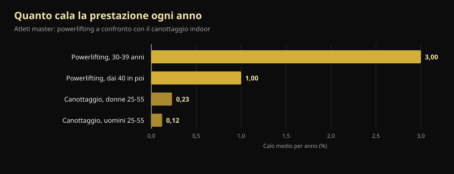
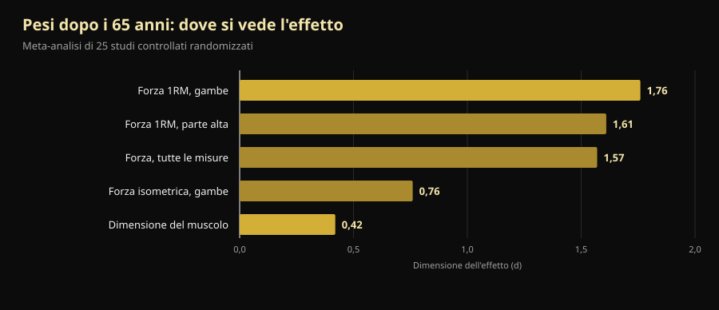

# Mondiali master di powerlifting 2026: cosa insegnano a chi ha passato i 40

Fra quattro giorni, a Reno, comincia un Mondiale in cui il più giovane in pedana ha 40 anni e il più anziano ne ha passati 70. Qui trovi il programma verificato della gara e, soprattutto, la risposta alla domanda che ci sta sotto: quanta forza si perde davvero con l'età, e quanta se ne può riprendere.

Di [Giammaria Loi](/autore/giammaria-loi) · aggiornato il 10 ottobre 2026

## In breve

- I **Mondiali IPF Classic & Equipped Masters** si tengono al Reno Ballroom, a Reno (Nevada), dal 14 al 25 ottobre 2026: riunione tecnica il 14, gara dal 15 al 24, prima la sezione classic e poi l'equipaggiato.
- Si gareggia in quattro fasce d'età: **M1 40-49, M2 50-59, M3 60-69, M4 dai 70 anni in su**, calcolate per anno solare, non per data di nascita.
- Il calo della prestazione di forza è più rapido di quello della resistenza, ma non è lineare: **-3% all'anno nella quarta decade di vita, poi circa -1% all'anno**. Dopo i 40 il nemico non è la curva, è smettere.
- **Si costruisce muscolo anche a 70 anni.** Nel caso studiato più da vicino, una campionessa mondiale della categoria 70+ che aveva iniziato a 63 anni senza nessuna esperienza aveva fibre di tipo II il 46% più grandi delle coetanee sane.
- **Leggero non è più sicuro, è solo meno efficace.** Un anno di carichi pesanti a 64-75 anni ha lasciato la forza isometrica ai livelli di partenza ancora quattro anni dopo; nei gruppi a intensità moderata e di controllo era calata.

*Un atleta della categoria master in partenza di stacco, alla sua prima gara di powerlifting. Foto: U.S. Air National Guard (Master Sgt. Charles Delano), Wikimedia Commons, pubblico dominio.*

## Quando, dove e come si gareggia a Reno

I **Mondiali IPF Classic & Equipped Masters 2026** sono organizzati dalla International Powerlifting Federation insieme a Powerlifting America, con meet director Tamara Lopes. Il calendario ufficiale IPF indica la finestra **14-25 ottobre 2026**; l'invito ufficiale fissa la riunione tecnica il 14 ottobre alle 20:00 al Silver Legacy e la gara vera e propria dal 15 al 24 ottobre, al **Reno Ballroom** di Reno, Nevada.

Il programma segue un ordine preciso, dal più anziano al più giovane:

| Giorni | Sezione | Categorie |
|---|---|---|
| 15-16 ottobre | Classic | M4 (uomini e donne), poi M3 |
| 17-18 ottobre | Classic | M2 (uomini e donne) |
| 19-21 ottobre | Classic | M1 (uomini e donne) |
| 22 ottobre | Equipaggiato | M3 e M4 |
| 23 ottobre | Equipaggiato | M2 |
| 24 ottobre | Equipaggiato | M1 |

"Classic" significa gara **senza attrezzatura di supporto**: cintura, fasce ai polsi e ginocchiere semplici, niente tute o maglie da panca. "Equipped" è la versione con la tuta rinforzata, che permette carichi più alti ma richiede una tecnica a sé.

Le classi di peso in gara sono 59, 74, 83, 93, 105, 120 e +120 kg per gli uomini, 47, 52, 57, 63, 69, 76, 84 e +84 kg per le donne. Le iscrizioni passano **solo dalle federazioni nazionali**, mai dal singolo atleta: nomination preliminare entro il 16 agosto, definitiva entro il 24 settembre 2026.

Un dettaglio che dice molto su che tipo di gara sia: all'IPF **tutti i partecipanti sono classificati International Level Athletes**, cioè sottoposti alle stesse regole antidoping degli open. Atleti e capi-allenatori devono allegare alla nomination il certificato del corso WADA ADEL, e ogni iscritto paga 75 € di quota antidoping oltre ai 60 € di partecipazione. Un campionato master non è una versione annacquata del Mondiale: è lo stesso regolamento, con le stesse responsabilità.

L'edizione 2027 è già fissata: **St. John's, in Canada, dal 7 al 16 ottobre**.

## Come funzionano le categorie master

Le fasce d'età IPF si contano per **anno solare**, non dal compleanno. Chi compie 50 anni a dicembre è già M2 dal 1° gennaio di quell'anno.

| Categoria | Età |
|---|---|
| M1 | dall'anno del 40° compleanno a quello del 49° |
| M2 | dall'anno del 50° a quello del 59° |
| M3 | dall'anno del 60° a quello del 69° |
| M4 | dall'anno del 70° in poi |

È una scala che copre trent'anni di vita biologica. E qui comincia la parte interessante.

*Squat in gara: la stessa alzata, con gli stessi criteri di giudizio, dai 14 anni ai 70 e oltre. Foto: U.S. Army Reserve (Sgt. 1st Class Abel M. Aungst), Wikimedia Commons, pubblico dominio.*

## Cosa dice davvero la ricerca

### "Dopo i 40 la forza crolla" — **Da precisare**

Uno studio che ha confrontato atleti master di powerlifting e di canottaggio indoor ha misurato due cose diverse. La prestazione di forza cala prima e più in fretta di quella di resistenza, ma non a velocità costante: **-3% all'anno durante la quarta decade di vita, poi circa -1% all'anno**. Nel canottaggio, fra i 25 e i 55 anni, il calo annuo è di 0,12% negli uomini e 0,23% nelle donne (Galloway et al., 2002).

*Calo medio annuo della prestazione negli atleti master. Dati: Galloway et al., 2002.*

Due letture, entrambe corrette. La prima: la forza è la qualità che se ne va per prima, ed è esattamente il motivo per cui va allenata. La seconda, quella che i post motivazionali non raccontano: **il tratto più ripido della curva è prima dei 40**, non dopo. Un M2 che perde l'1% all'anno può compensarlo con l'allenamento per anni — ed è ciò che si vede in pedana a Reno.

### "A 70 anni non si costruisce più muscolo" — **Smentito**

Un gruppo dell'Università di Maastricht ha studiato in laboratorio la campionessa mondiale di powerlifting della categoria 70+: 71 anni, **ha iniziato ad allenarsi con i pesi a 63 anni, senza nessuna esperienza precedente di allenamento strutturato**. Rispetto a donne coetanee sane aveva un indice di massa muscolare superiore del 33%, una sezione del quadricipite maggiore del 37%, fibre di tipo II (quelle rapide, le prime a perdersi con l'età) più grandi del 46%, una forza alla leg press superiore del 36% e una presa più forte del 33% (Fuchs et al., 2024).

È un caso singolo e va letto per quello che è: non dimostra che chiunque possa diventare campione del mondo a 71 anni. Dimostra che il muscolo di una persona di 63 anni, mai allenata, **risponde ancora** — abbastanza da portarla a un livello che le coetanee non hanno.

### "Dopo una certa età bisogna allenarsi leggeri" — **Smentito**

Lo studio danese LISA ha randomizzato 451 persone in età di pensione a tre gruppi: un anno di allenamento con **carichi pesanti**, un anno a intensità moderata, oppure nessun allenamento. Poi li ha richiamati per quattro anni. Dei 369 rivalutati alla fine (età media 71 anni, 61% donne), **solo il gruppo dei carichi pesanti aveva mantenuto la forza isometrica delle gambe ai valori di partenza** (149,7 Nm all'inizio, 151,5 Nm quattro anni dopo). Gli altri due gruppi erano calati (Bloch-Ibenfeldt et al., 2024).

Un anno di lavoro pesante ha comprato quattro anni di forza mantenuta. Il lavoro leggero no.

### "I pesi fanno crescere il muscolo anche da anziani come da giovani" — **Da precisare**

La meta-analisi di riferimento su 25 studi controllati in persone con età media dai 65 anni in su trova due effetti molto diversi: **grande sulla forza (d = 1,57), piccolo sulla dimensione del muscolo (d = 0,42)**. La forza massimale sugli arti inferiori è la misura che si muove di più (d = 1,76) (Borde et al., 2015).

*Dimensione dell'effetto (d) dell'allenamento con i pesi oltre i 65 anni. Dati: Borde et al., 2015, meta-analisi di 25 studi controllati randomizzati.*

Tradotto: dopo i 65 anni i pesi ti rendono molto più forte e un po' più grosso. Se l'obiettivo è alzarsi dalla sedia, salire le scale e non cadere, la colonna che conta è la prima. Nella stessa analisi l'intensità più efficace per la forza è il **70-79% del massimale**, con due sedute a settimana, 2-3 serie per esercizio e 7-9 ripetizioni: numeri molto più vicini alla sala pesi di quanto si immagini pensando alla "ginnastica per anziani". Se vuoi approfondire da dove escono questi range, ne abbiamo parlato in [quante ripetizioni servono per la massa](/blog/ripetizioni-serie-recupero-ipertrofia).

### "Nelle persone fragili i pesi risolvono tutto" — **Da precisare**

Qui va detta la parte scomoda. Una meta-analisi del 2025 su 24 studi e 951 anziani **con diagnosi di sarcopenia** trova miglioramenti statisticamente significativi su forza di presa, velocità del cammino e alzate dalla sedia, ma **sotto la soglia di differenza minima clinicamente rilevante**: miglioramenti veri e misurabili, che però il paziente non sempre sente nella vita di tutti i giorni (Yan et al., 2025). Gli autori stimano una dose minima utile attorno a 600 MET-minuti a settimana.

Allenarsi resta la cosa giusta da fare. Ma chi promette che i pesi riportano un ottantenne sarcopenico ai suoi trent'anni sta vendendo qualcosa.

### "Conta solo l'allenamento, le proteine vengono dopo" — **Da precisare**

Nella meta-analisi su 74 studi controllati, aumentare le proteine insieme all'allenamento aggiunge massa magra, e la soglia cambia con l'età: **oltre i 65 anni l'effetto compare già a 1,2-1,59 g per kg di peso al giorno**, mentre sotto i 65 serve arrivare ad almeno 1,6 g/kg (Nunes et al., 2022). Gli effetti sono piccoli: le proteine aggiungono qualcosa all'allenamento, non lo sostituiscono.

Sugli integratori il quadro è più modesto ancora: negli anziani con sarcopenia il whey abbinato ai pesi migliora la massa muscolare con un effetto piccolo (SMD 0,24) e la presa di 2,31 kg, ma **la certezza delle prove è bassa o molto bassa** e la differenza non supera la soglia di rilevanza clinica (Cuyul-Vásquez et al., 2023).

*La panca in gara è l'alzata in cui i master perdono meno: la meta-analisi sugli over 65 mostra effetti grandi anche sulla forza della parte alta. Foto: U.S. Air Force (Airman 1st Class Jordan Gonzalez), Wikimedia Commons, pubblico dominio.*

## Come applicarlo

1. **Non cambiare sport, cambia la gestione.** Dopo i 40 gli esercizi restano gli stessi. Quello che cambia è quanto spesso puoi spingere al limite e quanto tempo serve fra una seduta pesante e l'altra.
2. **Tieni il carico dove serve: 70-79% del massimale.** È l'intervallo con l'effetto maggiore sulla forza negli over 65, e non c'è motivo di scendere sotto solo per l'anagrafe. Due sedute a settimana, 2-3 serie, 7-9 ripetizioni sono un punto di partenza sostenibile.
3. **Scegli l'obiettivo giusto per l'età che hai.** Dopo i 65 l'allenamento rende molto di più in forza che in centimetri. Se misuri i risultati solo allo specchio, concluderai che non funziona mentre sta funzionando.
4. **Alza le proteine prima di comprare integratori.** Da 1,2 g/kg al giorno in su, con l'allenamento, è la leva con più supporto. La polvere è comoda, non magica.
5. **Registra i carichi, non le sensazioni.** La differenza fra un calo fisiologico dell'1% all'anno e un calo da gestione sbagliata la vedi solo confrontando numeri a distanza di mesi. A occhio sono indistinguibili.
6. **Se ti alleni da poco e hai più di 60 anni, parti dalla tecnica e dai carichi misurati**, e fai validare il programma da un professionista se hai patologie o infortuni in corso. Il margine di miglioramento c'è; quello per gli errori è più stretto.

> ### 💡 Con Nurvan
> **Dopo i 40 la progressione non si improvvisa: si misura.** Nurvan registra carico, ripetizioni e RIR — le ripetizioni che ti restano nel serbatoio a fine serie — di ogni singola serie, così dopo sei mesi vedi se la panca è ferma davvero o se sei solo in una settimana storta. Propone in automatico le serie di riscaldamento, che a cinquant'anni non sono un dettaglio, e tiene le misure e gli esami nello stesso posto del programma. Se hai già una scheda del tuo coach, la importi da PDF, Excel o anche da una foto. [Prova Nurvan](https://nurvan.app)

## Domande frequenti

**A che età si può gareggiare come master nel powerlifting?**
Dai 40 anni. L'IPF conta per anno solare: si entra in M1 dal 1° gennaio dell'anno in cui si compiono 40 anni. Poi M2 dai 50, M3 dai 60, M4 dai 70 in su. Le iscrizioni ai Mondiali passano sempre dalla federazione nazionale, mai dal singolo atleta.

**Quanta forza si perde ogni anno dopo i 40?**
Nei dati sugli atleti master il calo si assesta intorno all'1% annuo dopo la fase più ripida, che cade nella quarta decade di vita (Galloway et al., 2002). È una media su gruppi: l'allenamento sposta parecchio il singolo caso, in entrambe le direzioni.

**Si può iniziare con i pesi a 60 o 70 anni?**
Sì, e gli effetti si misurano. Il caso meglio documentato è quello di una donna che ha cominciato a 63 anni senza esperienza ed è diventata campionessa mondiale 70+ (Fuchs et al., 2024). Per chi non punta alle gare, un anno di allenamento pesante in età di pensione ha mantenuto la forza per i quattro anni successivi (Bloch-Ibenfeldt et al., 2024). Se hai patologie in corso, fai valutare il programma dal tuo medico prima di iniziare.

**Meglio pesi leggeri e molte ripetizioni dopo i 65 anni?**
Non per la forza. Nella meta-analisi di riferimento l'intensità con l'effetto maggiore è il 70-79% del massimale (Borde et al., 2015), e nello studio LISA solo il gruppo che si era allenato pesante ha mantenuto la forza a quattro anni. Il carico va costruito nel tempo, non evitato per principio.

## Leggi anche

- [Creatina senza palestra dopo i 45: cosa dice lo studio](/blog/creatina-senza-allenamento-over-45)
- [Quante ripetizioni per la massa: il mito dell'8-12](/blog/ripetizioni-serie-recupero-ipertrofia)
- [Split di allenamento: principiante vs avanzato](/blog/split-allenamento-principiante-avanzato)

## Fonti

1. Galloway MT, Kadoko R, Jokl P, 2002. *Effect of aging on male and female master athletes' performance in strength versus endurance activities.* Am J Orthop (Belle Mead NJ) 31(2):93–98. PMID 11876284 — [pubmed.ncbi.nlm.nih.gov/11876284](https://pubmed.ncbi.nlm.nih.gov/11876284/)
2. Fuchs CJ, Trommelen J, Weijzen MEG, et al., 2024. *Becoming a World Champion Powerlifter at 71 Years of Age: It Is Never Too Late to Start Exercising.* Int J Sport Nutr Exerc Metab 34(4):223–231. PMID 38458181 — [doi:10.1123/ijsnem.2023-0230](https://doi.org/10.1123/ijsnem.2023-0230)
3. Bloch-Ibenfeldt M, Theil Gates A, Karlog K, Demnitz N, Kjaer M, Boraxbekk CJ, 2024. *Heavy resistance training at retirement age induces 4-year lasting beneficial effects in muscle strength: a long-term follow-up of an RCT.* BMJ Open Sport Exerc Med 10(2):e001899. PMID 38911477 — [doi:10.1136/bmjsem-2024-001899](https://doi.org/10.1136/bmjsem-2024-001899)
4. Borde R, Hortobágyi T, Granacher U, 2015. *Dose-Response Relationships of Resistance Training in Healthy Old Adults: A Systematic Review and Meta-Analysis.* Sports Med 45(12):1693–1720. PMID 26420238 — [doi:10.1007/s40279-015-0385-9](https://doi.org/10.1007/s40279-015-0385-9)
5. Yan R, Chen Y, Zhang R, He J, Lin W, Sun J, Li D, 2025. *Optimal resistance training prescriptions to improve muscle strength, physical function, and muscle mass in older adults diagnosed with sarcopenia: a systematic review and meta-analysis.* Aging Clin Exp Res 37(1):320. PMID 41212331 — [doi:10.1007/s40520-025-03235-w](https://doi.org/10.1007/s40520-025-03235-w)
6. Nunes EA, Colenso-Semple L, McKellar SR, et al., 2022. *Systematic review and meta-analysis of protein intake to support muscle mass and function in healthy adults.* J Cachexia Sarcopenia Muscle 13(2):795–810. PMID 35187864 — [doi:10.1002/jcsm.12922](https://doi.org/10.1002/jcsm.12922)
7. Cuyul-Vásquez I, Pezo-Navarrete J, Vargas-Arriagada C, et al., 2023. *Effectiveness of Whey Protein Supplementation during Resistance Exercise Training on Skeletal Muscle Mass and Strength in Older People with Sarcopenia.* Nutrients 15(15):3424. PMID 37571361 — [doi:10.3390/nu15153424](https://doi.org/10.3390/nu15153424)

Metadati e abstract recuperati da PubMed. Dati dell'evento: [invito ufficiale IPF/Powerlifting America](https://www.powerlifting.sport/fileadmin/ipf/data/championships/informations/2026/masters/2026_IPF_World_Masters_Powerlifting_Championships_Invitation_USA-03.pdf) e [calendario ufficiale IPF](https://www.powerlifting.sport/championships/calendar), consultati il 10 ottobre 2026. Categorie di età e classi di peso dal regolamento tecnico IPF. Nessun pronostico e nessun commento su singoli atleti in gara.

---

**Giammaria Loi** è il fondatore di Nurvan. Si allena con i pesi dal 2012, lavora come personal trainer e coach certificato FIPE dal 2013 e gareggia nel powerlifting a livello nazionale dal 2018. Ogni articolo che firma parte dagli studi scientifici e arriva a ciò che funziona davvero in palestra.

> Nota: contenuto informativo, non sostituisce il parere di un medico o professionista. Se hai patologie, assumi farmaci o riprendi l'attività dopo un lungo stop, fai valutare il tuo programma da un medico o da un professionista qualificato prima di iniziare.
