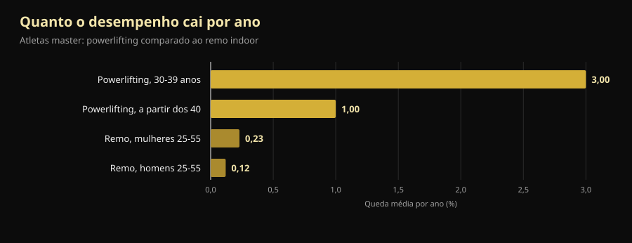
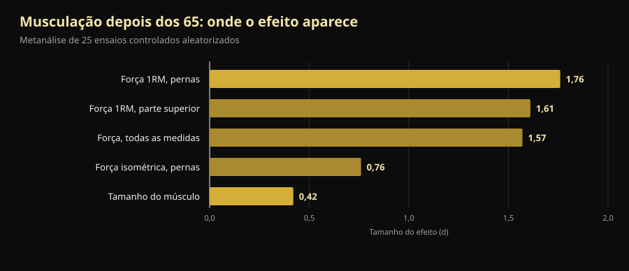

# Mundial master de powerlifting 2026: o que ensina a quem passou dos 40

Daqui a quatro dias, em Reno, começa um Mundial em que o mais novo no palco tem 40 anos e o mais velho já passou dos 70. Aqui está o programa verificado e, sobretudo, a resposta à pergunta de fundo: quanta força se perde mesmo com a idade e quanta se consegue recuperar.

Por [Giammaria Loi](/autore/giammaria-loi) · atualizado a 10 de outubro de 2026

## Em resumo

- O **Mundial IPF Classic & Equipped Masters** decorre no Reno Ballroom, em Reno (Nevada), de 14 a 25 de outubro de 2026: reunião técnica a 14 e competição de 15 a 24, primeiro clássico e depois equipado.
- Quatro escalões etários: **M1 40-49, M2 50-59, M3 60-69 e M4 a partir dos 70**, contados por ano civil e não pela data de nascimento.
- A força cai mais cedo e mais depressa do que a resistência, mas não a ritmo constante: **–3% por ano durante a quarta década de vida e cerca de –1% por ano depois**. Passados os 40, o inimigo não é a curva: é parar.
- **Ganha-se músculo mesmo aos 70.** No caso mais bem estudado, uma campeã mundial da categoria 70+ que começou a treinar aos 63 tinha fibras do tipo II 46% maiores do que mulheres saudáveis da mesma idade.
- **Leve não é mais seguro, apenas menos eficaz.** Um ano de cargas pesadas entre os 64 e os 75 anos deixou a força isométrica nos valores iniciais quatro anos depois; os grupos de intensidade moderada e de controlo tinham descido.

*Um atleta da categoria master a preparar o levantamento terra, na sua primeira competição. Foto: U.S. Air National Guard (Master Sgt. Charles Delano), Wikimedia Commons, domínio público.*

## Quando, onde e como se compete em Reno

O **Mundial IPF Classic & Equipped Masters 2026** é organizado pela International Powerlifting Federation com a Powerlifting America, com Tamara Lopes como meet director. O calendário oficial da IPF indica a janela **14-25 de outubro de 2026**; o convite oficial marca a reunião técnica para 14 de outubro às 20:00 no Silver Legacy e a competição de 15 a 24 de outubro, no **Reno Ballroom**, em Reno, Nevada.

A ordem vai do mais velho para o mais novo:

| Dias | Secção | Categorias |
|---|---|---|
| 15-16 de outubro | Clássico | M4 (homens e mulheres) e depois M3 |
| 17-18 de outubro | Clássico | M2 (homens e mulheres) |
| 19-21 de outubro | Clássico | M1 (homens e mulheres) |
| 22 de outubro | Equipado | M3 e M4 |
| 23 de outubro | Equipado | M2 |
| 24 de outubro | Equipado | M1 |

"Clássico" significa competir **sem equipamento de suporte**: cinto, punhos e joelheiras simples, sem fatos de agachamento nem camisolas de supino. "Equipado" admite o fato reforçado, que permite mais quilos mas exige uma técnica própria.

As categorias de peso são 59, 74, 83, 93, 105, 120 e +120 kg nos homens e 47, 52, 57, 63, 69, 76, 84 e +84 kg nas mulheres. As inscrições passam **apenas pelas federações nacionais**, nunca pelo atleta: nomeação preliminar até 16 de agosto e definitiva até 24 de setembro de 2026.

Um pormenor diz muito sobre o nível de exigência: na IPF **todos os participantes são classificados como International Level Athletes**, sujeitos às mesmas regras antidopagem do open. Atletas e treinadores principais têm de juntar à nomeação o certificado do curso WADA ADEL, e cada inscrito paga 75 € de taxa antidopagem além dos 60 € de participação. Um campeonato master não é um Mundial aligeirado: é o mesmo regulamento, com as mesmas responsabilidades.

A edição de 2027 já está marcada: **St. John's, no Canadá, de 7 a 16 de outubro**.

## Como funcionam as categorias master

Os escalões da IPF contam-se por **ano civil**, não a partir do aniversário. Quem faz 50 anos em dezembro já é M2 desde 1 de janeiro desse ano.

| Categoria | Idade |
|---|---|
| M1 | do ano do 40.º aniversário ao do 49.º |
| M2 | do ano do 50.º ao do 59.º |
| M3 | do ano do 60.º ao do 69.º |
| M4 | a partir do ano do 70.º |

É uma escala que cobre trinta anos de biologia. E é aí que a coisa fica interessante.

*Agachamento em competição: o mesmo movimento, com os mesmos critérios de arbitragem, dos 14 aos 70 anos e mais. Foto: U.S. Army Reserve (Sgt. 1st Class Abel M. Aungst), Wikimedia Commons, domínio público.*

## O que a investigação diz mesmo

### "Depois dos 40 a força desaba" — **A precisar**

Um estudo que comparou atletas master de powerlifting e de remo indoor mediu duas coisas diferentes. O desempenho de força cai mais cedo e mais depressa do que o de resistência, mas não a velocidade constante: **–3% por ano durante a quarta década de vida e depois cerca de –1% por ano**. No remo, entre os 25 e os 55 anos, a queda anual é de 0,12% nos homens e 0,23% nas mulheres (Galloway et al., 2002).

*Queda média anual do desempenho em atletas master. Dados: Galloway et al., 2002.*

Duas leituras, ambas corretas. A primeira: a força é a qualidade que se vai primeiro, e é exatamente por isso que tem de ser treinada. A segunda, a que os posts motivacionais ignoram: **o troço mais íngreme da curva está antes dos 40**, não depois. Um M2 que perde 1% por ano pode compensá-lo com treino durante anos — e é isso que se vê no estrado em Reno.

### "Aos 70 já não se ganha músculo" — **Desmentido**

Uma equipa da Universidade de Maastricht estudou em laboratório a campeã mundial de powerlifting da categoria 70+: 71 anos e **começou a treinar com pesos aos 63, sem nenhuma experiência anterior de treino estruturado**. Face a mulheres saudáveis da mesma idade, tinha um índice de massa muscular 33% superior, uma secção do quadricípite 37% maior, fibras do tipo II (as rápidas, as primeiras a perder-se com a idade) 46% maiores, mais 36% de força na prensa de pernas e uma preensão 33% mais forte (Fuchs et al., 2024).

É um caso único e deve ser lido como tal: não prova que qualquer pessoa possa ser campeã do mundo aos 71. Prova que o músculo de alguém de 63 anos que nunca treinou **ainda responde** — o suficiente para a levar onde as suas contemporâneas não estão.

### "A partir de certa idade há que treinar leve" — **Desmentido**

O ensaio dinamarquês LISA distribuiu ao acaso 451 pessoas em idade de reforma por três grupos: um ano de treino com **cargas pesadas**, um ano de intensidade moderada ou nenhum treino. Depois seguiu-as durante quatro anos. Dos 369 reavaliados no fim (idade média 71 anos, 61% mulheres), **só o grupo das cargas pesadas manteve a força isométrica das pernas nos valores iniciais** (149,7 Nm no início e 151,5 Nm quatro anos depois). Os outros dois tinham descido (Bloch-Ibenfeldt et al., 2024).

Um ano de trabalho pesado comprou quatro anos de força mantida. O trabalho leve não.

### "Os pesos fazem crescer o músculo aos 70 como aos 25" — **A precisar**

A metanálise de referência sobre 25 ensaios controlados em pessoas com idade média de 65 anos ou mais encontra dois efeitos muito diferentes: **grande na força (d = 1,57) e pequeno no tamanho do músculo (d = 0,42)**. A força máxima dos membros inferiores é a medida que mais se mexe (d = 1,76) (Borde et al., 2015).

*Tamanho do efeito (d) do treino com pesos depois dos 65 anos. Dados: Borde et al., 2015, metanálise de 25 ensaios controlados aleatorizados.*

Traduzindo: depois dos 65, os pesos tornam-te muito mais forte e um pouco maior. Se o objetivo é levantar-se da cadeira, subir escadas e não cair, a coluna que conta é a primeira. Na mesma análise, a intensidade mais eficaz para a força é **70-79% do máximo**, com duas sessões por semana, 2-3 séries por exercício e 7-9 repetições: números muito mais próximos de um ginásio a sério do que da "ginástica para idosos". Para ver de onde saem estes intervalos, falámos disso em [quantas repetições são precisas para ganhar massa](/pt/blog/quantas-repeticoes-massa-muscular).

### "Nas pessoas frágeis os pesos resolvem tudo" — **A precisar**

Aqui vai a parte incómoda. Uma metanálise de 2025 sobre 24 estudos e 951 idosos **com diagnóstico de sarcopenia** encontra melhorias estatisticamente significativas na força de preensão, na velocidade da marcha e no levantar da cadeira, mas **abaixo do limiar de diferença mínima clinicamente relevante**: melhorias reais e mensuráveis que o doente nem sempre sente no dia a dia (Yan et al., 2025). Os autores situam a dose mínima útil à volta de 600 MET-minutos por semana.

Treinar continua a ser a decisão certa. Mas quem promete que os pesos devolvem a um octogenário sarcopénico os seus trinta anos está a vender alguma coisa.

### "O que conta é treinar, a proteína vem depois" — **A precisar**

Na metanálise de 74 ensaios controlados, aumentar a proteína a par do treino acrescenta massa magra, e o limiar muda com a idade: **acima dos 65 anos o efeito aparece já com 1,2-1,59 g por kg de peso por dia**, ao passo que abaixo dos 65 são precisos pelo menos 1,6 g/kg (Nunes et al., 2022). Os efeitos são pequenos: a proteína soma ao treino, não o substitui.

Nos suplementos o quadro é ainda mais modesto: em idosos com sarcopenia, o whey associado aos pesos melhora a massa muscular com um efeito pequeno (SMD 0,24) e a preensão em 2,31 kg, mas **a certeza da evidência é baixa ou muito baixa** e a diferença não ultrapassa o limiar de relevância clínica (Cuyul-Vásquez et al., 2023).

*O supino é o movimento em que os master perdem menos: a metanálise nos maiores de 65 mostra efeitos grandes também na força do tronco superior. Foto: U.S. Air Force (Airman 1st Class Jordan Gonzalez), Wikimedia Commons, domínio público.*

## Como aplicar

1. **Não mudes de desporto, muda a gestão.** Depois dos 40 os exercícios são os mesmos. O que muda é de quanto em quanto tempo podes ir ao limite e quanto precisas entre sessões pesadas.
2. **Mantém a carga onde serve: 70-79% do máximo.** É o intervalo com maior efeito sobre a força nos maiores de 65, e não há motivo para descer só por causa da idade. Duas sessões por semana, 2-3 séries e 7-9 repetições são um ponto de partida sustentável.
3. **Escolhe o objetivo certo para a idade que tens.** Passados os 65, o treino rende muito mais em força do que em centímetros. Se só avaliares ao espelho, concluis que não funciona enquanto está a funcionar.
4. **Sobe a proteína antes de comprar suplementos.** A partir de 1,2 g/kg por dia, com treino, é a alavanca mais bem apoiada. O pó é cómodo, não é mágico.
5. **Regista as cargas, não as sensações.** A diferença entre uma queda fisiológica de 1% ao ano e uma queda por má gestão só se vê comparando números com meses de intervalo. A olho são iguais.
6. **Se começas com mais de 60 anos, parte da técnica e de cargas medidas**, e manda validar o programa por um profissional se tiveres patologias ou lesões em curso. A margem de melhoria existe; a margem para erros é mais estreita.

> ### 💡 Com a Nurvan
> **Depois dos 40 a progressão não se improvisa: mede-se.** A Nurvan regista carga, repetições e RIR — as repetições que te sobram no depósito no fim da série — de cada série, para que ao fim de seis meses vejas se o supino está mesmo parado ou se só tiveste uma semana má. Propõe automaticamente as séries de aquecimento, que aos cinquenta não são um pormenor, e guarda medidas e análises no mesmo sítio do programa. Já tens um plano do teu treinador? Importa-o a partir de PDF, Excel ou até de uma fotografia. [Experimenta a Nurvan](https://nurvan.app)

## Perguntas frequentes

**A partir de que idade se compete como master no powerlifting?**
A partir dos 40. A IPF conta por ano civil: entra-se em M1 a 1 de janeiro do ano em que se fazem 40 anos, depois M2 aos 50, M3 aos 60 e M4 a partir dos 70. A inscrição no Mundial passa sempre pela federação nacional.

**Quanta força se perde por ano depois dos 40?**
Nos dados de atletas master a queda estabiliza à volta de 1% ao ano depois da fase mais acentuada, que cai na quarta década de vida (Galloway et al., 2002). É uma média de grupo: o treino desloca muito o caso individual, nos dois sentidos.

**Pode começar-se com pesos aos 60 ou 70 anos?**
Sim, e os efeitos medem-se. O caso mais bem documentado é o de uma mulher que começou aos 63 sem experiência e chegou a campeã mundial 70+ (Fuchs et al., 2024). Para quem não procura medalhas, um ano de treino pesado em idade de reforma manteve a força nos quatro anos seguintes (Bloch-Ibenfeldt et al., 2024). Se tens patologias, fala com o teu médico antes.

**São melhores pesos leves e muitas repetições depois dos 65?**
Para a força, não. Na metanálise de referência a intensidade com maior efeito é 70-79% do máximo (Borde et al., 2015) e, no ensaio LISA, só o grupo que treinou pesado manteve a força aos quatro anos. A carga constrói-se com o tempo, não se evita por princípio.

## Lê também

- [Creatina sem treino depois dos 45: o que diz o estudo](/pt/blog/creatina-sem-treino-depois-dos-45)
- [Quantas repetições para ganhar massa: o mito do 8-12](/pt/blog/quantas-repeticoes-massa-muscular)
- [Divisão de treino: iniciante vs avançado](/pt/blog/divisao-treino-iniciante-avancado)

## Fontes

1. Galloway MT, Kadoko R, Jokl P, 2002. *Effect of aging on male and female master athletes' performance in strength versus endurance activities.* Am J Orthop (Belle Mead NJ) 31(2):93–98. PMID 11876284 — [pubmed.ncbi.nlm.nih.gov/11876284](https://pubmed.ncbi.nlm.nih.gov/11876284/)
2. Fuchs CJ, Trommelen J, Weijzen MEG, et al., 2024. *Becoming a World Champion Powerlifter at 71 Years of Age: It Is Never Too Late to Start Exercising.* Int J Sport Nutr Exerc Metab 34(4):223–231. PMID 38458181 — [doi:10.1123/ijsnem.2023-0230](https://doi.org/10.1123/ijsnem.2023-0230)
3. Bloch-Ibenfeldt M, Theil Gates A, Karlog K, Demnitz N, Kjaer M, Boraxbekk CJ, 2024. *Heavy resistance training at retirement age induces 4-year lasting beneficial effects in muscle strength: a long-term follow-up of an RCT.* BMJ Open Sport Exerc Med 10(2):e001899. PMID 38911477 — [doi:10.1136/bmjsem-2024-001899](https://doi.org/10.1136/bmjsem-2024-001899)
4. Borde R, Hortobágyi T, Granacher U, 2015. *Dose-Response Relationships of Resistance Training in Healthy Old Adults: A Systematic Review and Meta-Analysis.* Sports Med 45(12):1693–1720. PMID 26420238 — [doi:10.1007/s40279-015-0385-9](https://doi.org/10.1007/s40279-015-0385-9)
5. Yan R, Chen Y, Zhang R, He J, Lin W, Sun J, Li D, 2025. *Optimal resistance training prescriptions to improve muscle strength, physical function, and muscle mass in older adults diagnosed with sarcopenia: a systematic review and meta-analysis.* Aging Clin Exp Res 37(1):320. PMID 41212331 — [doi:10.1007/s40520-025-03235-w](https://doi.org/10.1007/s40520-025-03235-w)
6. Nunes EA, Colenso-Semple L, McKellar SR, et al., 2022. *Systematic review and meta-analysis of protein intake to support muscle mass and function in healthy adults.* J Cachexia Sarcopenia Muscle 13(2):795–810. PMID 35187864 — [doi:10.1002/jcsm.12922](https://doi.org/10.1002/jcsm.12922)
7. Cuyul-Vásquez I, Pezo-Navarrete J, Vargas-Arriagada C, et al., 2023. *Effectiveness of Whey Protein Supplementation during Resistance Exercise Training on Skeletal Muscle Mass and Strength in Older People with Sarcopenia.* Nutrients 15(15):3424. PMID 37571361 — [doi:10.3390/nu15153424](https://doi.org/10.3390/nu15153424)

Metadados e resumos obtidos no PubMed. Dados do evento: [convite oficial IPF/Powerlifting America](https://www.powerlifting.sport/fileadmin/ipf/data/championships/informations/2026/masters/2026_IPF_World_Masters_Powerlifting_Championships_Invitation_USA-03.pdf) e [calendário oficial da IPF](https://www.powerlifting.sport/championships/calendar), consultados a 10 de outubro de 2026. Categorias etárias e de peso do regulamento técnico da IPF. Sem prognósticos e sem comentários sobre atletas em concreto.

---

**Giammaria Loi** é o fundador da Nurvan. Treina com pesos desde 2012, trabalha como personal trainer e coach certificado FIPE desde 2013 e compete em powerlifting a nível nacional desde 2018. Cada artigo que assina parte dos estudos científicos e chega ao que funciona mesmo no ginásio.

> Nota: conteúdo informativo, não substitui a opinião de um médico ou profissional. Se tens patologias, tomas medicação ou retomas depois de uma paragem longa, manda avaliar o teu programa por um médico ou profissional qualificado antes de começar.
