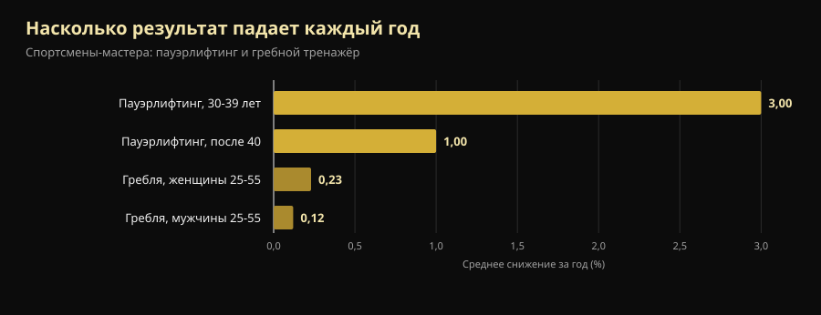
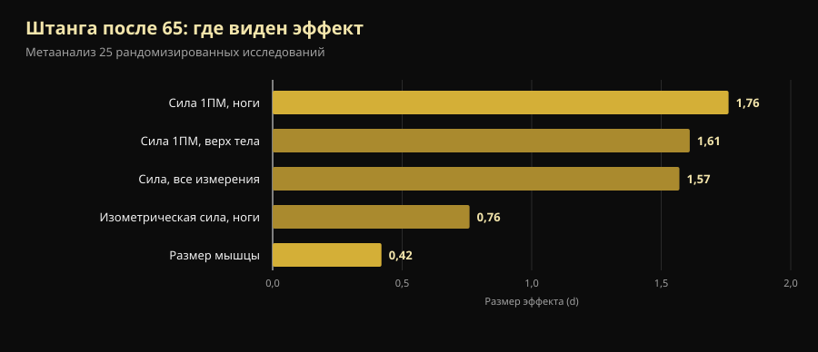

# Чемпионат мира среди мастеров 2026: чему он учит тех, кому за 40

Через четыре дня в Рино стартует чемпионат мира, где самому молодому участнику на помосте 40 лет, а самому возрастному — больше 70. Ниже проверенное расписание и, главное, ответ на вопрос, который стоит за всем этим: сколько силы реально теряется с возрастом и сколько можно вернуть.

Автор: [Джаммария Лои](/autore/giammaria-loi) · обновлено 10 октября 2026

## Коротко

- **Чемпионат мира IPF Classic & Equipped Masters** проходит в Reno Ballroom в городе Рино (Невада) с 14 по 25 октября 2026 года: техническое совещание 14-го, соревнования с 15-го по 24-е, сначала классика, потом экипировка.
- Четыре возрастные группы: **M1 40-49, M2 50-59, M3 60-69, M4 от 70 лет**, считаются по календарному году, а не по дате рождения.
- Сила падает раньше и быстрее выносливости, но не равномерно: **около –3% в год в четвёртом десятилетии жизни, затем примерно –1% в год**. После 40 враг не кривая, а остановка.
- **Мышцы растут и в 70.** В наиболее подробно изученном случае у чемпионки мира в категории 70+, начавшей в 63 года, волокна II типа были на 46% крупнее, чем у здоровых ровесниц.
- **Лёгкое — не безопаснее, просто менее действенно.** Год тяжёлых тренировок в 64-75 лет оставил изометрическую силу на исходном уровне спустя четыре года; в группах умеренной интенсивности и контроля она снизилась.

*Спортсмен категории мастеров готовится к становой тяге на своём первом турнире. Фото: U.S. Air National Guard (Master Sgt. Charles Delano), Wikimedia Commons, общественное достояние.*

## Когда, где и как соревнуются в Рино

**Чемпионат мира IPF Classic & Equipped Masters 2026** проводят International Powerlifting Federation совместно с Powerlifting America, директор турнира — Тамара Лопес. Официальный календарь IPF указывает окно **14-25 октября 2026**; официальное приглашение назначает техническое совещание на 14 октября в 20:00 в Silver Legacy, а сами соревнования — с 15 по 24 октября в **Reno Ballroom**, Рино, Невада.

Порядок выступлений — от старших к младшим:

| Дни | Раздел | Категории |
|---|---|---|
| 15-16 октября | Классика | M4 (мужчины и женщины), затем M3 |
| 17-18 октября | Классика | M2 (мужчины и женщины) |
| 19-21 октября | Классика | M1 (мужчины и женщины) |
| 22 октября | Экипировка | M3 и M4 |
| 23 октября | Экипировка | M2 |
| 24 октября | Экипировка | M1 |

«Классика» означает выступление **без поддерживающей экипировки**: пояс, кистевые бинты и простые наколенники, без комбинезонов для приседа и жимовых маек. «Экипировка» допускает усиленный комбинезон: он позволяет взять больше, но требует отдельной техники.

Весовые категории на турнире: 59, 74, 83, 93, 105, 120 и +120 кг у мужчин, 47, 52, 57, 63, 69, 76, 84 и +84 кг у женщин. Заявки подаются **только через национальные федерации**, никогда самим спортсменом: предварительная до 16 августа, окончательная до 24 сентября 2026 года.

Одна деталь многое говорит об уровне требований: в IPF **все участники здесь считаются International Level Athletes**, то есть подпадают под те же антидопинговые правила, что и взрослая категория. Спортсмены и главные тренеры обязаны приложить к заявке сертификат курса WADA ADEL, и каждый участник платит 75 € антидопингового сбора плюс 60 € стартового взноса. Чемпионат мастеров — не облегчённая версия: те же правила и та же ответственность.

Следующее издание уже назначено: **Сент-Джонс, Канада, 7-16 октября 2027 года**.

## Как устроены категории мастеров

Возрастные группы IPF считаются по **календарному году**, а не со дня рождения. Тот, кому 50 исполняется в декабре, уже с 1 января того же года выступает в M2.

| Категория | Возраст |
|---|---|
| M1 | с года 40-летия по год 49-летия |
| M2 | с года 50-летия по год 59-летия |
| M3 | с года 60-летия по год 69-летия |
| M4 | с года 70-летия и далее |

Шкала покрывает тридцать лет биологии. Вот тут и начинается самое интересное.

*Присед на соревнованиях: то же движение и те же критерии судейства — от 14 лет до 70 и старше. Фото: U.S. Army Reserve (Sgt. 1st Class Abel M. Aungst), Wikimedia Commons, общественное достояние.*

## Что на самом деле говорит наука

### «После 40 сила обваливается» — **Требует уточнения**

Исследование, сравнившее спортсменов-мастеров в пауэрлифтинге и в гребле на тренажёре, измерило две разные вещи. Силовой результат падает раньше и быстрее, чем выносливость, но не с постоянной скоростью: **–3% в год в четвёртом десятилетии жизни, затем около –1% в год**. В гребле в возрасте от 25 до 55 лет годовое снижение составляет 0,12% у мужчин и 0,23% у женщин (Galloway et al., 2002).

*Среднегодовое снижение результата у спортсменов-мастеров. Данные: Galloway et al., 2002.*

Два прочтения, оба верные. Первое: сила уходит первой — именно поэтому её и нужно тренировать. Второе, о котором молчат мотивационные посты: **самый крутой участок кривой приходится на период до 40**, а не после. Мастер категории M2, теряющий 1% в год, годами может компенсировать это тренировками — именно это и видно на помосте в Рино.

### «В 70 мышцы уже не построишь» — **Опровергнуто**

Группа Маастрихтского университета исследовала в лаборатории чемпионку мира по пауэрлифтингу в категории 70+: 71 год, **начала заниматься с отягощениями в 63 года, без какого-либо опыта структурированных тренировок**. По сравнению со здоровыми ровесницами у неё был на 33% выше индекс мышечной массы, на 37% больше поперечное сечение квадрицепса, на 46% крупнее волокна II типа (быстрые, которые теряются с возрастом первыми), на 36% больше сила в жиме ногами и на 33% сильнее хват (Fuchs et al., 2024).

Это единичный случай, и читать его надо именно так: он не доказывает, что любой станет чемпионом мира в 71. Он доказывает, что мышца никогда не тренировавшегося 63-летнего человека **всё ещё отвечает** — достаточно, чтобы вывести её туда, где ровесницы не находятся.

### «После определённого возраста надо тренироваться легко» — **Опровергнуто**

Датское исследование LISA случайным образом распределило 451 человека пенсионного возраста на три группы: год тренировок с **тяжёлыми весами**, год умеренной интенсивности или без тренировок. Затем за ними наблюдали четыре года. Из 369 обследованных в конце (средний возраст 71 год, 61% женщины) **только группа тяжёлых весов сохранила изометрическую силу ног на исходном уровне** (149,7 Н·м в начале и 151,5 Н·м через четыре года). Две другие снизились (Bloch-Ibenfeldt et al., 2024).

Год тяжёлой работы купил четыре года сохранённой силы. Лёгкая работа — нет.

### «В 70 штанга растит мышцы так же, как в 25» — **Требует уточнения**

Опорный метаанализ 25 контролируемых исследований у людей со средним возрастом от 65 лет находит два очень разных эффекта: **большой на силу (d = 1,57) и маленький на размер мышцы (d = 0,42)**. Сильнее всего меняется максимальная сила ног (d = 1,76) (Borde et al., 2015).

*Размер эффекта (d) силовых тренировок после 65 лет. Данные: Borde et al., 2015, метаанализ 25 рандомизированных контролируемых исследований.*

В переводе: после 65 штанга делает заметно сильнее и немного крупнее. Если цель — встать со стула, подняться по лестнице и не упасть, важен первый столбец. В том же анализе самая действенная интенсивность для силы — **70-79% от максимума**, при двух занятиях в неделю, 2-3 подходах на упражнение и 7-9 повторениях: цифры куда ближе к настоящему тренажёрному залу, чем к «гимнастике для пожилых». Откуда берутся эти диапазоны, мы разбирали в материале [сколько повторений нужно для массы](/ru/blog/skolko-povtoreniy-dlya-massy).

### «У ослабленных пожилых штанга решает всё» — **Требует уточнения**

Теперь неудобная часть. Метаанализ 2025 года по 24 исследованиям и 951 пожилому человеку **с диагностированной саркопенией** находит статистически значимые улучшения силы хвата, скорости ходьбы и подъёмов со стула, но **ниже порога минимально значимого клинического различия**: реальные измеримые сдвиги, которые пациент не всегда ощущает в быту (Yan et al., 2025). Минимальную полезную дозу авторы оценивают примерно в 600 МЕТ-минут в неделю.

Тренироваться всё равно правильно. Но тот, кто обещает, что штанга вернёт саркопеничному восьмидесятилетнему его тридцать лет, что-то продаёт.

### «Главное — тренировки, белок потом» — **Требует уточнения**

В метаанализе 74 контролируемых исследований увеличение белка вместе с тренировками добавляет безжировую массу, и порог меняется с возрастом: **после 65 лет эффект появляется уже при 1,2-1,59 г на кг веса в день**, а до 65 требуется не менее 1,6 г/кг (Nunes et al., 2022). Эффекты невелики: белок дополняет тренировку, а не заменяет её.

С добавками картина ещё скромнее: у пожилых с саркопенией сывороточный белок вместе с силовыми улучшает мышечную массу с небольшим эффектом (SMD 0,24) и силу хвата на 2,31 кг, но **достоверность доказательств низкая или очень низкая**, и разница не превышает порога клинической значимости (Cuyul-Vásquez et al., 2023).

*Жим — движение, в котором мастера теряют меньше всего: метаанализ по людям старше 65 показывает большие эффекты и для силы верха тела. Фото: U.S. Air Force (Airman 1st Class Jordan Gonzalez), Wikimedia Commons, общественное достояние.*

## Как это применить

1. **Меняйте не вид спорта, а управление нагрузкой.** После 40 упражнения остаются те же. Меняется то, как часто можно работать на пределе и сколько нужно между тяжёлыми тренировками.
2. **Держите вес там, где он работает: 70-79% от максимума.** Это диапазон с наибольшим эффектом на силу после 65, и опускаться ниже только из-за возраста причин нет. Две тренировки в неделю, 2-3 подхода, 7-9 повторений — посильная точка старта.
3. **Выбирайте цель по возрасту.** После 65 тренировки дают гораздо больше в силе, чем в сантиметрах. Если судить только по зеркалу, можно решить, что не работает, пока оно работает.
4. **Поднимите белок прежде, чем покупать добавки.** От 1,2 г/кг в день вместе с тренировками — рычаг с самой надёжной поддержкой. Порошок удобен, но не волшебен.
5. **Записывайте веса, а не ощущения.** Разницу между естественным снижением на 1% в год и падением из-за плохого планирования видно только при сравнении цифр за месяцы. На глаз они неотличимы.
6. **Если вы начинаете после 60, начните с техники и измеренных весов**, а при заболеваниях или текущих травмах покажите программу специалисту. Запас для прогресса реален; запас для ошибок уже.

> ### 💡 Вместе с Nurvan
> **После 40 прогресс не импровизируют, его измеряют.** Nurvan записывает вес, повторения и RIR — сколько повторений осталось «в запасе» в конце подхода — по каждому подходу, и через полгода видно, действительно ли жим встал или это была просто неудачная неделя. Разминочные подходы приложение предлагает автоматически, а в пятьдесят это не мелочь; замеры и анализы лежат там же, где программа. Уже есть план от тренера? Импортируйте его из PDF, Excel или даже с фотографии. [Попробовать Nurvan](https://nurvan.app)

## Частые вопросы

**С какого возраста выступают в категории мастеров?**
С 40 лет. IPF считает по календарному году: в M1 попадают с 1 января года, в котором исполняется 40, затем M2 с 50, M3 с 60 и M4 с 70. Заявка на чемпионат мира всегда подаётся через национальную федерацию.

**Сколько силы теряется каждый год после 40?**
По данным о спортсменах-мастерах снижение выходит примерно на 1% в год после самой крутой фазы, которая приходится на четвёртое десятилетие жизни (Galloway et al., 2002). Это среднее по группам: тренировки сильно смещают индивидуальный случай в обе стороны.

**Можно ли начать заниматься с весами в 60 или 70 лет?**
Да, и эффекты измеримы. Лучше всего задокументирован случай женщины, начавшей в 63 года без опыта и ставшей чемпионкой мира 70+ (Fuchs et al., 2024). Тем, кто не гонится за медалями: год тяжёлых тренировок в пенсионном возрасте сохранил силу на следующие четыре года (Bloch-Ibenfeldt et al., 2024). При имеющихся заболеваниях сначала согласуйте программу с врачом.

**После 65 лучше лёгкие веса и много повторений?**
Для силы — нет. В опорном метаанализе наибольший эффект даёт интенсивность 70-79% от максимума (Borde et al., 2015), а в исследовании LISA силу через четыре года сохранила только тяжело тренировавшаяся группа. Вес наращивают со временем, а не избегают из принципа.

## Читайте также

- [Креатин без тренировок после 45: что показало исследование](/ru/blog/kreatin-bez-trenirovok-posle-45)
- [Сколько повторений нужно для массы: миф о 8-12](/ru/blog/skolko-povtoreniy-dlya-massy)
- [Сплит тренировок: новичок против продвинутого](/ru/blog/split-trenirovok-novichok-prodvinutyy)

## Источники

1. Galloway MT, Kadoko R, Jokl P, 2002. *Effect of aging on male and female master athletes' performance in strength versus endurance activities.* Am J Orthop (Belle Mead NJ) 31(2):93–98. PMID 11876284 — [pubmed.ncbi.nlm.nih.gov/11876284](https://pubmed.ncbi.nlm.nih.gov/11876284/)
2. Fuchs CJ, Trommelen J, Weijzen MEG, et al., 2024. *Becoming a World Champion Powerlifter at 71 Years of Age: It Is Never Too Late to Start Exercising.* Int J Sport Nutr Exerc Metab 34(4):223–231. PMID 38458181 — [doi:10.1123/ijsnem.2023-0230](https://doi.org/10.1123/ijsnem.2023-0230)
3. Bloch-Ibenfeldt M, Theil Gates A, Karlog K, Demnitz N, Kjaer M, Boraxbekk CJ, 2024. *Heavy resistance training at retirement age induces 4-year lasting beneficial effects in muscle strength: a long-term follow-up of an RCT.* BMJ Open Sport Exerc Med 10(2):e001899. PMID 38911477 — [doi:10.1136/bmjsem-2024-001899](https://doi.org/10.1136/bmjsem-2024-001899)
4. Borde R, Hortobágyi T, Granacher U, 2015. *Dose-Response Relationships of Resistance Training in Healthy Old Adults: A Systematic Review and Meta-Analysis.* Sports Med 45(12):1693–1720. PMID 26420238 — [doi:10.1007/s40279-015-0385-9](https://doi.org/10.1007/s40279-015-0385-9)
5. Yan R, Chen Y, Zhang R, He J, Lin W, Sun J, Li D, 2025. *Optimal resistance training prescriptions to improve muscle strength, physical function, and muscle mass in older adults diagnosed with sarcopenia: a systematic review and meta-analysis.* Aging Clin Exp Res 37(1):320. PMID 41212331 — [doi:10.1007/s40520-025-03235-w](https://doi.org/10.1007/s40520-025-03235-w)
6. Nunes EA, Colenso-Semple L, McKellar SR, et al., 2022. *Systematic review and meta-analysis of protein intake to support muscle mass and function in healthy adults.* J Cachexia Sarcopenia Muscle 13(2):795–810. PMID 35187864 — [doi:10.1002/jcsm.12922](https://doi.org/10.1002/jcsm.12922)
7. Cuyul-Vásquez I, Pezo-Navarrete J, Vargas-Arriagada C, et al., 2023. *Effectiveness of Whey Protein Supplementation during Resistance Exercise Training on Skeletal Muscle Mass and Strength in Older People with Sarcopenia.* Nutrients 15(15):3424. PMID 37571361 — [doi:10.3390/nu15153424](https://doi.org/10.3390/nu15153424)

Метаданные и аннотации получены из PubMed. Данные о турнире: [официальное приглашение IPF/Powerlifting America](https://www.powerlifting.sport/fileadmin/ipf/data/championships/informations/2026/masters/2026_IPF_World_Masters_Powerlifting_Championships_Invitation_USA-03.pdf) и [официальный календарь IPF](https://www.powerlifting.sport/championships/calendar), просмотрены 10 октября 2026 года. Возрастные и весовые категории — из технических правил IPF. Никаких прогнозов и комментариев об отдельных участниках.

---

**Джаммария Лои** — основатель Nurvan. Тренируется с отягощениями с 2012 года, с 2013 года работает персональным тренером и коучем с сертификатом FIPE, с 2018 года выступает в пауэрлифтинге на национальном уровне. Каждая его статья начинается с научных работ и заканчивается тем, что действительно работает в зале.

> Примечание: информационный материал, не заменяет консультацию врача или специалиста. При наличии заболеваний, приёме лекарств или возвращении после долгого перерыва согласуйте программу с врачом или квалифицированным специалистом до начала.
