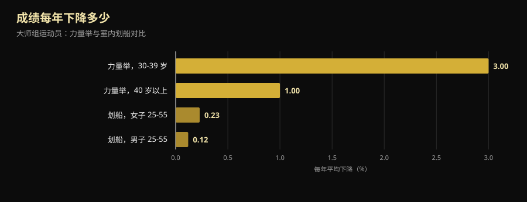
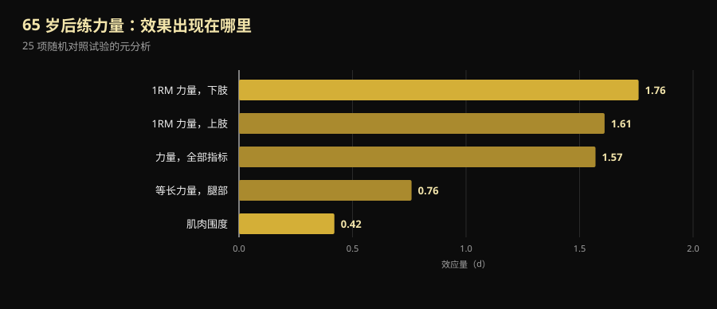

# 2026 大师组力量举世锦赛：它能教给 40 岁以上的人什么

四天后，里诺将举行一场世锦赛：台上最年轻的选手 40 岁，最年长的已过 70。下面是核实过的赛程，更重要的是，回答藏在后面的那个问题——随着年龄增长，力量到底会掉多少，又能找回多少。

作者：[Giammaria Loi](/autore/giammaria-loi) · 更新于 2026 年 10 月 10 日

## 要点速览

- **IPF Classic & Equipped 大师组世锦赛**于 2026 年 10 月 14 日至 25 日在内华达州里诺的 Reno Ballroom 举行：14 日技术会议，15 日至 24 日比赛，先无装备组、后装备组。
- 四个年龄组：**M1 40-49 岁、M2 50-59 岁、M3 60-69 岁、M4 70 岁及以上**，按自然年计算，而不是按生日。
- 力量下降得比耐力更早、更快，但速度并不恒定：**人生第四个十年每年约 –3%，之后约每年 –1%**。过了 40 岁，敌人不是那条曲线，而是停练。
- **70 岁依然能长肌肉。** 在研究得最细的一个案例里，一位 63 岁才开始训练的 70+ 组世界冠军，II 型肌纤维比同龄健康女性大 46%。
- **轻不等于更安全，只是效果更差。** 64-75 岁人群练一年大重量，四年后等长力量仍停在起点水平；中等强度组和对照组都下降了。

*一位大师组选手在自己的第一场力量举比赛中准备硬拉。图片：U.S. Air National Guard（Master Sgt. Charles Delano），Wikimedia Commons，公有领域。*

## 里诺的时间、地点与赛制

**2026 IPF Classic & Equipped 大师组世锦赛**由国际力量举联合会（IPF）与 Powerlifting America 共同主办，赛事总监为 Tamara Lopes。IPF 官方日历给出的窗口是 **2026 年 10 月 14-25 日**；官方邀请函把技术会议定在 10 月 14 日 20:00（Silver Legacy），比赛则在 10 月 15 日至 24 日，于内华达州里诺的 **Reno Ballroom** 进行。

出场顺序由年长到年轻：

| 日期 | 组别 | 年龄组 |
|---|---|---|
| 10 月 15-16 日 | 无装备 | M4（男女），随后 M3 |
| 10 月 17-18 日 | 无装备 | M2（男女） |
| 10 月 19-21 日 | 无装备 | M1（男女） |
| 10 月 22 日 | 装备 | M3 与 M4 |
| 10 月 23 日 | 装备 | M2 |
| 10 月 24 日 | 装备 | M1 |

"Classic"（无装备）指比赛时**不使用支撑类装备**：只允许腰带、护腕和普通护膝，不得使用蹲举服或卧推衫。"Equipped"（装备组）允许加强型比赛服，能举起更大的重量，但技术自成一套。

本次级别设置为男子 59、74、83、93、105、120 和 +120 公斤，女子 47、52、57、63、69、76、84 和 +84 公斤。报名**只能通过各国国家协会**，运动员无法自行报名：预报名截至 8 月 16 日，正式报名截至 2026 年 9 月 24 日。

有一个细节很说明这场比赛的分量：在 IPF，**这里的所有参赛者都被列为国际级运动员（International Level Athletes）**，适用与公开组相同的反兴奋剂规则。运动员和主教练必须随报名提交 WADA ADEL 课程证书，每位参赛者除 60 欧元报名费外还要缴纳 75 欧元反兴奋剂费用。大师组世锦赛不是缩水版世锦赛：规则相同，责任也相同。

2027 年的赛事已经确定：**加拿大圣约翰斯，10 月 7 日至 16 日**。

## 大师组年龄分组怎么算

IPF 的年龄组按**自然年**计算，而不是从生日当天算起。12 月满 50 岁的人，从那一年的 1 月 1 日起就已经是 M2。

| 组别 | 年龄 |
|---|---|
| M1 | 从满 40 岁那一年到满 49 岁那一年 |
| M2 | 从满 50 岁那一年到满 59 岁那一年 |
| M3 | 从满 60 岁那一年到满 69 岁那一年 |
| M4 | 从满 70 岁那一年起 |

这是一把横跨三十年生理变化的尺子。有意思的地方正是从这里开始。

*比赛中的深蹲：同一个动作、同一套判罚标准，从 14 岁到 70 岁以上都一样。图片：U.S. Army Reserve（Sgt. 1st Class Abel M. Aungst），Wikimedia Commons，公有领域。*

## 研究究竟怎么说

### "过了 40 岁力量就断崖式下跌" — **需要修正**

一项比较力量举与室内划船大师组运动员的研究量到了两件不同的事。力量表现确实比耐力更早、更快下滑，但速度不恒定：**人生第四个十年每年约 –3%，此后约每年 –1%**。在划船项目中，25 到 55 岁之间，男子年均下降 0.12%，女子 0.23%（Galloway 等，2002）。

*大师组运动员的年均成绩下降幅度。数据：Galloway 等，2002。*

两种解读，都成立。第一：力量是最先流失的素质，这正是必须训练它的理由。第二，也是励志帖不会说的：**曲线最陡的那一段在 40 岁之前**，不是之后。一位每年掉 1% 的 M2 选手，完全可以靠训练抵消好几年——这正是里诺台上看到的景象。

### "70 岁已经长不出肌肉了" — **已被推翻**

马斯特里赫特大学的团队把 70+ 组力量举世界冠军请进了实验室：71 岁，**63 岁才开始接触抗阻训练，此前没有任何系统训练经历**。与同龄健康女性相比，她的骨骼肌质量指数高 33%，股四头肌横截面积大 37%，II 型肌纤维（快肌，最先随年龄流失）大 46%，腿举力量高 36%，握力强 33%（Fuchs 等，2024）。

这是单个案例，也应当这样读：它不能证明人人都能在 71 岁拿世界冠军。它证明的是，一个 63 岁、从未训练过的人的肌肉**仍然会响应**——而且足以把她带到同龄人到不了的位置。

### "到了一定年纪就该练轻的" — **已被推翻**

丹麦的 LISA 试验把 451 名退休年龄的人随机分成三组：一年**大重量**训练、一年中等强度训练，或者不训练。随后随访四年。最终复测的 369 人（平均 71 岁，61% 为女性）中，**只有大重量组把腿部等长力量保持在了起点水平**（起初 149.7 牛·米，四年后 151.5 牛·米）。另外两组都下降了（Bloch-Ibenfeldt 等，2024）。

一年的大重量训练，换来了四年的力量保留。轻负荷训练没有。

### "70 岁练力量长肌肉跟 25 岁一样" — **需要修正**

针对平均年龄 65 岁以上人群、覆盖 25 项对照研究的权威元分析给出了两个差别很大的结果：**对力量的效应很大（d = 1.57），对肌肉围度的效应很小（d = 0.42）**。变化最明显的是下肢最大力量（d = 1.76）（Borde 等，2015）。

*65 岁以后抗阻训练的效应量（d）。数据：Borde 等，2015，25 项随机对照试验的元分析。*

换句话说：过了 65 岁，练力量会让你强很多、大一点。如果目标是从椅子上站起来、上楼梯、不摔倒，真正重要的是第一列。同一份分析里，对力量最有效的强度是**最大重量的 70-79%**，每周两练，每个动作 2-3 组，每组 7-9 次——这些数字离真正的力量房，比离"老年保健操"近得多。想看这些区间是怎么来的，可以读[增肌到底要做多少次](/zh/blog/duoshao-cishu-zengji)。

### "对体弱老人来说，练力量能解决一切" — **需要修正**

接下来是不太好听的部分。2025 年一项覆盖 24 项研究、951 名**确诊肌少症**老人的元分析发现，握力、步速和坐站测试都有统计学上的显著改善，但**低于最小临床重要差值**：改善真实、可测，患者在日常生活中却未必感觉得到（Yan 等，2025）。作者把最低有效剂量估在每周约 600 MET-分钟。

练，依然是对的选择。但谁要是承诺练力量能让一位肌少症的八旬老人回到三十岁，那他在卖东西。

### "关键是训练，蛋白质其次" — **需要修正**

在覆盖 74 项对照研究的元分析中，在训练之外提高蛋白质摄入确实能增加去脂体重，而门槛随年龄变化：**65 岁以上，每天每公斤体重 1.2-1.59 克就能看到效果**；65 岁以下则需要至少 1.6 克/公斤（Nunes 等，2022）。效应不大：蛋白质是训练的加法，不是替代。

补剂的情形更保守：在肌少症老人中，乳清蛋白配合抗阻训练对肌肉质量的效应很小（SMD 0.24），握力提高 2.31 公斤，但**证据确定性为低到极低**，差值也没有越过临床相关阈值（Cuyul-Vásquez 等，2023）。

*卧推是大师组选手流失最少的项目：65 岁以上人群的元分析显示，上肢力量同样有很大的效应。图片：U.S. Air Force（Airman 1st Class Jordan Gonzalez），Wikimedia Commons，公有领域。*

## 怎么落到自己身上

1. **不用换项目，换的是管理方式。** 过了 40 岁，动作还是那些动作。变的是你多久能冲一次极限，以及两次大重量训练之间需要多少时间。
2. **把重量放在有用的区间：最大重量的 70-79%。** 这是 65 岁以上人群中对力量效应最大的区间，没理由仅仅因为年龄就往下降。每周两练、2-3 组、7-9 次，是一个能坚持的起点。
3. **按年龄选对目标。** 过了 65 岁，训练在力量上的回报远大于围度。只照镜子评判，就会在它正在生效的时候断定它没用。
4. **先把蛋白质提上去，再考虑补剂。** 配合训练，从每天 1.2 克/公斤往上，是证据最扎实的那根杠杆。粉末方便，但不神奇。
5. **记重量，不要记感觉。** 每年 1% 的自然下滑，和因为安排不当造成的下滑，只有把几个月前后的数字摆在一起才分得清。凭感觉，两者一模一样。
6. **如果你 60 岁以后才开始，先从技术和可量化的重量入手**；有慢性病或正在恢复的伤，请让专业人士把计划过一遍。进步空间是真的；犯错的余地更窄。

> ### 💡 用 Nurvan
> **过了 40 岁，进步靠的不是感觉，是测量。** Nurvan 会记录每一组的重量、次数和 RIR——也就是这一组做完后你还剩几次——六个月后你就能看清，卧推是真的卡住了，还是只是碰上了状态差的一周。热身组由应用自动给出，这在五十岁不是小事；围度和体检结果也和训练计划放在同一个地方。已经有教练给的计划？可以从 PDF、Excel 甚至一张照片导入。[试用 Nurvan](https://nurvan.app)

## 常见问题

**力量举大师组从几岁开始能参赛？**
40 岁起。IPF 按自然年计算：满 40 岁那一年的 1 月 1 日进入 M1，之后 50 岁进 M2、60 岁进 M3、70 岁起进 M4。世锦赛报名始终通过本国协会提交，个人无法直接报名。

**过了 40 岁每年会掉多少力量？**
在大师组运动员的数据里，越过最陡的那一段（落在人生第四个十年）之后，下降幅度稳定在每年约 1%（Galloway 等，2002）。这是群体平均值：训练会让个体情况向两个方向大幅偏移。

**60 岁或 70 岁还能开始练力量吗？**
能，而且效果是可测的。记录最完整的案例是一位 63 岁零基础开始、后来拿到 70+ 组世界冠军的女性（Fuchs 等，2024）。不追求奖牌的人也一样：退休年龄练一年大重量，接下来的四年力量都保住了（Bloch-Ibenfeldt 等，2024）。如果有慢性病，请先让医生过目你的计划。

**65 岁以后是不是轻重量多次数更好？**
就力量而言不是。权威元分析中效应最大的强度是最大重量的 70-79%（Borde 等，2015），而在 LISA 试验里，四年后保住力量的只有大重量组。负荷要用时间堆起来，而不是出于原则回避。

## 延伸阅读

- [45 岁后不训练只吃肌酸：研究怎么说](/zh/blog/jirousuan-bu-jianshen-45sui)
- [增肌到底要做多少次：8-12 次的迷思](/zh/blog/duoshao-cishu-zengji)
- [训练分化：新手与进阶者的差别](/zh/blog/xunlian-fenhua-xinshou-gaoji)

## 参考文献

1. Galloway MT, Kadoko R, Jokl P, 2002. *Effect of aging on male and female master athletes' performance in strength versus endurance activities.* Am J Orthop (Belle Mead NJ) 31(2):93–98. PMID 11876284 — [pubmed.ncbi.nlm.nih.gov/11876284](https://pubmed.ncbi.nlm.nih.gov/11876284/)
2. Fuchs CJ, Trommelen J, Weijzen MEG, et al., 2024. *Becoming a World Champion Powerlifter at 71 Years of Age: It Is Never Too Late to Start Exercising.* Int J Sport Nutr Exerc Metab 34(4):223–231. PMID 38458181 — [doi:10.1123/ijsnem.2023-0230](https://doi.org/10.1123/ijsnem.2023-0230)
3. Bloch-Ibenfeldt M, Theil Gates A, Karlog K, Demnitz N, Kjaer M, Boraxbekk CJ, 2024. *Heavy resistance training at retirement age induces 4-year lasting beneficial effects in muscle strength: a long-term follow-up of an RCT.* BMJ Open Sport Exerc Med 10(2):e001899. PMID 38911477 — [doi:10.1136/bmjsem-2024-001899](https://doi.org/10.1136/bmjsem-2024-001899)
4. Borde R, Hortobágyi T, Granacher U, 2015. *Dose-Response Relationships of Resistance Training in Healthy Old Adults: A Systematic Review and Meta-Analysis.* Sports Med 45(12):1693–1720. PMID 26420238 — [doi:10.1007/s40279-015-0385-9](https://doi.org/10.1007/s40279-015-0385-9)
5. Yan R, Chen Y, Zhang R, He J, Lin W, Sun J, Li D, 2025. *Optimal resistance training prescriptions to improve muscle strength, physical function, and muscle mass in older adults diagnosed with sarcopenia: a systematic review and meta-analysis.* Aging Clin Exp Res 37(1):320. PMID 41212331 — [doi:10.1007/s40520-025-03235-w](https://doi.org/10.1007/s40520-025-03235-w)
6. Nunes EA, Colenso-Semple L, McKellar SR, et al., 2022. *Systematic review and meta-analysis of protein intake to support muscle mass and function in healthy adults.* J Cachexia Sarcopenia Muscle 13(2):795–810. PMID 35187864 — [doi:10.1002/jcsm.12922](https://doi.org/10.1002/jcsm.12922)
7. Cuyul-Vásquez I, Pezo-Navarrete J, Vargas-Arriagada C, et al., 2023. *Effectiveness of Whey Protein Supplementation during Resistance Exercise Training on Skeletal Muscle Mass and Strength in Older People with Sarcopenia.* Nutrients 15(15):3424. PMID 37571361 — [doi:10.3390/nu15153424](https://doi.org/10.3390/nu15153424)

文献信息与摘要取自 PubMed。赛事信息来自 [IPF/Powerlifting America 官方邀请函](https://www.powerlifting.sport/fileadmin/ipf/data/championships/informations/2026/masters/2026_IPF_World_Masters_Powerlifting_Championships_Invitation_USA-03.pdf)与 [IPF 官方日历](https://www.powerlifting.sport/championships/calendar)，均于 2026 年 10 月 10 日查阅。年龄组与级别设置依据 IPF 技术规则。本文不做任何赛果预测，也不评论具体参赛者。

---

**Giammaria Loi** 是 Nurvan 的创始人。他自 2012 年开始力量训练，2013 年起担任 FIPE 认证私人教练与教练，2018 年起在国家级别参加力量举比赛。他署名的每篇文章都从科学研究出发，最终落到健身房里真正有用的做法。

> 提示：本文为科普内容，不能替代医生或专业人士的意见。如果你有疾病、正在服药，或长期中断后重新开始训练，请在开始前让医生或合格的专业人士评估你的计划。
